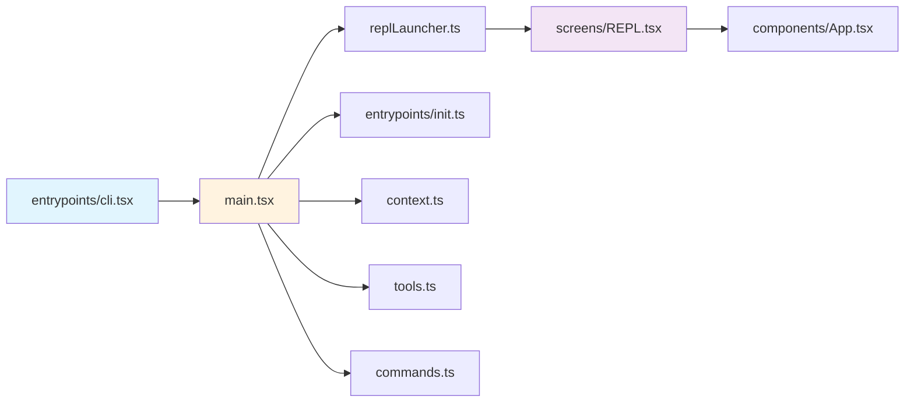
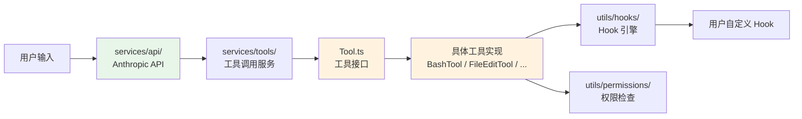
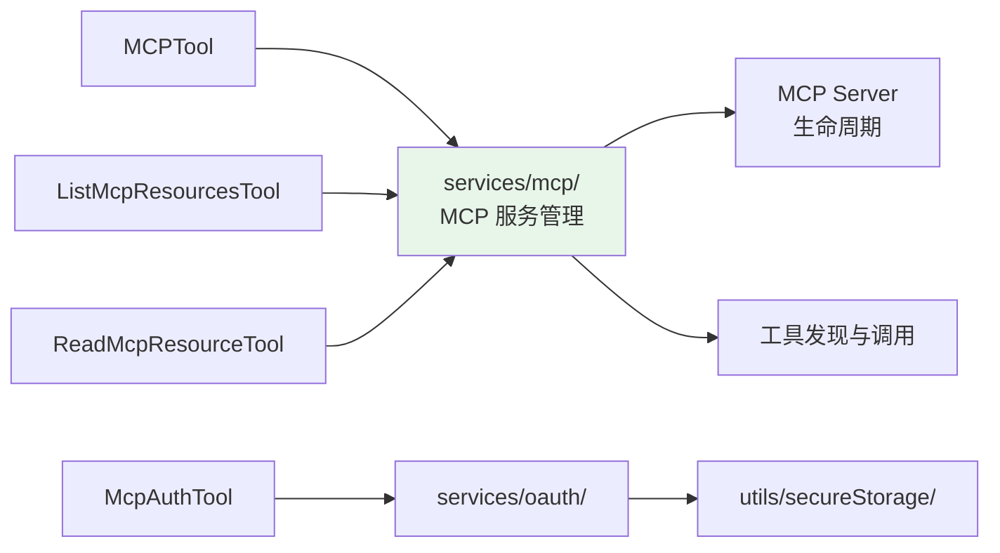
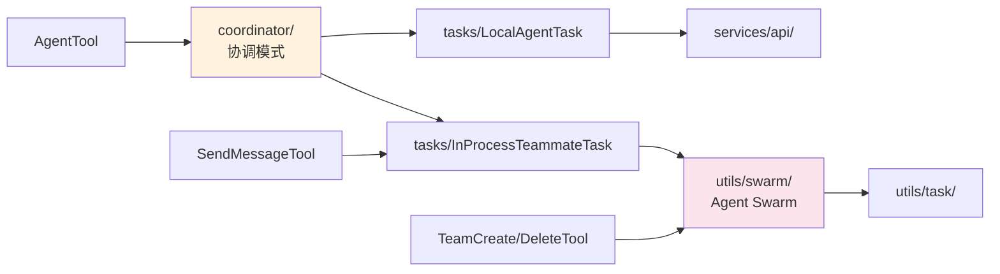
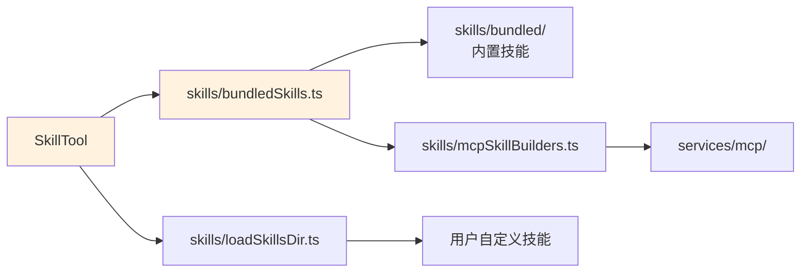

# Claude Code 包内模块依赖关系

> 基于 `@anthropic-ai/claude-code` v2.1.88 还原源码推理，仅供研究学习。

## 整体架构分层

Claude Code 采用 **分层架构**，自顶向下为：入口层 → 界面层 → 业务逻辑层 → 服务层 → 工具函数层。数据流大致为单向依赖，但存在少量 lazy require 打破循环依赖。

```mermaid
graph TB
    subgraph 入口层["入口层 (Entrypoints)"]
        CLI["entrypoints/cli.tsx<br/>CLI 入口"]
        MCP_ENTRY["entrypoints/mcp.ts<br/>MCP Server 入口"]
        SDK_ENTRY["entrypoints/sdk/<br/>SDK 入口"]
        INIT["entrypoints/init.ts<br/>初始化"]
    end

    subgraph 启动层["启动 & 配置"]
        MAIN["main.tsx<br/>CLI 主函数"]
        SETUP["setup.ts<br/>初始化设置"]
        CONTEXT["context.ts<br/>系统/用户上下文"]
        BOOTSTRAP["bootstrap/state.ts<br/>启动状态"]
    end

    subgraph 界面层["界面层 (UI)"]
        APP["components/App.tsx<br/>应用根组件"]
        REPL["screens/REPL.tsx<br/>主 REPL 界面"]
        MESSAGES["components/Messages.tsx<br/>消息列表"]
        PROMPT_INPUT["components/PromptInput/<br/>输入框"]
        MARKDOWN["components/Markdown.tsx<br/>Markdown 渲染"]
        STATUS_LINE["components/StatusLine.tsx<br/>状态栏"]
        DIFF_UI["components/StructuredDiff/<br/>Diff 显示"]
        DESIGN_SYS["components/design-system/<br/>设计系统"]
        INK["ink/<br/>Ink 渲染层扩展"]
    end

    subgraph 状态层["状态管理"]
        STATE["state/store.ts<br/>状态存储"]
        APP_STATE["state/AppState.tsx<br/>应用状态"]
        SELECTORS["state/selectors.ts<br/>状态选择器"]
        REACT_CTX["context/<br/>React Context"]
    end

    subgraph Hooks层["Hooks"]
        HOOKS["hooks/<br/>80+ React Hooks"]
        TOOL_PERM["hooks/toolPermission/<br/>工具权限"]
    end

    subgraph 命令层["命令系统"]
        COMMANDS_REG["commands.ts<br/>命令注册表"]
        CMD_COMMIT["/commit, /review<br/>Git 命令"]
        CMD_CONFIG["/config, /mcp<br/>配置命令"]
        CMD_SESSION["/resume, /session<br/>会话命令"]
        CMD_SKILLS["/skills, /plan<br/>技能/计划命令"]
        CMD_MISC["/help, /doctor, /vim<br/>其他命令"]
    end

    subgraph 工具层["工具系统 (40+ Tools)"]
        TOOLS_REG["tools.ts<br/>工具注册表"]
        TOOL_BASE["Tool.ts<br/>工具接口定义"]
        AGENT_TOOL["AgentTool<br/>子 Agent"]
        BASH_TOOL["BashTool / PowerShellTool<br/>Shell 执行"]
        FILE_TOOLS["FileRead/Edit/WriteTool<br/>文件操作"]
        SEARCH_TOOLS["GlobTool / GrepTool<br/>搜索工具"]
        WEB_TOOLS["WebFetchTool / WebSearchTool<br/>网络工具"]
        MCP_TOOL["MCPTool / McpAuthTool<br/>MCP 工具"]
        TASK_TOOLS["TaskCreate/Get/Update/...<br/>任务工具"]
        LSP_TOOL["LSPTool<br/>LSP 工具"]
        SKILL_TOOL["SkillTool<br/>技能工具"]
        PLAN_TOOLS["EnterPlanMode / ExitPlanMode<br/>计划模式"]
        WORKTREE_TOOLS["EnterWorktree / ExitWorktree<br/>Worktree 隔离"]
        TOOL_SHARED["tools/shared/<br/>工具共享逻辑"]
    end

    subgraph 任务层["后台任务"]
        LOCAL_AGENT["LocalAgentTask<br/>本地 Agent"]
        REMOTE_AGENT["RemoteAgentTask<br/>远程 Agent"]
        TEAMMATE_TASK["InProcessTeammateTask<br/>协作任务"]
        DREAM_TASK["DreamTask<br/>后台处理"]
        SHELL_TASK["LocalShellTask<br/>Shell 任务"]
    end

    subgraph 技能插件层["技能 & 插件"]
        SKILLS["skills/<br/>技能系统"]
        PLUGINS["plugins/<br/>插件系统"]
    end

    subgraph 协调层["多 Agent 协调"]
        COORDINATOR["coordinator/<br/>协调模式"]
    end

    subgraph 服务层["服务层 (Services)"]
        API["services/api/<br/>Anthropic API"]
        MCP_SVC["services/mcp/<br/>MCP 服务"]
        OAUTH["services/oauth/<br/>OAuth 认证"]
        ANALYTICS["services/analytics/<br/>特性开关/遥测"]
        LSP_SVC["services/lsp/<br/>LSP 集成"]
        COMPACT["services/compact/<br/>上下文压缩"]
        POLICY["services/policyLimits/<br/>策略限制"]
        REMOTE_SETTINGS["services/remoteManagedSettings/<br/>远程配置"]
        SESSION_MEMORY["services/SessionMemory/<br/>会话记忆"]
        VOICE_SVC["services/voice.ts<br/>语音服务"]
        TIPS["services/tips/<br/>提示系统"]
        TOKEN_EST["services/tokenEstimation.ts<br/>Token 估算"]
        TOOL_SVC["services/tools/<br/>工具调用服务"]
    end

    subgraph 桥接层["桥接 & 远程"]
        BRIDGE["bridge/<br/>桌面/Web 桥接"]
        REMOTE["remote/<br/>远程会话管理"]
    end

    subgraph 工具函数层["工具函数层 (Utils 200+)"]
        GIT_UTILS["utils/git.ts, git/<br/>Git 操作"]
        GITHUB_UTILS["utils/github/<br/>GitHub API"]
        AUTH_UTILS["utils/auth.ts<br/>认证"]
        SETTINGS_UTILS["utils/settings/<br/>设置读写"]
        PERM_UTILS["utils/permissions/<br/>权限检查"]
        SANDBOX_UTILS["utils/sandbox/<br/>沙箱隔离"]
        MODEL_UTILS["utils/model/<br/>模型选择"]
        SHELL_UTILS["utils/shell/, bash/, powershell/<br/>Shell 抽象"]
        HOOKS_UTILS["utils/hooks/<br/>Hook 引擎"]
        MCP_UTILS["utils/mcp/<br/>MCP 辅助"]
        MEMORY_UTILS["utils/memory/<br/>记忆文件"]
        TASK_UTILS["utils/task/<br/>任务管理"]
        SWARM_UTILS["utils/swarm/<br/>Agent Swarm"]
        TELEMETRY["utils/telemetry/<br/>遥测"]
        TOKENS["utils/tokens.ts<br/>Token 计算"]
        RIPGREP["utils/ripgrep.ts<br/>ripgrep 封装"]
        FILE_UTILS["utils/diff.ts, glob.ts, ...<br/>文件处理"]
        HTTP_UTILS["utils/http.ts, proxy.ts<br/>网络"]
        CRYPTO_UTILS["utils/crypto.ts<br/>加密"]
        SECURE_STORAGE["utils/secureStorage/<br/>Keychain"]
    end

    subgraph 类型层["类型定义"]
        TYPES["types/<br/>TypeScript 类型"]
        SCHEMAS["schemas/<br/>数据 Schema"]
        CONSTANTS["constants/<br/>常量"]
    end

    %% ===== 入口层依赖 =====
    CLI --> MAIN
    CLI --> INIT
    MCP_ENTRY --> MCP_SVC
    SDK_ENTRY --> API

    %% ===== 启动层依赖 =====
    MAIN --> CONTEXT
    MAIN --> SETUP
    MAIN --> TOOLS_REG
    MAIN --> COMMANDS_REG
    MAIN --> APP
    MAIN --> REPL
    MAIN --> API
    MAIN --> ANALYTICS
    MAIN --> POLICY
    MAIN --> REMOTE_SETTINGS
    MAIN --> BOOTSTRAP
    MAIN --> COORDINATOR
    MAIN --> AUTH_UTILS
    MAIN --> SETTINGS_UTILS

    %% ===== 界面层依赖 =====
    APP --> APP_STATE
    APP --> REACT_CTX
    REPL --> COMMANDS_REG
    REPL --> HOOKS
    REPL --> MESSAGES
    REPL --> PROMPT_INPUT
    REPL --> STATUS_LINE
    REPL --> BOOTSTRAP
    REPL --> SWARM_UTILS
    MESSAGES --> MARKDOWN
    MESSAGES --> DIFF_UI
    PROMPT_INPUT --> INK
    PROMPT_INPUT --> DESIGN_SYS

    %% ===== 状态依赖 =====
    APP_STATE --> STATE
    APP_STATE --> SELECTORS
    HOOKS --> APP_STATE
    HOOKS --> REACT_CTX

    %% ===== 命令层依赖 =====
    COMMANDS_REG --> CMD_COMMIT
    COMMANDS_REG --> CMD_CONFIG
    COMMANDS_REG --> CMD_SESSION
    COMMANDS_REG --> CMD_SKILLS
    COMMANDS_REG --> CMD_MISC
    CMD_COMMIT --> GIT_UTILS
    CMD_COMMIT --> GITHUB_UTILS
    CMD_CONFIG --> SETTINGS_UTILS
    CMD_CONFIG --> MCP_SVC
    CMD_SESSION --> BOOTSTRAP
    CMD_SKILLS --> SKILLS

    %% ===== 工具层依赖 =====
    TOOLS_REG --> TOOL_BASE
    TOOLS_REG --> AGENT_TOOL
    TOOLS_REG --> BASH_TOOL
    TOOLS_REG --> FILE_TOOLS
    TOOLS_REG --> SEARCH_TOOLS
    TOOLS_REG --> WEB_TOOLS
    TOOLS_REG --> MCP_TOOL
    TOOLS_REG --> TASK_TOOLS
    TOOLS_REG --> LSP_TOOL
    TOOLS_REG --> SKILL_TOOL
    TOOLS_REG --> PLAN_TOOLS
    TOOLS_REG --> WORKTREE_TOOLS

    AGENT_TOOL --> COORDINATOR
    AGENT_TOOL --> TOOL_SHARED
    BASH_TOOL --> SHELL_UTILS
    BASH_TOOL --> SANDBOX_UTILS
    BASH_TOOL --> HOOKS_UTILS
    FILE_TOOLS --> PERM_UTILS
    FILE_TOOLS --> FILE_UTILS
    SEARCH_TOOLS --> RIPGREP
    SEARCH_TOOLS --> FILE_UTILS
    WEB_TOOLS --> HTTP_UTILS
    MCP_TOOL --> MCP_SVC
    MCP_TOOL --> MCP_UTILS
    LSP_TOOL --> LSP_SVC
    SKILL_TOOL --> SKILLS
    TASK_TOOLS --> TASK_UTILS

    %% ===== 后台任务依赖 =====
    LOCAL_AGENT --> TOOL_SVC
    LOCAL_AGENT --> API
    REMOTE_AGENT --> REMOTE
    TEAMMATE_TASK --> SWARM_UTILS
    TEAMMATE_TASK --> COORDINATOR
    DREAM_TASK --> API
    SHELL_TASK --> SHELL_UTILS

    %% ===== 技能/插件依赖 =====
    SKILLS --> TOOL_BASE
    SKILLS --> MCP_UTILS
    PLUGINS --> TOOL_BASE

    %% ===== 服务层依赖 =====
    API --> HTTP_UTILS
    API --> AUTH_UTILS
    API --> TOKEN_EST
    API --> MODEL_UTILS
    MCP_SVC --> MCP_UTILS
    OAUTH --> HTTP_UTILS
    OAUTH --> SECURE_STORAGE
    OAUTH --> CRYPTO_UTILS
    ANALYTICS --> HTTP_UTILS
    LSP_SVC --> SHELL_UTILS
    COMPACT --> TOKENS
    COMPACT --> API
    POLICY --> API
    POLICY --> SETTINGS_UTILS
    SESSION_MEMORY --> MEMORY_UTILS
    SESSION_MEMORY --> API
    VOICE_SVC --> SHELL_UTILS
    TOKEN_EST --> TOKENS
    TOOL_SVC --> TOOL_BASE
    TOOL_SVC --> HOOKS_UTILS
    TOOL_SVC --> PERM_UTILS

    %% ===== 桥接层依赖 =====
    BRIDGE --> API
    BRIDGE --> BOOTSTRAP
    REMOTE --> HTTP_UTILS

    %% ===== 工具函数层互相依赖 =====
    AUTH_UTILS --> SECURE_STORAGE
    AUTH_UTILS --> HTTP_UTILS
    SETTINGS_UTILS --> SECURE_STORAGE
    SANDBOX_UTILS --> SHELL_UTILS
    SWARM_UTILS --> TASK_UTILS
    TELEMETRY --> HTTP_UTILS
    TELEMETRY --> AUTH_UTILS

    %% ===== 类型作为底层依赖 =====
    TOOL_BASE --> TYPES
    COMMANDS_REG --> TYPES
    STATE --> TYPES
    API --> SCHEMAS

    %% ===== 样式 =====
    classDef entry fill:#e1f5fe,stroke:#0288d1,stroke-width:2px
    classDef ui fill:#f3e5f5,stroke:#7b1fa2,stroke-width:2px
    classDef logic fill:#fff3e0,stroke:#ef6c00,stroke-width:2px
    classDef service fill:#e8f5e9,stroke:#2e7d32,stroke-width:2px
    classDef util fill:#fce4ec,stroke:#c62828,stroke-width:1px
    classDef state fill:#fffde7,stroke:#f9a825,stroke-width:2px
    classDef type fill:#eceff1,stroke:#546e6a,stroke-width:1px

    class CLI,MCP_ENTRY,SDK_ENTRY,INIT entry
    class APP,REPL,MESSAGES,PROMPT_INPUT,MARKDOWN,STATUS_LINE,DIFF_UI,DESIGN_SYS,INK ui
    class MAIN,SETUP,CONTEXT,BOOTSTRAP,COMMANDS_REG,TOOLS_REG,TOOL_BASE,COORDINATOR logic
    class API,MCP_SVC,OAUTH,ANALYTICS,LSP_SVC,COMPACT,POLICY,REMOTE_SETTINGS,SESSION_MEMORY,VOICE_SVC,TIPS,TOKEN_EST,TOOL_SVC service
    class GIT_UTILS,GITHUB_UTILS,AUTH_UTILS,SETTINGS_UTILS,PERM_UTILS,SANDBOX_UTILS,MODEL_UTILS,SHELL_UTILS,HOOKS_UTILS,MCP_UTILS,MEMORY_UTILS,TASK_UTILS,SWARM_UTILS,TELEMETRY,TOKENS,RIPGREP,FILE_UTILS,HTTP_UTILS,CRYPTO_UTILS,SECURE_STORAGE util
    class STATE,APP_STATE,SELECTORS,REACT_CTX state
    class TYPES,SCHEMAS,CONSTANTS type
```

## 核心依赖路径

### 1. 主启动链

### 2. 工具调用链

### 3. MCP 服务链

### 4. 多 Agent 协作链

### 5. 技能系统链

## 模块分层依赖矩阵

| 被依赖 ↓ / 依赖方 → | 入口层 | 界面层 | 命令层 | 工具层 | 任务层 | 服务层 | 工具函数层 |
|---|:---:|:---:|:---:|:---:|:---:|:---:|:---:|
| **入口层**         | - | - | - | - | - | - | - |
| **界面层**         | ✅ | ✅ | - | - | - | - | - |
| **命令层**         | ✅ | ✅ | - | - | - | - | - |
| **工具层**         | ✅ | - | - | ✅¹ | - | - | - |
| **任务层**         | - | ✅ | - | ✅ | - | - | - |
| **服务层**         | ✅ | ✅ | ✅ | ✅ | ✅ | ✅ | - |
| **状态管理**       | ✅ | ✅ | ✅ | ✅ | ✅ | - | - |
| **工具函数层**     | ✅ | ✅ | ✅ | ✅ | ✅ | ✅ | ✅ |
| **类型/常量**      | ✅ | ✅ | ✅ | ✅ | ✅ | ✅ | ✅ |

> ¹ 工具之间存在少量 lazy require 循环依赖（如 TeamCreateTool → tools.ts）

## 关键设计特征

1. **Lazy Require 打破循环**：`main.tsx` 中通过 `require()` 延迟加载 `teammate.ts`、`coordinatorMode.ts` 等模块；`tools.ts` 中延迟加载 `TeamCreateTool`、`SendMessageTool` 以避免循环依赖。

2. **Feature Flag 条件加载**：通过 `bun:bundle` 的 `feature()` 进行编译期死代码消除（DCE），如 `COORDINATOR_MODE`、`KAIROS`、`PROACTIVE`、`AGENT_TRIGGERS` 等 feature gate 控制模块是否打包。

3. **启动性能优化**：`main.tsx` 顶部并行预取 MDM 配置、Keychain 凭证、GrowthBook 特性开关，以减少串行等待。

4. **utils/ 是最大的扇出点**：200+ 工具函数被几乎所有上层模块依赖，是事实上的「基础设施层」。

5. **services/ 对 utils/ 单向依赖**：服务层调用工具函数层，反向不成立，保持了清晰的分层。

6. **React/Ink 渲染与业务逻辑分离**：`components/` 和 `screens/` 负责 UI，通过 `hooks/` 和 `state/` 桥接到业务逻辑，不直接调用 `services/`。
