# 主启动链 (Main Startup Chain) 子模块详细设计文档

## 文档信息

| 项目 | 内容 |
|------|------|
| 模块名称 | 主启动链 (Main Startup Chain) |
| 文档版本 | v1.0-20260401 |
| 生成日期 | 2026-04-01 |
| 生成方式 | 代码反向工程 |

## 1. 模块概述

### 1.1 模块职责

主启动链是 Claude Code CLI 应用从进程启动到交互式 REPL 界面完全就绪的完整引导路径。它负责解析命令行参数、执行快速路径分发、初始化系统配置与网络、加载工具和命令注册表、构建 React/Ink 组件树，最终将控制权交给交互式 REPL 循环。整个链路按 **"尽可能晚加载、尽可能早预取"** 的原则设计，通过动态 `import()` 和 `require()` 延迟加载、并行预取（MDM/Keychain/GrowthBook）等手段优化启动性能。

### 1.2 模块边界

**输入：**
- 用户命令行参数（`process.argv`）
- 系统环境变量（`process.env`）
- 配置文件（`settings.json`、`config.json`）
- OAuth 凭证（Keychain / 环境变量）

**输出：**
- 完整渲染的交互式 REPL 界面
- 初始化完毕的工具池（40+ 内置工具 + MCP 工具）
- 已注册的命令系统（70+ 斜杠命令）
- 系统/用户上下文（Git 状态、CLAUDE.md 内容、日期）

**与外部模块的交互边界：**
- `services/api/` — API 通信（预连接）
- `services/mcp/` — MCP 服务器连接与工具发现
- `services/analytics/` — GrowthBook 特性开关、遥测初始化
- `services/policyLimits/` — 策略限制加载
- `services/remoteManagedSettings/` — 远程托管配置
- `state/AppState.tsx` — 全局应用状态管理
- `utils/` — 200+ 工具函数（Git、认证、权限、Shell、设置等）
- `plugins/` — 插件系统初始化
- `skills/` — 技能系统注册

## 2. 架构设计

### 2.1 模块架构图

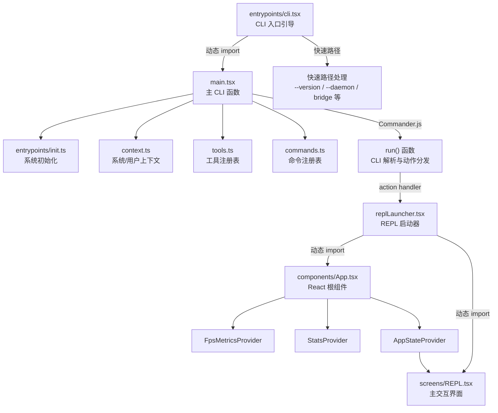

### 2.2 源文件组织

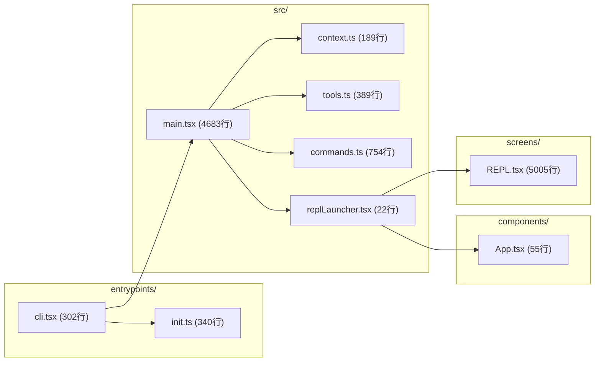

### 2.3 外部依赖

| npm 包 | 用途 |
|--------|------|
| `@commander-js/extra-typings` | CLI 命令行解析，定义选项、子命令和动作处理器 |
| `react` | 终端 UI 渲染框架（配合 Ink） |
| `chalk` | 终端文本着色 |
| `lodash-es/memoize` | 函数结果缓存（`getGitStatus`、`getSystemContext`、`COMMANDS` 等） |
| `lodash-es/uniqBy` | 工具去重（`assembleToolPool`） |
| `bun:bundle` | 编译期特性门控（`feature()` 宏，实现死代码消除） |
| `@opentelemetry/api` | 遥测度量接口（`Attributes`、`MetricOptions`） |
| `react/compiler-runtime` | React 编译器自动记忆化运行时 |

## 3. 数据结构设计

### 3.1 核心数据结构

#### AppWrapperProps（应用包装器属性）

定义于 `replLauncher.tsx:7-11`，用于向 `App` 组件传递初始化参数。

| 字段名 | 类型 | 说明 |
|--------|------|------|
| `getFpsMetrics` | `() => FpsMetrics \| undefined` | FPS 指标获取函数 |
| `stats` | `StatsStore \| undefined` | 统计存储实例（可选） |
| `initialState` | `AppState` | 应用初始状态 |

#### Props（App 组件属性）

定义于 `components/App.tsx:8-13`，扩展 `AppWrapperProps` 添加 `children`。

| 字段名 | 类型 | 说明 |
|--------|------|------|
| `getFpsMetrics` | `() => FpsMetrics \| undefined` | FPS 指标获取函数 |
| `stats` | `StatsStore \| undefined` | 统计存储实例 |
| `initialState` | `AppState` | 初始应用状态 |
| `children` | `React.ReactNode` | 子组件（REPL） |

#### Props（REPL 组件属性）

定义于 `screens/REPL.tsx:526-570`，REPL 组件的完整配置接口。

| 字段名 | 类型 | 说明 |
|--------|------|------|
| `commands` | `Command[]` | 可用斜杠命令列表 |
| `debug` | `boolean` | 调试模式开关 |
| `initialTools` | `Tool[]` | 初始工具列表 |
| `initialMessages` | `MessageType[]` | 初始消息（恢复会话时） |
| `pendingHookMessages` | `Promise<HookResultMessage[]>` | 延迟 Hook 消息 |
| `mcpClients` | `MCPServerConnection[]` | MCP 服务器连接 |
| `dynamicMcpConfig` | `Record<string, ScopedMcpServerConfig>` | 动态 MCP 配置 |
| `systemPrompt` | `string` | 自定义系统提示词 |
| `appendSystemPrompt` | `string` | 追加系统提示词 |
| `onBeforeQuery` | `(input, messages) => Promise<boolean>` | 查询前回调 |
| `onTurnComplete` | `(messages) => void \| Promise<void>` | 轮次完成回调 |
| `disabled` | `boolean` | 禁用输入 |
| `remoteSessionConfig` | `RemoteSessionConfig` | 远程会话配置 |
| `directConnectConfig` | `DirectConnectConfig` | 直连配置 |
| `sshSession` | `SSHSession` | SSH 会话 |
| `thinkingConfig` | `ThinkingConfig` | 思考模式配置 |
| `taskListId` | `string` | 任务列表 ID |
| `mainThreadAgentDefinition` | `AgentDefinition` | 主线程 Agent 定义 |
| `disableSlashCommands` | `boolean` | 禁用斜杠命令 |

#### Screen 类型

定义于 `screens/REPL.tsx:571`：`'prompt' | 'transcript'`，表示 REPL 的两种显示模式。

#### ToolPreset 类型

定义于 `tools.ts:163`：`'default'`，工具预设类型（当前仅支持默认预设）。

### 3.2 数据关系图

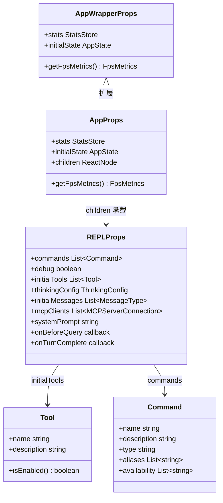

## 4. 接口设计

### 4.1 对外接口（export API）

#### entrypoints/cli.tsx

| 函数 | 签名 | 说明 |
|------|------|------|
| `main` | `() => Promise<void>` | CLI 入口，执行快速路径检查后动态加载 `main.tsx`。文件末尾以 `void main()` 调用启动 |

#### main.tsx

| 函数 | 签名 | 说明 |
|------|------|------|
| `startDeferredPrefetches` | `() => void` | REPL 首次渲染后启动后台预取（用户上下文、Git 状态、tips 等），`--bare` 模式下跳过 |
| `main` | `() => Promise<void>` | 主入口，设置安全环境变量、初始化 warning handler、处理深度链接，最终调用 `run()` |

#### entrypoints/init.ts

| 函数 | 签名 | 说明 |
|------|------|------|
| `init` | `() => Promise<void>` | memoized 初始化函数：启用配置、设置网络（mTLS/代理）、注册清理钩子、初始化遥测 promise |
| `initializeTelemetryAfterTrust` | `() => void` | 信任对话框接受后初始化遥测。远程设置用户等待设置加载后初始化；非合格用户立即初始化 |

内部函数：
- `doInitializeTelemetry()` (`init.ts:288-303`)：防重复的遥测初始化守卫
- `setMeterState()` (`init.ts:305-340`)：懒加载 OpenTelemetry 并创建 AttributedCounter

#### context.ts

| 函数 | 签名 | 说明 |
|------|------|------|
| `getSystemPromptInjection` | `() => string \| null` | 获取系统提示词注入值（缓存破坏用） |
| `setSystemPromptInjection` | `(value: string \| null) => void` | 设置注入值并立即清除上下文缓存 |
| `getGitStatus` | `() => Promise<string \| null>` | memoized，获取 Git 状态快照（分支、状态、最近提交、用户名） |
| `getSystemContext` | `() => Promise<Record<string, string>>` | memoized，系统上下文（Git 状态 + 缓存破坏注入） |
| `getUserContext` | `() => Promise<Record<string, string>>` | memoized，用户上下文（CLAUDE.md 内容 + 当前日期） |

#### tools.ts

| 函数 | 签名 | 说明 |
|------|------|------|
| `parseToolPreset` | `(preset: string) => ToolPreset \| null` | 解析工具预设字符串 |
| `getToolsForDefaultPreset` | `() => string[]` | 获取默认预设中已启用的工具名称列表 |
| `getAllBaseTools` | `() => Tools` | 获取所有可用工具（含特性门控），是工具列表的单一数据源 |
| `filterToolsByDenyRules` | `(tools, permissionContext) => T[]` | 按权限拒绝规则过滤工具 |
| `getTools` | `(permissionContext) => Tools` | 获取最终工具列表（简单模式 / REPL 模式 / 正常模式） |
| `assembleToolPool` | `(permissionContext, mcpTools) => Tools` | 组装内置工具 + MCP 工具池，按名称去重并排序 |
| `getMergedTools` | `(permissionContext, mcpTools) => Tools` | 获取内置 + MCP 工具合并列表（不去重） |
| `TOOL_PRESETS` | `readonly ['default']` | 工具预设常量数组 |
| `REPL_ONLY_TOOLS` | re-export from `REPLTool/constants.js` | REPL 模式独占工具名称集合 |
| `ALL_AGENT_DISALLOWED_TOOLS` | re-export from `constants/tools.js` | Agent 禁止使用的工具名称列表 |
| `CUSTOM_AGENT_DISALLOWED_TOOLS` | re-export from `constants/tools.js` | 自定义 Agent 禁止使用的工具名称列表 |
| `ASYNC_AGENT_ALLOWED_TOOLS` | re-export from `constants/tools.js` | 异步 Agent 允许使用的工具名称列表 |
| `COORDINATOR_MODE_ALLOWED_TOOLS` | re-export from `constants/tools.js` | 协调器模式允许的工具名称列表 |

#### commands.ts

| 函数 | 签名 | 说明 |
|------|------|------|
| `meetsAvailabilityRequirement` | `(cmd: Command) => boolean` | 检查命令是否满足可用性条件（认证提供者） |
| `getCommands` | `(cwd: string) => Promise<Command[]>` | 获取当前用户可用的所有命令（含技能、插件、工作流） |
| `clearCommandMemoizationCaches` | `() => void` | 清除命令 memoize 缓存（不含技能缓存） |
| `clearCommandsCache` | `() => void` | 清除所有命令相关缓存 |
| `getMcpSkillCommands` | `(mcpCommands) => Command[]` | 过滤 MCP 技能命令（prompt 类型） |
| `getSkillToolCommands` | memoized | 获取模型可调用的技能工具命令 |
| `getSlashCommandToolSkills` | memoized | 获取斜杠命令技能 |
| `filterCommandsForRemoteMode` | `(commands) => Command[]` | 过滤远程模式安全命令 |
| `findCommand` | `(name, commands) => Command \| undefined` | 按名称/别名查找命令 |
| `hasCommand` | `(name, commands) => boolean` | 检查命令是否存在 |
| `getCommand` | `(name, commands) => Command` | 获取命令（不存在时抛出 `ReferenceError`） |
| `isBridgeSafeCommand` | `(cmd: Command) => boolean` | 检查命令是否可通过 Bridge 安全执行 |
| `formatDescriptionWithSource` | `(cmd: Command) => string` | 格式化命令描述（附带来源标注） |
| `getCommandName` | re-export from `types/command.js` | 获取命令显示名称 |
| `isCommandEnabled` | re-export from `types/command.js` | 检查命令是否启用 |
| `INTERNAL_ONLY_COMMANDS` | `Command[]` | 内部专用命令列表（外部构建中移除） |
| `REMOTE_SAFE_COMMANDS` | `Set<Command>` | 远程模式安全命令集合 |
| `BRIDGE_SAFE_COMMANDS` | `Set<Command>` | Bridge 安全命令集合 |
| `builtInCommandNames` | memoized `() => Set<string>` | 内置命令名称集合（含别名） |
| `getSkillToolCommands` | memoized | 获取模型可调用的技能工具命令 |
| `getSlashCommandToolSkills` | memoized | 获取斜杠命令技能列表 |

#### replLauncher.tsx

| 函数 | 签名 | 说明 |
|------|------|------|
| `launchRepl` | `(root, appProps, replProps, renderAndRun) => Promise<void>` | 动态导入 App 和 REPL 组件，组装组件树并渲染 |

#### components/App.tsx

| 函数 | 签名 | 说明 |
|------|------|------|
| `App` | `(props: Props) => React.ReactNode` | 顶层 React 包装组件，提供 FPS、Stats、AppState 三层 Context Provider |

#### screens/REPL.tsx

| 函数/组件 | 签名 | 说明 |
|------|------|------|
| `REPL` | `(props: Props) => React.ReactNode` | 主交互界面组件，管理对话、工具调用、权限、任务等全部交互逻辑 |

### 4.2 Interface 定义与实现

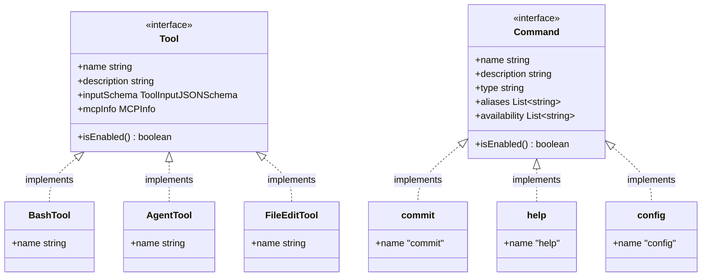

## 5. 核心流程设计

### 5.1 初始化流程

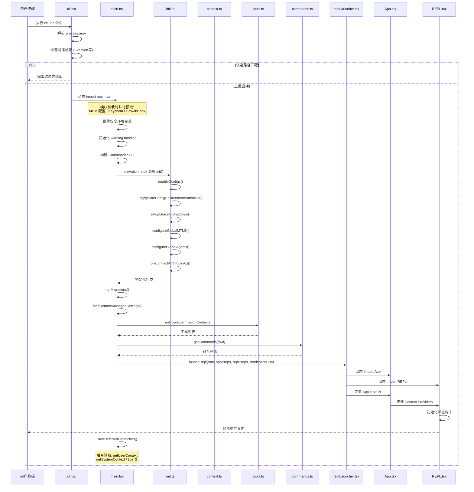

### 5.2 主处理流程 — 用户输入到模型响应

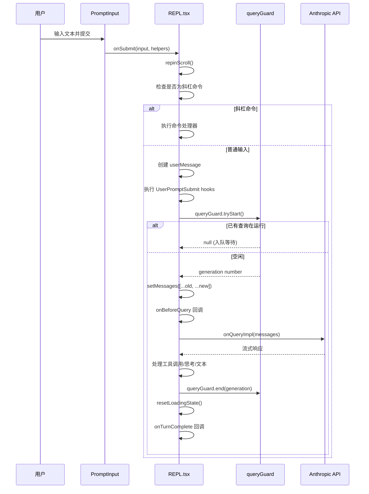

### 5.3 关键算法

#### 快速路径分发算法（cli.tsx）

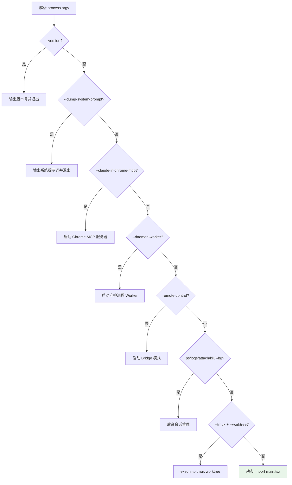

每个快速路径通过 `feature()` 编译期门控 + 运行时 `args` 检查实现。未匹配的参数 fall through 到完整 CLI 加载路径。设计目的是让 `--version` 等轻量操作零模块加载开销。

#### 工具池组装算法（tools.ts）

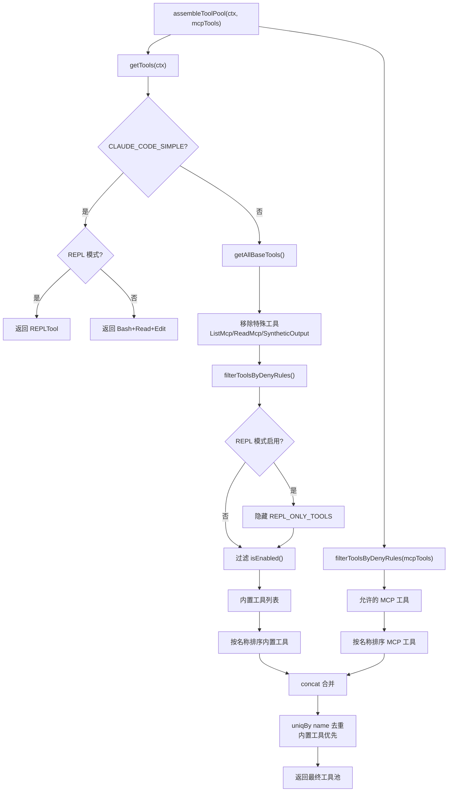

## 6. 状态管理

### 6.1 状态定义

主启动链涉及以下状态层次：

1. **模块级缓存状态**：通过 `lodash-es/memoize` 实现的函数级缓存
   - `init()` — 确保初始化仅执行一次
   - `getGitStatus` / `getSystemContext` / `getUserContext` — 会话级上下文缓存
   - `COMMANDS()` / `builtInCommandNames()` — 命令注册表缓存
   - `loadAllCommands()` — 按 `cwd` 缓存的命令加载结果

2. **进程级状态**：
   - `telemetryInitialized` (`init.ts:55`) — 遥测初始化守卫
   - `systemPromptInjection` (`context.ts:23`) — 缓存破坏注入值

3. **React 组件状态**（REPL 内部，参见第 5.2 节）：
   - `messages` — 对话消息列表
   - `isLoading` — 查询进行中标志（由 `queryGuard` 驱动）
   - `toolUseConfirmQueue` — 工具使用确认队列
   - `screen` — 当前屏幕模式（`'prompt'` | `'transcript'`）

### 6.2 状态转换图

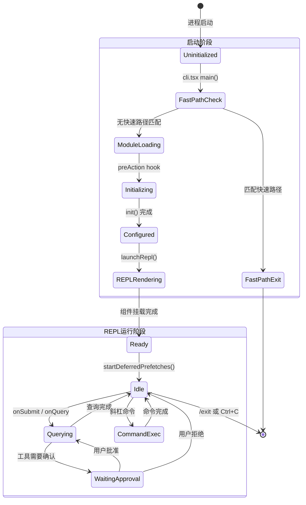

### 6.3 状态转换条件

| 当前状态 | 触发条件 | 目标状态 | 执行动作 |
|----------|----------|----------|----------|
| Uninitialized | `cli.tsx main()` 调用 | FastPathCheck | 解析 `process.argv` |
| FastPathCheck | `--version` / `--daemon` 等匹配 | FastPathExit | 执行快速路径处理器 |
| FastPathCheck | 无匹配 | ModuleLoading | 动态 `import('../main.js')` |
| ModuleLoading | Commander preAction 触发 | Initializing | 调用 `init()` |
| Initializing | `init()` 返回 | Configured | 网络/配置/遥测就绪 |
| Configured | `launchRepl()` 调用 | REPLRendering | 渲染 React 组件树 |
| Idle | 用户提交输入 | Querying | `queryGuard.tryStart()` |
| Querying | 工具需要权限确认 | WaitingApproval | 显示确认 UI |
| Querying | 模型响应完成 | Idle | `queryGuard.end()` + `resetLoadingState()` |

## 7. 错误处理设计

### 7.1 错误类型

| 错误类型 | 定义位置 | 说明 |
|----------|----------|------|
| `ConfigParseError` | `utils/errors.ts` | 配置文件解析失败（JSON 语法错误、schema 不匹配） |
| `ReferenceError` | `commands.ts:707` | 命令未找到时抛出 |
| `InvalidArgumentError` | `@commander-js/extra-typings` | Commander CLI 参数验证失败 |

### 7.2 错误处理策略

1. **配置错误**（`init.ts:215-237`）：`ConfigParseError` 被捕获后区分两种场景：
   - 非交互模式：输出错误到 stderr 并调用 `gracefulShutdownSync(1)` 退出
   - 交互模式：动态导入并显示 `InvalidConfigDialog` Ink 对话框

2. **遥测初始化失败**（`init.ts:247-286`）：采用 fire-and-forget 模式，错误仅记录到调试日志（`logForDebugging`），不阻塞主流程

3. **Git 命令失败**（`context.ts:104-110`）：try/catch 包裹，返回 `null` 而非抛出异常，确保非 Git 仓库中也能正常启动

4. **技能/插件加载失败**（`commands.ts:360-397`）：每个 `Promise.all` 成员单独 `.catch()`，记录错误后返回空数组，不影响其他命令源

5. **并发查询冲突**（`REPL.tsx:2866-2886`）：`queryGuard.tryStart()` 返回 `null` 时，将消息入队而非丢弃

### 7.3 错误传播链

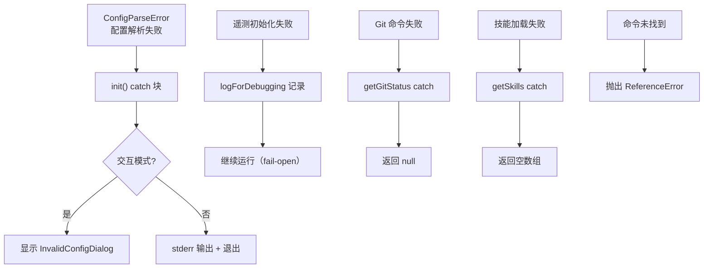

## 8. 并发设计

### 8.1 异步协调机制

主启动链大量使用并行异步操作来优化启动性能：

**模块加载时并行预取**（`main.tsx:9-20`）：
```
profileCheckpoint → startMdmRawRead() → startKeychainPrefetch()
```
三个操作在模块 import 阶段顺序触发，但各自内部是异步的，与后续 ~135ms 的模块加载并行执行。

**init() 中的 fire-and-forget**（`init.ts:94-200`）：
- `Promise.all([import(firstPartyEventLogger), import(growthbook)])` — 并行加载 1P 事件日志
- `void populateOAuthAccountInfoIfNeeded()` — 异步填充 OAuth 信息
- `void initJetBrainsDetection()` — 异步 IDE 检测
- `void detectCurrentRepository()` — 异步仓库检测

**Git 状态并行获取**（`context.ts:61-77`）：
```
Promise.all([getBranch(), getDefaultBranch(), git status, git log, git config user.name])
```
5 个 Git 命令并行执行，结果合并为上下文字符串。

**命令加载并行化**（`commands.ts:450-458`）：
```
Promise.all([getSkills(cwd), getPluginCommands(), getWorkflowCommands(cwd)])
```

**REPL 渲染后延迟预取**（`main.tsx:388-410`）：
`startDeferredPrefetches()` 在首次渲染后启动多个后台预取，避免阻塞用户看到界面。

### 8.2 查询并发控制

REPL 使用 `queryGuard` 状态机防止并发查询：
- `tryStart()` — 原子地检查并转换 `idle → running`，返回 generation number（或 `null` 表示忙）
- `end(generation)` — 检查 generation 匹配后转换 `running → idle`
- 被拒绝的查询通过 `enqueue()` 入队，在当前查询完成后自动处理

### 8.3 数据流图

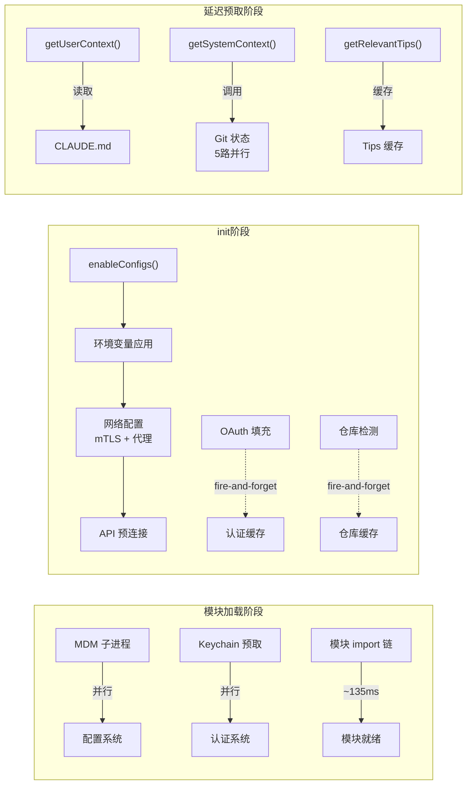

## 9. 设计约束与决策

### 9.1 设计模式

| 模式 | 应用位置 | 动机 |
|------|----------|------|
| **Memoize 缓存** | `init()`、`getGitStatus`、`getSystemContext`、`getUserContext`、`COMMANDS()`、`loadAllCommands()` | 避免重复执行昂贵的异步操作（文件 I/O、子进程、网络），保证会话内结果一致性 |
| **Builder 模式** | `main.tsx:902-1006` Commander 链式调用 | 声明式构建 CLI 选项和子命令 |
| **Provider 模式** | `App.tsx` 三层嵌套 Provider | React Context 向下传递 FPS、Stats、AppState |
| **Lazy Import** | `cli.tsx` 全部使用 `await import()`；`tools.ts`/`commands.ts` 使用 `require()` | 延迟加载减少启动时间；`require()` 用于打破循环依赖 |
| **Feature Flag (DCE)** | `feature()` 宏遍布 `cli.tsx`、`tools.ts`、`commands.ts` | 编译期死代码消除，外部构建不包含内部功能代码 |
| **Guard 模式** | `queryGuard` (`REPL.tsx:2869`) | 原子状态机防止并发查询 |
| **Fire-and-Forget** | `init.ts` 中多处 `void someAsyncFn()` | 非关键初始化不阻塞主流程 |

### 9.2 性能考量

1. **零导入快速路径**（`cli.tsx:37-42`）：`--version` 检查在任何 `import()` 之前执行，实现零模块加载的版本查询

2. **并行预取**（`main.tsx:9-20`）：MDM 子进程、Keychain 读取在模块顶部触发，与后续 ~135ms 的 import 并行执行

3. **延迟预取**（`main.tsx:388`）：`startDeferredPrefetches()` 在首次渲染后执行，避免阻塞 time-to-first-render

4. **API 预连接**（`init.ts:159`）：`preconnectAnthropicApi()` 在配置完成后立即触发 TCP+TLS 握手（~100-200ms），与后续逻辑并行

5. **React 编译器记忆化**（`App.tsx`）：使用 `react/compiler-runtime` 的 `_c()` 自动记忆化组件渲染

6. **`--bare` 模式跳过一切**：跳过 hooks、LSP、插件、CLAUDE.md 自动发现、后台预取等，最小化启动开销

7. **工具排序稳定性**（`tools.ts:354-366`）：内置工具和 MCP 工具分别排序后合并，保持 prompt cache 稳定性

### 9.3 扩展点

1. **工具注册**（`tools.ts:193-251`）：`getAllBaseTools()` 是工具注册的唯一入口，新工具通过添加到返回数组实现注册，支持特性门控条件注册

2. **命令注册**（`commands.ts:258-346`）：`COMMANDS()` 函数是内置命令注册入口，支持特性门控和条件包含

3. **多命令源**（`commands.ts:449-469`）：`loadAllCommands()` 并行加载 4 种命令源（内置、技能目录、插件、工作流），新命令源可通过扩展此函数添加

4. **MCP 工具集成**（`tools.ts:345-367`）：`assembleToolPool()` 将 MCP 工具无缝集成到工具池，MCP 服务器可以提供任意工具

5. **快速路径扩展**（`cli.tsx`）：新的快速路径只需在 `main()` 函数中添加一个 `if` 分支和对应的 `feature()` 门控

## 10. 设计评估

### 10.1 优点

1. **启动性能优化精细**：通过三阶段并行预取（模块加载期、init 期、渲染后）最大化利用等待时间。`cli.tsx:37-42` 的零导入快速路径和 `main.tsx:9-20` 的模块顶部 side-effect 预取是典型的性能工程实践

2. **职责分离清晰**：9 个文件各司其职——`cli.tsx` 只做分发、`init.ts` 只做初始化、`context.ts` 只做上下文、`tools.ts` 只做工具管理、`commands.ts` 只做命令管理、`replLauncher.tsx` 只做组件组装。层次分明，依赖方向一致

3. **Feature Flag DCE 架构成熟**：`feature()` 宏实现编译期死代码消除，内部功能代码不出现在外部构建中。在 `tools.ts:14-135` 和 `commands.ts:59-122` 中大量使用，确保外部构建体积最小

4. **错误处理容错性好**：`init.ts` 中遥测/OAuth/仓库检测等非关键路径全部 fire-and-forget；`commands.ts:360-397` 中技能加载失败不影响其他命令源；`context.ts:104-110` 中 Git 命令失败返回 `null` 而非崩溃

5. **循环依赖处理有方法论**：`tools.ts:62-72` 和 `main.tsx:70-77` 使用 `require()` lazy load 打破循环依赖，有统一的注释说明依赖链路

6. **REPL 消息状态管理精巧**：`REPL.tsx:1198-1222` 的 `setMessages` 包装器采用 Zustand 模式（ref 是数据源，React state 是渲染投影），确保同步读取始终获得最新值

### 10.2 缺点与风险

1. **main.tsx 过于庞大**：4683 行的单文件包含了 CLI 构建、参数解析、认证流程、MCP 初始化、插件加载、REPL 启动等大量逻辑。`run()` 函数从 `main.tsx:884` 开始，`action handler` 从 `main.tsx:1006` 开始，横跨数千行，难以维护

2. **REPL.tsx 超大组件**：5005 行的 REPL 组件包含 50+ 个 `useState`/`useRef`/`useCallback`/`useEffect` 钩子（`REPL.tsx:572-640` 区域密集出现），远超 React 组件的合理规模。状态管理、查询逻辑、UI 渲染混杂在一个函数中

3. **`any` 类型使用**：`main.tsx:256` 中 `(global as any).require('inspector')` 使用了 `any` 类型断言绕过类型检查

4. **process.exit 直接调用**：`main.tsx:605`（SIGINT handler）和 `cli.tsx:221`（模板任务完成后）直接调用 `process.exit()`，绕过了优雅关闭流程，可能导致资源泄漏

5. **命令查找线性扫描**：`commands.ts:692-697` 的 `findCommand()` 对命令数组进行线性扫描（`Array.find`），在 70+ 命令的规模下效率不高（每次用户输入斜杠命令时调用）

6. **memoize 缓存清除不统一**：`commands.ts:523-539` 中 `clearCommandMemoizationCaches()` 和 `clearCommandsCache()` 两个函数职责有重叠，调用方需要知道何时用哪个。`context.ts:32-33` 使用 `?.` 可选链清除缓存，说明 memoize 实现的 `cache.clear` 并非总是存在

### 10.3 改进建议

1. **拆分 main.tsx**：将 `run()` 函数中的 Commander 构建逻辑提取到 `cli/commandBuilder.ts`，将 action handler 中的初始化和准备逻辑提取到 `cli/setup.ts`，使 `main.tsx` 仅保留顶层编排。解决 10.2 第 1 条

2. **拆分 REPL.tsx**：将查询执行逻辑（`onQuery`/`onQueryImpl`/`onSubmit`）提取为自定义 hook `useQueryEngine`；将消息状态管理提取为 `useMessageState`；将工具确认队列提取为 `useToolConfirmation`。解决 10.2 第 2 条

3. **命令查找优化**：在 `COMMANDS()` 返回后构建 `Map<string, Command>`（名称和别名均作为键），将 `findCommand` 从 O(n) 改为 O(1)。解决 10.2 第 5 条

4. **统一缓存管理**：为所有 memoized 函数创建统一的缓存注册表，提供 `clearAllCaches()` 和按类别清除的方法，避免调用方需要了解各个缓存的清除函数。解决 10.2 第 6 条

5. **替代 process.exit**：在 SIGINT handler 和模板完成路径中使用 `gracefulShutdownSync()` 替代 `process.exit()`，确保清理钩子被执行。解决 10.2 第 4 条
