# 工具调用链 子模块详细设计文档

## 文档信息
| 项目 | 内容 |
|------|------|
| 模块名称 | 工具调用链 (Tool Call Chain) |
| 文档版本 | v1.0-20260401 |
| 生成日期 | 2026-04-01 |
| 生成方式 | 代码反向工程 |

## 1. 模块概述

### 1.1 模块职责

工具调用链是 Claude Code 的核心执行管线，负责将 LLM 产出的工具调用请求（`tool_use` 块）转化为实际操作并返回结果。该链条横跨四个层次：**工具接口与注册**（`Tool.ts`/`tools.ts`）定义工具的统一契约和注册表；**工具执行服务**（`services/tools/`）负责编排、权限校验、钩子调用和实际执行；**Hook 引擎**（`utils/hooks/`）在工具执行前后注入用户自定义逻辑；**权限系统**（`utils/permissions/`）提供多层次的安全访问控制。

### 1.2 模块边界

**输入**：
- Anthropic API 返回的 `ToolUseBlock[]`（工具名称 + 输入参数）
- `ToolUseContext`（全局上下文：可用工具列表、权限配置、中止控制器、应用状态等）
- `CanUseToolFn`（交互式权限询问回调）

**输出**：
- `Message[]`（工具结果消息，含 `tool_result` 类型的 `ContentBlockParam`）
- 更新后的 `ToolUseContext`（通过 `contextModifier` 传播工具副作用）

**与外部模块的交互**：
- **上游**：`services/api/`（Anthropic API 通信层）提供 `ToolUseBlock`
- **下游**：各具体工具实现（`tools/BashTool`、`tools/FileEditTool` 等 40+ 个工具目录）
- **横向**：`services/analytics/`（遥测事件记录）、`services/mcp/`（MCP 工具集成）、`state/AppState`（全局状态读写）

## 2. 架构设计

### 2.1 模块架构图

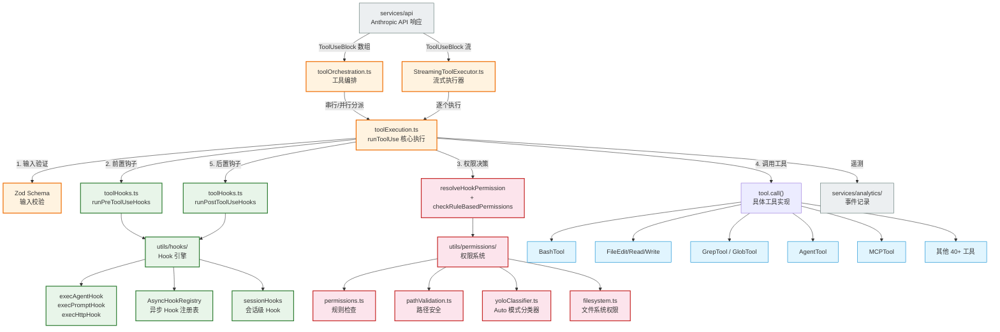

### 2.2 源文件组织

```mermaid
graph LR
    subgraph ToolDef["工具定义层"]
        TOOL_TS["Tool.ts (792行)<br/>核心接口+工厂"]
        TOOLS_TS["tools.ts (389行)<br/>注册表+组装"]
    end

    subgraph SvcTools["services/tools/ (执行服务层)"]
        ORCH_TS["toolOrchestration.ts (188行)<br/>编排入口"]
        EXEC_TS["toolExecution.ts (1745行)<br/>核心执行逻辑"]
        HOOKS_TS["toolHooks.ts (650行)<br/>前后置钩子调用"]
        STREAM_TS["StreamingToolExecutor.ts (530行)<br/>流式并发执行器"]
    end

    subgraph Shared["tools/shared/ (共享逻辑)"]
        GIT_TRACK["gitOperationTracking.ts (277行)"]
        SPAWN["spawnMultiAgent.ts (1093行)"]
    end

    subgraph UtilHooks["utils/hooks/ (17个文件, 3371行)"]
        HOOK_EXEC["execAgentHook / execPromptHook / execHttpHook"]
        HOOK_REG["AsyncHookRegistry / sessionHooks"]
        HOOK_CFG["hooksConfigManager / hooksSettings"]
        HOOK_EVT["hookEvents / hookHelpers"]
        HOOK_SEC["ssrfGuard / fileChangedWatcher"]
    end

    subgraph UtilPerms["utils/permissions/ (24个文件, 8000+行)"]
        PERM_CORE["permissions.ts / permissionSetup.ts"]
        PERM_TYPE["PermissionMode / PermissionResult / PermissionRule"]
        PERM_FS["filesystem.ts / pathValidation.ts"]
        PERM_CLASS["yoloClassifier / bashClassifier"]
        PERM_UPDATE["PermissionUpdate / permissionsLoader"]
    end

    TOOL_TS --> TOOLS_TS
    TOOLS_TS --> ORCH_TS
    ORCH_TS --> EXEC_TS
    EXEC_TS --> HOOKS_TS
    EXEC_TS --> STREAM_TS
    HOOKS_TS --> UtilHooks
    EXEC_TS --> UtilPerms
```

### 2.3 外部依赖

| npm 包 | 用途 | 使用位置 |
|--------|------|---------|
| `@anthropic-ai/sdk` | Claude API SDK 类型（`ToolUseBlock`、`ToolResultBlockParam` 等） | Tool.ts, toolExecution.ts |
| `zod/v4` | 输入 Schema 验证 | Tool.ts, hookHelpers.ts |
| `bun:bundle` | 编译期特性开关（`feature()` 函数） | tools.ts, yoloClassifier.ts |
| `lodash-es` | `uniqBy` 去重、`memoize` 缓存 | tools.ts, hooksConfigSnapshot.ts |
| `axios` | HTTP Hook 的 POST 请求 | execHttpHook.ts |
| `chokidar` | 文件变化监听（FileChanged 事件） | fileChangedWatcher.ts |
| `ignore` | .gitignore 模式匹配 | filesystem.ts |
| `react` | React Hooks（权限 UI） | bypassPermissionsKillswitch.ts |

## 3. 数据结构设计

### 3.1 核心数据结构

#### Tool\<Input, Output, P\> — 工具接口

工具系统的核心契约类型，定义于 `Tool.ts:362-695`。每个工具实现必须满足此接口。

| 字段/方法 | 类型 | 说明 |
|-----------|------|------|
| `name` | `string` | 工具唯一名称 |
| `aliases` | `string[]` | 兼容性别名 |
| `inputSchema` | `Input (Zod Schema)` | 输入验证 Schema |
| `inputJSONSchema` | `ToolInputJSONSchema` | MCP 工具的 JSON Schema |
| `outputSchema` | `z.ZodType<unknown>` | 输出验证 Schema |
| `call()` | `(args, context, canUseTool, parentMessage, onProgress?) => Promise<ToolResult<Output>>` | 执行工具 |
| `description()` | `(input, options) => Promise<string>` | 生成工具描述 |
| `prompt()` | `(input, options) => Promise<string>` | 生成系统提示词 |
| `checkPermissions()` | `(input, context) => Promise<PermissionResult>` | 工具自有权限检查 |
| `isConcurrencySafe()` | `(input) => boolean` | 是否可并发执行 |
| `isReadOnly()` | `(input) => boolean` | 是否只读操作 |
| `isDestructive()` | `(input) => boolean` | 是否不可逆操作 |
| `isEnabled()` | `() => boolean` | 是否启用 |
| `interruptBehavior()` | `() => 'cancel' \| 'block'` | 用户中断时的行为 |
| `validateInput()` | `(input, context) => Promise<ValidationResult>` | 自定义输入验证 |
| `mapToolResultToToolResultBlockParam()` | `(data, toolUseID) => ToolResultBlockParam` | 结果映射为 API 格式 |
| `maxResultSizeChars` | `number` | 结果最大字符数 |
| `isMcp` | `boolean` | 是否为 MCP 工具 |
| `shouldDefer` | `boolean` | 是否延迟加载 |
| `render*()` | 15 个渲染方法 | UI 渲染回调 |

#### ToolUseContext — 工具执行上下文

定义于 `Tool.ts:158-300`，贯穿整个调用链的上下文对象。

| 字段 | 类型 | 说明 |
|------|------|------|
| `options.tools` | `Tools` | 可用工具列表 |
| `options.commands` | `Command[]` | 可用命令列表 |
| `options.mcpClients` | `MCPServerConnection[]` | MCP 服务器连接 |
| `options.thinkingConfig` | `ThinkingConfig` | 思考模式配置 |
| `options.isNonInteractiveSession` | `boolean` | 是否非交互式会话 |
| `abortController` | `AbortController` | 中止信号 |
| `messages` | `Message[]` | 历史消息列表 |
| `getAppState()` | `() => AppState` | 获取应用状态 |
| `setAppState()` | `SetAppState` | 设置应用状态 |
| `setInProgressToolUseIDs()` | `(updater) => void` | 更新执行中工具 ID |
| `toolDecisions` | `Map<string, DecisionInfo>` | 工具权限决策记录 |
| `queryTracking` | `QueryChainTracking` | 查询链追踪 |
| `readFileState` | `FileStateCache` | 文件状态缓存 |
| `fileReadingLimits` | `{maxTokens?, maxSizeBytes?}` | 文件读取限制 |

#### ToolResult\<T\> — 工具返回值

定义于 `Tool.ts:321-336`。

| 字段 | 类型 | 说明 |
|------|------|------|
| `data` | `T` | 工具输出数据 |
| `newMessages` | `Message[]` | 附带的额外消息 |
| `contextModifier` | `(ctx: ToolUseContext) => ToolUseContext` | 上下文修改器 |
| `mcpMeta` | `object` | MCP 元数据 |

#### PermissionDecision — 权限决策

定义于 `types/permissions.ts`，在 `PermissionResult.ts` 中重导出。

| 变体 | 行为 | 关键字段 |
|------|------|---------|
| `PermissionAllowDecision` | `'allow'` | `updatedInput`, `updatedPermissions`, `acceptFeedback`, `userModified` |
| `PermissionDenyDecision` | `'deny'` | `message`, `decisionReason` |
| `PermissionAskDecision` | `'ask'` | `message`, `decisionReason`, `contentBlocks` |

#### StreamingToolExecutor 内部类型

**TrackedTool**（`StreamingToolExecutor.ts:20-31`）：

| 字段 | 类型 | 说明 |
|------|------|------|
| `id` | `string` | 工具使用 ID |
| `block` | `ToolUseBlock` | API 工具块 |
| `assistantMessage` | `AssistantMessage` | 关联的助手消息 |
| `status` | `ToolStatus` | `'queued' \| 'executing' \| 'completed' \| 'yielded'` |
| `isConcurrencySafe` | `boolean` | 是否可并发 |
| `results` | `Message[]` | 收集的结果消息 |
| `pendingProgress` | `Message[]` | 待处理进度消息 |
| `contextModifiers` | `Array<(ctx) => ctx>` | 上下文修改器列表 |

### 3.2 数据关系图

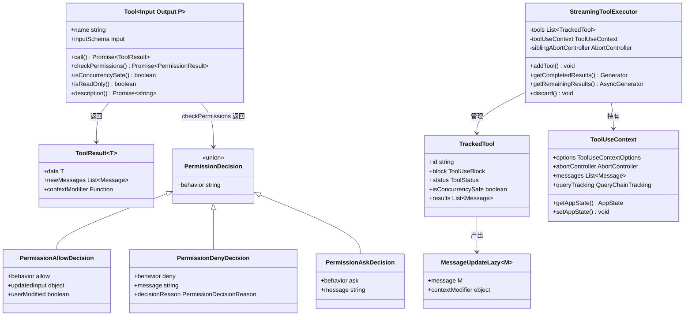

## 4. 接口设计

### 4.1 对外接口（export API）

#### runTools() — 工具编排入口

- **位置**：`toolOrchestration.ts:19-82`
- **签名**：`async function* runTools(toolUseMessages: ToolUseBlock[], assistantMessages: AssistantMessage[], canUseTool: CanUseToolFn, toolUseContext: ToolUseContext): AsyncGenerator<MessageUpdate, void>`
- **功能**：将工具调用请求按并发安全性分区为批次，并发安全工具并行执行，非并发安全工具串行执行
- **参数**：
  - `toolUseMessages`：API 返回的工具调用块数组
  - `assistantMessages`：关联的助手消息
  - `canUseTool`：交互式权限询问回调
  - `toolUseContext`：工具执行上下文
- **返回**：异步生成器，逐步产出 `MessageUpdate`（结果消息 + 更新后的上下文）

#### runToolUse() — 单工具执行入口

- **位置**：`toolExecution.ts:337-489`
- **签名**：`async function* runToolUse(toolUse: ToolUseBlock, assistantMessage: AssistantMessage, canUseTool: CanUseToolFn, toolUseContext: ToolUseContext): AsyncGenerator<MessageUpdateLazy, void>`
- **功能**：执行单个工具的完整生命周期：查找工具 → 输入验证 → 前置钩子 → 权限检查 → tool.call() → 后置钩子 → 返回结果
- **参数**：同上，但处理单个 `ToolUseBlock`

#### buildTool() — 工具工厂函数

- **位置**：`Tool.ts:783-792`
- **签名**：`function buildTool<D extends AnyToolDef>(def: D): BuiltTool<D>`
- **功能**：将部分工具定义（`ToolDef`）转换为完整的 `Tool` 对象，填充默认值
- **默认值**：`isEnabled` → `true`、`isConcurrencySafe` → `false`、`isReadOnly` → `false`、`checkPermissions` → `allow`

#### getAllBaseTools() — 获取全部内置工具

- **位置**：`tools.ts:193-251`
- **签名**：`function getAllBaseTools(): Tool[]`
- **功能**：返回所有内置工具数组（33 个静态导入 + 条件导入的动态工具）

#### getTools() — 获取当前可用工具

- **位置**：`tools.ts:271-327`
- **签名**：`function getTools(permissionContext: ToolPermissionContext): Tool[]`
- **功能**：根据权限上下文过滤工具（应用拒绝规则、模式过滤、REPL 过滤）

#### assembleToolPool() — 组装完整工具池

- **位置**：`tools.ts:345-367`
- **签名**：`function assembleToolPool(permissionContext: ToolPermissionContext, mcpTools: Tool[]): Tool[]`
- **功能**：合并内置工具和 MCP 工具，按名称去重

#### resolveHookPermissionDecision() — Hook 权限决策解析

- **位置**：`toolHooks.ts:332-433`
- **签名**：`async function resolveHookPermissionDecision(hookPermissionResult, tool, input, toolUseContext, canUseTool, assistantMessage, toolUseID): Promise<{decision, input}>`
- **功能**：将 PreToolUse Hook 的权限结果与规则系统协调，确保 Hook 的 `allow` 不会绕过 `deny`/`ask` 规则

#### checkRuleBasedPermissions() — 基于规则的权限检查

- **位置**：`permissions.ts:1071-1156`
- **签名**：`async function checkRuleBasedPermissions(tool: Tool, input, context: ToolUseContext): Promise<PermissionAskDecision | PermissionDenyDecision | null>`
- **功能**：按优先级依次检查拒绝规则、询问规则、工具自有权限、安全检查

### 4.2 Interface 定义与实现

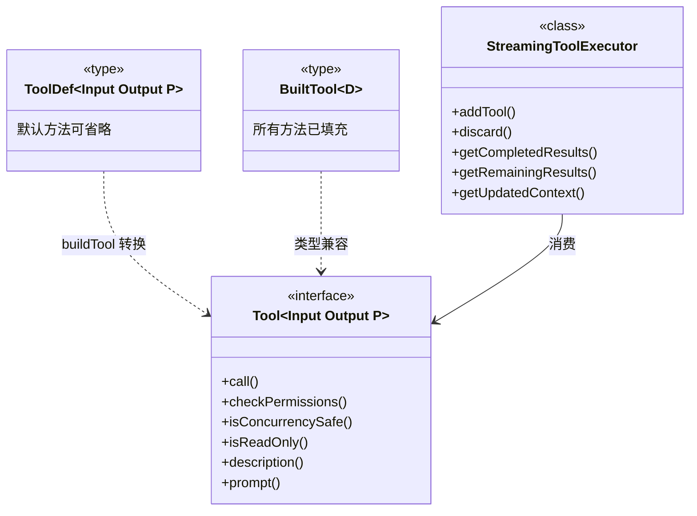

## 5. 核心流程设计

### 5.1 初始化流程

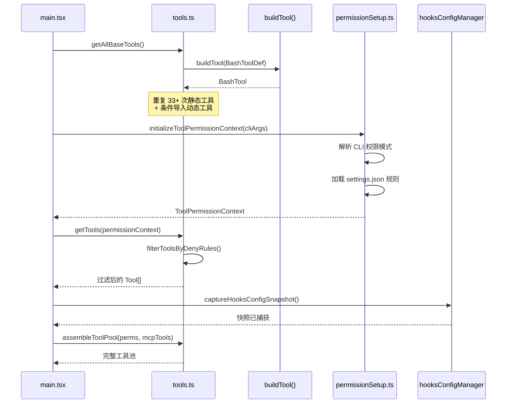

### 5.2 主处理流程 — 工具编排

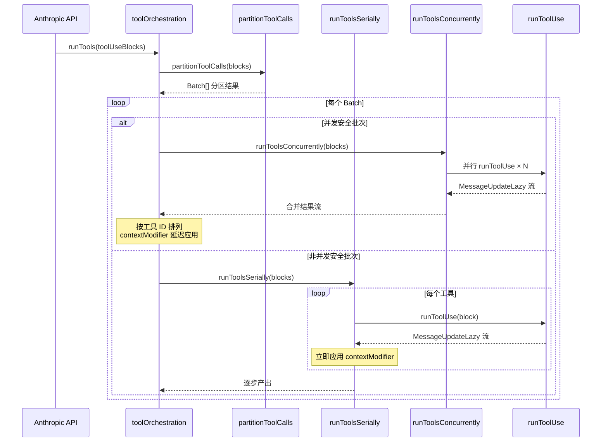

### 5.3 主处理流程 — 单工具执行

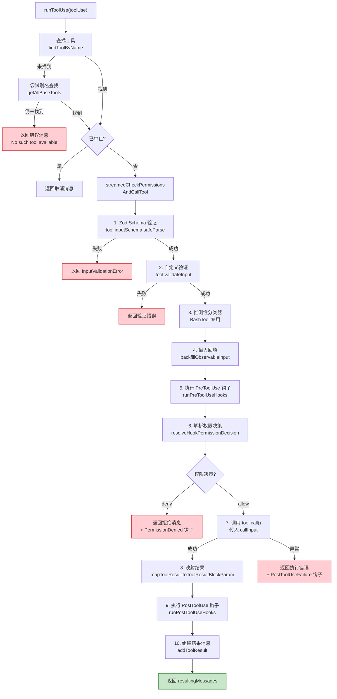

### 5.4 流式执行器流程

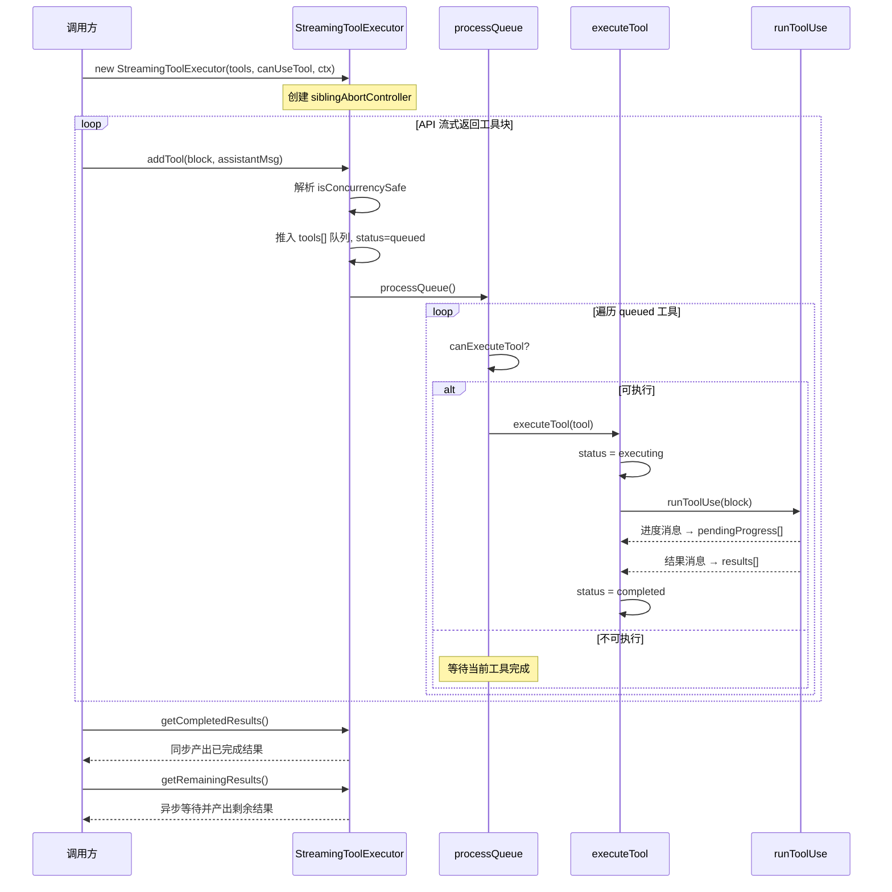

### 5.5 关键算法 — 工具分区

`partitionToolCalls` (`toolOrchestration.ts:91-116`) 将工具调用按并发安全性分组为批次。

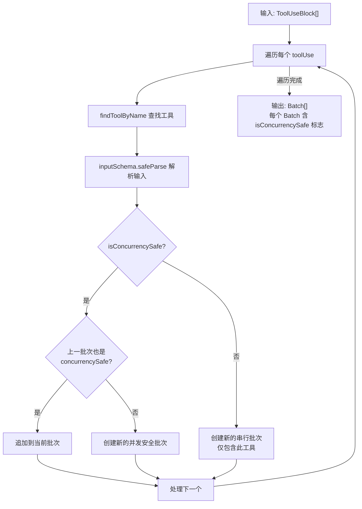

**算法特征**：
- 时间复杂度：O(n)，n 为工具调用数
- 连续的并发安全工具会合并为一个批次
- 非并发安全工具单独成批
- `isConcurrencySafe` 判断失败时保守地视为不安全

## 6. 状态管理

### 6.1 状态定义

工具调用链涉及以下状态维度：

| 状态 | 位置 | 说明 |
|------|------|------|
| 工具执行状态 | `TrackedTool.status` | `queued → executing → completed → yielded` |
| 中止状态 | `ToolUseContext.abortController.signal` | 全局中止信号 |
| 兄弟中止状态 | `StreamingToolExecutor.siblingAbortController` | Bash 错误级联 |
| 权限模式 | `AppState.toolPermissionContext.mode` | `default \| plan \| acceptEdits \| bypassPermissions \| auto` |
| 进行中工具集 | `ToolUseContext.inProgressToolUseIDs` | `Set<string>` |
| Hook 异步注册表 | `AsyncHookRegistry.pendingHooks` | `Map<string, PendingAsyncHook>` |
| 会话 Hook 存储 | `AppState.sessionHooks` | `Map<string, SessionStore>` |
| 自动模式状态 | `autoModeState` 模块变量 | `active / flagCli / circuitBroken` |
| 拒绝追踪 | `DenialTrackingState` | 连续拒绝计数器 |

### 6.2 状态转换图

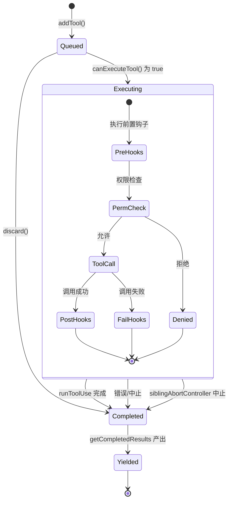

### 6.3 状态转换条件

| 当前状态 | 触发条件 | 目标状态 | 执行动作 |
|---------|---------|---------|---------|
| `queued` | `canExecuteTool() === true` | `executing` | 开始 `runToolUse` |
| `queued` | `discard()` 被调用 | `completed` | 生成合成错误消息 |
| `executing` | `runToolUse` 正常完成 | `completed` | 收集 `results[]` |
| `executing` | Bash 工具报错且 `siblingAbortController` 触发 | `completed` | 兄弟工具收到合成取消消息 |
| `executing` | 用户中断 (`abortController.reason === 'interrupt'`) | `completed` | 根据 `interruptBehavior` 决定取消或阻塞 |
| `completed` | `getCompletedResults()` 按序产出 | `yielded` | 消息传递给上层 |

## 7. 错误处理设计

### 7.1 错误类型

| 错误类型 | 来源 | 说明 |
|---------|------|------|
| `InputValidationError` | Zod Schema 验证失败 | 模型生成的参数不符合 Schema |
| `ValidationError` | `tool.validateInput()` 失败 | 工具自定义验证不通过 |
| `AbortError` | `AbortController.signal` | 用户中止或超时 |
| `ShellError` | BashTool 执行 | Shell 命令执行错误 |
| `McpAuthError` | MCP 认证失败 | MCP 服务器认证问题 |
| `McpToolCallError` | MCP 工具调用失败 | MCP 工具执行异常 |
| `TelemetrySafeError` | 各处包装 | 安全的遥测错误（不含代码/路径） |
| Hook 阻塞错误 | `PreToolUse` 钩子 | 钩子返回 `{blockingError}` |
| Hook 执行错误 | 钩子执行异常 | 钩子自身抛出异常 |

### 7.2 错误处理策略

1. **输入验证失败**：返回 `<tool_use_error>InputValidationError: ...</tool_use_error>` 消息，附带 Schema 未发送提示（若为延迟工具）
2. **权限拒绝**：返回带 `is_error: true` 的 `tool_result`，记录遥测事件
3. **工具执行异常**：`try/catch` 包裹 `tool.call()`，异常时运行 `PostToolUseFailure` 钩子
4. **中止处理**：每个关键步骤检查 `abortController.signal.aborted`，提前退出
5. **兄弟级联中止**：`StreamingToolExecutor` 的 `siblingAbortController` 仅影响并行工具，不中断整个查询

### 7.3 错误传播链

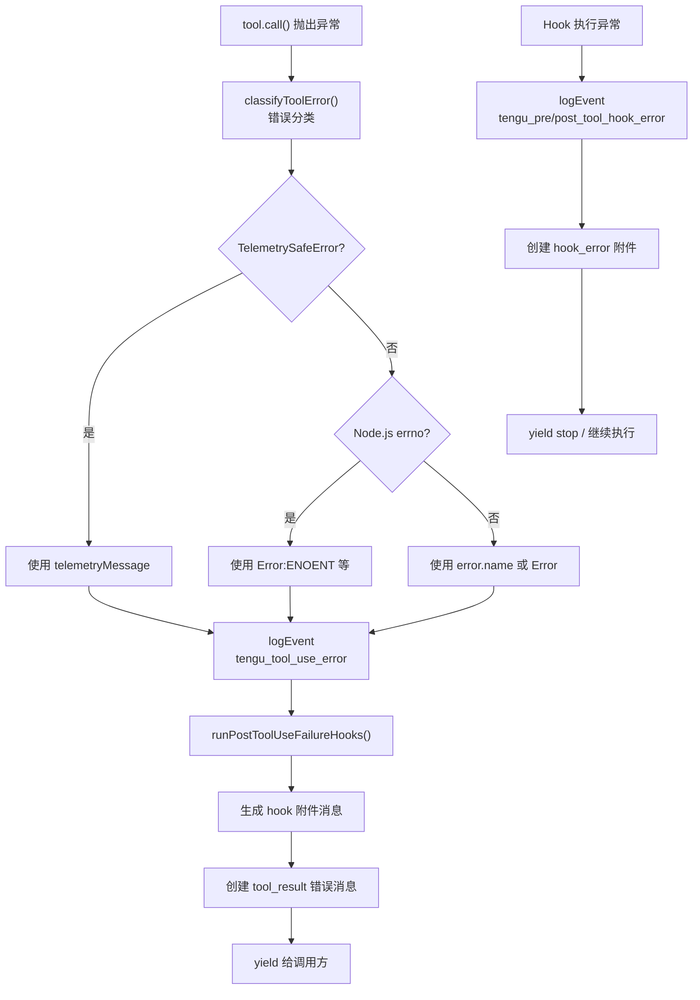

## 8. 并发设计

### 8.1 并发模型

工具调用链采用**协作式并发**模型，基于 JavaScript 事件循环和 `AsyncGenerator` 实现。

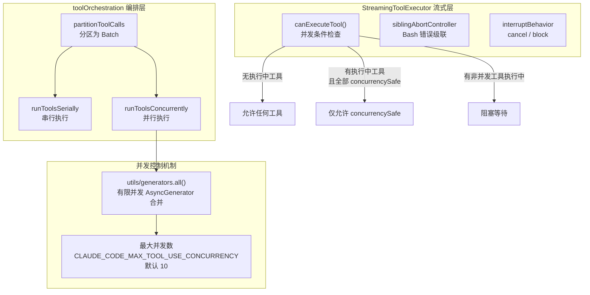

### 8.2 异步协调机制

1. **AsyncGenerator 流式管道**：整个调用链使用 `async function*` 和 `yield*` 构建流式管道，支持逐步产出结果
2. **Stream 桥接**：`streamedCheckPermissionsAndCallTool` 使用自定义 `Stream` 类将回调模式（`onToolProgress`）桥接为 `AsyncIterable`
3. **中止控制器层级**：
   - `toolUseContext.abortController`：全局中止（用户 Ctrl+C）
   - `siblingAbortController`：子级中止控制器，Bash 错误时触发，不影响父级
4. **进度通知**：`StreamingToolExecutor` 通过 `progressAvailableResolve` Promise 唤醒 `getRemainingResults` 循环

### 8.3 数据流图

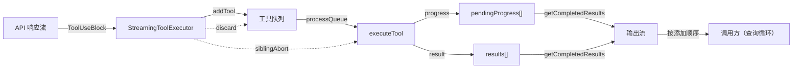

## 9. 设计约束与决策

### 9.1 设计模式

| 模式 | 应用位置 | 动机 |
|------|---------|------|
| **工厂模式** (Factory) | `buildTool()` (`Tool.ts:783`) | 统一工具创建，提供安全默认值（fail-closed） |
| **策略模式** (Strategy) | `Tool.call()` / `Tool.checkPermissions()` | 每个工具实现自己的执行和权限策略 |
| **责任链** (Chain of Responsibility) | `checkRuleBasedPermissions` → `resolveHookPermissionDecision` → `canUseTool` | 多层权限检查，按优先级依次评估 |
| **异步迭代器模式** | `AsyncGenerator` 贯穿全链 | 支持流式产出，避免 buffering 大量结果 |
| **观察者模式** (Observer) | `hookEvents.ts` 事件发射 | Hook 执行事件的发布/订阅 |
| **注册表模式** (Registry) | `tools.ts` 工具注册、`sessionHooks` 会话 Hook 注册 | 动态注册和查找工具/Hook |
| **桥接模式** (Bridge) | `Stream` 类连接回调与 AsyncIterable | 将 `onToolProgress` 回调桥接为异步迭代器 |
| **命令模式** (Command) | `ToolUseBlock` 作为命令对象 | API 返回的工具调用请求封装为可执行命令 |

### 9.2 性能考量

1. **推测性分类器启动**（`toolExecution.ts:740-752`）：对 BashTool，在前置钩子和权限检查之前并行启动分类器，减少用户等待时间
2. **并发安全工具批处理**：只读工具（如 FileRead、Grep、Glob）可并行执行，充分利用 I/O 并发
3. **最大并发数限制**：环境变量 `CLAUDE_CODE_MAX_TOOL_USE_CONCURRENCY` 控制并发上限（默认 10），防止资源耗尽
4. **延迟工具加载**：`shouldDefer` 标记的工具不会在初始 prompt 中发送 Schema，通过 `ToolSearch` 按需加载
5. **条件导入**：`tools.ts` 中通过 `feature()` 和 `process.env` 条件导入工具，减少未使用工具的加载
6. **memoize 优化**：`filesystem.ts` 中的 `getClaudeTempDir`、`getBundledSkillsRoot`、`getResolvedWorkingDirPaths` 使用 `memoize` 缓存
7. **进度消息立即产出**：`StreamingToolExecutor` 将进度消息与结果消息分离，进度立即产出避免 UI 卡顿

### 9.3 扩展点

1. **Tool 接口**：通过 `buildTool()` 工厂创建新工具，只需实现 `call()`、`name`、`inputSchema` 等核心方法
2. **Hook 事件**：25+ 种事件类型，支持 4 种执行方式（command/prompt/agent/http）
3. **权限规则**：通过 `settings.json` 配置 `allow`/`deny`/`ask` 规则，支持通配符匹配
4. **MCP 工具**：通过 MCP 协议动态接入外部工具，`assembleToolPool` 自动合并
5. **Session Hook**：运行时动态注册的会话级 Hook，支持 frontmatter 和 skill 注入
6. **Auto 模式分类器**：可通过自定义规则（`AutoModeRules`）扩展自动模式的允许/拒绝列表

## 10. 设计评估

### 10.1 优点

1. **职责分层清晰**：工具定义（`Tool.ts`）、注册（`tools.ts`）、编排（`toolOrchestration.ts`）、执行（`toolExecution.ts`）、钩子（`toolHooks.ts`）各司其职，修改某一层不影响其他层。`toolOrchestration.ts` 仅 188 行，职责纯粹

2. **工厂函数的 fail-closed 默认值**：`buildTool()` (`Tool.ts:757-769`) 默认 `isConcurrencySafe → false`、`isReadOnly → false`，新工具未显式声明时保守地按不安全处理，避免安全漏洞

3. **Hook 不能绕过 deny 规则**：`resolveHookPermissionDecision()` (`toolHooks.ts:372-391`) 确保即使 Hook 返回 `allow`，`checkRuleBasedPermissions` 的 `deny` 规则仍然生效。这是深度防御的关键设计

4. **并发安全的分区算法**：`partitionToolCalls()` (`toolOrchestration.ts:91-116`) 自动将连续只读工具合并为并发批次，非只读工具独立串行执行，在安全性和性能之间取得良好平衡

5. **AsyncGenerator 流式架构**：整个链条使用异步生成器（`runTools`、`runToolUse`、`runPreToolUseHooks` 等均为 `async function*`），支持逐步产出结果，内存占用可控

6. **错误分类遥测安全**：`classifyToolError()` (`toolExecution.ts:149-169`) 通过多层判断（`TelemetrySafeError` → `errno` → `error.name`）确保遥测数据不包含代码或文件路径

7. **权限系统的多层次设计**：权限检查从全局模式 → deny 规则 → ask 规则 → 工具自有检查 → 安全检查，层次分明（`permissions.ts:1071-1156`），每层都有明确的优先级

### 10.2 缺点与风险

1. **toolExecution.ts 过于庞大**：单文件 1745 行，`checkPermissionsAndCallTool` 函数从第 599 行延续到约第 1700 行，超过 1100 行，远超可维护性阈值。内含输入验证、Hook 调用、权限检查、工具执行、结果映射、遥测记录等多个阶段混合在一个函数中

2. **遥测代码侵入性强**：`toolExecution.ts` 中大量 `logEvent()` 调用（`tengu_tool_use_error`、`tengu_tool_use_success`、`tengu_tool_use_cancelled` 等 10+ 种事件），每个调用都包含 5-15 行样板代码构建 metadata 对象，严重降低核心逻辑的可读性。例如 `toolExecution.ts:370-395` 的错误遥测代码比实际错误处理逻辑还长

3. **`AnalyticsMetadata_I_VERIFIED_THIS_IS_NOT_CODE_OR_FILEPATHS` 类型断言泛滥**：`toolExecution.ts` 中出现 50+ 次 `as AnalyticsMetadata_I_VERIFIED_THIS_IS_NOT_CODE_OR_FILEPATHS` 类型断言，虽然意图是安全标记，但大量重复使代码臃肿

4. **MCP 工具的特殊处理分支**：`toolExecution.ts:1477-1542` 中 MCP 工具与非 MCP 工具的结果处理走不同的 `addToolResult` 路径，Hook 结果的累积逻辑也不同，增加了分支复杂度。代码注释 `TOOD(hackyon): refactor so we don't have different experiences for MCP tools`（第 1476 行）明确标记了这是已知技术债

5. **permissions/ 目录文件数量庞大**：24 个文件、8000+ 行代码，其中 `permissionSetup.ts` 约 1600 行、`filesystem.ts` 约 1700 行、`yoloClassifier.ts` 约 1500 行，单文件过大且职责边界模糊

6. **Hook 全局状态散落**：`utils/hooks/` 模块有 7 个模块级全局变量（`pendingHooks`、`watcher`、`postSamplingHooks`、`pendingEvents`、`eventHandler`、`initialHooksConfig`、`allHookEventsEnabled`），分散在不同文件中，测试时需逐个重置

7. **`backfillObservableInput` 的脆弱性**：`toolExecution.ts:784-793` 的输入回填逻辑（浅克隆 + 文件路径比较 + 条件还原）复杂且脆弱，注释承认这是为保持 VCR 测试哈希稳定的妥协

### 10.3 改进建议

1. **拆分 `checkPermissionsAndCallTool`**：将 `toolExecution.ts` 中的超长函数按阶段拆分为独立函数（如 `validateToolInput`、`executeToolWithTelemetry`、`processToolResult`），每个函数控制在 100 行以内。解决 10.2 第 1 点

2. **提取遥测装饰器**：创建 `toolTelemetry.ts`，封装遥测 metadata 的构建和 `logEvent` 调用，核心执行逻辑不再直接依赖分析代码。解决 10.2 第 2、3 点

3. **统一 MCP/非 MCP 工具结果处理**：消除 `addToolResult` 的双路径分支，将 MCP 工具的 Hook 输出修改逻辑标准化到 `runPostToolUseHooks` 内部。解决 10.2 第 4 点

4. **将 `permissions/` 按关注点拆分子目录**：如 `permissions/rules/`（规则管理）、`permissions/classifiers/`（分类器）、`permissions/filesystem/`（路径安全），并将超长文件按类拆分。解决 10.2 第 5 点

5. **将 Hook 全局状态统一为单例注册表**：创建 `HookRegistry` 类封装所有 Hook 相关状态，提供统一的 `reset()` 方法。解决 10.2 第 6 点
