# MCP 服务链 子模块详细设计文档

## 文档信息
| 项目 | 内容 |
|------|------|
| 模块名称 | MCP 服务链 (MCP Service Chain) |
| 文档版本 | v1.0-20260401 |
| 生成日期 | 2026-04-01 |
| 生成方式 | 代码反向工程 |

## 1. 模块概述

### 1.1 模块职责

MCP 服务链是 Claude Code 中负责 **Model Context Protocol (MCP) 服务器生命周期管理与工具调用** 的核心模块。它承担以下核心职责：

1. **服务器连接管理**：建立、缓存、重连和清理 MCP 服务器连接，支持 stdio、SSE、HTTP、WebSocket、SDK 进程内和 Claude.ai 代理共 8 种传输类型
2. **多层配置聚合**：从用户配置、项目配置、企业策略、Claude.ai 代理和插件系统聚合 MCP 服务器配置，并进行去重、策略过滤和环境变量扩展
3. **OAuth 认证流程**：为远程 MCP 服务器提供 OAuth 2.0 PKCE 授权码流程，包括 XAA (Cross-App Access) 企业 SSO 支持
4. **工具/资源/命令发现**：从已连接服务器获取可用工具列表、资源列表和命令列表，并缓存
5. **工具调用与结果处理**：调用 MCP 工具并处理返回结果（包括截断、持久化、格式转换）
6. **渠道消息推送**：支持 MCP 服务器通过渠道通知向会话推送外部消息（如 Slack/Discord）
7. **Elicitation 交互**：处理 MCP 服务器发起的用户交互请求（URL 打开、表单提交）
8. **安全凭证存储**：通过 Keychain/纯文本后备方案安全存储 OAuth 令牌

### 1.2 模块边界

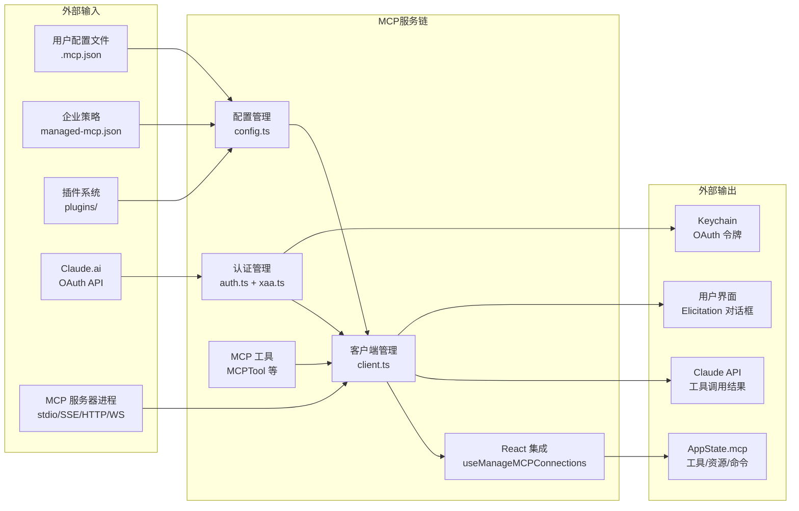

**输入边界**：配置文件（JSON/YAML）、企业策略、插件注册、OAuth 令牌端点、MCP 服务器进程  
**输出边界**：AppState 状态更新（工具/资源/命令列表）、Claude API 工具调用结果、Keychain 凭证存储、Elicitation UI 事件

## 2. 架构设计

### 2.1 模块架构图

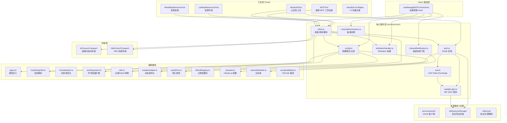

### 2.2 源文件组织

```mermaid
graph LR
    subgraph services_mcp["services/mcp/ (22 文件, 12238 行)"]
        direction TB
        core["核心: client.ts 3348L<br/>auth.ts 2465L<br/>config.ts 1578L<br/>useManageMCP 1141L"]
        feat["特性: xaa.ts 511L<br/>xaaIdpLogin 487L<br/>channelNotification 316L<br/>elicitationHandler 313L"]
        trans["传输: InProcessTransport 63L<br/>SdkControlTransport 136L"]
        util["辅助: types.ts 258L<br/>utils.ts 575L<br/>mcpStringUtils 106L<br/>其他 6 文件"]
    end

    subgraph tools_mcp["tools/ MCP 工具 (8 文件, 1216 行)"]
        direction TB
        t1["MCPTool/ 684L"]
        t2["McpAuthTool/ 215L"]
        t3["ListMcpResourcesTool/ 143L"]
        t4["ReadMcpResourceTool/ 174L"]
    end

    subgraph support["支撑模块"]
        direction TB
        s1["services/oauth/ (5 文件, 1056 行)"]
        s2["utils/secureStorage/ (6 文件, 635 行)"]
        s3["utils/mcp/ (2 文件, 458 行)"]
    end

    tools_mcp --> services_mcp
    services_mcp --> support
```

### 2.3 外部依赖

| npm 包 | 用途 | 引用位置 |
|--------|------|---------|
| `@modelcontextprotocol/sdk` | MCP 协议客户端、Transport 接口、类型定义 | client.ts, auth.ts, types.ts |
| `zod/v4` | 运行时 Schema 验证（配置、通知、OAuth 响应） | types.ts, channelNotification.ts, xaa.ts |
| `lodash-es` | mapValues/memoize/omit/reject/zipObject 工具函数 | client.ts, config.ts, useManageMCPConnections.ts |
| `p-map` | 并发控制的 Promise 映射 | client.ts |
| `axios` | HTTP 请求（OAuth 令牌交换、资料获取） | auth.ts, services/oauth/client.ts |
| `xss` | XSS 防护（OAuth 回调页面） | auth.ts |
| `execa` | 执行 macOS `security` 命令操作 Keychain | utils/secureStorage/ |

**内部支撑模块**：

| 模块 | 文件 | 用途 |
|------|------|------|
| `utils/mcp/dateTimeParser.ts` | 122 行 | 自然语言日期解析（通过 Haiku 将自然语言转为 ISO 8601） |
| `utils/mcp/elicitationValidation.ts` | 336 行 | MCP elicitation 表单输入验证（枚举/日期/数字/邮箱等） |
| `services/oauth/index.ts` | 199 行 | OAuthService 类：完整的授权码流程编排 |
| `services/oauth/client.ts` | 567 行 | OAuth 2.0 底层操作：授权 URL 构建、令牌交换、刷新 |
| `services/oauth/auth-code-listener.ts` | 212 行 | 本地 HTTP 服务器，捕获 OAuth 重定向回调 |
| `services/oauth/crypto.ts` | 24 行 | PKCE 工具：generateCodeVerifier/Challenge/State |
| `services/oauth/getOauthProfile.ts` | 54 行 | 获取 OAuth 用户资料和订阅信息 |
| `utils/secureStorage/index.ts` | 18 行 | 平台适配工厂：macOS Keychain / 纯文本 |
| `utils/secureStorage/macOsKeychainStorage.ts` | 232 行 | macOS Keychain 原生存储（via security CLI） |
| `utils/secureStorage/fallbackStorage.ts` | 71 行 | 双层容错存储：Keychain 优先，纯文本回退 |
| `utils/secureStorage/keychainPrefetch.ts` | 117 行 | 启动时并行预读 Keychain 项 |
| `utils/secureStorage/plainTextStorage.ts` | 85 行 | 纯文本 JSON 文件存储（~/.claude/.credentials.json） |

## 3. 数据结构设计

### 3.1 核心数据结构

#### 3.1.1 服务器配置类型 McpServerConfig

MCP 服务器配置是一个联合类型，支持 8 种传输方式，通过 Zod Schema 进行运行时验证。

| 配置类型 | type 字段 | 关键字段 | 定义位置 |
|---------|-----------|---------|---------|
| McpStdioServerConfig | `stdio`(可选) | command, args, env | types.ts:28-35 |
| McpSSEServerConfig | `sse` | url, headers, headersHelper, oauth | types.ts:58-66 |
| McpHTTPServerConfig | `http` | url, headers, headersHelper, oauth | types.ts:89-97 |
| McpWebSocketServerConfig | `ws` | url, headers, headersHelper | types.ts:99-106 |
| McpSSEIDEServerConfig | `sse-ide` | url, ideName | types.ts:69-76 |
| McpWebSocketIDEServerConfig | `ws-ide` | url, ideName, authToken | types.ts:79-87 |
| McpSdkServerConfig | `sdk` | name | types.ts:108-113 |
| McpClaudeAIProxyServerConfig | `claudeai-proxy` | url, id | types.ts:116-122 |

**ScopedMcpServerConfig** (`types.ts:163-169`) 在 McpServerConfig 基础上扩展了 `scope: ConfigScope` 和 `pluginSource?: string`。

#### 3.1.2 服务器连接状态 MCPServerConnection

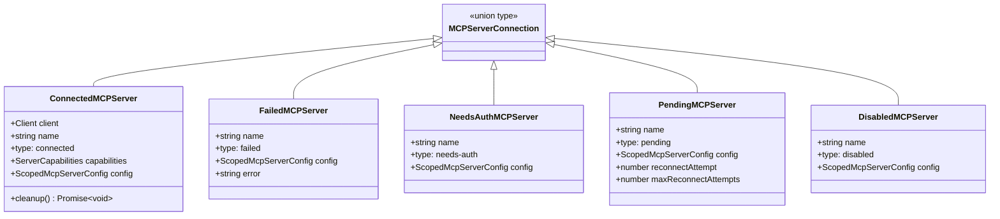

定义位置：`types.ts:180-226`

#### 3.1.3 序列化状态 MCPCliState

用于跨进程传递 MCP 状态的序列化结构（`types.ts:252-258`）：

| 字段 | 类型 | 说明 |
|------|------|------|
| clients | SerializedClient[] | 序列化的客户端状态列表 |
| configs | Record\<string, ScopedMcpServerConfig\> | 服务器名称到配置的映射 |
| tools | SerializedTool[] | MCP 工具列表（含 originalToolName） |
| resources | Record\<string, ServerResource[]\> | 按服务器分组的资源 |
| normalizedNames | Record\<string, string\> | 规范化名称到原始名称的映射 |

#### 3.1.4 渠道门控结果 ChannelGateResult

```typescript
type ChannelGateResult =
  | { action: 'register' }
  | { action: 'skip'; kind: 'capability' | 'disabled' | 'auth' | 'policy'
      | 'session' | 'marketplace' | 'allowlist'; reason: string }
```

定义位置：`channelNotification.ts:140-153`

#### 3.1.5 Elicitation 请求事件 ElicitationRequestEvent

| 字段 | 类型 | 说明 |
|------|------|------|
| serverName | string | 服务器名称 |
| requestId | string \| number | JSON-RPC 请求 ID |
| params | ElicitRequestParams | 请求参数（mode: url/form） |
| signal | AbortSignal | 中止信号 |
| respond | (response: ElicitResult) => void | 响应回调 |
| waitingState | ElicitationWaitingState | URL 打开后的等待 UI 配置 |
| completed | boolean | 服务器完成通知标志 |

定义位置：`elicitationHandler.ts:29-47`

#### 3.1.6 XAA 配置与结果

| 类型 | 说明 | 定义位置 |
|------|------|---------|
| XaaConfig | XAA 流程配置（clientId, idpIdToken 等） | xaa.ts:402-415 |
| XaaResult | XAA 完整结果（token + authorizationServerUrl） | xaa.ts:320-335 |
| ProtectedResourceMetadata | RFC 9728 PRM 元数据 | xaa.ts:126-129 |
| AuthorizationServerMetadata | RFC 8414 AS 元数据 | xaa.ts:167-172 |

### 3.2 数据关系图

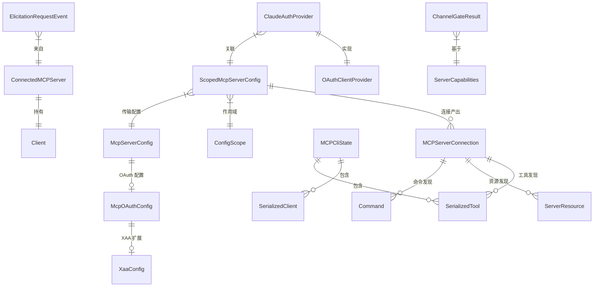

## 4. 接口设计

### 4.1 对外接口 (export API)

#### 4.1.1 连接管理 (client.ts)

| 函数 | 签名 | 说明 |
|------|------|------|
| `connectToServer` | `(name, serverRef, serverStats?) => Promise<MCPServerConnection>` | **核心**：建立 MCP 连接，memoized 缓存。根据 config.type 选择 Transport，处理 OAuth 401 |
| `clearServerCache` | `(name, serverRef) => Promise<void>` | 清空指定服务器的连接缓存和 fetch 缓存 |
| `ensureConnectedClient` | `(client) => Promise<ConnectedMCPServer>` | 确保客户端已连接，否则重连 |
| `getMcpToolsCommandsAndResources` | `(onConnectionAttempt, mcpConfigs?) => Promise<void>` | 聚合获取所有服务器的工具/命令/资源，分批并发处理 |
| `fetchToolsForClient` | `(client) => Promise<Tool[]>` | 获取工具列表（LRU 缓存） |
| `fetchResourcesForClient` | `(client) => Promise<ServerResource[]>` | 获取资源列表（LRU 缓存） |
| `fetchCommandsForClient` | `(client) => Promise<ListPromptsResult>` | 获取命令列表（LRU 缓存） |
| `callMCPToolWithUrlElicitationRetry` | `(opts) => Promise<MCPToolCallResult>` | **核心**：调用 MCP 工具，处理 elicitation 重试 |
| `processMCPResult` | `(result, tool, name) => Promise<MCPToolResult>` | 处理 MCP 结果（截断/持久化/格式转换） |
| `reconnectMcpServerImpl` | `(name, config) => Promise<...>` | 重新连接服务器（清缓存后重建） |

#### 4.1.2 配置管理 (config.ts)

| 函数 | 签名 | 说明 |
|------|------|------|
| `getClaudeCodeMcpConfigs` | `(dynamicServers?, extraDedupTargets?) => Promise<{servers, errors}>` | **核心**：聚合所有作用域配置（user+project+local+enterprise+plugin），去重过滤 |
| `getAllMcpConfigs` | `() => Promise<{servers, errors}>` | 包含 Claude.ai 服务器的完整配置（可能有网络调用） |
| `addMcpConfig` | `(name, config, scope) => Promise<void>` | 添加 MCP 配置到 .mcp.json |
| `removeMcpConfig` | `(name, scope) => Promise<void>` | 删除 MCP 配置 |
| `filterMcpServersByPolicy` | `(configs) => {allowed, blocked}` | 按企业策略过滤服务器 |
| `isMcpServerDisabled` | `(name) => boolean` | 检查服务器是否被禁用 |
| `setMcpServerEnabled` | `(name, enabled) => void` | 启用/禁用服务器 |

#### 4.1.3 认证管理 (auth.ts)

| 函数 | 签名 | 说明 |
|------|------|------|
| `performMCPOAuthFlow` | `(serverName, config, onAuthUrl, signal?, opts?) => Promise<void>` | **核心**：执行完整 OAuth 流程（支持 XAA 和标准 PKCE） |
| `getServerKey` | `(serverName, config) => string` | 生成服务器 Keychain 存储键 |
| `hasMcpDiscoveryButNoToken` | `(name, config) => boolean` | 检查是否已发现但无令牌 |
| `revokeServerTokens` | `(name) => Promise<void>` | 撤销服务器 OAuth 令牌 |

#### 4.1.4 XAA (xaa.ts)

| 函数 | 签名 | 说明 |
|------|------|------|
| `performCrossAppAccess` | `(serverUrl, config, serverName?, signal?) => Promise<XaaResult>` | **核心**：完整 XAA 流程（PRM 发现 → AS 发现 → Token Exchange → JWT Bearer） |
| `discoverProtectedResource` | `(serverUrl, opts?) => Promise<ProtectedResourceMetadata>` | RFC 9728 PRM 发现 |
| `discoverAuthorizationServer` | `(asUrl, opts?) => Promise<AuthorizationServerMetadata>` | RFC 8414 AS 元数据发现 |

#### 4.1.5 名称工具 (mcpStringUtils.ts)

| 函数 | 签名 | 说明 |
|------|------|------|
| `mcpInfoFromString` | `(toolString) => {serverName, toolName} \| null` | 解析 `mcp__server__tool` 格式 |
| `buildMcpToolName` | `(serverName, toolName) => string` | 构建完整 MCP 工具名称 |
| `getMcpPrefix` | `(serverName) => string` | 生成 `mcp__serverName__` 前缀 |
| `getMcpDisplayName` | `(fullName, serverName) => string` | 提取显示名称 |

#### 4.1.6 传输层

| 函数/类 | 签名 | 说明 |
|---------|------|------|
| `createLinkedTransportPair` | `() => [Transport, Transport]` | 创建进程内双向传输对（InProcessTransport.ts:57） |
| `SdkControlClientTransport` | class implements Transport | CLI 侧 SDK MCP 通信桥接（SdkControlTransport.ts:60） |
| `SdkControlServerTransport` | class implements Transport | SDK 侧 MCP Server 响应转发（SdkControlTransport.ts:109） |

### 4.2 Interface 定义与实现

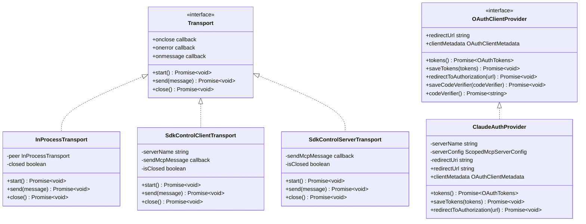

## 5. 核心流程设计

### 5.1 初始化流程

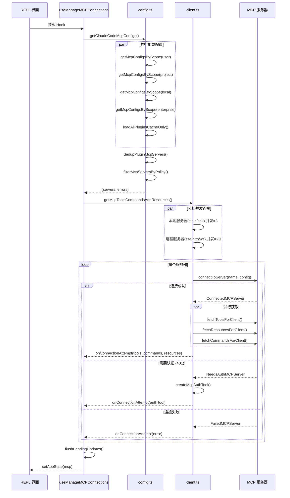

### 5.2 工具调用流程

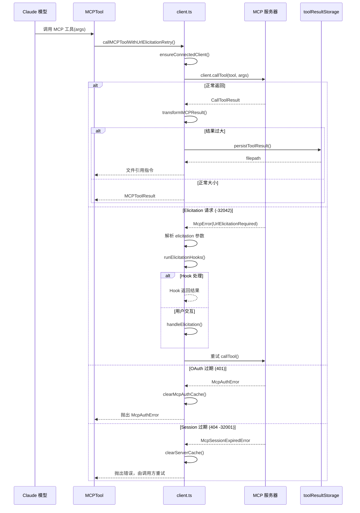

### 5.3 OAuth 认证流程

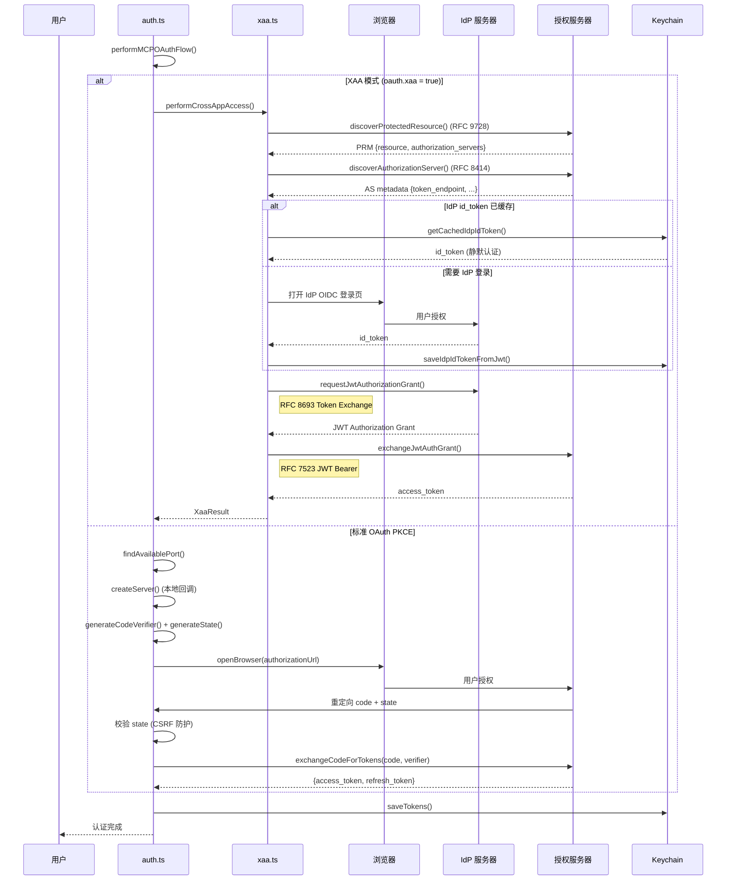

### 5.4 渠道消息门控流程

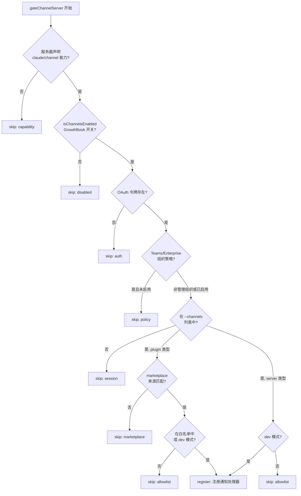

### 5.5 配置聚合算法

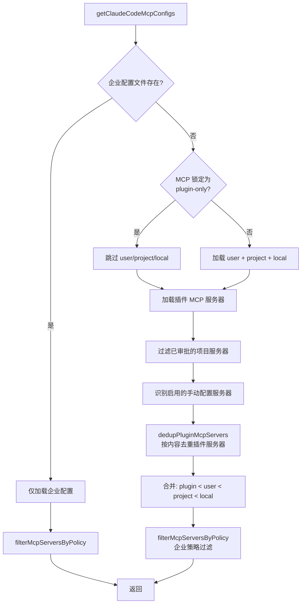

## 6. 状态管理

### 6.1 状态定义

MCP 服务器连接存在 5 种离散状态：

| 状态 | type 值 | 说明 |
|------|---------|------|
| 已连接 | `connected` | 正常运行，可调用工具/资源 |
| 失败 | `failed` | 连接失败，附带错误信息 |
| 需要认证 | `needs-auth` | OAuth 401，需用户授权 |
| 等待中 | `pending` | 重连中，附带重试计数 |
| 已禁用 | `disabled` | 被用户或策略禁用 |

### 6.2 状态转换图

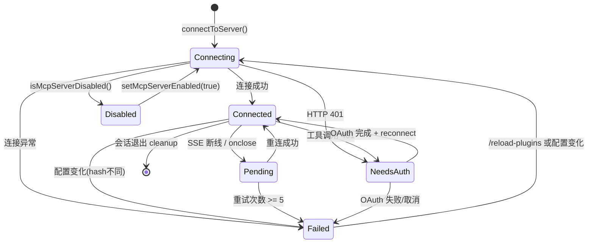

### 6.3 状态转换条件

| 当前状态 | 触发条件 | 目标状态 | 执行动作 |
|---------|---------|---------|---------|
| - | connectToServer() 成功 | Connected | 注册通知处理器、获取工具列表 |
| - | connectToServer() 异常 | Failed | 记录错误日志 |
| - | HTTP 401 UnauthorizedError | NeedsAuth | 创建 McpAuthTool 伪工具 |
| - | isMcpServerDisabled() | Disabled | 跳过连接 |
| Connected | SSE/WS onclose | Pending | 启动指数退避重连（1s→30s） |
| Connected | 工具调用返回 401 | NeedsAuth | clearMcpAuthCache() |
| Connected | 404 + JSON-RPC -32001 | Connected | clearServerCache() + 重连 |
| Pending | 重连成功 | Connected | 重新获取工具列表 |
| Pending | 重试 >= MAX_RECONNECT_ATTEMPTS(5) | Failed | 停止重试 |
| NeedsAuth | OAuth flow 完成 | Connected | reconnectMcpServerImpl()、替换工具列表 |
| Any | 会话退出 | 清除 | client.close()、cleanup 回调 |

## 7. 错误处理设计

### 7.1 错误类型

| 错误类 | 定义位置 | 说明 |
|--------|---------|------|
| `McpAuthError` | client.ts:152-159 | OAuth 认证失败，携带 serverName |
| `McpSessionExpiredError` | client.ts:165-170 | MCP 会话过期（内部使用） |
| `McpToolCallError` | client.ts:177-186 | MCP 工具返回 isError:true，携带 _meta |
| `AuthenticationCancelledError` | auth.ts:313-318 | 用户取消 OAuth 流程 |
| `XaaTokenExchangeError` | xaa.ts:77-84 | XAA Token Exchange 失败，携带 shouldClearIdToken |

### 7.2 错误处理策略

- **OAuth 错误**：`invalid_grant` / `expired_refresh_token` → 清除令牌缓存 → 重新触发 OAuth 流程；5xx / 网络错误 → 瞬态重试
- **MCP 连接错误**：`404 + -32001` (session expired) → `clearServerCache()` + 重连；`401` → 标记 needs-auth
- **工具调用错误**：`isError: true` → 包装为 `McpToolCallError`；elicitation 超时 → 回退 `skipElicitation: true`
- **配置错误**：JSON 解析失败 → 日志 + 跳过该文件；Schema 校验失败 → errors 数组

### 7.3 错误传播链

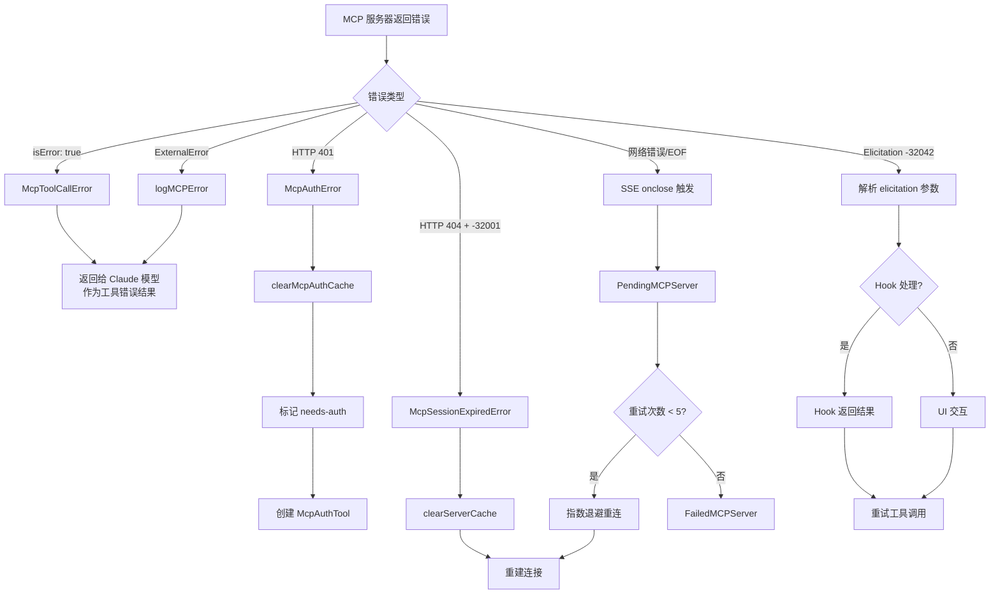

## 8. 并发设计

### 8.1 连接并发模型

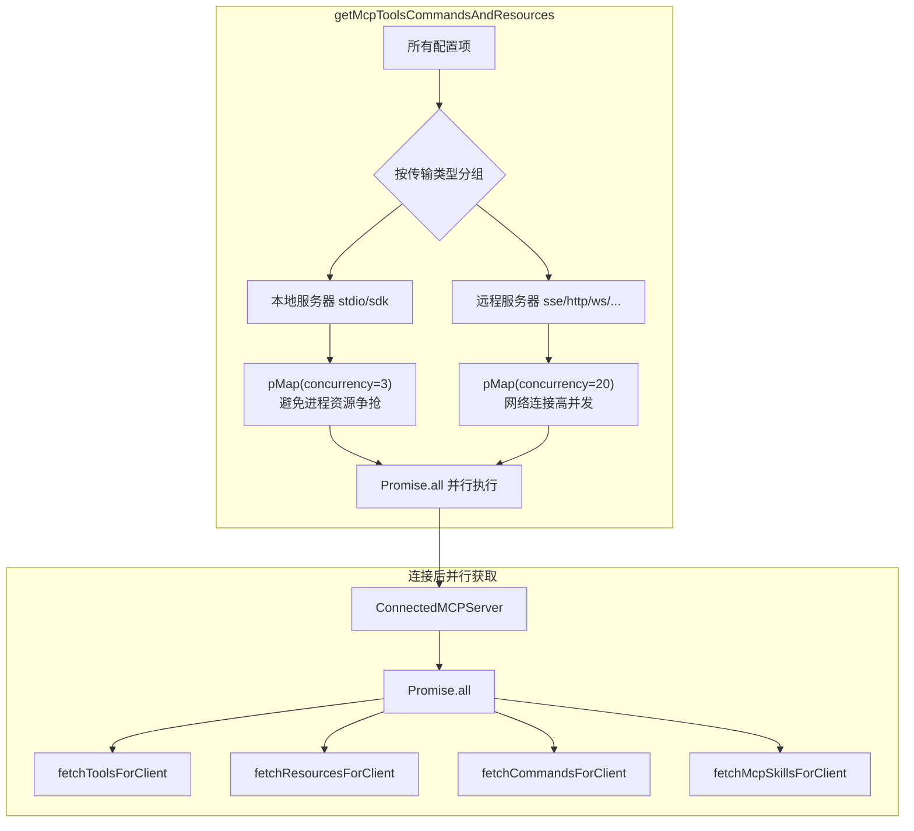

### 8.2 异步协调机制

**批量状态更新**（`useManageMCPConnections.ts:207-291`）：

- 使用 16ms 时间窗口（`MCP_BATCH_FLUSH_MS`）收集多个服务器的更新
- 通过 `pendingUpdatesRef` 和 `setTimeout` 实现批量 `setAppState` 调用
- 每次 flush 对所有 pending updates 做单次 immutable state merge
- 基于前缀的工具替换：`reject(tools, t => t.name.startsWith(prefix))` + 新工具

**Memoize 缓存层级**：

| 缓存 | 键策略 | 生命周期 | 清除触发 |
|------|--------|---------|---------|
| `connectToServer` | `name-JSON(config)` SHA256 | 会话级 | `clearServerCache()` |
| `fetchToolsForClient` | 服务器名称 | LRU(20) | `tool-list-changed` 通知 |
| `fetchResourcesForClient` | 服务器名称 | LRU(20) | `resource-list-changed` 通知 |
| `fetchCommandsForClient` | 服务器名称 | LRU(20) | `prompt-list-changed` 通知 |
| `fetchClaudeAIMcpConfigsIfEligible` | 无参数 | 会话级 | `clearClaudeAIMcpConfigsCache()` |
| `doesEnterpriseMcpConfigExist` | 无参数 | 进程级 | 无 |

### 8.3 数据流图

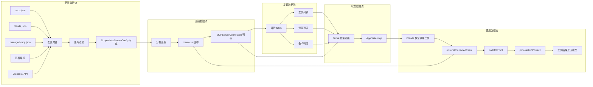

## 9. 设计约束与决策

### 9.1 设计模式

| 模式 | 实例 | 动机 |
|------|------|------|
| **策略模式** | `connectToServer` 根据 `config.type` 选择 Transport（stdio/SSE/HTTP/WS/SDK/proxy） | 统一连接接口，支持 8 种传输类型 |
| **工厂模式** | `createMcpAuthTool()`、`createChannelPermissionCallbacks()`、`createLinkedTransportPair()` | 封装复杂对象构造逻辑 |
| **Memoization** | `memoize(connectToServer)`、`memoizeWithLRU(fetchToolsForClient)` | 避免重复网络连接和 API 调用 |
| **装饰器/中间件** | `wrapFetchWithTimeout()`、`wrapFetchWithStepUpDetection()`、`createClaudeAiProxyFetch()` | 横切关注点（超时、OAuth 检测、代理）的组合 |
| **门控链** | `gateChannelServer()` 6 层校验 | 多维度安全检查的有序组合 |
| **观察者** | MCP 通知处理器（`setNotificationHandler`）、`ChannelPermissionCallbacks.onResponse()` | 异步事件驱动的通知处理 |
| **适配器** | `SdkControlClientTransport` / `SdkControlServerTransport` | 适配 SDK 进程与 CLI 进程间的 MCP 通信 |
| **依赖注入** | `connectToServer(opts)` 接收 `fetchFn`；`callMCPToolWithUrlElicitationRetry` 接收 `callToolFn` | 可测试性和灵活性 |

### 9.2 性能考量

1. **并发连接分级**：本地服务器 (stdio/sdk) 限制并发 3（避免进程资源争抢），远程服务器并发 20（`client.ts:552-560`）
2. **16ms 批量状态更新**：避免高频 React 渲染（`useManageMCPConnections.ts:207`）
3. **LRU 缓存**：工具/资源/命令使用 LRU(20) 缓存，防止无限增长（`client.ts:1726`）
4. **Keychain 预读**：启动时并行预读 2 个 Keychain 项，与模块加载并行（`keychainPrefetch.ts:69`）
5. **大结果持久化**：超过 token 限制的 MCP 结果保存到文件，返回文件引用指令（`client.ts:2750-2798`）
6. **Auth 缓存跳过**：已知需要认证的服务器跳过连接尝试，避免无效网络开销（`client.ts:2307-2322`）

### 9.3 扩展点

1. **传输类型扩展**：`McpServerConfigSchema` 联合类型可新增配置变体，`connectToServer` 中 switch 分支对应新 Transport 实现
2. **ConfigScope 扩展**：`ConfigScopeSchema` 枚举已包含 `dynamic` 和 `managed` 预留作用域
3. **Feature Flag 门控**：`bun:bundle` 的 `feature()` 编译期开关控制 MCP_SKILLS、KAIROS、KAIROS_CHANNELS 等特性
4. **Hook 机制**：Elicitation 前后处理 Hook（`runElicitationHooks`/`runElicitationResultHooks`）允许用户自定义拦截逻辑
5. **插件集成**：`getPluginMcpServers()` 允许插件注册自定义 MCP 服务器

## 10. 设计评估

### 10.1 优点

1. **清晰的类型安全状态机**：`MCPServerConnection` 联合类型（`types.ts:221-226`）通过 `type` 字段区分 5 种状态，所有状态转换在 `useManageMCPConnections` 和 `client.ts` 中有据可循，TypeScript 编译器能确保分支覆盖

2. **多层缓存策略精心设计**：`connectToServer` 的 memoize 缓存（会话级）+ `fetchToolsForClient` 的 LRU(20) 缓存（`client.ts:1726`）+ 通知驱动的缓存失效（`tool-list-changed`），层次分明且有清除机制

3. **优秀的安全设计**：渠道门控 `gateChannelServer()`（`channelNotification.ts:191-316`）实现 6 层递进校验；OAuth PKCE + state CSRF 防护；XAA 的 `redactTokens()` 日志脱敏（`xaa.ts:94`）；Keychain 存储通过 stdin 传递敏感数据避免 argv 泄露

4. **良好的关注点分离**：`auth.ts` 专注 OAuth、`config.ts` 专注配置 I/O、`client.ts` 专注连接管理、`useManageMCPConnections.ts` 专注 React 状态同步、传输层（`InProcessTransport`/`SdkControlTransport`）独立实现

5. **可测试的依赖注入**：`callMCPToolWithUrlElicitationRetry` 接收 `callToolFn` 参数（`client.ts:2822`），`connectToServer` 的 `fetchFn` 可替换，便于单元测试

6. **批量状态更新优化**：`useManageMCPConnections` 使用 16ms 时间窗口批量合并多个服务器的状态更新（`useManageMCPConnections.ts:207-291`），避免高频 React 渲染

### 10.2 缺点与风险

1. **client.ts 过于庞大**：3348 行代码承载了连接管理、工具调用、结果处理、缓存管理等多个职责（`client.ts` 全文）。注释 `TODO (ollie): The memoization here increases complexity by a lot`（`client.ts:589`）自认复杂度过高

2. **auth.ts 同样过大**：2465 行代码包含 OAuth 流程、ClaudeAuthProvider 类、XAA 认证、令牌存储操作。`performMCPOAuthFlow` 函数从第 847 行一直延伸到约 1350 行（约 500 行单函数）

3. **memoize 缓存的隐式依赖**：`connectToServer` 的缓存键基于配置 JSON 序列化（`client.ts:584-586`），但 `clearServerCache` 需要调用者同时传入 name 和 config（`client.ts:1648`），如果调用方持有过期的 config 引用会导致缓存未命中

4. **`any` 类型残留**：`mcpToolInputToAutoClassifierInput(input: Record<string, unknown>)`（`client.ts:1733`）和 `callIdeRpc` 返回 `Promise<any>`（Explore 扫描结果 `client.ts:2116`）存在类型安全漏洞

5. **渠道门控的复杂性**：`gateChannelServer()` 的 6 层校验逻辑（`channelNotification.ts:191-316`，126 行）虽然有清晰注释，但条件嵌套深度达 4 层，新增门控条件需理解完整链路

6. **useManageMCPConnections 的职责过重**：1141 行的单个 React Hook 同时管理连接初始化、重连逻辑、渠道通知注册、elicitation 处理、权限回调、批量状态更新和插件同步

### 10.3 改进建议

1. **拆分 client.ts**：将连接管理（`connectToServer`、`clearServerCache`、`ensureConnectedClient`）、工具调用（`callMCPToolWithUrlElicitationRetry`、`processMCPResult`）、工具发现（`fetchToolsForClient`、`fetchResourcesForClient`）分为 3 个文件。解决 10.2 第 1 点的 God File 问题

2. **拆分 auth.ts**：将 `ClaudeAuthProvider` 类提取为独立文件、`performMCPOAuthFlow` 拆分为标准 OAuth 和 XAA 两个入口函数（已部分做到，但 XAA 路径仍嵌入在 `performMCPOAuthFlow` 中）。解决 10.2 第 2 点

3. **封装缓存管理器**：将 `memoize(connectToServer)` + `memoizeWithLRU(fetch*)` + cache delete 逻辑封装为 `McpConnectionCache` 类，统一缓存键生成和清除语义。解决 10.2 第 3 点的隐式依赖问题

4. **拆分 useManageMCPConnections**：将渠道相关逻辑提取为 `useChannelNotifications` Hook，将重连逻辑提取为 `useMcpReconnection` Hook，将批量更新提取为 `useBatchedMcpState` Hook。解决 10.2 第 6 点
