# 多 Agent 协作链 子模块详细设计文档

## 文档信息
| 项目 | 内容 |
|------|------|
| 模块名称 | 多 Agent 协作链 (Multi-Agent Collaboration Chain) |
| 文档版本 | v1.0-20260401 |
| 生成日期 | 2026-04-01 |
| 生成方式 | 代码反向工程 |

## 1. 模块概述

### 1.1 模块职责

多 Agent 协作链是 Claude Code 的核心子系统之一，负责**多个 AI Agent 的编排、生命周期管理和协作通信**。该模块使单个 Claude Code 实例能够同时运行多个 Agent（子代理、队友 Teammate、远程 Agent 等），通过协调器模式 (Coordinator Mode) 实现任务的并行分发、进度跟踪和结果汇总。

在系统中的定位：该模块横跨工具层（AgentTool、SendMessageTool、TeamCreateTool、TeamDeleteTool）、任务层（LocalAgentTask、InProcessTeammateTask、RemoteAgentTask 等）、协调层（coordinator/）和工具函数层（utils/swarm/、utils/task/），是连接用户交互界面与底层 API 调用服务的关键中间层。

### 1.2 模块边界

**输入**：
- 用户通过 AgentTool 发起的子代理调用（description、prompt、subagent_type 等参数）
- Coordinator 模式下系统自动分发的工作任务
- Agent 之间通过 SendMessageTool 发送的协作消息

**输出**：
- Agent 执行结果（AgentToolResult）通过 `<task-notification>` XML 格式返回
- 任务状态变更事件（task_started、task_progress、task_terminated）
- 磁盘输出文件（供实时查看 Agent 进度）

**与外部模块的交互边界**：
- **services/api/**：Agent 执行依赖 Anthropic API 进行对话
- **services/mcp/**：Agent 可连接独立的 MCP 服务器获取工具
- **utils/permissions/**：工具执行受权限系统约束
- **utils/hooks/**：工具调用触发用户自定义 Hook
- **state/AppState**：所有任务状态注册在全局 AppState.tasks 中
- **Tool.ts / tools.ts**：Agent 的工具池来自系统工具注册表

## 2. 架构设计

### 2.1 模块架构图

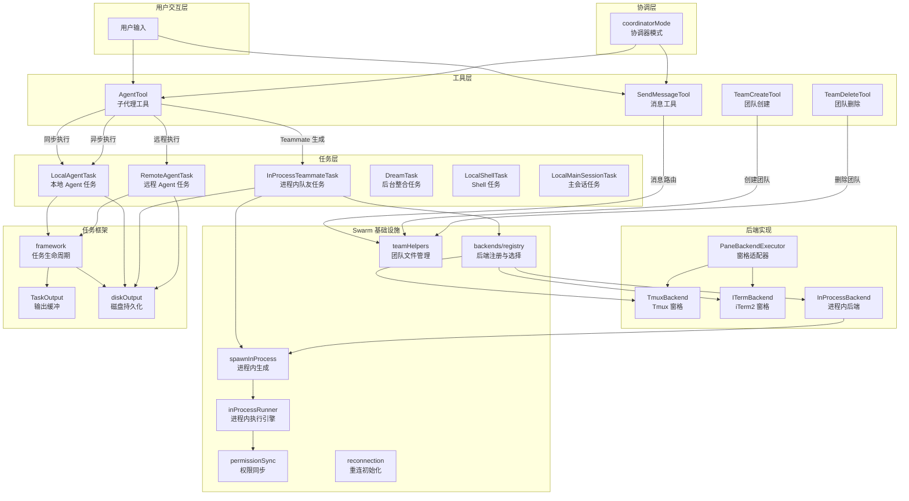

### 2.2 源文件组织

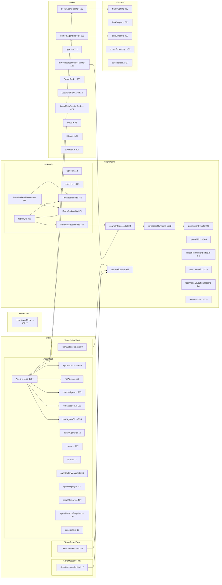

### 2.3 外部依赖

| npm 包 | 用途 |
|--------|------|
| `@anthropic-ai/sdk` | Claude API 类型定义（Message、ToolUseBlock 等） |
| `zod` | 输入参数和数据结构运行时校验 |
| `lodash-es` | 工具函数（sample 等） |
| `bun:bundle` | 编译期特性门控（feature gate）和死代码消除 |

## 3. 数据结构设计

### 3.1 核心数据结构

#### 3.1.1 TaskState 联合类型 (tasks/types.ts:12-19)

所有后台任务的顶层联合类型，贯穿整个任务系统。

| 成员类型 | 说明 |
|----------|------|
| `LocalShellTaskState` | Bash/PowerShell 命令任务 |
| `LocalAgentTaskState` | 本地后台 Agent 任务 |
| `RemoteAgentTaskState` | 云端远程 Agent 任务 |
| `InProcessTeammateTaskState` | 同进程队友任务 |
| `LocalWorkflowTaskState` | 工作流任务 |
| `MonitorMcpTaskState` | MCP 监控任务 |
| `DreamTaskState` | 自动记忆整合任务 |

#### 3.1.2 LocalAgentTaskState (tasks/LocalAgentTask/LocalAgentTask.tsx:116-148)

本地 Agent 任务状态，是最复杂的任务类型。

| 字段 | 类型 | 说明 |
|------|------|------|
| `type` | `'local_agent'` | 任务类型标识 |
| `agentId` | `string` | Agent 唯一标识 |
| `prompt` | `string` | Agent 的初始提示词 |
| `selectedAgent` | `AgentDefinition?` | 选用的 Agent 定义 |
| `agentType` | `string` | Agent 类型（如 'general-purpose'） |
| `model` | `string?` | 模型覆盖 |
| `abortController` | `AbortController?` | 中止控制器 |
| `progress` | `AgentProgress?` | 进度信息 |
| `isBackgrounded` | `boolean` | 前台/后台状态 |
| `messages` | `Message[]?` | 对话历史镜像 |
| `retain` | `boolean` | 是否保留在面板中 |
| `evictAfter` | `number?` | 驱逐时间戳 |
| `pendingMessages` | `string[]` | 待处理消息队列 |
| `diskLoaded` | `boolean` | 是否已从磁盘加载 |

#### 3.1.3 InProcessTeammateTaskState (tasks/InProcessTeammateTask/types.ts:22-76)

同进程队友任务状态，支持持续交互。

| 字段 | 类型 | 说明 |
|------|------|------|
| `type` | `'in_process_teammate'` | 任务类型标识 |
| `identity` | `TeammateIdentity` | 队友身份信息 |
| `prompt` | `string` | 初始提示词 |
| `permissionMode` | `PermissionMode` | 权限模式 |
| `awaitingPlanApproval` | `boolean` | 是否等待计划审批 |
| `isIdle` | `boolean` | 是否空闲 |
| `shutdownRequested` | `boolean` | 是否请求关闭 |
| `pendingUserMessages` | `string[]` | 待处理用户消息 |
| `messages` | `Message[]?` | 对话历史（上限 50 条） |
| `onIdleCallbacks` | `Array<() => void>?` | 空闲回调队列 |

#### 3.1.4 RemoteAgentTaskState (tasks/RemoteAgentTask/RemoteAgentTask.tsx:22-59)

远程 Agent 任务状态，通过轮询获取云端进度。

| 字段 | 类型 | 说明 |
|------|------|------|
| `type` | `'remote_agent'` | 任务类型标识 |
| `sessionId` | `string` | 云端会话 ID |
| `remoteTaskType` | `RemoteTaskType` | 远程任务类型 |
| `log` | `SDKMessage[]` | 云端同步的完整日志 |
| `todoList` | `TodoList` | 提取的待办事项 |
| `pollStartedAt` | `number` | 轮询开始时间 |
| `reviewProgress` | `object?` | 代码审查进度 |
| `isUltraplan` | `boolean?` | 是否为 Ultraplan 任务 |

#### 3.1.5 AgentDefinition 联合类型 (tools/AgentTool/loadAgentsDir.ts:162-165)

Agent 定义，描述一种可用的 Agent 类型。

| 变体 | 来源 | 说明 |
|------|------|------|
| `BuiltInAgentDefinition` | `'built-in'` | 内置 Agent（Explore、Plan 等） |
| `CustomAgentDefinition` | `SettingSource` | 用户自定义 Agent（Markdown 或 JSON） |
| `PluginAgentDefinition` | `'plugin'` | 插件提供的 Agent |

公共字段（BaseAgentDefinition，loadAgentsDir.ts:106-133）：

| 字段 | 类型 | 说明 |
|------|------|------|
| `agentType` | `string` | 唯一类型名 |
| `whenToUse` | `string?` | 使用场景描述 |
| `tools` | `string[]?` | 可用工具列表（`'*'` 表示全部） |
| `disallowedTools` | `string[]?` | 禁用工具列表 |
| `model` | `string?` | 模型覆盖 |
| `permissionMode` | `string?` | 权限模式 |
| `maxTurns` | `number?` | 最大对话轮次 |
| `color` | `AgentColorName?` | UI 颜色 |
| `background` | `boolean?` | 是否强制后台运行 |
| `memory` | `string?` | 记忆范围 |
| `isolation` | `string?` | 隔离模式 |

#### 3.1.6 PaneBackend 接口 (utils/swarm/backends/types.ts:39-168)

终端窗格管理后端接口，抽象 Tmux 和 iTerm2 的差异。

| 方法 | 返回类型 | 说明 |
|------|----------|------|
| `isAvailable()` | `Promise<boolean>` | 检查后端是否可用 |
| `isRunningInside()` | `Promise<boolean>` | 检查是否在后端环境内 |
| `createTeammatePaneInSwarmView(name, color)` | `Promise<CreatePaneResult>` | 创建队友窗格 |
| `sendCommandToPane(paneId, command)` | `Promise<void>` | 向窗格发送命令 |
| `killPane(paneId)` | `Promise<boolean>` | 关闭窗格 |
| `hidePane(paneId)` | `Promise<boolean>` | 隐藏窗格 |
| `showPane(paneId, target)` | `Promise<boolean>` | 显示窗格 |

#### 3.1.7 TeammateExecutor 接口 (utils/swarm/backends/types.ts:279-300)

队友执行器高层接口，统一窗格和进程内两种执行方式。

| 方法 | 返回类型 | 说明 |
|------|----------|------|
| `spawn(config)` | `Promise<TeammateSpawnResult>` | 生成队友 |
| `sendMessage(agentId, message)` | `Promise<void>` | 发送消息 |
| `terminate(agentId, reason?)` | `Promise<boolean>` | 优雅终止 |
| `kill(agentId)` | `Promise<boolean>` | 强制终止 |
| `isActive(agentId)` | `Promise<boolean>` | 检查是否活跃 |

### 3.2 数据关系图

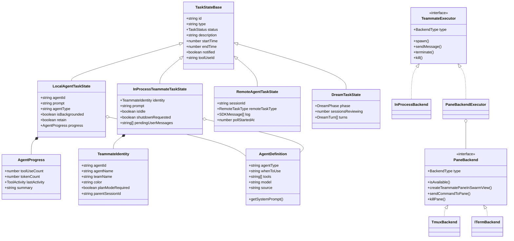

## 4. 接口设计

### 4.1 对外接口（export API）

#### 4.1.1 AgentTool (tools/AgentTool/AgentTool.tsx)

**call(input, toolUseContext, canUseTool, assistantMessage, onProgress?)**

核心入口，路由三种执行模式：Teammate 生成、子代理执行（同步/异步）、远程执行。

- 参数：`{ description, prompt, subagent_type?, model?, run_in_background?, name?, team_name?, isolation?, cwd? }`
- 返回：`Output | TeammateSpawnedOutput | RemoteLaunchedOutput`

#### 4.1.2 SendMessageTool (tools/SendMessageTool/SendMessageTool.ts)

**call(input, context)**

Agent 间消息路由，支持点对点、广播、结构化协议消息（shutdown、plan_approval）。

- 参数：`{ to: string, summary?: string, message: string | StructuredMessage }`
- 返回：`MessageOutput | BroadcastOutput | RequestOutput | ResponseOutput`

#### 4.1.3 TeamCreateTool (tools/TeamCreateTool/TeamCreateTool.ts)

**call(input, context)**

创建多 Agent 团队，初始化团队文件、任务列表和 AppState。

- 参数：`{ team_name: string, description?: string, agent_type?: string }`
- 返回：`{ team_name, team_file_path, lead_agent_id }`

#### 4.1.4 TeamDeleteTool (tools/TeamDeleteTool/TeamDeleteTool.ts)

**call(input, context)**

删除团队，清理目录和 AppState。要求先关闭所有活跃队友。

- 参数：`{}`（无输入）
- 返回：`{ success, message, team_name? }`

#### 4.1.5 任务注册函数

| 函数 | 文件 | 说明 |
|------|------|------|
| `registerAsyncAgent({...})` | LocalAgentTask.tsx:466 | 注册后台 Agent 任务 |
| `registerAgentForeground({...})` | LocalAgentTask.tsx:526 | 注册前台 Agent 任务，返回 backgroundSignal |
| `registerRemoteAgentTask({...})` | RemoteAgentTask.tsx:386 | 注册远程 Agent 任务，启动轮询 |
| `registerDreamTask({...})` | DreamTask.ts:52 | 注册记忆整合任务 |
| `spawnInProcessTeammate({...})` | spawnInProcess.ts:104 | 生成进程内队友 |

#### 4.1.6 任务生命周期函数

| 函数 | 文件 | 说明 |
|------|------|------|
| `completeAgentTask(result, setAppState)` | LocalAgentTask.tsx:412 | 标记 Agent 任务完成 |
| `failAgentTask(taskId, error, setAppState)` | LocalAgentTask.tsx:437 | 标记 Agent 任务失败 |
| `killAsyncAgent(taskId, setAppState)` | LocalAgentTask.tsx:281 | 中止后台 Agent |
| `backgroundAgentTask(taskId, ...)` | LocalAgentTask.tsx:620 | 前台 Agent 后台化 |
| `stopTask(taskId, context)` | stopTask.ts:38 | 通用任务停止接口 |
| `killInProcessTeammate(taskId, setAppState)` | spawnInProcess.ts:227 | 杀死进程内队友 |

#### 4.1.7 后端选择函数

| 函数 | 文件 | 说明 |
|------|------|------|
| `detectAndGetBackend()` | registry.ts:136 | 自动检测最佳后端 |
| `getTeammateExecutor(preferInProcess?)` | registry.ts:425 | 获取队友执行器 |
| `isInProcessEnabled()` | registry.ts:351 | 检查进程内模式 |

#### 4.1.8 协调器函数

| 函数 | 文件 | 说明 |
|------|------|------|
| `isCoordinatorMode()` | coordinatorMode.ts:36 | 检查协调器模式 |
| `matchSessionMode(sessionMode)` | coordinatorMode.ts:49 | 恢复会话时匹配模式 |
| `getCoordinatorUserContext(...)` | coordinatorMode.ts:80 | 获取协调器上下文 |
| `getCoordinatorSystemPrompt()` | coordinatorMode.ts:111 | 获取协调器系统提示词 |

### 4.2 Interface 定义与实现

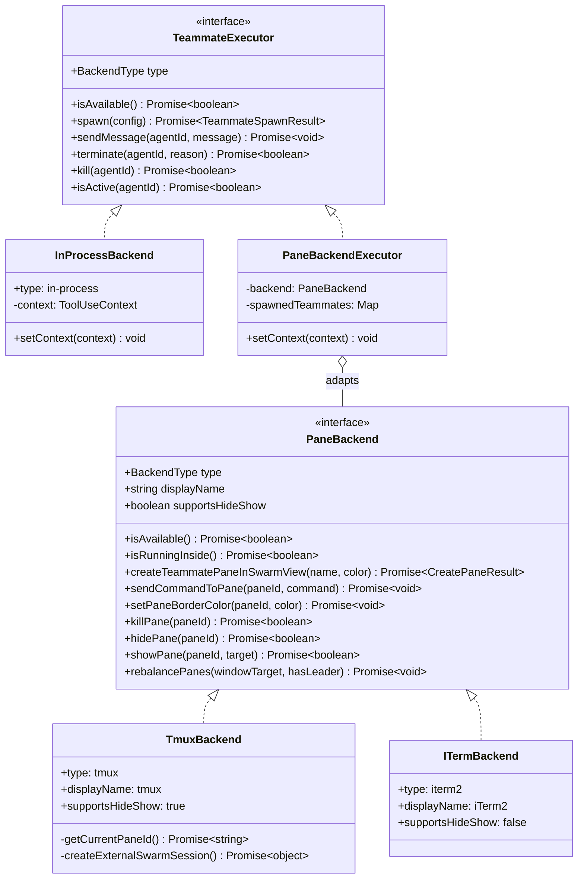

## 5. 核心流程设计

### 5.1 AgentTool 调用分发流程

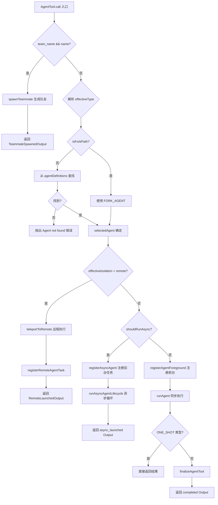

### 5.2 进程内队友 (InProcessTeammate) 执行流程

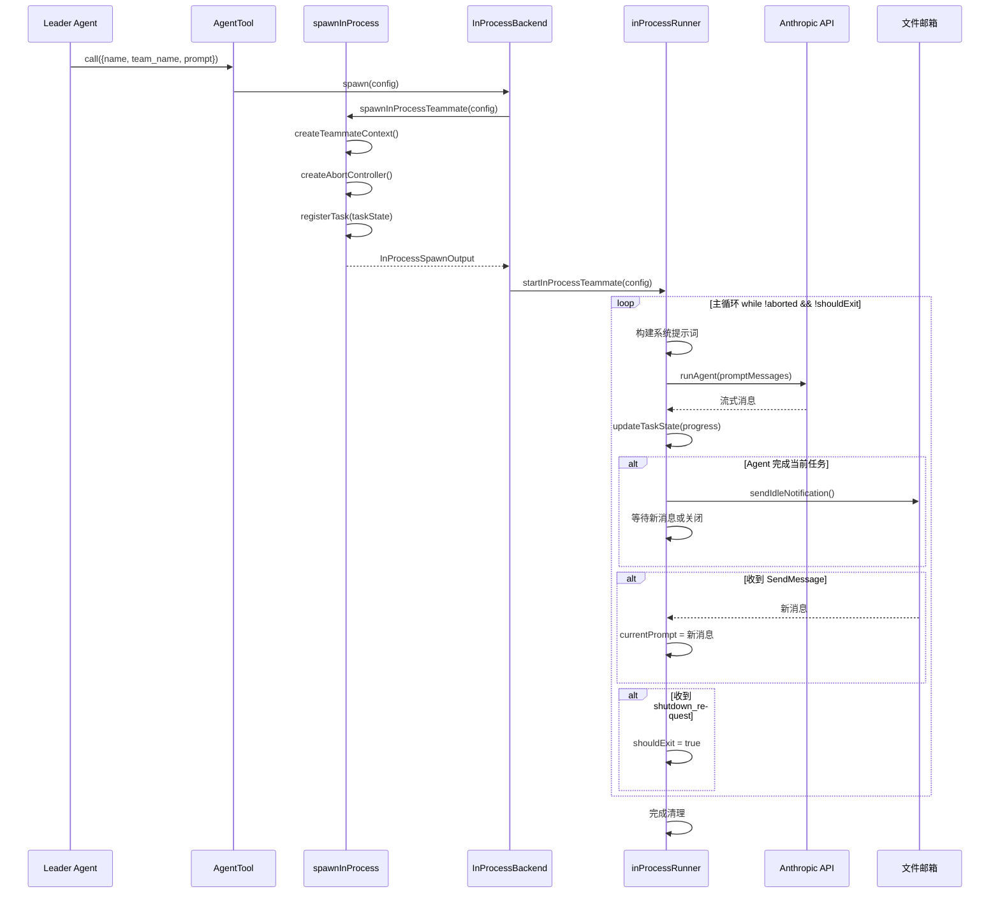

### 5.3 异步 Agent 生命周期

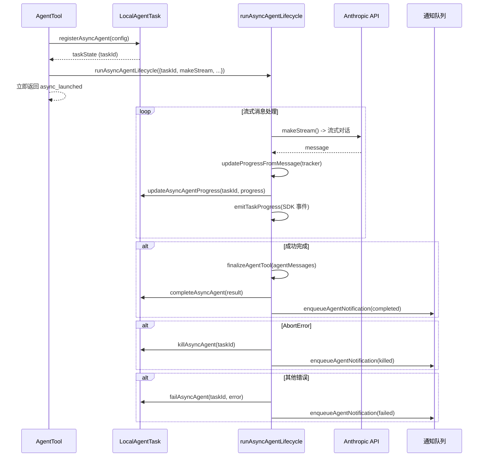

### 5.4 后端检测与选择流程

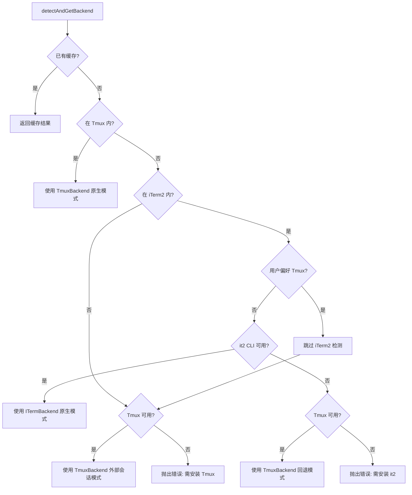

### 5.5 团队创建与协作流程

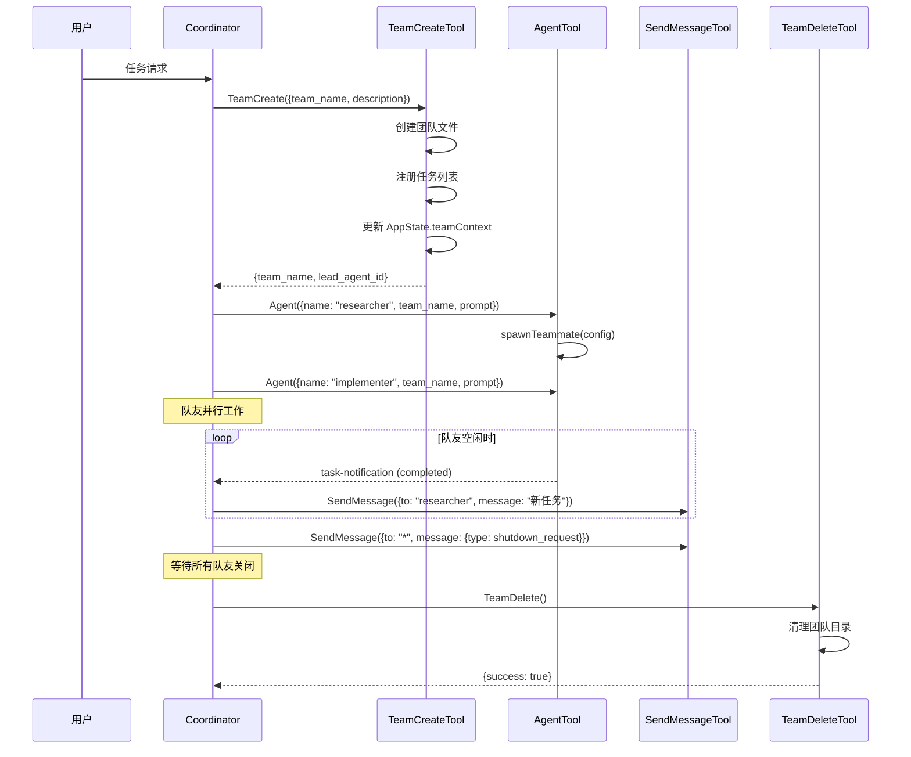

### 5.6 权限同步机制

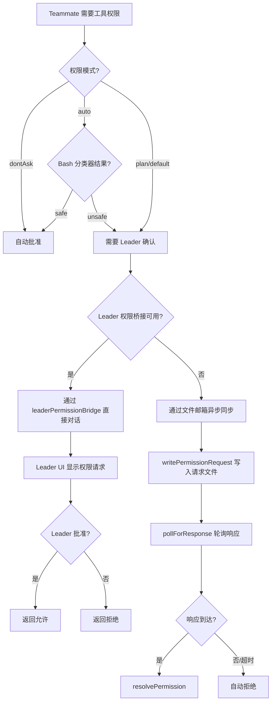

## 6. 状态管理

### 6.1 状态定义

任务状态 (TaskStatus) 定义了 5 种生命周期状态：

| 状态 | 说明 |
|------|------|
| `pending` | 已注册但未开始 |
| `running` | 正在执行中 |
| `completed` | 成功完成 |
| `failed` | 执行失败 |
| `killed` | 被用户或系统中止 |

### 6.2 状态转换图

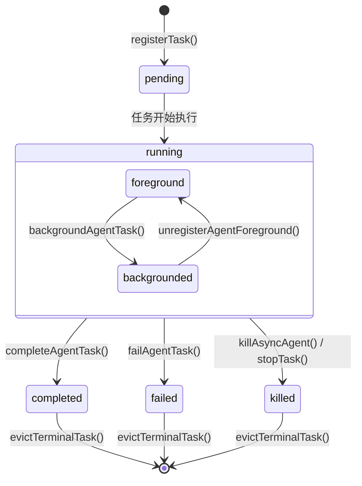

### 6.3 状态转换条件

| 当前状态 | 触发条件 | 目标状态 | 执行动作 |
|----------|----------|----------|----------|
| pending | registerTask() 注册完成 | running | 发送 task_started SDK 事件 |
| running | Agent 对话循环正常结束 | completed | 设置 endTime、evictAfter、发送通知 |
| running | Agent 对话循环抛出非 AbortError | failed | 设置 error、endTime、发送通知 |
| running | 用户调用 TaskStop / AbortController.abort() | killed | 中止控制器、清理资源、发送通知 |
| completed/failed/killed | notified=true + evictAfter 过期 | [已驱逐] | 从 AppState.tasks 中删除 |
| running (前台) | Ctrl+B 或 autoBackgroundMs 超时 | running (后台) | isBackgrounded=true, backgroundSignal.resolve() |

## 7. 错误处理设计

### 7.1 错误类型

| 错误类型 | 文件 | 说明 |
|----------|------|------|
| `StopTaskError` | stopTask.ts:10-18 | 任务停止错误，含 code：`not_found`/`not_running`/`unsupported_type` |
| `AbortError` | utils/errors.ts (外部) | AbortController 中止导致的错误 |
| `Error` (通用) | 各工具文件 | 参数验证、权限检查、MCP 服务器不可用等 |

### 7.2 错误处理策略

1. **Agent 执行错误**：`runAsyncAgentLifecycle` 中区分 `AbortError`（用户中止）和其他错误（Agent 失败），分别调用 `killAsyncAgent` 或 `failAsyncAgent`，并通过 `enqueueAgentNotification` 通知 Coordinator。

2. **Teammate 生成错误**：`spawnInProcessTeammate` 使用 try-catch 包装整个生成过程，失败时返回 `{success: false, error}` 而非抛出异常。

3. **权限请求超时**：`permissionSync.pollForResponse` 在超时后返回 null，调用方自动拒绝权限请求。

4. **MCP 服务器等待**：AgentTool.call() 在 Agent 需要特定 MCP 服务器时，最多等待 30 秒（500ms 轮询间隔），期间监测服务器连接失败提前退出。

### 7.3 错误传播链

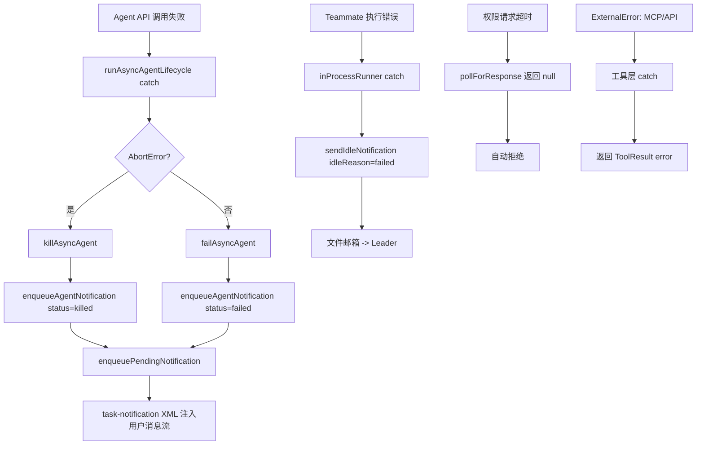

## 8. 并发设计

### 8.1 并发模型

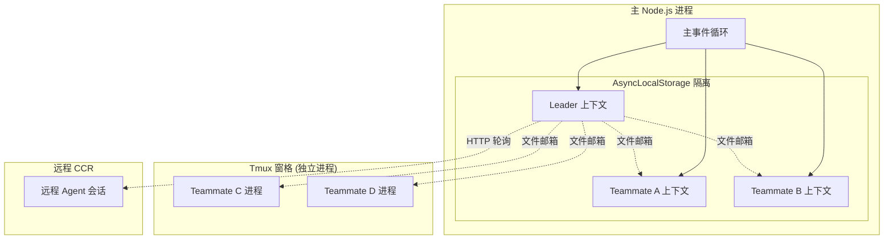

### 8.2 异步协调机制

1. **AsyncLocalStorage 隔离**：进程内队友通过 `createTeammateContext` 在同一 Node.js 进程中运行，使用 AsyncLocalStorage 实现上下文隔离。每个队友有独立的 `agentId`、`teamName`、`AbortController`。

2. **文件邮箱通信**：所有队友（无论进程内还是 Tmux 窗格）通过文件系统邮箱 (`writeToMailbox`) 交换消息。邮箱路径基于团队名和接收者名称确定。

3. **权限同步双路径**：
   - **直接路径**：通过 `leaderPermissionBridge` 注册的回调，进程内队友可直接访问 Leader 的 UI 权限对话框
   - **文件路径**：通过 `permissionSync.writePermissionRequest` 写入文件，`pollForResponse` 轮询响应

4. **AbortController 链**：每个队友有独立的 AbortController（不链接到 Leader），避免 Leader 查询中断时误杀队友。每轮对话还有 `currentWorkAbortController` 允许 Escape 中止当前工作而不杀死整个队友。

5. **任务轮询**：`framework.pollTasks` 以 1 秒间隔轮询所有运行中任务的输出增量，通过 `generateTaskAttachments` 生成通知附件。远程任务同样以 1 秒间隔轮询云端事件。

### 8.3 数据流图

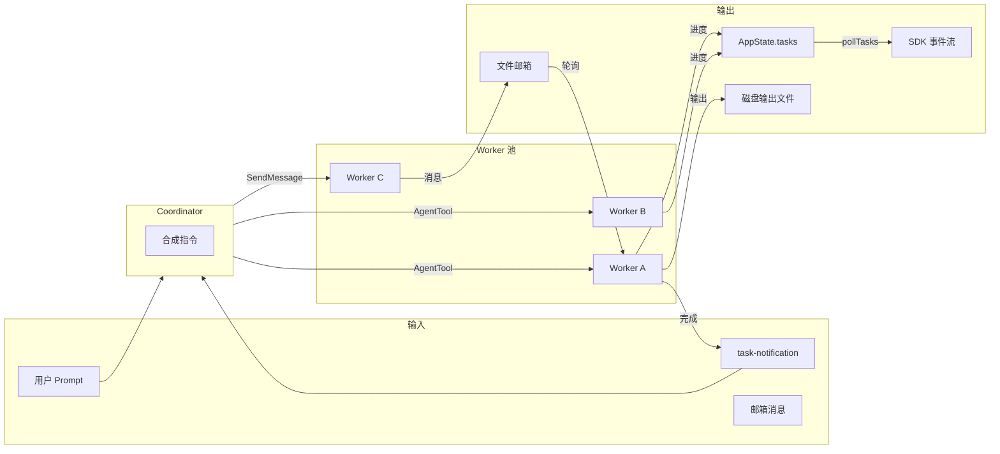

## 9. 设计约束与决策

### 9.1 设计模式

1. **策略模式 (Strategy)**：`PaneBackend` 和 `TeammateExecutor` 接口定义了统一的队友管理操作，`TmuxBackend`、`ITermBackend`、`InProcessBackend` 作为具体策略实现。通过 `registry.detectAndGetBackend()` 在运行时选择策略。

2. **工厂注册模式 (Factory Registry)**：`TmuxBackend.ts` 和 `ITermBackend.ts` 在模块加载时自注册到 `registry.ts`（通过 `registerTmuxBackend(TmuxBackend)`），避免了显式的条件分支和循环依赖。

3. **适配器模式 (Adapter)**：`PaneBackendExecutor` 将低层 `PaneBackend`（窗格操作）适配为高层 `TeammateExecutor`（队友生命周期），封装了命令构建、环境变量传递和进程管理。

4. **观察者模式 (Observer)**：任务状态变更通过 `enqueuePendingNotification` 注入用户消息流，Coordinator 通过解析 `<task-notification>` XML 响应 Agent 状态变化。

5. **类型守卫模式 (Type Guard)**：每个任务类型提供 `isXxxTask()` 类型守卫函数（如 `isLocalAgentTask`、`isInProcessTeammateTask`），用于安全的联合类型窄化。

### 9.2 性能考量

1. **Lazy Schema**：AgentTool 的 Zod schema 使用 `lazySchema()` 延迟初始化，避免模块加载时的 schema 编译开销 (AgentTool.tsx:82-125)。

2. **缓存检测结果**：`detectAndGetBackend()` 缓存首次检测结果 (registry.ts:140-146)，避免重复的环境探测（Tmux/iTerm2 命令执行）。

3. **增量输出读取**：`getTaskOutputDelta(taskId, fromOffset)` 仅读取磁盘文件的新增部分 (diskOutput.ts:304-330)，避免全量文件加载。

4. **内存缓冲 + 磁盘溢出**：`TaskOutput` 在内存中缓冲输出数据（默认 8MB 上限），超出后自动溢出到磁盘 (TaskOutput.ts:32-390)。

5. **消息上限**：`InProcessTeammateTaskState.messages` 通过 `appendCappedMessage` 限制为最多 50 条 (types.ts:101)，防止长时间运行的队友消耗过多内存。

6. **自动后台化**：Agent 运行超过 120 秒自动后台化 (AgentTool.tsx:72-77)，释放用户的前台交互。

### 9.3 扩展点

1. **自定义 Agent 定义**：通过 Markdown 或 JSON 文件定义自定义 Agent（`loadAgentsDir.ts:445-754`），支持自定义系统提示词、工具列表、权限模式。

2. **内置 Agent 扩展**：`builtInAgents.ts:22-72` 通过 feature gate 控制内置 Agent 的可用性，新增内置 Agent 只需实现 `BuiltInAgentDefinition` 接口。

3. **后端扩展**：实现 `PaneBackend` 或 `TeammateExecutor` 接口并在 `registry.ts` 注册，即可添加新的终端后端。

4. **远程任务完成检查器**：通过 `registerCompletionChecker(remoteTaskType, checker)` (RemoteAgentTask.tsx:84) 注册自定义远程任务完成逻辑。

5. **Agent 记忆系统**：通过 `agentMemory.ts` 和 `agentMemorySnapshot.ts` 提供的接口，Agent 可以在 user/project/local 三个范围持久化记忆。

## 10. 设计评估

### 10.1 优点

1. **职责清晰的分层架构**：工具层（AgentTool 等）负责用户交互和参数校验，任务层（LocalAgentTask 等）负责状态管理，Swarm 层（utils/swarm/）负责底层执行。每层通过明确的函数接口通信，无跨层直接调用。（证据：AgentTool.tsx 调用 `registerAsyncAgent` 而非直接操作 AppState.tasks）

2. **优秀的后端抽象**：`PaneBackend` 和 `TeammateExecutor` 两层接口将 Tmux、iTerm2、进程内三种完全不同的执行方式统一为相同的操作语义。`PaneBackendExecutor` 适配器巧妙地将窗格操作转换为队友生命周期操作。（证据：backends/types.ts:39-168 定义 PaneBackend，types.ts:279-300 定义 TeammateExecutor）

3. **可靠的类型安全**：每个任务类型都有独立的类型守卫函数（`isLocalAgentTask`、`isInProcessTeammateTask` 等），`TaskState` 联合类型确保编译期类型检查。`updateTaskState` 使用泛型 `<T extends TaskState>` 保证类型安全的状态更新。（证据：framework.ts:48-72）

4. **前后台无缝切换**：`registerAgentForeground` 返回 `backgroundSignal: Promise<void>`，通过 Promise resolve 实现前台到后台的无损切换，`backgroundAgentTask` 反向操作。（证据：LocalAgentTask.tsx:526-620、620-655）

5. **TOCTOU 防护**：`applyTaskOffsetsAndEvictions` 在 await 后重新检查任务状态（"Re-check status on fresh state"），避免异步间隙中的状态竞争。（证据：framework.ts:228-248 注释 "Re-check terminal+notified on fresh state (TOCTOU)"）

### 10.2 缺点与风险

1. **AgentTool.tsx 过于庞大**：单个 `call()` 方法包含 Teammate 生成、Fork 路由、远程执行、MCP 等待、前台/后台切换等多个职责，达到约 500 行。条件分支深层嵌套使逻辑难以追踪。（证据：AgentTool.tsx:239-567，call() 方法跨越 300+ 行）

2. **inProcessRunner.ts 超长**：1552 行的单文件包含了权限处理、消息循环、任务状态更新、空闲通知等多个关注点。（证据：inProcessRunner.ts 总计 1552 行）

3. **Feature Gate 散布**：`feature('COORDINATOR_MODE')`、`feature('KAIROS')`、`feature('FORK_SUBAGENT')` 等条件分支散布在多个文件中，增加了代码路径的组合复杂度。（证据：AgentTool.tsx:59, 99, 111, 553, 557, 566 等处使用 feature gate）

4. **类型断言绕过**：`TeammateSpawnedOutput` 和 `RemoteLaunchedOutput` 通过 `as unknown as { data: Output }` 绕过类型检查返回非 schema 定义的输出。（证据：AgentTool.tsx:311-315, 477-481 的 `as unknown as` 类型断言）

5. **循环依赖规避**：`coordinatorMode.ts` 开头注释说明为避免循环依赖而重复实现 `isScratchpadGateEnabled`（证据：coordinatorMode.ts:19-24 注释）；AgentTool.tsx 中多处使用内联环境变量检查而非导入函数（证据：AgentTool.tsx:223, 553）。

6. **文件邮箱缺乏事务性**：队友间通信依赖文件系统邮箱 (`writeToMailbox`)，在高并发场景下可能存在消息丢失或顺序错乱风险。（证据：inProcessRunner.ts:547-563 的 `sendMessageToLeader` 使用 `writeToMailbox`）

### 10.3 改进建议

1. **拆分 AgentTool.call()**：将 Teammate 生成、远程执行、Fork 路由提取为独立函数（如 `handleTeammateSpawn`、`handleRemoteExecution`、`handleForkPath`），`call()` 仅做顶层路由分发。目标：call() 缩减到 100 行以内。（解决 10.2 第 1 点）

2. **拆分 inProcessRunner.ts**：将权限处理逻辑（createInProcessCanUseTool 及相关函数）提取为 `inProcessPermissions.ts`，将空闲循环和任务认领逻辑提取为 `inProcessIdleLoop.ts`。（解决 10.2 第 2 点）

3. **统一 Feature Gate 层**：引入 `featureFlags.ts` 模块集中管理所有 feature gate 的组合逻辑，各模块通过导入该模块获取开关状态，减少散布的条件分支。（解决 10.2 第 3 点）

4. **消除类型断言**：将 `TeammateSpawnedOutput` 和 `RemoteLaunchedOutput` 加入 `Output` 联合类型的 schema 定义（使用条件 schema），或改用 discriminated union 的标准返回路径。（解决 10.2 第 4 点）

5. **引入消息队列抽象**：将文件邮箱封装为 `MessageBus` 接口，支持文件和内存两种实现。进程内队友可使用内存队列提高可靠性和性能。（解决 10.2 第 6 点）
