# skills 技能系统 子模块详细设计文档

## 文档信息
| 项目 | 内容 |
|------|------|
| 模块名称 | skills（技能系统） |
| 文档版本 | v1.0-20260401 |
| 生成日期 | 2026-04-01 |
| 生成方式 | 代码反向工程 |

## 1. 模块概述

### 1.1 模块职责

skills 模块是 Claude Code 的**技能注册与加载子系统**，负责将预定义的提示词模板（称为"技能/Skill"）注册为可调用的斜杠命令（`/skill-name`），供用户和模型在对话中触发使用。模块统一管理三类技能来源：内置技能（bundled，编译在 CLI 中）、磁盘技能（用户在 `.claude/skills/` 目录下编写的 `SKILL.md` 文件）和 MCP 技能（通过 MCP 服务器远程加载），并在运行时动态发现、去重、条件激活技能。

### 1.2 模块边界

**输入**：
- 内置技能定义（`BundledSkillDefinition` 类型，由 `bundled/` 子目录下各技能文件提供）
- 磁盘上的 `SKILL.md` 文件（从 `~/.claude/skills/`、项目级 `.claude/skills/`、托管策略目录等多层级加载）
- MCP 技能构建器（通过 `mcpSkillBuilders.ts` 依赖注入注册）
- 用户输入的命令参数（`args: string`）
- 工具使用上下文（`ToolUseContext`）

**输出**：
- `Command[]` 数组，包含所有已注册技能的元数据和 `getPromptForCommand()` 回调
- 技能激活信号（通过 `Signal` 通知其他模块刷新缓存）

**外部交互边界**：
- 上游：`commands.ts`（命令注册表）和 `SkillTool`（技能工具）调用本模块获取可用技能
- 下游：依赖 `utils/` 层的 frontmatter 解析器、Markdown 加载器、权限系统、设置系统等
- 旁路：`services/mcp/` 通过 `mcpSkillBuilders.ts` 获取 `createSkillCommand` 和 `parseSkillFrontmatterFields` 以避免循环依赖

## 2. 架构设计

### 2.1 模块架构图

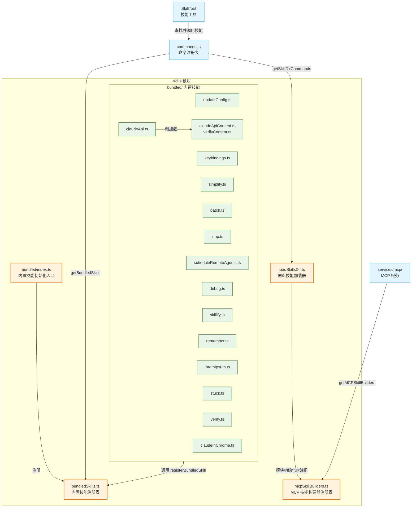

### 2.2 源文件组织

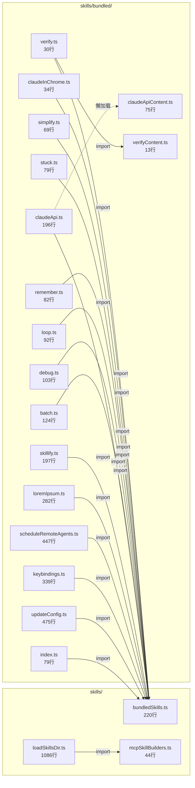

### 2.3 外部依赖

| npm 包 | 用途 | 使用位置 |
|--------|------|----------|
| `@anthropic-ai/sdk` | `ContentBlockParam` 类型定义 | `bundledSkills.ts` |
| `ignore` | gitignore 风格路径模式匹配（条件技能激活） | `loadSkillsDir.ts` |
| `lodash-es/memoize` | 函数结果缓存（`getSkillDirCommands` 避免重复磁盘 I/O） | `loadSkillsDir.ts` |
| `bun:bundle` | 编译期 feature flag（`feature()` 条件加载技能） | `bundled/index.ts` |
| `zod/v4` | 运行时 schema 校验（hooks 配置验证） | `bundled/updateConfig.ts`（间接通过 `HooksSchema`） |

## 3. 数据结构设计

### 3.1 核心数据结构

#### BundledSkillDefinition（内置技能定义）

`bundledSkills.ts:15-41`

定义内置技能的配置模式，是所有 `registerXxxSkill()` 函数传入 `registerBundledSkill()` 时使用的参数类型。

| 字段名 | 类型 | 说明 |
|--------|------|------|
| `name` | `string` | 技能名称，对应斜杠命令 `/name` |
| `description` | `string` | 技能描述，展示在帮助和自动补全中 |
| `aliases` | `string[]` (可选) | 技能别名列表 |
| `whenToUse` | `string` (可选) | 详细使用场景描述，指导模型何时自动触发 |
| `argumentHint` | `string` (可选) | 参数提示（灰色显示在命令名后） |
| `allowedTools` | `string[]` (可选) | 技能执行时可使用的工具白名单 |
| `model` | `string` (可选) | 指定使用的模型 |
| `disableModelInvocation` | `boolean` (可选) | 是否禁止模型自动触发此技能 |
| `userInvocable` | `boolean` (可选) | 用户是否可通过 `/name` 手动调用 |
| `isEnabled` | `() => boolean` (可选) | 运行时启用检查回调 |
| `hooks` | `HooksSettings` (可选) | 技能关联的 hook 配置 |
| `context` | `'inline' \| 'fork'` (可选) | 执行上下文：inline 展开到当前对话 / fork 在子 Agent 中运行 |
| `agent` | `string` (可选) | fork 模式下使用的 Agent 类型 |
| `files` | `Record<string, string>` (可选) | 附属参考文件（键为相对路径，值为内容），首次调用时提取到磁盘 |
| `getPromptForCommand` | `(args, context) => Promise<ContentBlockParam[]>` | 核心回调：根据用户参数生成提示词内容 |

#### Command / PromptCommand（命令对象）

定义在 `types/command.ts:25-57, 175-206`。`Command` 是运行时技能对象的类型，`PromptCommand` 是其"提示型"变体（技能均为此类型）。参见第 4.2 节的接口关系图。

#### LoadedFrom（技能来源标识）

`loadSkillsDir.ts:67-73`

```typescript
type LoadedFrom = 'commands_DEPRECATED' | 'skills' | 'plugin' | 'managed' | 'bundled' | 'mcp'
```

| 枚举值 | 说明 |
|--------|------|
| `bundled` | 编译在 CLI 中的内置技能 |
| `skills` | 从 `.claude/skills/` 目录加载的用户技能 |
| `commands_DEPRECATED` | 从 legacy `.claude/commands/` 目录加载（已废弃） |
| `managed` | 从托管策略目录加载 |
| `plugin` | 从插件加载 |
| `mcp` | 从 MCP 服务器远程加载 |

#### MCPSkillBuilders（MCP 技能构建器注册表类型）

`mcpSkillBuilders.ts:26-29`

| 字段名 | 类型 | 说明 |
|--------|------|------|
| `createSkillCommand` | `typeof createSkillCommand` | 技能 Command 对象工厂函数引用 |
| `parseSkillFrontmatterFields` | `typeof parseSkillFrontmatterFields` | frontmatter 解析函数引用 |

#### SkillWithPath（内部去重辅助类型，模块私有，不导出）

`loadSkillsDir.ts:127-130`

| 字段名 | 类型 | 说明 |
|--------|------|------|
| `skill` | `Command` | 加载的技能对象 |
| `filePath` | `string` | 技能文件路径（用于 symlink 去重） |

### 3.2 数据关系图

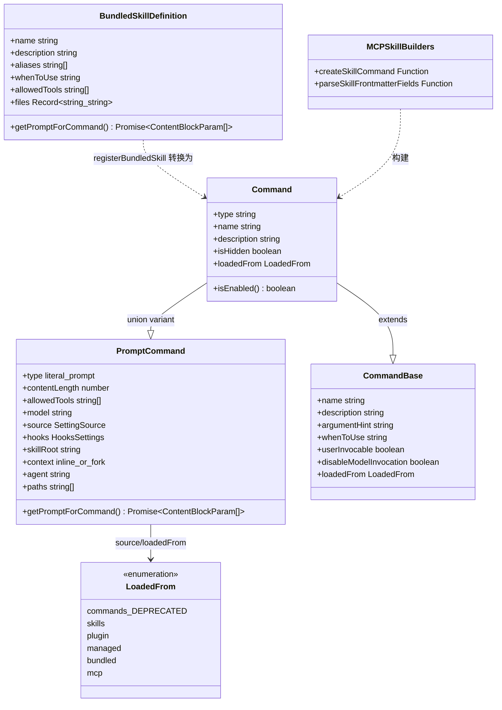

## 4. 接口设计

### 4.1 对外接口（export API）

#### bundledSkills.ts 导出函数

**`registerBundledSkill(definition: BundledSkillDefinition): void`** (`bundledSkills.ts:53-100`)

注册一个内置技能到内部注册表。在启动时由 `initBundledSkills()` 调用。如果定义中包含 `files` 字段，会包装 `getPromptForCommand` 回调以在首次调用时将参考文件提取到磁盘，并在提示词前添加 `Base directory for this skill: <dir>` 前缀。

**`getBundledSkills(): Command[]`** (`bundledSkills.ts:106-108`)

返回所有已注册内置技能的副本数组（防止外部修改原始注册表）。

**`clearBundledSkills(): void`** (`bundledSkills.ts:113-115`)

清空内置技能注册表。仅用于测试。

**`getBundledSkillExtractDir(skillName: string): string`** (`bundledSkills.ts:120-122`)

返回指定内置技能参考文件的确定性提取目录路径。基于 `getBundledSkillsRoot()` + 技能名称。

#### loadSkillsDir.ts 导出函数

**`getSkillsPath(source: SettingSource | 'plugin', dir: 'skills' | 'commands'): string`** (`loadSkillsDir.ts:78-94`)

根据设置来源返回对应的 Claude 配置目录路径（策略级 → `managedPath/.claude/skills`，用户级 → `~/.claude/skills`，项目级 → `.claude/skills`）。

**`estimateSkillFrontmatterTokens(skill: Command): number`** (`loadSkillsDir.ts:100-105`)

估算技能 frontmatter（name + description + whenToUse）的 token 数量，用于系统提示词的 token 预算控制。

**`parseSkillFrontmatterFields(frontmatter, markdownContent, resolvedName, descriptionFallbackLabel?): {...}`** (`loadSkillsDir.ts:185-265`)

解析并验证 `SKILL.md` 文件的 frontmatter 元数据字段。返回包含 displayName、description、allowedTools、model、hooks 等 16 个字段的结构化对象。是 MCP 技能加载的关键共享函数（通过 `mcpSkillBuilders.ts` 暴露）。

**`createSkillCommand({...}): Command`** (`loadSkillsDir.ts:270-401`)

技能 `Command` 对象的**工厂函数**。接收解析后的 frontmatter 字段和 markdown 内容，构造运行时 Command 对象。`getPromptForCommand` 回调中实现了：参数替换（`substituteArguments`）、`${CLAUDE_SKILL_DIR}` 变量替换、`${CLAUDE_SESSION_ID}` 替换、非 MCP 技能的 shell 命令执行（`executeShellCommandsInPrompt`）。

**`getSkillDirCommands(cwd: string): Promise<Command[]>`** (`loadSkillsDir.ts:638-804`)

**核心加载函数**（memoized）。并行从 5 个来源加载技能：托管策略目录、用户目录、项目目录、`--add-dir` 附加目录、legacy commands 目录。执行 symlink 去重（通过 `realpath`），分离条件技能（含 `paths` frontmatter），返回无条件技能列表。支持 `--bare` 模式（仅加载 `--add-dir` 指定路径）。

**`clearSkillCaches(): void`** (`loadSkillsDir.ts:806-811`)

清除 `getSkillDirCommands` 的 memoize 缓存以及条件技能状态。

**`onDynamicSkillsLoaded(callback: () => void): () => void`** (`loadSkillsDir.ts:839-851`)

注册动态技能加载完成时的回调，返回取消订阅函数。用于其他模块清理缓存而不产生 import 循环。

**`discoverSkillDirsForPaths(filePaths: string[], cwd: string): Promise<string[]>`** (`loadSkillsDir.ts:861-915`)

从文件路径向上遍历目录树（到 cwd 为止），发现 `.claude/skills` 目录。跳过 gitignore 的目录。返回按深度降序排列的新发现目录列表。

**`addSkillDirectories(dirs: string[]): Promise<void>`** (`loadSkillsDir.ts:923-975`)

加载指定目录中的技能并合并到动态技能映射。深层目录优先覆盖浅层。加载完成后触发 `skillsLoaded` 信号。

**`getDynamicSkills(): Command[]`** (`loadSkillsDir.ts:981-983`)

获取所有动态发现的技能列表。

**`activateConditionalSkillsForPaths(filePaths: string[], cwd: string): string[]`** (`loadSkillsDir.ts:997-1058`)

根据文件路径匹配条件技能的 `paths` 模式（gitignore 风格），激活匹配的技能。激活的技能从条件技能池移入动态技能池。返回新激活的技能名称列表。

**`getConditionalSkillCount(): number`** (`loadSkillsDir.ts:1063-1065`)

返回待激活的条件技能数量（调试/测试用）。

**`clearDynamicSkills(): void`** (`loadSkillsDir.ts:1070-1075`)

清除所有动态技能状态（测试用）。

**兼容性别名导出**：
- `getCommandDirCommands` — `getSkillDirCommands` 的别名 (`loadSkillsDir.ts:814`)
- `clearCommandCaches` — `clearSkillCaches` 的别名 (`loadSkillsDir.ts:815`)
- `transformSkillFiles` — 内部函数的导出 (`loadSkillsDir.ts:816`)

#### mcpSkillBuilders.ts 导出函数

**`registerMCPSkillBuilders(b: MCPSkillBuilders): void`** (`mcpSkillBuilders.ts:33-35`)

一次性写入注册 MCP 技能构建器。在 `loadSkillsDir.ts` 模块初始化时自动调用（`loadSkillsDir.ts:1083-1086`）。

**`getMCPSkillBuilders(): MCPSkillBuilders`** (`mcpSkillBuilders.ts:37-44`)

获取已注册的 MCP 技能构建器。若未注册则抛出 Error。由 `services/mcp/` 调用以获取 `createSkillCommand` 和 `parseSkillFrontmatterFields`。

#### bundled/index.ts 导出函数

**`initBundledSkills(): void`** (`bundled/index.ts:24-79`)

启动时调用的初始化函数。无条件注册 10 个核心内置技能，通过 `feature()` 编译期特性门控条件注册 5 个实验性技能（dream、hunter、loop、scheduleRemoteAgents、claudeApi、runSkillGenerator），并通过运行时检查条件注册 claudeInChrome 技能。

#### 各 bundled skill 的 register 函数

每个内置技能文件导出一个 `registerXxxSkill(): void` 函数：

| 函数名 | 文件 | 技能名 | 说明 |
|--------|------|--------|------|
| `registerUpdateConfigSkill` | `updateConfig.ts:445` | `update-config` | 配置 Claude Code 设置 |
| `registerKeybindingsSkill` | `keybindings.ts:292` | `keybindings-help` | 键盘快捷键自定义 |
| `registerVerifySkill` | `verify.ts:12` | `verify` | 验证代码更改（内部） |
| `registerDebugSkill` | `debug.ts:12` | `debug` | 调试会话诊断 |
| `registerLoremIpsumSkill` | `loremIpsum.ts:234` | `lorem-ipsum` | Lorem Ipsum 文本生成（内部） |
| `registerSkillifySkill` | `skillify.ts:158` | `skillify` | 会话捕获为可重用技能（内部） |
| `registerRememberSkill` | `remember.ts:4` | `remember` | 记忆审查与清理（内部） |
| `registerSimplifySkill` | `simplify.ts:55` | `simplify` | 代码审查与清理 |
| `registerBatchSkill` | `batch.ts:100` | `batch` | 大规模并行代码变更 |
| `registerStuckSkill` | `stuck.ts:61` | `stuck` | 诊断卡住的会话（内部） |
| `registerLoopSkill` | `loop.ts:74` | `loop` | 定期执行提示/命令（需 AGENT_TRIGGERS） |
| `registerScheduleRemoteAgentsSkill` | `scheduleRemoteAgents.ts:324` | `schedule` | 安排远程代理任务（需 AGENT_TRIGGERS_REMOTE） |
| `registerClaudeApiSkill` | `claudeApi.ts:180` | `claude-api` | Claude API 开发辅助（需 BUILDING_CLAUDE_APPS） |
| `registerClaudeInChromeSkill` | `claudeInChrome.ts:16` | `claude-in-chrome` | Chrome 浏览器自动化 |
| `registerBatchSkill` — 参见上方 | | | |

#### claudeApiContent.ts 导出常量

| 常量名 | 类型 | 说明 |
|--------|------|------|
| `SKILL_MODEL_VARS` | `Record<string, string>` | 模型 ID 和名称模板变量映射 (`claudeApiContent.ts:36-45`) |
| `SKILL_PROMPT` | `string` | 技能主提示词模板 (`claudeApiContent.ts:47`) |
| `SKILL_FILES` | `Record<string, string>` | 内联 markdown 参考文件（约 247KB，按语言分组） (`claudeApiContent.ts:49-75`) |

#### verifyContent.ts 导出常量

| 常量名 | 类型 | 说明 |
|--------|------|------|
| `SKILL_MD` | `string` | verify 技能的主提示词内容 (`verifyContent.ts:8`) |
| `SKILL_FILES` | `Record<string, string>` | verify 技能的附属文件 (`verifyContent.ts:10-13`) |

### 4.2 Interface 定义与实现

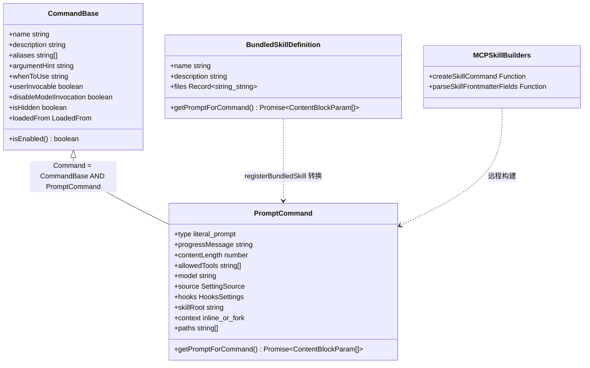

## 5. 核心流程设计

### 5.1 初始化流程

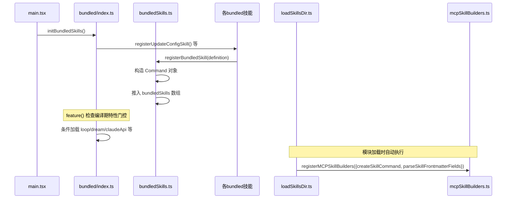

### 5.2 磁盘技能加载流程

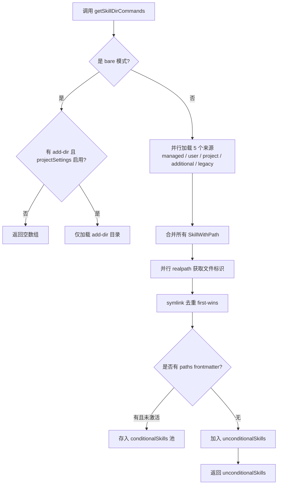

### 5.3 技能调用流程（getPromptForCommand）

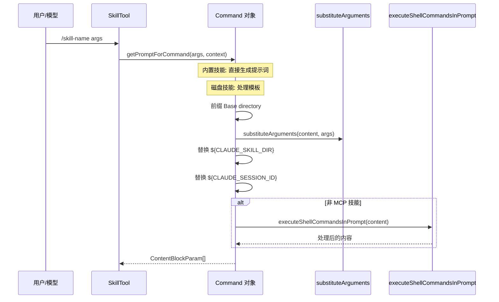

### 5.4 内置技能文件提取流程

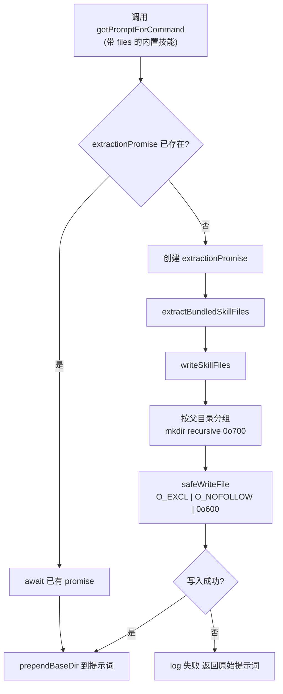

### 5.5 动态技能发现流程

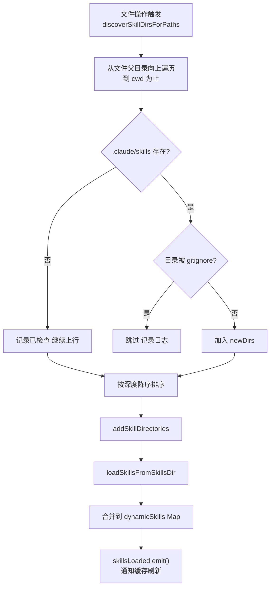

### 5.6 条件技能激活流程

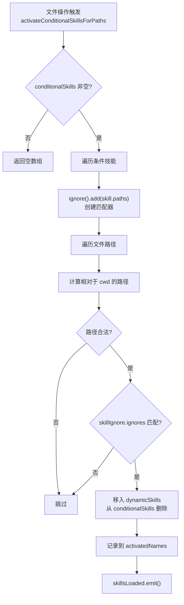

## 6. 状态管理

### 6.1 状态定义

本模块使用模块级变量管理状态（非 React State），分为两组：

**内置技能注册表状态** (`bundledSkills.ts`)：
- `bundledSkills: Command[]` — 已注册的内置技能数组

**磁盘/动态技能状态** (`loadSkillsDir.ts`)：
- `dynamicSkillDirs: Set<string>` — 已检查过的 skill 目录路径（含不存在的，避免重复 stat）
- `dynamicSkills: Map<string, Command>` — 动态发现的技能映射（name → Command）
- `conditionalSkills: Map<string, Command>` — 待激活的条件技能映射
- `activatedConditionalSkillNames: Set<string>` — 已激活的条件技能名称集合（跨缓存清除保持）
- `skillsLoaded: Signal<void>` — 技能加载完成信号

**MCP 构建器状态** (`mcpSkillBuilders.ts`)：
- `builders: MCPSkillBuilders | null` — 一次性写入的构建器引用

### 6.2 状态转换图

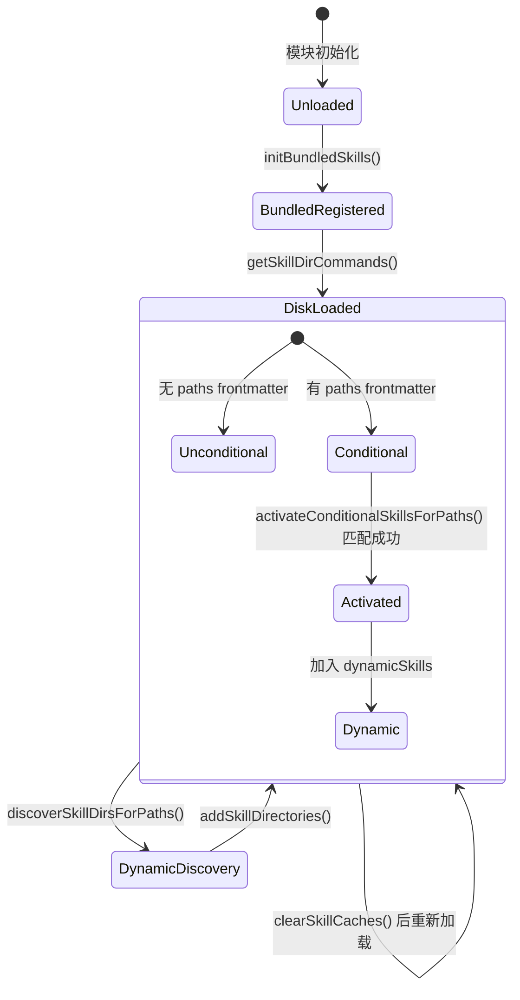

### 6.3 状态转换条件

| 当前状态 | 触发条件 | 目标状态 | 执行动作 |
|----------|----------|----------|----------|
| 未加载 | 启动时调用 `initBundledSkills()` | 内置已注册 | 遍历注册所有内置技能 |
| 内置已注册 | 首次调用 `getSkillDirCommands()` | 磁盘已加载 | 并行读取 5 个目录来源 |
| 磁盘已加载 | 调用 `clearSkillCaches()` | 缓存清除 | memoize 缓存失效，条件技能池清空 |
| 条件技能 | `activateConditionalSkillsForPaths()` 路径匹配 | 已激活/动态 | 移入 dynamicSkills Map |
| 磁盘已加载 | `discoverSkillDirsForPaths()` 发现新目录 | 动态发现 | stat → gitignore 检查 → 加载 |

## 7. 错误处理设计

### 7.1 错误类型

本模块未定义自定义 Error 类型，仅在 `mcpSkillBuilders.ts:39-41` 中抛出标准 `Error`：
```
'MCP skill builders not registered — loadSkillsDir.ts has not been evaluated yet'
```

### 7.2 错误处理策略

模块采用**静默降级**策略：大多数加载失败不会中断程序，而是记录日志并跳过有问题的技能。

| 错误场景 | 处理方式 | 位置 |
|----------|----------|------|
| 技能目录不存在（ENOENT） | 静默忽略 | `loadSkillsDir.ts:416-419` |
| `SKILL.md` 文件不存在 | 静默跳过，非 ENOENT 记录 warn | `loadSkillsDir.ts:438-444` |
| frontmatter 解析失败 | logError 后跳过该技能 | `loadSkillsDir.ts:472-474` |
| hooks 配置校验失败（zod） | 记录调试日志，返回 undefined | `loadSkillsDir.ts:146-149` |
| bundled 文件提取失败 | 记录调试日志，返回 null（技能照常工作但无 Base dir） | `bundledSkills.ts:139-144` |
| realpath 解析失败 | 返回 null，技能不参与去重（仍被加载） | `loadSkillsDir.ts:118-124` |
| `resolveSkillFilePath` 路径逃逸 | 抛出 Error（安全边界） | `bundledSkills.ts:199-204` |
| MCP 构建器未注册时调用 `getMCPSkillBuilders` | 抛出 Error | `mcpSkillBuilders.ts:39-41` |

### 7.3 错误传播链

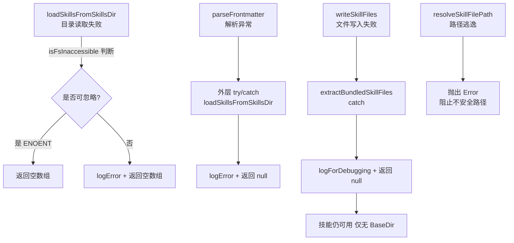

## 8. 并发设计

### 8.1 异步协调机制

#### 并行加载

`getSkillDirCommands` 使用 `Promise.all` 并行从 5 个独立来源加载技能（`loadSkillsDir.ts:679-714`）。各来源操作不同目录，无共享状态，可安全并行。

去重阶段同样并行预计算文件标识（`Promise.all` realpath 调用，`loadSkillsDir.ts:728-734`），然后同步去重（依赖顺序的 first-wins 策略）。

#### Memoization 防重入

`getSkillDirCommands` 使用 `lodash-es/memoize` 装饰，以 `cwd` 为缓存键，确保同一工作目录仅加载一次（`loadSkillsDir.ts:638`）。

#### 文件提取的 Promise 级缓存

`registerBundledSkill` 中，对带 `files` 的技能使用闭包缓存 `extractionPromise`（不是结果），确保并发调用 await 同一个提取 Promise，避免竞态写入（`bundledSkills.ts:64-68`）。

#### 信号通知

技能加载完成后通过 `skillsLoaded.emit()` 通知订阅者（`loadSkillsDir.ts:974, 1054`）。监听器在 `subscribe` 时包装 try/catch，单个监听器异常不会阻断其他监听器（`loadSkillsDir.ts:844-849`）。

### 8.2 数据流图

```mermaid
flowchart LR
    subgraph Sources["并行加载源"]
        S1["托管策略目录"]
        S2["用户目录"]
        S3["项目目录"]
        S4["附加目录"]
        S5["Legacy commands"]
    end

    Sources -->|Promise.all| MERGE["合并 SkillWithPath[]"]
    MERGE -->|Promise.all realpath| DEDUP["并行文件标识"]
    DEDUP --> SYNC["同步去重 first-wins"]
    SYNC --> SPLIT{"分离条件/无条件"}
    SPLIT -->|无 paths| OUT["返回 Command[]"]
    SPLIT -->|有 paths| COND["conditionalSkills Map"]
    COND -.->|文件操作触发| ACT["activateConditionalSkillsForPaths"]
    ACT -->|匹配| DYN["dynamicSkills Map"]
    DYN -.->|emit| SIGNAL["skillsLoaded Signal"]
```

## 9. 设计约束与决策

### 9.1 设计模式

**注册表模式（Registry）**：`bundledSkills.ts` 和 `loadSkillsDir.ts` 各维护一个注册表（数组/Map），所有技能通过统一接口注册和查询。内置技能使用命令式注册（`registerBundledSkill`），磁盘技能使用声明式发现（文件系统扫描）。

**工厂方法模式（Factory Method）**：`createSkillCommand()` 是统一的技能对象工厂，接收多种来源的元数据并构造标准 `Command` 对象。内置技能和磁盘技能共用同一构造路径的不同入口。

**依赖注入 / 服务定位器**：`mcpSkillBuilders.ts` 是一个最小化的服务定位器，用于打破 `loadSkillsDir.ts` ↔ `services/mcp/` 之间的循环依赖。通过写时注册（`loadSkillsDir.ts` 模块初始化时）、读时获取（MCP 服务连接时），将依赖解耦到一个无依赖的叶子模块。

**惰性初始化（Lazy Initialization）**：
- `claudeApi.ts` 使用 `await import('./claudeApiContent.js')` 懒加载 247KB 的参考文件内容（`claudeApi.ts:190`）
- 带 `files` 的内置技能使用闭包级 Promise 缓存实现首次使用时提取文件（`bundledSkills.ts:64-72`）
- feature-gated 技能使用 `require()` 动态加载（`bundled/index.ts:37-77`）

**观察者模式（Observer）**：`skillsLoaded` Signal 实现发布-订阅，技能加载完成后通知其他模块清理缓存。

**Memoization 模式**：`getSkillDirCommands` 使用 lodash memoize 缓存磁盘加载结果，避免每次查询都重新扫描文件系统。

### 9.2 性能考量

1. **启动性能**：内置技能注册是同步操作（注册 `Command` 对象到数组），不涉及 I/O。feature-gated 技能通过编译期 DCE（Dead Code Elimination）在构建时消除，不增加运行时开销。

2. **懒加载大内容**：`claudeApiContent.ts` 的 247KB 字符串仅在 `/claude-api` 首次调用时通过动态 `import()` 加载（`claudeApi.ts:190`），避免启动时加载。

3. **并行磁盘 I/O**：5 个来源的技能加载通过 `Promise.all` 并行执行（`loadSkillsDir.ts:679-714`）。去重的 realpath 调用同样并行（`loadSkillsDir.ts:728-734`）。

4. **避免重复 stat**：`dynamicSkillDirs` Set 记录所有已检查过的目录路径（含不存在的），避免对常见的"目录不存在"场景重复 stat（`loadSkillsDir.ts:882-883`）。

5. **安全写入**：`safeWriteFile` 使用 `O_EXCL` 标志创建文件，在 Windows 上使用 `'wx'` 字符串标志避免 libuv 的 `EINVAL` 问题（`bundledSkills.ts:178-184`）。

### 9.3 扩展点

1. **添加新内置技能**：在 `bundled/` 下创建新文件，导出 `registerXxxSkill()` 函数调用 `registerBundledSkill()`，然后在 `bundled/index.ts` 中 import 并调用。无需修改框架代码。

2. **用户自定义技能**：在 `.claude/skills/<skill-name>/SKILL.md` 创建 Markdown 文件，框架自动发现和加载。支持通过 frontmatter 配置所有技能属性（tools、model、hooks、paths 等）。

3. **MCP 远程技能**：MCP 服务器可通过 `getMCPSkillBuilders()` 获取构建器，创建与本地技能完全相同的 `Command` 对象。

4. **条件激活**：技能 frontmatter 中设置 `paths` 字段后，技能仅在模型操作匹配路径时激活，实现按需加载。

5. **feature flag 门控**：通过 `bun:bundle` 的 `feature()` 在编译期控制技能是否打包，支持实验性技能的渐进式发布。

## 10. 设计评估

### 10.1 优点

1. **清晰的注册-发现分离**：内置技能通过命令式 `registerBundledSkill()` 注册（`bundledSkills.ts:53-100`），磁盘技能通过声明式文件扫描发现（`loadSkillsDir.ts:407-480`），两条路径独立但最终产出统一的 `Command` 类型。职责划分明确。

2. **优雅的循环依赖解决方案**：`mcpSkillBuilders.ts` 仅 44 行代码，作为无依赖叶子模块实现依赖注入，解决了 `loadSkillsDir.ts` ↔ `services/mcp/` 之间的循环依赖。注释中详细说明了为何不能使用动态 import（`mcpSkillBuilders.ts:10-23`）。

3. **安全的文件提取设计**：`bundledSkills.ts:169-206` 中使用 `O_EXCL | O_NOFOLLOW` 标志防止 symlink 跟随和竞态创建，`resolveSkillFilePath` 校验路径逃逸，`getBundledSkillsRoot` 使用进程级 nonce 防止预创建攻击，`0o700`/`0o600` 权限确保 owner-only 访问。

4. **完善的去重机制**：`getSkillDirCommands` 通过 `realpath` 解析 symlink 后比较文件标识，正确处理跨目录 symlink 和重叠父目录的去重场景（`loadSkillsDir.ts:726-763`）。

5. **并发安全的 Promise 缓存**：带 `files` 的内置技能缓存 `extractionPromise`（而非结果），确保并发调用者 await 同一个提取操作（`bundledSkills.ts:64-68`）。

6. **良好的错误隔离**：`onDynamicSkillsLoaded` 在 subscribe 时包装 try/catch（`loadSkillsDir.ts:844-849`），单个监听器异常不会影响 `skillsLoaded.emit()` 的其他监听器。

### 10.2 缺点与风险

1. **loadSkillsDir.ts 过大**：1086 行包含磁盘加载、legacy 兼容、动态发现、条件激活等多个关注点。`getSkillDirCommands`（`loadSkillsDir.ts:638-804`）单函数 166 行，内含加载、去重、条件分离等多步逻辑。

2. **模块级可变状态分散**：`loadSkillsDir.ts` 中有 5 个模块级 `Set`/`Map` 变量（`dynamicSkillDirs`、`dynamicSkills`、`conditionalSkills`、`activatedConditionalSkillNames`、`skillsLoaded`，分布在行 821-832），加上 `bundledSkills.ts` 的 `bundledSkills` 数组和 `mcpSkillBuilders.ts` 的 `builders`，共 7 个独立的模块级可变状态。缺少统一的状态容器使得状态重置（如 `clearDynamicSkills` + `clearSkillCaches` + `clearBundledSkills` 三个函数）容易遗漏。

3. **兼容性别名增加理解负担**：`getCommandDirCommands`、`clearCommandCaches`（`loadSkillsDir.ts:814-815`）是 legacy 别名。保留这些别名虽出于兼容性，但增加了 API 表面积和命名歧义。

4. **`any` 类型的隐式使用**：`frontmatter` 参数类型为 `FrontmatterData`（来自 `frontmatterParser.js`），其属性通过 `as string` 类型断言访问（如 `frontmatter.model as string`，`loadSkillsDir.ts:225`；`frontmatter.agent as string`，`loadSkillsDir.ts:261`）。这些断言绕过了类型检查。

5. **顶层副作用**：`loadSkillsDir.ts:1083-1086` 在模块加载时执行 `registerMCPSkillBuilders()`。虽然注释解释了原因并标注了 eslint-disable，但模块初始化时的写入副作用增加了测试和模块加载顺序的复杂性。

### 10.3 改进建议

1. **拆分 loadSkillsDir.ts**：将动态技能发现（`discoverSkillDirsForPaths`、`addSkillDirectories`、动态状态变量）提取到独立的 `dynamicSkills.ts`；将 legacy commands 加载（`loadSkillsFromCommandsDir`、`transformSkillFiles`、命名辅助函数）提取到 `legacyCommands.ts`。主文件保留核心的 `getSkillDirCommands` 和 frontmatter 解析逻辑。

2. **统一状态管理**：将 7 个模块级可变状态收拢到一个 `SkillRegistry` 类或单例对象中，提供统一的 `reset()` 方法，避免遗漏清理。

3. **增强 FrontmatterData 类型安全**：为 `FrontmatterData` 中的已知字段（`model`、`agent`、`context`、`effort`）定义精确类型，消除 `as string` 类型断言。

4. **标记 legacy 别名为 @deprecated**：为 `getCommandDirCommands` 和 `clearCommandCaches` 添加 JSDoc `@deprecated` 标注，引导消费者迁移到新名称。
