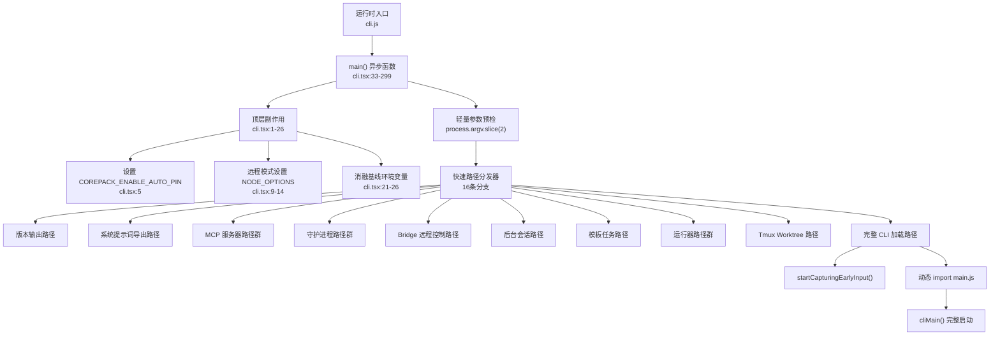
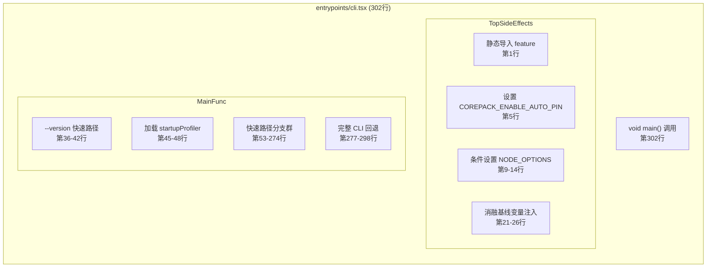
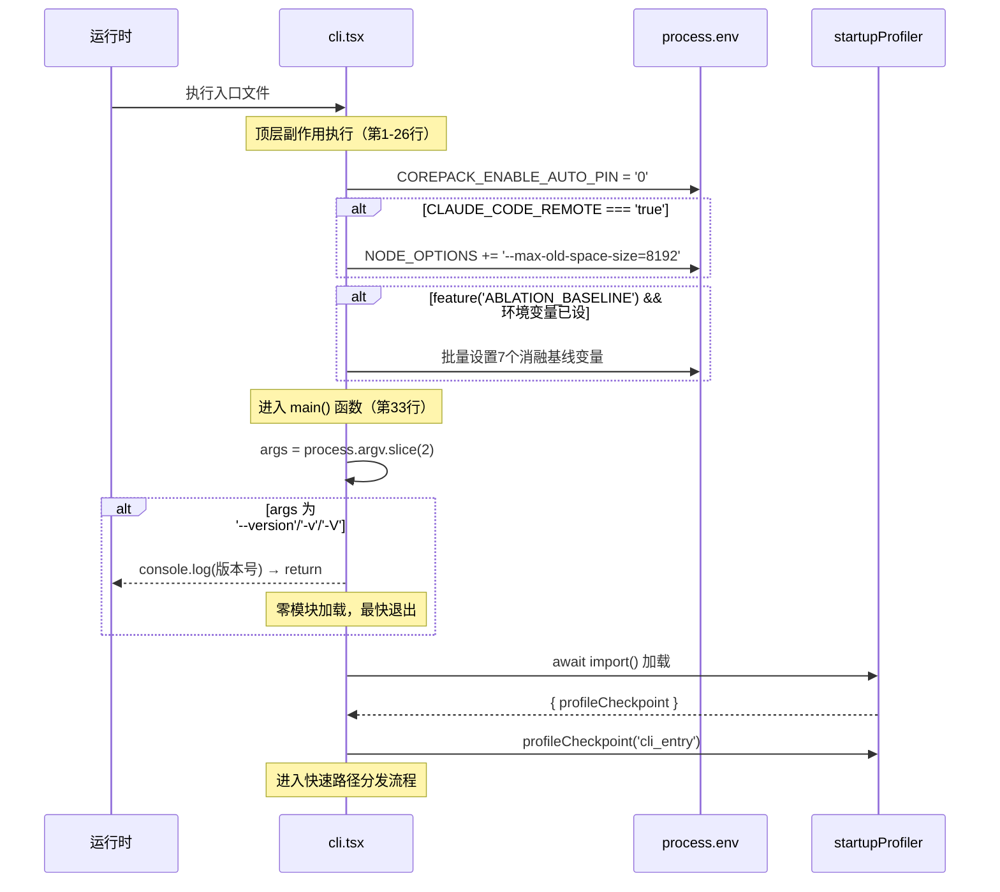
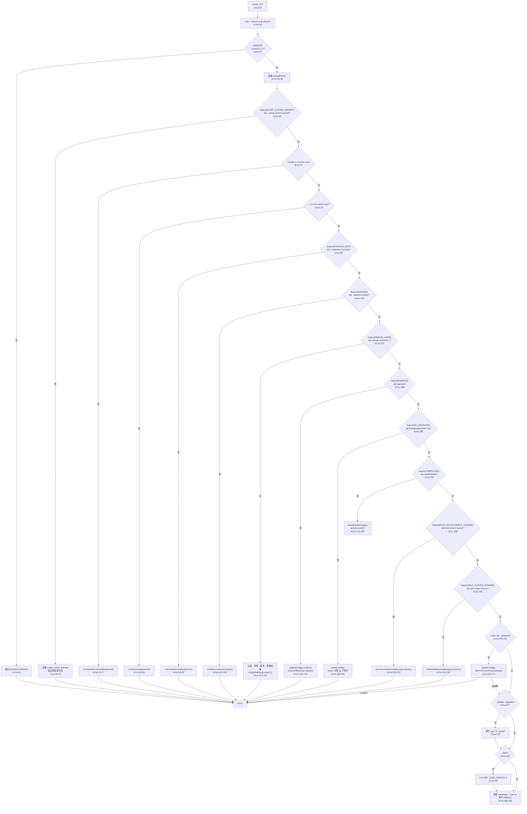
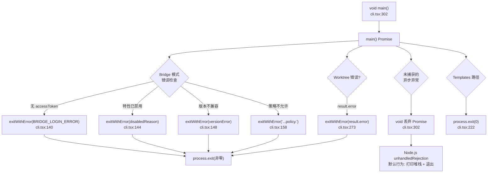

# CLI入口引导 (entrypoints/cli.tsx) 子模块详细设计文档

## 文档信息

| 项目 | 内容 |
|------|------|
| 模块名称 | CLI入口引导 (entrypoints/cli.tsx) |
| 文档版本 | v1.0-20260401 |
| 生成日期 | 2026-04-01 |
| 生成方式 | 代码反向工程 |
| 源文件行数 | 302 行 |
| 版本来源 | @anthropic-ai/claude-code v2.1.88 |

---

## 1. 模块概述

### 1.1 模块职责

`entrypoints/cli.tsx` 是 Claude Code CLI 应用程序的**最顶层引导入口**，承担以下核心职责：

1. **命令行参数预检与快速路径分发**：在加载完整 CLI 框架之前，对 `process.argv` 进行轻量级检查，将请求路由到对应的子系统（version 输出、MCP 服务器、Bridge 模式、守护进程等），避免不必要的模块加载开销。

2. **延迟模块加载策略执行**：除编译时内联的 `feature()` 函数外，所有依赖均通过 `await import()` 动态加载，确保每条执行路径仅加载其所需的最小模块集合。

3. **环境变量预置**：在任何模块执行前设置关键环境变量（`COREPACK_ENABLE_AUTO_PIN`、`NODE_OPTIONS`、消融基线变量等），保证下游模块在 import 时即可获取正确的环境状态。

4. **Feature Flag 守卫**：通过 `bun:bundle` 提供的编译时 `feature()` 函数实现死代码消除（DCE），使外部发布版本不包含内部专用功能的代码。

5. **完整 CLI 回退加载**：当所有快速路径均不匹配时，加载 `main.tsx` 完整 CLI 框架（含 Commander.js 参数解析与 React/Ink 终端 UI）。

### 1.2 模块边界

**上游调用者**：
- Node.js/Bun 运行时 —— 本文件作为打包后 `cli.js` 的入口点被直接执行

**下游被调用模块**（均为动态导入）：

| 下游模块 | 触发条件 | 职责 |
|----------|----------|------|
| `utils/startupProfiler.js` | 除 `--version` 外所有路径 | 启动耗时打点 |
| `utils/config.js` | 需要配置的路径 | 启用配置系统 |
| `utils/model/model.js` | `--dump-system-prompt` | 获取主循环模型 |
| `constants/prompts.js` | `--dump-system-prompt` | 渲染系统提示词 |
| `utils/claudeInChrome/mcpServer.js` | `--claude-in-chrome-mcp` | Chrome MCP 服务 |
| `utils/claudeInChrome/chromeNativeHost.js` | `--chrome-native-host` | Chrome 原生宿主 |
| `utils/computerUse/mcpServer.js` | `--computer-use-mcp` | 计算机使用 MCP |
| `daemon/workerRegistry.js` | `--daemon-worker` | 守护进程 Worker |
| `bridge/bridgeEnabled.js` | Bridge 子命令 | Bridge 可用性检查 |
| `bridge/bridgeMain.js` | Bridge 子命令 | Bridge 主逻辑 |
| `utils/process.js` | 错误退出场景 | `exitWithError()` |
| `utils/auth.js` | Bridge 模式 | OAuth 令牌获取 |
| `services/policyLimits/index.js` | Bridge 模式 | 策略限制检查 |
| `utils/sinks.js` | daemon 子命令 | 初始化分析 sink |
| `daemon/main.js` | daemon 子命令 | 守护进程主逻辑 |
| `cli/bg.js` | 后台会话命令 | 后台会话管理 |
| `cli/handlers/templateJobs.js` | 模板命令 | 模板任务处理 |
| `environment-runner/main.js` | `environment-runner` | BYOC 环境运行器 |
| `self-hosted-runner/main.js` | `self-hosted-runner` | 自托管运行器 |
| `utils/worktreeModeEnabled.js` | `--tmux` + `--worktree` | Worktree 模式检查 |
| `utils/worktree.js` | Worktree 模式启用 | Tmux worktree 执行 |
| `utils/earlyInput.js` | 完整 CLI 路径 | 早期输入捕获 |
| `main.js` | 完整 CLI 路径 | 完整 CLI 主入口 |

**不属于本模块的职责**：
- 命令行参数的完整解析（由 `main.tsx` 中的 Commander.js 负责）
- 终端 UI 渲染（由 React/Ink 框架负责）
- 具体功能实现（由各子系统自行实现）

---

## 2. 架构设计

### 2.1 模块架构图



### 2.2 源文件组织



### 2.3 外部依赖

| 依赖 | 类型 | 引入方式 | 用途 |
|------|------|----------|------|
| `bun:bundle` | 编译时内建模块 | 静态 `import { feature }` | 编译时特性标志，用于 DCE |
| `process` | Node.js 全局 | 全局可用 | `argv`、`env`、`exit()` |
| `MACRO.VERSION` | 编译时宏 | 构建工具内联 | 版本号字符串 |

本模块**没有任何运行时第三方依赖**的静态导入，这是其核心设计决策——所有运行时依赖均通过 `await import()` 按需加载。

---

## 3. 数据结构设计

### 3.1 核心数据结构

本模块不定义任何自有数据结构（类、接口或类型），其数据流完全基于以下原始值：

#### 3.1.1 命令行参数数组

```typescript
// cli.tsx:34 — 从 process.argv 中提取用户参数
const args: string[] = process.argv.slice(2);
```

`args` 是本模块唯一的核心数据，所有分支逻辑均基于对此数组的模式匹配。

#### 3.1.2 Feature Flag 查询

```typescript
// 编译时求值，返回 boolean
feature('FLAG_NAME'): boolean
```

`feature()` 的返回值在编译时被内联为 `true` 或 `false`，不匹配的分支整体被 DCE 移除。共涉及 10 个 Feature Flag：

| Feature Flag | 守卫的路径 | 行号 |
|-------------|-----------|------|
| `DUMP_SYSTEM_PROMPT` | 系统提示词导出 | 53 |
| `CHICAGO_MCP` | 计算机使用 MCP | 86 |
| `DAEMON` | 守护进程 Worker / daemon 子命令 | 100, 165 |
| `BRIDGE_MODE` | Bridge 远程控制 | 112 |
| `BG_SESSIONS` | 后台会话管理 | 185 |
| `TEMPLATES` | 模板任务 | 212 |
| `BYOC_ENVIRONMENT_RUNNER` | BYOC 环境运行器 | 228 |
| `SELF_HOSTED_RUNNER` | 自托管运行器 | 240 |
| `ABLATION_BASELINE` | 消融基线变量注入 | 21 |

#### 3.1.3 环境变量（预置）

| 变量名 | 设置位置 | 作用 |
|--------|----------|------|
| `COREPACK_ENABLE_AUTO_PIN` | 第5行（顶层） | 禁止 corepack 自动修改 package.json |
| `NODE_OPTIONS` | 第13行（条件） | 远程模式下设置 V8 最大堆为 8GB |
| `CLAUDE_CODE_SIMPLE` | 第284行 | `--bare` 标志简化模式 |
| 消融基线组（7个） | 第22-25行 | `ABLATION_BASELINE` 特性开启时批量设置 |

### 3.2 数据关系图

本模块的数据流是**单向线性**的，不存在复杂的数据关系结构。核心关系为：

```
process.argv → args[] → 模式匹配 → 动态导入 → 委托执行 → return/exit
```

无需绘制实体关系图。

---

## 4. 接口设计

### 4.1 对外接口（export API）

**本模块不导出任何 API。** 

`cli.tsx` 采用副作用执行模式（side-effect execution pattern），通过顶层 `void main()` 调用（第302行）直接启动。这是 CLI 入口文件的标准设计——它是程序的起点而非被其他模块引用的库。

```typescript
// cli.tsx:302 — 唯一的顶层执行语句
void main();
```

使用 `void` 运算符明确表示忽略 `main()` 的 Promise 返回值，未捕获的 rejection 将由 Node.js 的 `unhandledRejection` 处理器接管。

### 4.2 Interface 定义与实现

本模块未定义任何 TypeScript interface 或 type。

本模块消费的唯一隐式接口为 Tmux worktree 的返回值结构：

```typescript
// cli.tsx:268-275 — 隐式消费的返回值结构
interface WorktreeResult {
  handled: boolean;
  error?: string;
}
```

该结构由 `utils/worktree.js` 的 `execIntoTmuxWorktree()` 返回，本模块通过解构访问 `result.handled` 和 `result.error`。

---

## 5. 核心流程设计

### 5.1 初始化流程



### 5.2 主处理流程 — 快速路径分发



### 5.3 关键算法

#### 5.3.1 快速路径分发算法

本模块的核心算法是**有序的条件分发链**（Ordered Dispatch Chain）。其设计原则为：

1. **零开销优先**：`--version` 路径不加载任何模块（甚至不加载 startupProfiler），实现亚毫秒级响应。

2. **按使用频率与权重排序**：高频内部工具路径（MCP、daemon-worker）排在前面，低频路径排在后面。

3. **双层守卫**：每个分支由 `feature()` 编译时守卫 + `args` 运行时匹配联合控制。编译时守卫确保外部构建中不可达的代码被完全移除。

4. **渐进式模块加载**：每条路径仅 `await import()` 其所需的模块。例如 `--version` 加载 0 个模块，`--dump-system-prompt` 加载 3 个模块，Bridge 模式加载 6 个模块，完整 CLI 加载 `main.js`（间接加载整个框架）。

#### 5.3.2 Bridge 模式四重守卫序列

Bridge 路径（cli.tsx:112-161）实现了最复杂的准入检查，按严格顺序执行：

```
认证检查 (auth) → 特性开关检查 (GrowthBook) → 版本兼容性检查 → 策略限制检查 (policy)
```

代码注释（cli.tsx:133-136）明确说明顺序依赖：认证检查必须先于 GrowthBook 特性开关检查，因为 GrowthBook 需要用户上下文才能返回有效值。

#### 5.3.3 消融基线变量注入

```typescript
// cli.tsx:21-26
if (feature('ABLATION_BASELINE') && process.env.CLAUDE_CODE_ABLATION_BASELINE) {
  for (const k of [
    'CLAUDE_CODE_SIMPLE', 'CLAUDE_CODE_DISABLE_THINKING',
    'DISABLE_INTERLEAVED_THINKING', 'DISABLE_COMPACT',
    'DISABLE_AUTO_COMPACT', 'CLAUDE_CODE_DISABLE_AUTO_MEMORY',
    'CLAUDE_CODE_DISABLE_BACKGROUND_TASKS'
  ]) {
    process.env[k] ??= '1';
  }
}
```

使用 `??=`（空值合并赋值）确保不覆盖已有值。此代码位于顶层而非 `init.ts`，因为 `BashTool`、`AgentTool`、`PowerShellTool` 在模块加载时就会捕获 `DISABLE_BACKGROUND_TASKS` 到模块级常量（cli.tsx:17-18 注释所述）。

---

## 6. 状态管理

本模块不涉及复杂状态管理。

模块内唯一的"状态"是 `args` 数组（`process.argv.slice(2)` 的快照）和通过 `process.env` 设置的环境变量。`args` 在整个 `main()` 函数生命周期内不可变（除第278行 `--update`/`--upgrade` 重写 `process.argv` 外）。环境变量修改是单向的、只写的，不存在读后写的竞态风险。

---

## 7. 错误处理设计

### 7.1 错误类型

| 错误场景 | 位置 | 错误类型 | 处理方式 |
|----------|------|----------|----------|
| Bridge 认证缺失 | cli.tsx:139-141 | 业务逻辑错误 | `exitWithError(BRIDGE_LOGIN_ERROR)` |
| Bridge 特性被禁用 | cli.tsx:142-145 | 配置/策略错误 | `exitWithError(disabledReason)` |
| Bridge 版本不兼容 | cli.tsx:146-149 | 版本校验错误 | `exitWithError(versionError)` |
| Bridge 策略拒绝 | cli.tsx:157-159 | 策略限制错误 | `exitWithError("...policy.")` |
| Tmux worktree 失败 | cli.tsx:272-274 | 运行时错误 | `exitWithError(result.error)` |
| `main()` 未捕获异常 | 全局 | Promise rejection | Node.js `unhandledRejection` |

### 7.2 错误处理策略

本模块采用**快速失败**（Fail-Fast）策略：

1. **无 try/catch 块**：整个 302 行文件不包含任何 `try/catch` 语句。所有错误要么通过条件检查提前拦截并调用 `exitWithError()` 终止进程，要么作为未捕获的 Promise rejection 上浮。

2. **exitWithError() 集中式退出**：错误退出统一通过 `utils/process.js` 的 `exitWithError()` 函数完成，该函数负责格式化错误信息并以非零状态码终止进程。

3. **条件守卫优于异常处理**：Bridge 模式的四重检查（认证→特性→版本→策略）是防御式编程的典型实践，每个阶段的失败都在继续前被拦截。

4. **Templates 的 process.exit(0)**：cli.tsx:221-222 使用 `process.exit(0)` 而非 `return`，注释说明原因是 Ink TUI 框架可能留下事件循环句柄阻止自然退出。

### 7.3 错误传播链



---

## 8. 并发设计

本模块不涉及并发设计。

`main()` 函数是纯顺序的 async 流程，所有 `await import()` 和 `await` 调用均为串行执行。模块间不存在共享可变状态，环境变量的写入发生在所有 `await` 之前（顶层副作用），因此不存在竞态条件。

唯一值得注意的是 `void main()` 的使用（cli.tsx:302）：`void` 运算符丢弃 Promise，意味着如果 `main()` 内部发生未捕获的异步错误，它将表现为 `unhandledRejection` 事件而非 `uncaughtException`。

---

## 9. 设计约束与决策

### 9.1 设计模式

#### 9.1.1 延迟加载模式（Lazy Loading）

核心设计模式。全部 22 个下游模块均通过 `await import()` 动态导入，而非顶层静态 `import`。

**设计动机**（源自 cli.tsx:28-31 注释）：
> Bootstrap entrypoint - checks for special flags before loading the full CLI.
> All imports are dynamic to minimize module evaluation for fast paths.
> Fast-path for --version has zero imports beyond this file.

**效果**：`--version` 路径的模块加载数为 0，是所有 Node.js CLI 工具中理论上最快的版本查询实现。

#### 9.1.2 编译时特性门控模式（Compile-Time Feature Gating）

通过 `bun:bundle` 的 `feature()` 函数实现。`feature()` 在编译时被求值为布尔常量，使打包器可以对不满足条件的整个代码块执行死代码消除（DCE）。

**设计决策**（源自 cli.tsx:110-111 注释）：
> feature() must stay inline for build-time dead code elimination

这意味着 `feature()` 调用不能被提取到变量或辅助函数中，必须保持为条件表达式中的直接调用。

#### 9.1.3 副作用入口模式（Side-Effect Entry Pattern）

文件不导出任何符号，通过顶层 `void main()` 直接执行。这是 CLI 入口点的惯用模式，打包工具将此文件作为 entry point 处理。

### 9.2 性能考量

1. **启动时间极致优化**：模块采用"零导入快速路径"策略。`--version` 路径完全避免任何 `import()`，直接使用编译时内联的 `MACRO.VERSION` 宏。

2. **profileCheckpoint 打点**：除 `--version` 外的所有路径第一步都加载 `startupProfiler` 并记录 `cli_entry` 检查点（cli.tsx:45-48），用于性能监控与回归检测。完整 CLI 路径额外记录 `cli_before_main_import` 和 `cli_after_main_import`（cli.tsx:293, 296），量化 `main.js` 模块树的加载耗时。

3. **Daemon Worker 的精简加载**（源自 cli.tsx:96-99 注释）：
   > Must come before the daemon subcommand check: spawned per-worker, so perf-sensitive. No enableConfigs(), no analytics sinks at this layer — workers are lean.

4. **Windows 安全预防**：`main.tsx` 中设置 `NoDefaultCurrentDirectoryInExePath` 环境变量防止 Windows PATH 劫持攻击（此设计在本模块文档中记录是因为它属于启动链的一部分）。

### 9.3 扩展点

1. **添加新的快速路径**：在现有条件链末尾、`FullCLI` 回退之前插入新的 `if` 分支即可。新增路径应遵循"feature flag + args 匹配 + 动态导入 + 委托执行 + return"的固定模式。

2. **添加新的 Feature Flag**：在 `bun:bundle` 配置中注册新标志，然后在条件分支中使用 `feature('NEW_FLAG')` 守卫。

3. **添加新的环境变量预置**：在顶层副作用区（第1-26行）添加，确保在任何 `await import()` 之前执行。

---

## 10. 设计评估

### 10.1 优点

1. **极致的启动性能优化**：`--version` 路径零模块加载（cli.tsx:36-41），是可能达到的最优启动速度。每条快速路径仅加载最小必需模块集，避免了传统 CLI 框架"全量加载后再分发"的性能陷阱。

2. **编译时安全的特性隔离**：`feature()` DCE 机制确保内部功能代码（如 `DUMP_SYSTEM_PROMPT`、`ABLATION_BASELINE`）不会出现在外部发布版本中，既是性能优化也是安全保障（cli.tsx:19-20, 86, 110-111）。

3. **清晰的单一职责**：整个文件只做一件事——参数预检与路径分发。具体功能实现完全委托给下游模块，符合"薄入口"设计原则。

4. **防御式 Bridge 准入检查**：Bridge 模式的四重守卫（cli.tsx:132-159）按正确的依赖顺序排列（认证→特性→版本→策略），并在注释中显式说明顺序依赖原因（cli.tsx:133-136），降低了未来维护者错误调整顺序的风险。

5. **消融基线的正确时序**：`ABLATION_BASELINE` 变量注入放在顶层副作用中而非 `init.ts`，并用注释（cli.tsx:16-18）说明了原因——下游工具模块在 import 时就会捕获环境变量到模块级常量。这体现了对模块加载时序的深刻理解。

### 10.2 缺点与风险

1. **无全局错误处理**：`void main()` 丢弃 Promise（cli.tsx:302），且整个文件无 try/catch。如果任何 `await import()` 失败（例如模块文件损坏），用户将看到原始的 Node.js `unhandledRejection` 堆栈信息而非友好的错误提示。

2. **线性条件链的可维护性**：16 个 `if/else if` 分支构成约 250 行的条件链（cli.tsx:36-298），随着新功能添加，该链将继续膨胀。当前未采用表驱动分发或路由注册模式，虽然简单直接但扩展性有限。

3. **process.argv 直接修改**：`--update`/`--upgrade` 处理直接修改 `process.argv`（cli.tsx:278），这是一个副作用操作，可能影响下游模块对原始命令行参数的读取。

4. **Templates 路径的 process.exit(0)**：cli.tsx:221-222 使用 `process.exit(0)` 强制退出，绕过了正常的 async 清理流程。注释虽然解释了原因（Ink TUI 句柄残留），但这是一种"修补"而非根治方案。

5. **参数匹配的脆弱性**：部分分支使用 `args[0]` 直接字符串匹配（如 `args[0] === 'daemon'`），没有使用参数解析库。这意味着 `claude --verbose daemon` 不会匹配 daemon 路径——`--verbose` 会变成 `args[0]`。这是为性能做出的有意权衡（避免加载参数解析库），但可能导致用户困惑。

6. **BG Sessions 的 args.includes() 风险**：cli.tsx:185 使用 `args.includes('--bg')` 扫描整个参数数组，这意味着 `claude --bg` 和 `claude -p "use --bg flag"` 都会匹配。对于 `--bg` 这种标志，参数值中的碰撞风险较低但并非为零。

### 10.3 改进建议

1. **添加顶层 try/catch**：包裹 `void main()` 或在 `main()` 函数体首行添加 try/catch，确保模块加载失败时输出用户友好的错误信息并以非零状态码退出。

2. **考虑表驱动分发**：将快速路径定义为配置数组 `[{ match, featureFlag, handler }]`，用循环替代线性 if/else if 链。这将提高可读性和可维护性，但需权衡：当前的内联写法对 DCE 更友好。

3. **隔离 process.argv 修改**：对于 `--update`/`--upgrade` 重写，可以将修改后的参数作为局部变量传递给 `cliMain()`，而非修改全局 `process.argv`。

4. **解决 Templates 的强制退出**：调查 Ink TUI 句柄残留的根本原因，通过正确的资源清理（`unmount()`、`cleanup()`）替代 `process.exit(0)`。

---

*本文档基于 `@anthropic-ai/claude-code` v2.1.88 源码逆向工程生成，仅供研究学习用途。源码版权归 Anthropic 所有。*
