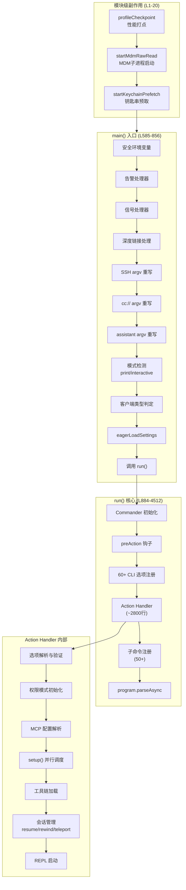
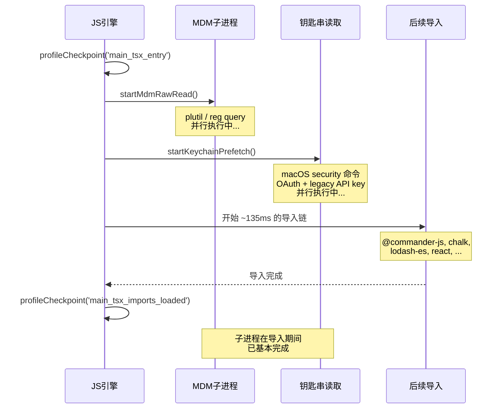
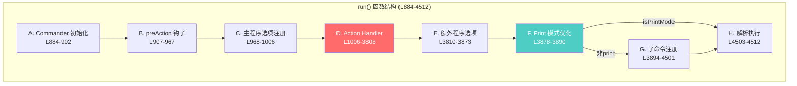
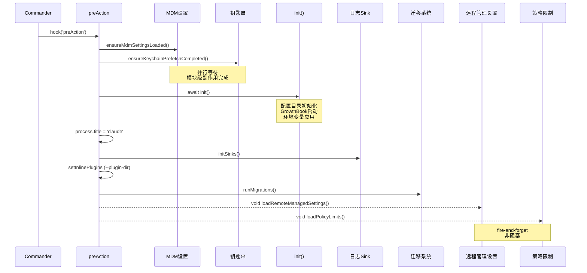
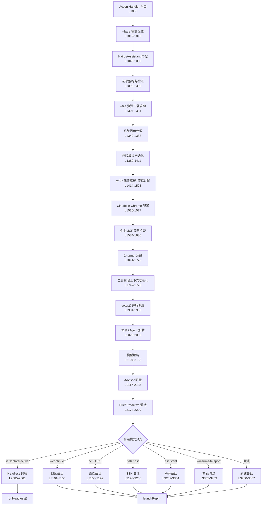

# 主CLI函数 (main.tsx) 子模块设计文档

## 1. 概述

### 1.1 子模块定位

`main.tsx` 是 Claude Code 的 CLI 主入口模块，共 4683 行，是整个项目最大、最复杂的单一模块。它承担以下核心职责：

- **进程级初始化**：安全环境变量设置、告警处理器注册、信号处理
- **模块级副作用**：性能打点、MDM 子进程预启动、macOS 钥匙串预取
- **Commander.js 命令体系构建**：60+ CLI 选项、50+ 子命令注册
- **主 Action Handler**：约 2800 行的巨型处理函数，涵盖选项解析、权限初始化、MCP 配置、工具加载、会话恢复、REPL 启动
- **数据迁移系统**：11 个版本化迁移函数的顺序执行
- **性能优化**：print 模式跳过子命令注册、并行预取、fire-and-forget 策略

### 1.2 文件位置与规模

| 属性 | 值 |
|------|-----|
| 文件路径 | `src/main.tsx` |
| 总行数 | 4683 |
| 导出函数 | 3 个（`main`, `run`, `startDeferredPrefetches`） |
| 内部函数 | 12+ 个 |
| 类型定义 | 4 个 |
| CLI 选项 | 60+ 个 |
| 子命令 | 50+ 个（含嵌套） |
| 特性开关 | 20+ 个 |

### 1.3 与上层模块关系

本模块被 `cli.tsx`（CLI 入口壳）直接调用，是从进程启动到 REPL 渲染的完整初始化链条的核心。下游调用 `setup.js`、`replLauncher.js`、`print.js` 等关键模块完成实际工作。

## 2. 架构设计

### 2.1 整体架构图



### 2.2 模块内部层次

本模块可分为五个逻辑层次：

| 层次 | 行范围 | 职责 | 代表元素 |
|------|--------|------|----------|
| L0: 模块级副作用 | 1-20 | 进程最早期初始化 | `profileCheckpoint`, `startMdmRawRead`, `startKeychainPrefetch` |
| L1: 辅助函数与类型 | 216-583 | 可复用工具函数、类型定义 | `runMigrations`, `loadSettingsFromFlag`, `PendingSSH` |
| L2: main() 入口 | 585-856 | 进程级初始化、argv 重写 | 安全环境、深度链接、SSH/cc:// 处理 |
| L3: run() 框架 | 884-4512 | Commander 构建、子命令注册 | preAction 钩子、选项声明、子命令树 |
| L4: Action Handler | 1006-3808 | 核心业务逻辑 | 权限、MCP、工具加载、会话恢复、REPL |

## 3. 模块级副作用详细设计

### 3.1 设计意图

模块级副作用的设计目的是利用 ES 模块求值期间的 ~135ms 导入时间窗口，将耗时的子进程操作并行化。

### 3.2 执行时序



### 3.3 副作用清单

| 行号 | 副作用 | 耗时 | 依赖方 |
|------|--------|------|--------|
| 12 | `profileCheckpoint('main_tsx_entry')` | <1ms | `profileReport()` |
| 16 | `startMdmRawRead()` | ~20ms | `ensureMdmSettingsLoaded()` in preAction |
| 20 | `startKeychainPrefetch()` | ~65ms | `ensureKeychainPrefetchCompleted()` in preAction |
| 266-271 | `isBeingDebugged()` 检测并退出 | <5ms | 安全防护 |

**设计评价**：模块级副作用是一种非常规的性能优化手段（`src/main.tsx:1-20`）。通过 `eslint-disable custom-rules/no-top-level-side-effects` 注释显式标记，表明团队意识到这种做法的风险。这是一个合理的权衡——在 CLI 启动的关键路径上节省 ~65ms 的真实性能收益。

## 4. main() 入口函数设计

### 4.1 职责分解

`main()` 函数（`src/main.tsx:585-856`）是导出的主入口，执行以下步骤：

1. **安全环境**（L591）：设置 `NoDefaultCurrentDirectoryInExePath` 防止 Windows PATH 劫持
2. **告警处理器**（L594）：`initializeWarningHandler()` 捕获 Node.js 告警
3. **信号处理器**（L595-606）：注册 `exit`（光标重置）和 `SIGINT`（优雅退出）
4. **argv 重写**（L612-795）：三种 URL/子命令的 argv 预处理
5. **模式检测**（L798-808）：检测 `-p`/`--print`/`--init-only`/`--sdk-url` 确定交互模式
6. **客户端类型判定**（L818-834）：识别 CLI/SDK/GitHub Action/远程等客户端
7. **早期设置加载**（L852）：`eagerLoadSettings()` 在 `init()` 前加载 `--settings`
8. **调用 run()**（L854）

### 4.2 argv 重写机制

三种特殊入口的 argv 重写是 `main()` 的核心复杂性来源：

| 特性开关 | 匹配模式 | 重写策略 | 目标 |
|----------|----------|----------|------|
| `DIRECT_CONNECT` | `cc://` / `cc+unix://` URL | 交互模式：剥离 URL 存入 `_pendingConnect`；Headless：重写为 `open` 子命令 | 让主命令处理，获得完整 TUI |
| `KAIROS` | `claude assistant [id]` | 剥离 `assistant` 和 `sessionId` 存入 `_pendingAssistantChat` | 交互式助手会话 |
| `SSH_REMOTE` | `claude ssh <host> [dir]` | 提取 SSH 参数存入 `_pendingSSH`，转发 `--continue`/`--resume`/`--model` | SSH 远程会话 |

**设计评价**：argv 重写机制（`src/main.tsx:612-795`）是一种务实但脆弱的设计。它将子命令语义压入主命令的 Action Handler 中，导致主 Handler 必须处理多种完全不同的会话模式。更理想的方案是让每种模式成为独立子命令，但这需要重构 Commander.js 的继承模型。

## 5. run() 函数结构设计

### 5.1 结构总览

`run()` 函数（`src/main.tsx:884-4512`）是一个约 3600 行的巨型函数，内部结构如下：



### 5.2 preAction 钩子设计

preAction 钩子（`src/main.tsx:907-967`）在所有命令执行前运行，确保基础设施就绪：



### 5.3 CLI 选项注册

主程序在 L968-1006 区间通过链式调用注册 60+ 个 CLI 选项，可分为以下类别：

| 类别 | 选项示例 | 数量 |
|------|----------|------|
| 调试/输出 | `--debug`, `--verbose`, `--output-format`, `--json-schema` | 8 |
| 运行模式 | `--print`, `--bare`, `--init`, `--init-only`, `--maintenance` | 5 |
| 权限/安全 | `--dangerously-skip-permissions`, `--permission-mode`, `--allowed-tools` | 6 |
| 会话管理 | `--continue`, `--resume`, `--session-id`, `--fork-session`, `--name` | 7 |
| 模型/AI | `--model`, `--effort`, `--thinking`, `--fallback-model`, `--betas` | 6 |
| MCP/插件 | `--mcp-config`, `--strict-mcp-config`, `--plugin-dir`, `--agents` | 5 |
| 系统提示 | `--system-prompt`, `--system-prompt-file`, `--append-system-prompt` | 4 |
| 远程/SSH | `--teleport`, `--remote`, `--remote-control`, `--sdk-url` | 5 |
| 其他 | `--chrome`, `--add-dir`, `--ide`, `--file`, `--settings` | 10+ |

在 L3810-3873 区间，根据特性开关和构建类型条件注册额外选项（`--worktree`, `--proactive`, `--brief`, `--assistant`, `--channels`, teammate 选项等）。

## 6. Action Handler 详细设计

### 6.1 执行流程

Action Handler（`src/main.tsx:1006-3808`）是整个模块的核心，约 2800 行。其执行流程可分为 12 个阶段：



### 6.2 关键阶段详解

#### 6.2.1 Kairos/Assistant 门控 (L1048-1089)

Assistant 模式的激活遵循严格的多层门控：

1. **特性开关**：`feature('KAIROS')` 编译期检查
2. **设置检查**：`assistantModule?.isAssistantMode()` 读取 `.claude/settings.json`
3. **信任门控**：`checkHasTrustDialogAccepted()` 防止未信任目录激活
4. **GrowthBook 门控**：`kairosGate.isKairosEnabled()` 远程特性开关
5. **teammate 排除**：`--agent-id` 存在时跳过（避免 teammate 重复初始化）

**设计评价**：多层门控设计（`src/main.tsx:1048-1089`）体现了防御性编程思想。信任门控在此处尤为关键——`.claude/settings.json` 是攻击者可控的文件，必须在信任建立后才能使用其中的 `assistant: true` 配置。

#### 6.2.2 MCP 配置处理 (L1414-1630)

MCP 配置处理是 Action Handler 中第二复杂的子系统，包含：

1. **--mcp-config 解析**：支持 JSON 字符串和文件路径两种格式
2. **保留名检查**：阻止使用 Chrome MCP 和 Computer Use MCP 的保留名
3. **企业策略过滤**：`filterMcpServersByPolicy()` 应用 allowedMcpServers/deniedMcpServers
4. **SDK 类型透传**：`type:'sdk'` 条目豁免策略过滤，传递给 `print.ts`
5. **企业 MCP 互斥**：`doesEnterpriseMcpConfigExist()` 时禁止 `--strict-mcp-config` 和非 SDK 动态配置

#### 6.2.3 并行初始化设计 (L1904-1936)

setup() 与命令/Agent 加载的并行化是关键性能优化：

```typescript
// src/main.tsx:1927-1933
const setupPromise = setup(preSetupCwd, ...);
const commandsPromise = worktreeEnabled ? null : getCommands(preSetupCwd);
const agentDefsPromise = worktreeEnabled ? null : getAgentDefinitionsWithOverrides(preSetupCwd);
commandsPromise?.catch(() => {});  // 抑制瞬态 unhandledRejection
agentDefsPromise?.catch(() => {});
await setupPromise;
```

**设计评价**：并行化策略（`src/main.tsx:1915-1936`）在 `worktreeEnabled` 时降级为串行执行，因为 `setup()` 会调用 `process.chdir()`。这种条件并行化是正确的——工作树模式下 CWD 会变更，后续操作需要最终路径。`.catch(() => {})` 用于抑制并行 Promise 在 `await setupPromise` 期间可能触发的全局 unhandledRejection 事件。

#### 6.2.4 会话模式分支 (L2585-3808)

Action Handler 的后半部分由一个大型 if-else 链构成，处理 7 种互斥的会话模式：

| 模式 | 行范围 | 入口条件 | 启动方式 |
|------|--------|----------|----------|
| Headless (print) | 2585-2861 | `isNonInteractiveSession` | `runHeadless()` |
| Continue | 3101-3155 | `options.continue` | `launchRepl()` |
| Direct Connect | 3156-3192 | `_pendingConnect?.url` | `launchRepl()` |
| SSH Remote | 3193-3258 | `_pendingSSH?.host` | `launchRepl()` |
| Assistant | 3259-3354 | `_pendingAssistantChat` | `launchRepl()` |
| Resume/Teleport | 3355-3759 | `options.resume \|\| teleport \|\| remote` | `launchRepl()` / `launchResumeChooser()` |
| Fresh Session | 3760-3807 | 默认 | `launchRepl()` |

## 7. 子命令注册树

### 7.1 子命令树结构

```mermaid
graph TD
    ROOT["claude (主命令)"]

    ROOT --> MCP_CMD["mcp"]
    MCP_CMD --> MCP_SERVE["serve"]
    MCP_CMD --> MCP_ADD["add"]
    MCP_CMD --> MCP_REMOVE["remove"]
    MCP_CMD --> MCP_LIST["list"]
    MCP_CMD --> MCP_GET["get"]
    MCP_CMD --> MCP_ADD_JSON["add-json"]
    MCP_CMD --> MCP_ADD_DESKTOP["add-from-claude-desktop"]
    MCP_CMD --> MCP_RESET["reset-project-choices"]
    MCP_CMD --> MCP_XAA["xaa-idp (条件)"]

    ROOT --> AUTH_CMD["auth"]
    AUTH_CMD --> AUTH_LOGIN["login"]
    AUTH_CMD --> AUTH_STATUS["status"]
    AUTH_CMD --> AUTH_LOGOUT["logout"]

    ROOT --> PLUGIN_CMD["plugin / plugins"]
    PLUGIN_CMD --> PLG_VALIDATE["validate"]
    PLUGIN_CMD --> PLG_LIST["list"]
    PLUGIN_CMD --> PLG_INSTALL["install"]
    PLUGIN_CMD --> PLG_UNINSTALL["uninstall"]
    PLUGIN_CMD --> PLG_ENABLE["enable"]
    PLUGIN_CMD --> PLG_DISABLE["disable"]
    PLUGIN_CMD --> PLG_UPDATE["update"]
    PLUGIN_CMD --> MKT["marketplace"]
    MKT --> MKT_ADD["add"]
    MKT --> MKT_LIST["list"]
    MKT --> MKT_REMOVE["remove"]
    MKT --> MKT_UPDATE["update"]

    ROOT --> SERVER_CMD["server<br/>(DIRECT_CONNECT)"]
    ROOT --> SSH_CMD["ssh<br/>(SSH_REMOTE)"]
    ROOT --> OPEN_CMD["open<br/>(DIRECT_CONNECT)"]
    ROOT --> ASST_CMD["assistant<br/>(KAIROS)"]
    ROOT --> RC_CMD["remote-control<br/>(BRIDGE_MODE)"]

    ROOT --> AGENTS_CMD["agents"]
    ROOT --> AUTO_MODE["auto-mode<br/>(TRANSCRIPT_CLASSIFIER)"]
    AUTO_MODE --> AM_DEFAULTS["defaults"]
    AUTO_MODE --> AM_CONFIG["config"]
    AUTO_MODE --> AM_CRITIQUE["critique"]

    ROOT --> DOCTOR["doctor"]
    ROOT --> UPDATE["update / upgrade"]
    ROOT --> INSTALL["install"]
    ROOT --> SETUP_TOKEN["setup-token"]
    ROOT --> COMPLETION["completion (hidden)"]

    ROOT --> ANT["ant-only 命令"]
    ANT --> LOG["log"]
    ANT --> ERROR_CMD["error"]
    ANT --> EXPORT["export"]
    ANT --> TASK["task"]
    TASK --> TASK_CREATE["create"]
    TASK --> TASK_LIST["list"]
    TASK --> TASK_GET["get"]
    TASK --> TASK_UPDATE["update"]
    TASK --> TASK_DIR["dir"]
    ANT --> UP["up"]
    ANT --> ROLLBACK["rollback"]

    style ANT fill:#e8e8e8
    style SERVER_CMD fill:#ffffcc
    style SSH_CMD fill:#ffffcc
    style ASST_CMD fill:#ffffcc
    style RC_CMD fill:#ffffcc
```



### 7.2 Print 模式优化

Print 模式跳过子命令注册（`src/main.tsx:3878-3890`），节省约 65ms 启动时间：

```typescript
// src/main.tsx:3883-3890
const isPrintMode = process.argv.includes('-p') || process.argv.includes('--print');
const isCcUrl = process.argv.some(a => a.startsWith('cc://') || a.startsWith('cc+unix://'));
if (isPrintMode && !isCcUrl) {
    await program.parseAsync(process.argv);
    return program;
}
```

**设计评价**：这是一个高效的启动优化（`src/main.tsx:3875-3890`）。注释详细解释了 65ms 的来源——`isBridgeEnabled()` 中 25ms Zod 解析 + 40ms 同步 keychain 子进程。`cc://` URL 的排除检查确保了 `open` 子命令在 print 模式下仍可达。

## 8. 辅助函数设计

### 8.1 迁移系统

`runMigrations()`（`src/main.tsx:326-358`）实现了版本化的同步迁移机制：

```
CURRENT_MIGRATION_VERSION = 11
```

| 迁移函数 | 用途 |
|----------|------|
| `migrateAutoUpdatesToSettings` | 自动更新配置迁移到设置 |
| `migrateBypassPermissionsAcceptedToSettings` | 绕过权限配置迁移 |
| `migrateEnableAllProjectMcpServersToSettings` | MCP 服务器启用状态迁移 |
| `resetProToOpusDefault` | Pro 用户重置为 Opus 默认模型 |
| `migrateSonnet1mToSonnet45` | 模型名迁移 |
| `migrateLegacyOpusToCurrent` | 旧版 Opus 迁移 |
| `migrateSonnet45ToSonnet46` | Sonnet 4.5→4.6 迁移 |
| `migrateOpusToOpus1m` | Opus→Opus 1M 迁移 |
| `migrateReplBridgeEnabledToRemoteControlAtStartup` | Bridge 设置迁移 |
| `resetAutoModeOptInForDefaultOffer` | 自动模式 opt-in 重置（`TRANSCRIPT_CLASSIFIER`） |
| `migrateFennecToOpus` | Fennec→Opus 迁移（ant-only） |

**设计评价**：迁移系统使用全局配置中的 `migrationVersion` 作为幂等守护（`src/main.tsx:327`），所有迁移函数在版本不匹配时批量执行。`migrateChangelogFromConfig()` 作为异步迁移单独 fire-and-forget 处理。原子写入 `migrationVersion` 使用函数式更新（`src/main.tsx:343-346`）避免竞态条件。

### 8.2 延迟预取

`startDeferredPrefetches()`（`src/main.tsx:388-431`）在 REPL 首次渲染后启动后台预取：

| 预取项 | 用途 | 条件 |
|--------|------|------|
| `initUser()` | 用户身份 | 非 bare 模式 |
| `getUserContext()` | CLAUDE.md 上下文 | 非 bare 模式 |
| `prefetchSystemContextIfSafe()` | git 状态 | 信任已建立 |
| `getRelevantTips()` | 提示信息 | 非 bare 模式 |
| `prefetchAwsCredentialsAndBedRockInfoIfSafe()` | AWS 凭证 | Bedrock 模式 |
| `prefetchGcpCredentialsIfSafe()` | GCP 凭证 | Vertex 模式 |
| `countFilesRoundedRg()` | 文件计数 | 非 bare 模式 |
| `initializeAnalyticsGates()` | 分析门控 | 非 bare 模式 |
| `refreshModelCapabilities()` | 模型能力刷新 | 非 bare 模式 |
| `settingsChangeDetector.initialize()` | 设置变更监听 | 总是 |
| `skillChangeDetector.initialize()` | 技能变更监听 | 非 bare 模式 |

### 8.3 其他辅助函数

| 函数名 | 行号 | 职责 |
|--------|------|------|
| `logManagedSettings()` | 216-230 | 将策略管理的设置键记录到 Statsig |
| `isBeingDebugged()` | 232-271 | 检测 Node/Bun 调试器，支持 `--inspect`、`NODE_OPTIONS`、`inspector.url()` |
| `logSessionTelemetry()` | 279-289 | 记录技能和插件加载遥测 |
| `getCertEnvVarTelemetry()` | 291-305 | 收集 CA 证书环境变量状态 |
| `logStartupTelemetry()` | 307-323 | 记录 git、工作树、沙箱等启动遥测 |
| `prefetchSystemContextIfSafe()` | 360-386 | 信任门控的 git 上下文预取 |
| `loadSettingsFromFlag()` | 432-482 | 解析 `--settings` 标志（JSON 字符串或文件路径） |
| `loadSettingSourcesFromFlag()` | 484-500 | 解析 `--setting-sources` 标志 |
| `eagerLoadSettings()` | 502-515 | 在 `init()` 前早期加载设置 |
| `initializeEntrypoint()` | 517-541 | 设置 `CLAUDE_CODE_ENTRYPOINT` 环境变量 |
| `getInputPrompt()` | 857-882 | 从 stdin 管道读取输入，3s 超时 |
| `resetCursor()` | 4653-4655 | 进程退出时重置终端光标 |
| `extractTeammateOptions()` | 4667-4683 | 从 CLI 选项提取 teammate 配置 |

## 9. 类型定义

### 9.1 Pending 状态类型

模块定义了三种"待处理"状态类型，用于 argv 重写机制：

```typescript
// src/main.tsx:543-547
type PendingConnect = {
    url: string | undefined;
    authToken: string | undefined;
    dangerouslySkipPermissions: boolean;
};

// src/main.tsx:555-558
type PendingAssistantChat = {
    sessionId?: string;
    discover: boolean;
};

// src/main.tsx:567-576
type PendingSSH = {
    host: string | undefined;
    cwd: string | undefined;
    permissionMode: string | undefined;
    dangerouslySkipPermissions: boolean;
    local: boolean;
    extraCliArgs: string[];
};
```

### 9.2 TeammateOptions 类型

```typescript
// src/main.tsx:4657-4665
type TeammateOptions = {
    agentId?: string;
    agentName?: string;
    teamName?: string;
    agentColor?: AgentColorName;
    planModeRequired?: boolean;
    parentSessionId?: string;
    teammateMode?: string;
    agentType?: string;
};
```

## 10. 设计评价与改进建议

### 10.1 复杂度评价

| 维度 | 评分 | 说明 |
|------|------|------|
| 圈复杂度 | 高 | Action Handler 包含 7 个主要分支路径 + 20+ 特性开关条件 |
| 行数 | 极高 | 4683 行，超过常规模块上限约 10 倍 |
| 耦合度 | 高 | 直接依赖 100+ 个外部模块 |
| 可维护性 | 中 | 性能注释详尽，但逻辑密度极高 |
| 可测试性 | 低 | `run()` 函数的 3600+ 行几乎不可单元测试 |

### 10.2 设计亮点

1. **性能优化策略成体系**（`src/main.tsx:1-20, 3878-3890`）：模块级并行预取、print 模式跳过子命令注册、fire-and-forget 模式、内容哈希临时文件（L450-456 防止 API 缓存失效）形成了完整的性能优化体系。

2. **防御性安全设计**（`src/main.tsx:591, 1067-1069`）：Windows PATH 劫持防护、调试器检测退出、信任门控前禁止 git 命令执行、企业 MCP 策略强制执行，多层安全防护。

3. **详尽的性能注释**：几乎每个 `void` 调用和 `fire-and-forget` 模式都有注释解释为什么不 `await`，以及耗时估算来源。

4. **条件导入与死代码消除**（`src/main.tsx:74-81`）：通过 `feature()` 函数配合 `require()` 实现编译期死代码消除，减小 external 构建体积。

### 10.3 改进建议

1. **Action Handler 拆分**：2800 行的 Action Handler 应拆分为独立函数。建议按会话模式分离：`handleHeadlessMode()`, `handleContinueSession()`, `handleDirectConnect()`, `handleSSHSession()`, `handleAssistantMode()`, `handleResumeSession()`, `handleFreshSession()`。当前所有模式共享同一个函数作用域中的 ~50 个局部变量，增加了理解难度。

2. **选项解析集中化**：60+ 个 CLI 选项的解构和验证分散在 Action Handler 的前 700 行中（L1006-1700），建议提取为 `parseAndValidateOptions()` 函数，返回强类型的配置对象。

3. **MCP 配置处理模块化**：MCP 配置解析、策略过滤、企业配置检查（L1414-1630）应提取为独立模块 `mcpConfigSetup.ts`，当前代码混合了解析、验证、策略执行三种关注点。

4. **迁移系统版本化改进**：当前所有 11 个迁移函数在版本不匹配时全部执行（`src/main.tsx:326-347`）。建议改为按版本号增量执行，避免已完成的迁移重复运行。虽然每个迁移函数内部是幂等的，但批量执行增加了不必要的 I/O。

5. **argv 重写去除**：`_pendingConnect`、`_pendingAssistantChat`、`_pendingSSH` 三个模块级可变状态（L548-584）通过 argv 重写传递信息，是隐式的全局状态通信。建议改为显式参数传递或使用配置对象模式。

### 10.4 特性开关影响分析

模块中使用了 20+ 个特性开关，其对代码路径的影响：

| 特性开关 | 影响范围 | 代码行数 |
|----------|----------|----------|
| `KAIROS` | Assistant 模式、Brief 工具、Channel | ~400 行 |
| `DIRECT_CONNECT` | cc:// URL 处理、server/open 子命令 | ~200 行 |
| `SSH_REMOTE` | SSH 远程会话 | ~120 行 |
| `TRANSCRIPT_CLASSIFIER` | 自动模式、权限分类器 | ~80 行 |
| `COORDINATOR_MODE` | 协调器模式工具过滤 | ~30 行 |
| `BRIDGE_MODE` | Remote Control 子命令 | ~50 行 |
| `CHICAGO_MCP` | Computer Use MCP | ~30 行 |
| `PROACTIVE` | 主动模式提示 | ~20 行 |
| `UDS_INBOX` | Unix 域套接字消息 | ~20 行 |
| `KAIROS_BRIEF` | Brief 工具独立门控 | ~30 行 |
| `KAIROS_CHANNELS` | Channel 注册 | ~80 行 |
| `LODESTONE` | 深度链接处理 | ~40 行 |
| `BG_SESSIONS` | 后台会话 | ~5 行 |
| `CCR_MIRROR` | CCR 镜像模式 | ~10 行 |
| `HARD_FAIL` | 错误硬失败 | ~5 行 |
| `AGENT_MEMORY_SNAPSHOT` | Agent 记忆快照 | ~20 行 |
| `WEB_BROWSER_TOOL` | Web 浏览器工具 | ~5 行 |
| `UPLOAD_USER_SETTINGS` | 设置同步上传 | ~5 行 |
| `TOKEN_BUDGET` | Token 预算控制 | ~5 行 |

去除所有特性开关后，核心代码约为 3700 行，仍然是一个超大模块。特性开关增加了约 1000 行条件代码，其中 `KAIROS` 家族（`KAIROS` + `KAIROS_BRIEF` + `KAIROS_CHANNELS`）影响最大。

### 10.5 依赖关系总结

本模块直接导入 100+ 个外部模块，是整个代码库中依赖最广的单一文件。主要依赖类别：

- **框架层**：`@commander-js/extra-typings`, `react`, `chalk`, `lodash-es`
- **内部服务**：`services/mcp/*`, `services/analytics/*`, `services/policyLimits/*`
- **工具函数**：`utils/auth`, `utils/config`, `utils/settings/*`, `utils/permissions/*`
- **状态管理**：`bootstrap/state`, `state/AppStateStore`, `state/store`
- **迁移脚本**：`migrations/*`（11 个）
- **条件导入**：`coordinator/*`, `assistant/*`, `ssh/*`, `server/*`, `bridge/*`

**设计评价**：依赖宽度反映了 `main.tsx` 承担了过多的"胶水"职责。理想情况下，选项解析、MCP 配置、会话管理等逻辑应封装在各自的模块中，`main.tsx` 仅负责组装调用。当前架构是有机增长的结果——随着 SSH、Direct Connect、Assistant、Channel 等特性的逐步添加，Action Handler 不断膨胀。
