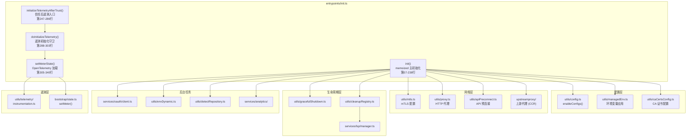
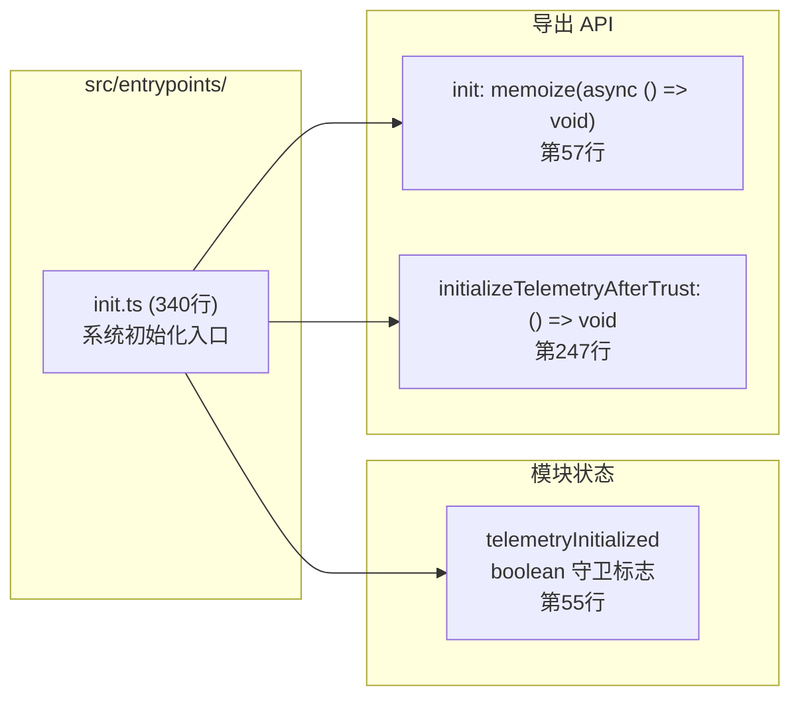
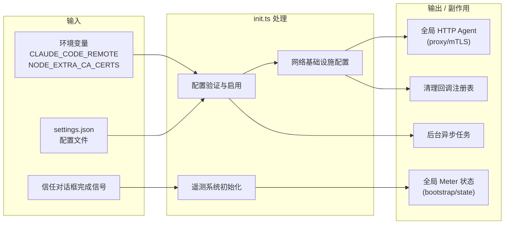
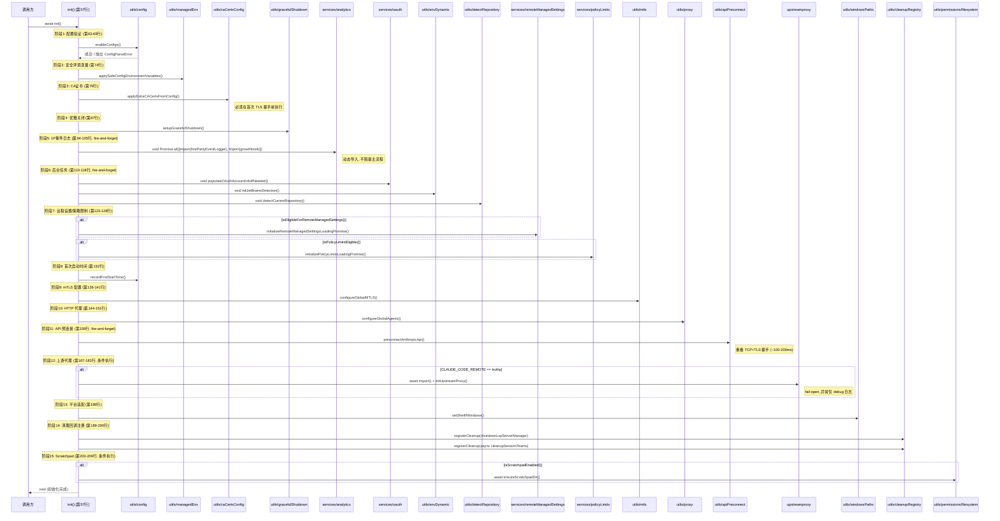
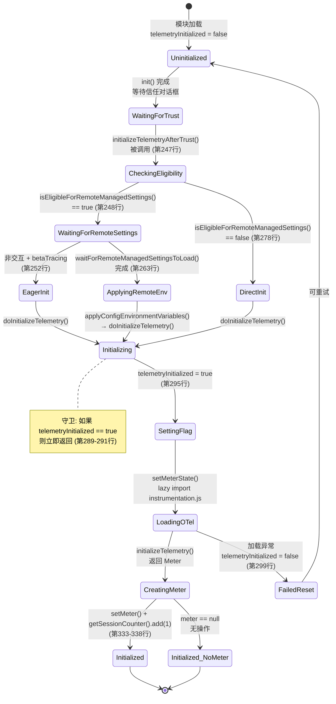
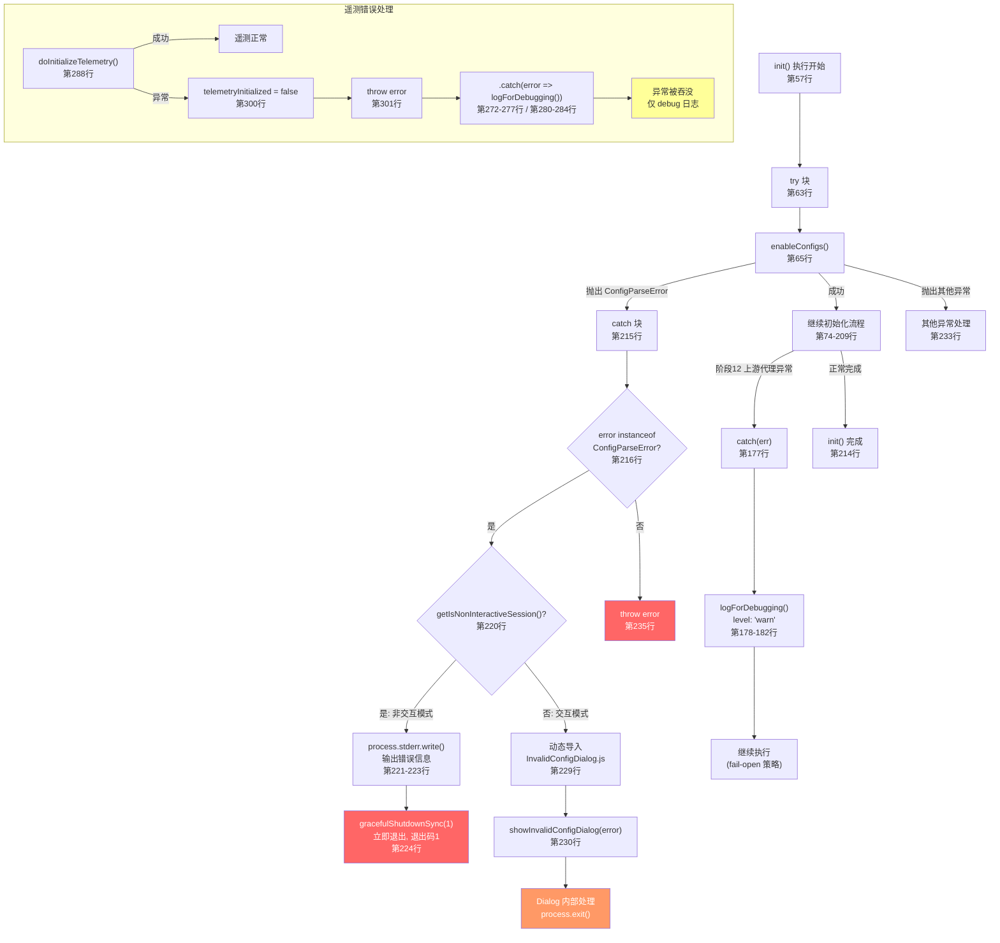

# 系统初始化 (entrypoints/init.ts) 子模块详细设计文档

## 文档信息
| 项目 | 内容 |
|------|------|
| 模块名称 | 系统初始化 (entrypoints/init.ts) |
| 文档版本 | v1.0-20260401 |
| 生成日期 | 2026-04-01 |
| 生成方式 | 代码反向工程 |

## 1. 模块概述

### 1.1 模块职责

本子模块是 Claude Code 应用的系统级初始化入口，负责在应用启动阶段完成所有基础设施的配置与准备工作。具体包括五大核心职责：

1. **配置系统初始化**：验证并启用配置系统（`enableConfigs()`），应用安全环境变量（`applySafeConfigEnvironmentVariables()`），确保配置解析错误能被正确处理（交互/非交互两种模式）。
2. **网络基础设施配置**：配置 CA 证书（`applyExtraCACertsFromConfig()`）、mTLS 双向认证（`configureGlobalMTLS()`）、HTTP 代理（`configureGlobalAgents()`）、API 预连接（`preconnectAnthropicApi()`），以及 CCR 上游代理（`initUpstreamProxy()`）。
3. **遥测系统初始化**：在信任对话框完成后，根据远程托管设置的资格条件，延迟加载 OpenTelemetry（约400KB），创建 `AttributedCounter` 工厂并注入全局状态。
4. **生命周期管理**：设置优雅关闭机制（`setupGracefulShutdown()`），注册清理回调（LSP 服务器管理器关闭、会话 Teams 清理）。
5. **后台任务启动**：以 fire-and-forget 方式启动 OAuth 账户信息填充、JetBrains IDE 检测、仓库检测、1P 事件日志等异步任务。

整个 `init()` 函数通过 `lodash-es/memoize` 包装，保证全局仅执行一次（第57行）。

### 1.2 模块边界

**输入**：
- 环境变量：`CLAUDE_CODE_REMOTE`（判断是否启用上游代理）、`NODE_EXTRA_CA_CERTS`（TLS 证书配置）
- 配置文件：`settings.json`（通过 `enableConfigs()` 加载）
- 运行时状态：`getIsNonInteractiveSession()`（非交互模式判断）
- Feature flag：`isEligibleForRemoteManagedSettings()`、`isPolicyLimitsEligible()`、`isScratchpadEnabled()`
- 信任状态：遥测初始化依赖信任对话框完成

**输出**：
- `init` 函数：`memoize(async (): Promise<void>)` -- 主初始化函数，幂等执行
- `initializeTelemetryAfterTrust` 函数：`() => void` -- 信任后遥测初始化触发器
- 副作用：全局网络代理、mTLS 配置、清理回调注册、遥测 Meter 状态注入

**与外部模块的交互**：

| 交互模块 | 交互方式 | 说明 |
|----------|----------|------|
| `bootstrap/state.ts` | 导入 `getIsNonInteractiveSession`、`setMeter`、`getSessionCounter` | 全局状态读写 |
| `utils/config.ts` | 调用 `enableConfigs()`、`recordFirstStartTime()` | 配置系统启用 |
| `utils/managedEnv.ts` | 调用 `applySafeConfigEnvironmentVariables()`、`applyConfigEnvironmentVariables()` | 环境变量管理 |
| `utils/mtls.ts` | 调用 `configureGlobalMTLS()` | mTLS 全局配置 |
| `utils/proxy.ts` | 调用 `configureGlobalAgents()` | HTTP 代理配置 |
| `utils/apiPreconnect.ts` | 调用 `preconnectAnthropicApi()` | API TCP+TLS 预热 |
| `utils/gracefulShutdown.ts` | 调用 `setupGracefulShutdown()`、`gracefulShutdownSync()` | 进程退出管理 |
| `utils/cleanupRegistry.ts` | 调用 `registerCleanup()` | 清理回调注册 |
| `services/lsp/manager.ts` | 传入 `shutdownLspServerManager` 作为清理回调 | LSP 服务器生命周期 |
| `services/oauth/client.ts` | 调用 `populateOAuthAccountInfoIfNeeded()` | OAuth 信息预填充 |
| `services/policyLimits/` | 调用 `isPolicyLimitsEligible()`、`initializePolicyLimitsLoadingPromise()` | 策略限制加载 |
| `services/remoteManagedSettings/` | 调用 `isEligibleForRemoteManagedSettings()` 等 | 远程设置管理 |
| `services/analytics/` | 动态导入 `firstPartyEventLogger.js`、`growthbook.js` | 1P 事件日志 |
| `utils/telemetry/instrumentation.ts` | 动态导入，延迟加载 ~400KB OpenTelemetry | 遥测 SDK 初始化 |
| `components/InvalidConfigDialog.tsx` | 动态导入（错误路径） | 配置错误 UI 展示 |
| `upstreamproxy/upstreamproxy.ts` | 条件动态导入（CCR 环境） | 上游代理初始化 |

## 2. 架构设计

### 2.1 模块架构图



### 2.2 源文件组织



### 2.3 外部依赖

| 依赖 | 来源 | 用途 |
|------|------|------|
| `lodash-es/memoize` | npm | 确保 `init()` 全局仅执行一次 |
| `@opentelemetry/api` | npm | `Attributes`、`MetricOptions` 类型定义（仅类型导入） |
| `signal-exit` | npm（间接通过 `gracefulShutdown.ts`） | 进程退出信号监听 |

## 3. 数据结构设计

### 3.1 核心数据结构

#### 3.1.1 模块级状态

| 变量名 | 类型 | 初始值 | 行号 | 说明 |
|--------|------|--------|------|------|
| `telemetryInitialized` | `boolean` | `false` | 第55行 | 遥测初始化守卫标志，防止重复初始化 |
| `init` (闭包) | `memoize(async () => Promise<void>)` | -- | 第57行 | 被 memoize 包装的初始化函数，首次调用后缓存结果 |

#### 3.1.2 `AttributedCounter` 类型（来自 `bootstrap/state.ts`）

由 `setMeterState()` 内部创建的工厂函数生成，注入全局状态供全应用使用：

| 方法名 | 签名 | 说明 |
|--------|------|------|
| `add` | `(value: number, additionalAttributes?: Attributes) => void` | 将计数值附加当前遥测属性后提交到 OpenTelemetry Counter |

工厂函数 `createAttributedCounter`（第314-331行）的关键行为：
- 每次 `add()` 调用时通过 `getTelemetryAttributes()` 获取最新属性（第324行）
- 将调用者传入的 `additionalAttributes` 与全局属性合并（第325-328行）
- 使用可选链 `counter?.add()` 防御 meter 为 null 的情况（第329行）

#### 3.1.3 `ConfigParseError` 类型（来自 `utils/errors.ts`）

`init()` 错误处理路径中捕获的特定错误类型：

| 属性名 | 类型 | 说明 |
|--------|------|------|
| `filePath` | `string` | 解析失败的配置文件路径 |
| `message` | `string` | 错误描述信息 |

### 3.2 数据流图



## 4. 接口设计

### 4.1 导出接口

#### 4.1.1 `init` 函数

```typescript
export const init: () => Promise<void>  // memoize 包装
```

**调用约束**：
- 通过 `lodash-es/memoize` 包装，首次调用执行完整初始化流程，后续调用直接返回缓存的 Promise（第57行）
- 调用方无需关心是否已初始化，可安全多次调用
- 抛出异常：非 `ConfigParseError` 类型的错误会被重新抛出（第234-236行）

**前置条件**：
- `bootstrap/state.ts` 模块已被导入（第2行的副作用导入 `import '../bootstrap/state.js'`）

#### 4.1.2 `initializeTelemetryAfterTrust` 函数

```typescript
export function initializeTelemetryAfterTrust(): void
```

**调用约束**：
- 应在信任对话框完成后调用一次（第246行注释）
- 函数本身是同步的，但内部启动异步操作（fire-and-forget 模式）
- 通过 `telemetryInitialized` 标志和 `doInitializeTelemetry()` 内部守卫防止重复初始化

**行为分支**（第248-285行）：
| 条件 | 行为 |
|------|------|
| `isEligibleForRemoteManagedSettings() == true` 且 非交互+beta tracing | 先急切初始化一次（第253行），再走异步远程设置路径 |
| `isEligibleForRemoteManagedSettings() == true` 且 其他情况 | 等待远程设置加载完毕 → `applyConfigEnvironmentVariables()` → `doInitializeTelemetry()`（第263-271行） |
| `isEligibleForRemoteManagedSettings() == false` | 直接调用 `doInitializeTelemetry()`（第279-284行） |

### 4.2 内部接口

#### 4.2.1 `doInitializeTelemetry` 函数

```typescript
async function doInitializeTelemetry(): Promise<void>
```

**守卫逻辑**（第288-303行）：
- 检查 `telemetryInitialized` 标志，已初始化则直接返回（第289-291行）
- 初始化前先设置标志为 `true`（第295行），失败时重置为 `false`（第299-300行）
- 这种"先设后回滚"模式确保并发调用不会导致双重初始化

#### 4.2.2 `setMeterState` 函数

```typescript
async function setMeterState(): Promise<void>
```

**职责**（第305-340行）：
1. 延迟加载 `utils/telemetry/instrumentation.ts`（约400KB OpenTelemetry + protobuf）（第307-309行）
2. 调用 `initializeTelemetry()` 获取 `Meter` 实例（第311行）
3. 如果 meter 可用：创建 `AttributedCounter` 工厂函数，调用 `setMeter()` 注入全局状态（第333行）
4. 立即递增 session counter（第338行），因为启动遥测路径在此异步初始化完成前已运行

## 5. 流程设计

### 5.1 init() 主初始化流程 -- 分阶段序列图



### 5.2 遥测初始化状态图



### 5.3 错误处理流程图



## 6. 设计模式分析

### 6.1 使用的设计模式

#### 6.1.1 Memoize 模式（幂等保证）

`init()` 函数通过 `lodash-es/memoize` 包装（第57行），确保无论被调用多少次，实际初始化逻辑仅执行一次。这是启动流程中防止重复初始化的关键机制。memoize 会缓存首次调用的 Promise，后续调用直接返回同一个 Promise 实例。

#### 6.1.2 守卫标志模式（Double-Init Prevention）

`doInitializeTelemetry()` 使用 `telemetryInitialized` 布尔标志（第55行、第289-301行）作为初始化守卫。与 memoize 不同，此处采用"先设后回滚"策略：初始化前先将标志设为 `true`（第295行），如果初始化失败则重置为 `false`（第299-300行）。这允许失败后重试，同时防止并发的双重初始化。

#### 6.1.3 延迟加载模式（Lazy Import）

模块中大量使用动态 `import()` 来延迟加载重量级依赖：
- `utils/telemetry/instrumentation.ts`（~400KB OpenTelemetry + protobuf）仅在遥测初始化时加载（第307-309行）
- `services/analytics/firstPartyEventLogger.ts` 和 `growthbook.ts` 异步加载以避免启动时加载 OpenTelemetry sdk-logs（第94-96行）
- `components/InvalidConfigDialog.tsx` 仅在配置错误时加载，避免初始化阶段加载 React（第229行，注释见第30行）
- `upstreamproxy/upstreamproxy.ts` 仅在 CCR 环境下加载（第169-171行）
- `utils/swarm/teamHelpers.ts` 仅在清理时加载，因为 swarm 代码在 feature gate 后面（第196-198行）

#### 6.1.4 Fire-and-Forget 模式

多个异步操作使用 `void` 前缀启动后不等待结果，避免阻塞主初始化流程：
- 1P 事件日志初始化（第94行 `void Promise.all([...])`）
- OAuth 账户信息填充（第110行 `void populateOAuthAccountInfoIfNeeded()`）
- JetBrains 检测（第114行 `void initJetBrainsDetection()`）
- 仓库检测（第118行 `void detectCurrentRepository()`）
- API 预连接（第159行 `preconnectAnthropicApi()` 本身为 fire-and-forget）

#### 6.1.5 Fail-Open 模式

上游代理初始化（第167-183行）采用 fail-open 策略：如果初始化失败，仅记录 warn 级别日志，继续正常执行。这确保非关键的网络增强功能不会阻断整个应用启动。

### 6.2 初始化阶段的顺序约束

各阶段之间存在严格的顺序依赖：

| 约束 | 原因 | 证据 |
|------|------|------|
| CA 证书 必须在 mTLS/Proxy 之前 | Bun 在启动时缓存 TLS 证书存储 | 第76-78行注释 |
| mTLS 必须在 HTTP 代理之前 | 代理需要使用 mTLS 配置的证书 | 第143行注释 |
| HTTP 代理 必须在 API 预连接之前 | 预连接需使用正确的传输层 | 第154-156行注释 |
| `enableConfigs()` 必须在其他所有操作之前 | 后续操作依赖配置系统 | 第63行位于 try 块起始 |
| `applySafeConfigEnvironmentVariables()` 在信任前，`applyConfigEnvironmentVariables()` 在信任后 | 安全分层，部分环境变量需信任后才应用 | 第71-72行注释、第269行 |

## 7. 性能设计

### 7.1 启动性能优化

本模块通过以下机制优化启动性能：

1. **性能检查点追踪**：整个 `init()` 函数通过 `profileCheckpoint()` 在每个关键阶段记录时间戳（如第59行 `init_function_start`、第69行 `init_configs_enabled`、第151行 `init_network_configured` 等），支持启动性能分析。

2. **分阶段耗时测量**：配置启用（第64行 `configsStart`）、环境变量应用（第73行 `envVarsStart`）、mTLS（第135行 `mtlsStart`）、代理（第144行 `proxyStart`）、scratchpad（第204行 `scratchpadStart`）均通过 `Date.now()` 差值记录到诊断日志。

3. **非阻塞并行**：OAuth、JetBrains 检测、仓库检测、1P 事件日志均以 fire-and-forget 方式异步启动（第94-118行），不占用关键路径时间。

4. **API 预连接**：`preconnectAnthropicApi()`（第159行）利用初始化后期的约100ms 处理时间与 TCP+TLS 握手（~100-200ms）重叠执行（第153-155行注释）。

5. **遥测延迟加载**：OpenTelemetry SDK（~400KB）不在 `init()` 中加载，而是延迟到信任对话框后的 `setMeterState()` 中通过动态 `import()` 加载（第306-309行）。gRPC 导出器（~700KB via `@grpc/grpc-js`）进一步在 `instrumentation.ts` 内部延迟加载（第45-46行注释）。

### 7.2 内存优化

- 1P 事件日志的 `growthbook.js` 在 `init()` 调用时已在模块缓存中（由 `firstPartyEventLogger` 导入），因此第二次 `import()` 不产生额外加载成本（第92-93行注释）。
- `InvalidConfigDialog` 仅在错误路径加载 React，正常路径零 React 开销（第30行注释）。

## 8. 可靠性设计

### 8.1 错误处理策略

模块采用分层错误处理策略：

| 错误类别 | 处理策略 | 行号 | 说明 |
|----------|----------|------|------|
| `ConfigParseError`（非交互） | stderr 输出 + 同步退出 | 第220-225行 | 避免在 JSON 消费方（如桌面市场插件管理器）中渲染 Ink 对话框（第218-219行注释） |
| `ConfigParseError`（交互） | 动态加载并显示 `InvalidConfigDialog` | 第229-231行 | Dialog 内部处理 `process.exit()`，无需额外清理（第232行注释） |
| 非配置错误 | 重新抛出 | 第234-236行 | 由上层调用方处理 |
| 上游代理初始化失败 | Fail-open + warn 日志 | 第177-182行 | 不阻断应用启动 |
| 遥测初始化失败 | 守卫标志重置 + 错误吞没 | 第299-300行、第272-277行 | 允许重试，不影响核心功能 |

### 8.2 幂等性保证

- `init()` 通过 `memoize` 确保幂等（第57行）
- `doInitializeTelemetry()` 通过 `telemetryInitialized` 标志确保幂等（第289-291行）
- 远程设置和策略限制的 Promise 初始化包含内置超时，防止死锁（第122行注释）

### 8.3 资源清理机制

通过 `registerCleanup()` 注册的清理回调在进程优雅关闭时按序执行：

| 清理项 | 注册位置 | 说明 |
|--------|----------|------|
| `shutdownLspServerManager` | 第189行 | 关闭 LSP 服务器管理器 |
| `cleanupSessionTeams` | 第195-200行 | 清理子 Agent 创建的临时 Teams（gh-32730 修复）|

清理回调通过 `cleanupRegistry.ts` 的 `Set<() => Promise<void>>` 管理，`runCleanupFunctions()` 以 `Promise.all()` 并行执行所有回调。

## 9. 可测试性设计

### 9.1 测试约束分析

由于本模块是从打包产物还原，不包含原始测试代码。以下是基于代码结构的可测试性评估：

| 特性 | 可测试性 | 说明 |
|------|----------|------|
| `init()` memoize 行为 | 中等 | 需要重置 memoize 缓存才能重复测试 |
| 配置错误分支 | 高 | 可通过 mock `enableConfigs()` 抛出 `ConfigParseError` 验证 |
| 遥测初始化守卫 | 高 | `telemetryInitialized` 标志的先设后回滚逻辑可单元测试 |
| 网络配置阶段 | 中等 | 全局副作用多，需要 mock 底层网络模块 |
| 条件分支（CCR/远程设置） | 高 | 可通过环境变量和 mock 控制分支执行路径 |
| fire-and-forget 任务 | 低 | `void` 表达式无法直接断言，需监控副作用 |

### 9.2 Mock 边界

推荐的 Mock 点：
- `enableConfigs()`：控制配置验证成功/失败
- `getIsNonInteractiveSession()`：控制交互模式分支
- `isEligibleForRemoteManagedSettings()` / `isPolicyLimitsEligible()`：控制远程设置路径
- `isEnvTruthy(process.env.CLAUDE_CODE_REMOTE)`：控制上游代理路径
- `isScratchpadEnabled()`：控制 scratchpad 路径
- 动态 `import()` 调用：Mock 延迟加载的模块

## 10. 设计质量评估

### 10.1 优点

1. **严格的初始化顺序保证**：CA 证书 → mTLS → 代理 → 预连接的顺序（第79行、第137行、第146行、第159行）确保网络配置在首次 TLS 握手前完成，避免了 Bun 运行时 TLS 缓存导致的证书配置遗漏。

2. **memoize 幂等保护**（第57行）：使用 `lodash-es/memoize` 而非手动标志，代码简洁且语义清晰，并且自动缓存 Promise 实例避免了多次 `await` 导致的重复执行。

3. **遥测延迟加载策略**（第306-309行、第44-46行注释）：OpenTelemetry（~400KB）+ gRPC（~700KB）总计超过 1MB 的模块不在启动关键路径加载，通过动态 `import()` 延迟到信任确认后，显著优化了冷启动时间。

4. **分层错误处理**（第215-237行）：`ConfigParseError` 根据交互/非交互模式采用不同处理策略，非交互模式避免渲染 Ink UI（第218-219行注释），适配 JSON 管道场景。

5. **fail-open 网络弹性**（第167-183行）：上游代理作为增强功能，初始化失败不阻断核心流程，符合高可用性原则。

6. **全面的性能可观测性**：14 个 `profileCheckpoint()` 调用和 5 组 `Date.now()` 耗时计量（第58-59行、第64-68行、第135-139行、第144-148行、第204-208行）为启动性能调优提供了完整数据。

### 10.2 潜在改进点

1. **telemetryInitialized 标志的竞态风险**（第55行、第289-301行）：`doInitializeTelemetry()` 的守卫逻辑在 `await setMeterState()` 期间（第297行），如果有并发调用进入，第一个调用已设标志但尚未完成，第二个调用会被守卫阻挡——这是预期行为。但如果第一个调用失败并重置标志（第299-300行），此时并发的第三个调用可能在标志重置的瞬间通过守卫，导致与重试逻辑竞争。实际风险较低，因为调用方通过 `.catch()` 吞没错误后不太可能立即重试。

2. **fire-and-forget 任务的失败不可见性**（第94行、第110行、第114行、第118行）：`void` 表达式启动的异步操作如果抛出未捕获的 rejection，可能产生 `UnhandledPromiseRejection`。虽然 `Promise.all([...]).then(...)` 链有隐式的错误传播，但未附加 `.catch()`。建议对关键 fire-and-forget 任务添加 `.catch(logForDebugging)` 捕获。

3. **init() 函数体过长**（第57-238行，约180行有效代码）：单函数包含15个初始化阶段，虽然通过注释和 checkpoint 分隔了逻辑段，但可考虑提取为独立的阶段函数（如 `initConfig()`、`initNetwork()`、`initBackgroundTasks()`）以提升可读性和可测试性。

4. **InvalidConfigDialog 的动态导入链**（第229-231行）：错误路径使用 `return import(...).then(m => m.showInvalidConfigDialog(...))`，如果动态导入本身失败（如磁盘 IO 错误），Promise rejection 会逃逸到 memoize 缓存中，后续 `init()` 调用将重复返回 rejected Promise。

### 10.3 CMMI 3 级合规性评估

| 评估维度 | 评级 | 依据 |
|----------|------|------|
| 过程标准化 | 良好 | 初始化流程有明确的阶段划分，每阶段通过 `profileCheckpoint` 标记（共14个检查点） |
| 错误处理规范 | 良好 | 三级错误分类（ConfigParseError/非配置错误/遥测错误），每种有明确处理策略 |
| 可追溯性 | 良好 | `logForDiagnosticsNoPII` 和 `logForDebugging` 提供无 PII 的诊断日志（第59行、第66行、第81行等） |
| 可维护性 | 中等 | 函数体较长（180行），但注释详尽且阶段划分清晰 |
| 可测试性 | 中等 | 全局副作用多，memoize 缓存增加测试隔离难度 |
| 性能可观测 | 优秀 | 5组精确耗时计量 + 14个启动 profiler 检查点 |

## 附录 A: 初始化阶段-依赖关系矩阵

| 阶段 | 函数 | 行号 | 阻塞/异步 | 依赖前置阶段 |
|------|------|------|----------|-------------|
| 1 | `enableConfigs()` | 65 | 阻塞(同步) | 无 |
| 2 | `applySafeConfigEnvironmentVariables()` | 74 | 阻塞(同步) | 1 |
| 3 | `applyExtraCACertsFromConfig()` | 79 | 阻塞(同步) | 2 |
| 4 | `setupGracefulShutdown()` | 87 | 阻塞(同步) | 无 |
| 5 | 1P事件日志 (Promise.all) | 94-105 | fire-and-forget | 1 |
| 6a | `populateOAuthAccountInfoIfNeeded()` | 110 | fire-and-forget | 1 |
| 6b | `initJetBrainsDetection()` | 114 | fire-and-forget | 无 |
| 6c | `detectCurrentRepository()` | 118 | fire-and-forget | 无 |
| 7 | 远程设置/策略限制 Promise 初始化 | 123-128 | 阻塞(同步) | 1 |
| 8 | `recordFirstStartTime()` | 132 | 阻塞(同步) | 1 |
| 9 | `configureGlobalMTLS()` | 137 | 阻塞(同步) | 3 |
| 10 | `configureGlobalAgents()` | 146 | 阻塞(同步) | 9 |
| 11 | `preconnectAnthropicApi()` | 159 | fire-and-forget | 10 |
| 12 | `initUpstreamProxy()` | 169-183 | 阻塞(await) | 10, CLAUDE_CODE_REMOTE |
| 13 | `setShellIfWindows()` | 186 | 阻塞(同步) | 无 |
| 14 | `registerCleanup(...)` x2 | 189-200 | 阻塞(同步) | 无 |
| 15 | `ensureScratchpadDir()` | 205 | 阻塞(await) | 1, isScratchpadEnabled |

## 附录 B: 完整导入依赖清单

| 导入源 | 导入项 | 类型 | 行号 |
|--------|--------|------|------|
| `../utils/startupProfiler.js` | `profileCheckpoint` | 函数 | 1 |
| `../bootstrap/state.js` | 副作用导入 | 副作用 | 2 |
| `../utils/config.js` | 副作用导入 | 副作用 | 3 |
| `@opentelemetry/api` | `Attributes`, `MetricOptions` | 类型 | 4 |
| `lodash-es/memoize.js` | `memoize` | 函数 | 5 |
| `src/bootstrap/state.js` | `getIsNonInteractiveSession` | 函数 | 6 |
| `../bootstrap/state.js` | `AttributedCounter` | 类型 | 7 |
| `../bootstrap/state.js` | `getSessionCounter`, `setMeter` | 函数 | 8 |
| `../services/lsp/manager.js` | `shutdownLspServerManager` | 函数 | 9 |
| `../services/oauth/client.js` | `populateOAuthAccountInfoIfNeeded` | 函数 | 10 |
| `../services/policyLimits/index.js` | `initializePolicyLimitsLoadingPromise`, `isPolicyLimitsEligible` | 函数 | 12-14 |
| `../services/remoteManagedSettings/index.js` | `initializeRemoteManagedSettingsLoadingPromise`, `isEligibleForRemoteManagedSettings`, `waitForRemoteManagedSettingsToLoad` | 函数 | 16-19 |
| `../utils/apiPreconnect.js` | `preconnectAnthropicApi` | 函数 | 20 |
| `../utils/caCertsConfig.js` | `applyExtraCACertsFromConfig` | 函数 | 21 |
| `../utils/cleanupRegistry.js` | `registerCleanup` | 函数 | 22 |
| `../utils/config.js` | `enableConfigs`, `recordFirstStartTime` | 函数 | 23 |
| `../utils/debug.js` | `logForDebugging` | 函数 | 24 |
| `../utils/detectRepository.js` | `detectCurrentRepository` | 函数 | 25 |
| `../utils/diagLogs.js` | `logForDiagnosticsNoPII` | 函数 | 26 |
| `../utils/envDynamic.js` | `initJetBrainsDetection` | 函数 | 27 |
| `../utils/envUtils.js` | `isEnvTruthy` | 函数 | 28 |
| `../utils/errors.js` | `ConfigParseError`, `errorMessage` | 类/函数 | 29 |
| `../utils/gracefulShutdown.js` | `gracefulShutdownSync`, `setupGracefulShutdown` | 函数 | 32-34 |
| `../utils/managedEnv.js` | `applyConfigEnvironmentVariables`, `applySafeConfigEnvironmentVariables` | 函数 | 36-38 |
| `../utils/mtls.js` | `configureGlobalMTLS` | 函数 | 39 |
| `../utils/permissions/filesystem.js` | `ensureScratchpadDir`, `isScratchpadEnabled` | 函数 | 40-43 |
| `../utils/proxy.js` | `configureGlobalAgents` | 函数 | 47 |
| `../utils/telemetry/betaSessionTracing.js` | `isBetaTracingEnabled` | 函数 | 48 |
| `../utils/telemetryAttributes.js` | `getTelemetryAttributes` | 函数 | 49 |
| `../utils/windowsPaths.js` | `setShellIfWindows` | 函数 | 50 |

动态导入（`import()`）：
| 导入源 | 触发条件 | 行号 |
|--------|----------|------|
| `../services/analytics/firstPartyEventLogger.js` | 始终（fire-and-forget） | 95 |
| `../services/analytics/growthbook.js` | 始终（fire-and-forget） | 96 |
| `../components/InvalidConfigDialog.js` | ConfigParseError + 交互模式 | 229 |
| `../upstreamproxy/upstreamproxy.js` | `CLAUDE_CODE_REMOTE` 为 truthy | 169-171 |
| `../utils/subprocessEnv.js` | `CLAUDE_CODE_REMOTE` 为 truthy | 172-174 |
| `../utils/swarm/teamHelpers.js` | 进程关闭清理时 | 196-198 |
| `../utils/telemetry/instrumentation.js` | 遥测初始化时 | 307-309 |
