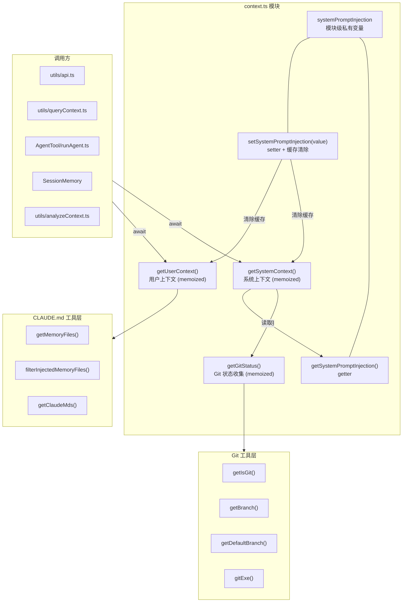
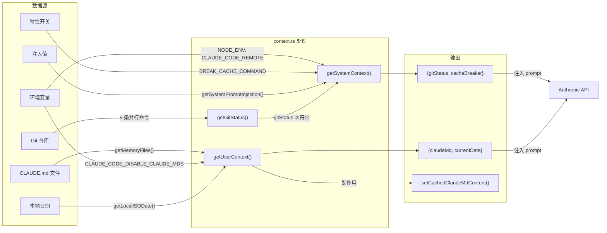
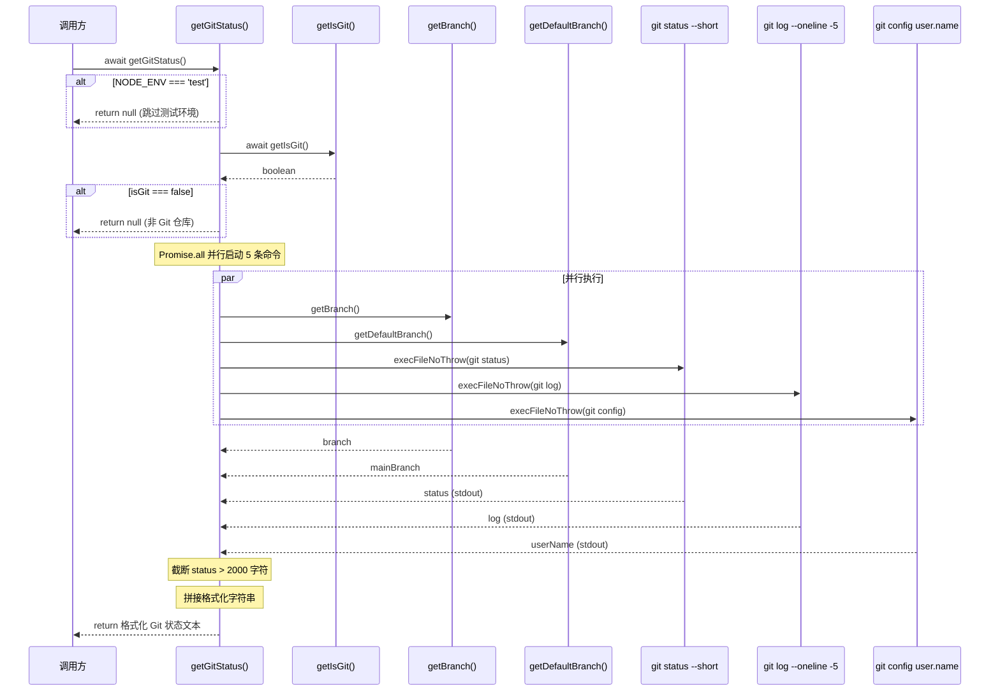
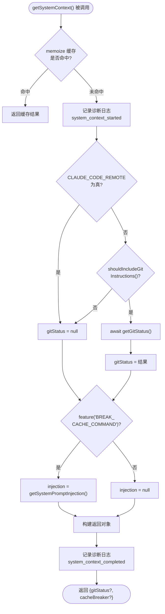
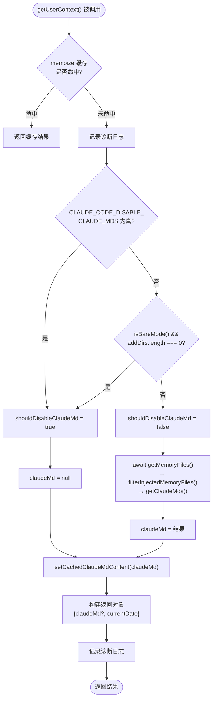
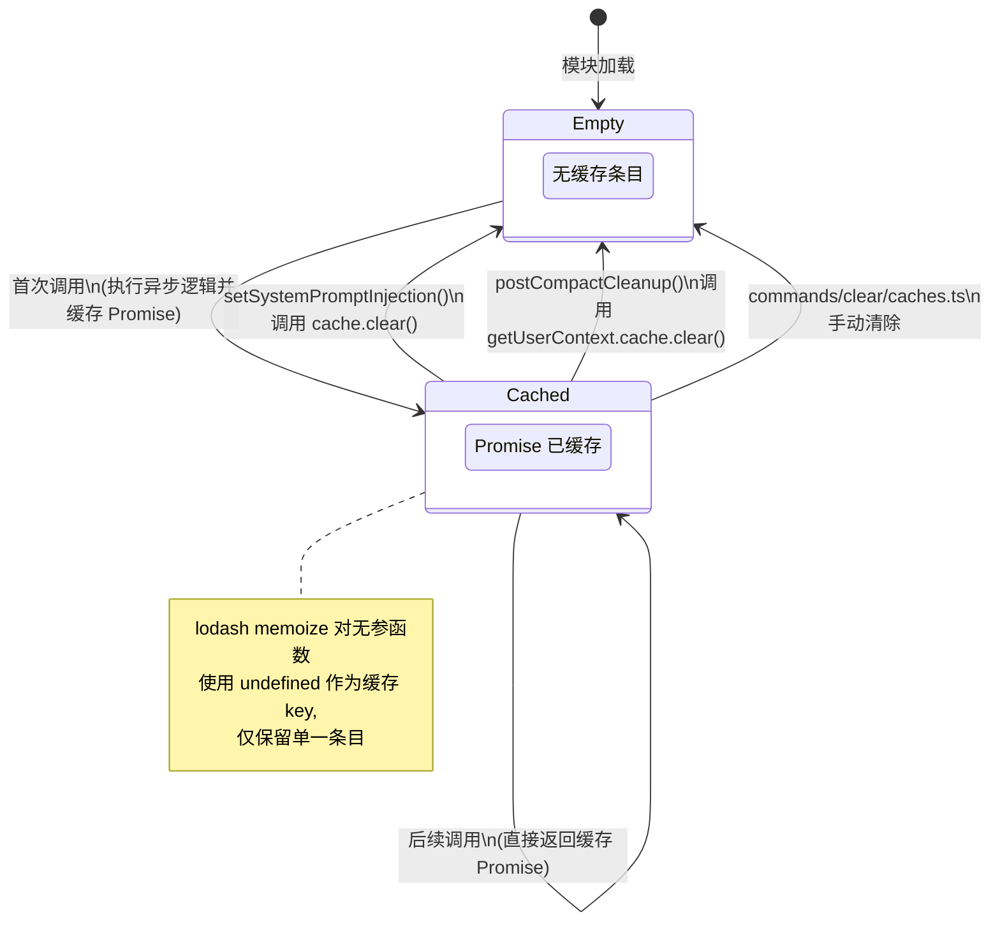
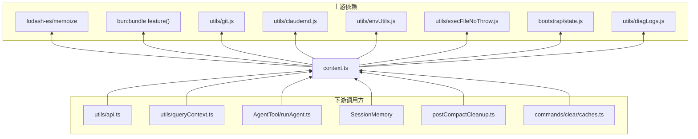

# 系统/用户上下文子模块设计文档

| 属性     | 内容                                                         |
| -------- | ------------------------------------------------------------ |
| 模块名称 | 系统/用户上下文管理 (System & User Context)                  |
| 源文件   | `src/context.ts` (189 行)                                    |
| 所属层级 | L2 — 主启动链子模块                                          |
| 版本     | 基于 `@anthropic-ai/claude-code` v2.1.88 还原源码           |
| 文档日期 | 2026-04-01                                                   |

---

## 目录

1. [模块概述](#1-模块概述)
2. [模块架构](#2-模块架构)
3. [接口设计](#3-接口设计)
4. [数据流设计](#4-数据流设计)
5. [核心流程设计](#5-核心流程设计)
6. [状态管理与缓存生命周期](#6-状态管理与缓存生命周期)
7. [错误处理设计](#7-错误处理设计)
8. [依赖关系](#8-依赖关系)
9. [设计评估与质量分析](#9-设计评估与质量分析)
10. [术语表](#10-术语表)

---

## 1. 模块概述

### 1.1 目的与职责

`context.ts` 是 Claude Code 主启动链中的上下文收集模块，负责在会话开始时聚合系统级和用户级上下文信息，并将其注入到与 Anthropic API 交互的提示词 (prompt) 中。模块承担三大核心职责：

1. **系统上下文收集** — 获取当前 Git 仓库状态（分支、变更、提交历史、用户名），组装为结构化文本
2. **用户上下文收集** — 加载 `CLAUDE.md` 配置文件内容与当前日期，供模型理解用户偏好和工作上下文
3. **缓存破坏注入** — 提供可选的 `cacheBreaker` 字段，用于调试时强制刷新 API 缓存

### 1.2 设计原则

| 原则           | 体现                                                                 |
| -------------- | -------------------------------------------------------------------- |
| 单一职责       | 仅负责上下文数据的聚合与缓存，不涉及 API 通信或 UI 渲染             |
| 优雅降级       | Git 不可用时返回 `null`，不阻塞启动流程 (`context.ts:104-110`)       |
| 性能优先       | 5 条 Git 命令通过 `Promise.all` 并行执行 (`context.ts:61-77`)        |
| 缓存一致性     | 注入值变更时主动清除两个上下文缓存 (`context.ts:32-33`)              |
| 环境感知       | 根据 `NODE_ENV`、`CLAUDE_CODE_REMOTE`、`--bare` 等条件裁剪上下文    |

### 1.3 在启动链中的位置

本模块在 CLI 启动完成、React (Ink) 渲染之前被调用，其返回值通过 `utils/api.ts` 和 `utils/queryContext.ts` 注入到对 Anthropic API 的首条消息中。属于启动链的"上下文准备"阶段。

---

## 2. 模块架构

### 2.1 整体架构图



### 2.2 导出接口概览

| 导出                          | 类型         | 行号      | 用途                               |
| ----------------------------- | ------------ | --------- | ---------------------------------- |
| `getSystemPromptInjection()`  | 同步函数     | 25-27     | 获取当前缓存破坏注入值            |
| `setSystemPromptInjection(v)` | 同步函数     | 29-34     | 设置注入值并清除上下文缓存        |
| `getGitStatus()`              | 异步 memoize | 36-111    | 获取格式化的 Git 状态字符串       |
| `getSystemContext()`          | 异步 memoize | 116-150   | 获取系统上下文对象                 |
| `getUserContext()`            | 异步 memoize | 155-189   | 获取用户上下文对象                 |

---

## 3. 接口设计

### 3.1 getSystemPromptInjection

```typescript
// context.ts:25-27
export function getSystemPromptInjection(): string | null
```

- **语义**：返回当前设置的缓存破坏值，未设置时为 `null`
- **调用时机**：由 `getSystemContext()` 内部调用 (`context.ts:132`)
- **线程安全**：Node.js 单线程模型下无竞争问题

### 3.2 setSystemPromptInjection

```typescript
// context.ts:29-34
export function setSystemPromptInjection(value: string | null): void
```

- **语义**：更新缓存破坏值，并**立即清除** `getUserContext` 和 `getSystemContext` 的 memoize 缓存
- **副作用**：调用 `getUserContext.cache.clear?.()` 和 `getSystemContext.cache.clear?.()` (`context.ts:32-33`)
- **设计意图**：确保下一次上下文获取反映最新注入值，避免读取过期缓存

### 3.3 getGitStatus

```typescript
// context.ts:36-111
export const getGitStatus: () => Promise<string | null>
```

- **返回值**：成功时返回多段拼接的 Git 状态文本；失败或非 Git 目录时返回 `null`
- **缓存策略**：lodash `memoize`，无参数，终身缓存（首次调用后不再执行）
- **输出格式**（`context.ts:96-103`）：

```
This is the git status at the start of the conversation...

Current branch: <branch>

Main branch (you will usually use this for PRs): <mainBranch>

Git user: <userName>

Status:
<truncatedStatus>

Recent commits:
<log>
```

### 3.4 getSystemContext

```typescript
// context.ts:116-150
export const getSystemContext: () => Promise<{ [k: string]: string }>
```

- **返回字段**：
  - `gitStatus`（可选）— 来自 `getGitStatus()` 的文本
  - `cacheBreaker`（可选）— 格式为 `[CACHE_BREAKER: <value>]`
- **条件裁剪**：
  - `CLAUDE_CODE_REMOTE` 为真时跳过 Git（`context.ts:125`）
  - `shouldIncludeGitInstructions()` 返回 `false` 时跳过 Git（`context.ts:126`）
  - `feature('BREAK_CACHE_COMMAND')` 为 `false` 时跳过注入（`context.ts:131`）

### 3.5 getUserContext

```typescript
// context.ts:155-189
export const getUserContext: () => Promise<{ [k: string]: string }>
```

- **返回字段**：
  - `claudeMd`（可选）— 合并后的 CLAUDE.md 内容
  - `currentDate`（必有）— 格式为 `"Today's date is YYYY-MM-DD."`
- **条件裁剪**：
  - `CLAUDE_CODE_DISABLE_CLAUDE_MDS` 环境变量为真时禁用（`context.ts:166`）
  - `--bare` 模式且无显式 `--add-dir` 时禁用（`context.ts:167`）
- **副作用**：调用 `setCachedClaudeMdContent()` 缓存 CLAUDE.md 内容，避免 `yoloClassifier` 循环依赖（`context.ts:176`）

---

## 4. 数据流设计

### 4.1 上下文数据流图



### 4.2 数据字段映射

| 数据源                 | 中间处理                          | 最终字段                 | 目标       |
| ---------------------- | --------------------------------- | ------------------------ | ---------- |
| `getBranch()`          | 拼入 `getGitStatus()` 返回值     | `systemContext.gitStatus`| API prompt |
| `getDefaultBranch()`   | 拼入 `getGitStatus()` 返回值     | `systemContext.gitStatus`| API prompt |
| `git status --short`   | 截断 > 2000 字符                 | `systemContext.gitStatus`| API prompt |
| `git log --oneline -5` | 拼入 `getGitStatus()` 返回值     | `systemContext.gitStatus`| API prompt |
| `git config user.name` | 条件拼入（非空时）               | `systemContext.gitStatus`| API prompt |
| `systemPromptInjection`| `feature()` 门控                 | `systemContext.cacheBreaker`| API prompt |
| `getMemoryFiles()`     | `filter → getClaudeMds()`        | `userContext.claudeMd`   | API prompt |
| `getLocalISODate()`    | 格式化为日期字符串               | `userContext.currentDate`| API prompt |

---

## 5. 核心流程设计

### 5.1 getGitStatus 并行执行时序图



### 5.2 getSystemContext 条件分支流程



### 5.3 getUserContext 条件分支流程



---

## 6. 状态管理与缓存生命周期

### 6.1 内部状态清单

| 状态                    | 类型            | 作用域     | 行号   | 说明                           |
| ----------------------- | --------------- | ---------- | ------ | ------------------------------ |
| `MAX_STATUS_CHARS`      | `const number`  | 模块常量   | 20     | Git status 截断阈值 (2000)     |
| `systemPromptInjection` | `let string\|null` | 模块私有 | 23     | 缓存破坏注入值                 |
| `getGitStatus.cache`    | lodash Map      | memoize 内 | 36     | Git 状态缓存（终身有效）       |
| `getSystemContext.cache`| lodash Map      | memoize 内 | 116    | 系统上下文缓存（可被清除）     |
| `getUserContext.cache`  | lodash Map      | memoize 内 | 155    | 用户上下文缓存（可被清除）     |

### 6.2 Memoize 缓存生命周期图



### 6.3 缓存清除触发源

根据源码分析，以下场景会触发缓存清除：

1. **`setSystemPromptInjection()` 调用** (`context.ts:32-33`) — 清除 `getUserContext` 和 `getSystemContext` 缓存
2. **`postCompactCleanup()` 调用** (`services/compact/postCompactCleanup.ts:59`) — 仅清除 `getUserContext` 缓存，使下次获取时重新读取可能已更新的 CLAUDE.md
3. **`commands/clear/caches.ts`** — 用户执行 `/clear` 命令时清除上下文缓存

### 6.4 缓存一致性保证

```
setSystemPromptInjection(value)
    ├── systemPromptInjection = value       // 更新私有状态
    ├── getUserContext.cache.clear?.()       // 清除用户上下文缓存
    └── getSystemContext.cache.clear?.()     // 清除系统上下文缓存
```

使用可选链 `?.()` 调用 `clear` 方法（`context.ts:32-33`），这是一种防御性编程：在 lodash memoize 实现中 `cache` 属性为 `Map`，必定存在 `clear` 方法，但可选链提供了额外的安全保障。

---

## 7. 错误处理设计

### 7.1 错误处理策略

| 函数                | 策略             | 行号      | 行为                                      |
| ------------------- | ---------------- | --------- | ----------------------------------------- |
| `getGitStatus()`    | try/catch 包裹   | 59-110    | 捕获任意异常 → `logError()` → 返回 `null` |
| `getSystemContext()` | 委托给子函数    | 116-150   | 无显式 try/catch，依赖 `getGitStatus` 的容错 |
| `getUserContext()`   | 委托给子函数    | 155-189   | 无显式 try/catch，依赖上游工具函数的容错     |

### 7.2 优雅降级设计

`getGitStatus()` 的错误处理是本模块最关键的容错设计（`context.ts:104-110`）：

```typescript
catch (error) {
    logForDiagnosticsNoPII('error', 'git_status_failed', {
        duration_ms: Date.now() - startTime,
    })
    logError(error)
    return null
}
```

**设计要点**：
- Git 状态属于**增强信息**而非必需信息，获取失败不应阻止 Claude Code 正常启动
- 返回 `null` 后，`getSystemContext()` 通过展开运算符 `...(gitStatus && { gitStatus })` 自动跳过该字段（`context.ts:142`）
- 错误被记录到诊断日志但不向用户报告

### 7.3 边界防护

| 边界场景                | 防护措施                                              | 行号      |
| ----------------------- | ----------------------------------------------------- | --------- |
| 测试环境                | `NODE_ENV === 'test'` 提前返回 `null`                 | 37-40     |
| 非 Git 目录             | `getIsGit()` 检测后提前返回 `null`                    | 52-57     |
| Git status 输出过长     | 超过 `MAX_STATUS_CHARS` (2000) 时截断并附提示         | 85-89     |
| Git 命令执行失败        | `execFileNoThrow` 不抛异常 + 外层 try/catch           | 64, 59    |
| 用户名为空              | 条件展开 `...(userName ? [...] : [])`                 | 100       |
| CLAUDE.md 为 null       | `setCachedClaudeMdContent(claudeMd || null)` 归一化   | 176       |

---

## 8. 依赖关系

### 8.1 上游依赖（被本模块导入）

| 依赖模块                          | 导入项                                        | 用途                     |
| --------------------------------- | --------------------------------------------- | ------------------------ |
| `bun:bundle`                      | `feature`                                     | 特性开关查询             |
| `lodash-es/memoize.js`            | `memoize`                                     | 函数结果缓存             |
| `bootstrap/state.js`              | `getAdditionalDirectoriesForClaudeMd`, `setCachedClaudeMdContent` | 启动状态读写 |
| `constants/common.js`             | `getLocalISODate`                             | 本地日期格式化           |
| `utils/claudemd.js`               | `getMemoryFiles`, `filterInjectedMemoryFiles`, `getClaudeMds` | CLAUDE.md 加载 |
| `utils/diagLogs.js`               | `logForDiagnosticsNoPII`                      | 无 PII 诊断日志          |
| `utils/envUtils.js`               | `isBareMode`, `isEnvTruthy`                   | 环境变量检测             |
| `utils/execFileNoThrow.js`        | `execFileNoThrow`                             | 安全执行外部命令         |
| `utils/git.js`                    | `getBranch`, `getDefaultBranch`, `getIsGit`, `gitExe` | Git 操作     |
| `utils/gitSettings.js`            | `shouldIncludeGitInstructions`                | Git 配置偏好             |
| `utils/log.js`                    | `logError`                                    | 错误日志                 |

### 8.2 下游依赖（导入本模块的文件）

| 调用方文件                                    | 使用的导出                             |
| --------------------------------------------- | -------------------------------------- |
| `utils/api.ts`                                | `getSystemContext`, `getUserContext`    |
| `utils/queryContext.ts`                        | `getSystemContext`, `getUserContext`    |
| `tools/AgentTool/runAgent.ts`                  | `getSystemContext`, `getUserContext`    |
| `services/SessionMemory/sessionMemory.ts`      | `getSystemContext`, `getUserContext`    |
| `utils/analyzeContext.ts`                      | `getSystemContext`                     |
| `components/agents/generateAgent.ts`           | `getUserContext`                       |
| `services/compact/postCompactCleanup.ts`       | `getUserContext`（操作其缓存）         |
| `commands/clear/caches.ts`                     | `getSystemContext`（操作其缓存）       |

### 8.3 依赖关系图



---

## 9. 设计评估与质量分析

### 9.1 优点

| 维度         | 评价                                                                                      | 源码证据                    |
| ------------ | ----------------------------------------------------------------------------------------- | --------------------------- |
| 性能优化     | 5 条 Git 命令通过 `Promise.all` 并行执行，最大化利用 I/O 等待时间                         | `context.ts:61-77`          |
| 防御性编程   | `execFileNoThrow` 避免子进程异常抛出，外层 try/catch 提供二次兜底                         | `context.ts:64`, `59-110`   |
| 可观测性     | 每个关键阶段均有 `logForDiagnosticsNoPII` 诊断日志，含耗时数据                            | `context.ts:43,47,79,91,105`|
| 输出安全     | Git status 截断在 2000 字符，防止超长输出消耗 token 预算                                  | `context.ts:85-89`          |
| 循环依赖规避 | 通过 `setCachedClaudeMdContent()` 中间缓存避免 `yoloClassifier` → `claudemd` 循环导入     | `context.ts:173-176`        |
| 缓存一致性   | `setSystemPromptInjection()` 同时清除两个上下文缓存，保证状态同步                         | `context.ts:32-33`          |
| 条件裁剪     | 多层环境判断（CCR 模式、bare 模式、环境变量禁用），精确控制上下文注入范围                  | `context.ts:124-128,165-167`|

### 9.2 潜在改进点

| 维度           | 观察                                                                                      | 源码证据                    |
| -------------- | ----------------------------------------------------------------------------------------- | --------------------------- |
| 错误隔离不足   | `getUserContext()` 无 try/catch，`getMemoryFiles()` 异常将导致整个函数 reject              | `context.ts:155-189`        |
| 缓存粒度       | `getGitStatus` 缓存永不失效（无 `clear` 调用者），长会话中 Git 状态可能过时                | `context.ts:36`             |
| 类型定义宽松   | 返回类型为 `{ [k: string]: string }` 而非精确的接口类型，降低了类型安全性                  | `context.ts:118-119,157-158`|
| 日志冗余       | `getGitStatus()` 中有 5 处 `logForDiagnosticsNoPII` 调用，在高频场景下可能产生日志噪音    | `context.ts:43-105`         |
| 硬编码常量     | `MAX_STATUS_CHARS = 2000` 和截断提示信息为硬编码字符串，不可配置                           | `context.ts:20,88`          |

### 9.3 CMMI3 符合性评估

| CMMI3 实践域         | 符合度 | 说明                                                                 |
| -------------------- | ------ | -------------------------------------------------------------------- |
| 需求管理 (REQM)      | 中     | 接口契约通过 TypeScript 类型定义，但返回类型过于宽泛                 |
| 技术解决方案 (TS)     | 高     | 并行执行、memoize 缓存、优雅降级等设计决策合理且有据可循             |
| 产品集成 (PI)         | 高     | 与上下游模块的集成边界清晰，通过标准 import/export 机制              |
| 验证 (VER)            | 低     | 测试环境通过 `NODE_ENV` 跳过而非 mock，缺乏单元测试可见性           |
| 风险管理 (RSKM)       | 高     | Git 命令失败、输出过长、非 Git 目录等风险均有明确的缓解策略          |

---

## 10. 术语表

| 术语                      | 定义                                                                         |
| ------------------------- | ---------------------------------------------------------------------------- |
| `memoize`                 | 函数缓存技术，首次调用后将结果存储，后续调用直接返回缓存值                   |
| `systemPromptInjection`   | 用于调试目的的缓存破坏值，注入到系统提示词中以强制 API 重新处理              |
| `CLAUDE.md`               | Claude Code 用户自定义配置文件，包含项目特定的指令和偏好设置                 |
| `CCR (CLAUDE_CODE_REMOTE)`| 远程会话模式标识，在此模式下跳过 Git 状态收集以减少开销                       |
| `bare mode`               | 最小模式，通过 `--bare` 参数启用，跳过自动发现的上下文（但保留显式指定的目录）|
| `yoloClassifier`          | 自动模式分类器，用于判断是否可以自动执行工具调用，需要读取 CLAUDE.md 内容    |
| `feature gate`            | 特性开关机制，通过 `feature()` 函数查询，控制实验性功能的启用/禁用            |
| `execFileNoThrow`         | 安全的子进程执行函数，即使命令失败也不抛出异常，而是返回包含 stdout/stderr 的对象 |
| `MAX_STATUS_CHARS`        | Git status 输出的最大字符数限制 (2000)，超出时截断并附加提示                  |
| `Promise.all`             | JavaScript 并行执行多个 Promise 的机制，所有 Promise 完成后返回结果数组       |
