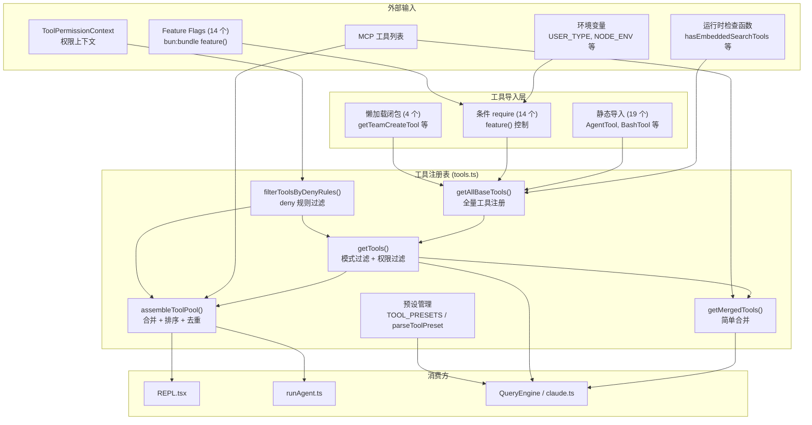
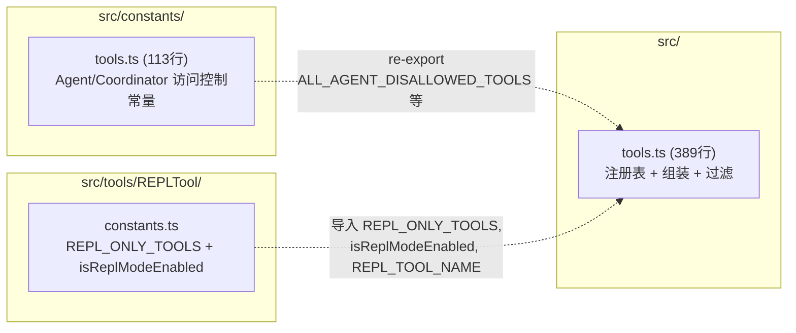
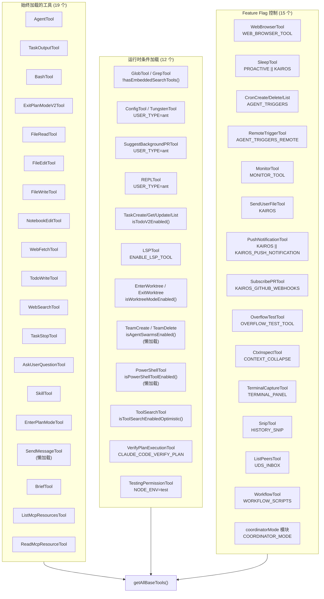
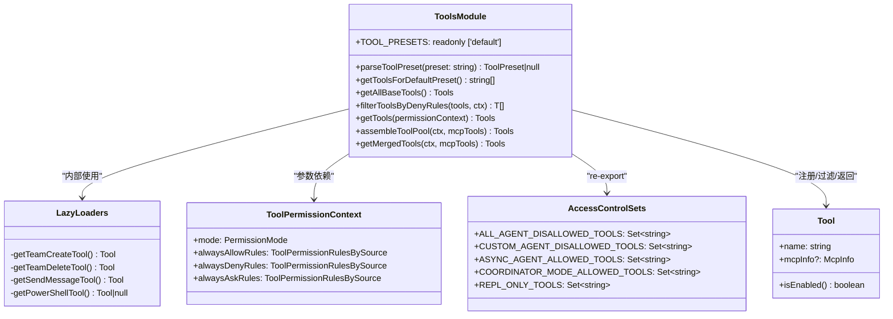
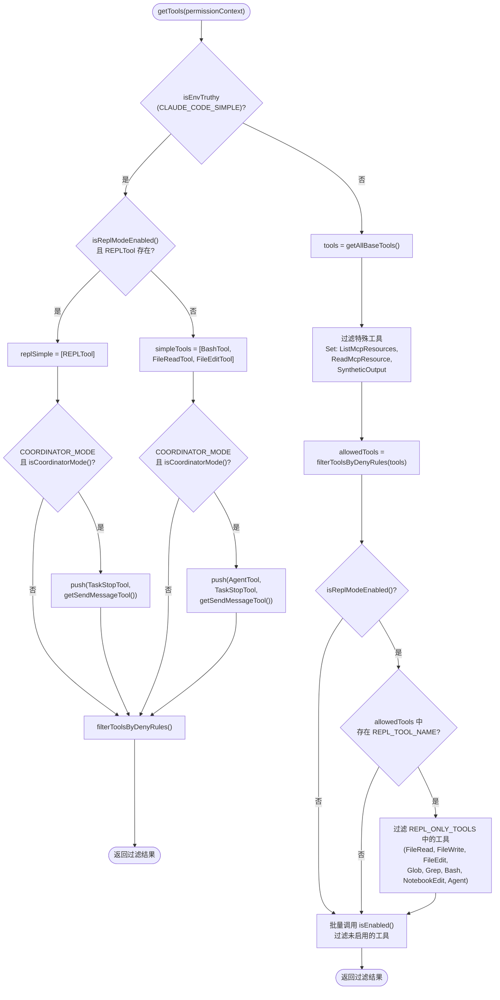
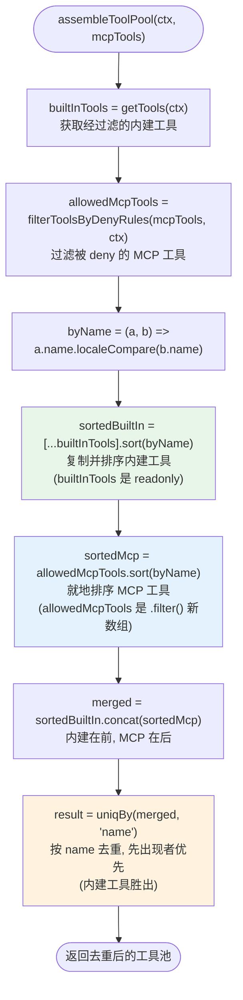
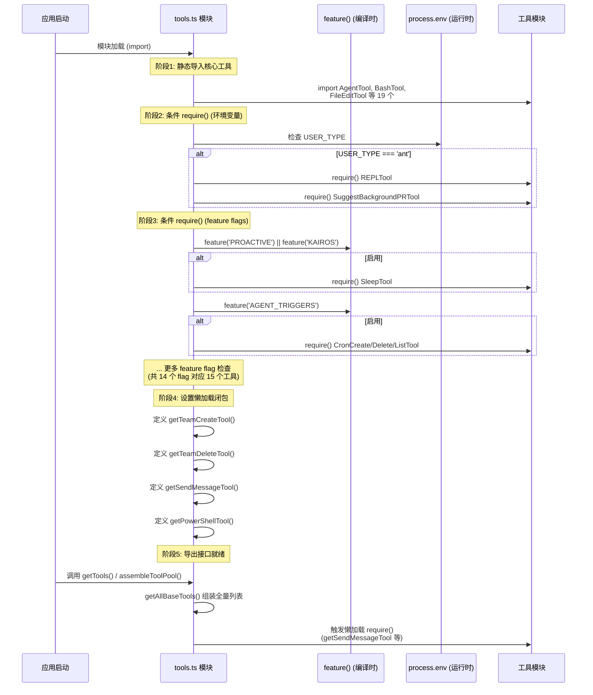
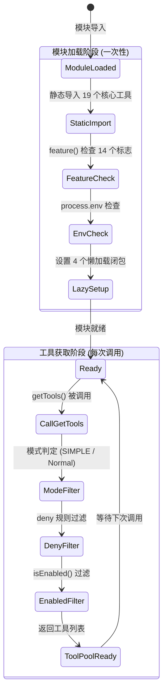

# 工具注册表 子模块详细设计文档

## 文档信息
| 项目 | 内容 |
|------|------|
| 模块名称 | 工具注册表 (Tool Registry — tools.ts) |
| 文档版本 | v1.0-20260401 |
| 生成日期 | 2026-04-01 |
| 生成方式 | 代码反向工程 |
| 源文件 | `src/tools.ts`（389 行） |
| 关联常量 | `src/constants/tools.ts`（113 行） |

## 1. 模块概述

### 1.1 模块职责

`tools.ts` 是 Claude Code 工具系统的中央注册表与组装引擎，承担四大职责：

1. **工具注册**：汇聚全部 54 个可能的内建工具实例，根据 14 个 feature flag、环境变量和运行时条件决定哪些工具被纳入注册表。
2. **工具过滤**：提供基于权限拒绝规则（deny rules）的工具过滤能力，在工具列表交付给模型之前移除被全局拒绝的工具。
3. **工具池组装**：将内建工具与 MCP 外部工具合并、排序、去重，生成最终交付给 LLM 的工具池。
4. **预设管理**：提供工具预设（preset）的解析和查询功能，支持 `--tools` 命令行参数。

此外，该模块还通过 re-export 机制向外暴露 Agent/Coordinator 模式下的工具白名单和黑名单常量。

### 1.2 模块边界

**输入**：
- 环境变量（`USER_TYPE`、`CLAUDE_CODE_SIMPLE`、`ENABLE_LSP_TOOL`、`NODE_ENV`、`CLAUDE_CODE_VERIFY_PLAN` 等）
- Feature flag（通过 `bun:bundle` 的 `feature()` 函数获取，14 个标志位）
- `ToolPermissionContext`：权限上下文，含 allow/deny/ask 规则
- MCP 工具列表（来自外部 MCP 服务器）
- 运行时条件函数（`hasEmbeddedSearchTools()`、`isPowerShellToolEnabled()`、`isTodoV2Enabled()` 等）

**输出**：
- `getAllBaseTools(): Tools` -- 全量内建工具列表
- `getTools(permissionContext): Tools` -- 经过滤的内建工具列表
- `assembleToolPool(ctx, mcpTools): Tools` -- 合并去重后的完整工具池
- `getMergedTools(ctx, mcpTools): Tools` -- 简单合并（不去重）的工具列表
- `filterToolsByDenyRules(tools, ctx): T[]` -- 通用 deny 规则过滤器
- `TOOL_PRESETS` / `parseToolPreset()` / `getToolsForDefaultPreset()` -- 预设 API
- Re-export 常量：`REPL_ONLY_TOOLS`、`ALL_AGENT_DISALLOWED_TOOLS`、`CUSTOM_AGENT_DISALLOWED_TOOLS`、`ASYNC_AGENT_ALLOWED_TOOLS`、`COORDINATOR_MODE_ALLOWED_TOOLS`

**与外部模块的交互**：

| 交互模块 | 方向 | 交互方式 | 说明 |
|----------|------|----------|------|
| 各具体工具实现（`tools/*/`） | 入 | 静态/动态 import | 导入 54 个工具的单例实例 |
| 权限系统（`utils/permissions/`） | 入 | `getDenyRuleForTool()` | 判定工具是否被全局拒绝 |
| MCP 服务（`services/mcp/`） | 入 | 接收 `mcpTools` 参数 | MCP 工具列表 |
| Feature Flag（`bun:bundle`） | 入 | `feature()` | 编译时 dead code elimination |
| Coordinator 模块（`coordinator/`） | 入 | `coordinatorModeModule?.isCoordinatorMode()` | 判断是否处于协调器模式 |
| REPL.tsx（`useMergedTools` hook） | 出 | 调用 `assembleToolPool()` | 获取交互模式下的完整工具池 |
| runAgent.ts | 出 | 调用 `assembleToolPool()` | 获取 coordinator worker 的工具池 |
| QueryEngine / claude.ts | 出 | 调用 `getMergedTools()` / `getTools()` | Token 计数、ToolSearch 阈值计算 |
| REPLTool 常量（`tools/REPLTool/constants.ts`） | 入 | 导入 `REPL_ONLY_TOOLS`、`isReplModeEnabled` | REPL 模式判定和工具隐藏集合 |

## 2. 架构设计

### 2.1 模块架构图



### 2.2 源文件组织



### 2.3 外部依赖

| 依赖 | 来源 | 用途 |
|------|------|------|
| `lodash-es/uniqBy` | npm | `assembleToolPool()` 中按 `name` 去重 |
| `bun:bundle` | Bun 运行时 | `feature()` 函数实现编译时 dead code elimination |
| `utils/permissions/permissions` | 内部 | `getDenyRuleForTool()` 判定工具是否被 deny |
| `utils/embeddedTools` | 内部 | `hasEmbeddedSearchTools()` 判断是否有内嵌搜索工具 |
| `utils/envUtils` | 内部 | `isEnvTruthy()` 环境变量布尔值判断 |
| `utils/shell/shellToolUtils` | 内部 | `isPowerShellToolEnabled()` PowerShell 可用性 |
| `utils/agentSwarmsEnabled` | 内部 | `isAgentSwarmsEnabled()` Agent Swarm 功能开关 |
| `utils/worktreeModeEnabled` | 内部 | `isWorktreeModeEnabled()` Worktree 模式开关 |
| `utils/toolSearch` | 内部 | `isToolSearchEnabledOptimistic()` ToolSearch 乐观检查 |
| `utils/tasks` | 内部 | `isTodoV2Enabled()` Task v2 功能开关 |

## 3. 数据结构设计

### 3.1 核心数据结构

#### 3.1.1 工具预设类型（第 161-163 行）

```typescript
export const TOOL_PRESETS = ['default'] as const
export type ToolPreset = (typeof TOOL_PRESETS)[number]  // 'default'
```

当前仅包含 `'default'` 一个预设。设计为 `as const` 元组以获得字面量类型推断。

#### 3.1.2 工具条件加载配置（第 16-135 行）

工具的条件加载分为三个层级，按加载时机从早到晚排列：

| 层级 | 机制 | 时机 | 示例 | 代码位置 |
|------|------|------|------|----------|
| 编译时消除 | `feature('FLAG')` | Bun 打包时 | `feature('PROACTIVE')` | 第 26、29、36 行等 |
| 运行时环境变量 | `process.env.XXX` | 模块加载时 | `process.env.USER_TYPE === 'ant'` | 第 17、214 行等 |
| 懒加载闭包 | `getXxxTool()` | 首次调用时 | `getTeamCreateTool()` | 第 63-71、150-155 行 |

#### 3.1.3 工具访问控制集合（`constants/tools.ts`）

| 常量名 | 类型 | 用途 |
|--------|------|------|
| `ALL_AGENT_DISALLOWED_TOOLS` | `Set<string>` | 所有 Agent 禁用的工具（TaskOutput、ExitPlanMode、EnterPlanMode、AskUserQuestion、TaskStop；外部用户还包含 AgentTool） |
| `CUSTOM_AGENT_DISALLOWED_TOOLS` | `Set<string>` | 自定义 Agent 禁用工具（继承上述集合） |
| `ASYNC_AGENT_ALLOWED_TOOLS` | `Set<string>` | 异步 Agent 允许的工具白名单 |
| `COORDINATOR_MODE_ALLOWED_TOOLS` | `Set<string>` | 协调器模式仅允许 Agent、TaskStop、SendMessage、SyntheticOutput |
| `REPL_ONLY_TOOLS` | `Set<string>` | REPL 模式下隐藏的原始工具（FileRead、FileWrite、FileEdit、Glob、Grep、Bash、NotebookEdit、Agent） |

### 3.2 54 个工具注册架构图



### 3.3 数据关系图



## 4. 接口设计

### 4.1 对外接口

#### 4.1.1 `getAllBaseTools(): Tools`
- **位置**：`tools.ts` 第 193-251 行
- **功能**：获取当前环境下所有可能的内建工具（考虑 feature flag 和环境变量，但不考虑权限过滤和 isEnabled 过滤）
- **参数**：无
- **返回值**：`Tools`（最多 54 个工具实例的只读数组）
- **约束**：函数注释标注"必须与 Statsig 缓存配置 `claude_code_global_system_caching` 保持同步"（第 191 行）
- **注意**：每次调用都会重新构建数组，包括调用懒加载闭包 `getSendMessageTool()`（第 226 行）和 `getPowerShellTool()`（第 242 行）

#### 4.1.2 `getTools(permissionContext: ToolPermissionContext): Tools`
- **位置**：`tools.ts` 第 271-327 行
- **功能**：获取经过模式过滤、权限过滤、REPL 过滤和 isEnabled 过滤后的内建工具列表
- **参数**：
  - `permissionContext`：权限上下文，包含 deny/allow/ask 规则
- **返回值**：`Tools`
- **逻辑**：详见第 5.2 节 getTools 过滤流程

#### 4.1.3 `assembleToolPool(permissionContext: ToolPermissionContext, mcpTools: Tools): Tools`
- **位置**：`tools.ts` 第 345-367 行
- **功能**：组装完整工具池（内建 + MCP），分区排序并按名称去重，内建工具优先
- **参数**：
  - `permissionContext`：权限上下文
  - `mcpTools`：来自 MCP 服务器的工具列表
- **返回值**：`Tools`（去重后的合并列表）
- **排序策略**：内建工具和 MCP 工具各自按 `name` 排序后拼接，再通过 `uniqBy('name')` 去重。内建作为连续前缀确保 prompt cache 稳定性（第 355-359 行注释）

#### 4.1.4 `getMergedTools(permissionContext: ToolPermissionContext, mcpTools: Tools): Tools`
- **位置**：`tools.ts` 第 383-389 行
- **功能**：简单合并内建工具和 MCP 工具（不排序、不去重）
- **参数**：同 `assembleToolPool`
- **返回值**：`[...builtInTools, ...mcpTools]`
- **使用场景**：ToolSearch 阈值计算、Token 计数等不需要去重的场景

#### 4.1.5 `filterToolsByDenyRules<T>(tools: readonly T[], permissionContext: ToolPermissionContext): T[]`
- **位置**：`tools.ts` 第 262-269 行
- **功能**：过滤被全局 deny 规则覆盖的工具。对 MCP 工具支持前缀匹配（如 `mcp__server` 可拒绝该 server 的所有工具）
- **泛型约束**：`T extends { name: string; mcpInfo?: { serverName: string; toolName: string } }`
- **实现**：调用 `getDenyRuleForTool()` 检查每个工具，有 blanket deny 规则则过滤

#### 4.1.6 `parseToolPreset(preset: string): ToolPreset | null`
- **位置**：`tools.ts` 第 165-171 行
- **功能**：将字符串解析为有效的 `ToolPreset`，大小写不敏感
- **参数**：`preset` -- 待解析的预设名称
- **返回值**：匹配的 `ToolPreset` 或 `null`

#### 4.1.7 `getToolsForDefaultPreset(): string[]`
- **位置**：`tools.ts` 第 179-183 行
- **功能**：获取默认预设下所有 `isEnabled()` 返回 `true` 的工具名称列表
- **参数**：无
- **返回值**：工具名称字符串数组

### 4.2 Re-export 接口

以下常量从 `constants/tools.ts` 和 `tools/REPLTool/constants.ts` re-export：

| 导出名称 | 原始来源 | 类型 | 说明 |
|----------|----------|------|------|
| `ALL_AGENT_DISALLOWED_TOOLS` | `constants/tools.ts:36` | `Set<string>` | 所有 Agent 模式禁用的工具集合 |
| `CUSTOM_AGENT_DISALLOWED_TOOLS` | `constants/tools.ts:48` | `Set<string>` | 自定义 Agent 禁用工具集合 |
| `ASYNC_AGENT_ALLOWED_TOOLS` | `constants/tools.ts:55` | `Set<string>` | 异步 Agent 允许的工具白名单 |
| `COORDINATOR_MODE_ALLOWED_TOOLS` | `constants/tools.ts:107` | `Set<string>` | 协调器模式允许的工具 |
| `REPL_ONLY_TOOLS` | `tools/REPLTool/constants.ts:37` | `Set<string>` | REPL 模式下隐藏的原始工具 |

### 4.3 内部函数

#### 4.3.1 `getTeamCreateTool()` / `getTeamDeleteTool()` / `getSendMessageTool()`
- **位置**：`tools.ts` 第 63-71 行
- **功能**：通过闭包延迟 `require()` 加载工具模块，打破循环依赖
- **原因**：`tools.ts -> TeamCreateTool -> ... -> tools.ts` 存在循环引用

#### 4.3.2 `getPowerShellTool()`
- **位置**：`tools.ts` 第 150-155 行
- **功能**：先检查 `isPowerShellToolEnabled()`，不可用返回 `null`，否则懒加载 PowerShellTool
- **返回值**：`Tool | null`

## 5. 核心流程设计

### 5.1 getTools 过滤流程



### 5.2 assembleToolPool 组装流程



### 5.3 模块加载初始化流程



### 5.4 关键算法

#### 5.4.1 分区排序与去重算法（`assembleToolPool`，第 345-367 行）

```
算法：assembleToolPool
输入：permissionContext, mcpTools
输出：去重、分区排序后的工具列表

1. builtInTools = getTools(permissionContext)           // 内建工具（经过滤）
2. allowedMcpTools = filterToolsByDenyRules(mcpTools)   // MCP 工具（经过滤）
3. sortedBuiltIn = copy(builtInTools).sort(byName)      // 内建按名称排序（需复制，原数组 readonly）
4. sortedMcp = allowedMcpTools.sort(byName)             // MCP 按名称排序（.filter() 产生新数组，可就地排序）
5. merged = sortedBuiltIn.concat(sortedMcp)             // 内建在前、MCP 在后
6. return uniqBy(merged, 'name')                        // 按 name 去重，保留先出现的
```

**设计要点**：
- 分区排序而非全局排序，确保内建工具始终作为连续前缀
- API 服务端的 `claude_code_system_cache_policy` 在最后一个内建工具后放置缓存断点
- 如果 MCP 工具穿插到内建工具中间，会导致缓存断点位置变化，破坏所有下游缓存键
- `uniqBy` 保留插入顺序，因此内建工具在名称冲突时优先
- 代码注释明确说明"避免 `Array.toSorted`（Node 20+）— 我们支持 Node 18"（第 361 行）

#### 5.4.2 REPL 模式工具隐藏算法（`getTools`，第 314-323 行）

```
算法：REPL 模式工具过滤
前提：isReplModeEnabled() 返回 true

1. 检查 allowedTools 中是否存在名为 REPL_TOOL_NAME 的工具
2. 若存在，过滤掉 REPL_ONLY_TOOLS 集合中的所有原始工具
   - FileRead, FileWrite, FileEdit, Glob, Grep, Bash, NotebookEdit, Agent
3. 这些工具仍然可通过 REPL VM 内部间接访问
```

#### 5.4.3 条件加载三模式策略（第 16-135 行）

| 模式 | 代表用法 | 加载时机 | 适用场景 |
|------|----------|----------|----------|
| `feature('FLAG')` | `feature('PROACTIVE')` 控制 SleepTool | 编译时（Bun bundler） | 稳定的功能开关，需要 dead code elimination |
| `process.env.XXX` | `process.env.USER_TYPE === 'ant'` 控制 REPLTool | 模块加载时 | 运行时可变的环境配置 |
| `getXxxTool()` 闭包 | `getTeamCreateTool()` | 首次调用时 | 存在循环依赖需要延迟加载 |

## 6. 状态管理

### 6.1 状态定义

本模块是**无状态**的。它不维护任何内部可变状态。所有运行时行为由以下方式决定：

1. **编译时常量**：`feature()` 的返回值在编译时确定，打包后不可变
2. **进程级常量**：`process.env.USER_TYPE`、`process.env.NODE_ENV` 等在进程启动后不变
3. **调用时参数**：`ToolPermissionContext` 和 `mcpTools` 作为参数传入，由调用方管理

### 6.2 状态转换



由于无状态特性，`getTools()` 和 `assembleToolPool()` 的结果是幂等的 -- 给定相同的 `ToolPermissionContext` 和 `mcpTools`，总是返回相同的工具列表（假设环境变量不变）。

## 7. 错误处理设计

### 7.1 错误类型

| 错误场景 | 处理方式 | 位置 |
|----------|----------|------|
| 无效的预设名称 | `parseToolPreset` 返回 `null`，不抛异常 | `tools.ts` 第 165-171 行 |
| 条件加载模块不存在 | `feature()` 编译时保证路径正确；`require()` 在条件为 `true` 时才执行 | 第 16-135 行 |
| 懒加载 require 失败 | 未做 try-catch，依赖模块存在性保证 | 第 63-71 行 |
| 工具 isEnabled 抛异常 | 未做 try-catch，可能导致 getTools 整体失败 | 第 325 行 |
| MCP 工具名称冲突 | 通过 `uniqBy('name')` 静默去重，内建优先，不产生警告 | 第 363-366 行 |

### 7.2 错误处理策略

1. **优雅降级**：条件加载的工具若不可用，被静默排除出工具列表，不会导致启动失败。例如 `feature('WEB_BROWSER_TOOL')` 为 `false` 时，`WebBrowserTool` 变量为 `null`，`...(null ? [null] : [])` 展开为空数组。

2. **防御性编程**：`getPowerShellTool()` 在 `require()` 前先检查 `isPowerShellToolEnabled()`（第 151 行），避免不必要的模块加载。

3. **静默冲突解决**：`assembleToolPool()` 中内建工具与 MCP 工具同名时，`uniqBy` 保留先出现的（内建），MCP 工具被静默丢弃，没有日志警告。

## 8. 设计约束与决策

### 8.1 设计模式

| 模式 | 应用场景 | 说明 |
|------|----------|------|
| **注册表模式 (Registry)** | `getAllBaseTools()` | 集中式工具注册，单一数据源（source of truth） |
| **管道过滤模式 (Pipeline Filter)** | `getTools()` | 多级过滤管道：特殊工具过滤 -> deny 规则过滤 -> REPL 过滤 -> isEnabled 过滤 |
| **组合模式 (Composite)** | `assembleToolPool()` | 将内建工具和 MCP 工具组合成统一工具池 |
| **延迟加载 (Lazy Loading)** | `getTeamCreateTool()` 等闭包 | 通过闭包延迟 `require()` 打破循环依赖并减少启动开销 |
| **Dead Code Elimination** | `feature()` | Bun bundler 编译时消除未使用的代码路径 |
| **策略模式 (Strategy)** | SIMPLE 模式 vs Normal 模式 | `getTools()` 根据 `CLAUDE_CODE_SIMPLE` 环境变量选择不同的工具组装策略 |

### 8.2 循环依赖处理

`tools.ts` 存在三处循环依赖（第 61 行注释）：

```
tools.ts -> TeamCreateTool -> ... -> tools.ts
tools.ts -> TeamDeleteTool -> ... -> tools.ts
tools.ts -> SendMessageTool -> ... -> tools.ts
```

解决方案：使用闭包包裹 `require()` 调用（第 63-71 行），将模块加载从"导入时"推迟到"首次调用 `getAllBaseTools()` 时"。此时 `tools.ts` 的导出已经完成，不会触发循环引用问题。

### 8.3 性能考量

1. **Prompt Cache 稳定性**（第 354-359 行注释）：`assembleToolPool` 采用分区排序策略（内建前缀 + MCP 后缀）。服务端 `claude_code_system_cache_policy` 在最后一个内建工具之后放置全局缓存断点。如果全局排序导致 MCP 工具穿插到内建工具中间，会使所有下游缓存键失效。

2. **Dead Code Elimination**：通过 `bun:bundle` 的 `feature()` 函数，未启用的工具代码在编译时被完全移除，减小最终产物体积。涉及 14 个 feature flag，对应约 15 个工具。

3. **Node 18 兼容性**（第 361 行注释）：使用 `[...arr].sort()` 代替 `Array.toSorted()`（Node 20+ API），确保向下兼容。

4. **isEnabled 批量检查**（第 325-326 行）：先对所有工具批量调用 `isEnabled()`，将结果存为数组，再统一 `filter`。避免在 `filter` 回调中逐个调用导致潜在的多次评估。

### 8.4 扩展点

1. **新增内建工具**：在 `tools/` 目录下创建工具模块，使用 `buildTool()` 构造，在 `getAllBaseTools()` 中添加注册条目
2. **新增 Feature Flag 控制的工具**：在 `tools.ts` 顶部添加条件 `require()` 赋值，在 `getAllBaseTools()` 中添加展开表达式
3. **MCP 工具扩展**：通过 `assembleToolPool()` 自动合并，无需修改注册表
4. **新增访问控制集合**：在 `constants/tools.ts` 中定义新的 `Set<string>` 常量
5. **工具预设扩展**：扩展 `TOOL_PRESETS` 数组并在 `getToolsForDefaultPreset()` 等函数中实现对应逻辑

## 9. 设计评估

### 9.1 优点

1. **单一数据源 (Single Source of Truth)**：`getAllBaseTools()` 是系统中所有内建工具的唯一注册点（`tools.ts:191` 注释："This is the source of truth for ALL tools"），消除了工具列表分散导致的不一致风险。

2. **灵活的三层条件加载机制**：结合编译时 `feature()`（`tools.ts:26-134`）、运行时 `process.env`（`tools.ts:17-18,214-215`）和懒加载闭包（`tools.ts:63-71,150-155`），实现了工具的精确按需加载，兼顾最终产物体积、启动性能和循环依赖处理。

3. **Prompt Cache 感知的排序策略**：`assembleToolPool()` 的分区排序设计（`tools.ts:354-366`）体现了对 LLM API 调用成本的深入优化意识，避免 MCP 工具变动破坏内建工具的缓存键。

4. **泛型 deny 规则过滤器**：`filterToolsByDenyRules()` 使用泛型约束（`tools.ts:262-269`），同时适用于内建工具和 MCP 工具的过滤，避免了代码重复。

5. **多模式支持**：`getTools()` 通过 `CLAUDE_CODE_SIMPLE` 和 REPL 模式判断（`tools.ts:273-298`），单一函数入口即可返回适合当前运行模式的工具集合。

6. **协调器模式兼容**：即使在 SIMPLE 模式下，也能正确注入协调器所需的工具（`tools.ts:280-285,291-296`），确保 coordinator worker 正常工作。

### 9.2 缺点与风险

1. **条件加载代码散乱**：条件 `require()` 分散在文件多处（第 16-53 行、第 91-96 行、第 107-135 行），且使用了三种不同的条件加载模式（`feature()`、`process.env` 直接检查、`isEnvTruthy()`），风格不统一，阅读和维护困难。

2. **getAllBaseTools 与 Statsig 的同步风险**：第 191 行注释标注"MUST stay in sync with Statsig `claude_code_global_system_caching`"，但这种同步只能依赖人工，缺乏自动化验证机制，容易遗漏导致缓存异常。

3. **MCP 工具名称冲突静默丢弃**：`assembleToolPool()` 通过 `uniqBy('name')` 去重（`tools.ts:363-366`），当 MCP 工具与内建工具同名时被静默丢弃，没有警告日志。恶意或误配置的 MCP 服务器可能因此导致用户困惑。

4. **懒加载工具每次重复 require**：`getSendMessageTool()` 在每次 `getAllBaseTools()` 调用时都会执行 `require()`（`tools.ts:226`）。虽然 Node.js/Bun 的 `require()` 有模块缓存，但闭包本身的调用开销在频繁调用场景下非零。

5. **getAllBaseTools 工具数组无唯一性校验**：54 个工具的 `name` 字段唯一性没有运行时断言。如果两个工具意外同名，将在后续流程中产生难以追踪的 bug。

6. **SIMPLE 模式逻辑与正常模式代码路径完全分离**：`getTools()` 中 SIMPLE 分支（第 273-298 行）和正常分支（第 300-327 行）没有共享过滤逻辑，未来修改 deny 规则过滤行为时需要同步两处。

### 9.3 改进建议

1. **统一条件加载入口**：将所有条件 `require()` 集中到一个 `loadConditionalTools()` 函数中，使用统一的 `{ flag, loader }` 配置表驱动加载，提高可读性和可维护性。

2. **添加工具名称唯一性断言**：在 `getAllBaseTools()` 末尾（或开发模式下）添加 `assert(new Set(tools.map(t => t.name)).size === tools.length)` 检查。

3. **添加 MCP 工具名称冲突警告**：在 `assembleToolPool()` 中，当 `uniqBy` 去重导致 MCP 工具被丢弃时，输出 `console.warn` 或写入诊断日志。

4. **抽取 SIMPLE 模式的共享过滤逻辑**：将 `filterToolsByDenyRules` 的调用提取为共享路径，SIMPLE 分支和正常分支统一经过该过滤步骤（目前已各自调用，但逻辑分离增加了遗漏风险）。

5. **缓存 getAllBaseTools 结果**：由于模块无状态且环境变量在进程生命周期内不变，可在首次调用后缓存结果，避免每次重新构建 54 元素数组。

6. **Statsig 同步自动化**：通过 CI 脚本自动比对 `getAllBaseTools()` 返回的工具名列表与 Statsig 配置，在不一致时阻止合并。

## 10. 附录

### 10.1 Feature Flag 与工具映射表

| Feature Flag | 控制的工具 | 代码位置 |
|-------------|-----------|----------|
| `WEB_BROWSER_TOOL` | WebBrowserTool | `tools.ts:117-119` |
| `PROACTIVE` | SleepTool（与 KAIROS 共享） | `tools.ts:26-28` |
| `KAIROS` | SleepTool, SendUserFileTool, PushNotificationTool | `tools.ts:26-28,42-44,45-49` |
| `AGENT_TRIGGERS` | CronCreateTool, CronDeleteTool, CronListTool | `tools.ts:29-35` |
| `AGENT_TRIGGERS_REMOTE` | RemoteTriggerTool | `tools.ts:36-38` |
| `MONITOR_TOOL` | MonitorTool | `tools.ts:39-41` |
| `KAIROS_PUSH_NOTIFICATION` | PushNotificationTool（与 KAIROS 共享） | `tools.ts:45-49` |
| `KAIROS_GITHUB_WEBHOOKS` | SubscribePRTool | `tools.ts:50-52` |
| `OVERFLOW_TEST_TOOL` | OverflowTestTool | `tools.ts:107-109` |
| `CONTEXT_COLLAPSE` | CtxInspectTool | `tools.ts:110-112` |
| `TERMINAL_PANEL` | TerminalCaptureTool | `tools.ts:113-116` |
| `COORDINATOR_MODE` | coordinatorMode 模块（影响 getTools 逻辑） | `tools.ts:120-122` |
| `HISTORY_SNIP` | SnipTool | `tools.ts:123-125` |
| `UDS_INBOX` | ListPeersTool | `tools.ts:126-128` |
| `WORKFLOW_SCRIPTS` | WorkflowTool（加载时初始化 bundled workflows） | `tools.ts:129-134` |

### 10.2 getTools 各模式输出对比

| 模式 | 条件 | 输出工具集 |
|------|------|-----------|
| SIMPLE + REPL | `CLAUDE_CODE_SIMPLE=1` 且 `isReplModeEnabled()` | `[REPLTool]` + 可能的 `[TaskStopTool, SendMessageTool]` |
| SIMPLE | `CLAUDE_CODE_SIMPLE=1` | `[BashTool, FileReadTool, FileEditTool]` + 可能的协调器工具 |
| Normal | 默认 | `getAllBaseTools()` 经四级过滤后的结果（20-54 个不等） |

### 10.3 工具池消费方对应关系

| 消费方 | 调用的 API | 用途 |
|--------|-----------|------|
| `REPL.tsx` (`useMergedTools` hook) | `assembleToolPool()` | 交互模式下的完整工具池 |
| `runAgent.ts` | `assembleToolPool()` | Coordinator worker 的工具池 |
| `claude.ts` (ToolSearch 判定) | `getMergedTools()` | 工具总数阈值计算 |
| Token 计数逻辑 | `getMergedTools()` | 包含 MCP 工具的完整列表用于计算 |
| `--tools` 参数处理 | `parseToolPreset()` / `getToolsForDefaultPreset()` | 预设解析与工具名列表获取 |
