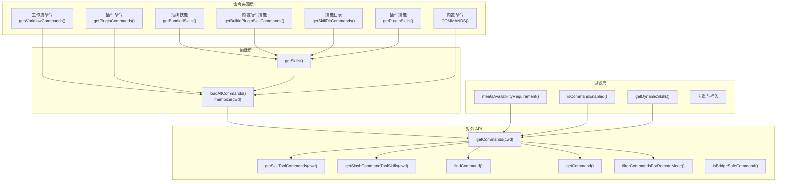
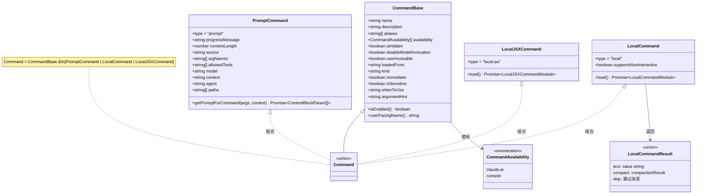
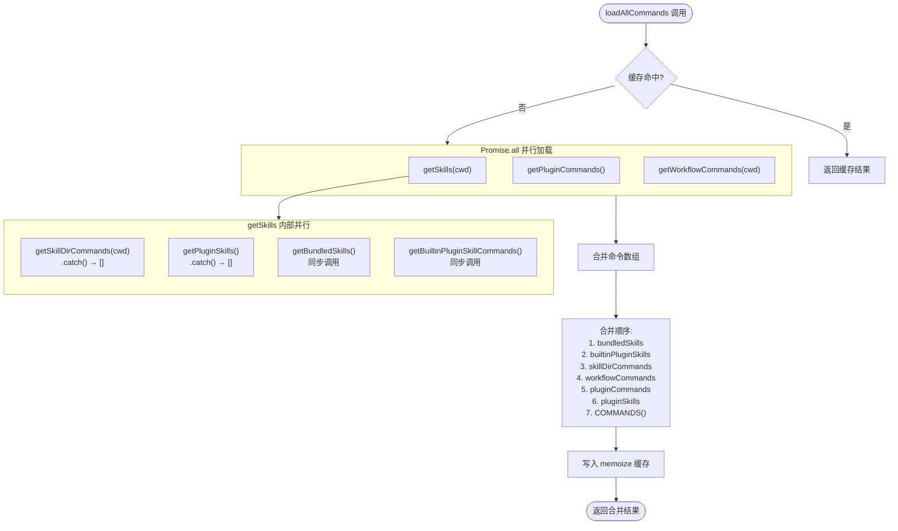
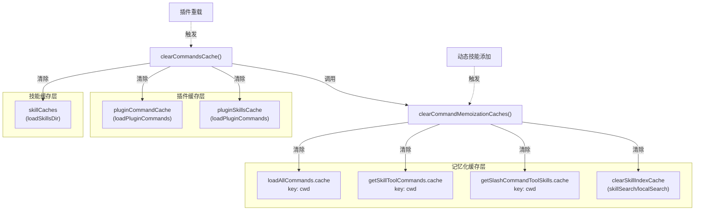

# 命令注册表子模块设计文档

| 文档属性 | 内容 |
|---------|------|
| 模块名称 | 命令注册表 (Command Registry) |
| 源文件 | `src/commands.ts` (754 行) |
| 类型定义 | `src/types/command.ts` (217 行) |
| 所属层级 | L2 - 主启动链 |
| 文档版本 | 1.0 |
| 编写日期 | 2026-04-01 |

---

## 1. 模块概述

### 1.1 模块定位

命令注册表模块 (`commands.ts`) 是 Claude Code 斜杠命令系统的核心枢纽，负责命令的注册、加载、过滤、查找和缓存管理。它将来自七个不同来源的命令统一汇聚为单一命令列表，供 REPL 交互层、工具系统和桥接层使用。

### 1.2 核心职责

1. **命令注册**：通过 `COMMANDS()` 记忆化函数注册约 66 个内置命令
2. **多源加载**：从内置命令、技能目录、插件、工作流、捆绑技能等七个来源并行加载命令
3. **可用性过滤**：根据认证状态 (`availability`) 和功能开关 (`isEnabled`) 双重过滤
4. **安全分级**：维护 `REMOTE_SAFE_COMMANDS` 和 `BRIDGE_SAFE_COMMANDS` 白名单
5. **缓存管理**：多层记忆化缓存及其精细化失效策略
6. **命令查找**：提供 `findCommand`、`hasCommand`、`getCommand` 等查询 API

### 1.3 设计约束

- 命令注册延迟到首次 `getCommands()` 调用时执行，避免模块初始化阶段读取配置
- `meetsAvailabilityRequirement()` 不做记忆化，因认证状态可在会话中变更（如执行 `/login` 后）
- 特性开关 (`feature()`) 在编译期通过死代码消除 (DCE) 移除未启用的命令导入
- 内部命令 (`INTERNAL_ONLY_COMMANDS`) 仅在 `USER_TYPE === 'ant'` 且非演示模式时注册

---

## 2. 模块架构

### 2.1 整体架构图



### 2.2 Command 类型层次图



---

## 3. 核心数据结构

### 3.1 Command 联合类型

`Command` 类型定义于 `types/command.ts:205-206`，是基础属性 `CommandBase` 与三种命令变体的交叉联合类型：

```typescript
type Command = CommandBase & (PromptCommand | LocalCommand | LocalJSXCommand)
```

| 变体 | `type` 值 | 执行方式 | 典型用途 |
|------|-----------|---------|---------|
| `PromptCommand` | `"prompt"` | 生成提示文本注入模型上下文 | 技能、工作流 |
| `LocalCommand` | `"local"` | 本地异步执行，返回文本结果 | compact、clear |
| `LocalJSXCommand` | `"local-jsx"` | 渲染 Ink JSX UI 组件 | config、mcp、session |

### 3.2 CommandBase 关键字段

| 字段 | 类型 | 默认值 | 用途 | 定义位置 |
|------|------|--------|------|----------|
| `name` | `string` | 必填 | 命令主名称，即 `/name` | `types/command.ts:183` |
| `aliases` | `string[]` | `undefined` | 别名列表 | `types/command.ts:184` |
| `availability` | `CommandAvailability[]` | `undefined` | 认证/服务商准入要求 | `types/command.ts:176` |
| `isEnabled` | `() => boolean` | `() => true` | 功能开关判定 | `types/command.ts:180` |
| `isHidden` | `boolean` | `false` | 是否对用户隐藏 | `types/command.ts:182` |
| `loadedFrom` | `string` | `undefined` | 命令来源标识 | `types/command.ts:191-197` |
| `disableModelInvocation` | `boolean` | `false` | 禁止模型主动调用 | `types/command.ts:189` |
| `whenToUse` | `string` | `undefined` | 技能使用场景描述 | `types/command.ts:187` |

### 3.3 常量集合

| 常量 | 类型 | 元素数 | 定义位置 | 用途 |
|------|------|--------|----------|------|
| `INTERNAL_ONLY_COMMANDS` | `Command[]` | 27 | `commands.ts:225-254` | 仅限 Anthropic 内部使用的命令 |
| `REMOTE_SAFE_COMMANDS` | `Set<Command>` | 17 | `commands.ts:619-637` | `--remote` 模式下安全的命令白名单 |
| `BRIDGE_SAFE_COMMANDS` | `Set<Command>` | 6 | `commands.ts:651-660` | 桥接模式下可执行的 `local` 类型命令白名单 |

---

## 4. 核心流程

### 4.1 命令加载并行流程

`loadAllCommands()` 函数（`commands.ts:449-469`）通过 `Promise.all` 并行加载三组命令来源，并按优先级合并。



### 4.2 getCommands() 主查询流程

`getCommands()` 函数（`commands.ts:476-517`）是对外暴露的主要 API，每次调用都会重新执行过滤逻辑：

1. 调用 `loadAllCommands(cwd)` 获取所有命令（已记忆化）
2. 调用 `getDynamicSkills()` 获取运行时动态发现的技能
3. 对所有命令执行 `meetsAvailabilityRequirement()` + `isCommandEnabled()` 双重过滤
4. 将动态技能与基础命令去重
5. 将不重复的动态技能插入到第一个内置命令之前

### 4.3 可用性过滤逻辑

`meetsAvailabilityRequirement()` 函数（`commands.ts:417-443`）实现认证/服务商级别的准入过滤：

| `availability` 值 | 匹配条件 |
|-------------------|---------|
| 无 (`undefined`) | 所有用户可用 |
| `'claude-ai'` | `isClaudeAISubscriber()` 返回 `true` |
| `'console'` | 非 claude.ai 订阅者 且 非第三方服务 且 为第一方 Anthropic Base URL |

该函数**不做记忆化**（`commands.ts:415` 注释明确说明），因为认证状态可能在会话中途变更。

### 4.4 特性开关条件导入

模块顶部（`commands.ts:59-122`）使用 `feature()` 函数从 `bun:bundle` 进行编译期条件导入，共涉及 18 个特性开关：

| 特性开关 | 控制的命令 | 行号 |
|---------|-----------|------|
| `PROACTIVE` / `KAIROS` | proactive | 63-65 |
| `KAIROS` / `KAIROS_BRIEF` | briefCommand | 67-69 |
| `KAIROS` | assistantCommand | 70-72 |
| `BRIDGE_MODE` | bridge | 73-75 |
| `DAEMON` + `BRIDGE_MODE` | remoteControlServerCommand | 76-79 |
| `VOICE_MODE` | voiceCommand | 80-82 |
| `HISTORY_SNIP` | forceSnip | 83-85 |
| `WORKFLOW_SCRIPTS` | workflowsCmd | 86-90 |
| `CCR_REMOTE_SETUP` | webCmd | 91-95 |
| `EXPERIMENTAL_SKILL_SEARCH` | clearSkillIndexCache | 96-100 |
| `KAIROS_GITHUB_WEBHOOKS` | subscribePr | 101-103 |
| `ULTRAPLAN` | ultraplan | 104-106 |
| `TORCH` | torch | 107 |
| `UDS_INBOX` | peersCmd | 108-112 |
| `FORK_SUBAGENT` | forkCmd | 113-117 |
| `BUDDY` | buddy | 118-122 |
| `MCP_SKILLS` | getMcpSkillCommands 过滤 | 550 |

---

## 5. 缓存管理

### 5.1 缓存架构图



### 5.2 两级缓存失效策略

| 函数 | 清除范围 | 使用场景 | 定义位置 |
|------|---------|---------|----------|
| `clearCommandMemoizationCaches()` | 仅记忆化缓存（4 个） | 动态技能添加后，需要刷新命令列表但保留技能和插件数据 | `commands.ts:523-532` |
| `clearCommandsCache()` | 全部缓存（记忆化 + 插件 + 技能） | 完整重置，如插件重载 `/reload-plugins` | `commands.ts:534-539` |

关键设计点（`commands.ts:527-531`）：`clearSkillIndexCache` 必须在 `clearCommandMemoizationCaches()` 中显式调用，因为 `getSkillIndex` 是构建在 `getSkillToolCommands`/`getCommands` 之上的独立记忆化层。仅清除内层缓存而不清除外层会导致 lodash `memoize` 仍然返回旧的缓存结果。

---

## 6. 对外接口

### 6.1 导出函数

| 函数 | 签名 | 说明 | 行号 |
|------|------|------|------|
| `getCommands` | `(cwd: string) => Promise<Command[]>` | 获取当前用户可用的全部命令 | 476 |
| `findCommand` | `(name: string, commands: Command[]) => Command \| undefined` | 按名称/别名查找命令 | 688 |
| `hasCommand` | `(name: string, commands: Command[]) => boolean` | 判断命令是否存在 | 700 |
| `getCommand` | `(name: string, commands: Command[]) => Command` | 获取命令，不存在则抛 `ReferenceError` | 704 |
| `meetsAvailabilityRequirement` | `(cmd: Command) => boolean` | 检查命令认证准入 | 417 |
| `clearCommandMemoizationCaches` | `() => void` | 清除记忆化缓存 | 523 |
| `clearCommandsCache` | `() => void` | 清除全部缓存 | 534 |
| `getMcpSkillCommands` | `(mcpCommands: readonly Command[]) => readonly Command[]` | 过滤 MCP 技能命令 | 547 |
| `getSkillToolCommands` | `(cwd: string) => Promise<Command[]>` | 获取模型可调用的技能命令 | 563 |
| `getSlashCommandToolSkills` | `(cwd: string) => Promise<Command[]>` | 获取斜杠命令选择器中的技能 | 586 |
| `isBridgeSafeCommand` | `(cmd: Command) => boolean` | 判断命令是否桥接安全 | 672 |
| `filterCommandsForRemoteMode` | `(commands: Command[]) => Command[]` | 过滤远程模式安全命令 | 684 |
| `formatDescriptionWithSource` | `(cmd: Command) => string` | 格式化命令描述（含来源标注） | 728 |

### 6.2 导出常量

| 常量 | 类型 | 说明 | 行号 |
|------|------|------|------|
| `INTERNAL_ONLY_COMMANDS` | `Command[]` | 内部专用命令列表 | 225 |
| `REMOTE_SAFE_COMMANDS` | `Set<Command>` | 远程模式安全命令集 | 619 |
| `BRIDGE_SAFE_COMMANDS` | `Set<Command>` | 桥接模式安全命令集 | 651 |
| `builtInCommandNames` | `() => Set<string>` | 内置命令名称集（含别名） | 348 |

### 6.3 类型重导出

模块从 `types/command.js` 重导出以下类型（`commands.ts:212-222`）：

- `Command`, `CommandBase`, `CommandResultDisplay`
- `LocalCommandResult`, `LocalJSXCommandContext`
- `PromptCommand`, `ResumeEntrypoint`
- `getCommandName`, `isCommandEnabled`

---

## 7. 命令安全分级

### 7.1 安全模型

命令系统采用白名单安全模型，对远程和桥接两种场景分别维护允许列表：

| 场景 | 白名单 | 判定函数 | 默认行为 |
|------|--------|---------|---------|
| `--remote` 远程模式 | `REMOTE_SAFE_COMMANDS` (17个) | `filterCommandsForRemoteMode()` | 未在白名单中的命令被移除 |
| 桥接模式（移动端/Web） | `BRIDGE_SAFE_COMMANDS` (6个) | `isBridgeSafeCommand()` | `local-jsx` 类型全部阻止；`prompt` 类型全部允许；`local` 类型需在白名单中 |

### 7.2 桥接安全判定逻辑

`isBridgeSafeCommand()` 函数（`commands.ts:672-676`）的三条规则：

1. `local-jsx` 类型 -> 始终阻止（会渲染 Ink UI，远程端无法显示）
2. `prompt` 类型 -> 始终允许（展开为文本，天然安全）
3. `local` 类型 -> 查阅 `BRIDGE_SAFE_COMMANDS` 白名单

此设计源于 PR #19134 的修复（`commands.ts:668-670` 注释），避免 `/model` 等命令在 iOS 端触发本地 Ink 选择器。

---

## 8. 错误处理策略

### 8.1 容错设计

模块采用**分级容错**策略，确保单个命令源的失败不会影响整体系统：

| 位置 | 容错方式 | 降级行为 | 行号 |
|------|---------|---------|------|
| `getSkills()` 内 `getSkillDirCommands()` | `.catch()` 独立捕获 | 记录错误，返回空数组 | 361-365 |
| `getSkills()` 内 `getPluginSkills()` | `.catch()` 独立捕获 | 记录错误，返回空数组 | 368-372 |
| `getSkills()` 外层 | `try-catch` 全局兜底 | 记录错误，返回四个空数组 | 387-397 |
| `getSlashCommandToolSkills()` | `try-catch` 全局捕获 | 记录错误，返回空数组 | 600-607 |
| `getCommand()` | 主动抛出 `ReferenceError` | 包含所有可用命令名（含别名）的错误信息 | 707-715 |

### 8.2 错误信息丰富度

`getCommand()` 抛出的 `ReferenceError`（`commands.ts:707-716`）会列出所有可用命令名（含别名），并按字母排序，便于调试。示例格式：

```
Command foo not found. Available commands: add-dir, agents, branch (aliases: br), ...
```

---

## 9. 懒加载与性能优化

### 9.1 记忆化策略

| 函数 | 记忆化方式 | 缓存键 | 说明 |
|------|-----------|--------|------|
| `COMMANDS()` | `lodash/memoize` | 无参数（单值） | 内置命令列表延迟构建，避免模块初始化时读取配置 |
| `builtInCommandNames()` | `lodash/memoize` | 无参数（单值） | 内置命令名称集合 |
| `loadAllCommands(cwd)` | `lodash/memoize` | `cwd` | 跨多来源命令加载开销大（磁盘 I/O、动态导入） |
| `getSkillToolCommands(cwd)` | `lodash/memoize` | `cwd` | 模型可调用技能列表 |
| `getSlashCommandToolSkills(cwd)` | `lodash/memoize` | `cwd` | 斜杠命令选择器技能列表 |

### 9.2 懒加载实例

`usageReport` 命令（`commands.ts:188-202`）是懒加载的典型案例。`insights.ts` 模块约 113KB（3200 行），包含 `diffLines` 和 HTML 渲染逻辑。通过创建一个 shim 命令对象，将实际模块延迟到用户执行 `/insights` 时才通过 `await import()` 加载。

### 9.3 命令查找性能

`findCommand()` 函数（`commands.ts:688-698`）采用线性搜索，逐个比对 `name`、`getCommandName()` 和 `aliases`。由于命令列表规模有限（约 100 个），线性搜索的 O(n) 复杂度已足够。

---

## 10. 设计评审

### 10.1 设计优势

| 方面 | 评价 | 依据 |
|------|------|------|
| **多源统一** | 七个命令来源通过 `loadAllCommands()` 统一汇聚，上层消费者无需关心来源差异 | `commands.ts:449-469` |
| **双重过滤** | `availability`（认证准入）与 `isEnabled`（功能开关）正交分离，职责清晰 | `commands.ts:417-443`, `types/command.ts:157-167` |
| **精细化缓存** | 两级缓存失效 (`clearCommandMemoizationCaches` vs `clearCommandsCache`) 避免不必要的重加载 | `commands.ts:523-539` |
| **容错隔离** | 各命令源独立 `.catch()`，单个源失败不影响其他命令的加载 | `commands.ts:361-372` |
| **编译期优化** | 通过 `feature()` + DCE 在构建时移除未启用功能的代码，减小产物体积 | `commands.ts:59-122` |
| **白名单安全** | 远程和桥接模式采用显式白名单而非黑名单，默认拒绝更安全 | `commands.ts:619-676` |

### 10.2 潜在风险

| 风险 | 说明 | 相关代码 |
|------|------|---------|
| **线性查找** | `findCommand()` 为 O(n) 线性扫描，若命令数量大幅增长可能成为瓶颈 | `commands.ts:688-698` |
| **记忆化键粒度** | `loadAllCommands` 以 `cwd` 为键，若同一 `cwd` 下技能文件变更需手动清缓存 | `commands.ts:449` |
| **合并顺序隐式** | 七个来源的合并顺序通过数组展开顺序隐式定义，缺乏显式优先级文档 | `commands.ts:460-468` |
| **动态技能插入位置** | 动态技能插入到第一个内置命令之前的逻辑依赖 `COMMANDS()` 名称匹配，若内置命令全部被过滤掉则退化为追加到末尾 | `commands.ts:505-516` |
| **引用相等比较** | `REMOTE_SAFE_COMMANDS` 和 `BRIDGE_SAFE_COMMANDS` 使用 `Set<Command>` 通过引用相等判定，无法匹配动态创建的同名命令 | `commands.ts:619-660` |

### 10.3 与上下游模块的关系

| 方向 | 模块 | 交互方式 |
|------|------|---------|
| 上游依赖 | `skills/loadSkillsDir.js` | 技能目录命令加载与动态技能获取 |
| 上游依赖 | `skills/bundledSkills.js` | 捆绑技能获取 |
| 上游依赖 | `plugins/builtinPlugins.js` | 内置插件技能获取 |
| 上游依赖 | `utils/plugins/loadPluginCommands.js` | 插件命令与技能加载、缓存清除 |
| 上游依赖 | `tools/WorkflowTool/createWorkflowCommand.js` | 工作流命令创建 |
| 上游依赖 | `utils/auth.js` | 认证状态查询 |
| 上游依赖 | `utils/model/providers.js` | 服务商基础 URL 判定 |
| 上游依赖 | `types/command.js` | 类型定义和辅助函数 |
| 下游消费 | `main.tsx` (REPL) | 调用 `getCommands()` 获取可用命令列表 |
| 下游消费 | 工具系统 (SkillTool) | 调用 `getSkillToolCommands()` 获取模型可调用技能 |
| 下游消费 | 桥接层 (bridge) | 调用 `isBridgeSafeCommand()` 判定命令安全性 |
| 下游消费 | 远程模式 | 调用 `filterCommandsForRemoteMode()` 过滤命令 |

### 10.4 CMMI3 过程改进建议

1. **可追溯性**：建议为每个命令来源标记优先级数值（而非依赖数组展开顺序），在合并冲突时提供确定性的覆盖行为
2. **性能监控**：`loadAllCommands()` 的首次加载可能涉及大量磁盘 I/O，建议添加加载耗时的度量指标
3. **测试覆盖**：`meetsAvailabilityRequirement()` 的 `console` 分支条件较复杂（三个布尔条件的与），应确保对所有边界组合有测试用例
4. **缓存一致性**：记忆化层之间的依赖关系（`getSkillIndex` 依赖 `getSkillToolCommands`）应通过文档或代码注释形式化记录，避免后续维护者遗漏清除链
