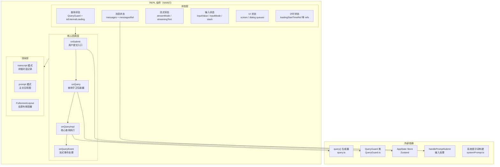
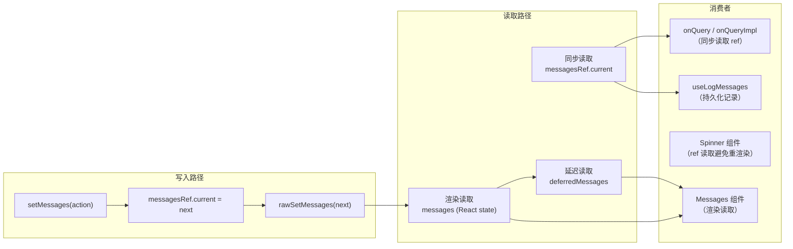
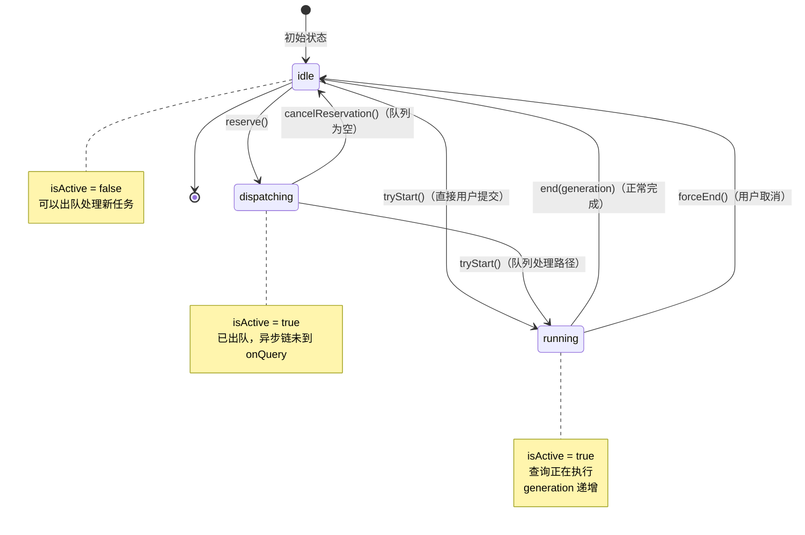
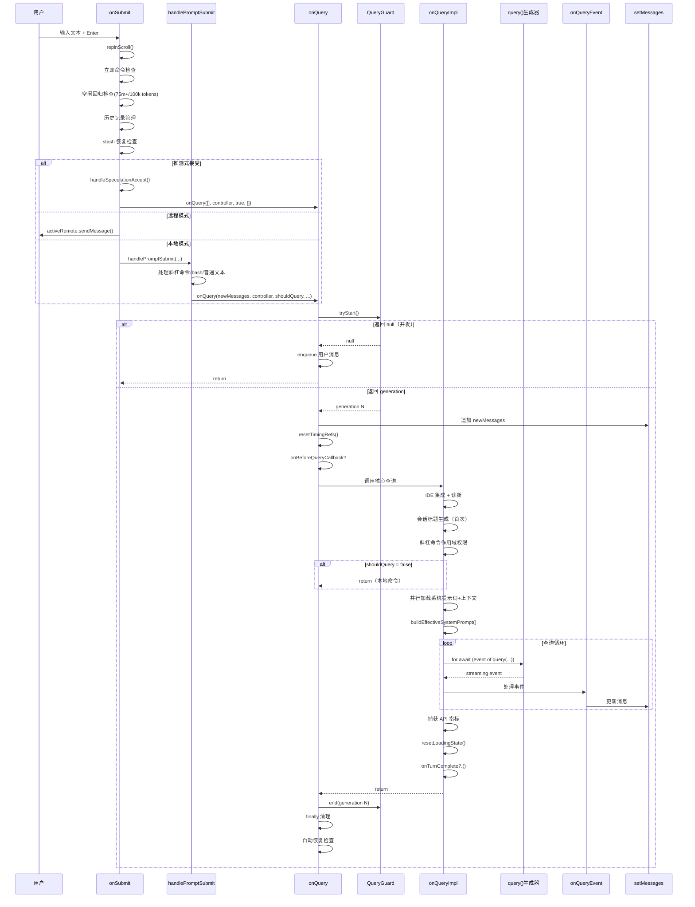
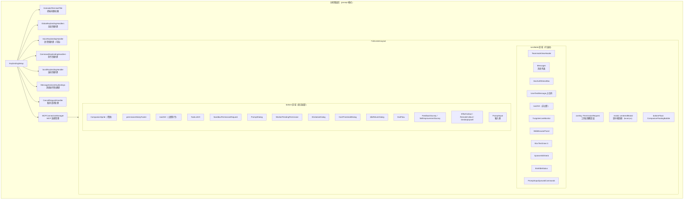

# 主交互界面（REPL）子模块设计

> **模块路径**: `src/screens/REPL.tsx`（5005行）
> **设计层级**: CMMI3 L2层子模块设计
> **版本**: 2.1.88
> **最后更新**: 2026-04-01

---

## 1. 模块概述

### 1.1 模块定位

`REPL.tsx` 是 Claude Code 的**主交互界面组件**，承担整个 CLI 应用的核心交互职责。作为全应用最大的单一组件（5005行），它是用户与 Claude 模型之间所有交互的中枢控制器——管理对话消息流、查询生命周期、工具权限授权、流式响应展示、远程/本地会话切换以及终端 UI 渲染。

### 1.2 设计目标

| 目标 | 说明 |
|------|------|
| 单一入口 | 全部交互状态在 REPL 组件内集中管理，避免状态分散 |
| 并发安全 | 通过 QueryGuard 状态机保证查询生命周期的原子性 |
| 低延迟 UI | 采用 ref 同步模式、useDeferredValue、流式增量更新保持输入响应性 |
| 多模式支持 | 统一本地查询、远程会话(CCR)、直连(connect)、SSH 四种运行模式 |
| 可扩展性 | 通过 Props 注入 commands/tools/mcpClients，支持插件和 MCP 扩展 |

### 1.3 职责范围

```
REPL 组件职责边界
├── 查询生命周期管理（onSubmit → onQuery → onQueryImpl）
├── 消息状态管理（messages + messagesRef 同步模式）
├── 并发控制（QueryGuard 三态状态机）
├── 流式响应处理（streaming text / tool uses / thinking）
├── 权限对话管理（工具审批队列、沙箱权限、MCP Elicitation）
├── UI 布局编排（FullscreenLayout + 条件渲染）
├── 会话管理（resume/fork/background/switch）
├── 远程模式桥接（Remote/DirectConnect/SSH）
├── 功能开关集成（15+ feature flags）
└── 外围集成（IDE、语音、分析、通知等 20+ hooks）
```

---

## 2. 模块架构

### 2.1 架构总览图



### 2.2 导出接口

| 导出项 | 类型 | 行号 | 说明 |
|--------|------|------|------|
| `Props` | type | 526-570 | 24+ 字段的组件属性类型 |
| `Screen` | type | 571 | `'prompt' \| 'transcript'` 视图模式 |
| `REPL` | function component | 572-5005 | 主交互界面组件 |

### 2.3 Props 接口设计

```typescript
// file: src/screens/REPL.tsx, lines 526-570
export type Props = {
  // --- 核心配置 ---
  commands: Command[];                    // 斜杠命令列表
  debug: boolean;                         // 调试模式
  initialTools: Tool[];                   // 初始工具集
  thinkingConfig: ThinkingConfig;         // 思考配置

  // --- 会话恢复 ---
  initialMessages?: MessageType[];        // 恢复的消息历史
  pendingHookMessages?: Promise<HookResultMessage[]>;  // 延迟钩子消息
  initialFileHistorySnapshots?: FileHistorySnapshot[];
  initialContentReplacements?: ContentReplacementRecord[];
  initialAgentName?: string;
  initialAgentColor?: AgentColorName;

  // --- MCP 配置 ---
  mcpClients?: MCPServerConnection[];
  dynamicMcpConfig?: Record<string, ScopedMcpServerConfig>;
  strictMcpConfig?: boolean;

  // --- 生命周期回调 ---
  onBeforeQuery?: (input: string, newMessages: MessageType[]) => Promise<boolean>;
  onTurnComplete?: (messages: MessageType[]) => void | Promise<void>;

  // --- 运行模式 ---
  remoteSessionConfig?: RemoteSessionConfig;   // 远程模式(CCR)
  directConnectConfig?: DirectConnectConfig;   // 直连模式
  sshSession?: SSHSession;                     // SSH 模式

  // --- UI 控制 ---
  disabled?: boolean;
  disableSlashCommands?: boolean;
  systemPrompt?: string;
  appendSystemPrompt?: string;
  taskListId?: string;
  mainThreadAgentDefinition?: AgentDefinition;
  autoConnectIdeFlag?: boolean;
};
```

---

## 3. 核心数据结构

### 3.1 状态分类总览

REPL 组件内维护了约 **60+ 个状态变量**，按职责分为六大类：

#### 3.1.1 查询状态（lines 895-973）

| 状态变量 | 类型 | 存储方式 | 用途 |
|----------|------|----------|------|
| `queryGuard` | `QueryGuard` | `useRef` | 查询生命周期状态机（唯一实例） |
| `isQueryActive` | `boolean` | `useSyncExternalStore` | 订阅 queryGuard 的活跃状态 |
| `isExternalLoading` | `boolean` | `useState` | 远程/后台任务加载标志 |
| `isLoading` | `boolean` | 派生值 | `isQueryActive \|\| isExternalLoading` |
| `loadingStartTimeRef` | `Ref<number>` | `useRef` | 加载开始时间戳 |
| `totalPausedMsRef` | `Ref<number>` | `useRef` | 累计暂停毫秒数 |
| `pauseStartTimeRef` | `Ref<number\|null>` | `useRef` | 当前暂停开始时间 |

#### 3.1.2 消息状态（lines 1182-1222）

| 状态变量 | 类型 | 存储方式 | 用途 |
|----------|------|----------|------|
| `messages` | `MessageType[]` | `useState` | 主对话消息数组（React 渲染投影） |
| `messagesRef` | `Ref<MessageType[]>` | `useRef` | 消息数组同步镜像（真实数据源） |
| `deferredMessages` | `MessageType[]` | `useDeferredValue` | 延迟版消息（保持输入响应性） |
| `frozenTranscriptState` | 长度快照 | `useState` | transcript 模式冻结状态 |

#### 3.1.3 流式状态（lines 838-865, 1461-1473）

| 状态变量 | 类型 | 存储方式 | 用途 |
|----------|------|----------|------|
| `streamMode` | `SpinnerMode` | `useState` | `'responding'\|'thinking'\|'tool-use'` |
| `streamingToolUses` | `StreamingToolUse[]` | `useState` | 正在流式传输的工具调用 |
| `streamingThinking` | `StreamingThinking\|null` | `useState` | 正在流式传输的思考块 |
| `streamingText` | `string\|null` | `useState` | 正在流式传输的文本内容 |
| `responseLengthRef` | `Ref<number>` | `useRef` | 响应字符长度（避免重渲染） |
| `apiMetricsRef` | `Ref<Array<...>>` | `useRef` | API 性能指标（TTFT/OTPS） |

#### 3.1.4 输入状态（lines 1331-1424）

| 状态变量 | 类型 | 存储方式 | 用途 |
|----------|------|----------|------|
| `inputValue` | `string` | `useState` | 当前输入框文本 |
| `inputValueRef` | `Ref<string>` | `useRef` | 输入值同步镜像 |
| `inputMode` | `PromptInputMode` | `useState` | `'prompt'\|'bash'` |
| `stashedPrompt` | 对象 | `useState` | 暂存的提示词（命令执行时保留） |
| `pastedContents` | `Record` | `useState` | 粘贴内容记录 |
| `inProgressToolUseIDs` | `Set<string>` | `useState` | 进行中的工具调用 ID 集合 |

#### 3.1.5 对话框队列状态（lines 1101-1116）

| 状态变量 | 类型 | 用途 |
|----------|------|------|
| `toolUseConfirmQueue` | `ToolUseConfirm[]` | 工具使用审批队列 |
| `sandboxPermissionRequestQueue` | `Array<{hostPattern, resolvePromise}>` | 沙箱网络权限请求队列 |
| `promptQueue` | `Array<{request, resolve, reject}>` | Hook 提示对话框队列 |

#### 3.1.6 UI 显示状态（lines 703-741）

| 状态变量 | 类型 | 用途 |
|----------|------|------|
| `screen` | `Screen` | 当前视图模式 |
| `showAllInTranscript` | `boolean` | transcript 模式是否展示全部 |
| `dumpMode` | `boolean` | 转储到终端滚回缓冲区模式 |
| `toolJSX` | 对象\|null | 当前工具/命令渲染的 JSX |
| `ideSelection` | `IDESelection\|undefined` | IDE 选中内容 |
| `isMessageSelectorVisible` | `boolean` | 消息选择器是否可见 |

### 3.2 消息状态数据流图



**关键设计模式 — Ref-Synchronized State（Zustand 模式）**：

`setMessages` 回调（line 1198-1222）实现了一个关键的状态同步机制：先将 updater 函数应用到 `messagesRef.current`（立即同步），然后将计算结果传给 `rawSetMessages`（React 异步批处理）。这保证了：
- 回调内通过 `messagesRef.current` 读取的值始终是最新的
- React 的批处理变成了"最后写入胜出"语义
- `onQuery` 的 `try` 块中可以立即读取刚追加的消息

---

## 4. QueryGuard 状态机设计

### 4.1 状态机定义

`QueryGuard`（file: `src/utils/QueryGuard.ts`，122行）是查询生命周期的核心并发控制器，基于同步状态机和代数（generation number）实现无锁安全。



### 4.2 操作语义

| 操作 | 前置状态 | 后置状态 | 返回值 | 调用位置 |
|------|----------|----------|--------|----------|
| `reserve()` | idle | dispatching | `true` | `useQueueProcessor` 出队前 |
| `reserve()` | dispatching/running | 不变 | `false` | 被拒绝 |
| `cancelReservation()` | dispatching | idle | void | 队列为空时回退 |
| `tryStart()` | idle/dispatching | running | generation号 | `onQuery` 开头（line 2869） |
| `tryStart()` | running | 不变 | `null`（并发检测） | 并发查询被拒绝 |
| `end(gen)` | running（gen匹配） | idle | `true` | `onQuery` finally（line 2923） |
| `end(gen)` | gen不匹配 | 不变 | `false` | 过期 finally 块跳过清理 |
| `forceEnd()` | 任意非idle | idle | void | `onCancel` 用户取消 |

### 4.3 React 集成

```typescript
// file: src/screens/REPL.tsx, lines 900-904
const queryGuard = React.useRef(new QueryGuard()).current;
const isQueryActive = React.useSyncExternalStore(
  queryGuard.subscribe,    // 基于 createSignal 的订阅
  queryGuard.getSnapshot   // () => this._status !== 'idle'
);
```

`useSyncExternalStore` 保证了：
- 状态变更同步通知 React（无批处理延迟）
- 服务端渲染安全（snapshot 一致性）
- 无 tearing 问题（并发模式兼容）

### 4.4 Generation 防护机制

Generation 号解决了"取消-重提交"竞态：

1. 用户取消查询 A → `forceEnd()` 将 generation 从 N 递增到 N+1
2. 用户提交查询 B → `tryStart()` 将 generation 递增到 N+2
3. 查询 A 的 `finally` 块异步执行 → `end(N)` 发现 generation 不匹配 → 返回 `false` → 跳过清理
4. 查询 B 正常完成 → `end(N+2)` 匹配 → 执行清理

---

## 5. 查询管道设计

### 5.1 查询管道时序图



### 5.2 onSubmit 详细流程（lines 3142-3540）

`onSubmit` 是用户输入的统一入口，处理以下场景：

**阶段 1 — 预处理**（lines 3148-3282）：
1. `repinScroll()` — 将滚动位置钉到底部
2. 恢复循环模式（如果暂停）
3. **立即命令检查** — 当 `queryGuard.isActive` 时，标记为 `immediate: true` 的斜杠命令（如 `/btw`、`/config`）可以在查询进行中执行，不进入队列

**阶段 2 — 空闲回归**（lines 3289-3310）：
- 条件：距上次查询 >= 75分钟 且 总输入 token >= 100k
- `willowMode === 'dialog'`：弹出 `IdleReturnDialog`，建议用户 `/clear`
- `willowMode === 'hint'`：显示通知提示

**阶段 3 — 状态管理**（lines 3312-3389）：
- 历史记录写入（`addToHistory`）
- stash 恢复（非斜杠命令 + 非加载中时立即恢复）
- 占位符显示（`setUserInputOnProcessing`）
- 归属追踪（`incrementPromptCount`）

**阶段 4 — 分发**（lines 3391-3532）：
- **推测式接受**：调用 `handleSpeculationAccept`，若需查询则触发 `onQuery`
- **远程模式**：构建 `ContentBlockParam[]`，通过 WebSocket 发送
- **本地模式**：等待 `awaitPendingHooks()`，然后调用 `handlePromptSubmit`

### 5.3 onQuery 守卫层（lines 2855-3024）

`onQuery` 是 `onQueryImpl` 的安全包装器，核心职责：

1. **Swarm 活跃标记** — `setMemberActive(teamName, agentName, true)`
2. **并发守卫** — `queryGuard.tryStart()`，返回 null 则将用户消息入队
3. **消息追加** — `setMessages(old => [...old, ...newMessages])`
4. **指标重置** — 清空 `responseLengthRef`、`apiMetricsRef`
5. **Token 预算** — `snapshotOutputTokensForTurn()`
6. **前置回调** — `onBeforeQueryCallback`（可阻止查询继续）
7. **调用 onQueryImpl** — 执行实际查询
8. **Finally 块**:
   - `queryGuard.end(generation)` — 检查 generation 匹配
   - `resetLoadingState()` — 重置所有加载 UI
   - `sendBridgeResultRef.current()` — 通知 bridge 客户端
   - 轮次持续时间消息（> 30s 时显示）
   - **自动恢复** — 若用户在无响应时取消，回滚消息并恢复提示词

### 5.4 onQueryImpl 核心执行（lines 2661-2854）

`onQueryImpl` 是查询执行的核心逻辑：

**步骤 1 — IDE 准备**（lines 2665-2672）：
- 从 store 获取最新 `mcpClients`（避免闭包捕获过期值）
- 关闭已打开的 diff 视图

**步骤 2 — 会话标题**（lines 2684-2699）：
- 一次性 Haiku 模型调用生成终端标签标题
- 通过 `haikuTitleAttemptedRef` 防止重复调用
- 跳过合成消息（斜杠命令输出、bash 输入标签）

**步骤 3 — 权限作用域**（lines 2700-2726）：
- 将技能 frontmatter 中的 `allowedTools` 写入 store
- 在 `shouldQuery=false` 门控之前执行（forked agent 需要读取）

**步骤 4 — 上下文并行加载**（lines 2768-2780）：
```typescript
const [,, defaultSystemPrompt, baseUserContext, systemContext] = await Promise.all([
  checkAndDisableBypassPermissionsIfNeeded(...),
  checkAndDisableAutoModeIfNeeded(...),
  getSystemPrompt(freshTools, mainLoopModelParam, ..., freshMcpClients),
  getUserContext(),
  getSystemContext()
]);
```

**步骤 5 — 查询循环**（lines 2793-2803）：
```typescript
for await (const event of query({
  messages, systemPrompt, userContext, systemContext,
  canUseTool, toolUseContext, querySource
})) {
  onQueryEvent(event);
}
```

**步骤 6 — 指标采集**（lines 2814-2846）：
- TTFT（首 token 时间）取 P50
- OTPS（输出 token 每秒）基于 `endResponseLength - responseLengthBaseline`

### 5.5 onQueryEvent 流式事件处理（lines 2584-2660）

`onQueryEvent` 通过 `handleMessageFromStream` 分发事件，处理三类消息写入策略：

| 消息类型 | 写入策略 | 原因 |
|----------|----------|------|
| CompactBoundary | 替换全部消息（全屏模式保留前一轮） | 压缩后重置对话 |
| EphemeralToolProgress | 替换最后一条同类消息 | 避免数组膨胀（Sleep 每秒一条） |
| 其他消息 | 追加 | 正常流式增长 |

额外更新：
- `setResponseLength` — 更新响应长度（驱动 Spinner 动画和 OTPS 计算）
- `setStreamMode` — 切换流式模式（responding/thinking/tool-use）
- `setStreamingToolUses` — 更新工具调用可视化
- `setStreamingThinking` — 更新思考块显示
- API 指标记录（`apiMetricsRef.push`）

---

## 6. 组件渲染树设计

### 6.1 渲染树结构图



### 6.2 视图模式分支

REPL 有两种视图模式，在渲染函数中通过**提前返回**实现分支：

| 模式 | 条件 | 说明 | 行号 |
|------|------|------|------|
| `transcript` | `screen === 'transcript'` | 详细对话记录视图，冻结消息快照，支持搜索 | ~4400-4489 |
| `prompt` | 默认 | 主交互视图，包含完整输入/权限/流式 UI | ~4548-5005 |

**transcript 模式**的特殊设计：
- 使用 `frozenTranscriptState` 记录消息长度，通过 `slice()` 获取冻结快照
- 支持 `/` 搜索（`TranscriptSearchBar`，含索引预热和增量搜索）
- 虚拟滚动模式下包裹在 `AlternateScreen` 中

### 6.3 焦点输入对话框优先级

`focusedInputDialog` 是一个派生值，决定当前哪个对话框获得输入焦点：

```
优先级（从高到低）：
1. 'ultraplan-choice'  — 超级计划选择
2. 'exit'              — 退出确认流程
3. 'ide-onboarding'    — IDE 扩展安装引导
4. 'tool-permission'   — 工具使用审批（overlay 渲染）
5. 'sandbox-permission' — 沙箱网络权限
6. 'prompt'            — Hook 提示对话
7. 'worker-sandbox-permission' — Worker 沙箱权限
8. 'elicitation'       — MCP Elicitation
9. 'cost'              — 费用阈值确认
10. 'idle-return'      — 空闲回归对话
11. 'lsp-recommendation' — LSP 插件推荐
12. 'hint-recommendation' — 插件提示推荐
13. 'desktop-upsell'   — 桌面客户端推荐
14. undefined           — 无对话框，PromptInput 获得焦点
```

---

## 7. 状态管理模式

### 7.1 状态管理模式总览

```mermaid
flowchart TB
    subgraph Pattern1["模式1: Ref 同步状态（Zustand 模式）"]
        direction LR
        P1Write["setMessages(action)"] --> P1Ref["messagesRef.current = next<br/>（立即同步）"]
        P1Ref --> P1React["rawSetMessages(next)<br/>（React 异步批处理）"]
    end

    subgraph Pattern2["模式2: 外部存储订阅"]
        direction LR
        P2Guard["QueryGuard._changed.emit()"] --> P2Sync["useSyncExternalStore"] --> P2Render["React 同步渲染"]
    end

    subgraph Pattern3["模式3: 计时 Ref（避免重渲染）"]
        direction LR
        P3Write["loadingStartTimeRef.current = Date.now()"] --> P3Read["SpinnerWithVerb 读取<br/>（动画帧中）"]
    end

    subgraph Pattern4["模式4: 派生加载状态"]
        direction LR
        P4A["isQueryActive"] --> P4Derived["isLoading =<br/>isQueryActive || isExternalLoading"]
        P4B["isExternalLoading"] --> P4Derived
    end

    subgraph Pattern5["模式5: 冻结快照"]
        direction LR
        P5Freeze["setFrozenTranscriptState({<br/>messagesLength, toolUsesLength})"] --> P5Read["messages.slice(0, len)<br/>（廉价视图）"]
    end

    subgraph Pattern6["模式6: Stash 暂存"]
        direction LR
        P6Save["setStashedPrompt({text, cursor, pasted})"] --> P6Restore["恢复输入值<br/>（命令完成后）"]
    end
```



### 7.2 Ref 同步状态的必要性

在 `onQuery` 的 `try` 块中（line 2906）：
```typescript
// messagesRef 在 setMessages 包装器中同步更新，
// 因此它已包含上方追加操作添加的 newMessages。
// 无需重建，无需等待 React 调度器
// （之前每次提示耗时 20-56ms；56ms 的情况是 await 期间 GC 暂停）
const latestMessages = messagesRef.current;
```

如果使用普通 `useState`，在 `setMessages` 后同步读取 `messages` 会得到过期值（React 批处理未提交）。ref 同步模式消除了 20-56ms 的延迟。

### 7.3 isQueryActive 的 inline 重置优化

```typescript
// file: src/screens/REPL.tsx, lines 949-953
const wasQueryActiveRef = React.useRef(false);
if (isQueryActive && !wasQueryActiveRef.current) {
  resetTimingRefs();  // 在第一个观测到 isQueryActive=true 的渲染中重置
}
wasQueryActiveRef.current = isQueryActive;
```

这解决了 INC-4549 问题：`queryGuard.reserve()` 在 `processUserInput` 的第一个 `await` 之前触发，但 `onQuery` 的 `try` 块中的 ref 重置在之后运行。在这个间隙中，React 渲染 Spinner 时 `loadingStartTimeRef=0`，计算出 `elapsedTimeMs = Date.now() - 0 ≈ 56年`。

---

## 8. 功能开关与条件加载

### 8.1 Feature Flags 一览

REPL 组件使用 15+ 个功能开关，通过 `feature()` 编译时常量和条件 `require()` 实现死代码消除：

| Flag | 类型 | 控制范围 |
|------|------|----------|
| `VOICE_MODE` | 编译时 | 语音交互集成（`useVoiceIntegration`） |
| `PROACTIVE` / `KAIROS` | 编译时 | 循环模式、主动提示、助手历史 |
| `COORDINATOR_MODE` | 编译时 | 协调器模式上下文注入 |
| `BUDDY` | 编译时 | 伙伴精灵（`CompanionSprite`） |
| `COMMIT_ATTRIBUTION` | 编译时 | 提交归属追踪 |
| `AWAY_SUMMARY` | 编译时 | 离开摘要功能 |
| `MESSAGE_ACTIONS` | 编译时 | 消息操作快捷键 |
| `WEB_BROWSER_TOOL` | 编译时 | Web 浏览器面板 |
| `TOKEN_BUDGET` | 编译时 | Token 预算控制 |
| `TRANSCRIPT_CLASSIFIER` | 编译时 | 自动模式分类器 |
| `FULLSCREEN` | 运行时 | 全屏布局模式 |
| `BRIDGE_MODE` | 运行时 | 桌面/Web 桥接 |
| `BG_SESSIONS` | 编译时 | 后台会话管理 |
| `AGENT_TRIGGERS` | 编译时 | 定时任务调度 |
| `CONTEXT_COLLAPSE` | 运行时 | 上下文折叠 |
| `HISTORY_SNIP` | 运行时 | 历史剪辑 |

### 8.2 条件导入模式

```typescript
// file: src/screens/REPL.tsx, lines 98-103
// 编译时常量 feature('VOICE_MODE') 使 bundler 消除未使用分支
const useVoiceIntegration = feature('VOICE_MODE')
  ? require('../hooks/useVoiceIntegration.js').useVoiceIntegration
  : () => ({ stripTrailing: () => 0, handleKeyEvent: () => {}, resetAnchor: () => {} });
```

此模式确保：
- 外部构建中不包含内部功能代码
- 运行时零开销（条件在构建时求值）
- 类型安全（通过 `typeof import(...)` 注解）

---

## 9. 错误处理与恢复策略

### 9.1 查询级别错误处理

**try-finally 保护**（lines 2887-3023）：

```
onQuery try-finally 结构:
├── try 块
│   ├── 追加消息
│   ├── 重置计时
│   ├── onBeforeQueryCallback
│   └── await onQueryImpl(...)
└── finally 块
    ├── queryGuard.end(generation) 检查
    │   ├── 匹配 → 执行清理
    │   │   ├── resetLoadingState()
    │   │   ├── sendBridgeResult()
    │   │   ├── 轮次持续时间消息
    │   │   └── setAbortController(null)
    │   └── 不匹配 → 跳过（过期 finally）
    └── 自动恢复检查（在 guard 检查之外）
        ├── 条件: abort reason === 'user-cancel'
        ├── 条件: !queryGuard.isActive（无新查询）
        ├── 条件: inputValueRef.current === ''
        ├── 条件: getCommandQueueLength() === 0
        └── 操作: 回滚消息 + 恢复提示词
```

### 9.2 并发查询检测

当 `tryStart()` 返回 `null` 时（line 2870）：

1. 记录遥测事件 `tengu_concurrent_onquery_detected`
2. 提取非 meta 的用户消息文本
3. 通过 `enqueue()` 将消息加入命令队列
4. 队列处理器在当前查询完成后重试

### 9.3 自动恢复机制

当用户在无响应时取消查询（lines 2998-3022）：

1. 查找最后一条可选择的用户消息
2. 检查其后是否只有合成消息
3. 从历史记录中移除最后一条
4. 调用 `restoreMessageSyncRef.current(lastUserMsg)` 恢复输入

**守护条件**（防止错误恢复）：
- `abortController.signal.reason === 'user-cancel'`（仅用户手动取消）
- `!queryGuard.isActive`（无新查询在进行）
- `inputValueRef.current === ''`（输入框为空）
- `getCommandQueueLength() === 0`（无排队命令）
- `!store.getState().viewingAgentTaskId`（不在队友视图中）

### 9.4 计时 Ref 的 56 年 Bug 修复

问题来源（INC-4549）：`queryGuard.reserve()` 在 `processUserInput` 的第一个 await 前触发，此时 `loadingStartTimeRef.current` 仍为 0。Spinner 计算 `Date.now() - 0` 得到约 56 年。

修复方案（line 949-953）：在 React 渲染阶段检测 `isQueryActive` 的 false->true 转换，立即重置计时 refs。

---

## 10. 设计评估

### 10.1 设计优势

| 方面 | 评价 | 引用 |
|------|------|------|
| 并发安全 | QueryGuard 状态机设计精妙，generation 号防止竞态，`useSyncExternalStore` 保证 React 同步性 | `src/utils/QueryGuard.ts:29-121` |
| 状态一致性 | Ref-Synchronized State 模式消除了 React 批处理的 20-56ms 延迟，保证 `onQuery` 读取最新数据 | `REPL.tsx:1189-1222` |
| 流式性能 | `responseLengthRef` 和 `apiMetricsRef` 使用 Ref 避免每个 text_delta 触发重渲染；`useDeferredValue` 保持输入响应性 | `REPL.tsx:1427, 1318` |
| 渲染隔离 | `AnimatedTerminalTitle` 抽取为独立组件，960ms 动画 tick 不再重渲染整个 REPL 树 | `REPL.tsx:484-519` |
| 错误恢复 | 自动恢复机制在用户取消无响应查询时回滚消息并恢复输入，用户体验流畅 | `REPL.tsx:2998-3022` |
| 内存控制 | 临时进度消息使用原地替换而非追加，防止 Sleep 每秒一条导致的数组膨胀（曾观测到 13k+ 条） | `REPL.tsx:2608-2627` |

### 10.2 设计风险与复杂度

| 风险 | 严重度 | 说明 | 引用 |
|------|--------|------|------|
| 单体规模 | 高 | 5005行的单一组件，60+ 状态变量，维护难度极高 | `REPL.tsx:572-5005` |
| 闭包陷阱 | 中 | 大量 `useCallback` 依赖数组管理，需通过 ref 镜像避免过期闭包 | `REPL.tsx:838-848` (streamModeRef) |
| 对话框优先级 | 中 | `focusedInputDialog` 的 14 级优先级链是隐式的，新增对话框需理解全部层级 | ~line 4100-4200 |
| Feature Flag 爆炸 | 中 | 15+ 个编译时和运行时开关交织在渲染逻辑中，组合测试覆盖困难 | 全文散布 |
| Ref 同步正确性 | 低 | Zustand 模式依赖开发者始终通过 `setMessages` 写入而非直接赋值 `messagesRef` | `REPL.tsx:1198` |

### 10.3 可重构建议

1. **状态域拆分**：将查询状态、流式状态、对话框队列状态抽取为独立的 custom hooks（如 `useQueryLifecycle`、`useStreamState`、`useDialogQueues`），减少 REPL 组件的认知负荷

2. **渲染子树提取**：`bottom` 区域的对话框渲染链（14 个条件分支）可提取为 `DialogStack` 组件，内部管理优先级

3. **对话框优先级显式化**：将 `focusedInputDialog` 的优先级计算从散布的条件检查改为声明式优先级数组

4. **远程模式策略化**：将 `useRemoteSession` / `useDirectConnect` / `useSSHSession` 的三选一统一为策略模式接口

### 10.4 与其他模块的关键依赖

| 依赖模块 | 类型 | 说明 |
|----------|------|------|
| `utils/QueryGuard.ts` | 核心 | 查询并发控制状态机 |
| `query.ts` | 核心 | 查询执行生成器（async generator） |
| `utils/messages.ts` | 核心 | 消息创建/解析/流式处理 |
| `utils/handlePromptSubmit.ts` | 核心 | 输入分类与预处理 |
| `utils/systemPrompt.ts` | 核心 | 系统提示词构建 |
| `components/FullscreenLayout.tsx` | 渲染 | 全屏布局容器 |
| `components/Messages.tsx` | 渲染 | 消息列表渲染 |
| `components/PromptInput/PromptInput.tsx` | 渲染 | 输入框组件 |
| `state/AppState.ts` | 状态 | 全局应用状态（Zustand store） |
| `services/mcp/` | 集成 | MCP 服务器连接与工具调用 |
| `hooks/useReplBridge.ts` | 集成 | 桌面/Web 桥接层 |
| `commands.ts` | 集成 | 斜杠命令注册与调度 |

---

## 附录 A：关键行号索引

| 内容 | 行号范围 |
|------|----------|
| 导入声明 | 1-290 |
| 辅助组件（TranscriptModeFooter, SearchBar, AnimatedTitle） | 311-525 |
| Props 类型定义 | 526-570 |
| REPL 函数签名 | 572-598 |
| 环境变量门控 | 601-608 |
| AppState 订阅 | 618-641 |
| MCP 客户端合并 | 727-728 |
| IDE 集成状态 | 730-741 |
| 流式状态 | 838-865 |
| QueryGuard 与加载状态 | 895-973 |
| 对话框队列 | 1101-1116 |
| 消息状态（Zustand 模式） | 1182-1222 |
| 输入状态 | 1331-1424 |
| Spinner 与加载显示逻辑 | 1672-1685 |
| resume 回调 | 1735-1950 |
| getToolUseContext | ~2350-2500 |
| onQueryEvent | 2584-2660 |
| onQueryImpl | 2661-2854 |
| onQuery | 2855-3024 |
| onSubmit | 3142-3540 |
| Transcript 模式渲染 | ~4400-4489 |
| 主渲染（prompt 模式） | 4548-5005 |

## 附录 B：Hooks 使用统计

REPL 组件内使用了约 **50+ 个 hooks**（含自定义 hooks），按类别：

| 类别 | 数量 | 代表 |
|------|------|------|
| React 基础 | ~15 | `useState`, `useCallback`, `useRef`, `useMemo`, `useEffect`, `useDeferredValue`, `useSyncExternalStore` |
| 通知类 | ~15 | `useRateLimitWarningNotification`, `useMcpConnectivityStatus`, `useModelMigrationNotifications` 等 |
| 功能集成 | ~10 | `useRemoteSession`, `useDirectConnect`, `useSSHSession`, `useIdeSelection`, `useVoiceIntegration` |
| UI 交互 | ~5 | `useTerminalSize`, `useTerminalFocus`, `useInput`, `useSearchInput` |
| 状态管理 | ~5 | `useAppState`, `useSetAppState`, `useAppStateStore`, `useMainLoopModel` |
| 调查/反馈 | ~5 | `useFeedbackSurvey`, `useSkillImprovementSurvey`, `usePostCompactSurvey`, `useMemorySurvey` |
