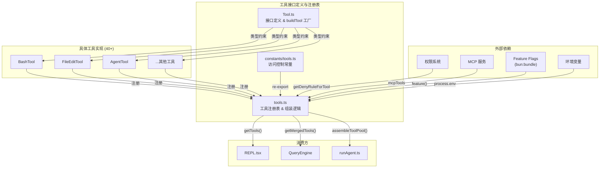
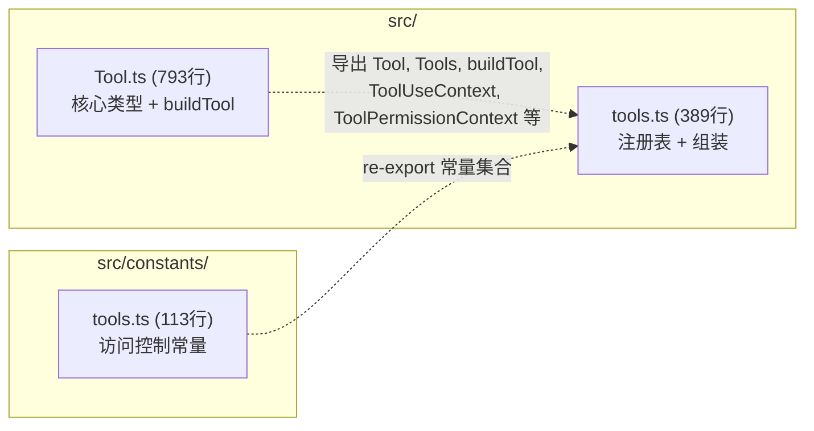
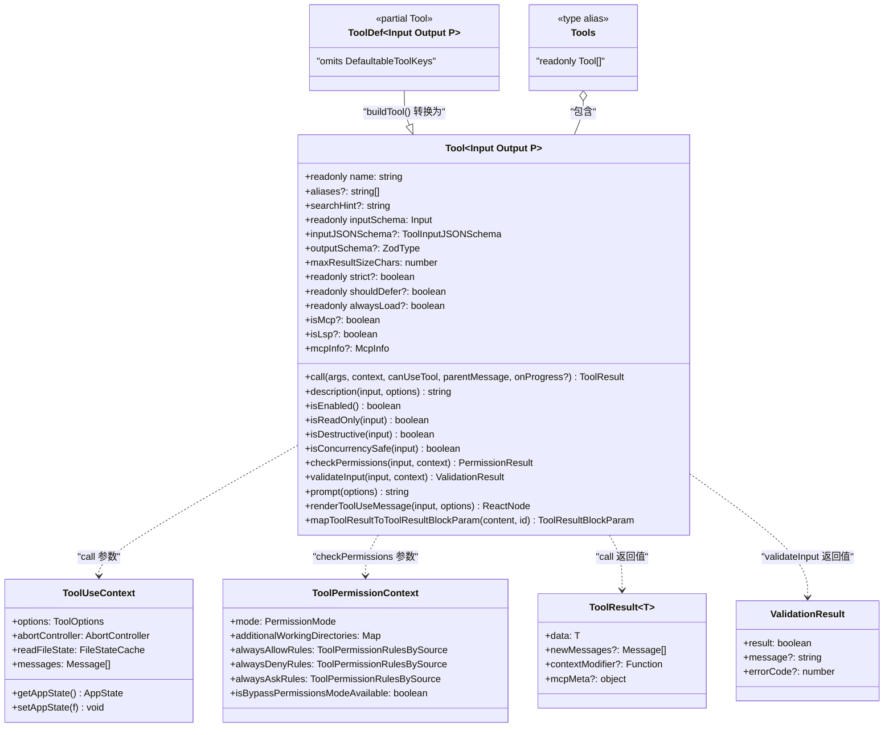
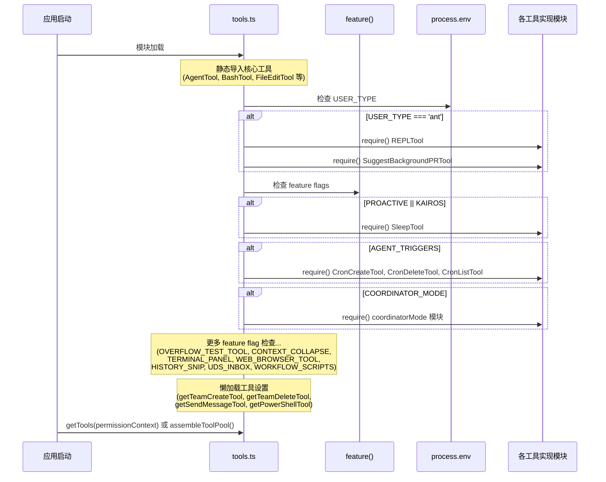
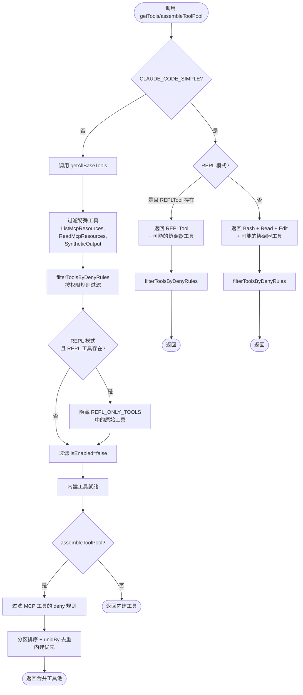
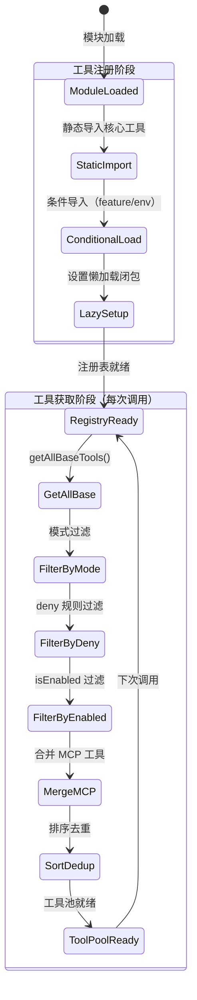

# 工具接口定义与注册表 子模块详细设计文档

## 文档信息
| 项目 | 内容 |
|------|------|
| 模块名称 | 工具接口定义与注册表 (Tool Interface & Registry) |
| 文档版本 | v1.0-20260401 |
| 生成日期 | 2026-04-01 |
| 生成方式 | 代码反向工程 |

## 1. 模块概述

### 1.1 模块职责

本子模块是 Claude Code 工具系统的基础层，负责三大核心职责：

1. **工具接口定义**（`Tool.ts`）：定义所有工具必须遵循的 `Tool` 泛型接口，包含输入校验、权限检查、执行调用、UI 渲染等 30+ 个方法/属性。同时提供 `buildTool` 工厂函数，允许工具定义仅声明差异部分，其余由默认值填充。
2. **工具注册与组装**（`tools.ts`）：汇聚全部 40+ 个内建工具，根据环境变量、feature flag、权限规则动态组装工具池。提供 `getTools`、`assembleToolPool`、`getMergedTools` 等函数，是系统获取可用工具的唯一入口。
3. **工具访问控制常量**（`constants/tools.ts`）：定义 Agent、Coordinator 等不同运行模式下的工具白名单/黑名单集合。

### 1.2 模块边界

**输入**：
- 环境变量（`USER_TYPE`、`CLAUDE_CODE_SIMPLE`、`ENABLE_LSP_TOOL`、`NODE_ENV` 等）
- Feature flag（通过 `bun:bundle` 的 `feature()` 函数获取，如 `PROACTIVE`、`KAIROS`、`COORDINATOR_MODE` 等）
- `ToolPermissionContext`：权限上下文，包含允许/拒绝/询问规则
- MCP 工具列表（来自 MCP 服务器连接）

**输出**：
- `Tool` 类型接口 -- 所有工具的统一类型约束
- `Tools` 类型（`readonly Tool[]`）-- 工具集合类型
- `buildTool()` 函数 -- 工具构造工厂
- `getTools()` / `getAllBaseTools()` / `assembleToolPool()` / `getMergedTools()` -- 工具池获取 API
- 工具过滤常量集合（`ALL_AGENT_DISALLOWED_TOOLS` 等）

**与外部模块的交互**：
| 交互模块 | 交互方式 | 说明 |
|----------|----------|------|
| 各具体工具实现（`tools/*/`） | 导入工具实例 | `tools.ts` 导入 40+ 个工具的单例 |
| 权限系统（`utils/permissions/`） | 调用 `getDenyRuleForTool` | 过滤被拒绝的工具 |
| MCP 服务（`services/mcp/`） | 接收 MCP 工具列表 | `assembleToolPool` 合并 MCP 工具 |
| Coordinator（`coordinator/`） | 查询 `isCoordinatorMode()` | 简单模式下添加协调器工具 |
| 查询引擎 / REPL | 调用 `getTools()` 等函数 | 获取当前会话可用的工具列表 |
| Hook 系统（`hooks/`） | 通过 `ToolUseContext` 传递 | 工具执行时的上下文 |

## 2. 架构设计

### 2.1 模块架构图



### 2.2 源文件组织



### 2.3 外部依赖

| 依赖 | 来源 | 用途 |
|------|------|------|
| `@anthropic-ai/sdk` | npm | `ToolResultBlockParam`, `ToolUseBlockParam` 类型 |
| `@modelcontextprotocol/sdk` | npm | `ElicitRequestURLParams`, `ElicitResult` 类型 |
| `zod/v4` | npm | 输入 schema 的类型系统（`z.ZodType`） |
| `lodash-es/uniqBy` | npm | 工具去重 |
| `bun:bundle` | Bun 运行时 | `feature()` 函数进行 dead code elimination |
| `React` / `Ink` | npm | 渲染类型（`React.ReactNode`） |

## 3. 数据结构设计

### 3.1 核心数据结构

#### 3.1.1 `Tool<Input, Output, P>` 接口（Tool.ts 第362-695行）

这是工具系统的核心泛型接口，包含三个类型参数：
- `Input extends AnyObject`：工具输入的 Zod schema 类型
- `Output`：工具输出类型
- `P extends ToolProgressData`：进度数据类型

| 字段名 | 类型 | 必填 | 说明 |
|--------|------|------|------|
| `name` | `readonly string` | 是 | 工具的主名称，全局唯一 |
| `aliases` | `string[]` | 否 | 向后兼容的别名列表 |
| `searchHint` | `string` | 否 | ToolSearch 关键词匹配短语（3-10词） |
| `inputSchema` | `Input` | 是 | Zod schema 定义输入验证 |
| `inputJSONSchema` | `ToolInputJSONSchema` | 否 | MCP 工具直接使用 JSON Schema |
| `outputSchema` | `z.ZodType<unknown>` | 否 | 输出 schema（可选，TungstenTool 不定义） |
| `maxResultSizeChars` | `number` | 是 | 结果超此大小则持久化到磁盘；`Infinity` 表示不持久化 |
| `strict` | `readonly boolean` | 否 | 启用严格模式（配合 tengu_tool_pear） |
| `shouldDefer` | `readonly boolean` | 否 | 是否延迟加载（需 ToolSearch 触发） |
| `alwaysLoad` | `readonly boolean` | 否 | 是否始终加载（不被 ToolSearch 延迟） |
| `isMcp` | `boolean` | 否 | 是否为 MCP 工具 |
| `isLsp` | `boolean` | 否 | 是否为 LSP 工具 |
| `mcpInfo` | `{ serverName: string; toolName: string }` | 否 | MCP 工具的原始服务器和工具名 |

**核心方法**：

| 方法名 | 签名 | 说明 |
|--------|------|------|
| `call` | `(args, context, canUseTool, parentMessage, onProgress?) => Promise<ToolResult<Output>>` | 执行工具逻辑 |
| `description` | `(input, options) => Promise<string>` | 返回工具描述文本 |
| `isEnabled` | `() => boolean` | 工具是否可用 |
| `isReadOnly` | `(input) => boolean` | 是否只读操作 |
| `isDestructive` | `(input) => boolean` | 是否为不可逆操作 |
| `isConcurrencySafe` | `(input) => boolean` | 是否可并发执行 |
| `checkPermissions` | `(input, context) => Promise<PermissionResult>` | 工具特定的权限检查 |
| `validateInput` | `(input, context) => Promise<ValidationResult>` | 输入验证 |
| `prompt` | `(options) => Promise<string>` | 返回提示词 |
| `userFacingName` | `(input) => string` | 用户可见的名称 |
| `getPath` | `(input) => string` | 获取操作的文件路径 |
| `preparePermissionMatcher` | `(input) => Promise<(pattern: string) => boolean>` | Hook 权限匹配器 |
| `interruptBehavior` | `() => 'cancel' \| 'block'` | 用户中断时的行为 |
| `isSearchOrReadCommand` | `(input) => { isSearch, isRead, isList? }` | 是否为搜索/读取操作 |
| `backfillObservableInput` | `(input) => void` | 为观察者补充输入字段（幂等） |
| `inputsEquivalent` | `(a, b) => boolean` | 判断两次输入是否等价 |
| `isOpenWorld` | `(input) => boolean` | 是否为开放域操作 |
| `requiresUserInteraction` | `() => boolean` | 是否需要用户交互 |

**渲染方法**：

| 方法名 | 签名 | 说明 |
|--------|------|------|
| `renderToolUseMessage` | `(input, options) => ReactNode` | 渲染工具调用消息 |
| `renderToolResultMessage` | `(content, progressMessages, options) => ReactNode` | 渲染工具结果 |
| `renderToolUseProgressMessage` | `(progressMessages, options) => ReactNode` | 渲染进度 |
| `renderToolUseRejectedMessage` | `(input, options) => ReactNode` | 渲染拒绝消息 |
| `renderToolUseErrorMessage` | `(result, options) => ReactNode` | 渲染错误消息 |
| `renderToolUseTag` | `(input) => ReactNode` | 渲染附加标签 |
| `renderToolUseQueuedMessage` | `() => ReactNode` | 渲染排队消息 |
| `renderGroupedToolUse` | `(toolUses, options) => ReactNode \| null` | 分组渲染并行工具调用 |
| `isTransparentWrapper` | `() => boolean` | 是否为透明包装器 |
| `isResultTruncated` | `(output) => boolean` | 结果是否被截断 |
| `getToolUseSummary` | `(input) => string \| null` | 紧凑视图摘要 |
| `getActivityDescription` | `(input) => string \| null` | spinner 活动描述 |
| `extractSearchText` | `(out) => string` | 提取搜索索引文本 |
| `toAutoClassifierInput` | `(input) => unknown` | 安全分类器输入 |
| `mapToolResultToToolResultBlockParam` | `(content, toolUseID) => ToolResultBlockParam` | 结果映射为 API 格式 |
| `userFacingNameBackgroundColor` | `(input) => keyof Theme \| undefined` | 名称背景色 |

#### 3.1.2 `ToolUseContext` 类型（Tool.ts 第158-300行）

工具执行时的完整上下文信息。

| 字段名 | 类型 | 必填 | 说明 |
|--------|------|------|------|
| `options.commands` | `Command[]` | 是 | 可用的斜杠命令 |
| `options.debug` | `boolean` | 是 | 调试模式 |
| `options.mainLoopModel` | `string` | 是 | 主循环模型名称 |
| `options.tools` | `Tools` | 是 | 当前可用工具列表 |
| `options.verbose` | `boolean` | 是 | 详细模式 |
| `options.thinkingConfig` | `ThinkingConfig` | 是 | 思考配置 |
| `options.mcpClients` | `MCPServerConnection[]` | 是 | MCP 服务器连接列表 |
| `options.mcpResources` | `Record<string, ServerResource[]>` | 是 | MCP 资源列表 |
| `options.isNonInteractiveSession` | `boolean` | 是 | 是否非交互会话 |
| `options.agentDefinitions` | `AgentDefinitionsResult` | 是 | Agent 定义 |
| `options.maxBudgetUsd` | `number` | 否 | 最大预算（美元） |
| `options.customSystemPrompt` | `string` | 否 | 自定义系统提示词 |
| `options.appendSystemPrompt` | `string` | 否 | 追加系统提示词 |
| `options.querySource` | `QuerySource` | 否 | 查询来源（分析用） |
| `options.refreshTools` | `() => Tools` | 否 | 工具列表刷新回调 |
| `abortController` | `AbortController` | 是 | 中止控制器 |
| `readFileState` | `FileStateCache` | 是 | 文件状态缓存 |
| `getAppState` | `() => AppState` | 是 | 获取应用状态 |
| `setAppState` | `(f) => void` | 是 | 设置应用状态 |
| `setAppStateForTasks` | `(f) => void` | 否 | 会话级基础设施的状态设置 |
| `handleElicitation` | `(serverName, params, signal) => Promise<ElicitResult>` | 否 | URL 引出处理器 |
| `setToolJSX` | `SetToolJSXFn` | 否 | 设置工具 JSX |
| `addNotification` | `(notif) => void` | 否 | 添加通知 |
| `appendSystemMessage` | `(msg) => void` | 否 | 追加系统消息 |
| `sendOSNotification` | `(opts) => void` | 否 | 发送操作系统通知 |
| `messages` | `Message[]` | 是 | 当前消息列表 |
| `setInProgressToolUseIDs` | `(f) => void` | 是 | 设置进行中的工具 ID |
| `setResponseLength` | `(f) => void` | 是 | 设置响应长度 |
| `updateFileHistoryState` | `(updater) => void` | 是 | 更新文件历史状态 |
| `updateAttributionState` | `(updater) => void` | 是 | 更新归因状态 |
| `agentId` | `AgentId` | 否 | 子 Agent ID |
| `agentType` | `string` | 否 | 子 Agent 类型名 |
| `toolUseId` | `string` | 否 | 工具调用 ID |
| `fileReadingLimits` | `{ maxTokens?, maxSizeBytes? }` | 否 | 文件读取限制 |
| `globLimits` | `{ maxResults? }` | 否 | Glob 结果限制 |
| `toolDecisions` | `Map<string, {...}>` | 否 | 工具决策记录 |
| `queryTracking` | `QueryChainTracking` | 否 | 查询链追踪 |
| `contentReplacementState` | `ContentReplacementState` | 否 | 内容替换状态 |
| `renderedSystemPrompt` | `SystemPrompt` | 否 | 父级渲染后的系统提示词 |

#### 3.1.3 `ToolPermissionContext` 类型（Tool.ts 第123-138行）

| 字段名 | 类型 | 必填 | 说明 |
|--------|------|------|------|
| `mode` | `PermissionMode` | 是 | 权限模式（`'default'` 等） |
| `additionalWorkingDirectories` | `Map<string, AdditionalWorkingDirectory>` | 是 | 额外工作目录 |
| `alwaysAllowRules` | `ToolPermissionRulesBySource` | 是 | 始终允许规则 |
| `alwaysDenyRules` | `ToolPermissionRulesBySource` | 是 | 始终拒绝规则 |
| `alwaysAskRules` | `ToolPermissionRulesBySource` | 是 | 始终询问规则 |
| `isBypassPermissionsModeAvailable` | `boolean` | 是 | 是否可绕过权限模式 |
| `isAutoModeAvailable` | `boolean` | 否 | 是否可用自动模式 |
| `strippedDangerousRules` | `ToolPermissionRulesBySource` | 否 | 被剥离的危险规则 |
| `shouldAvoidPermissionPrompts` | `boolean` | 否 | 是否自动拒绝权限提示 |
| `awaitAutomatedChecksBeforeDialog` | `boolean` | 否 | 是否等待自动化检查 |
| `prePlanMode` | `PermissionMode` | 否 | 计划模式前的权限模式 |

#### 3.1.4 `ToolResult<T>` 类型（Tool.ts 第321-336行）

| 字段名 | 类型 | 必填 | 说明 |
|--------|------|------|------|
| `data` | `T` | 是 | 工具执行结果数据 |
| `newMessages` | `(UserMessage \| AssistantMessage \| AttachmentMessage \| SystemMessage)[]` | 否 | 新增消息 |
| `contextModifier` | `(context: ToolUseContext) => ToolUseContext` | 否 | 上下文修改器（仅非并发安全工具） |
| `mcpMeta` | `{ _meta?, structuredContent? }` | 否 | MCP 协议元数据 |

#### 3.1.5 `ValidationResult` 类型（Tool.ts 第95-101行）

| 变体 | 字段 | 说明 |
|------|------|------|
| 成功 | `{ result: true }` | 验证通过 |
| 失败 | `{ result: false, message: string, errorCode: number }` | 验证失败，含错误信息和代码 |

#### 3.1.6 工具访问控制集合（constants/tools.ts）

| 常量名 | 类型 | 行号 | 说明 |
|--------|------|------|------|
| `ALL_AGENT_DISALLOWED_TOOLS` | `Set<string>` | 36-46 | 所有 Agent 禁用的工具（TaskOutput、ExitPlanMode、EnterPlanMode、AskUserQuestion、TaskStop，外部用户还包含 AgentTool） |
| `CUSTOM_AGENT_DISALLOWED_TOOLS` | `Set<string>` | 48-50 | 自定义 Agent 禁用工具（继承 ALL_AGENT_DISALLOWED_TOOLS） |
| `ASYNC_AGENT_ALLOWED_TOOLS` | `Set<string>` | 55-71 | 异步 Agent 允许的工具白名单（文件读写、搜索、Shell、Skill、ToolSearch、Worktree 等） |
| `IN_PROCESS_TEAMMATE_ALLOWED_TOOLS` | `Set<string>` | 77-88 | 进程内 Teammate 额外允许的工具（Task CRUD、SendMessage、Cron 等） |
| `COORDINATOR_MODE_ALLOWED_TOOLS` | `Set<string>` | 107-112 | 协调器模式允许的工具（Agent、TaskStop、SendMessage、SyntheticOutput） |

### 3.2 数据关系图



## 4. 接口设计

### 4.1 对外接口

#### 4.1.1 `buildTool<D>(def: D): BuiltTool<D>`
- **位置**：`Tool.ts` 第783-792行
- **功能**：工具工厂函数，将 `ToolDef`（可省略默认方法）转换为完整的 `Tool` 实例
- **参数**：
  - `def: D extends AnyToolDef`：工具定义对象，可省略 `isEnabled`、`isConcurrencySafe`、`isReadOnly`、`isDestructive`、`checkPermissions`、`toAutoClassifierInput`、`userFacingName` 七个方法
- **返回值**：`BuiltTool<D>`，展开为 `{...TOOL_DEFAULTS, userFacingName: () => def.name, ...def}`
- **默认值**（第757-769行）：
  - `isEnabled` -> `() => true`
  - `isConcurrencySafe` -> `() => false`（假设不安全）
  - `isReadOnly` -> `() => false`（假设可写）
  - `isDestructive` -> `() => false`
  - `checkPermissions` -> 始终返回 `{ behavior: 'allow', updatedInput: input }`
  - `toAutoClassifierInput` -> `() => ''`
  - `userFacingName` -> `() => name`

#### 4.1.2 `toolMatchesName(tool, name): boolean`
- **位置**：`Tool.ts` 第348-353行
- **功能**：检查工具是否匹配给定名称（主名称或别名）
- **参数**：
  - `tool: { name: string; aliases?: string[] }`：工具对象
  - `name: string`：待匹配名称
- **返回值**：`boolean`

#### 4.1.3 `findToolByName(tools, name): Tool | undefined`
- **位置**：`Tool.ts` 第358-360行
- **功能**：从工具列表中按名称或别名查找工具
- **参数**：
  - `tools: Tools`：工具列表
  - `name: string`：工具名称
- **返回值**：`Tool | undefined`

#### 4.1.4 `getAllBaseTools(): Tools`
- **位置**：`tools.ts` 第193-251行
- **功能**：获取当前环境下所有可能的内建工具（不考虑权限过滤，但考虑 feature flag 和环境变量）
- **参数**：无
- **返回值**：`Tools`（包含 40+ 个工具实例的只读数组）
- **注意**：该函数必须与 Statsig 缓存配置保持同步

#### 4.1.5 `getTools(permissionContext): Tools`
- **位置**：`tools.ts` 第271-327行
- **功能**：获取经过权限过滤和模式调整后的内建工具列表
- **参数**：
  - `permissionContext: ToolPermissionContext`：权限上下文
- **返回值**：`Tools`
- **逻辑**：
  1. `CLAUDE_CODE_SIMPLE` 模式：仅返回 Bash/Read/Edit（或 REPL）
  2. 过滤特殊工具（ListMcpResources、ReadMcpResource、SyntheticOutput）
  3. 应用 deny 规则过滤
  4. REPL 模式下隐藏原始工具
  5. `isEnabled()` 检查过滤

#### 4.1.6 `assembleToolPool(permissionContext, mcpTools): Tools`
- **位置**：`tools.ts` 第345-367行
- **功能**：组装完整的工具池（内建 + MCP），按名称排序并去重
- **参数**：
  - `permissionContext: ToolPermissionContext`：权限上下文
  - `mcpTools: Tools`：MCP 工具列表
- **返回值**：`Tools`（去重后的合并列表，内建优先）
- **排序策略**：内建工具和 MCP 工具分别按名称排序，内建作为连续前缀，保证 prompt cache 稳定性

#### 4.1.7 `getMergedTools(permissionContext, mcpTools): Tools`
- **位置**：`tools.ts` 第383-389行
- **功能**：简单合并内建工具和 MCP 工具（不排序、不去重）
- **参数**：同 `assembleToolPool`
- **返回值**：`Tools`

#### 4.1.8 `filterToolsByDenyRules(tools, permissionContext): T[]`
- **位置**：`tools.ts` 第262-269行
- **功能**：过滤被全局拒绝规则覆盖的工具
- **参数**：
  - `tools: readonly T[]`：工具列表（泛型，需有 `name` 和可选 `mcpInfo`）
  - `permissionContext: ToolPermissionContext`：权限上下文
- **返回值**：过滤后的工具数组

#### 4.1.9 `getEmptyToolPermissionContext(): ToolPermissionContext`
- **位置**：`Tool.ts` 第140-148行
- **功能**：返回空的默认权限上下文
- **返回值**：`ToolPermissionContext`（mode='default'，所有规则为空）

#### 4.1.10 `filterToolProgressMessages(msgs): ProgressMessage<ToolProgressData>[]`
- **位置**：`Tool.ts` 第312-319行
- **功能**：过滤出工具进度消息（排除 hook_progress）

#### 4.1.11 工具预设 API（tools.ts 第161-183行）
- `TOOL_PRESETS`：`['default'] as const`
- `parseToolPreset(preset: string): ToolPreset | null`：解析预设名称
- `getToolsForDefaultPreset(): string[]`：获取默认预设下已启用的工具名列表

### 4.2 Interface 定义与实现

```mermaid
graph TB
    subgraph "类型层次"
        AnyObject["AnyObject<br/>z.ZodType&lt;Record&lt;string, unknown&gt;&gt;"]
        ToolDef["ToolDef&lt;Input, Output, P&gt;<br/>Omit&lt;Tool, DefaultableToolKeys&gt;<br/>& Partial&lt;Pick&lt;Tool, DefaultableToolKeys&gt;&gt;"]
        Tool["Tool&lt;Input, Output, P&gt;<br/>完整工具接口（30+成员）"]
        BuiltTool["BuiltTool&lt;D&gt;<br/>类型级 spread"]
        Tools["Tools = readonly Tool[]"]
    end

    subgraph "工厂函数"
        buildTool["buildTool(def)<br/>运行时 spread + 默认值"]
        TOOL_DEFAULTS["TOOL_DEFAULTS<br/>7个默认实现"]
    end

    ToolDef -->|"buildTool()"| Tool
    ToolDef -->|"类型参数"| AnyObject
    buildTool -->|"返回"| BuiltTool
    TOOL_DEFAULTS -->|"填充缺失方法"| buildTool
    Tool -->|"组成"| Tools
```



## 5. 核心流程设计

### 5.1 初始化流程



### 5.2 主处理流程 -- 工具池组装



### 5.3 关键算法

#### 5.3.1 工具去重与排序（assembleToolPool，第345-367行）

```
算法：assembleToolPool
输入：permissionContext, mcpTools
输出：去重、排序后的工具列表

1. builtInTools = getTools(permissionContext)         // 获取内建工具
2. allowedMcpTools = filterToolsByDenyRules(mcpTools) // 过滤 MCP 工具
3. sortedBuiltIn = copy(builtInTools).sort(byName)    // 内建按名称排序
4. sortedMcp = allowedMcpTools.sort(byName)           // MCP 按名称排序
5. merged = sortedBuiltIn.concat(sortedMcp)           // 内建在前、MCP 在后
6. return uniqBy(merged, 'name')                      // 按名称去重，保留先出现的（内建优先）
```

**设计要点**：分区排序而非全局排序，确保内建工具始终作为连续前缀，不被 MCP 工具穿插，从而保持 API 请求中系统 prompt 的缓存稳定性。

#### 5.3.2 条件加载策略（getAllBaseTools，第193-251行）

工具的条件加载分为三种模式：

1. **编译时消除**（`feature()` 函数）：通过 Bun bundler 在打包时将 `feature('FLAG')` 替换为字面量 `true/false`，实现 dead code elimination。例如 `feature('COORDINATOR_MODE')`。
2. **运行时环境变量**（`process.env`）：在运行时检查环境变量。例如 `process.env.USER_TYPE === 'ant'`、`process.env.NODE_ENV === 'test'`。
3. **懒加载 require**（`getTeamCreateTool()` 等）：通过闭包延迟 `require()`，打破循环依赖。

#### 5.3.3 buildTool 的类型推断机制（第733-792行）

`BuiltTool<D>` 是一个条件映射类型，对 `DefaultableToolKeys` 中的每个键 K：
- 如果 D 显式提供了该键（非 undefined），使用 D 的类型
- 否则使用 `ToolDefaults` 中的默认类型

这在类型层面精确反映了运行时的 `{ ...TOOL_DEFAULTS, ...def }` 语义。

## 6. 状态管理

### 6.1 状态定义

本子模块本身是**无状态**的。它不维护任何内部可变状态。所有状态通过以下方式传递：

1. **环境变量 / Feature Flags**：在模块加载时读取，整个进程生命周期内不变
2. **ToolPermissionContext**：作为参数传入，由外部权限系统管理
3. **ToolUseContext**：作为参数传入每次工具调用，由 REPL / QueryEngine 管理

### 6.2 状态转换图



## 7. 错误处理设计

### 7.1 错误类型

本子模块的错误处理较为简单，主要依赖类型系统保证正确性：

| 错误场景 | 处理方式 | 位置 |
|----------|----------|------|
| 工具名称不存在 | `findToolByName` 返回 `undefined` | Tool.ts 第358-360行 |
| 无效的预设名称 | `parseToolPreset` 返回 `null` | tools.ts 第165-171行 |
| 工具输入验证失败 | `validateInput` 返回 `{ result: false, message, errorCode }` | Tool.ts 第95-101行 |
| 权限检查被拒绝 | `checkPermissions` 返回对应的 `PermissionResult` | 由各工具实现 |
| 条件加载失败 | `require()` 抛出异常（但 feature flag 保证代码路径正确） | tools.ts 多处 |

### 7.2 错误处理策略

1. **Fail-closed 原则**：`buildTool` 的默认值设计遵循 fail-closed 策略：
   - `isConcurrencySafe` 默认 `false`（假设不安全）
   - `isReadOnly` 默认 `false`（假设会写入）
   - 但 `checkPermissions` 默认 `allow`（交由通用权限系统处理）

2. **类型安全**：通过 TypeScript 泛型和 Zod schema 在编译时捕获类型错误，运行时由 Zod 验证输入。

3. **优雅降级**：条件加载的工具若不可用，会被静默排除出工具列表，不会导致启动失败。

## 8. 设计约束与决策

### 8.1 设计模式

| 模式 | 应用场景 | 说明 |
|------|----------|------|
| **工厂方法模式** | `buildTool()` | 统一工具构造，填充默认值，避免每个工具重复实现 |
| **注册表模式** | `getAllBaseTools()` | 集中式工具注册，单一数据源 |
| **策略模式** | `Tool` 接口的各方法 | 每个工具实现自己的 `call`、`checkPermissions`、`render*` 等策略 |
| **组合模式** | `assembleToolPool()` | 将内建工具和 MCP 工具组合成统一的工具池 |
| **延迟加载** | `getTeamCreateTool()` 等 | 通过闭包延迟 `require()` 打破循环依赖 |
| **Dead Code Elimination** | `feature()` | Bun bundler 编译时消除未使用的工具代码 |

### 8.2 性能考量

1. **Prompt Cache 稳定性**：`assembleToolPool` 采用分区排序策略（内建前缀 + MCP 后缀），避免 MCP 工具的增减导致内建工具顺序变化，从而保持 API 请求的缓存命中率。

2. **Dead Code Elimination**：通过 `bun:bundle` 的 `feature()` 函数，在编译时将未启用的工具代码完全移除，减小最终产物体积。

3. **懒加载**：部分工具（TeamCreate、TeamDelete、SendMessage、PowerShell）使用懒加载闭包，在模块加载时不执行 `require()`，仅在实际需要时加载，减少启动时间并打破循环依赖。

4. **`isEnabled()` 检查批处理**：`getTools` 中先对所有工具调用 `isEnabled()`，再统一过滤，而非在循环中逐个判断。

### 8.3 扩展点

1. **新增工具**：在 `tools/` 目录下创建工具模块，使用 `buildTool()` 构造，在 `getAllBaseTools()` 中注册即可。
2. **MCP 工具**：通过 `assembleToolPool()` 自动合并，无需修改注册表。
3. **新增 Feature Flag 控制的工具**：在 `tools.ts` 中添加条件 `require()` 和对应的展开表达式。
4. **新增访问控制集合**：在 `constants/tools.ts` 中定义新的 `Set<string>` 常量。
5. **工具预设**：扩展 `TOOL_PRESETS` 数组并实现对应的过滤逻辑。
6. **ToolSearch 延迟加载**：工具可设置 `shouldDefer: true` 延迟加载，或 `alwaysLoad: true` 强制不延迟。

## 9. 设计评估

### 9.1 优点

1. **统一的接口约束**：`Tool` 接口涵盖了工具生命周期的所有方面（输入验证、权限检查、执行、渲染），保证了 40+ 个工具行为的一致性。

2. **buildTool 工厂函数设计精巧**：通过 `BuiltTool<D>` 条件映射类型，在类型层面精确反映了运行时的 `{...defaults, ...def}` 语义。7 个常用方法有合理默认值，大幅减少了新工具的样板代码。

3. **Fail-closed 默认值**：`isConcurrencySafe` 默认 `false`、`isReadOnly` 默认 `false`，在安全敏感的维度上采用了保守策略。

4. **灵活的条件加载机制**：结合编译时 feature flag 和运行时环境变量，实现了工具的按需加载，兼顾了最终产物体积和运行时灵活性。

5. **Prompt Cache 感知的排序策略**：`assembleToolPool` 的分区排序设计体现了对 LLM API 调用成本的深入优化意识。

6. **完善的类型安全**：`Tool` 接口的三个类型参数（Input、Output、Progress）将工具的输入输出类型在编译时锁定，配合 Zod schema 提供了双重保障。

7. **别名机制**：`aliases` 字段和 `toolMatchesName` 函数为工具重命名提供了向后兼容路径。

### 9.2 缺点与风险

1. **Tool 接口过于庞大**：单个接口包含 30+ 个方法/属性，其中约一半是渲染相关方法。这导致接口职责不够单一，每个工具实现者需要理解大量无关的方法签名。

2. **ToolUseContext 过于膨胀**：`ToolUseContext` 包含 40+ 个字段，很多是可选的、仅特定场景使用的。这种"上帝对象"模式增加了理解和维护成本。

3. **getAllBaseTools 的脆弱性**：函数文档标注了"必须与 Statsig 缓存配置保持同步"，但这种同步只能依赖人工，容易遗漏。

4. **条件加载代码散乱**：`tools.ts` 中的条件 `require()` 分散在文件各处（顶部、中部、底部），且使用了三种不同的条件加载模式（`feature()`、`process.env` 直接检查、`isEnvTruthy()`），风格不统一。

5. **`checkPermissions` 默认 `allow`**：虽然有通用权限系统兜底，但默认 allow 意味着如果工具忘记实现自己的权限检查且通用系统也未覆盖，将可能绕过权限。这与其他字段的 fail-closed 策略不一致。

6. **outputSchema 可选**：注释提到 TungstenTool 不定义此字段导致整个接口的 outputSchema 为可选，这是技术债务。

7. **MCP 工具与内建工具的名称冲突**：`assembleToolPool` 通过 `uniqBy('name')` 去重，内建工具优先。但如果 MCP 工具故意使用内建工具同名，将被静默丢弃，没有警告。

### 9.3 改进建议

1. **拆分 Tool 接口**：将渲染方法提取到 `ToolRenderer` 接口，执行逻辑保留在 `Tool`，通过组合而非继承关联。这样纯后端场景（如 SDK 模式）不需要携带渲染方法的实现。

2. **拆分 ToolUseContext**：按职责域将 `ToolUseContext` 拆分为 `ToolExecutionContext`（执行必需）、`ToolUIContext`（UI 相关）、`ToolAgentContext`（Agent 相关）等子上下文。

3. **统一条件加载模式**：将所有条件加载逻辑集中到一个 `loadConditionalTools()` 函数中，并使用统一的加载模式。

4. **添加工具名称冲突检测**：在 `assembleToolPool` 中，当 MCP 工具名称与内建工具冲突时，输出警告日志。

5. **将 `checkPermissions` 默认值改为 deny**：与 fail-closed 策略保持一致，要求每个工具显式声明权限策略。

6. **将 outputSchema 改为必填**：为 TungstenTool 添加一个通用的 outputSchema，然后将接口字段改为必填，消除技术债务。

7. **增加注册验证**：在 `getAllBaseTools()` 中添加断言，检查每个工具的 `name` 字段唯一性，以及必要方法的存在性，尽早发现配置错误。
