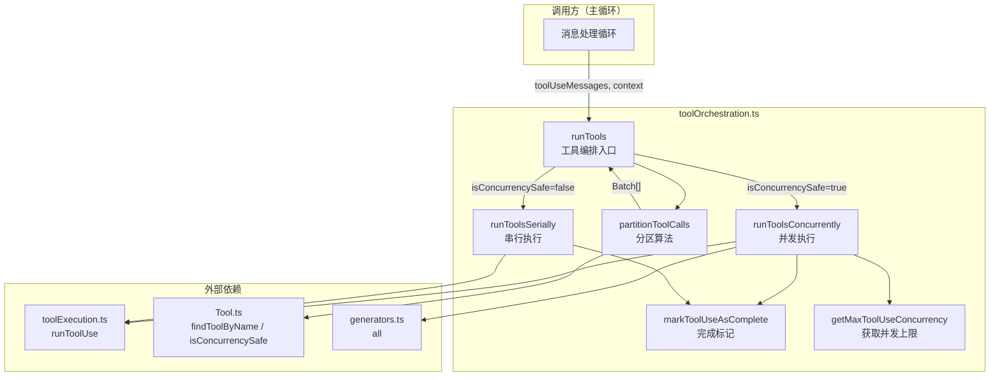
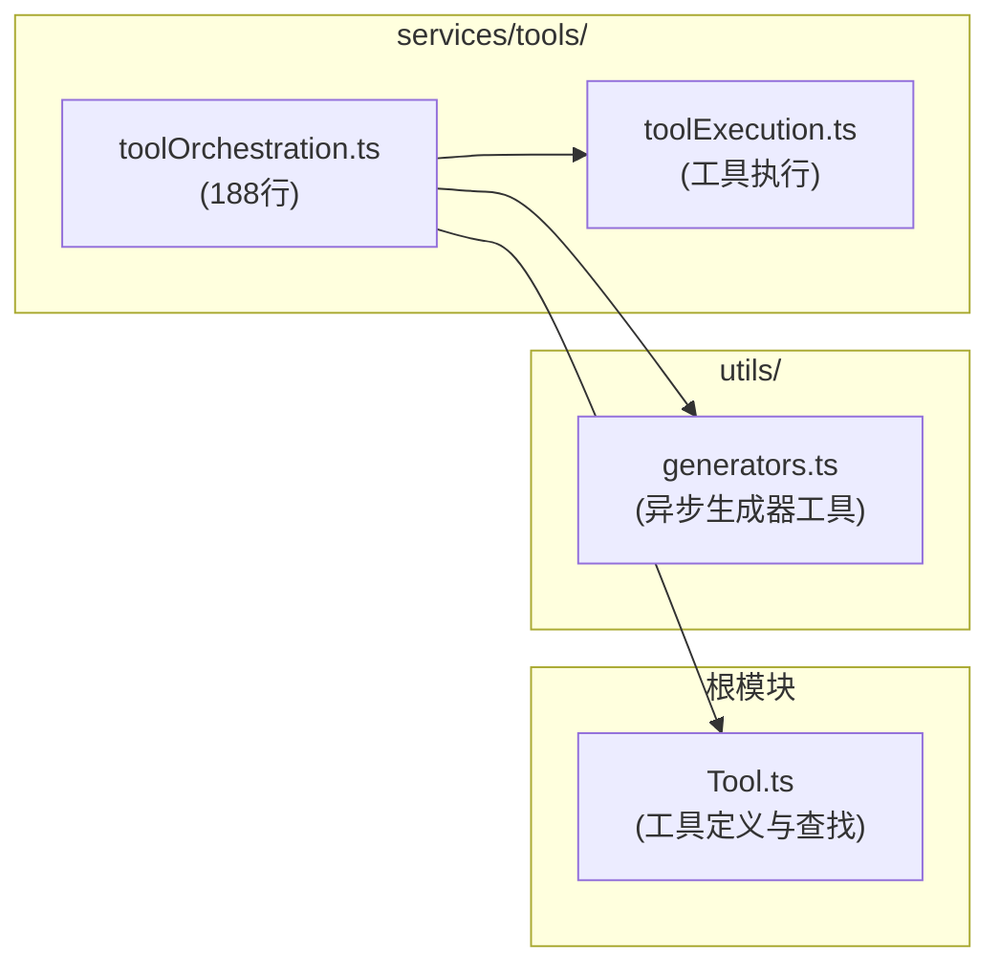
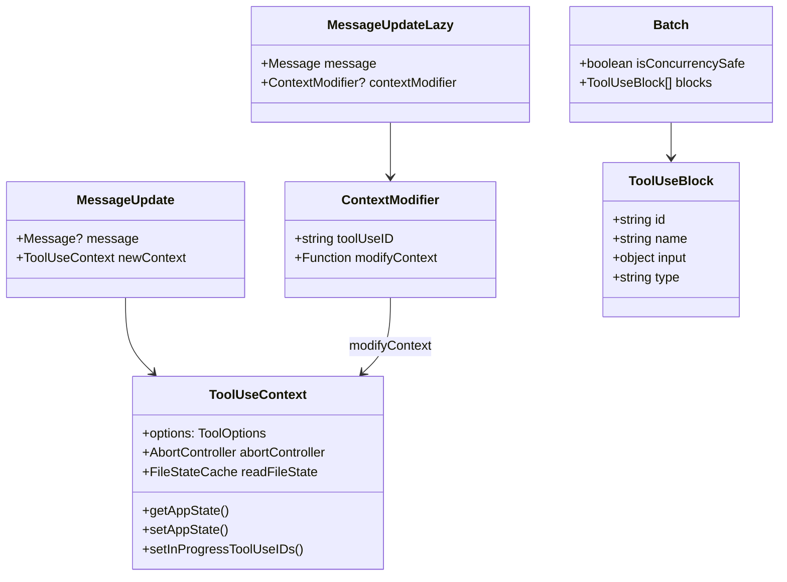
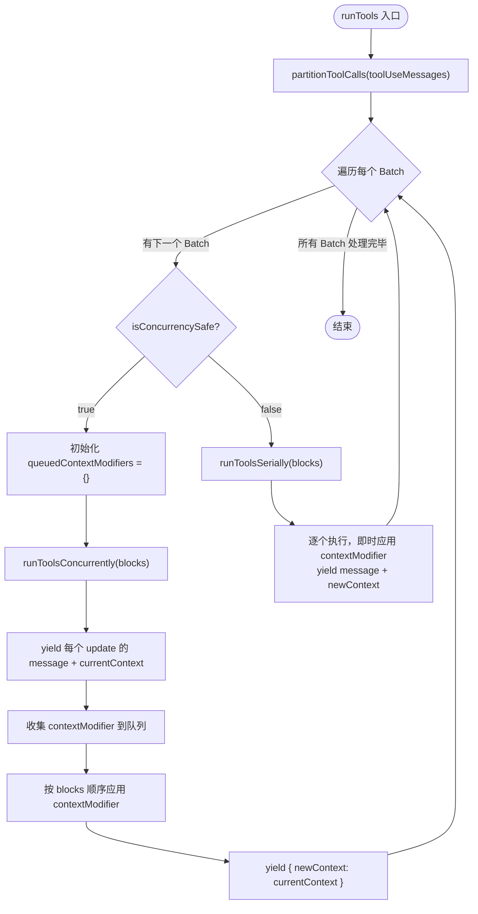
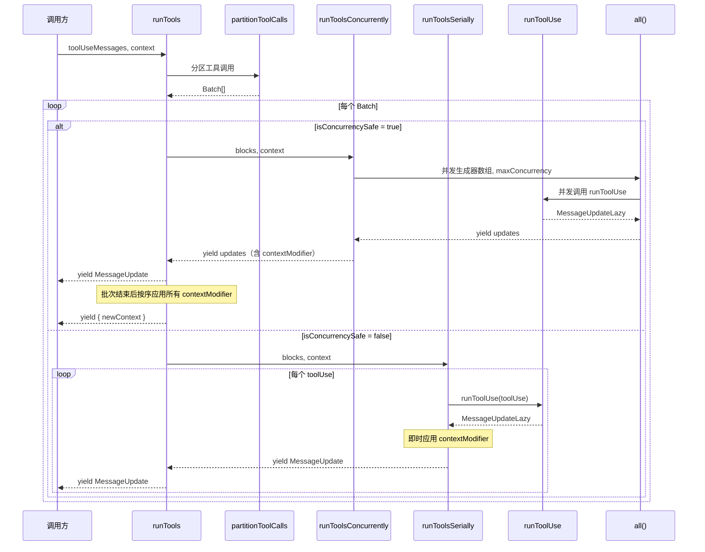
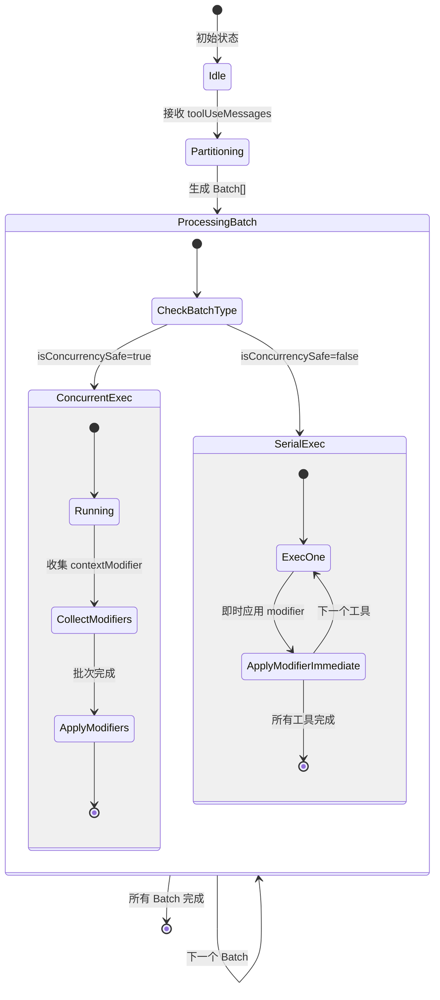

# 工具编排 子模块详细设计文档

## 文档信息
| 项目 | 内容 |
|------|------|
| 模块名称 | 工具编排 (Tool Orchestration) |
| 文档版本 | v1.0-20260401 |
| 生成日期 | 2026-04-01 |
| 生成方式 | 代码反向工程 |

## 1. 模块概述

### 1.1 模块职责

工具编排模块（`toolOrchestration.ts`）负责管理多个工具调用的执行策略，核心职责包括：

1. **工具调用分区**：将一批工具调用请求按照并发安全性（`isConcurrencySafe`）分区为多个批次（Batch），相邻的只读工具合并为并发批次，写操作工具单独成为串行批次。
2. **并发执行调度**：对并发安全的批次使用 `all()` 工具函数实现受限并发执行（默认最大并发数 10），提高吞吐量。
3. **串行执行保序**：对非并发安全的批次逐个串行执行，确保写操作的顺序一致性。
4. **上下文传播**：在工具执行过程中维护并传播 `ToolUseContext`，确保上下文修改器（contextModifier）被正确应用。
5. **进度追踪**：通过 `setInProgressToolUseIDs` 管理正在执行的工具 ID 集合，支持 UI 层进度展示。

### 1.2 模块边界

**输入**：
- `ToolUseBlock[]`：来自 Anthropic API 响应的工具调用块列表
- `AssistantMessage[]`：助手消息，用于关联工具调用与其所属消息
- `CanUseToolFn`：工具权限检查函数
- `ToolUseContext`：工具执行上下文，包含配置、状态管理等

**输出**：
- `AsyncGenerator<MessageUpdate, void>`：异步生成器，逐步产出消息更新和最新上下文

**与外部模块的交互**：
| 交互方 | 交互方式 | 说明 |
|--------|---------|------|
| `toolExecution.ts` | 调用 `runToolUse()` | 单个工具的实际执行 |
| `Tool.ts` | 调用 `findToolByName()` | 按名称查找工具定义 |
| `Tool.ts` | 读取 `tool.isConcurrencySafe()` | 判断工具是否并发安全 |
| `generators.ts` | 调用 `all()` | 受限并发异步生成器合并 |
| `useCanUseTool.ts` | 使用 `CanUseToolFn` 类型 | 权限检查回调 |
| 调用方（主循环） | 消费 `runTools()` 生成器 | 驱动整个工具编排流程 |

## 2. 架构设计

### 2.1 模块架构图



### 2.2 源文件组织



### 2.3 外部依赖

| 依赖 | 来源 | 用途 |
|------|------|------|
| `ToolUseBlock` | `@anthropic-ai/sdk/resources` | API 工具调用块类型 |
| `CanUseToolFn` | `hooks/useCanUseTool.js` | 工具权限检查函数类型 |
| `findToolByName` | `Tool.js` | 按名称查找工具实例 |
| `ToolUseContext` | `Tool.js` | 工具执行上下文类型 |
| `AssistantMessage, Message` | `types/message.js` | 消息类型定义 |
| `all` | `utils/generators.js` | 受限并发异步生成器合并 |
| `runToolUse, MessageUpdateLazy` | `services/tools/toolExecution.js` | 单个工具执行函数和懒更新类型 |

## 3. 数据结构设计

### 3.1 核心数据结构

#### MessageUpdate（第14-17行）

导出类型，工具编排的输出单元：

```typescript
export type MessageUpdate = {
  message?: Message       // 可选的消息（工具执行产生的结果消息）
  newContext: ToolUseContext  // 更新后的工具执行上下文
}
```

#### Batch（第84行）

内部类型，分区算法的输出单元：

```typescript
type Batch = {
  isConcurrencySafe: boolean  // 该批次是否可并发执行
  blocks: ToolUseBlock[]      // 该批次包含的工具调用块
}
```

#### MessageUpdateLazy（来自 toolExecution.ts 第264-270行）

并发执行使用的懒更新类型，延迟上下文修改：

```typescript
type MessageUpdateLazy<M extends Message = Message> = {
  message: M
  contextModifier?: {
    toolUseID: string
    modifyContext: (context: ToolUseContext) => ToolUseContext
  }
}
```

#### queuedContextModifiers（第31-34行）

并发执行中收集的上下文修改器队列：

```typescript
Record<string, ((context: ToolUseContext) => ToolUseContext)[]>
// key: toolUseID
// value: 该工具产生的上下文修改函数数组
```

### 3.2 数据关系图



## 4. 接口设计

### 4.1 对外接口

#### `runTools()`（第19-82行）

工具编排的唯一对外入口，以异步生成器形式驱动多个工具的执行。

```typescript
export async function* runTools(
  toolUseMessages: ToolUseBlock[],
  assistantMessages: AssistantMessage[],
  canUseTool: CanUseToolFn,
  toolUseContext: ToolUseContext,
): AsyncGenerator<MessageUpdate, void>
```

| 参数 | 类型 | 说明 |
|------|------|------|
| `toolUseMessages` | `ToolUseBlock[]` | 待执行的工具调用块列表 |
| `assistantMessages` | `AssistantMessage[]` | 助手消息列表，用于将 toolUse 关联到所属消息 |
| `canUseTool` | `CanUseToolFn` | 权限检查回调，决定工具是否可执行 |
| `toolUseContext` | `ToolUseContext` | 工具执行上下文 |

**返回值**：`AsyncGenerator<MessageUpdate, void>` — 逐步产出包含消息和最新上下文的更新。

#### `MessageUpdate` 类型（第14-17行）

```typescript
export type MessageUpdate = {
  message?: Message
  newContext: ToolUseContext
}
```

### 4.2 Interface 定义与实现

本模块无 interface 定义，主要使用 type alias。关键类型关系：

| 类型 | 位置 | 说明 |
|------|------|------|
| `MessageUpdate` | `toolOrchestration.ts:14` | 对外导出，编排输出类型 |
| `Batch` | `toolOrchestration.ts:84` | 内部类型，分区结果 |
| `MessageUpdateLazy` | `toolExecution.ts:264` | 导入使用，并发执行的懒更新类型 |
| `ToolUseContext` | `Tool.ts:158` | 导入使用，工具执行上下文 |
| `CanUseToolFn` | `useCanUseTool.ts` | 导入使用，权限检查函数类型 |

## 5. 核心流程设计

### 5.1 初始化流程

本模块为纯函数式设计，无初始化流程。并发上限通过 `getMaxToolUseConcurrency()`（第8-12行）在运行时从环境变量 `CLAUDE_CODE_MAX_TOOL_USE_CONCURRENCY` 读取，默认值为 10。

```typescript
function getMaxToolUseConcurrency(): number {
  return (
    parseInt(process.env.CLAUDE_CODE_MAX_TOOL_USE_CONCURRENCY || '', 10) || 10
  )
}
```

### 5.2 主处理流程





### 5.3 关键算法 - 分区算法 partitionToolCalls

**位置**：第91-116行

**函数签名**：
```typescript
function partitionToolCalls(
  toolUseMessages: ToolUseBlock[],
  toolUseContext: ToolUseContext,
): Batch[]
```

**算法逻辑**：

使用 `reduce` 遍历所有工具调用，按以下规则分区：

1. **查找工具定义**：通过 `findToolByName()` 在已注册工具列表中查找对应工具（第96行）。
2. **解析输入**：使用工具的 `inputSchema.safeParse()` 验证输入参数（第97行）。
3. **判断并发安全性**：
   - 若输入解析成功，调用 `tool.isConcurrencySafe(parsedInput.data)`（第101行）
   - 若 `isConcurrencySafe()` 抛出异常（如 shell-quote 解析失败），保守地视为不安全（第103-105行）
   - 若输入解析失败，视为不安全（第108行）
4. **合并规则**：
   - 若当前工具并发安全 **且** 上一个批次也是并发安全的 → 合并到上一个批次（第109-110行）
   - 否则 → 创建新批次（第112行）

**示例**：

输入 `[Read, Read, Write, Read, Read, Bash]` 的分区结果：
```
Batch 1: { isConcurrencySafe: true,  blocks: [Read, Read] }
Batch 2: { isConcurrencySafe: false, blocks: [Write] }
Batch 3: { isConcurrencySafe: true,  blocks: [Read, Read] }
Batch 4: { isConcurrencySafe: false, blocks: [Bash] }
```

**设计要点**：
- 采用贪心策略，将连续的并发安全工具尽可能合并
- 保守原则（fail-closed）：任何不确定情况都视为不可并发
- 保持工具调用的相对顺序不变

## 6. 状态管理

### 6.1 状态定义

本模块管理两类运行时状态：

| 状态 | 存储位置 | 说明 |
|------|---------|------|
| `currentContext` | `runTools` / `runToolsSerially` 局部变量 | 当前工具执行上下文，随 contextModifier 更新 |
| `inProgressToolUseIDs` | `ToolUseContext.setInProgressToolUseIDs` | 正在执行的工具 ID 集合（`Set<string>`） |
| `queuedContextModifiers` | `runTools` 并发分支局部变量 | 并发批次中收集的延迟上下文修改器 |

### 6.2 状态转换图



**上下文修改时机的差异**：

- **串行执行**（`runToolsSerially`，第118-150行）：每个工具执行完毕后立即应用 `contextModifier`，后续工具能看到最新上下文。
- **并发执行**（`runToolsConcurrently` + `runTools` 并发分支，第30-63行）：执行期间将 `contextModifier` 收集到 `queuedContextModifiers` 队列，批次全部完成后按 `blocks` 的原始顺序依次应用。这确保了并发执行时上下文修改的确定性。

## 7. 错误处理设计

| 场景 | 处理方式 | 位置 |
|------|---------|------|
| `tool.isConcurrencySafe()` 抛异常 | catch 捕获，返回 `false`（保守策略） | 第100-107行 |
| 工具输入 schema 解析失败 | `safeParse` 返回 `success: false`，视为不可并发 | 第98-108行 |
| 工具未找到 | `findToolByName` 返回 `undefined`，`isConcurrencySafe` 为 `false` | 第96-108行 |
| 工具执行错误 | 由下层 `runToolUse()` 处理，本模块透传 | 不涉及 |

**设计原则**：本模块在分区阶段采用**保守策略**（fail-closed），任何异常或不确定情况都将工具视为不可并发，宁可牺牲并发性能也不冒数据不一致的风险。

## 8. 设计约束与决策

### 8.1 设计模式

| 模式 | 应用 | 说明 |
|------|------|------|
| **异步生成器管道** | `runTools` → `runToolsSerially` / `runToolsConcurrently` → `runToolUse` | 整个执行链使用 `async function*` 实现流式数据传递，支持背压和懒执行 |
| **策略模式** | 并发 vs 串行执行路径 | 根据 `isConcurrencySafe` 动态选择执行策略 |
| **贪心分区** | `partitionToolCalls` | 将连续同类型工具调用合并为批次 |
| **延迟应用** | 并发批次中的 `queuedContextModifiers` | 并发执行期间收集修改，批次结束后统一应用，避免竞态 |

### 8.2 性能考量

1. **并发上限控制**：通过 `getMaxToolUseConcurrency()` 限制最大并发数（默认 10），防止资源耗尽。可通过环境变量 `CLAUDE_CODE_MAX_TOOL_USE_CONCURRENCY` 调节。
2. **批次合并优化**：相邻只读工具被合并为单一并发批次，减少批次切换开销。
3. **流式输出**：使用异步生成器而非 Promise.all，支持增量输出，降低首次响应延迟。
4. **`all()` 工具函数**：来自 `generators.ts`，实现了受限并发的异步生成器合并，当一个生成器完成时立即启动等待中的下一个（工作窃取式调度）。

### 8.3 扩展点

1. **并发上限**：通过环境变量 `CLAUDE_CODE_MAX_TOOL_USE_CONCURRENCY` 可运行时配置。
2. **工具并发安全性声明**：每个工具通过实现 `isConcurrencySafe(input)` 方法自主声明是否可并发，新增工具只需实现该方法即可融入编排框架。默认值为 `false`（`Tool.ts` 第759行），确保新工具默认安全。
3. **上下文修改器**：工具通过返回 `contextModifier` 可以修改后续工具的执行上下文，支持工具间的间接通信。

## 9. 设计评估

### 9.1 优点

1. **安全优先**：分区算法采用保守策略，未知工具默认串行执行，有效避免并发写冲突。
2. **高吞吐**：连续只读操作（如多个文件读取、grep 搜索）被自动合并并发执行，显著提升响应速度。
3. **架构简洁**：整个模块仅 188 行，4 个内部函数 + 1 个导出函数，职责单一清晰。
4. **流式设计**：异步生成器管道天然支持增量输出和背压控制，与终端 UI 的流式渲染完美配合。
5. **确定性保证**：并发批次中的上下文修改按原始工具顺序应用（第54-62行），即使执行顺序不确定，最终状态也是确定的。
6. **可配置性**：并发上限可通过环境变量调节，适应不同运行环境。

### 9.2 缺点与风险

1. **并发批次的上下文延迟**：并发批次中工具产生的上下文修改在整个批次完成后才应用。如果某个只读工具的 `contextModifier` 对同批次的其他工具有影响，该影响会被延迟，可能导致微妙的行为差异。
2. **`isConcurrencySafe` 的准确性依赖**：分区质量完全取决于每个工具对 `isConcurrencySafe` 的正确实现。若某工具错误地声明自己为并发安全（实际有副作用），可能导致数据不一致。
3. **缺少重试机制**：工具执行失败后没有重试逻辑，由上层处理。
4. **关联消息查找使用 `find` + `some`**：第132-136行和第165-168行通过遍历方式查找 toolUse 所属的 assistantMessage，在消息量大时存在 O(n*m) 性能隐患。
5. **无取消粒度**：并发批次中无法单独取消某个工具的执行，只能通过 `AbortController` 整体取消。

### 9.3 改进建议

1. **增加关联索引**：为 `assistantMessages` 预建 `toolUseID → AssistantMessage` 的 Map 索引，将查找复杂度从 O(n*m) 降为 O(1)。
2. **考虑部分并发**：对于并发批次中的上下文修改，可探索更细粒度的依赖分析，仅在有实际依赖时才阻塞等待。
3. **添加执行超时**：为单个工具执行添加超时机制，防止某个工具阻塞整个编排流程。
4. **监控与可观测性**：在分区和执行阶段添加结构化日志或指标采集，便于性能分析和问题排查。
5. **类型安全增强**：`queuedContextModifiers` 可考虑使用 `Map<string, ...>` 替代 `Record<string, ...>`，语义更明确。
