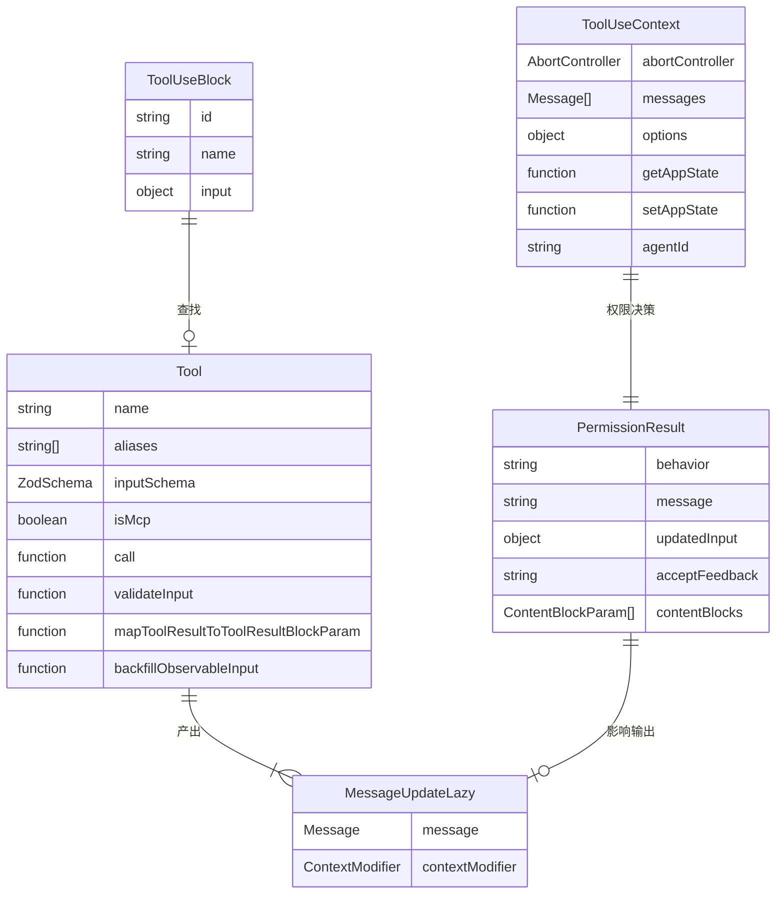
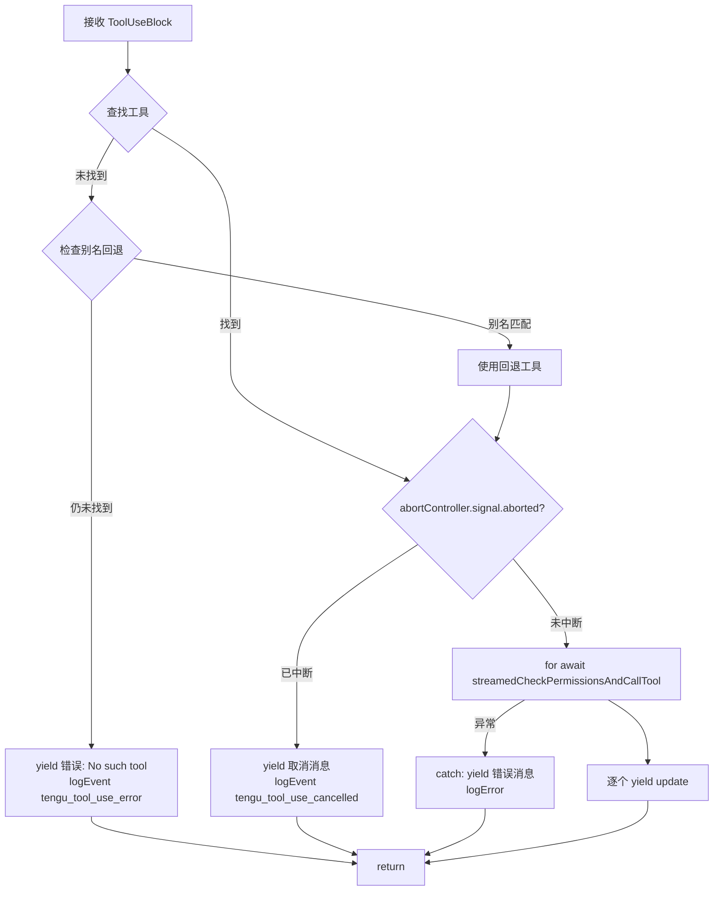
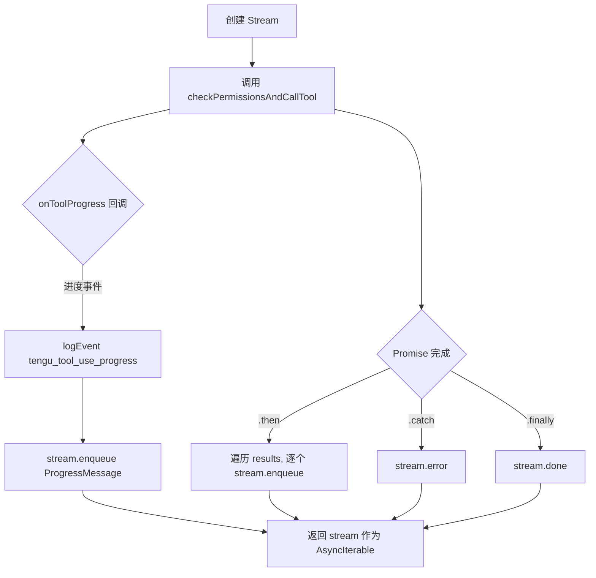
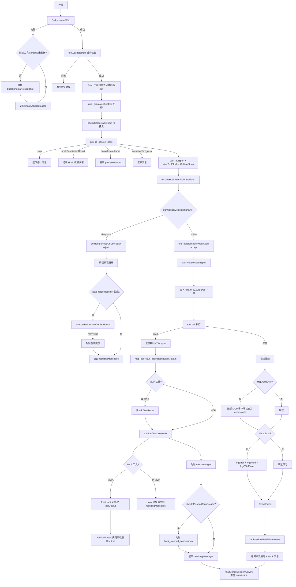
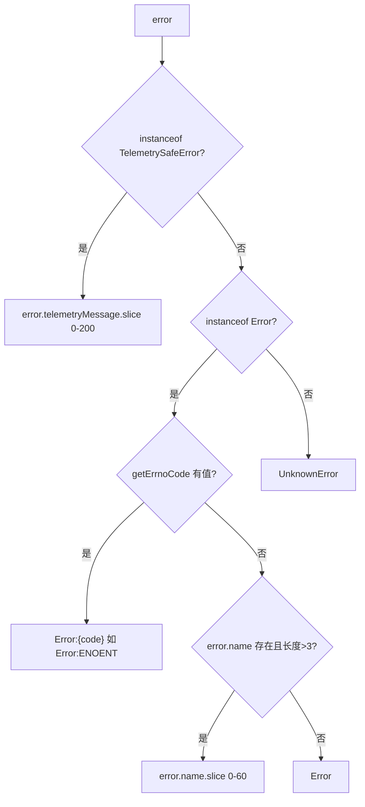

# 工具执行引擎 子模块详细设计文档

## 文档信息
| 项目 | 内容 |
|------|------|
| 模块名称 | 工具执行引擎 (Tool Execution Engine) |
| 文档版本 | v1.0-20260401 |
| 生成日期 | 2026-04-01 |
| 生成方式 | 代码反向工程 |

## 1. 模块概述

### 1.1 模块职责

工具执行引擎是 Claude Code 工具调用链的核心枢纽，负责从接收到模型的 `tool_use` 指令到最终返回 `tool_result` 的完整生命周期管理。其职责包括：

1. **工具查找与校验**：根据工具名称查找可用工具，支持别名/废弃名称的回退查找
2. **输入验证**：基于 Zod schema 的类型验证 + 工具自定义的业务验证
3. **权限管控**：调用权限系统判断是否允许执行，支持交互式/自动模式/Hook 决策
4. **工具调用**：实际执行 `tool.call()`，传入经过处理的输入参数
5. **Hook 编排**：在工具执行前后运行 PreToolUse / PostToolUse / PostToolUseFailure 钩子
6. **结果处理**：将工具返回值映射为 API 格式的 `ToolResultBlockParam`
7. **遥测与追踪**：全链路埋点（Analytics 事件 + OTel span + 性能计数器）
8. **错误分类与恢复**：将异常映射为遥测安全的错误标签，区分用户中断/MCP 认证/Shell 错误等

### 1.2 模块边界

```
                        ┌─────────────────────────────────────────┐
                        │           工具执行引擎边界               │
   ToolUseBlock ───────>│  runToolUse                             │
   (模型输出)            │    ├─ 工具查找                          │
                        │    ├─ streamedCheckPermissionsAndCallTool│
                        │    │    └─ checkPermissionsAndCallTool   │
                        │    │         ├─ 输入验证 (Zod + custom) │
                        │    │         ├─ Hook 编排               │
                        │    │         ├─ 权限决策                 │
                        │    │         ├─ tool.call()              │
                        │    │         └─ 结果处理                 │
                        │    └─ 错误处理                           │
   MessageUpdateLazy <──│                                         │
   (结果消息流)          └─────────────────────────────────────────┘
```

**上游依赖**：
- 消息处理层调用 `runToolUse` 传入模型生成的 `ToolUseBlock`
- `Tool` 接口定义（`Tool.ts`）提供工具注册表

**下游依赖**：
- `toolHooks.ts` — Hook 执行引擎
- `canUseTool` — 权限判定函数
- 各具体工具的 `call()` 方法
- MCP 客户端连接层
- Analytics/OTel 遥测基础设施

## 2. 架构设计

### 2.1 模块架构图

```mermaid
graph TB
    subgraph "工具执行引擎 (toolExecution.ts)"
        A[runToolUse] -->|AsyncGenerator| B[streamedCheckPermissionsAndCallTool]
        B -->|Stream适配| C[checkPermissionsAndCallTool]

        C --> D[输入验证层]
        D --> D1[Zod Schema 验证]
        D --> D2[tool.validateInput 业务验证]
        D --> D3[buildSchemaNotSentHint 延迟工具提示]

        C --> E[Hook 编排层]
        E --> E1[runPreToolUseHooks]
        E --> E2[resolveHookPermissionDecision]
        E --> E3[runPostToolUseHooks]
        E --> E4[runPostToolUseFailureHooks]

        C --> F[权限决策层]
        F --> F1[canUseTool]
        F --> F2[PermissionDenied Hooks]
        F --> F3[OTel tool_decision 事件]

        C --> G[工具调用层]
        G --> G1[输入预处理 backfill/strip]
        G --> G2[tool.call 执行]
        G --> G3[结果映射 mapToolResultToToolResultBlockParam]

        C --> H[遥测层]
        H --> H1[logEvent Analytics]
        H --> H2[logOTelEvent Spans]
        H --> H3[性能计数器]

        C --> I[错误处理层]
        I --> I1[classifyToolError]
        I --> I2[McpAuthError 处理]
        I --> I3[AbortError 中断处理]
    end

    subgraph "外部系统"
        J[Tool 接口] --> G2
        K[toolHooks.ts] --> E
        L[权限系统] --> F1
        M[MCP 客户端] --> G2
        N[Analytics/OTel] --> H
    end
```



### 2.2 源文件组织

| 文件 | 行数 | 职责 |
|------|------|------|
| `src/services/tools/toolExecution.ts` | ~1745 | 工具执行引擎全部逻辑（单文件） |

文件内部逻辑组织：

| 行号范围 | 功能区域 |
|-----------|----------|
| 1-131 | 导入声明（约40个模块） |
| 133-137 | 常量定义（Hook 计时阈值） |
| 150-171 | `classifyToolError` — 错误分类函数 |
| 181-250 | OTel source 映射辅助函数 |
| 252-262 | `getNextImagePasteId` — 图片 ID 生成 |
| 264-280 | 类型定义 (`MessageUpdateLazy`, `McpServerType`) |
| 283-335 | MCP 服务器连接辅助函数 |
| 337-490 | `runToolUse` — 顶层入口（AsyncGenerator） |
| 492-570 | `streamedCheckPermissionsAndCallTool` — 流式适配层 |
| 578-597 | `buildSchemaNotSentHint` — 延迟工具 schema 提示 |
| 599-1745 | `checkPermissionsAndCallTool` — 核心执行逻辑（约1150行） |

### 2.3 外部依赖

| 依赖模块 | 引入内容 | 用途 |
|----------|----------|------|
| `@anthropic-ai/sdk` | `ToolUseBlock`, `ToolResultBlockParam`, `ContentBlockParam` | API 消息类型 |
| `src/Tool.ts` | `findToolByName`, `Tool`, `ToolProgress`, `ToolUseContext` | 工具注册与接口 |
| `src/services/analytics/` | `logEvent`, 各种元数据提取函数 | 遥测埋点 |
| `src/bootstrap/state.ts` | `addToToolDuration`, `getStatsStore`, `getCodeEditToolDecisionCounter` | 全局统计 |
| `src/hooks/toolPermission/` | `buildCodeEditToolAttributes`, `isCodeEditingTool` | 代码编辑权限日志 |
| `src/hooks/useCanUseTool.ts` | `CanUseToolFn` | 权限判定函数类型 |
| `src/utils/errors.ts` | `AbortError`, `ShellError`, `TelemetrySafeError`, `getErrnoCode` | 错误类型体系 |
| `src/utils/telemetry/sessionTracing.ts` | Span 管理函数族 | OTel 分布式追踪 |
| `src/utils/stream.ts` | `Stream` | 异步迭代器适配 |
| `src/services/mcp/` | MCP 客户端、工具名解析、规范化 | MCP 协议集成 |
| `src/services/tools/toolHooks.ts` | Hook 运行函数族 | 生命周期钩子 |
| `src/utils/toolResultStorage.ts` | `processToolResultBlock`, `processPreMappedToolResultBlock` | 结果持久化 |
| `src/tools/BashTool/bashPermissions.ts` | `startSpeculativeClassifierCheck` | Bash 工具投机性权限检查 |

## 3. 数据结构设计

### 3.1 核心数据结构

#### MessageUpdateLazy (行 264-270)

```typescript
export type MessageUpdateLazy<M extends Message = Message> = {
  message: M
  contextModifier?: {
    toolUseID: string
    modifyContext: (context: ToolUseContext) => ToolUseContext
  }
}
```

这是执行引擎的统一输出单元。每个 `yield` 或 `push` 到 `resultingMessages` 的元素都是此类型。`contextModifier` 是可选的上下文变换函数，允许工具在返回结果的同时修改后续工具调用的上下文（例如切换工作目录）。

#### McpServerType (行 272-281)

```typescript
export type McpServerType =
  | 'stdio' | 'sse' | 'http' | 'ws' | 'sdk'
  | 'sse-ide' | 'ws-ide' | 'claudeai-proxy'
  | undefined
```

MCP 服务器传输类型枚举，用于遥测标注和服务器连接识别。

#### 权限决策相关类型（从外部引入）

- `PermissionResult` — 权限判定结果（`allow` / `deny` / `ask`）
- `PermissionDecisionReason` — 决策原因（`rule` / `hook` / `classifier` / `mode` / `permissionPromptTool` 等）
- `CanUseToolFn` — 权限判定回调函数类型

#### 内部状态变量（checkPermissionsAndCallTool 函数作用域）

| 变量 | 类型 | 用途 |
|------|------|------|
| `processedInput` | `typeof parsedInput.data` | 经过各阶段处理的工具输入，随流程演进可被 Hook/权限系统替换 |
| `callInput` | 同上 | 最终传给 `tool.call()` 的输入，区分 backfill 前后的值 |
| `backfilledClone` | 同上 \| `null` | 浅拷贝后经 `backfillObservableInput` 补充字段的克隆，用于 Hook 和权限检查 |
| `shouldPreventContinuation` | `boolean` | PreToolUse Hook 是否要求阻止后续自动对话 |
| `stopReason` | `string \| undefined` | Hook 停止原因文本 |
| `hookPermissionResult` | `PermissionResult \| undefined` | Hook 返回的权限决策（可覆盖正常权限流程） |
| `resultingMessages` | `MessageUpdateLazy[]` | 累积的输出消息列表 |

### 3.2 数据关系图



## 4. 接口设计

### 4.1 对外接口（export API）

#### `runToolUse` (行 337-490)

```typescript
export async function* runToolUse(
  toolUse: ToolUseBlock,
  assistantMessage: AssistantMessage,
  canUseTool: CanUseToolFn,
  toolUseContext: ToolUseContext,
): AsyncGenerator<MessageUpdateLazy, void>
```

**职责**：工具执行的顶层入口，为 AsyncGenerator 模式。

**参数**：
- `toolUse` — 模型输出的工具调用块（含 `id`, `name`, `input`）
- `assistantMessage` — 关联的助手消息（用于溯源 `uuid`, `requestId`）
- `canUseTool` — 权限判定回调
- `toolUseContext` — 工具执行上下文（消息历史、应用状态、中断控制等）

**返回**：`AsyncGenerator<MessageUpdateLazy>` — 逐步 yield 进度消息和最终结果消息

**核心逻辑**：
1. 通过 `findToolByName` 查找工具，支持别名回退
2. 检查 `abortController.signal.aborted` 判断是否已中断
3. 委托 `streamedCheckPermissionsAndCallTool` 执行
4. 顶层 catch 兜底所有未捕获异常

#### `classifyToolError` (行 150-171)

```typescript
export function classifyToolError(error: unknown): string
```

**职责**：将工具执行错误分类为遥测安全的字符串标签。

**分类规则**：
1. `TelemetrySafeError` → 使用其 `telemetryMessage`（截断 200 字符）
2. Node.js errno 错误 → `"Error:ENOENT"` / `"Error:EACCES"` 等
3. 具有稳定 `.name` 属性的 Error（长度 > 3，非混淆名）→ 使用 `.name`
4. 其他 Error → `"Error"`
5. 非 Error 类型 → `"UnknownError"`

#### `buildSchemaNotSentHint` (行 578-597)

```typescript
export function buildSchemaNotSentHint(
  tool: Tool,
  messages: Message[],
  tools: readonly { name: string }[],
): string | null
```

**职责**：当延迟工具（deferred tool）的 schema 未发送到 API 时，生成提示文本告知模型先调用 `ToolSearch` 加载 schema。

#### `HOOK_TIMING_DISPLAY_THRESHOLD_MS` (行 134)

```typescript
export const HOOK_TIMING_DISPLAY_THRESHOLD_MS = 500
```

当 Hook 总耗时超过此阈值时，向用户显示内联计时摘要。

#### `MessageUpdateLazy` 类型 (行 264-270)

导出类型，作为执行引擎与上层的通信契约。

#### `McpServerType` 类型 (行 272-281)

导出类型，MCP 服务器传输协议枚举。

### 4.2 内部关键函数

#### `streamedCheckPermissionsAndCallTool` (行 492-570)

```typescript
function streamedCheckPermissionsAndCallTool(
  tool: Tool, toolUseID: string,
  input: { [key: string]: boolean | string | number },
  toolUseContext: ToolUseContext,
  canUseTool: CanUseToolFn,
  assistantMessage: AssistantMessage,
  messageId: string,
  requestId: string | undefined,
  mcpServerType: McpServerType,
  mcpServerBaseUrl: ReturnType<typeof getLoggingSafeMcpBaseUrl>,
): AsyncIterable<MessageUpdateLazy>
```

**职责**：将 Promise-based 的 `checkPermissionsAndCallTool` 适配为 `AsyncIterable`，通过 `Stream` 类实现进度事件和最终结果的统一流式输出。

**实现要点**：
- 创建 `Stream<MessageUpdateLazy>` 实例
- 将 `onToolProgress` 回调中的进度事件 `enqueue` 到流
- `checkPermissionsAndCallTool` 的 Promise 完成后将结果批量 `enqueue`
- 错误通过 `stream.error()` 传播
- `finally` 中调用 `stream.done()` 关闭流

#### `checkPermissionsAndCallTool` (行 599-1745)

```typescript
async function checkPermissionsAndCallTool(
  tool: Tool, toolUseID: string,
  input: { [key: string]: boolean | string | number },
  toolUseContext: ToolUseContext,
  canUseTool: CanUseToolFn,
  assistantMessage: AssistantMessage,
  messageId: string, requestId: string | undefined,
  mcpServerType: McpServerType,
  mcpServerBaseUrl: ReturnType<typeof getLoggingSafeMcpBaseUrl>,
  onToolProgress: (...) => void,
): Promise<MessageUpdateLazy[]>
```

**职责**：完整的权限检查 + 工具调用 + 结果处理流程（约 1150 行，是整个文件的核心）。

#### `ruleSourceToOTelSource` (行 181-194)

将权限规则来源映射为 OTel 标准词汇（`user_temporary` / `user_permanent` / `user_reject` / `config`）。

#### `decisionReasonToOTelSource` (行 207-250)

将 `PermissionDecisionReason` 映射为 OTel `source` 标签，支持 `permissionPromptTool`、`rule`、`hook`、`mode`、`classifier` 等决策来源。包含 exhaustive check（`never` 类型保证）。

#### `findMcpServerConnection` (行 283-301)

根据工具名（`mcp__<server>__<tool>` 格式）查找对应的 MCP 服务器连接。内部处理名称规范化（`normalizeNameForMCP`）。

#### `getMcpServerType` (行 308-320)

从工具名提取 MCP 服务器传输类型。

#### `getMcpServerBaseUrlFromToolName` (行 326-335)

从工具名提取 MCP 服务器日志安全的 base URL。

#### `getNextImagePasteId` (行 252-262)

遍历消息历史找到最大的 `imagePasteId`，返回下一个可用 ID。

#### `addToolResult`（行 1403-1474，checkPermissionsAndCallTool 内部闭包）

将工具输出映射为 API 消息格式，处理用户反馈、图片粘贴 ID、上下文修改器等。MCP 工具和非 MCP 工具在调用时机上有差异（非 MCP 先 add 再跑 PostHook，MCP 先跑 PostHook 再 add）。

## 5. 核心流程设计

### 5.1 runToolUse 完整流程



### 5.2 streamedCheckPermissionsAndCallTool 流程



### 5.3 checkPermissionsAndCallTool 流程



### 5.4 关键算法

#### 5.4.1 输入预处理与 backfill 机制（行 783-1205）

工具输入经历三阶段变换：

1. **`_simulatedSedEdit` 防御性剥离**（行 756-773）：Bash 工具的内部字段 `_simulatedSedEdit` 只能由权限系统注入，模型提供时被强制移除，防止注入攻击。

2. **`backfillObservableInput` 浅拷贝**（行 784-793）：部分工具（如文件工具）会通过 `backfillObservableInput` 在输入对象上添加派生字段（如路径展开）。为防止这些变更影响 `tool.call()` 的输入（影响结果中嵌入的路径和 VCR 哈希），使用浅拷贝隔离。Hook 和权限检查使用拷贝后的值，`call()` 使用原始值。

3. **Hook/权限替换后的路径还原**（行 1189-1205）：当 Hook 或权限系统返回新的 `updatedInput` 时，如果新输入的 `file_path` 与 backfill 展开后的值相同，则恢复为模型原始路径，保持 transcript 和 VCR fixture 的哈希稳定性。

#### 5.4.2 投机性分类器启动（行 740-752）

对 Bash 工具，在输入验证后、权限检查前，提前启动 `startSpeculativeClassifierCheck`。该分类器与 PreToolUse Hook、deny/ask 分类器并行运行，减少权限判定的总延迟。UI 指示器不在此处设置（避免对自动通过的命令闪现"分类器运行中"提示）。

#### 5.4.3 MCP 工具的差异化处理

MCP 工具与内置工具在 PostToolUse Hook 处理上有关键差异：

- **非 MCP 工具**：先执行 `addToolResult`（行 1477-1479），再运行 PostToolUse Hook。Hook 结果直接追加到消息列表。
- **MCP 工具**：先运行 PostToolUse Hook（行 1483-1531），Hook 可通过 `updatedMCPToolOutput` 修改工具输出，修改后再执行 `addToolResult`（行 1540-1542）。

这一设计允许 PostToolUse Hook 对 MCP 工具的返回内容进行过滤或转换。

#### 5.4.4 OTel source 词汇映射

`decisionReasonToOTelSource`（行 207-250）实现了完整的决策来源到 OTel 标签的映射：

| 决策来源 | OTel source (allow) | OTel source (deny) |
|----------|-------|-------|
| `permissionPromptTool` (有 classification) | 使用 classification | 使用 classification |
| `permissionPromptTool` (无 classification) | `user_temporary` | `user_reject` |
| `rule` (session) | `user_temporary` | `user_reject` |
| `rule` (localSettings/userSettings) | `user_permanent` | `user_reject` |
| `rule` (其他: cliArg/policy/project/flag) | `config` | `config` |
| `hook` | `hook` | `hook` |
| `mode`/`classifier`/`other`/... | `config` | `config` |

## 6. 状态管理

工具执行引擎本身不持有持久状态，但在执行过程中管理以下临时状态：

### 6.1 函数作用域状态（checkPermissionsAndCallTool 内）

| 状态 | 生命周期 | 说明 |
|------|----------|------|
| `resultingMessages` | 函数调用期间 | 累积所有输出消息，最终批量返回 |
| `processedInput` | 函数调用期间 | 经过多阶段变换的输入，可被 Hook/权限替换 |
| `callInput` | 函数调用期间 | 传给 `tool.call()` 的最终输入 |
| `hookPermissionResult` | PreHook 到权限决策之间 | Hook 返回的权限决策 |
| `shouldPreventContinuation` | PreHook 到函数结束 | 是否阻止后续自动对话 |

### 6.2 外部状态交互

| 操作 | 目标 | 时机 |
|------|------|------|
| `addToToolDuration(durationMs)` | 全局统计 | 工具调用完成后 |
| `getStatsStore()?.observe('pre_tool_hook_duration_ms', ...)` | 性能指标 | PreToolUse Hook 完成后 |
| `startSessionActivity('tool_exec')` / `stopSessionActivity` | 会话活动追踪 | 工具调用前后 |
| `startToolSpan` / `endToolSpan` | OTel 追踪 | 权限检查前 / 工具完成后 |
| `toolUseContext.toolDecisions?.delete(toolUseID)` | 决策缓存清理 | finally 中 |
| `toolUseContext.setAppState(...)` | MCP 客户端状态 | McpAuthError 时将客户端标记为 `needs-auth` |

### 6.3 Stream 生命周期

`Stream<MessageUpdateLazy>` 在 `streamedCheckPermissionsAndCallTool` 中创建，作为 Promise-based 函数到 AsyncIterable 的桥接：

```
创建 Stream → enqueue 进度/结果 → done()/error() → 被 runToolUse 的 for-await-of 消费
```

## 7. 错误处理设计

### 7.1 错误类型

| 错误类型 | 来源 | 处理方式 |
|----------|------|----------|
| `TelemetrySafeError` | 工具内部 | 使用 `telemetryMessage` 进行遥测（截断 200 字符） |
| `AbortError` | 用户中断 | 跳过 logError/logEvent，仅 formatError 返回 |
| `ShellError` | Bash/PowerShell 执行 | 跳过 logError（预期错误），但仍 logEvent |
| `McpAuthError` | MCP 认证失败 | 更新 MCP 客户端状态为 `needs-auth`，正常错误流程 |
| `McpToolCallError` | MCP 工具调用 | 提取 `mcpMeta` 附加到错误消息 |
| Zod `ValidationError` | 输入验证 | 返回 `InputValidationError` + 可能的 schema 未发送提示 |
| 通用 `Error` | 任何阶段 | 尝试使用 errno code 或稳定 `.name`，回退为 `"Error"` |

### 7.2 错误分类 classifyToolError（行 150-171）



设计要点：
- 混淆/打包后 `constructor.name` 会变成 3 字符短标识符（如 "nJT"），通过长度检查（> 3）过滤
- `ShellError` 等在构造函数中设置了稳定的 `.name` 属性，可安全用于遥测
- 所有返回值都经过截断，防止超长字符串进入遥测系统

### 7.3 错误传播链

```
tool.call() 异常
  └─ checkPermissionsAndCallTool catch (行 1589-1744)
       ├─ McpAuthError → setAppState 更新 MCP 客户端状态
       ├─ !AbortError → logError + logEvent + logOTelEvent
       ├─ formatError(error) → 生成用户可见错误文本
       ├─ runPostToolUseFailureHooks → 执行失败后钩子
       └─ 返回 [错误消息, ...hookMessages]
            └─ streamedCheckPermissionsAndCallTool
                 ├─ .catch → stream.error(error) → 传播到 runToolUse
                 └─ .then → stream.enqueue(results)
                      └─ runToolUse for-await-of → yield 给调用方

runToolUse 顶层 catch (行 469-489)
  └─ 兜底：未被内部捕获的异常
       └─ yield 通用错误消息 "Error calling tool(name): message"
```

## 8. 设计约束与决策

### 8.1 设计模式

#### AsyncGenerator + Stream 适配器模式

`runToolUse` 使用 AsyncGenerator（`async function*`）作为对外接口，支持调用方通过 `for-await-of` 逐步消费进度和结果。内部通过 `Stream` 类将 Promise-based 的 `checkPermissionsAndCallTool` 适配为 `AsyncIterable`，实现了进度事件和最终结果在同一通道内的统一传递。

#### 防御性编程

- `_simulatedSedEdit` 字段剥离（行 756-773）：即使 Zod `strictObject` 应该拒绝此字段，仍主动移除作为纵深防御
- backfill 浅拷贝隔离（行 784-793）：防止 Hook 副作用影响工具调用的输入完整性
- 路径还原逻辑（行 1189-1205）：保持 transcript 哈希稳定性

#### 关注点分离

- 权限判定委托给 `canUseTool` / `resolveHookPermissionDecision`
- Hook 执行委托给 `toolHooks.ts`
- 错误格式化委托给 `utils/toolErrors.ts`
- 结果映射委托给 `Tool.mapToolResultToToolResultBlockParam`

#### 遥测全覆盖

每个关键路径都有对应的遥测事件：
- `tengu_tool_use_error` — 工具未找到/输入验证失败/执行异常
- `tengu_tool_use_cancelled` — 中断
- `tengu_tool_use_progress` — 进度
- `tengu_tool_use_can_use_tool_rejected` / `_allowed` — 权限决策
- `tengu_tool_use_success` — 成功
- `tool_decision` / `tool_result` — OTel 结构化事件

### 8.2 性能考量

1. **投机性分类器**（行 740-752）：Bash 工具在输入验证后立即启动分类器，与 PreToolUse Hook 和权限对话并行运行，减少串行等待。

2. **慢阶段检测**（行 137, 865-870, 937-946, 1533-1538）：当 Hook 或权限决策耗时超过 `SLOW_PHASE_LOG_THRESHOLD_MS`（2000ms）时记录调试日志，帮助定位性能瓶颈。

3. **预映射结果复用**（行 1292-1301, 1403-1416）：非 MCP 工具在成功时预先计算 `mappedToolResultBlock`，当 PostToolUse Hook 不修改输出时直接复用（`processPreMappedToolResultBlock`），避免重复序列化。

4. **条件性遥测**（行 1139, 1361）：`isToolDetailsLoggingEnabled()` 门控敏感的工具参数日志，减少默认情况下的序列化开销。

5. **会话活动追踪**（行 1180, 1739）：`startSessionActivity('tool_exec')` / `stopSessionActivity` 标记工具执行的活跃区间，在 `finally` 中确保清理。

## 9. 设计评估

### 9.1 优点

1. **完整的生命周期管理**：从工具查找、输入验证、权限检查、Hook 编排到结果处理，形成了清晰的执行管线，每个阶段的职责明确。

2. **强健的错误处理**：三层错误捕获（tool.call catch、checkPermissionsAndCallTool catch、runToolUse catch）确保不会有未处理的异常泄漏。错误分类函数考虑了生产环境代码混淆的影响。

3. **灵活的 Hook 体系**：PreToolUse Hook 可修改输入、决定权限、阻止后续对话；PostToolUse Hook 可修改 MCP 工具输出。Hook 和正常权限流程通过 `resolveHookPermissionDecision` 优雅合并。

4. **流式输出**：AsyncGenerator + Stream 适配器使得进度事件可以即时传递到 UI，而不必等待工具执行完成。

5. **遥测全覆盖**：每个分支路径都有对应的遥测事件，且遥测数据经过安全过滤（sanitize、classify、slice），适合生产环境。

6. **backfill 隔离机制**：通过浅拷贝和路径还原，巧妙地解决了"Hook 需要展开后的路径"与"tool.call 需要原始路径"的矛盾。

### 9.2 缺点与风险

1. **单函数过大**：`checkPermissionsAndCallTool` 长约 1150 行，职责密集，包含输入处理、Hook 编排、权限检查、工具调用、结果映射、遥测等多个关注点交织在一起，理解和维护成本高。

2. **MCP 分支逻辑分散**：MCP 工具的特殊处理散布在多处（`isMcpTool` 检查在行 1477、1494-1498、1540-1542 等），缺乏统一的策略抽象，代码中也有 TODO 注释（行 1476）承认此问题。

3. **遥测代码体积大**：大量的 `logEvent` / `logOTelEvent` 调用和参数构造占据了显著的代码行数（估计 30-40%），降低了核心逻辑的可读性。参数构造的模式高度重复（mcpServerType/mcpServerBaseUrl/requestId 的条件展开）。

4. **类型断言频繁**：由于遥测系统要求 `AnalyticsMetadata_I_VERIFIED_THIS_IS_NOT_CODE_OR_FILEPATHS` 类型标注，导致大量 `as` 断言，增加了视觉噪音。

5. **隐式状态传递**：`processedInput` 变量在函数内被多处修改（Hook 返回、权限返回、backfill 还原），其最终值取决于执行路径的复杂组合，容易引入细微 bug。

### 9.3 改进建议

1. **拆分 checkPermissionsAndCallTool**：可按阶段拆分为独立函数：`validateToolInput`、`runPreHooksAndResolvePermission`、`executeToolCall`、`processToolResult`、`handleToolError`，每个函数 200-300 行，职责单一。

2. **提取遥测中间件**：将遥测事件构造提取为通用的 `buildTelemetryPayload` 函数，消除 mcpServerType/mcpServerBaseUrl/requestId 等参数的重复展开模式。

3. **策略模式处理 MCP 差异**：将 MCP 和非 MCP 工具的差异行为（PostHook 时序、输出修改、mcpMeta 传递）抽象为策略接口，替代分散的 `isMcpTool` 分支。

4. **输入变换管道化**：将 `processedInput` 的多阶段变换显式建模为管道（`stripSimulatedSedEdit → backfill → hookTransform → permissionTransform → restorePath`），每一步返回新对象，避免就地修改。

5. **引入结果构建器**：`resultingMessages` 的累积逻辑可封装为 `ResultBuilder` 类，提供 `addToolResult`、`addHookMessage`、`addError` 等语义化方法，减少直接操作数组的低级代码。
