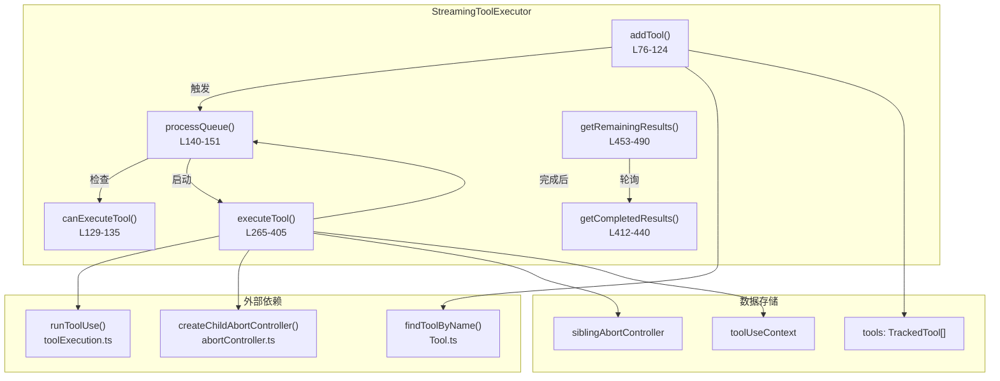
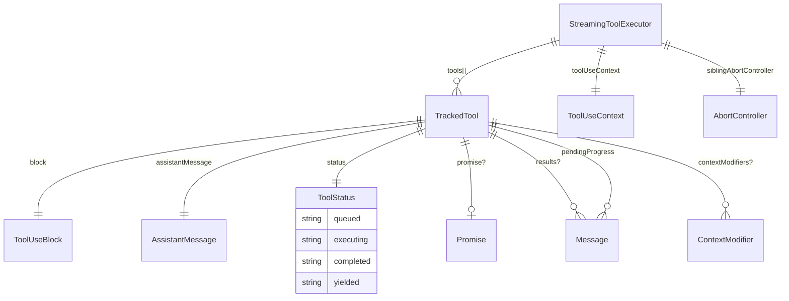
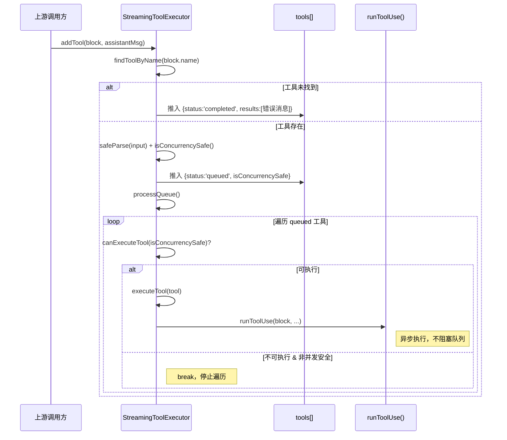
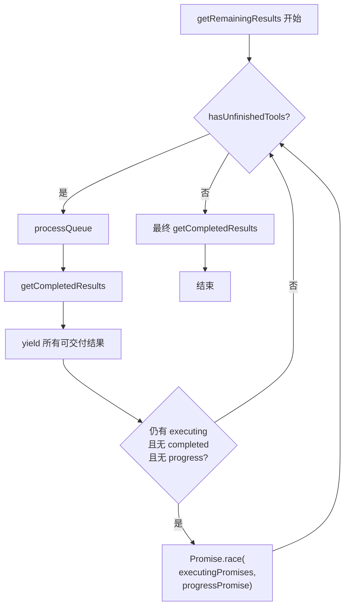
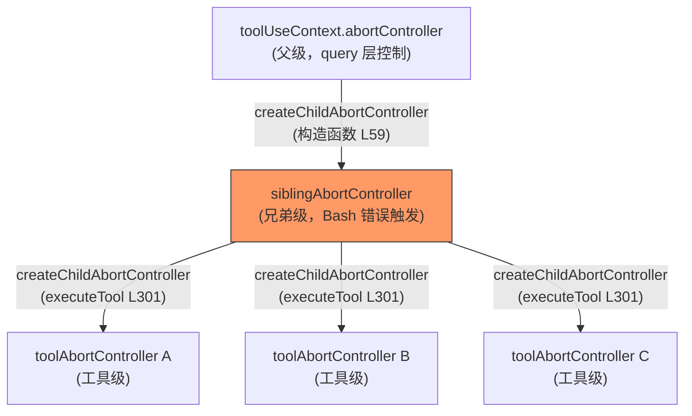
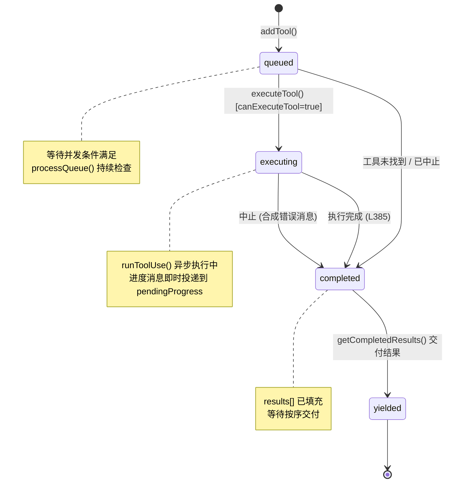

# 流式工具执行器 (StreamingToolExecutor) 子模块详细设计文档

## 文档信息
| 项目 | 内容 |
|------|------|
| 模块名称 | StreamingToolExecutor (流式工具执行器) |
| 文档版本 | v1.0-20260401 |
| 生成日期 | 2026-04-01 |
| 生成方式 | 代码反向工程 |
| 源文件 | `restored-src/src/services/tools/StreamingToolExecutor.ts` (531行) |

## 1. 模块概述

### 1.1 模块职责

StreamingToolExecutor 负责在 Claude Code 的工具调用链中，以**流式方式**接收并**并发执行**工具调用，同时维护严格的并发安全约束和有序结果输出。其核心职责包括：

1. **流式接收**：在 LLM 响应流式到达时，逐个接收工具调用块 (`ToolUseBlock`)，无需等待完整响应
2. **并发调度**：根据工具的 `isConcurrencySafe` 属性，决定工具是并行执行还是独占执行
3. **有序输出**：尽管工具可能并行执行，结果仍按工具接收顺序 (FIFO) 交付给调用方
4. **错误级联**：当 Bash 工具出错时，通过兄弟中止控制器 (siblingAbortController) 取消所有并行兄弟工具
5. **进度消息即时投递**：工具执行过程中的 progress 消息不缓冲，立即交付
6. **中断处理**：支持用户中断 (ESC) 和流式回退 (streaming fallback) 两种取消场景

### 1.2 模块边界

```
上游调用方 (query.ts / 查询引擎)
    │
    ▼
┌───────────────────────────────┐
│   StreamingToolExecutor       │  ◄── 本模块
│   - addTool()                 │
│   - getCompletedResults()     │
│   - getRemainingResults()     │
│   - getUpdatedContext()       │
│   - discard()                 │
└──────────┬────────────────────┘
           │ 委托执行
           ▼
    runToolUse() (toolExecution.ts)
           │
           ▼
    具体工具实现 (BashTool, FileEditTool, ...)
```

**输入边界**：接收 `ToolUseBlock`（来自 Anthropic SDK 的工具调用描述）和 `AssistantMessage`（关联的助手消息）

**输出边界**：产出 `MessageUpdate`（包含 `Message` 和可选的 `ToolUseContext` 更新），通过生成器 (Generator/AsyncGenerator) 交付

**不负责**：
- 工具定义与注册（由 `Tool.ts` 和各工具模块负责）
- 权限校验（由 `useCanUseTool` hook 负责，本模块仅传递）
- API 通信（由上游 query 层负责）

## 2. 架构设计

### 2.1 模块架构图



### 2.2 源文件组织

| 源文件 | 行数 | 说明 |
|--------|------|------|
| `services/tools/StreamingToolExecutor.ts` | 531 | 本模块唯一源文件，包含类定义和辅助函数 |

文件内部组织：

| 区域 | 行范围 | 内容 |
|------|--------|------|
| L1-12 | 导入声明 | 外部类型和函数导入 |
| L14-17 | `MessageUpdate` 类型 | 输出消息更新结构 |
| L19 | `ToolStatus` 类型 | 工具状态枚举联合 |
| L21-32 | `TrackedTool` 类型 | 工具跟踪记录结构 |
| L40-518 | `StreamingToolExecutor` 类 | 主类实现 |
| L521-530 | `markToolUseAsComplete()` | 模块级辅助函数 |

### 2.3 外部依赖

| 依赖 | 来源 | 用途 |
|------|------|------|
| `ToolUseBlock` | `@anthropic-ai/sdk` | 工具调用块的类型定义 |
| `createUserMessage`, `REJECT_MESSAGE`, `withMemoryCorrectionHint` | `src/utils/messages.js` | 构造用户消息（含错误消息） |
| `CanUseToolFn` | `src/hooks/useCanUseTool.js` | 工具权限检查函数类型 |
| `findToolByName`, `Tools`, `ToolUseContext` | `src/Tool.js` | 工具查找和上下文类型 |
| `BASH_TOOL_NAME` | `src/tools/BashTool/toolName.js` | Bash 工具名称常量 |
| `AssistantMessage`, `Message` | `src/types/message.js` | 消息类型定义 |
| `createChildAbortController` | `src/utils/abortController.js` | 创建子级中止控制器 |
| `runToolUse` | `./toolExecution.js` | 工具执行核心函数（返回 AsyncGenerator） |

## 3. 数据结构设计

### 3.1 核心数据结构

#### ToolStatus (L19)

```typescript
type ToolStatus = 'queued' | 'executing' | 'completed' | 'yielded'
```

四状态联合类型，表示工具在生命周期中的位置。

#### TrackedTool (L21-32)

```typescript
type TrackedTool = {
  id: string                   // 工具调用唯一标识（来自 ToolUseBlock.id）
  block: ToolUseBlock          // 原始工具调用块（含 name、input 等）
  assistantMessage: AssistantMessage  // 关联的助手消息
  status: ToolStatus           // 当前状态
  isConcurrencySafe: boolean   // 是否可安全并发执行
  promise?: Promise<void>      // 执行 Promise（executing 状态时存在）
  results?: Message[]          // 执行结果消息数组（completed 后填充）
  pendingProgress: Message[]   // 待投递的进度消息（执行中即时累积）
  contextModifiers?: Array<(context: ToolUseContext) => ToolUseContext>  // 上下文修改器
}
```

#### MessageUpdate (L14-17)

```typescript
type MessageUpdate = {
  message?: Message            // 要交付的消息
  newContext?: ToolUseContext   // 更新后的工具使用上下文
}
```

### 3.2 数据关系图



## 4. 接口设计

### 4.1 对外接口（公共方法）

#### `constructor(toolDefinitions, canUseTool, toolUseContext)` (L53-62)

```typescript
constructor(
  private readonly toolDefinitions: Tools,
  private readonly canUseTool: CanUseToolFn,
  toolUseContext: ToolUseContext,
)
```

初始化执行器。创建 `siblingAbortController` 作为 `toolUseContext.abortController` 的子级控制器。

#### `addTool(block, assistantMessage)` (L76-124)

```typescript
addTool(block: ToolUseBlock, assistantMessage: AssistantMessage): void
```

向执行队列添加一个工具。流程：
1. 通过 `findToolByName` 查找工具定义；若未找到，直接标记为 `completed` 并填充错误结果（L78-101）
2. 使用 `toolDefinition.inputSchema.safeParse` 校验输入，调用 `toolDefinition.isConcurrencySafe()` 判断并发安全性（L104-113）
3. 推入 `tools` 数组，初始状态为 `queued`（L114-121）
4. 触发 `processQueue()` 尝试立即执行（L123）

#### `discard()` (L69-71)

```typescript
discard(): void
```

丢弃所有待执行和执行中的工具。设置 `discarded = true` 标志，后续所有工具将收到 `streaming_fallback` 合成错误。用于流式回退场景。

#### `*getCompletedResults()` (L412-440)

```typescript
*getCompletedResults(): Generator<MessageUpdate, void>
```

同步生成器。按工具入队顺序遍历 `tools` 数组：
- 始终立即交付 `pendingProgress` 中的进度消息（L419-421）
- 对 `completed` 状态的工具，交付其 `results` 并将状态转为 `yielded`（L428-435）
- 遇到正在执行的非并发安全工具时停止遍历（L436-438），保证有序性

#### `async *getRemainingResults()` (L453-490)

```typescript
async *getRemainingResults(): AsyncGenerator<MessageUpdate, void>
```

异步生成器。等待所有未完成工具执行完毕，逐步交付结果：
- 循环调用 `processQueue()` + `getCompletedResults()` 直到所有工具 `yielded`（L458-485）
- 当无完成结果且无进度消息时，使用 `Promise.race` 等待任一执行中工具完成或进度可用（L471-484）

#### `getUpdatedContext()` (L516-518)

```typescript
getUpdatedContext(): ToolUseContext
```

返回当前 `toolUseContext`（可能已被上下文修改器修改过）。

### 4.2 内部方法

| 方法 | 行号 | 签名 | 说明 |
|------|------|------|------|
| `canExecuteTool` | L129-135 | `(isConcurrencySafe: boolean): boolean` | 并发调度决策函数 |
| `processQueue` | L140-151 | `(): Promise<void>` | 遍历队列，启动可执行的工具 |
| `createSyntheticErrorMessage` | L153-205 | `(toolUseId, reason, assistantMessage): Message` | 创建合成错误消息 |
| `getAbortReason` | L210-230 | `(tool: TrackedTool): string \| null` | 判断工具应被取消的原因 |
| `getToolInterruptBehavior` | L233-241 | `(tool: TrackedTool): 'cancel' \| 'block'` | 获取工具的中断行为策略 |
| `getToolDescription` | L243-252 | `(tool: TrackedTool): string` | 生成工具的人类可读描述（用于错误消息） |
| `updateInterruptibleState` | L254-260 | `(): void` | 更新上下文中的可中断状态 |
| `executeTool` | L265-405 | `(tool: TrackedTool): Promise<void>` | 执行单个工具并收集结果 |
| `hasPendingProgress` | L445-447 | `(): boolean` | 检查是否有待投递的进度消息 |
| `hasCompletedResults` | L495-497 | `(): boolean` | 检查是否有已完成待交付的结果 |
| `hasExecutingTools` | L500-502 | `(): boolean` | 检查是否有正在执行的工具 |
| `hasUnfinishedTools` | L509-511 | `(): boolean` | 检查是否有未完成的工具 |

#### 模块级辅助函数

```typescript
// L521-530
function markToolUseAsComplete(toolUseContext: ToolUseContext, toolUseID: string): void
```

从 `toolUseContext` 的 `inProgressToolUseIDs` 集合中移除指定工具 ID。

## 5. 核心流程设计

### 5.1 工具添加与队列处理流程



### 5.2 并发调度算法 canExecuteTool

```typescript
// L129-135
private canExecuteTool(isConcurrencySafe: boolean): boolean {
  const executingTools = this.tools.filter(t => t.status === 'executing')
  return (
    executingTools.length === 0 ||
    (isConcurrencySafe && executingTools.every(t => t.isConcurrencySafe))
  )
}
```

调度规则矩阵：

| 当前执行中的工具 | 待执行工具 | 是否允许 |
|-----------------|-----------|---------|
| 无 | 任意 | 允许 |
| 全部并发安全 | 并发安全 | 允许 |
| 全部并发安全 | 非并发安全 | 拒绝 |
| 存在非并发安全 | 任意 | 拒绝 |

**关键约束**：`processQueue()` 遍历中遇到不可执行的非并发安全工具时立即 `break`（L148），确保非并发工具按顺序执行。并发安全的工具即使被跳过也会继续遍历后续工具。

### 5.3 结果收集流程 (getCompletedResults + getRemainingResults)



`getCompletedResults()` 的遍历逻辑保证有序性：
- 按 `tools` 数组顺序遍历
- 进度消息无条件即时交付
- `completed` 工具的结果按序交付并标记 `yielded`
- 遇到 `executing` 状态的非并发安全工具时 `break`，因为其后续工具的结果必须等待

### 5.4 兄弟中止机制 siblingAbortController



**级联逻辑** (L358-363)：
1. Bash 工具执行出错 → `hasErrored = true`，`siblingAbortController.abort('sibling_error')`
2. `siblingAbortController` 的中止信号传播到所有子级 `toolAbortController`
3. 各工具在下一次 `getAbortReason()` 检查时收到 `sibling_error`，产生合成错误消息
4. **关键**：中止 `siblingAbortController` 不会影响父级 `toolUseContext.abortController`，query 循环不会因此终止当前对话轮次

**工具级中止器的向上冒泡** (L305-317)：
- `toolAbortController` 被中止时（非 `sibling_error` 原因），会将中止传播到 `toolUseContext.abortController`
- 这处理权限拒绝等场景（如 PermissionContext.ts 中的 `cancelAndAbort`），确保 query 循环正确结束轮次
- 仅在 `siblingAbortController` 未 `discarded` 且原因不是 `sibling_error` 时才向上冒泡

**仅 Bash 触发级联的设计决策** (L358-363 注释)：
> "Only Bash errors cancel siblings. Bash commands often have implicit dependency chains (e.g. mkdir fails -> subsequent commands pointless). Read/WebFetch/etc are independent -- one failure shouldn't nuke the rest."

## 6. 状态管理

### 6.1 状态定义

#### 工具状态 (ToolStatus)

| 状态 | 含义 | 进入条件 |
|------|------|---------|
| `queued` | 已入队等待执行 | `addTool()` 推入队列 |
| `executing` | 正在执行 | `executeTool()` 开始 (L266) |
| `completed` | 执行完成，结果待交付 | 工具执行结束 (L385) 或工具未找到 (L83) |
| `yielded` | 结果已交付 | `getCompletedResults()` 中交付后 (L429) |

#### 执行器全局状态

| 字段 | 类型 | 初始值 | 说明 |
|------|------|--------|------|
| `tools` | `TrackedTool[]` | `[]` | 所有已接收工具的有序列表 |
| `toolUseContext` | `ToolUseContext` | 构造参数 | 当前工具使用上下文（可变） |
| `hasErrored` | `boolean` | `false` | 是否有 Bash 工具出错 |
| `erroredToolDescription` | `string` | `''` | 出错工具的描述（用于错误消息） |
| `siblingAbortController` | `AbortController` | 构造时创建 | 兄弟中止控制器 |
| `discarded` | `boolean` | `false` | 是否已丢弃（流式回退） |
| `progressAvailableResolve` | `(() => void)?` | `undefined` | 进度可用信号的 resolve 函数 |

### 6.2 状态转换图



## 7. 错误处理设计

### 7.1 错误分类与处理

| 错误场景 | 检测位置 | 处理方式 |
|----------|---------|---------|
| 工具未找到 | `addTool()` L78 | 直接创建错误结果消息，状态设为 `completed` |
| 输入校验失败 | `addTool()` L104 | `safeParse` 失败时，`isConcurrencySafe = false`，工具仍入队执行（具体错误由 `runToolUse` 处理） |
| Bash 工具执行错误 | `executeTool()` L354-363 | 设置 `hasErrored`，中止 `siblingAbortController`，级联取消所有兄弟工具 |
| 非 Bash 工具执行错误 | `executeTool()` L354 | `isErrorResult=true` 但不触发级联，仅记录错误结果 |
| 兄弟工具错误取消 | `getAbortReason()` L216 | 返回 `sibling_error`，生成合成错误消息 |
| 用户中断 | `getAbortReason()` L219-228 | 根据 `interruptBehavior` 返回 `user_interrupted` 或 `null` |
| 流式回退丢弃 | `getAbortReason()` L213-215 | 返回 `streaming_fallback` |
| `isConcurrencySafe()` 异常 | `addTool()` L109-110 | `catch` 捕获，默认 `false`（保守策略） |
| `interruptBehavior()` 异常 | `getToolInterruptBehavior()` L238-239 | `catch` 捕获，默认 `'block'` |

### 7.2 合成错误消息 (createSyntheticErrorMessage)

三种错误原因对应不同的消息格式（L153-205）：

| 原因 | 消息内容 | 特殊处理 |
|------|---------|---------|
| `user_interrupted` | `REJECT_MESSAGE` + 记忆修正提示 | UI 显示"User rejected edit"而非通用错误 |
| `streaming_fallback` | `"Streaming fallback - tool execution discarded"` | 无 |
| `sibling_error` | `"Cancelled: parallel tool call {desc} errored"` | 包含出错工具描述 |

### 7.3 防重复错误机制

`executeTool()` 内部使用 `thisToolErrored` 标志（L330）防止同一工具同时收到：
- 自身产生的实际错误结果
- 由自身错误触发的兄弟取消合成错误

## 8. 并发设计

### 8.1 并发模型

本模块采用**协作式并发**模型，基于 JavaScript 单线程事件循环的特性：

1. **无锁设计**：所有状态修改都在同步代码路径中完成，无需互斥锁
2. **Promise 驱动**：工具执行通过 `Promise` 并行化，完成后触发队列重新处理
3. **生成器交付**：使用同步 Generator（`getCompletedResults`）和异步 AsyncGenerator（`getRemainingResults`）实现惰性结果交付

并发执行模式：

```
时间轴 →

场景1: 全并发安全工具
  ToolA(safe):  [====执行====]
  ToolB(safe):    [====执行====]
  ToolC(safe):      [====执行====]

场景2: 混合工具
  ToolA(safe):  [====执行====]
  ToolB(safe):    [====执行====]
  ToolC(unsafe):                  [====执行====]  ← 等待 A、B 完成
  ToolD(safe):                                     [====执行====]  ← 等待 C 完成

场景3: Bash 错误级联
  BashA:   [====执行==X]          ← 出错
  ToolB:     [====执--]           ← 收到 sibling_error，中止
  ToolC:              [取消]      ← 尚未开始，合成错误
```

### 8.2 异步协调机制

#### 队列自驱动

`processQueue()` 通过两个触发点实现自驱动循环：
1. `addTool()` 调用后立即触发（L123）
2. 任意工具执行完成后通过 `promise.finally()` 触发（L402-404）

```typescript
// L398-404
const promise = collectResults()
tool.promise = promise

void promise.finally(() => {
  void this.processQueue()
})
```

#### 进度消息唤醒

`getRemainingResults()` 在等待执行中工具完成时，可能因进度消息到达而提前唤醒：

```typescript
// L477-479 — 注册进度等待
const progressPromise = new Promise<void>(resolve => {
  this.progressAvailableResolve = resolve
})

// L369-374 — 工具执行中产生进度时触发
if (this.progressAvailableResolve) {
  this.progressAvailableResolve()
  this.progressAvailableResolve = undefined
}
```

这确保 UI 层能及时收到进度更新（如 Bash 命令输出、文件编辑进度等），无需等待工具完全执行完毕。

#### AbortController 层级

三层 AbortController 架构（见 5.4 节）通过 `createChildAbortController` 建立父子关系：
- 父级中止自动传播到子级（通过 `WeakRef` 防止内存泄漏）
- 子级中止默认不影响父级
- 工具级控制器的特殊 `abort` 事件监听器实现选择性向上冒泡（L305-317）

## 9. 设计约束与决策

### 9.1 设计约束

1. **有序交付约束**：尽管工具可并行执行，结果必须按工具接收顺序交付。`getCompletedResults()` 遇到执行中的非并发安全工具时 `break`（L436-438），阻止后续工具结果的提前交付。

2. **上下文修改器限制** (L389-395)：当前仅支持非并发安全工具的上下文修改器。并发工具的上下文修改器不会被应用。代码中有明确注释说明此为已知限制。

3. **Bash 特殊地位**：仅 Bash 工具错误触发兄弟级联取消。设计理由：Bash 命令常有隐式依赖链（如 `mkdir` 失败则后续命令无意义），而 Read/WebFetch 等工具相互独立。

4. **中断行为二分法**：工具的 `interruptBehavior` 只有 `'cancel'`（可取消）和 `'block'`（不可取消）两种，默认 `'block'`（保守策略）。

### 9.2 关键设计决策

| 决策 | 选择 | 理由 |
|------|------|------|
| 并发安全判定时机 | `addTool()` 时静态判定 | 避免执行时动态判定的复杂性，输入解析一次即可 |
| 进度消息投递策略 | 即时投递，不等待工具完成 | UI 实时反馈需求 |
| 错误级联范围 | 仅 Bash | 平衡错误传播与独立工具的容错性 |
| `discard()` 实现 | 设置标志位，不主动中止 | 轻量实现，后续工具在检查点自然终止 |
| AbortController 冒泡 | 选择性冒泡（排除 sibling_error） | 避免兄弟错误导致整个 query 轮次终止 |
| `isConcurrencySafe` 解析失败默认值 | `false` | 保守策略，未知工具按非并发安全处理 |

## 10. 设计评估

### 10.1 优势

1. **流式并发**：工具在 LLM 流式响应过程中即开始执行，最大化利用等待时间，显著降低端到端延迟
2. **安全的并发模型**：通过 `isConcurrencySafe` 标志和调度算法，在提升吞吐量的同时避免工具间冲突
3. **优雅的错误级联**：Bash 错误的兄弟级联机制，避免无意义的后续命令执行，同时不影响 query 层状态
4. **内存安全**：AbortController 层级使用 `WeakRef`，防止父子关系导致的内存泄漏
5. **进度即时投递**：通过 `progressAvailableResolve` 回调机制实现进度消息的零延迟交付

### 10.2 潜在风险

1. **上下文修改器并发限制**：并发工具的上下文修改器被静默忽略，如果未来有并发工具需要修改上下文，可能导致难以排查的 bug
2. **队列遍历效率**：`processQueue()` 和 `getCompletedResults()` 每次都从头遍历 `tools` 数组，在大量工具调用场景下可能有性能影响（但实际场景中工具数量通常较少）
3. **状态检查函数无缓存**：`hasExecutingTools()`、`hasCompletedResults()` 等方法每次调用都遍历数组执行 `some()`，存在重复计算
4. **单点进度回调**：`progressAvailableResolve` 仅保存一个回调，如果在回调触发前有新的等待注册，旧回调会被覆盖（但在当前代码流中不会发生此问题，因为只有 `getRemainingResults` 一个消费者）

### 10.3 扩展性

- 新增并发安全工具只需在工具定义中正确实现 `isConcurrencySafe()` 方法，无需修改执行器
- 错误级联策略如需扩展到其他工具类型，只需修改 L358-363 的条件判断
- 进度消息机制已通用化，任何工具返回 `type: 'progress'` 消息均可即时投递
