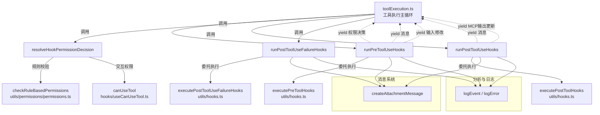
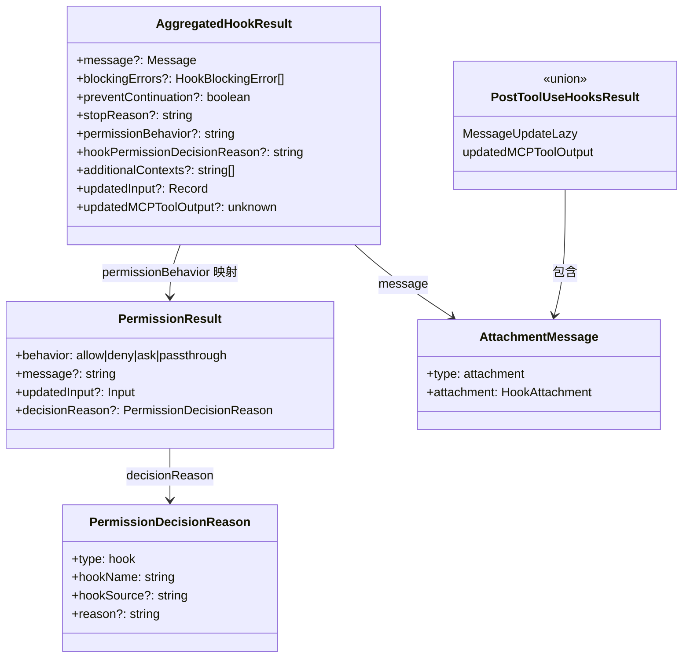
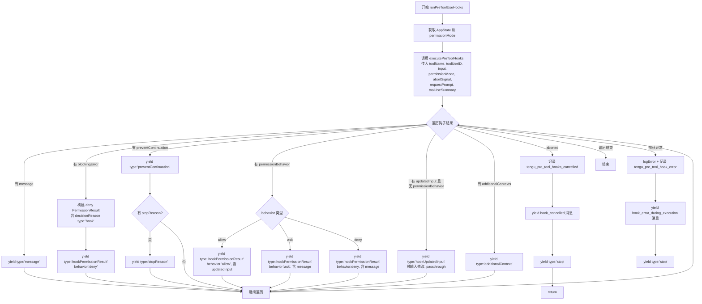
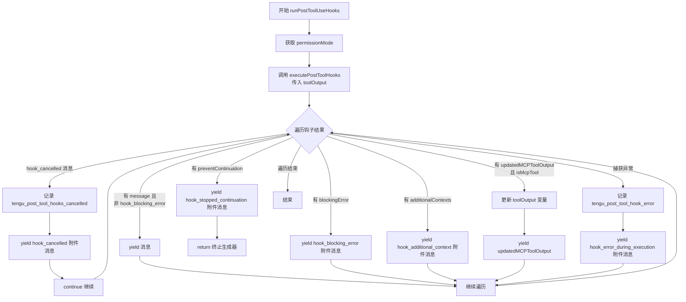
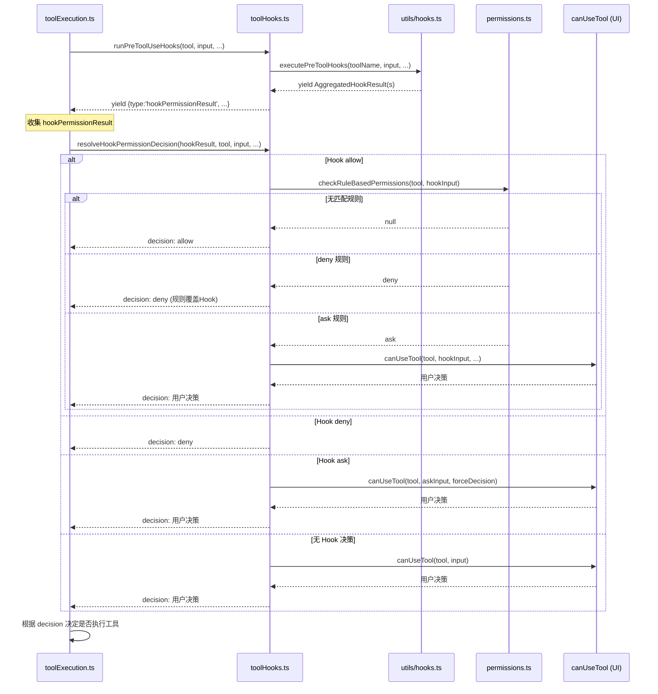

# 工具钩子调用层 子模块详细设计文档

## 文档信息
| 项目 | 内容 |
|------|------|
| 模块名称 | 工具钩子调用层 (Tool Hooks) |
| 文档版本 | v1.0-20260401 |
| 生成日期 | 2026-04-01 |
| 生成方式 | 代码反向工程 |

## 1. 模块概述

### 1.1 模块职责

工具钩子调用层（`toolHooks.ts`）是工具执行流程中**钩子（Hook）系统与工具调用链之间的桥接层**。其核心职责包括：

1. **前置钩子执行**：在工具实际执行前运行 `PreToolUse` 钩子，收集权限决策、输入修改、阻断信号等结果
2. **后置钩子执行**：在工具成功执行后运行 `PostToolUse` 钩子，处理阻断、上下文注入、MCP 工具输出更新等
3. **失败后置钩子执行**：在工具执行失败后运行 `PostToolUseFailure` 钩子
4. **权限决策解析**：通过 `resolveHookPermissionDecision` 函数，将钩子的权限结果与规则权限系统（`settings.json` 中的 deny/ask 规则）进行协调，确保安全不变量：**钩子的 `allow` 决策不能绕过 settings.json 的 deny/ask 规则**

### 1.2 模块边界

- **上游调用者**：`toolExecution.ts`（工具执行主循环），在工具执行前后分别调用本模块的三个异步生成器函数及权限决策解析函数
- **下游依赖**：
  - `utils/hooks.ts` 中的 `executePreToolHooks`、`executePostToolHooks`、`executePostToolUseFailureHooks` — 实际的钩子配置解析与 shell 命令执行
  - `utils/permissions/permissions.ts` 中的 `checkRuleBasedPermissions` — 规则权限校验
  - `utils/attachments.ts` 中的 `createAttachmentMessage` — 消息构建
- **不负责**：
  - 钩子的配置加载与 shell 命令执行（由 `utils/hooks.ts` 负责）
  - 工具本身的执行逻辑（由 `toolExecution.ts` 负责）
  - 权限规则的管理与持久化（由 `utils/permissions/` 负责）

## 2. 架构设计

### 2.1 模块架构图



### 2.2 源文件组织

| 文件路径 | 行数 | 职责 |
|----------|------|------|
| `src/services/tools/toolHooks.ts` | 约 651 行 | 工具钩子调用层全部实现 |

文件内包含四个导出成员：
- 类型 `PostToolUseHooksResult`（第 35-38 行）
- 异步生成器 `runPostToolUseHooks`（第 39-191 行）
- 异步生成器 `runPostToolUseFailureHooks`（第 193-319 行）
- 异步函数 `resolveHookPermissionDecision`（第 332-433 行）
- 异步生成器 `runPreToolUseHooks`（第 435-650 行）

### 2.3 外部依赖

| 依赖模块 | 导入内容 | 用途 |
|----------|----------|------|
| `src/services/analytics/` | `logEvent`, `sanitizeToolNameForAnalytics` | 遥测打点 |
| `src/hooks/useCanUseTool.js` | `CanUseToolFn` 类型 | 权限决策交互函数类型 |
| `src/Tool.ts` | `AnyObject`, `Tool`, `ToolUseContext` | 工具及上下文类型 |
| `src/types/hooks.ts` | `HookProgress` | 钩子进度类型 |
| `src/types/message.ts` | `AssistantMessage`, `AttachmentMessage`, `ProgressMessage` | 消息类型 |
| `src/types/permissions.ts` | `PermissionDecision` | 权限决策类型 |
| `src/utils/attachments.ts` | `createAttachmentMessage` | 创建附件消息 |
| `src/utils/debug.ts` | `logForDebugging` | 调试日志 |
| `src/utils/hooks.ts` | `executePreToolHooks`, `executePostToolHooks`, `executePostToolUseFailureHooks`, `getPreToolHookBlockingMessage` | 钩子执行引擎 |
| `src/utils/log.ts` | `logError` | 错误日志 |
| `src/utils/permissions/PermissionResult.ts` | `getRuleBehaviorDescription`, `PermissionDecisionReason`, `PermissionResult` | 权限结果类型与辅助函数 |
| `src/utils/permissions/permissions.ts` | `checkRuleBasedPermissions` | 规则权限校验 |
| `src/utils/toolErrors.ts` | `formatError` | 错误格式化 |
| `src/services/mcp/utils.ts` | `isMcpTool` | MCP 工具判断 |

## 3. 数据结构设计

### 3.1 核心数据结构

#### 3.1.1 PostToolUseHooksResult（第 35-38 行）

后置钩子的 yield 结果类型，是一个联合类型：

```typescript
export type PostToolUseHooksResult<Output> =
  | MessageUpdateLazy<AttachmentMessage | ProgressMessage<HookProgress>>
  | { updatedMCPToolOutput: Output }
```

- 分支一：携带消息更新（包括阻断错误、取消通知、附加上下文等附件消息）
- 分支二：携带 MCP 工具输出更新（仅当工具为 MCP 工具时有效）

#### 3.1.2 PreToolUseHooks yield 类型（第 446-461 行）

前置钩子的 yield 结果是一个标签联合类型（tagged union），包含六种变体：

```typescript
| { type: 'message'; message: MessageUpdateLazy<...> }
| { type: 'hookPermissionResult'; hookPermissionResult: PermissionResult }
| { type: 'hookUpdatedInput'; updatedInput: Record<string, unknown> }
| { type: 'preventContinuation'; shouldPreventContinuation: boolean }
| { type: 'stopReason'; stopReason: string }
| { type: 'additionalContext'; message: MessageUpdateLazy<AttachmentMessage> }
| { type: 'stop' }
```

| 变体 | 说明 |
|------|------|
| `message` | 钩子执行过程中产生的消息（进度、取消、错误等） |
| `hookPermissionResult` | 钩子做出的权限决策（allow/deny/ask），由上游调用 `resolveHookPermissionDecision` 进一步处理 |
| `hookUpdatedInput` | 钩子修改了工具输入但未做权限决策（passthrough 场景） |
| `preventContinuation` | 钩子要求阻止后续执行 |
| `stopReason` | 阻止执行的原因描述 |
| `additionalContext` | 钩子附加的上下文信息 |
| `stop` | 立即终止钩子处理（因中止信号或异常） |

#### 3.1.3 AggregatedHookResult（来自 `types/hooks.ts`，第 277-290 行）

钩子执行引擎返回给本模块的聚合结果：

```typescript
export type AggregatedHookResult = {
  message?: Message
  blockingErrors?: HookBlockingError[]
  preventContinuation?: boolean
  stopReason?: string
  hookPermissionDecisionReason?: string
  permissionBehavior?: PermissionResult['behavior']  // 'allow'|'deny'|'ask'|'passthrough'
  additionalContexts?: string[]
  initialUserMessage?: string
  updatedInput?: Record<string, unknown>
  updatedMCPToolOutput?: unknown
  permissionRequestResult?: PermissionRequestResult
  retry?: boolean
}
```

#### 3.1.4 PermissionDecisionReason 中的 hook 变体（来自 `types/permissions.ts`，第 289-294 行）

```typescript
{
  type: 'hook'
  hookName: string       // 格式: "PreToolUse:<toolName>"
  hookSource?: string    // 钩子来源标识
  reason?: string        // 决策理由
}
```

#### 3.1.5 PermissionResult（来自 `types/permissions.ts`，第 251-266 行）

权限结果类型，是 `PermissionDecision`（allow/ask/deny）加上 `passthrough` 的联合类型：

```typescript
export type PermissionResult<Input> =
  | PermissionDecision<Input>       // allow | ask | deny
  | {
      behavior: 'passthrough'
      message: string
      decisionReason?: PermissionDecisionReason
      suggestions?: PermissionUpdate[]
      blockedPath?: string
      pendingClassifierCheck?: PendingClassifierCheck
    }
```

### 3.2 数据关系图



## 4. 接口设计

### 4.1 对外接口

#### 4.1.1 runPreToolUseHooks（第 435-650 行）

```typescript
export async function* runPreToolUseHooks(
  toolUseContext: ToolUseContext,
  tool: Tool,
  processedInput: Record<string, unknown>,
  toolUseID: string,
  messageId: string,
  requestId: string | undefined,
  mcpServerType: McpServerType,
  mcpServerBaseUrl: string | undefined,
): AsyncGenerator<
  | { type: 'message'; message: MessageUpdateLazy<AttachmentMessage | ProgressMessage<HookProgress>> }
  | { type: 'hookPermissionResult'; hookPermissionResult: PermissionResult }
  | { type: 'hookUpdatedInput'; updatedInput: Record<string, unknown> }
  | { type: 'preventContinuation'; shouldPreventContinuation: boolean }
  | { type: 'stopReason'; stopReason: string }
  | { type: 'additionalContext'; message: MessageUpdateLazy<AttachmentMessage> }
  | { type: 'stop' }
>
```

**功能**：在工具执行前运行所有已注册的 `PreToolUse` 钩子，逐个 yield 结果。

**参数说明**：

| 参数 | 类型 | 说明 |
|------|------|------|
| `toolUseContext` | `ToolUseContext` | 工具执行上下文（含 AppState 获取、abort 控制器等） |
| `tool` | `Tool` | 当前工具定义 |
| `processedInput` | `Record<string, unknown>` | 工具输入参数 |
| `toolUseID` | `string` | 当前 tool_use block 的 ID |
| `messageId` | `string` | 所属消息 ID（用于遥测） |
| `requestId` | `string \| undefined` | API 请求 ID |
| `mcpServerType` | `McpServerType` | MCP 服务器类型 |
| `mcpServerBaseUrl` | `string \| undefined` | MCP 服务器基础 URL |

#### 4.1.2 runPostToolUseHooks（第 39-191 行）

```typescript
export async function* runPostToolUseHooks<Input extends AnyObject, Output>(
  toolUseContext: ToolUseContext,
  tool: Tool<Input, Output>,
  toolUseID: string,
  messageId: string,
  toolInput: Record<string, unknown>,
  toolResponse: Output,
  requestId: string | undefined,
  mcpServerType: McpServerType,
  mcpServerBaseUrl: string | undefined,
): AsyncGenerator<PostToolUseHooksResult<Output>>
```

**功能**：在工具成功执行后运行 `PostToolUse` 钩子。支持阻断、附加上下文注入、MCP 输出更新、阻止后续继续等。

**额外参数**：

| 参数 | 类型 | 说明 |
|------|------|------|
| `toolInput` | `Record<string, unknown>` | 工具实际使用的输入 |
| `toolResponse` | `Output` | 工具执行的返回结果 |

#### 4.1.3 runPostToolUseFailureHooks（第 193-319 行）

```typescript
export async function* runPostToolUseFailureHooks<Input extends AnyObject>(
  toolUseContext: ToolUseContext,
  tool: Tool<Input, unknown>,
  toolUseID: string,
  messageId: string,
  processedInput: z.infer<Input>,
  error: string,
  isInterrupt: boolean | undefined,
  requestId: string | undefined,
  mcpServerType: McpServerType,
  mcpServerBaseUrl: string | undefined,
): AsyncGenerator<MessageUpdateLazy<AttachmentMessage | ProgressMessage<HookProgress>>>
```

**功能**：在工具执行失败后运行 `PostToolUseFailure` 钩子。与 `runPostToolUseHooks` 相似但不支持 `preventContinuation` 和 `updatedMCPToolOutput`。

**额外参数**：

| 参数 | 类型 | 说明 |
|------|------|------|
| `error` | `string` | 工具执行的错误信息 |
| `isInterrupt` | `boolean \| undefined` | 是否因中断导致的失败 |

#### 4.1.4 resolveHookPermissionDecision（第 332-433 行）

```typescript
export async function resolveHookPermissionDecision(
  hookPermissionResult: PermissionResult | undefined,
  tool: Tool,
  input: Record<string, unknown>,
  toolUseContext: ToolUseContext,
  canUseTool: CanUseToolFn,
  assistantMessage: AssistantMessage,
  toolUseID: string,
): Promise<{
  decision: PermissionDecision
  input: Record<string, unknown>
}>
```

**功能**：将 `PreToolUse` 钩子的权限结果解析为最终的 `PermissionDecision`。这是一个**安全关键函数**，封装了核心安全不变量。

**返回值**：包含最终权限决策和可能被钩子修改后的工具输入。

**参数说明**：

| 参数 | 类型 | 说明 |
|------|------|------|
| `hookPermissionResult` | `PermissionResult \| undefined` | 钩子返回的权限结果（可能为空，表示钩子未做决策） |
| `tool` | `Tool` | 工具定义 |
| `input` | `Record<string, unknown>` | 原始工具输入 |
| `toolUseContext` | `ToolUseContext` | 工具使用上下文 |
| `canUseTool` | `CanUseToolFn` | 交互式权限检查回调（会弹出权限确认对话框） |
| `assistantMessage` | `AssistantMessage` | 当前助手消息 |
| `toolUseID` | `string` | tool_use block ID |

### 4.2 内部函数

本模块没有独立的内部辅助函数。所有逻辑内联在四个导出函数中。内部处理逻辑主要是对 `AggregatedHookResult` 各字段的分支判断和消息构建。

## 5. 核心流程设计

### 5.1 PreToolUse 钩子执行流程



**关键设计点**：
- 第 466-476 行：调用 `executePreToolHooks` 时传入 `requestPrompt` 和 `tool.getToolUseSummary?.(processedInput)`，为钩子提供执行上下文
- 第 510-553 行：`permissionBehavior` 处理将钩子的 allow/ask/deny 映射为标准 `PermissionResult`，并附加 `decisionReason` 中的 `hookName` 和 `hookSource`
- 第 558-563 行：当钩子提供了 `updatedInput` 但没有做权限决策时，以 `hookUpdatedInput` 类型 yield，让正常权限流程继续处理修改后的输入
- 第 582-603 行：每次结果处理后检查 abort 信号，确保在中止时能及时停止

### 5.2 PostToolUse 钩子执行流程



**关键设计点**：
- 第 90-103 行：跳过 `hook_blocking_error` 类型的 `result.message`，避免与第 105-115 行的 `blockingError` 处理产生重复显示（修复 #31301）
- 第 118-130 行：`preventContinuation` 会立即 `return` 终止生成器，阻止后续工具调用链继续
- 第 146-151 行：`updatedMCPToolOutput` 仅在 `isMcpTool(tool)` 为真时生效，会更新本地 `toolOutput` 变量以供后续钩子使用

### 5.3 权限决策解析流程 resolveHookPermissionDecision

这是本模块中最关键的安全函数。其决策逻辑如下：

```mermaid
flowchart TD
    START[resolveHookPermissionDecision] --> CHECK_ALLOW{hookPermissionResult<br/>behavior === 'allow'?}

    CHECK_ALLOW -->|是| APPLY_INPUT[hookInput = updatedInput ?? input]
    APPLY_INPUT --> CHECK_INTERACTION{requiresUserInteraction<br/>且 updatedInput 存在?}
    CHECK_INTERACTION -->|是| SET_SATISFIED[interactionSatisfied = true]
    CHECK_INTERACTION -->|否| SET_NOT_SATISFIED[interactionSatisfied = false]

    SET_SATISFIED --> CHECK_GUARDS{requiresInteraction<br/>&& !interactionSatisfied<br/>|| requireCanUseTool?}
    SET_NOT_SATISFIED --> CHECK_GUARDS

    CHECK_GUARDS -->|是| CAN_USE_TOOL1[调用 canUseTool<br/>走完整权限流程]
    CAN_USE_TOOL1 --> RETURN1[返回 canUseTool 决策]

    CHECK_GUARDS -->|否| RULE_CHECK[调用 checkRuleBasedPermissions<br/>检查 settings.json 规则]
    RULE_CHECK --> RULE_RESULT{规则检查结果}

    RULE_RESULT -->|null 无匹配规则| LOG_ALLOW[记录 Hook 批准]
    LOG_ALLOW --> RETURN_ALLOW[返回 hookPermissionResult<br/>即 allow]

    RULE_RESULT -->|deny 规则| LOG_DENY_RULE[记录 deny 规则覆盖 Hook]
    LOG_DENY_RULE --> RETURN_DENY_RULE[返回 deny ruleCheck]

    RULE_RESULT -->|ask 规则| LOG_ASK_RULE[记录 ask 规则需要提示]
    LOG_ASK_RULE --> CAN_USE_TOOL2[调用 canUseTool]
    CAN_USE_TOOL2 --> RETURN2[返回 canUseTool 决策]

    CHECK_ALLOW -->|否| CHECK_DENY{behavior === 'deny'?}
    CHECK_DENY -->|是| LOG_HOOK_DENY[记录 Hook 拒绝]
    LOG_HOOK_DENY --> RETURN_DENY[返回 hookPermissionResult<br/>即 deny]

    CHECK_DENY -->|否| CHECK_ASK{behavior === 'ask'?}
    CHECK_ASK -->|是| SET_FORCE[forceDecision = hookPermissionResult<br/>askInput = updatedInput ?? input]
    SET_FORCE --> CAN_USE_TOOL3[调用 canUseTool<br/>传入 forceDecision]
    CAN_USE_TOOL3 --> RETURN3[返回决策]

    CHECK_ASK -->|否, undefined| NORMAL[正常权限流程<br/>canUseTool 无 forceDecision]
    NORMAL --> RETURN4[返回决策]
```

**安全不变量分析**（第 322-330 行注释）：

1. **Hook `allow` 不绕过 deny 规则**（第 373-391 行）：即使钩子批准了工具使用，仍调用 `checkRuleBasedPermissions`。若存在 deny 规则，deny 规则覆盖钩子决策。这确保了管理员配置的安全策略始终生效。

2. **Hook `allow` 不绕过 ask 规则**（第 392-406 行）：若存在 ask 规则，即使钩子批准也需弹出权限对话框。

3. **交互式工具的特殊处理**（第 344-370 行）：
   - 当工具需要用户交互（`requiresUserInteraction` 为真）时，钩子可通过提供 `updatedInput` 来"满足"交互需求（例如 headless 环境中代替用户输入）
   - 若钩子未提供 `updatedInput`，或上下文设置了 `requireCanUseTool`，则仍走完整 `canUseTool` 流程

4. **Hook `deny` 直接生效**（第 408-411 行）：deny 决策无需额外校验，直接返回。

5. **Hook `ask` 的透传**（第 415-432 行）：ask 决策通过 `forceDecision` 参数传递给 `canUseTool`，使对话框显示钩子提供的消息文本。

### 5.4 Hook 与权限系统的协调



**协调优先级**（从高到低）：
1. `settings.json` 中的 deny 规则 -- 始终优先
2. `settings.json` 中的 ask 规则 -- 要求用户确认
3. Hook 的 deny 决策 -- 直接拒绝
4. Hook 的 allow 决策 -- 仅在无 deny/ask 规则时生效
5. Hook 的 ask 决策 -- 走用户确认流程，消息透传
6. 无 Hook 决策 -- 走默认权限流程

## 6. 状态管理

本模块**不维护持久状态**。所有状态通过参数传入和 yield 返回。

运行时临时状态：
- **`toolOutput` 变量**（`runPostToolUseHooks` 第 55 行）：在后置钩子遍历过程中可被 `updatedMCPToolOutput` 更新，确保后续钩子看到最新的工具输出
- **`hookStartTime` / `postToolStartTime`**（各函数开头）：用于计算钩子执行耗时，仅用于遥测

状态获取方式：
- 通过 `toolUseContext.getAppState()` 获取全局应用状态
- 通过 `appState.toolPermissionContext.mode` 获取当前权限模式
- 通过 `toolUseContext.abortController.signal` 检查中止信号

## 7. 错误处理设计

本模块采用**双层 try-catch** 结构，确保钩子错误不会中断工具执行主流程：

### 7.1 内层 catch（单个钩子结果处理失败）

位置：`runPreToolUseHooks` 第 604-643 行，`runPostToolUseHooks` 第 152-186 行，`runPostToolUseFailureHooks` 第 281-314 行

处理策略：
1. 调用 `logError(error)` 记录错误
2. 使用 `logEvent` 发送遥测事件（如 `tengu_pre_tool_hook_error`），包含工具名、消息 ID、是否 MCP、耗时等元数据
3. yield 一个 `hook_error_during_execution` 附件消息，将格式化后的错误信息传递给用户
4. 在 `runPreToolUseHooks` 中额外 yield `{ type: 'stop' }` 终止钩子处理

### 7.2 外层 catch（钩子执行引擎整体失败）

位置：`runPreToolUseHooks` 第 645-649 行，`runPostToolUseHooks` 第 188-190 行，`runPostToolUseFailureHooks` 第 316-318 行

处理策略：
- 仅调用 `logError(error)` 记录错误
- 在 `runPreToolUseHooks` 中额外 yield `{ type: 'stop' }` 并 return
- 不向用户展示错误消息（静默失败），避免钩子系统故障影响核心功能

### 7.3 遥测事件汇总

| 事件名 | 触发时机 | 函数 |
|--------|----------|------|
| `tengu_pre_tool_hooks_cancelled` | 前置钩子被中止 | `runPreToolUseHooks` (第 583 行) |
| `tengu_pre_tool_hook_error` | 前置钩子处理异常 | `runPreToolUseHooks` (第 607 行) |
| `tengu_post_tool_hooks_cancelled` | 后置钩子被中止 | `runPostToolUseHooks` (第 72 行) |
| `tengu_post_tool_hook_error` | 后置钩子处理异常 | `runPostToolUseHooks` (第 154 行) |
| `tengu_post_tool_failure_hooks_cancelled` | 失败后置钩子被中止 | `runPostToolUseFailureHooks` (第 228 行) |
| `tengu_post_tool_failure_hook_error` | 失败后置钩子处理异常 | `runPostToolUseFailureHooks` (第 283 行) |

### 7.4 附件消息类型与错误场景映射

| 附件类型 | 场景 |
|----------|------|
| `hook_cancelled` | 钩子执行过程中被 abort 信号中止 |
| `hook_blocking_error` | 钩子通过 exit code 2 或 JSON `{decision:"block"}` 阻断工具 |
| `hook_error_during_execution` | 钩子结果处理中发生未预期异常 |
| `hook_stopped_continuation` | 后置钩子要求阻止后续对话继续（`preventContinuation`） |
| `hook_additional_context` | 钩子提供了额外的上下文信息注入到对话中 |

## 8. 设计约束与决策

### 8.1 安全约束

1. **deny/ask 规则优先于 Hook allow**（inc-4788 analog）：这是最关键的安全设计决策。`resolveHookPermissionDecision` 中明确在 Hook allow 之后仍执行 `checkRuleBasedPermissions`，确保管理员通过 `settings.json` 配置的安全策略不会被用户定义的钩子绕过。

2. **Hook deny 无条件生效**：与 allow 不同，deny 决策直接返回，无需额外校验。这遵循"安全侧倾斜"原则。

### 8.2 架构决策

1. **使用 AsyncGenerator 模式**：三个钩子执行函数均采用 `async function*` 生成器模式，允许逐步 yield 多个结果。这支持一个钩子事件对应多个已注册钩子的场景，调用者可逐个处理结果。

2. **标签联合类型区分 yield 结果**：`runPreToolUseHooks` 的 yield 类型使用 `type` 字段作为判别器，使上游调用者能够类型安全地处理不同类型的钩子结果。

3. **重复消息去除**（#31301 修复）：JSON 格式 `{decision:"block"}` 的钩子会在底层产生两种结果（`blockingError` 和 `hook_blocking_error` 消息），本模块在第 95-103 行和第 247-255 行跳过后者以避免重复显示。

4. **MCP 输出更新的局部作用域**：`updatedMCPToolOutput` 更新的 `toolOutput` 变量是函数局部变量，确保后续钩子能看到最新输出，但不会泄漏到函数外部（外部通过 yield 获取）。

### 8.3 扩展约束

1. **PostToolUseFailure 不支持 preventContinuation**：失败后置钩子不支持阻止后续继续，这是合理的——失败本身已经是一种终止。
2. **PostToolUseFailure 不支持 updatedMCPToolOutput**：失败场景下没有成功的输出可供修改。

## 9. 设计评估

### 9.1 优点

1. **安全性设计严谨**：`resolveHookPermissionDecision` 函数正确实现了"钩子不绕过规则"的安全不变量，并通过详细注释（第 322-330 行）说明了设计意图。`deny` 规则优先级高于 `allow` 钩子的设计符合最小权限原则。

2. **关注点分离清晰**：本模块专注于钩子结果的解释与消息构建，将钩子的实际执行（shell 命令调用）委托给 `utils/hooks.ts`，将规则权限校验委托给 `utils/permissions/permissions.ts`。

3. **健壮的错误处理**：双层 try-catch 确保单个钩子的失败不会影响其他钩子或工具执行主流程。所有错误均有遥测打点，便于问题排查。

4. **生成器模式的灵活性**：AsyncGenerator 允许调用者按需处理钩子结果，支持中途终止（如遇到 `stop` 类型），避免不必要的计算。

### 9.2 潜在改进点

1. **函数参数过多**：三个钩子函数均有 8-11 个参数，且多个参数（`requestId`、`mcpServerType`、`mcpServerBaseUrl`）仅用于遥测。可考虑引入参数对象或上下文结构体来简化签名。

2. **三个函数之间存在大量代码重复**：`runPostToolUseHooks` 和 `runPostToolUseFailureHooks` 的结构高度相似（取消处理、阻断错误处理、附加上下文处理、异常处理），可提取共用的结果处理逻辑。

3. **mcpServerBaseUrl 参数未被使用**：三个函数均接收 `mcpServerBaseUrl` 参数但在函数体内从未引用，属于冗余参数（可能为预留接口或上游重构遗留）。

4. **resolveHookPermissionDecision 的复杂分支**：该函数有较深的条件嵌套，可考虑使用 early-return 模式或提取子函数来降低认知复杂度，尽管当前的注释已经很好地解释了每个分支。

### 9.3 安全性评估

- `resolveHookPermissionDecision` 是整个钩子系统的安全核心。其对 `checkRuleBasedPermissions` 的调用确保了纵深防御（defense in depth）：即使外部钩子被恶意利用返回 `allow`，settings.json 中的 deny 规则仍能阻止危险操作。
- 该函数被 `toolExecution.ts`（主查询循环）和可能的 REPL 工具包装器共享（见第 329 行注释），确保权限语义在不同调用路径上保持一致。
