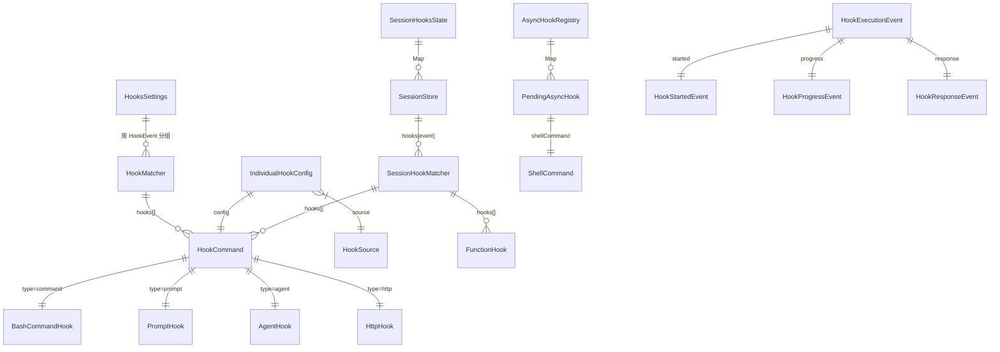
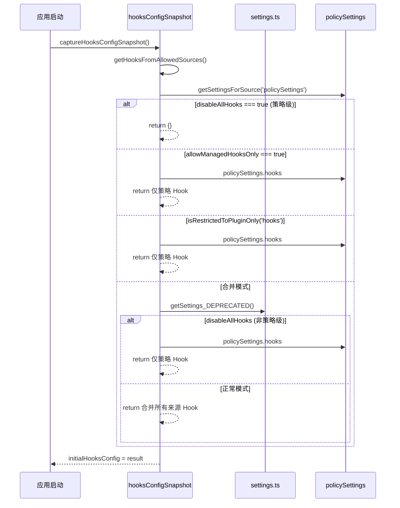
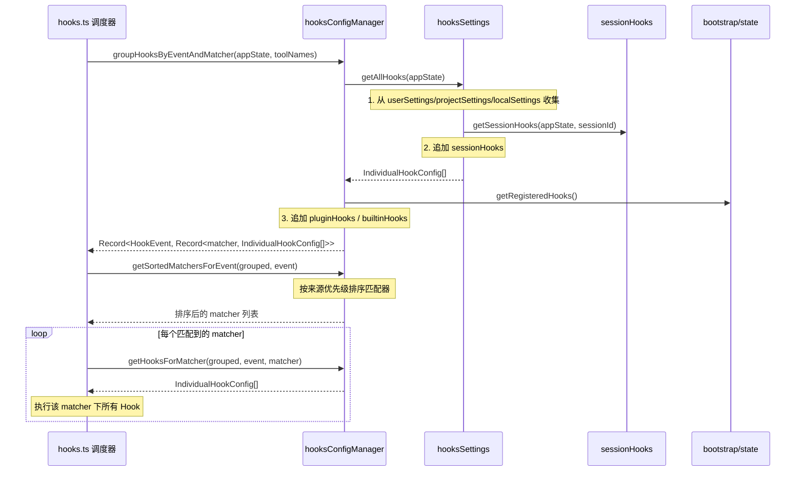
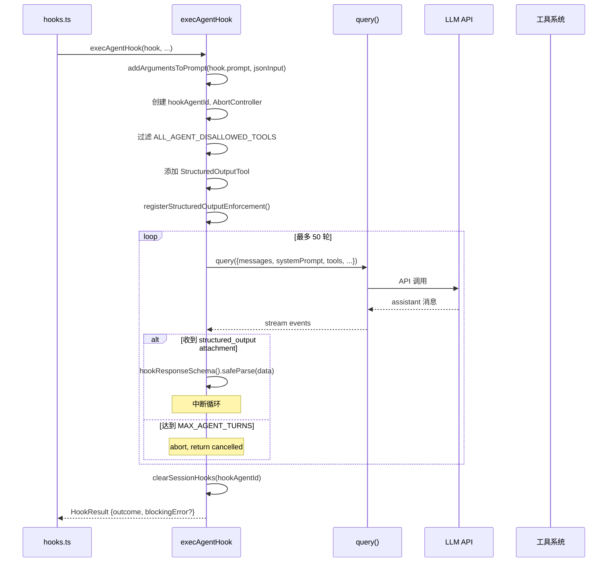
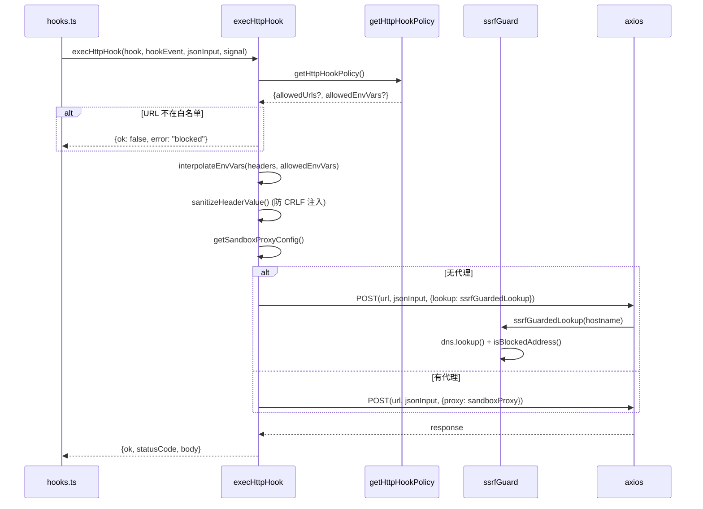
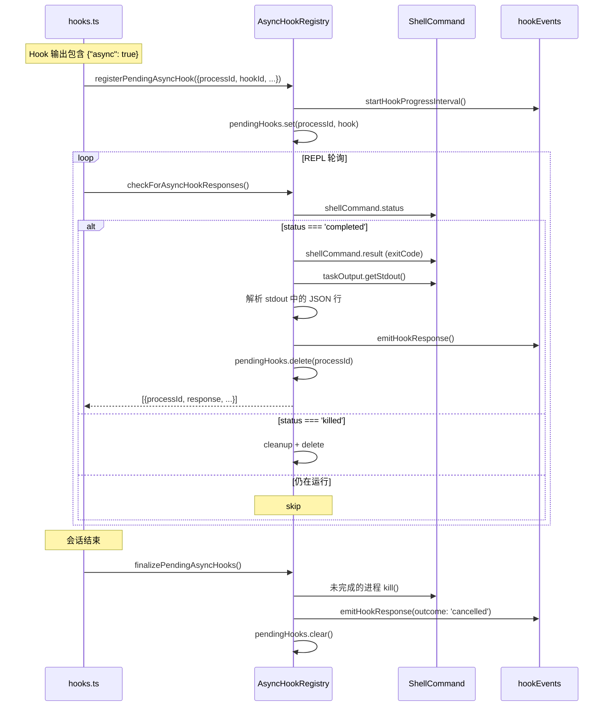
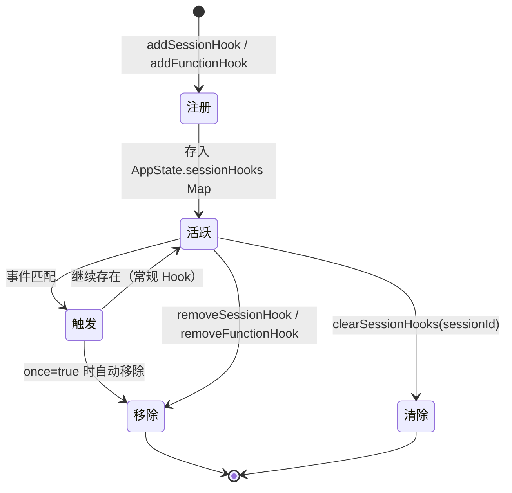

# Hook 引擎子模块详细设计文档

## 文档信息
| 项目 | 内容 |
|------|------|
| 模块名称 | Hook 引擎 (Hook Engine) |
| 文档版本 | v1.0-20260401 |
| 生成日期 | 2026-04-01 |
| 生成方式 | 代码反向工程 |

## 1. 模块概述

### 1.1 模块职责

Hook 引擎是 Claude Code 的可扩展事件拦截系统，允许用户和管理员在 Claude Code 生命周期的关键节点注入自定义逻辑。其核心职责包括：

1. **事件驱动的 Hook 调度**：定义 27 种 Hook 事件类型（如 `PreToolUse`、`PostToolUse`、`Stop`、`SessionStart` 等），在对应时机触发已注册的 Hook
2. **多类型 Hook 执行**：支持四种持久化 Hook 类型（`command`/`prompt`/`agent`/`http`）和一种内存态 Hook 类型（`function`）
3. **配置管理与策略控制**：从多层设置源（用户/项目/本地/策略/插件/会话）加载 Hook 配置，支持管理员策略限制
4. **异步 Hook 生命周期管理**：注册、跟踪和回收后台异步运行的 Hook 进程
5. **安全防护**：SSRF Guard 阻止 HTTP Hook 访问私有/链路本地地址，URL 白名单策略控制
6. **文件变更监听**：通过 chokidar 监听文件系统变更并触发 `FileChanged` Hook
7. **事件广播**：通过独立的事件系统向 SDK 消费者广播 Hook 执行状态

### 1.2 模块边界

**输入边界**：
- 来自 `hooks.ts`（主调度器）的 Hook 执行请求
- 来自 `settings.json`（用户/项目/本地/策略）的 Hook 配置
- 来自 `bootstrap/state.ts` 的已注册 Hook（插件 Hook）
- 来自 frontmatter / skill 定义的临时会话 Hook
- 来自 `AppState.sessionHooks` 的会话级 Hook 状态

**输出边界**：
- `HookResult` 返回给调用方，包含执行结果（成功/阻塞/错误/取消）
- `HookExecutionEvent` 事件广播给 SDK 事件处理器
- 异步 Hook 的 `SyncHookJSONOutput` 响应通过 `AsyncHookRegistry` 回送
- `sessionHooks` 状态变更通过 `setAppState` 更新到全局状态

**不属于本模块的职责**：
- Hook 的实际触发时机判断（由 `hooks.ts` 主调度器负责）
- Shell 命令的进程管理（由 `ShellCommand` / `TaskOutput` 负责）
- 设置文件的读写解析（由 `settings/` 子模块负责）

## 2. 架构设计

### 2.1 模块架构图

```mermaid
graph TB
    subgraph "外部调用方"
        HooksMain["hooks.ts<br/>(主调度器)"]
        RunAgent["runAgent.ts<br/>(Agent 运行器)"]
        SkillRunner["Skill 运行器"]
        REPL["REPL 主循环"]
    end

    subgraph "Hook 引擎核心"
        subgraph "配置层"
            HooksSettings["hooksSettings.ts<br/>配置聚合与查询"]
            HooksSnapshot["hooksConfigSnapshot.ts<br/>配置快照管理"]
            HooksConfigMgr["hooksConfigManager.ts<br/>事件元数据与分组"]
        end

        subgraph "执行层"
            ExecAgent["execAgentHook.ts<br/>Agent Hook 执行器"]
            ExecPrompt["execPromptHook.ts<br/>Prompt Hook 执行器"]
            ExecHttp["execHttpHook.ts<br/>HTTP Hook 执行器"]
        end

        subgraph "会话管理层"
            SessionHooks["sessionHooks.ts<br/>会话 Hook 注册表"]
            RegFrontmatter["registerFrontmatterHooks.ts<br/>Frontmatter Hook 注册"]
            RegSkill["registerSkillHooks.ts<br/>Skill Hook 注册"]
        end

        subgraph "异步与事件层"
            AsyncRegistry["AsyncHookRegistry.ts<br/>异步 Hook 注册表"]
            HookEvents["hookEvents.ts<br/>事件广播系统"]
        end

        subgraph "辅助层"
            HookHelpers["hookHelpers.ts<br/>共享工具函数"]
            SSRFGuard["ssrfGuard.ts<br/>SSRF 防护"]
            FileWatcher["fileChangedWatcher.ts<br/>文件变更监听"]
            PostSampling["postSamplingHooks.ts<br/>采样后 Hook"]
            ApiQueryHelper["apiQueryHookHelper.ts<br/>API 查询 Hook 工厂"]
            SkillImprove["skillImprovement.ts<br/>技能改进 Hook"]
        end
    end

    HooksMain --> HooksSettings
    HooksMain --> HooksSnapshot
    HooksMain --> ExecAgent
    HooksMain --> ExecPrompt
    HooksMain --> ExecHttp
    HooksMain --> AsyncRegistry
    HooksMain --> HookEvents
    HooksMain --> SessionHooks

    RunAgent --> RegFrontmatter
    SkillRunner --> RegSkill
    REPL --> PostSampling
    REPL --> FileWatcher

    ExecAgent --> HookHelpers
    ExecPrompt --> HookHelpers
    ExecHttp --> SSRFGuard

    HooksSettings --> SessionHooks
    HooksConfigMgr --> HooksSettings
    RegFrontmatter --> SessionHooks
    RegSkill --> SessionHooks

    SkillImprove --> ApiQueryHelper
    SkillImprove --> PostSampling
```



### 2.2 源文件组织

17 个文件按功能分为 5 组：

| 分组 | 文件 | 职责 |
|------|------|------|
| **配置层** | `hooksSettings.ts` | Hook 配置聚合，从所有来源收集 `IndividualHookConfig`，提供排序和显示辅助 |
| | `hooksConfigSnapshot.ts` | 启动时捕获配置快照，支持策略控制（`allowManagedHooksOnly` / `disableAllHooks`） |
| | `hooksConfigManager.ts` | Hook 事件元数据定义（27 种事件的描述、匹配器信息），按事件和匹配器分组 Hook |
| **执行层** | `execAgentHook.ts` | Agent 类型 Hook 执行器，启动子 Agent 通过多轮 LLM 查询验证条件 |
| | `execPromptHook.ts` | Prompt 类型 Hook 执行器，单次 LLM 查询获取结构化 JSON 响应 |
| | `execHttpHook.ts` | HTTP 类型 Hook 执行器，POST JSON 到指定 URL，支持代理和沙箱 |
| **会话管理层** | `sessionHooks.ts` | 会话级 Hook 注册表（`SessionHooksState = Map<sessionId, SessionStore>`） |
| | `registerFrontmatterHooks.ts` | 将 Agent/Skill frontmatter 中的 Hook 注册为会话 Hook |
| | `registerSkillHooks.ts` | 将 Skill frontmatter 中的 Hook 注册为会话 Hook，支持 `once` 一次性 Hook |
| **异步与事件层** | `AsyncHookRegistry.ts` | 异步 Hook 全局注册表，跟踪后台进程并轮询结果 |
| | `hookEvents.ts` | 事件广播系统，向 SDK 消费者发送 Hook 执行状态事件 |
| **辅助层** | `hookHelpers.ts` | 共享工具：响应 schema、参数替换、结构化输出强制 |
| | `ssrfGuard.ts` | SSRF 防护，阻止访问私有/链路本地 IP（允许 loopback） |
| | `fileChangedWatcher.ts` | 使用 chokidar 监听文件变更，触发 `FileChanged` / `CwdChanged` Hook |
| | `postSamplingHooks.ts` | 模型采样后的内部 Hook 注册表（非 settings.json 配置） |
| | `apiQueryHookHelper.ts` | 通用的 API 查询 Hook 工厂，封装模型调用生命周期 |
| | `skillImprovement.ts` | 技能改进 Hook，分析用户对话检测可持久化的偏好改进 |

### 2.3 外部依赖

| 依赖 | 用途 | 文件 |
|------|------|------|
| `zod/v4` | Hook 响应 schema 验证 | `hookHelpers.ts` |
| `axios` | HTTP Hook 请求发送 | `execHttpHook.ts` |
| `chokidar` | 文件系统变更监听 | `fileChangedWatcher.ts` |
| `lodash-es/memoize` | 事件元数据缓存 | `hooksConfigManager.ts` |
| `dns` (Node.js) | SSRF Guard DNS 查询 | `ssrfGuard.ts` |
| `net` (Node.js) | IP 地址格式判断 | `ssrfGuard.ts` |
| `bootstrap/state.ts` | 全局状态获取（sessionId, registeredHooks 等） | 多个文件 |
| `services/api/claude.ts` | LLM 模型查询 | `execPromptHook.ts`, `execAgentHook.ts`, `skillImprovement.ts` |
| `query.ts` | 多轮 Agent 查询引擎 | `execAgentHook.ts` |
| `schemas/hooks.ts` | Hook 配置 Zod schema 和类型定义 | 间接通过 `settings/types.ts` |
| `Tool.ts` | 工具接口定义、`ToolUseContext` | 执行层文件 |
| `ShellCommand.ts` | Shell 命令进程管理 | `AsyncHookRegistry.ts` |

## 3. 数据结构设计

### 3.1 核心数据结构

#### 3.1.1 Hook 命令类型 (`schemas/hooks.ts`)

```typescript
// 四种持久化 Hook 类型的联合体
type HookCommand =
  | BashCommandHook   // type: 'command' - Shell 命令
  | PromptHook        // type: 'prompt' - 单次 LLM 提示
  | AgentHook         // type: 'agent' - 多轮 Agent 验证
  | HttpHook          // type: 'http' - HTTP POST 请求

// Shell 命令 Hook
type BashCommandHook = {
  type: 'command'
  command: string           // Shell 命令字符串
  if?: string               // 权限规则语法的条件过滤器
  shell?: 'bash' | 'powershell'  // Shell 解释器
  timeout?: number          // 超时（秒）
  statusMessage?: string    // 自定义 spinner 状态消息
  once?: boolean            // 一次性 Hook
  async?: boolean           // 后台异步执行
  asyncRewake?: boolean     // 异步 + exit code 2 唤醒模型
}

// Prompt Hook
type PromptHook = {
  type: 'prompt'
  prompt: string            // LLM 提示文本，支持 $ARGUMENTS 占位符
  if?: string
  timeout?: number
  model?: string            // 指定模型（默认 small fast model）
  statusMessage?: string
  once?: boolean
}

// Agent Hook
type AgentHook = {
  type: 'agent'
  prompt: string            // 验证提示
  if?: string
  timeout?: number
  model?: string
  statusMessage?: string
  once?: boolean
}

// HTTP Hook
type HttpHook = {
  type: 'http'
  url: string               // POST 目标 URL
  if?: string
  timeout?: number
  headers?: Record<string, string>   // 支持 $VAR 环境变量插值
  allowedEnvVars?: string[]          // 允许插值的环境变量白名单
  statusMessage?: string
  once?: boolean
}
```

#### 3.1.2 Hook 匹配器与配置 (`schemas/hooks.ts`, `hooksSettings.ts`)

```typescript
// 匹配器配置
type HookMatcher = {
  matcher?: string          // 匹配模式（如工具名 "Write"）
  hooks: HookCommand[]      // 该匹配器下的 Hook 列表
}

// Hook 全局设置（按事件分组的匹配器）
type HooksSettings = Partial<Record<HookEvent, HookMatcher[]>>

// 个体 Hook 配置（扁平化后包含来源信息）- hooksSettings.ts:22-28
interface IndividualHookConfig {
  event: HookEvent
  config: HookCommand
  matcher?: string
  source: HookSource           // 'userSettings' | 'projectSettings' | 'localSettings'
                                // | 'policySettings' | 'pluginHook' | 'sessionHook' | 'builtinHook'
  pluginName?: string
}
```

#### 3.1.3 Hook 事件类型系统 (`hooksConfigManager.ts`)

系统定义了 27 种 Hook 事件，每种事件具有独立的元数据：

```typescript
// 事件元数据 - hooksConfigManager.ts:11-20
type MatcherMetadata = {
  fieldToMatch: string      // 匹配字段名（如 'tool_name', 'source'）
  values: string[]           // 可选匹配值列表
}

type HookEventMetadata = {
  summary: string            // 事件简述
  description: string        // 详细描述（含退出码语义）
  matcherMetadata?: MatcherMetadata  // 匹配器配置
}
```

27 种事件分类如下：

| 类别 | 事件名 | 匹配字段 | 说明 |
|------|--------|----------|------|
| **工具生命周期** | `PreToolUse` | `tool_name` | 工具执行前，exit 2 阻塞 |
| | `PostToolUse` | `tool_name` | 工具执行后 |
| | `PostToolUseFailure` | `tool_name` | 工具执行失败后 |
| | `PermissionDenied` | `tool_name` | 自动模式拒绝工具调用后 |
| | `PermissionRequest` | `tool_name` | 权限对话框显示时 |
| **会话生命周期** | `SessionStart` | `source` | 会话开始（startup/resume/clear/compact） |
| | `SessionEnd` | `reason` | 会话结束 |
| | `Stop` | 无 | Claude 即将结束响应 |
| | `StopFailure` | `error` | API 错误导致回合结束 |
| **子 Agent** | `SubagentStart` | `agent_type` | 子 Agent 启动 |
| | `SubagentStop` | `agent_type` | 子 Agent 即将结束 |
| **压缩** | `PreCompact` | `trigger` | 压缩前，exit 2 阻塞 |
| | `PostCompact` | `trigger` | 压缩后 |
| **用户交互** | `UserPromptSubmit` | 无 | 用户提交提示 |
| | `Notification` | `notification_type` | 通知发送时 |
| **MCP** | `Elicitation` | `mcp_server_name` | MCP 请求用户输入 |
| | `ElicitationResult` | `mcp_server_name` | 用户响应 MCP 请求 |
| **配置与指令** | `ConfigChange` | `source` | 配置文件变更 |
| | `InstructionsLoaded` | `load_reason` | 指令文件加载 |
| | `Setup` | `trigger` | 仓库设置 Hook |
| **团队协作** | `TeammateIdle` | 无 | 队友即将空闲 |
| | `TaskCreated` | 无 | 任务创建 |
| | `TaskCompleted` | 无 | 任务完成 |
| **工作树** | `WorktreeCreate` | 无 | 创建工作树 |
| | `WorktreeRemove` | 无 | 移除工作树 |
| **文件与目录** | `CwdChanged` | 无 | 工作目录变更 |
| | `FileChanged` | 文件名模式 | 监听的文件变更 |

#### 3.1.4 Hook 结果类型 (`hooks.ts:338-357`)

```typescript
interface HookResult {
  hook: HookCommand | HookCallback | FunctionHook
  outcome: 'success' | 'blocking' | 'non_blocking_error' | 'cancelled'
  message?: HookResultMessage
  systemMessage?: string
  blockingError?: HookBlockingError      // outcome='blocking' 时的错误信息
  preventContinuation?: boolean          // 是否阻止继续对话
  stopReason?: string                    // 停止原因文本
  permissionBehavior?: 'ask' | 'deny' | 'allow' | 'passthrough'
  updatedInput?: Record<string, unknown> // PreToolUse 可修改工具输入
  watchPaths?: string[]                  // CwdChanged/FileChanged 返回的监听路径
  retry?: boolean                        // PermissionDenied 允许重试
  // ...其他字段
}

interface HookBlockingError {
  blockingError: string
  command: string
}
```

#### 3.1.5 会话 Hook 类型 (`sessionHooks.ts`)

```typescript
// 函数 Hook - 仅存在于内存，不可序列化 - sessionHooks.ts:24-31
type FunctionHook = {
  type: 'function'
  id?: string                  // 用于移除的唯一标识
  timeout?: number
  callback: FunctionHookCallback  // (messages, signal?) => boolean | Promise<boolean>
  errorMessage: string
  statusMessage?: string
}

type FunctionHookCallback = (
  messages: Message[],
  signal?: AbortSignal,
) => boolean | Promise<boolean>

// 会话 Hook 存储 - sessionHooks.ts:42-46
type SessionStore = {
  hooks: { [event in HookEvent]?: SessionHookMatcher[] }
}

// 全局会话 Hook 状态 - 使用 Map 而非 Record 以优化高并发场景
// sessionHooks.ts:62
type SessionHooksState = Map<string, SessionStore>
```

#### 3.1.6 异步 Hook 状态 (`AsyncHookRegistry.ts:12-25`)

```typescript
type PendingAsyncHook = {
  processId: string             // 唯一进程标识
  hookId: string                // Hook 事件 ID
  hookName: string              // Hook 显示名称
  hookEvent: HookEvent | 'StatusLine' | 'FileSuggestion'
  toolName?: string
  pluginId?: string
  startTime: number             // 启动时间戳
  timeout: number               // 超时毫秒数（默认 15000）
  command: string               // 原始命令
  responseAttachmentSent: boolean  // 响应是否已发送
  shellCommand?: ShellCommand   // 进程引用
  stopProgressInterval: () => void  // 进度上报清理函数
}
```

#### 3.1.7 Hook 事件广播类型 (`hookEvents.ts:22-55`)

```typescript
type HookStartedEvent = {
  type: 'started'
  hookId: string; hookName: string; hookEvent: string
}

type HookProgressEvent = {
  type: 'progress'
  hookId: string; hookName: string; hookEvent: string
  stdout: string; stderr: string; output: string
}

type HookResponseEvent = {
  type: 'response'
  hookId: string; hookName: string; hookEvent: string
  output: string; stdout: string; stderr: string
  exitCode?: number
  outcome: 'success' | 'error' | 'cancelled'
}

type HookExecutionEvent = HookStartedEvent | HookProgressEvent | HookResponseEvent
type HookEventHandler = (event: HookExecutionEvent) => void
```

### 3.2 数据关系图



## 4. 接口设计

### 4.1 对外接口

#### 4.1.1 配置查询接口

| 函数 | 文件 | 签名 | 说明 |
|------|------|------|------|
| `getAllHooks` | `hooksSettings.ts:92` | `(appState: AppState) => IndividualHookConfig[]` | 从所有来源聚合 Hook 列表 |
| `getHooksForEvent` | `hooksSettings.ts:163` | `(appState: AppState, event: HookEvent) => IndividualHookConfig[]` | 获取特定事件的 Hook |
| `getHooksConfigFromSnapshot` | `hooksConfigSnapshot.ts:119` | `() => HooksSettings \| null` | 获取配置快照 |
| `captureHooksConfigSnapshot` | `hooksConfigSnapshot.ts:95` | `() => void` | 启动时捕获配置快照 |
| `updateHooksConfigSnapshot` | `hooksConfigSnapshot.ts:104` | `() => void` | 刷新配置快照 |
| `shouldAllowManagedHooksOnly` | `hooksConfigSnapshot.ts:62` | `() => boolean` | 检查是否仅允许托管 Hook |
| `shouldDisableAllHooksIncludingManaged` | `hooksConfigSnapshot.ts:83` | `() => boolean` | 检查是否禁用所有 Hook |

#### 4.1.2 事件分组与元数据接口

| 函数 | 文件 | 签名 | 说明 |
|------|------|------|------|
| `getHookEventMetadata` | `hooksConfigManager.ts:26` | `(toolNames: string[]) => Record<HookEvent, HookEventMetadata>` | 获取事件元数据（memoize 缓存） |
| `groupHooksByEventAndMatcher` | `hooksConfigManager.ts:270` | `(appState: AppState, toolNames: string[]) => Record<HookEvent, Record<string, IndividualHookConfig[]>>` | 按事件和匹配器分组 Hook |
| `getSortedMatchersForEvent` | `hooksConfigManager.ts:368` | `(grouped, event) => string[]` | 按优先级排序匹配器 |
| `getHooksForMatcher` | `hooksConfigManager.ts:380` | `(grouped, event, matcher) => IndividualHookConfig[]` | 获取特定匹配器下的 Hook |

#### 4.1.3 会话 Hook 管理接口

| 函数 | 文件 | 签名 | 说明 |
|------|------|------|------|
| `addSessionHook` | `sessionHooks.ts:68` | `(setAppState, sessionId, event, matcher, hook, onHookSuccess?, skillRoot?) => void` | 注册会话 Hook |
| `addFunctionHook` | `sessionHooks.ts:93` | `(setAppState, sessionId, event, matcher, callback, errorMessage, options?) => string` | 注册函数 Hook，返回 ID |
| `removeFunctionHook` | `sessionHooks.ts:120` | `(setAppState, sessionId, event, hookId) => void` | 按 ID 移除函数 Hook |
| `removeSessionHook` | `sessionHooks.ts:225` | `(setAppState, sessionId, event, hook) => void` | 移除会话 Hook |
| `getSessionHooks` | `sessionHooks.ts:302` | `(appState, sessionId, event?) => Map<HookEvent, SessionDerivedHookMatcher[]>` | 获取会话 Hook（排除函数 Hook） |
| `getSessionFunctionHooks` | `sessionHooks.ts:345` | `(appState, sessionId, event?) => Map<HookEvent, FunctionHookMatcher[]>` | 获取会话函数 Hook |
| `clearSessionHooks` | `sessionHooks.ts:437` | `(setAppState, sessionId) => void` | 清除会话所有 Hook |
| `registerFrontmatterHooks` | `registerFrontmatterHooks.ts:18` | `(setAppState, sessionId, hooks, sourceName, isAgent?) => void` | 注册 frontmatter Hook |
| `registerSkillHooks` | `registerSkillHooks.ts:20` | `(setAppState, sessionId, hooks, skillName, skillRoot?) => void` | 注册 skill Hook |

#### 4.1.4 事件广播接口

| 函数 | 文件 | 签名 | 说明 |
|------|------|------|------|
| `registerHookEventHandler` | `hookEvents.ts:61` | `(handler: HookEventHandler \| null) => void` | 注册事件处理器 |
| `emitHookStarted` | `hookEvents.ts:93` | `(hookId, hookName, hookEvent) => void` | 发射 Hook 启动事件 |
| `emitHookProgress` | `hookEvents.ts:108` | `(data) => void` | 发射进度事件 |
| `emitHookResponse` | `hookEvents.ts:153` | `(data) => void` | 发射响应事件 |
| `setAllHookEventsEnabled` | `hookEvents.ts:184` | `(enabled: boolean) => void` | 启用/禁用全量事件发射 |

#### 4.1.5 异步 Hook 接口

| 函数 | 文件 | 签名 | 说明 |
|------|------|------|------|
| `registerPendingAsyncHook` | `AsyncHookRegistry.ts:30` | `(params) => void` | 注册异步 Hook |
| `getPendingAsyncHooks` | `AsyncHookRegistry.ts:85` | `() => PendingAsyncHook[]` | 获取未发送响应的 Hook |
| `checkForAsyncHookResponses` | `AsyncHookRegistry.ts:113` | `() => Promise<Array<...>>` | 轮询已完成的 Hook 响应 |
| `removeDeliveredAsyncHooks` | `AsyncHookRegistry.ts:270` | `(processIds: string[]) => void` | 移除已交付的 Hook |
| `finalizePendingAsyncHooks` | `AsyncHookRegistry.ts:281` | `() => Promise<void>` | 结束所有待处理 Hook |

### 4.2 Hook 执行器接口

#### 4.2.1 `execAgentHook` (`execAgentHook.ts:36`)

```typescript
async function execAgentHook(
  hook: AgentHook,
  hookName: string,
  hookEvent: HookEvent,
  jsonInput: string,          // Hook 输入 JSON
  signal: AbortSignal,
  toolUseContext: ToolUseContext,
  toolUseID: string | undefined,
  _messages: Message[],       // 保留参数（历史兼容）
  agentName?: string,
): Promise<HookResult>
```

**执行流程**：
1. 替换 `$ARGUMENTS` 占位符
2. 创建独立的 `hookAgentId` 和超时 `AbortController`
3. 过滤不允许的工具，添加 `StructuredOutputTool`
4. 通过 `query()` 发起多轮 Agent 查询（最多 50 轮）
5. 注册 `registerStructuredOutputEnforcement` 确保 Agent 调用结构化输出工具
6. 解析 `{ok: boolean, reason?: string}` 结构化输出
7. 清理会话 Hook

**返回**：`ok=true` 返回 success，`ok=false` 返回 blocking + 错误消息

#### 4.2.2 `execPromptHook` (`execPromptHook.ts:21`)

```typescript
async function execPromptHook(
  hook: PromptHook,
  hookName: string,
  hookEvent: HookEvent,
  jsonInput: string,
  signal: AbortSignal,
  toolUseContext: ToolUseContext,
  messages?: Message[],
  toolUseID?: string,
): Promise<HookResult>
```

**执行流程**：
1. 替换 `$ARGUMENTS` 占位符
2. 使用 `queryModelWithoutStreaming` 单次查询
3. 使用 `json_schema` 输出格式约束响应
4. 解析 `{ok: boolean, reason?: string}` 响应
5. 超时默认 30 秒

**返回**：与 Agent Hook 类似，但 `blocking` 结果额外设置 `preventContinuation: true`

#### 4.2.3 `execHttpHook` (`execHttpHook.ts:123`)

```typescript
async function execHttpHook(
  hook: HttpHook,
  _hookEvent: HookEvent,
  jsonInput: string,
  signal?: AbortSignal,
): Promise<{
  ok: boolean
  statusCode?: number
  body: string
  error?: string
  aborted?: boolean
}>
```

**执行流程**：
1. 检查 URL 白名单策略（`allowedHttpHookUrls`）
2. 构建请求头，进行环境变量插值（仅白名单变量）
3. 头部值进行 CRLF 注入防护（`sanitizeHeaderValue`）
4. 检测沙箱代理或环境变量代理
5. 通过 axios POST 请求，非代理模式下使用 `ssrfGuardedLookup`
6. 超时默认 10 分钟

## 5. 核心流程设计

### 5.1 Hook 配置加载流程



**配置来源优先级**（`hooksSettings.ts:230-271`）：
1. `userSettings` (~/.claude/settings.json)
2. `projectSettings` (.claude/settings.json)
3. `localSettings` (.claude/settings.local.json)
4. 去重逻辑：当路径 resolve 相同时跳过重复（如 home 目录下 user=project）

### 5.2 Hook 事件匹配与分发流程



### 5.3 各类型 Hook 执行流程

#### 5.3.1 Command Hook（Shell 命令）

由 `hooks.ts` 中的主逻辑处理（非本目录文件）：
1. 构建环境变量（`CLAUDE_SESSION_ID`, `CLAUDE_ENV_FILE`, `CLAUDE_PLUGIN_ROOT` 等）
2. 通过 `wrapSpawn` / `ShellCommand` 启动 Shell 进程
3. 写入 `jsonInput` 到 stdin
4. 等待进程退出，解析 stdout
5. 根据退出码决定行为：
   - `0`：成功
   - `2`：阻塞错误（stderr 显示给模型）
   - 其他：非阻塞错误（stderr 仅显示给用户）

#### 5.3.2 Agent Hook



#### 5.3.3 Prompt Hook

与 Agent Hook 类似但更简单：
1. 单次 `queryModelWithoutStreaming` 调用
2. 使用 `json_schema` 输出格式强制结构化响应
3. 超时默认 30 秒（比 Agent 的 60 秒短）
4. 不需要工具调用

#### 5.3.4 HTTP Hook



### 5.4 异步 Hook 注册与回收流程



**关键设计决策**（`AsyncHookRegistry.ts:51`）：默认异步超时 15 秒。完成的 Hook 通过扫描 stdout 的 JSON 行查找同步响应（排除包含 `"async"` 键的行）。`SessionStart` Hook 完成后会调用 `invalidateSessionEnvCache()` 刷新环境变量缓存。

### 5.5 Session Hook 生命周期



**会话 Hook 的注册来源**：
1. **Frontmatter Hook** (`registerFrontmatterHooks.ts`): Agent frontmatter 中定义的 Hook，`isAgent=true` 时将 `Stop` 事件转换为 `SubagentStop`
2. **Skill Hook** (`registerSkillHooks.ts`): Skill frontmatter 中定义的 Hook，支持 `once: true` 一次性执行
3. **函数 Hook** (`sessionHooks.ts:93`): 内存态回调，用于结构化输出强制（如 `registerStructuredOutputEnforcement`）

**`SessionHooksState` 使用 Map 的性能设计**（`sessionHooks.ts:49-61`）：
- 在高并发工作流中（如 `parallel()` 同时启动 N 个 schema-mode Agent），每个 Agent 都调用 `addFunctionHook`
- 如果使用 Record + spread，每次调用 O(N) 复制，总计 O(N^2)，且触发所有 ~30 个 store listener
- 使用 Map：`.set()` 为 O(1)，且返回 `prev` 引用不变，`Object.is(next, prev)` 跳过 listener 通知

## 6. 状态管理（全局变量分析）

Hook 引擎包含多个模块级全局变量，用于管理运行时状态：

| 全局变量 | 文件 | 类型 | 说明 |
|----------|------|------|------|
| `pendingHooks` | `AsyncHookRegistry.ts:28` | `Map<string, PendingAsyncHook>` | 异步 Hook 进程注册表 |
| `pendingEvents` | `hookEvents.ts:57` | `HookExecutionEvent[]` | 事件缓冲队列（handler 注册前） |
| `eventHandler` | `hookEvents.ts:58` | `HookEventHandler \| null` | 当前事件处理器 |
| `allHookEventsEnabled` | `hookEvents.ts:59` | `boolean` | 是否启用全量事件发射 |
| `initialHooksConfig` | `hooksConfigSnapshot.ts:8` | `HooksSettings \| null` | 配置快照 |
| `postSamplingHooks` | `postSamplingHooks.ts:25` | `PostSamplingHook[]` | 采样后 Hook 注册表 |
| `watcher` | `fileChangedWatcher.ts:14` | `FSWatcher \| null` | chokidar 文件监听器 |
| `currentCwd` | `fileChangedWatcher.ts:15` | `string` | 当前工作目录 |
| `dynamicWatchPaths` | `fileChangedWatcher.ts:16` | `string[]` | 动态监听路径 |
| `initialized` | `fileChangedWatcher.ts:18` | `boolean` | 文件监听器初始化标志 |
| `hasEnvHooks` | `fileChangedWatcher.ts:19` | `boolean` | 是否存在环境 Hook |
| `notifyCallback` | `fileChangedWatcher.ts:20` | `((text, isError) => void) \| null` | 通知回调 |

**清理方法**：
- `clearAllAsyncHooks()`：清除异步 Hook 注册表
- `clearHookEventState()`：重置事件系统状态
- `resetHooksConfigSnapshot()`：重置配置快照
- `clearPostSamplingHooks()`：清除采样后 Hook
- `resetFileChangedWatcherForTesting()`：重置文件监听器

**事件缓冲机制**（`hookEvents.ts:57-80`）：
- 在 `eventHandler` 注册前，事件存储在 `pendingEvents` 数组中
- 最多缓冲 `MAX_PENDING_EVENTS = 100` 个事件，超出时移除最早的（FIFO）
- Handler 注册时立即 flush 所有待处理事件

## 7. 错误处理设计

### 7.1 错误分类

| 错误类型 | 处理方式 | 示例 |
|----------|----------|------|
| 阻塞错误 | `outcome: 'blocking'`，返回 `blockingError`，阻止操作继续 | Shell Hook exit 2, Agent/Prompt Hook `ok: false` |
| 非阻塞错误 | `outcome: 'non_blocking_error'`，stderr 显示给用户 | Shell Hook exit 非 0/2, JSON 解析失败 |
| 取消 | `outcome: 'cancelled'`，静默跳过 | 超时, abort signal, Agent 超过 MAX_TURNS |
| 成功 | `outcome: 'success'` | 正常完成 |

### 7.2 超时处理

| Hook 类型 | 默认超时 | 可配置 |
|----------|----------|--------|
| Command Hook | 10 分钟 (`TOOL_HOOK_EXECUTION_TIMEOUT_MS`) | `hook.timeout` (秒) |
| Prompt Hook | 30 秒 | `hook.timeout` (秒) |
| Agent Hook | 60 秒 | `hook.timeout` (秒) |
| HTTP Hook | 10 分钟 | `hook.timeout` (秒) |
| Async Hook | 15 秒 (`asyncTimeout`) | `asyncResponse.asyncTimeout` (毫秒) |
| SessionEnd Hook | 1.5 秒 | `CLAUDE_CODE_SESSIONEND_HOOKS_TIMEOUT_MS` 环境变量 |
| Function Hook | 5 秒 | `options.timeout` |

所有超时使用 `createCombinedAbortSignal(parentSignal, { timeoutMs })` 统一管理，兼顾父信号取消和超时。

### 7.3 Agent Hook 的容错

- Agent 超过 `MAX_AGENT_TURNS = 50` 轮时静默取消（不显示错误给用户）
- Agent 未返回结构化输出时记录分析事件并返回 `cancelled`
- 通过 `registerStructuredOutputEnforcement` 注入 Stop Hook，强制 Agent 调用 `SyntheticOutputTool`

### 7.4 Post-Sampling Hook 的容错

`postSamplingHooks.ts:62-69`：每个 Hook 错误被捕获并通过 `logError` 记录，不影响其他 Hook 执行。

### 7.5 异步 Hook 的容错

`AsyncHookRegistry.ts:144`：使用 `Promise.allSettled` 隔离每个 Hook 的处理，一个 Hook 失败不影响其他。

## 8. 安全设计

### 8.1 SSRF Guard (`ssrfGuard.ts`)

**目的**：防止项目配置的 HTTP Hook 访问云元数据端点（如 169.254.169.254）或内部基础设施。

**阻止的地址范围**：

| IPv4 范围 | 说明 |
|-----------|------|
| 0.0.0.0/8 | "this" 网络 |
| 10.0.0.0/8 | 私有地址 |
| 100.64.0.0/10 | 共享地址空间 / CGNAT |
| 169.254.0.0/16 | 链路本地（云元数据） |
| 172.16.0.0/12 | 私有地址 |
| 192.168.0.0/16 | 私有地址 |

| IPv6 范围 | 说明 |
|-----------|------|
| :: | 未指定 |
| fc00::/7 | 唯一本地地址 |
| fe80::/10 | 链路本地 |
| ::ffff:X:Y | IPv4 映射到 IPv6（检查嵌入的 v4 地址） |

**明确允许**：127.0.0.0/8 和 ::1（本地开发 Hook 的典型场景）。

**实现方式**（`ssrfGuardedLookup`, `ssrfGuard.ts:216`）：
- 作为 axios 的 `lookup` 选项传入，确保 DNS 解析结果和实际连接的 IP 一致（无重绑定窗口）
- IP 字面量直接验证，hostname 通过 `dns.lookup({all: true})` 解析后验证所有返回地址
- 当存在代理（沙箱代理或环境变量代理）时跳过 SSRF Guard，因为代理负责 DNS 解析

**IPv4-mapped IPv6 处理**（`ssrfGuard.ts:127-204`）：
- 通过 `expandIPv6Groups` 将 IPv6 展开为 8 组十六进制数
- 通过 `extractMappedIPv4` 检测 `0:0:0:0:0:ffff:X:Y` 模式，提取嵌入的 IPv4 地址
- 防止通过 `::ffff:a9fe:a9fe`（= 169.254.169.254）等形式绕过

### 8.2 HTTP Hook URL 白名单

`execHttpHook.ts:49-58` 中的 `getHttpHookPolicy()`：
- `allowedHttpHookUrls`：URL 模式数组，支持 `*` 通配符
- `undefined` 表示无限制，`[]` 表示阻止所有，非空则必须匹配
- 遵循与 MCP 服务器白名单相同的语义

### 8.3 环境变量安全

`execHttpHook.ts:89-108` 中的 `interpolateEnvVars()`：
- 仅解析 `hook.allowedEnvVars` 中明确列出的环境变量
- 未列入白名单的 `$VAR` 引用替换为空字符串（防止泄露 secrets）
- 策略级 `httpHookAllowedEnvVars` 与 Hook 级 `allowedEnvVars` 取交集

### 8.4 CRLF 注入防护

`execHttpHook.ts:76-79` 中的 `sanitizeHeaderValue()`：
- 去除 `\r`、`\n`、`\x00` 字符
- 防止通过环境变量值注入额外 HTTP 头部

### 8.5 工作区信任检查

`hooks.ts:286-296` 中的 `shouldSkipHookDueToTrust()`：
- 所有交互式模式的 Hook 执行前都检查工作区信任状态
- 非交互模式（SDK）隐式信任
- 防止在未接受信任对话框前执行恶意 Hook

### 8.6 策略控制

- `allowManagedHooksOnly`：仅允许策略管理员定义的 Hook 运行
- `disableAllHooks`：策略级设置可完全禁用所有 Hook；非策略级设置仅禁用非托管 Hook
- `isRestrictedToPluginOnly('hooks')`：严格插件模式下阻止用户/项目/本地 Hook

## 9. 设计约束与决策

### 9.1 关键设计决策

| 决策 | 理由 |
|------|------|
| `SessionHooksState` 使用 `Map` 而非 `Record` | 高并发场景下避免 O(N^2) 复制开销和不必要的 store listener 通知（`sessionHooks.ts:49-61`） |
| Agent Hook 最多 50 轮（`MAX_AGENT_TURNS`） | 防止 Hook Agent 无限循环消耗资源 |
| 事件缓冲队列上限 100 | 平衡内存占用和事件不丢失 |
| `SessionStart`/`Setup` 事件始终发射 | 向后兼容原始白名单行为（`hookEvents.ts:18`） |
| Frontmatter 的 `Stop` Hook 自动转换为 `SubagentStop` | 子 Agent 完成时触发的是 `SubagentStop` 而非 `Stop`（`registerFrontmatterHooks.ts:39-44`） |
| Agent Hook 过滤 `ALL_AGENT_DISALLOWED_TOOLS` | 防止 Stop Hook Agent 产生子 Agent 或进入计划模式（`execAgentHook.ts:101`） |
| HTTP Hook SSRF Guard 允许 loopback | 本地开发策略服务器是 HTTP Hook 的主要用例 |
| `asyncRewake` Hook 不调用 `shellCommand.background()` | 避免 `spillToDisk()` 破坏内存 stdout/stderr 捕获（`hooks.ts:211-215`） |

### 9.2 设计约束

1. **不可序列化的 Hook 类型**：`FunctionHook` 仅存在于内存（包含 JavaScript 回调），无法持久化到 settings.json
2. **递归保护**：Prompt Hook 和 Agent Hook 使用 `createUserMessage` 而非 `processUserInput`，避免触发 `UserPromptSubmit` Hook 导致无限递归
3. **Hook Schema 不可使用 `.transform()`**：`AgentHookSchema` 的 prompt 字段不能使用 Zod transform，否则 `JSON.stringify` 会丢失函数值（`schemas/hooks.ts:132-137`）
4. **配置快照时机**：`captureHooksConfigSnapshot()` 在信任对话框显示前调用，通过 `shouldSkipHookDueToTrust()` 防止提前执行

## 10. 设计评估

### 10.1 优点

1. **扩展性强**：支持 4+1 种 Hook 类型，27 种事件，覆盖 Claude Code 几乎所有生命周期节点
2. **安全纵深防御**：SSRF Guard、URL 白名单、环境变量白名单、CRLF 防护、信任检查多层防护
3. **灵活的策略控制**：管理员可通过策略设置精确控制 Hook 的运行范围
4. **高并发优化**：`SessionHooksState` 使用 Map 避免 O(N^2) 性能问题
5. **事件驱动架构**：Hook 事件广播系统与主消息流解耦，SDK 消费者可独立处理
6. **异步支持**：`async`/`asyncRewake` 模式允许长时间运行的 Hook 不阻塞主流程

### 10.2 复杂度风险

1. **全局状态分散**：6 个文件中有 12+ 个模块级全局变量，测试和并发场景下需要仔细管理清理
2. **配置来源多样**：Hook 可从 7 种来源注册（user/project/local/policy/plugin/session/builtin），合并逻辑复杂
3. **Hook 执行逻辑分散**：Command Hook 的执行逻辑在 `hooks.ts`（主文件，超过 1000 行），其他 3 种在各自 exec 文件中
4. **`hooks.ts` 主文件体量大**：作为调度器承担了大量职责（Hook 输入构建、退出码解析、结果聚合），存在 God Object 倾向

### 10.3 可维护性评估

- **测试支持**：每个全局状态都提供了 `clear*`/`reset*` 方法用于测试隔离
- **调试支持**：全面使用 `logForDebugging` 记录 Hook 执行细节
- **遥测集成**：关键操作（Agent Hook 成功/失败/超时/错误、技能改进检测）都有分析事件记录
