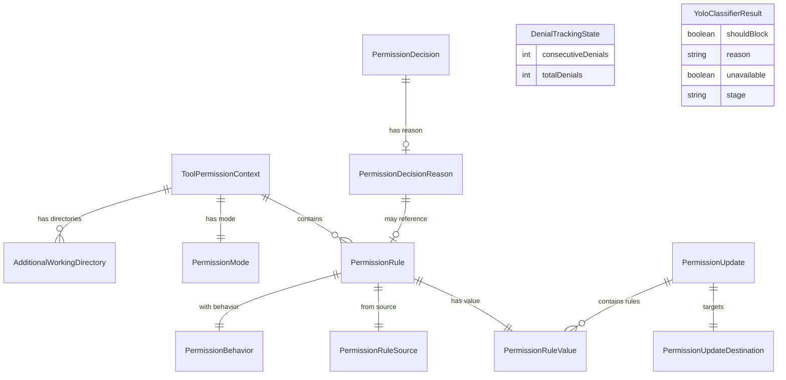
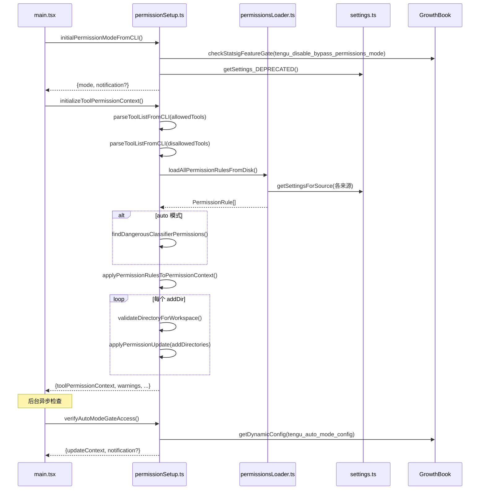
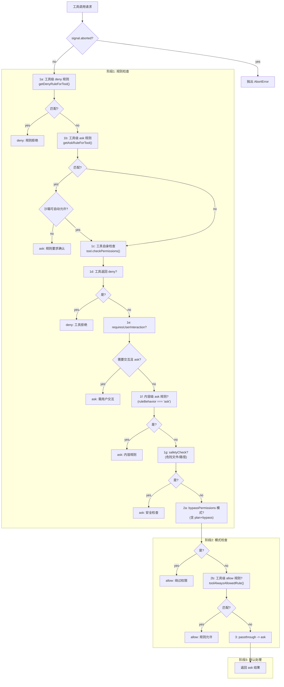
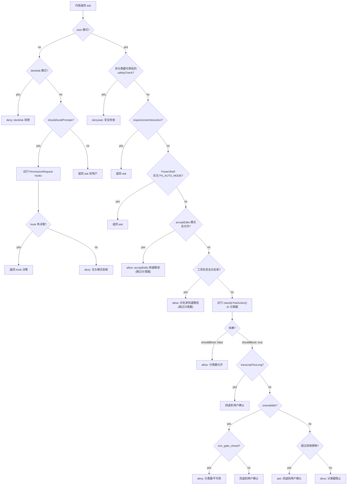
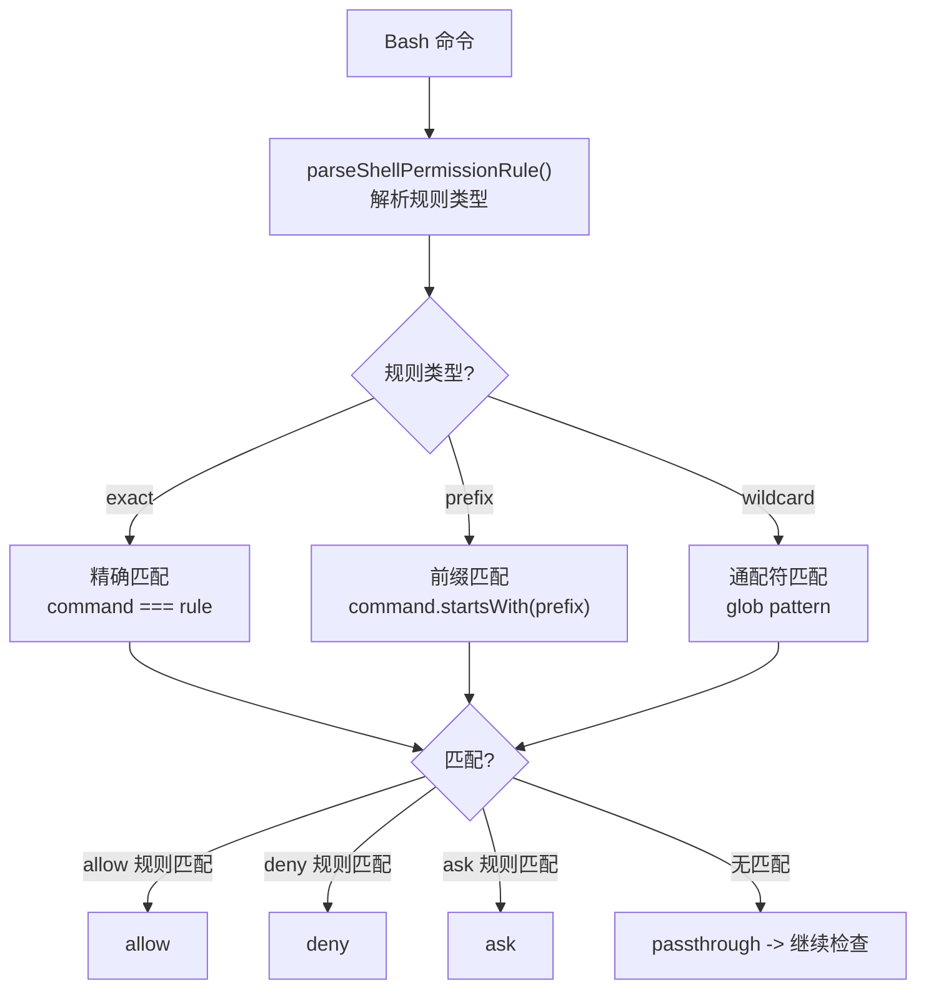
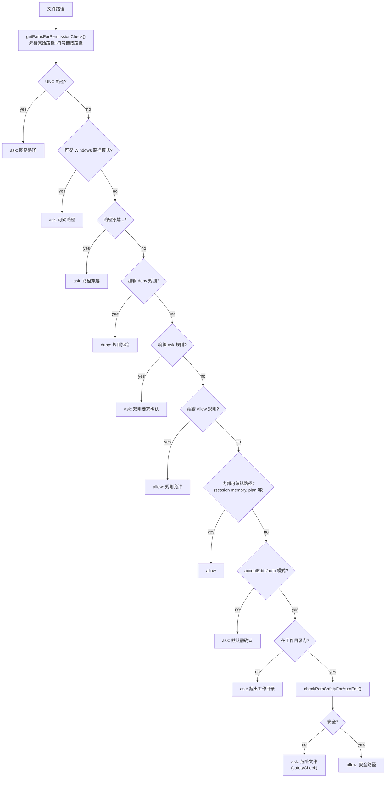
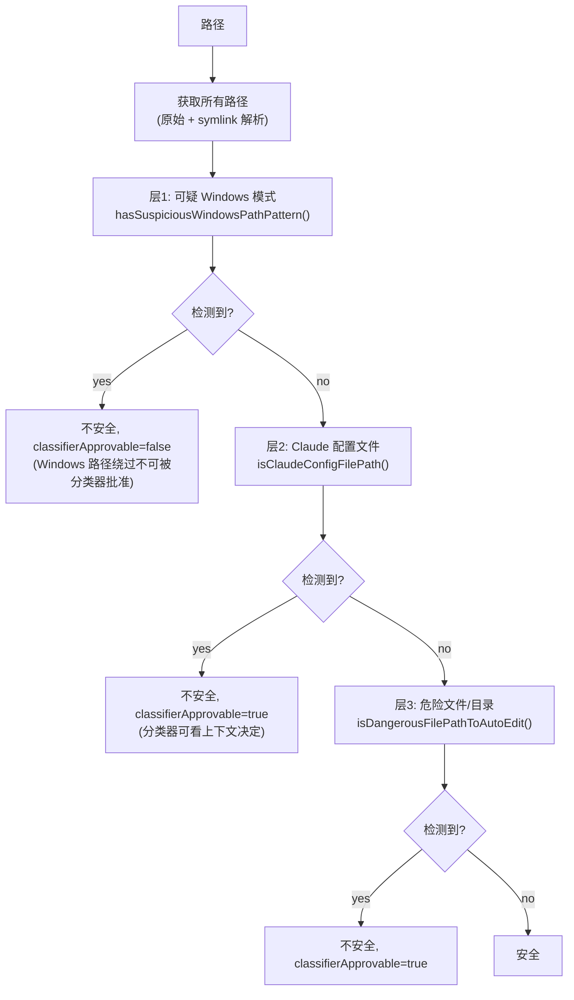
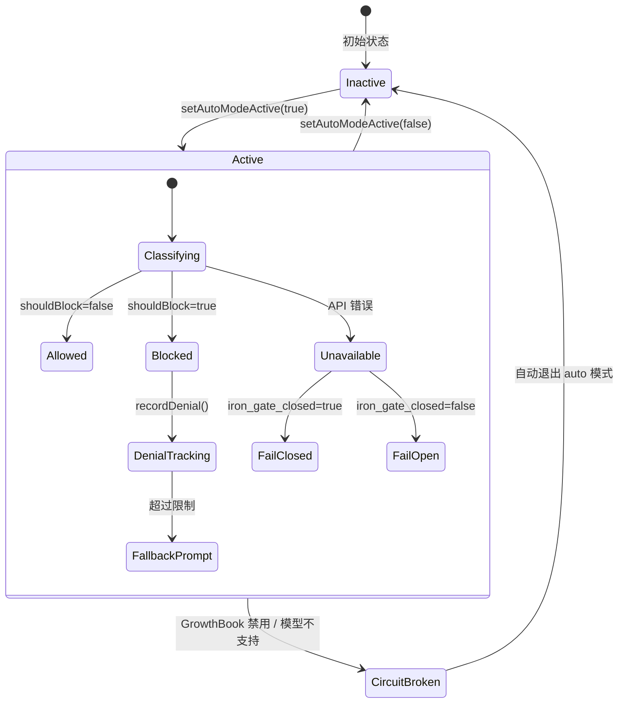

# 权限系统 子模块详细设计文档

## 文档信息
| 项目 | 内容 |
|------|------|
| 模块名称 | 权限系统 (utils/permissions/) |
| 文档版本 | v1.0-20260401 |
| 生成日期 | 2026-04-01 |
| 生成方式 | 代码反向工程 |
| 源码版本 | @anthropic-ai/claude-code v2.1.88 |

## 1. 模块概述

### 1.1 模块职责

权限系统是 Claude Code 的安全核心模块，负责在每次工具调用前进行权限检查，决定是否允许、拒绝或需要用户确认。其核心职责包括：

1. **权限模式管理**：支持 `default`、`acceptEdits`、`plan`、`bypassPermissions`、`dontAsk`、`auto` 六种权限模式，每种模式对工具调用有不同的默认行为
2. **规则匹配引擎**：基于多来源（用户设置、项目设置、策略设置、CLI 参数、会话等）的 allow/deny/ask 规则系统
3. **AI 分类器**：Auto 模式下使用独立的 AI 分类器（Yolo Classifier）判断工具调用是否安全
4. **文件系统权限**：对文件读写操作进行路径安全检查、工作目录限制和危险文件保护
5. **危险模式检测**：识别和剥离可能绕过分类器安全检查的危险权限规则

### 1.2 模块边界

**输入边界**：
- 工具调用请求（Tool + Input + ToolUseContext）
- 设置文件（settings.json 中的 permissions 配置）
- CLI 参数（`--allowed-tools`、`--disallowed-tools`、`--permission-mode`）
- GrowthBook 特性开关（`tengu_iron_gate_closed`、`tengu_disable_bypass_permissions_mode` 等）

**输出边界**：
- `PermissionDecision`：allow / ask / deny 三种决策结果
- 权限上下文（`ToolPermissionContext`）：传递给工具系统的只读权限状态

**与外部模块的关系**：
- **工具系统**（`Tool.ts`）：每个工具实现 `checkPermissions()` 方法
- **Hook 系统**（`hooks/`）：PreToolUse / PermissionRequest hook 可影响权限决策
- **设置系统**（`settings/`）：权限规则的持久化存储
- **分析系统**（`services/analytics/`）：权限决策遥测
- **沙箱系统**（`utils/sandbox/`）：沙箱隔离可自动允许部分命令

---

## 2. 架构设计

### 2.1 模块架构图

```mermaid
graph TB
    subgraph "权限检查入口"
        HAS[hasPermissionsToUseTool<br/>permissions.ts:473]
        INNER[hasPermissionsToUseToolInner<br/>permissions.ts:1158]
        RULE[checkRuleBasedPermissions<br/>permissions.ts:1071]
    end

    subgraph "规则引擎"
        ALLOW[getAllowRules]
        DENY[getDenyRules]
        ASK[getAskRules]
        MATCH[toolMatchesRule]
        CONTENT[getRuleByContentsForTool]
    end

    subgraph "分类器系统"
        YOLO[classifyYoloAction<br/>yoloClassifier.ts:1012]
        BASH_CLS[classifyBashCommand<br/>bashClassifier.ts:40]
        CLS_DEC[classifierDecision.ts<br/>isAutoModeAllowlistedTool]
        SHARED[classifierShared.ts]
    end

    subgraph "文件系统权限"
        FS_READ[checkReadPermissionForTool<br/>filesystem.ts:1030]
        FS_WRITE[checkWritePermissionForTool]
        PATH_SAFE[checkPathSafetyForAutoEdit<br/>filesystem.ts:620]
        MATCH_RULE[matchingRuleForInput<br/>filesystem.ts:955]
        PATH_IN[pathInAllowedWorkingPath<br/>filesystem.ts:683]
    end

    subgraph "权限初始化"
        INIT[initializeToolPermissionContext<br/>permissionSetup.ts:872]
        MODE_INIT[initialPermissionModeFromCLI<br/>permissionSetup.ts:689]
        STRIP[stripDangerousPermissionsForAutoMode<br/>permissionSetup.ts:510]
        TRANS[transitionPermissionMode<br/>permissionSetup.ts:597]
    end

    subgraph "状态管理"
        AUTO_STATE[autoModeState.ts<br/>autoModeActive / circuitBroken]
        DENIAL[denialTracking.ts<br/>consecutiveDenials / totalDenials]
        BYPASS_KS[bypassPermissionsKillswitch.ts]
    end

    subgraph "辅助模块"
        PARSER[permissionRuleParser.ts]
        LOADER[permissionsLoader.ts]
        UPDATE[PermissionUpdate.ts]
        SHELL[shellRuleMatching.ts]
        SHADOW[shadowedRuleDetection.ts]
        EXPLAIN[permissionExplainer.ts]
        NEXT_MODE[getNextPermissionMode.ts]
        DANGER[dangerousPatterns.ts]
    end

    HAS --> INNER
    HAS --> DENIAL
    INNER --> RULE
    INNER --> MATCH
    INNER --> YOLO
    INNER --> CLS_DEC
    RULE --> ALLOW
    RULE --> DENY
    RULE --> ASK
    YOLO --> SHARED
    YOLO --> BASH_CLS
    FS_READ --> PATH_SAFE
    FS_READ --> MATCH_RULE
    FS_READ --> PATH_IN
    FS_WRITE --> PATH_SAFE
    FS_WRITE --> MATCH_RULE
    INIT --> LOADER
    INIT --> STRIP
    STRIP --> DANGER
    TRANS --> STRIP
    TRANS --> AUTO_STATE
    NEXT_MODE --> TRANS
    BYPASS_KS --> INIT
```



### 2.2 源文件组织

24 个源文件按功能分为 6 组：

#### 第一组：核心类型与模式定义
| 文件 | 行数(约) | 职责 |
|------|----------|------|
| `PermissionMode.ts` | 142 | 权限模式枚举、配置映射、显示信息 |
| `PermissionResult.ts` | 36 | PermissionDecision 类型的重导出和辅助函数 |
| `PermissionRule.ts` | 41 | PermissionRule/PermissionBehavior 类型和 Zod schema |
| `PermissionUpdateSchema.ts` | 79 | PermissionUpdate 联合类型的 Zod schema |
| `PermissionUpdate.ts` | ~250 | `applyPermissionUpdate()` 纯函数式上下文变换 |
| `PermissionPromptToolResultSchema.ts` | 128 | SDK 权限提示工具的输入/输出 schema |

#### 第二组：权限检查主逻辑
| 文件 | 行数(约) | 职责 |
|------|----------|------|
| `permissions.ts` | ~1487 | 权限检查主流程：`hasPermissionsToUseTool()`、规则查询、Auto 模式分类器调度 |
| `permissionSetup.ts` | ~1600 | 权限初始化：`initializeToolPermissionContext()`、模式转换、危险权限检测与剥离 |

#### 第三组：AI 分类器
| 文件 | 行数(约) | 职责 |
|------|----------|------|
| `yoloClassifier.ts` | ~1500 | Auto 模式分类器：构建 transcript、调用 Anthropic API、两阶段 XML 分类 |
| `bashClassifier.ts` | 62 | Bash 命令语义分类器（外部构建为 stub） |
| `classifierDecision.ts` | 99 | 安全工具白名单 `SAFE_YOLO_ALLOWLISTED_TOOLS` |
| `classifierShared.ts` | 40 | 分类器共用的 tool_use 提取与响应解析 |

#### 第四组：文件系统权限
| 文件 | 行数(约) | 职责 |
|------|----------|------|
| `filesystem.ts` | ~1700 | 文件路径权限：工作目录检查、危险文件/目录保护、gitignore 模式匹配、读写权限检查 |
| `pathValidation.ts` | ~200 | 路径验证：tilde 展开、glob 基目录提取、沙箱写入检查 |

#### 第五组：规则解析与管理
| 文件 | 行数(约) | 职责 |
|------|----------|------|
| `permissionRuleParser.ts` | 199 | 规则字符串解析：`Bash(npm install:*)` <-> `{toolName, ruleContent}` |
| `permissionsLoader.ts` | ~200 | 从磁盘设置文件加载/保存规则 |
| `shellRuleMatching.ts` | ~200 | Shell 命令的 exact/prefix/wildcard 规则匹配 |
| `shadowedRuleDetection.ts` | ~150 | 检测被高优先级规则遮蔽的不可达规则 |
| `dangerousPatterns.ts` | 81 | 危险的 Bash/PowerShell 命令模式列表 |
| `permissionExplainer.ts` | ~150 | 使用 AI 生成权限请求的风险解释 |

#### 第六组：状态管理与模式切换
| 文件 | 行数(约) | 职责 |
|------|----------|------|
| `autoModeState.ts` | 40 | Auto 模式全局状态：active/flagCli/circuitBroken |
| `denialTracking.ts` | 46 | 拒绝计数器：连续拒绝和总拒绝数追踪 |
| `getNextPermissionMode.ts` | 102 | Shift+Tab 模式循环逻辑 |
| `bypassPermissionsKillswitch.ts` | 156 | bypass 模式和 auto 模式的异步门控检查 |

### 2.3 外部依赖

| 依赖 | 用途 |
|------|------|
| `@anthropic-ai/sdk` | Auto 模式分类器 API 调用 |
| `zod/v4` | 权限规则和更新的 schema 验证 |
| `ignore` | gitignore 风格的文件路径模式匹配 |
| `lodash-es/memoize` | 路径解析结果缓存 |
| GrowthBook (内部) | 特性开关：`tengu_iron_gate_closed`、`tengu_auto_mode_config` 等 |

---

## 3. 数据结构设计

### 3.1 核心数据结构

#### PermissionMode（权限模式）

```typescript
// types/permissions.ts
type ExternalPermissionMode = 'acceptEdits' | 'bypassPermissions' | 'default' | 'dontAsk' | 'plan'
type InternalPermissionMode = ExternalPermissionMode | 'auto' | 'bubble'
type PermissionMode = InternalPermissionMode
```

| 模式 | 行为 | 安全级别 |
|------|------|----------|
| `default` | 每次工具调用都需要用户确认 | 最高 |
| `acceptEdits` | 工作目录内的文件编辑自动允许，其他需确认 | 高 |
| `plan` | 仅计划模式，不执行工具 | 高 |
| `auto` | AI 分类器自动判断，仅阻断危险操作需确认 | 中 |
| `bypassPermissions` | 跳过所有权限检查（deny/ask 规则和 safetyCheck 仍生效） | 低 |
| `dontAsk` | 将所有 ask 转为 deny，无交互 | 特殊 |
| `bubble` | 内部模式 | 内部 |

#### PermissionRule（权限规则）

```typescript
// types/permissions.ts:75
type PermissionRule = {
  source: PermissionRuleSource    // 规则来源
  ruleBehavior: PermissionBehavior // 'allow' | 'deny' | 'ask'
  ruleValue: PermissionRuleValue   // 规则值
}

type PermissionRuleValue = {
  toolName: string       // 工具名，如 'Bash'
  ruleContent?: string   // 可选的内容限定，如 'npm install:*'
}

type PermissionRuleSource =
  | 'userSettings'     // ~/.claude/settings.json
  | 'projectSettings'  // .claude/settings.json
  | 'localSettings'    // .claude/settings.local.json
  | 'flagSettings'     // --settings 参数指定
  | 'policySettings'   // 企业策略设置
  | 'cliArg'           // --allowed-tools / --disallowed-tools
  | 'command'          // 斜杠命令 frontmatter
  | 'session'          // 会话内临时规则
```

#### PermissionDecision（权限决策）

```typescript
// types/permissions.ts:241
type PermissionDecision<Input> =
  | PermissionAllowDecision<Input>
  | PermissionAskDecision<Input>
  | PermissionDenyDecision

type PermissionAllowDecision<Input> = {
  behavior: 'allow'
  updatedInput?: Input        // 可修改的工具输入
  userModified?: boolean
  decisionReason?: PermissionDecisionReason
  toolUseID?: string
  acceptFeedback?: string
  contentBlocks?: ContentBlockParam[]
}

type PermissionAskDecision<Input> = {
  behavior: 'ask'
  message: string             // 显示给用户的提示信息
  updatedInput?: Input
  decisionReason?: PermissionDecisionReason
  suggestions?: PermissionUpdate[]  // 建议的权限更新
  blockedPath?: string
  pendingClassifierCheck?: PendingClassifierCheck
  // ...其他字段
}

type PermissionDenyDecision = {
  behavior: 'deny'
  message: string
  decisionReason: PermissionDecisionReason  // 必填
  toolUseID?: string
}
```

#### PermissionDecisionReason（决策原因）

```typescript
// types/permissions.ts:271 - 10 种原因类型
type PermissionDecisionReason =
  | { type: 'rule'; rule: PermissionRule }           // 匹配到规则
  | { type: 'mode'; mode: PermissionMode }           // 权限模式决定
  | { type: 'subcommandResults'; reasons: Map<string, PermissionResult> }  // 子命令聚合
  | { type: 'permissionPromptTool'; permissionPromptToolName: string; toolResult: unknown }
  | { type: 'hook'; hookName: string; hookSource?: string; reason?: string }
  | { type: 'asyncAgent'; reason: string }            // 无头模式自动拒绝
  | { type: 'sandboxOverride'; reason: ... }           // 沙箱覆盖
  | { type: 'classifier'; classifier: string; reason: string }  // AI 分类器
  | { type: 'workingDir'; reason: string }             // 工作目录限制
  | { type: 'safetyCheck'; reason: string; classifierApprovable: boolean }  // 安全检查
  | { type: 'other'; reason: string }
```

#### ToolPermissionContext（权限上下文）

```typescript
// types/permissions.ts:427
type ToolPermissionContext = {
  readonly mode: PermissionMode
  readonly additionalWorkingDirectories: ReadonlyMap<string, AdditionalWorkingDirectory>
  readonly alwaysAllowRules: ToolPermissionRulesBySource  // 按来源分组的 allow 规则
  readonly alwaysDenyRules: ToolPermissionRulesBySource   // 按来源分组的 deny 规则
  readonly alwaysAskRules: ToolPermissionRulesBySource    // 按来源分组的 ask 规则
  readonly isBypassPermissionsModeAvailable: boolean
  readonly strippedDangerousRules?: ToolPermissionRulesBySource  // auto 模式下被剥离的危险规则
  readonly shouldAvoidPermissionPrompts?: boolean  // 无头/异步 agent
  readonly awaitAutomatedChecksBeforeDialog?: boolean
  readonly prePlanMode?: PermissionMode            // 进入 plan 前的模式
}
```

#### DenialTrackingState（拒绝追踪状态）

```typescript
// denialTracking.ts:7
type DenialTrackingState = {
  consecutiveDenials: number   // 连续拒绝次数
  totalDenials: number         // 总拒绝次数
}

const DENIAL_LIMITS = {
  maxConsecutive: 3,   // 连续 3 次拒绝后回退到用户确认
  maxTotal: 20,        // 总计 20 次拒绝后回退到用户确认
}
```

#### YoloClassifierResult（分类器结果）

```typescript
// types/permissions.ts:346
type YoloClassifierResult = {
  thinking?: string
  shouldBlock: boolean          // true=阻止, false=允许
  reason: string
  unavailable?: boolean         // API 不可用
  transcriptTooLong?: boolean   // 上下文溢出
  model: string
  usage?: ClassifierUsage       // token 使用量
  durationMs?: number
  stage?: 'fast' | 'thinking'   // 两阶段分类器的阶段
  // ...stage1/stage2 详细指标
}
```

### 3.2 数据关系图



---

## 4. 接口设计

### 4.1 对外接口

#### `hasPermissionsToUseTool` — 权限检查入口

```typescript
// permissions.ts:473
export const hasPermissionsToUseTool: CanUseToolFn = async (
  tool: Tool,
  input: { [key: string]: unknown },
  context: ToolUseContext,
  assistantMessage: AssistantMessage,
  toolUseID: string,
): Promise<PermissionDecision>
```

这是权限系统的主入口点，由 `useCanUseTool` hook 调用。它包装 `hasPermissionsToUseToolInner` 并添加：
- 成功时重置拒绝追踪
- `dontAsk` 模式下将 ask 转为 deny
- `auto` 模式下调度 AI 分类器
- 无头模式下运行 PermissionRequest hook 或自动拒绝

#### `checkRuleBasedPermissions` — 纯规则检查

```typescript
// permissions.ts:1071
export async function checkRuleBasedPermissions(
  tool: Tool,
  input: { [key: string]: unknown },
  context: ToolUseContext,
): Promise<PermissionAskDecision | PermissionDenyDecision | null>
```

仅检查规则层面的权限（deny 规则、ask 规则、工具自身的 `checkPermissions`、safetyCheck），不运行分类器、模式转换或 hook。供 `bypassPermissions` 模式调用。返回 null 表示规则无异议。

#### `initializeToolPermissionContext` — 权限上下文初始化

```typescript
// permissionSetup.ts:872
export async function initializeToolPermissionContext({
  allowedToolsCli, disallowedToolsCli, baseToolsCli,
  permissionMode, allowDangerouslySkipPermissions, addDirs,
}): Promise<{
  toolPermissionContext: ToolPermissionContext
  warnings: string[]
  dangerousPermissions: DangerousPermissionInfo[]
  overlyBroadBashPermissions: DangerousPermissionInfo[]
}>
```

在应用启动时调用，执行：
1. 解析 CLI 参数中的工具列表
2. 从磁盘加载所有规则（`loadAllPermissionRulesFromDisk`）
3. 检测危险权限和过于宽泛的 Bash 权限
4. 构建初始 `ToolPermissionContext`
5. 验证并添加额外工作目录

#### `classifyYoloAction` — Auto 模式分类器

```typescript
// yoloClassifier.ts:1012
export async function classifyYoloAction(
  messages: Message[],
  action: TranscriptEntry,
  tools: Tools,
  context: ToolPermissionContext,
  signal: AbortSignal,
): Promise<YoloClassifierResult>
```

构建会话 transcript 的精简投影，调用 Anthropic API 进行安全分类。支持两阶段 XML 分类器模式。

#### `transitionPermissionMode` — 模式转换

```typescript
// permissionSetup.ts:597
export function transitionPermissionMode(
  fromMode: string,
  toMode: string,
  context: ToolPermissionContext,
): ToolPermissionContext
```

处理模式切换时的副作用：plan 模式附件、auto 模式激活/停用、危险权限的剥离/恢复。

#### 文件系统权限检查

```typescript
// filesystem.ts:1030
export function checkReadPermissionForTool(
  tool: Tool, input: {...}, toolPermissionContext: ToolPermissionContext
): PermissionDecision

// filesystem.ts (checkWritePermissionForTool 类似)
export function checkWritePermissionForTool(
  tool: Tool, input: {...}, toolPermissionContext: ToolPermissionContext,
  options?: { operation?: 'create' | 'write' }
): PermissionResult
```

### 4.2 内部关键函数

| 函数 | 文件 | 行号 | 职责 |
|------|------|------|------|
| `toolMatchesRule()` | permissions.ts | 238 | 判断工具是否匹配规则（含 MCP 服务器级匹配） |
| `getRuleByContentsForTool()` | permissions.ts | 349 | 获取工具的内容级规则映射 |
| `isDangerousBashPermission()` | permissionSetup.ts | 94 | 判断 Bash 规则是否危险 |
| `isDangerousPowerShellPermission()` | permissionSetup.ts | 157 | 判断 PowerShell 规则是否危险 |
| `stripDangerousPermissionsForAutoMode()` | permissionSetup.ts | 510 | 进入 auto 模式时剥离危险规则 |
| `restoreDangerousPermissions()` | permissionSetup.ts | 561 | 离开 auto 模式时恢复被剥离的规则 |
| `matchingRuleForInput()` | filesystem.ts | 955 | 使用 ignore 库匹配文件路径与规则 |
| `checkPathSafetyForAutoEdit()` | filesystem.ts | 620 | 检查路径是否安全（危险文件/目录/Windows 模式） |
| `pathInAllowedWorkingPath()` | filesystem.ts | 683 | 检查路径是否在允许的工作目录内 |
| `buildYoloSystemPrompt()` | yoloClassifier.ts | 484 | 构建分类器系统提示词 |
| `classifyYoloActionXml()` | yoloClassifier.ts | 711 | 两阶段 XML 分类器核心 |
| `buildTranscriptEntries()` | yoloClassifier.ts | 302 | 从消息历史构建分类器 transcript |
| `applyPermissionUpdate()` | PermissionUpdate.ts | 55 | 纯函数式应用单个权限更新到上下文 |
| `permissionRuleValueFromString()` | permissionRuleParser.ts | 93 | 解析 `Bash(npm install)` 为结构化规则 |
| `isAutoModeAllowlistedTool()` | classifierDecision.ts | 96 | 检查工具是否在安全白名单中 |

---

## 5. 核心流程设计

### 5.1 权限初始化流程



`initialPermissionModeFromCLI` 的模式优先级链（permissionSetup.ts:689）：
1. `--dangerously-skip-permissions` -> `bypassPermissions`
2. `--permission-mode` CLI 参数
3. `settings.permissions.defaultMode`
4. 如果都无效 -> `default`

每一步中 bypassPermissions 可能被 Statsig 门控或设置禁用而跳过。

### 5.2 权限检查主流程

`hasPermissionsToUseToolInner` (permissions.ts:1158) 的步骤编号与代码注释一致：



### 5.3 Auto/Yolo 模式分类流程

`hasPermissionsToUseTool` 的外层在 `behavior === 'ask'` 时处理 auto 模式（permissions.ts:505-927）：



关键设计决策：
- **三层快速路径**：acceptEdits 检查 -> 白名单检查 -> AI 分类器。避免不必要的 API 调用
- **拒绝限制**：连续 3 次或总计 20 次分类器拒绝后，自动回退到用户交互式确认
- **失败关闭**：分类器 API 错误时默认阻止（`tengu_iron_gate_closed` 门控），可配置失败开放

### 5.4 Bash 命令分类流程

Bash 工具的 `checkPermissions` 内部使用 `shellRuleMatching.ts` 进行命令匹配：



规则格式示例：
- `Bash(npm install)` — 精确匹配 `npm install`
- `Bash(npm:*)` — 前缀匹配所有以 `npm` 开头的命令（旧语法）
- `Bash(git commit *)` — 通配符匹配 `git commit` 后跟任意参数

### 5.5 文件系统权限检查流程

`checkWritePermissionForTool` (filesystem.ts) 的检查步骤：



### 5.6 路径验证流程

`checkPathSafetyForAutoEdit` (filesystem.ts:620) 的多层防御：



`classifierApprovable` 标志的关键安全语义：
- `false`：即使在 auto 模式下也必须提示用户（Windows 路径绕过攻击）
- `true`：auto 模式的分类器可以根据上下文决定是否允许（敏感文件但可能是合法操作）

---

## 6. 状态管理

### 6.1 权限模式状态

权限模式的生命周期：

```mermaid
stateDiagram-v2
    [*] --> default: 初始化
    [*] --> auto: CLI --permission-mode auto
    [*] --> bypassPermissions: --dangerously-skip-permissions
    [*] --> acceptEdits: settings defaultMode
    [*] --> plan: settings defaultMode
    
    default --> acceptEdits: Shift+Tab
    acceptEdits --> plan: Shift+Tab
    plan --> bypassPermissions: Shift+Tab (如果可用)
    plan --> auto: Shift+Tab (如果可用且无 bypass)
    plan --> default: Shift+Tab (无其他选项)
    bypassPermissions --> auto: Shift+Tab (如果可用)
    bypassPermissions --> default: Shift+Tab
    auto --> default: Shift+Tab
    
    note right of auto: 进入时: setAutoModeActive(true)\nstripDangerousPermissions()
    note left of auto: 离开时: setAutoModeActive(false)\nrestoreDangerousPermissions()
```

模式转换由 `transitionPermissionMode()` (permissionSetup.ts:597) 集中处理，确保所有激活路径（CLI Shift+Tab、SDK control messages）行为一致。

### 6.2 Auto 模式状态机



Auto 模式状态存储在模块级变量中 (`autoModeState.ts`)：

```typescript
let autoModeActive = false      // 当前是否激活
let autoModeFlagCli = false     // CLI 是否传入了 --auto
let autoModeCircuitBroken = false  // GrowthBook 断路器
```

### 6.3 拒绝追踪状态

拒绝追踪 (`denialTracking.ts`) 是一个简单的计数器状态机：

```
初始状态: {consecutiveDenials: 0, totalDenials: 0}

recordDenial(): consecutive++, total++
recordSuccess(): consecutive = 0 (total 不变)

shouldFallbackToPrompting():
  consecutive >= 3 OR total >= 20
```

对于异步子 agent（`context.localDenialTracking`），状态通过 `Object.assign` 就地修改而非通过 `setAppState`，因为子 agent 的 `setAppState` 是空操作。

---

## 7. 错误处理设计

### 7.1 错误处理策略

| 场景 | 处理方式 | 代码位置 |
|------|----------|----------|
| 工具 inputSchema 解析失败 | 捕获异常，使用 passthrough 默认值 | permissions.ts:1218-1223 |
| tool.checkPermissions() 异常 | 捕获异常，logError，使用 passthrough | permissions.ts:1218-1223 |
| AbortError / APIUserAbortError | 重新抛出，不捕获 | permissions.ts:1219-1220 |
| 分类器 API 错误 | 返回 `unavailable: true`，由 iron_gate 决定行为 | yoloClassifier.ts:941-996 |
| 分类器 transcript 溢出 | 返回 `transcriptTooLong: true`，回退到用户确认 | permissions.ts:822-842 |
| 分类器响应无法解析 | 返回 `shouldBlock: true`（安全失败） | yoloClassifier.ts:827-840 |
| PermissionRequest hook 异常 | 捕获，logError，回退到自动拒绝 | permissions.ts:462-470 |
| 设置文件读取失败 | `getSettingsForSourceLenient` 返回 null | permissionsLoader.ts:61-83 |
| 无头模式且分类器不可用 | 抛出 AbortError 终止 agent | permissions.ts:826-829 |

### 7.2 错误传播原则

1. **AbortError 始终重新抛出**：中止信号必须向上传播，不被任何权限检查捕获
2. **安全关键路径失败关闭**：分类器不可用时默认阻止（可通过 `tengu_iron_gate_closed` 配置）
3. **非安全路径静默降级**：输入解析失败时回退到通用权限检查，不影响用户体验

---

## 8. 安全设计

### 8.1 深度防御策略

权限系统采用多层防御设计，每一层独立运作：

**第一层：规则引擎**
- deny 规则优先于 allow 规则（1a 先于 2b）
- 规则来源有优先级（policySettings > projectSettings > userSettings 等）
- `allowManagedPermissionRulesOnly` 策略可限制仅使用企业管理的规则

**第二层：模式控制**
- `bypassPermissions` 模式仍受 deny 规则、ask 规则和 safetyCheck 约束（1d, 1f, 1g 在 2a 之前）
- `bypassPermissions` 可被 Statsig 门控 `tengu_disable_bypass_permissions_mode` 禁用
- CCR（远程模式）限制 defaultMode 只能是 acceptEdits/plan/default

**第三层：安全检查（bypass-immune）**
- `.git/`、`.claude/`、`.vscode/`、`.idea/` 目录保护 (filesystem.ts:74-79)
- `.bashrc`、`.gitconfig`、`.mcp.json` 等危险文件保护 (filesystem.ts:57-68)
- 即使在 `bypassPermissions` 模式下仍必须提示用户 (permissions.ts:1252-1260)

**第四层：分类器**（Auto 模式）
- 两阶段 XML 分类器减少误报：fast 阶段快速放行，thinking 阶段深度分析阻止决策
- 分类器不可用时失败关闭（`tengu_iron_gate_closed` 门控）
- 拒绝限制机制防止 agent 被无限阻止

**第五层：路径安全**
- 路径穿越检测 (`containsPathTraversal`)
- 符号链接解析 (`getPathsForPermissionCheck` 检查原始和解析后路径)
- Windows 特有绕过检测（NTFS ADS、8.3 短名称、长路径前缀等）
- UNC 路径检测防止网络资源访问

### 8.2 危险模式检测

进入 Auto 模式时，`stripDangerousPermissionsForAutoMode()` (permissionSetup.ts:510) 会识别并临时移除可能绕过分类器的允许规则：

**危险 Bash 模式** (`dangerousPatterns.ts` + `permissionSetup.ts:94`)：
- 工具级 allow（`Bash` 或 `Bash(*)`）— 允许所有命令
- 解释器前缀（`python:*`、`node:*`、`ruby:*`）— 可执行任意代码
- 通配符模式（`python*`、`node*`）— 匹配解释器变体
- Anthropic 内部额外模式：`curl`、`wget`、`git`、`gh` 等

**危险 PowerShell 模式** (permissionSetup.ts:157)：
- 嵌套 Shell：`pwsh`、`cmd`、`wsl`
- 字符串求值：`iex`（Invoke-Expression）、`icm`（Invoke-Command）
- 进程启动：`Start-Process`、`Start-Job`
- .NET 逃逸：`Add-Type`、`New-Object`

**危险 Agent 模式** (permissionSetup.ts:240)：
- 任何 Agent allow 规则（`isDangerousTaskPermission`）— 绕过子 agent 的分类器评估

被剥离的规则保存在 `strippedDangerousRules` 中，离开 auto 模式时通过 `restoreDangerousPermissions()` 恢复。

### 8.3 路径安全

#### Windows 路径绕过检测

`hasSuspiciousWindowsPathPattern()` (filesystem.ts:537) 检测以下攻击向量：

| 模式 | 示例 | 攻击方式 |
|------|------|----------|
| NTFS ADS | `file.txt::$DATA` | 绕过文件名检查，访问替代数据流 |
| 8.3 短名称 | `GIT~1`、`SETTIN~1.JSON` | 绕过路径字符串匹配 |
| 长路径前缀 | `\\?\C:\...`、`//?/C:/...` | 绕过路径规范化 |
| 尾随点/空格 | `.git.`、`.claude ` | Windows 会剥离尾部字符 |
| DOS 设备名 | `.git.CON`、`.bashrc.AUX` | Windows 特殊设备重定向 |
| 连续多点 | `.../file.txt` | 路径穿越变体 |
| UNC 路径 | `\\server\share` | 网络资源访问、凭据泄露 |

设计决策：选择检测而非规范化，因为：
1. 规范化依赖文件系统状态（新文件不存在无法规范化）
2. TOCTOU 竞态条件
3. 检测更可预测，不依赖外部系统状态

#### 大小写不敏感匹配

`normalizeCaseForComparison()` (filesystem.ts:90) 在所有平台上统一转为小写比较，防止通过大小写变体（如 `.cLauDe/Settings.locaL.json`）绕过安全检查。

#### 符号链接解析

文件路径检查同时检查原始路径和符号链接解析后的路径（`getPathsForPermissionCheck`），防止通过创建符号链接绕过路径保护：
```
/tmp/symlink -> /home/user/.bashrc
checkPathSafetyForAutoEdit("/tmp/symlink")
  -> pathsToCheck = ["/tmp/symlink", "/home/user/.bashrc"]
  -> 两者都检查，发现 .bashrc -> 不安全
```

---

## 9. 设计约束与决策

### 9.1 关键设计决策

| 决策 | 原因 |
|------|------|
| deny 优先于 allow | 安全原则：拒绝规则不应被允许规则覆盖 |
| safetyCheck bypass-immune | 即使 bypassPermissions 也不应自动修改 .git、.bashrc 等敏感文件 |
| Auto 模式剥离危险权限 | `Bash(python:*)` 等规则会在分类器之前生效，绕过安全评估 |
| 两阶段分类器 | Stage 1 快速放行减少延迟，Stage 2 深度分析减少误报 |
| 拒绝限制回退 | 防止 agent 陷入无限拒绝循环，3 次连续/20 次总计后交给用户 |
| 类型分离到 types/permissions.ts | 打破循环依赖（permissions -> filesystem -> permissions） |
| 条件 require 分类器模块 | `feature('TRANSCRIPT_CLASSIFIER')` 门控，DCE 移除非 ant 构建中的分类器代码 |
| classifierApprovable 区分 | Windows 路径绕过不可被分类器批准（攻击行为），敏感文件可以（可能合法） |

### 9.2 约束条件

1. **不可变上下文**：`ToolPermissionContext` 使用 `readonly` 属性，所有修改通过 `applyPermissionUpdate` 返回新对象
2. **规则来源追踪**：每条规则保留来源信息，用于显示、优先级排序和持久化
3. **向后兼容**：`permissionRuleParser.ts` 支持旧语法（`:*` 前缀、Tool 旧名称如 `Task` -> `Agent`）
4. **跨平台安全**：路径检查在所有平台运行 Windows 模式检测（NTFS 可被挂载到 Linux/macOS）
5. **无阻塞启动**：GrowthBook 门控使用缓存值进行初始化，异步验证在后台进行

---

## 10. 设计评估

### 10.1 优势

1. **深度防御**：多层独立安全检查，任何单层被绕过不会导致完全失效
2. **可扩展性**：规则系统支持任意工具的细粒度权限控制，gitignore 风格模式灵活
3. **性能优化**：三层快速路径（acceptEdits -> 白名单 -> 分类器）避免不必要的 API 调用
4. **可观测性**：完善的遥测（`tengu_auto_mode_decision` 事件含 token 使用、延迟、阶段等详细指标）
5. **优雅降级**：分类器不可用时的 fail-closed/fail-open 可配置，拒绝限制防止死循环
6. **跨平台**：Windows 路径安全检测覆盖 ADS、8.3 名称、长路径前缀等多种攻击向量

### 10.2 复杂度风险

1. **代码量大**：24 个文件，核心文件（permissions.ts、permissionSetup.ts、yoloClassifier.ts、filesystem.ts）各超过 1000 行，认知负担重
2. **条件编译**：大量 `feature('TRANSCRIPT_CLASSIFIER')` 和 `process.env.USER_TYPE === 'ant'` 分支，内部/外部构建行为差异大
3. **循环依赖**：需要将类型提取到 `types/permissions.ts`、使用条件 `require()` 和延迟模块加载来打破循环
4. **状态分散**：权限状态分布在 AppState、模块级变量（autoModeState）、GrowthBook 缓存中，一致性维护复杂
5. **规则优先级隐式**：deny > ask > allow 的优先级由代码流程位置决定而非显式配置

### 10.3 安全覆盖度评估

| 攻击向量 | 防御措施 | 覆盖评估 |
|----------|----------|----------|
| 路径穿越 (../) | `containsPathTraversal` | 完善 |
| 符号链接绕过 | 双路径检查（原始+解析） | 完善 |
| Windows 路径绕过 | `hasSuspiciousWindowsPathPattern` 6 种模式检测 | 完善 |
| UNC 网络路径 | `containsVulnerableUncPath` + 前缀检查 | 完善 |
| 大小写绕过 | `normalizeCaseForComparison` 全平台小写化 | 完善 |
| 分类器绕过 | 危险规则自动剥离 + safetyCheck bypass-immune | 完善 |
| 子 agent 委托攻击 | Agent allow 规则标记为危险并在 auto 模式剥离 | 完善 |
| 分类器提示注入 | Transcript 仅包含 tool_use（排除 assistant text） | 良好 |
| 规则覆盖攻击 | `shadowedRuleDetection.ts` 检测被遮蔽的规则 | 良好 |
