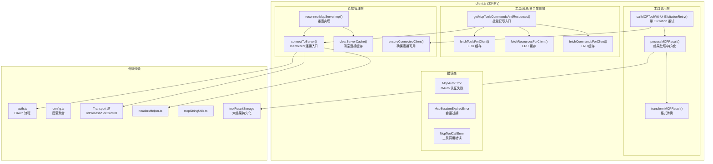
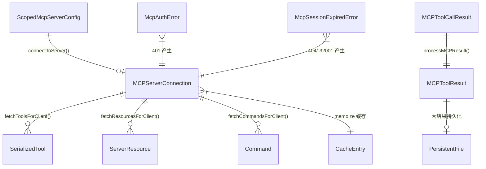
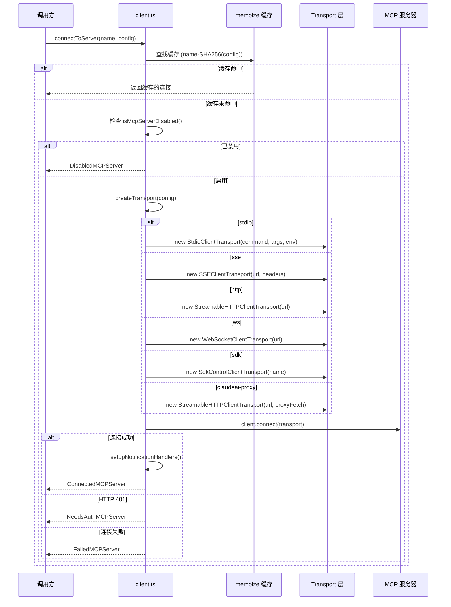
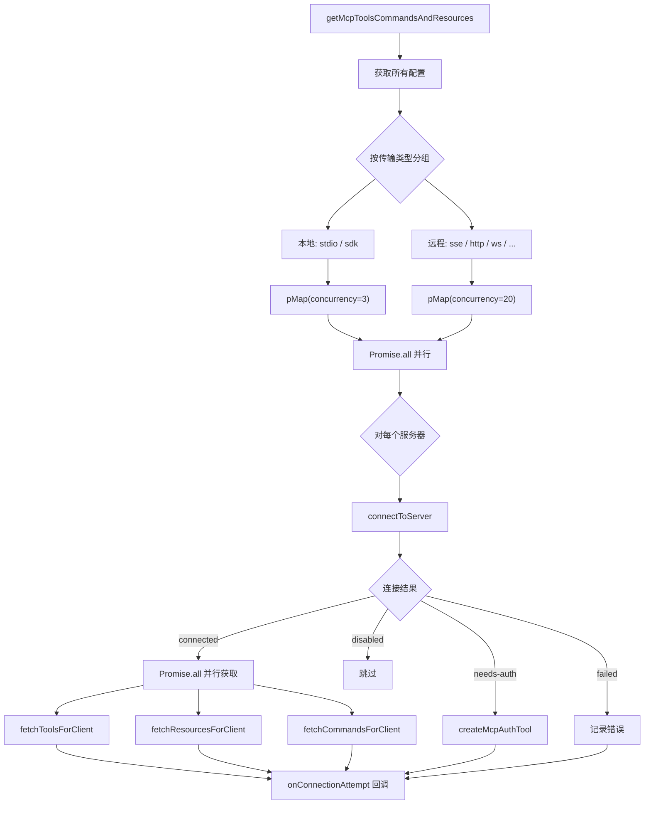
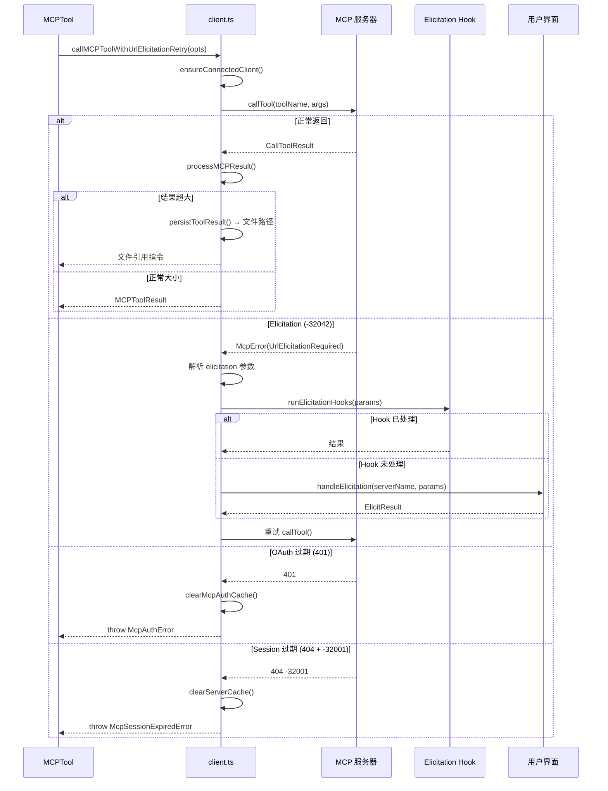
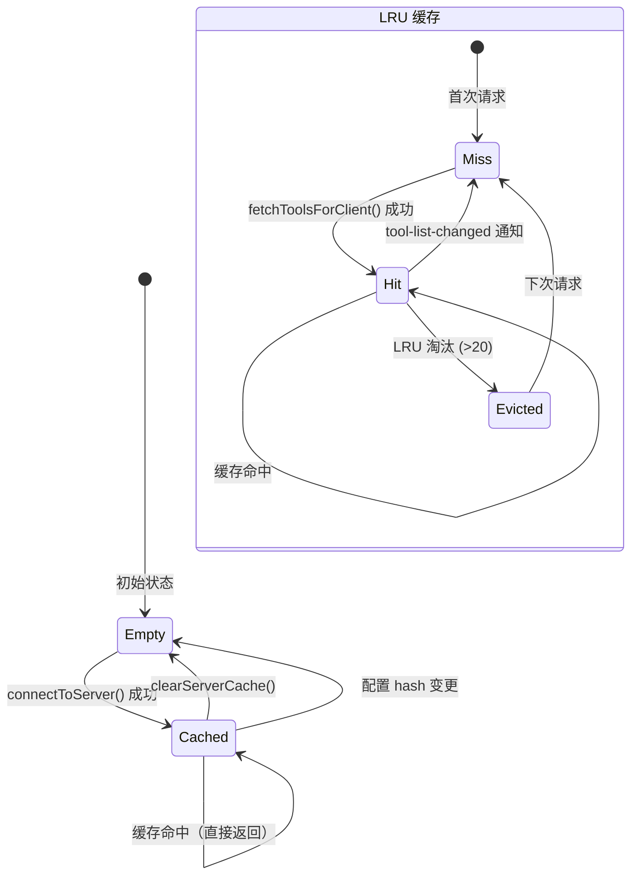
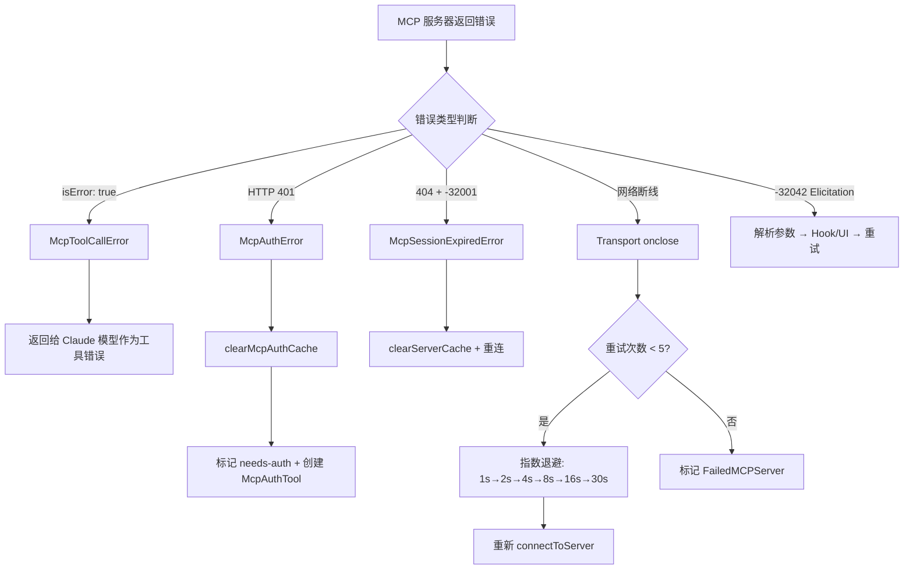
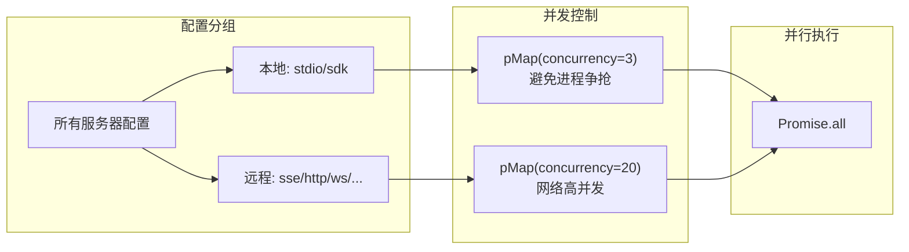

# MCP 客户端连接管理 子模块详细设计文档

## 文档信息
| 项目 | 内容 |
|------|------|
| 模块名称 | MCP 客户端连接管理 (MCP Client Connection Manager) |
| 文档版本 | v1.0-20260401 |
| 生成日期 | 2026-04-01 |
| 生成方式 | 代码反向工程 |

## 1. 模块概述

### 1.1 模块职责

本子模块是 MCP 服务链的核心引擎，实现在 `services/mcp/client.ts`（3348 行），承担以下核心职责：

1. **服务器连接建立**：根据 8 种传输类型（stdio/sse/http/ws/sse-ide/ws-ide/sdk/claudeai-proxy）选择合适的 Transport 实现，创建 MCP Client 并完成协议握手
2. **连接缓存与复用**：通过 `memoize(connectToServer)` 实现会话级连接缓存，避免重复连接同一服务器
3. **工具/资源/命令发现**：从已连接服务器批量获取可用的 tools、resources、commands，使用 LRU 缓存
4. **工具调用与结果处理**：调用 MCP 工具并处理返回结果，包括大结果持久化、格式转换、Elicitation 重试
5. **重连与缓存清除**：处理服务器断线后的指数退避重连，以及 OAuth 过期后的缓存清理
6. **批量并发控制**：本地服务器并发 3、远程服务器并发 20 的分级并发策略

### 1.2 模块边界

**输入**：
- `ScopedMcpServerConfig` 配置字典（来自 config.ts）
- MCP 服务器进程 / 远程端点（stdio/SSE/HTTP/WS）
- OAuth 令牌（来自 auth.ts）
- Elicitation 处理回调（来自 elicitationHandler.ts）

**输出**：
- `MCPServerConnection` 连接对象（connected/failed/needs-auth/pending/disabled）
- `SerializedTool[]` 工具列表
- `ServerResource[]` 资源列表
- `ListPromptsResult` 命令列表
- `MCPToolResult` / `MCPToolCallResult` 工具调用结果

**与外部模块的交互**：
| 交互模块 | 交互方式 | 说明 |
|----------|----------|------|
| config.ts | 调用 `getClaudeCodeMcpConfigs()` | 获取聚合后的服务器配置 |
| auth.ts | 调用 `performMCPOAuthFlow()` | OAuth 认证流程 |
| InProcessTransport | 创建实例 | 进程内 SDK 传输 |
| SdkControlTransport | 创建实例 | SDK 桥接传输 |
| elicitationHandler.ts | 触发 Elicitation 事件 | 处理 -32042 错误码 |
| headersHelper.ts | 调用动态请求头 | 为远程连接添加自定义 Header |
| mcpStringUtils.ts | 调用名称解析 | 构建/解析 `mcp__server__tool` 格式名称 |
| MCPTool | 被 MCPTool 调用 | 提供 callMCPToolWithUrlElicitationRetry |
| useManageMCPConnections | 被 Hook 调用 | 提供 getMcpToolsCommandsAndResources |

## 2. 架构设计

### 2.1 模块架构图



### 2.2 源文件组织

```
services/mcp/client.ts (3349行)
├── 导入 (L1-144)
├── 错误类定义 (L146-206)
│   ├── McpAuthError (L152-159)
│   ├── McpSessionExpiredError (L165-170)
│   ├── McpToolCallError (L177-186)
│   └── isMcpSessionExpiredError (L193)
├── 常量与配置 (L208-257)
│   ├── DEFAULT_MCP_TOOL_TIMEOUT_MS = 100_000_000 (~27.8h)
│   ├── MAX_MCP_DESCRIPTION_LENGTH = 2048
│   └── MCP_AUTH_CACHE_TTL_MS = 900_000 (15min)
├── Auth 缓存系统 (L259-316)
│   ├── getMcpAuthCachePath()
│   ├── getMcpAuthCache() [memoized]
│   ├── isMcpAuthCached()
│   └── setMcpAuthCacheEntry()
├── 分析与认证辅助 (L318-422)
│   ├── handleRemoteAuthFailure() — 共享 401 处理
│   └── createClaudeAiProxyFetch() (L372)
├── Transport 辅助 (L424-573)
│   ├── wrapFetchWithTimeout() (L492) — 60s 超时
│   ├── getMcpServerConnectionBatchSize() (L552)
│   └── isLocalMcpServer() (L563)
├── 连接核心 — connectToServer [memoized] (L575-1641)
│   ├── Transport 选择: sse(L619) / sse-ide(L678) / ws-ide(L708)
│   │   ws(L735) / http(L784) / sdk(L866) / claudeai-proxy(L868)
│   │   stdio-chrome(L905) / stdio-computeruse(L925) / stdio(L944)
│   ├── 错误/关闭处理 (L1228+) — MAX_ERRORS_BEFORE_RECONNECT=3
│   └── Stdio 清理升级: SIGINT→100ms→SIGTERM→400ms→SIGKILL (L1480)
├── 缓存管理 (L1643-1722)
│   ├── clearServerCache() (L1648)
│   ├── ensureConnectedClient() (L1688)
│   └── areMcpConfigsEqual() (L1710)
├── Fetch 缓存与工具构建 (L1724-2107)
│   ├── MCP_FETCH_CACHE_SIZE = 20 (L1726)
│   ├── fetchToolsForClient() [LRU] (L1743)
│   │   └── MAX_SESSION_RETRIES = 1 (L1859)
│   ├── fetchResourcesForClient() [LRU] (L2000)
│   └── fetchCommandsForClient() [LRU] (L2033)
├── 重连 (L2130-2210)
│   └── reconnectMcpServerImpl()
├── 批量处理 (L2212-2473)
│   ├── processBatched() (L2218) — pMap 并发
│   ├── getMcpToolsCommandsAndResources() (L2226)
│   └── prefetchAllMcpResources() (L2408)
├── 结果转换 (L2475-2798)
│   ├── transformResultContent() (L2478)
│   ├── transformMCPResult() (L2662)
│   └── processMCPResult() (L2720)
├── 工具调用 (L2800-3252)
│   ├── callMCPToolWithUrlElicitationRetry() (L2813)
│   │   └── MAX_URL_ELICITATION_RETRIES = 3 (L2850)
│   ├── callMCPTool() [私有] (L3029)
│   │   └── 进度日志间隔 = 30s (L3055)
│   └── extractToolUseId() (L3247)
└── SDK MCP 设置 (L3254-3349)
    └── setupSdkMcpClients()
```

### 2.3 外部依赖

| npm 包 | 用途 | 引用方式 |
|--------|------|---------|
| `@modelcontextprotocol/sdk` | MCP Client、Transport 接口、协议类型 | 创建 Client 实例 |
| `lodash-es` | `memoize`、`reject`、`mapValues` | 连接缓存、工具列表更新 |
| `p-map` | 并发控制的 Promise 映射 | 分级并发连接 |

| 内部模块 | 文件 | 用途 |
|----------|------|------|
| auth.ts | services/mcp/auth.ts | performMCPOAuthFlow |
| headersHelper.ts | services/mcp/headersHelper.ts | 动态请求头生成 |
| mcpStringUtils.ts | services/mcp/mcpStringUtils.ts | MCP 工具名称构建/解析 |
| InProcessTransport | services/mcp/InProcessTransport.ts | 进程内传输 |
| SdkControlTransport | services/mcp/SdkControlTransport.ts | SDK 桥接传输 |
| toolResultStorage | utils/toolResultStorage.ts | 大结果文件持久化 |
| normalization.ts | services/mcp/normalization.ts | 服务器名称规范化 |

## 3. 数据结构设计

### 3.1 核心数据结构

#### 3.1.1 错误类定义

| 错误类 | 行号 | 继承 | 关键字段 | 说明 |
|--------|------|------|---------|------|
| `McpAuthError` | L152-159 | Error | `serverName: string` | OAuth 认证失败，携带服务器名称 |
| `McpSessionExpiredError` | L165-170 | Error | - | MCP 会话过期（404 + JSON-RPC -32001） |
| `McpToolCallError` | L177-186 | Error | `_meta: object` | MCP 工具返回 isError:true |

#### 3.1.2 连接缓存键

```typescript
// 缓存键生成策略（client.ts:584-586）
type CacheKey = `${serverName}-${SHA256(JSON.stringify(config))}`
```

连接缓存使用 `lodash-es/memoize`，键由服务器名称和配置的 SHA256 哈希拼接而成，确保同一服务器配置变更时不会复用旧连接。

#### 3.1.3 MCPToolCallResult

```typescript
type MCPToolCallResult = {
  content: ToolResultContent[]    // MCP 返回内容（文本/图片/资源）
  isError?: boolean               // 是否为错误结果
  _meta?: Record<string, unknown> // MCP 元数据
  structuredContent?: object      // 结构化内容（新 MCP 协议）
}
```

#### 3.1.4 MCPToolResult（处理后结果）

```typescript
type MCPToolResult = {
  content: ToolResultBlockParam['content']  // 转换为 Anthropic API 格式
  isError: boolean
  _meta?: Record<string, unknown>
  structuredContent?: object
}
```

#### 3.1.5 ServerStats（服务器统计）

用于跟踪每个服务器的连接尝试和工具调用统计信息，供 `getMcpToolsCommandsAndResources` 使用。

### 3.2 数据关系图



## 4. 接口设计

### 4.1 对外接口

#### 4.1.1 `connectToServer(name, serverRef, serverStats?) => Promise<MCPServerConnection>`
- **位置**：client.ts（memoized 版本）
- **功能**：核心连接入口。根据 config.type 选择 Transport，创建 MCP Client，完成协议握手
- **参数**：
  - `name: string`：服务器名称
  - `serverRef: { config: ScopedMcpServerConfig }`：服务器配置引用
  - `serverStats?: ServerStats`：可选的统计对象
- **返回值**：`Promise<MCPServerConnection>`（五种状态之一）
- **缓存**：memoize 缓存，键为 `name-SHA256(config)`
- **Transport 选择逻辑**：
  - `stdio` / 无 type → StdioClientTransport（子进程）
  - `sse` → SSEClientTransport
  - `http` → StreamableHTTPClientTransport
  - `ws` → WebSocketClientTransport
  - `sse-ide` / `ws-ide` → IDE 专用传输
  - `sdk` → SdkControlClientTransport
  - `claudeai-proxy` → createClaudeAiProxyFetch + StreamableHTTPClientTransport

#### 4.1.2 `clearServerCache(name, serverRef) => Promise<void>`
- **位置**：client.ts:1648
- **功能**：清空指定服务器的连接缓存和 fetch 缓存
- **副作用**：调用 `client.close()` 关闭现有连接，删除 memoize 缓存条目和 LRU 缓存条目

#### 4.1.3 `ensureConnectedClient(client) => Promise<ConnectedMCPServer>`
- **位置**：client.ts
- **功能**：确保客户端已连接，否则触发重连
- **行为**：检查连接状态，如果 transport 已关闭则重新建立连接

#### 4.1.4 `getMcpToolsCommandsAndResources(onConnectionAttempt, mcpConfigs?) => Promise<void>`
- **位置**：client.ts
- **功能**：聚合获取所有服务器的工具/命令/资源，分批并发处理
- **并发策略**：
  - 本地服务器（stdio/sdk）：`pMap(concurrency=3)`，避免进程资源争抢
  - 远程服务器（sse/http/ws/...）：`pMap(concurrency=20)`，网络连接高并发
  - 两组通过 `Promise.all` 并行执行
- **回调**：`onConnectionAttempt(tools, commands, resources)` 每个服务器连接成功后调用

#### 4.1.5 `fetchToolsForClient(client) => Promise<Tool[]>`
- **位置**：client.ts:1726
- **功能**：获取工具列表
- **缓存**：LRU(20)，按服务器名称缓存
- **失效**：`tool-list-changed` 通知触发缓存清除

#### 4.1.6 `fetchResourcesForClient(client) => Promise<ServerResource[]>`
- **位置**：client.ts
- **功能**：获取资源列表
- **缓存**：LRU(20)
- **失效**：`resource-list-changed` 通知

#### 4.1.7 `fetchCommandsForClient(client) => Promise<ListPromptsResult>`
- **位置**：client.ts
- **功能**：获取命令列表
- **缓存**：LRU(20)
- **失效**：`prompt-list-changed` 通知

#### 4.1.8 `callMCPToolWithUrlElicitationRetry(opts) => Promise<MCPToolCallResult>`
- **位置**：client.ts:2822
- **功能**：核心工具调用入口，支持 Elicitation 重试
- **参数**：
  - `client: ConnectedMCPServer`：已连接服务器
  - `toolName: string`：工具名称
  - `args: Record<string, unknown>`：工具参数
  - `callToolFn`：实际调用函数（依赖注入）
  - `handleElicitation`：Elicitation 回调
  - `signal: AbortSignal`：中止信号
- **重试逻辑**：
  1. 调用工具
  2. 如收到 `-32042` (UrlElicitationRequired) → 解析 elicitation 参数 → 运行 Hook → 若 Hook 未处理则触发 UI 交互 → 重试调用
  3. 如收到 `401` → 抛出 McpAuthError
  4. 如收到 `404 + -32001` → 抛出 McpSessionExpiredError

#### 4.1.9 `processMCPResult(result, tool, name) => Promise<MCPToolResult>`
- **位置**：client.ts:2750-2798
- **功能**：处理 MCP 结果
- **步骤**：
  1. `transformMCPResult()` 格式转换（MCP → Anthropic API 格式）
  2. 检查结果大小是否超过 token 限制
  3. 超大结果 → `persistToolResult()` 保存到文件 → 返回文件引用指令
  4. 正常结果 → 直接返回

#### 4.1.10 `reconnectMcpServerImpl(name, config) => Promise<...>`
- **位置**：client.ts
- **功能**：重新连接服务器（清缓存后重建）
- **步骤**：`clearServerCache()` → `connectToServer()` → `fetchToolsForClient()`

### 4.2 内部关键函数

| 函数 | 说明 |
|------|------|
| `createTransport(config)` | 根据 config.type 创建对应 Transport 实例 |
| `setupNotificationHandlers(client)` | 注册 tool-list-changed / resource-list-changed / prompt-list-changed 通知处理器 |
| `createMcpAuthTool(name, config)` | 创建认证伪工具，用于 needs-auth 状态 |
| `transformMCPResult(result)` | 将 MCP CallToolResult 转换为 Anthropic API ToolResultBlockParam 格式 |
| `logMCPError(error, serverName)` | 格式化并记录 MCP 错误日志 |
| `mcpToolInputToAutoClassifierInput(input)` | 将 MCP 工具输入转换为安全分类器格式 |
| `wrapFetchWithTimeout(fetch, timeout)` | 为 fetch 添加超时装饰器 |
| `wrapFetchWithStepUpDetection(fetch)` | 检测 OAuth step-up 需求 |
| `createClaudeAiProxyFetch(config)` | 创建 Claude.ai 代理 fetch |

## 5. 核心流程设计

### 5.1 连接建立流程



### 5.2 批量发现流程



### 5.3 工具调用与 Elicitation 重试流程



### 5.4 关键算法

#### 5.4.1 连接缓存键生成

```
算法：generateCacheKey
输入：serverName, config
输出：缓存键字符串

1. configJson = JSON.stringify(config)
2. hash = SHA256(configJson)
3. return `${serverName}-${hash}`
```

#### 5.4.2 大结果持久化判断

```
算法：shouldPersistResult
输入：MCPToolResult, maxTokens
输出：是否需要持久化

1. resultText = 将所有 content 块拼接为文本
2. estimatedTokens = resultText.length / 4  (粗略估算)
3. if estimatedTokens > maxTokens:
4.     filepath = persistToolResult(resultText)
5.     return 替换结果为: "结果已保存到 {filepath}，请使用 Read 工具查看"
6. else:
7.     return 原始结果
```

## 6. 状态管理

### 6.1 状态定义

client.ts 管理两层缓存状态：

| 缓存层 | 实现方式 | 容量 | 生命周期 |
|--------|---------|------|---------|
| 连接缓存 | `lodash-es/memoize` | 无限 | 会话级 |
| 工具缓存 | `memoizeWithLRU` | LRU(20) | 通知驱动失效 |
| 资源缓存 | `memoizeWithLRU` | LRU(20) | 通知驱动失效 |
| 命令缓存 | `memoizeWithLRU` | LRU(20) | 通知驱动失效 |

### 6.2 缓存生命周期图



## 7. 错误处理设计

### 7.1 错误类型

| 错误类 | 触发条件 | 处理方式 |
|--------|---------|---------|
| `McpAuthError` | 连接或调用时收到 HTTP 401 | 标记 needs-auth，创建 McpAuthTool |
| `McpSessionExpiredError` | 收到 HTTP 404 + JSON-RPC -32001 | clearServerCache + 重连 |
| `McpToolCallError` | MCP 工具返回 `isError: true` | 包装为工具错误结果返回给模型 |
| 网络错误 / EOF | Transport onclose 触发 | 标记 pending，启动指数退避重连 |
| 配置错误 | JSON 解析或 Schema 校验失败 | 日志 + 跳过该服务器 |

### 7.2 错误传播策略



### 7.3 重连策略

- **最大重试次数**：`MAX_RECONNECT_ATTEMPTS = 5`
- **退避算法**：指数退避，基础间隔 1s，最大 30s
- **触发条件**：SSE/WS 连接的 `onclose` 事件
- **重连后动作**：重新获取工具/资源/命令列表

## 8. 并发设计

### 8.1 分级并发模型



**设计决策**：
- 本地服务器限制并发 3，因为每个 stdio 连接需要 fork 子进程，高并发会导致系统资源争抢
- 远程服务器允许并发 20，网络 I/O 为瓶颈，CPU 开销小

### 8.2 连接后并行获取

每个成功连接的服务器，使用 `Promise.all` 并行获取：
- `fetchToolsForClient()`
- `fetchResourcesForClient()`
- `fetchCommandsForClient()`
- `fetchMcpSkillsForClient()`（如果支持 MCP Skills）

## 9. 设计约束与决策

### 9.1 设计模式

| 模式 | 实例 | 动机 |
|------|------|------|
| **策略模式** | `connectToServer` 根据 `config.type` 选择 Transport | 统一连接接口，支持 8 种传输类型 |
| **Memoization** | `memoize(connectToServer)` + `memoizeWithLRU(fetch*)` | 避免重复连接和 API 调用 |
| **装饰器** | `wrapFetchWithTimeout()` / `wrapFetchWithStepUpDetection()` | 横切关注点组合 |
| **依赖注入** | `callMCPToolWithUrlElicitationRetry` 接收 `callToolFn` | 可测试性 |
| **工厂方法** | `createMcpAuthTool()` / `createTransport()` | 封装复杂构造 |

### 9.2 性能考量

1. **分级并发**：本地并发 3 / 远程并发 20（client.ts:552-560）
2. **LRU 缓存**：工具/资源/命令 LRU(20)（client.ts:1726），防止缓存无限增长
3. **大结果持久化**：超过 token 限制的结果保存到文件（client.ts:2750-2798）
4. **Auth 缓存跳过**：已知 needs-auth 的服务器跳过连接尝试（client.ts:2307-2322）
5. **通知驱动缓存失效**：避免轮询，由 MCP 服务器主动通知更新

### 9.3 扩展点

1. **传输类型扩展**：在 `connectToServer` 的 switch 分支中添加新 Transport 实现
2. **结果处理管道**：`processMCPResult` 可添加新的结果转换步骤
3. **自定义 fetch**：`connectToServer(opts)` 接收 `fetchFn` 参数，可注入自定义 HTTP 客户端

## 10. 设计评估

### 10.1 优点

1. **多层缓存策略精心设计**：会话级 memoize + LRU(20) + 通知驱动失效，层次分明
2. **分级并发控制**：本地 3 / 远程 20 的分级策略合理区分了 CPU 密集和 I/O 密集场景
3. **可测试的依赖注入**：`callToolFn` 参数允许在测试中替换实际调用
4. **完善的错误分类**：三种自定义错误类精确区分了认证错误、会话过期和工具调用错误
5. **大结果持久化**：自动将超大结果保存到文件，避免上下文溢出

### 10.2 缺点与风险

1. **文件过于庞大**：3348 行代码承载连接管理、工具调用、结果处理、缓存管理等多职责。代码中 TODO 注释自认复杂度过高（client.ts:589）
2. **memoize 缓存的隐式依赖**：`clearServerCache` 需要调用者同时传入 name 和 config，如果持有过期 config 引用会导致缓存未命中
3. **`any` 类型残留**：`mcpToolInputToAutoClassifierInput` 和 `callIdeRpc` 存在类型安全漏洞
4. **重连逻辑分散**：重连相关代码分布在 `connectToServer`、`ensureConnectedClient`、`reconnectMcpServerImpl` 和 `useManageMCPConnections` 中

### 10.3 改进建议

1. **拆分 client.ts**：将连接管理、工具调用、工具发现分为 3 个独立文件
2. **封装缓存管理器**：将 memoize + LRU + cache delete 封装为 `McpConnectionCache` 类
3. **统一重连入口**：将重连逻辑集中到一个 `McpReconnectionManager` 中
4. **消除 any 类型**：为 `callIdeRpc` 和 `mcpToolInputToAutoClassifierInput` 添加明确类型
