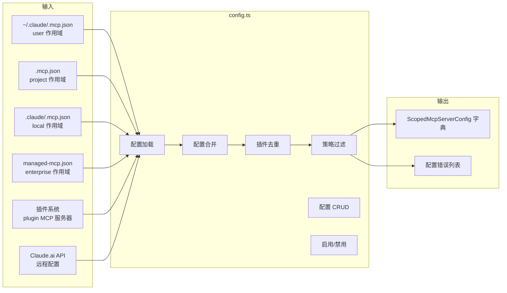
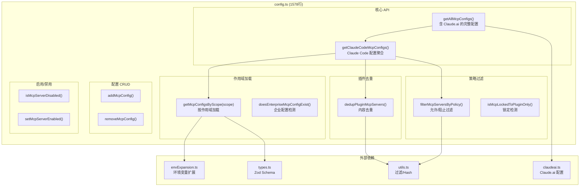
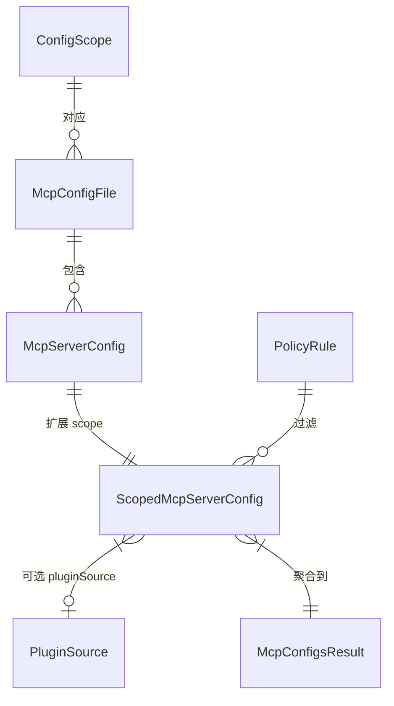
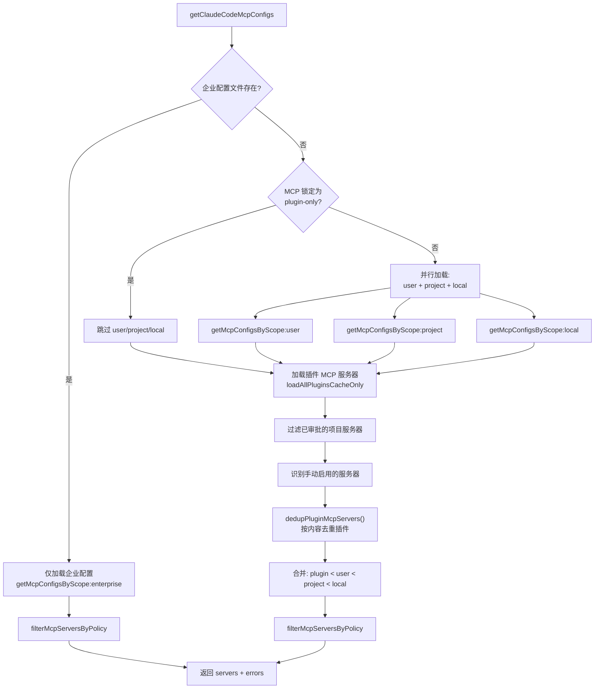
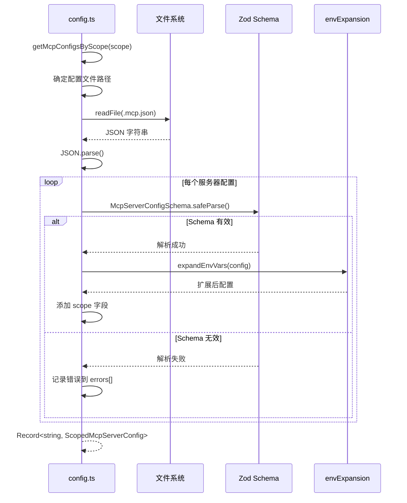
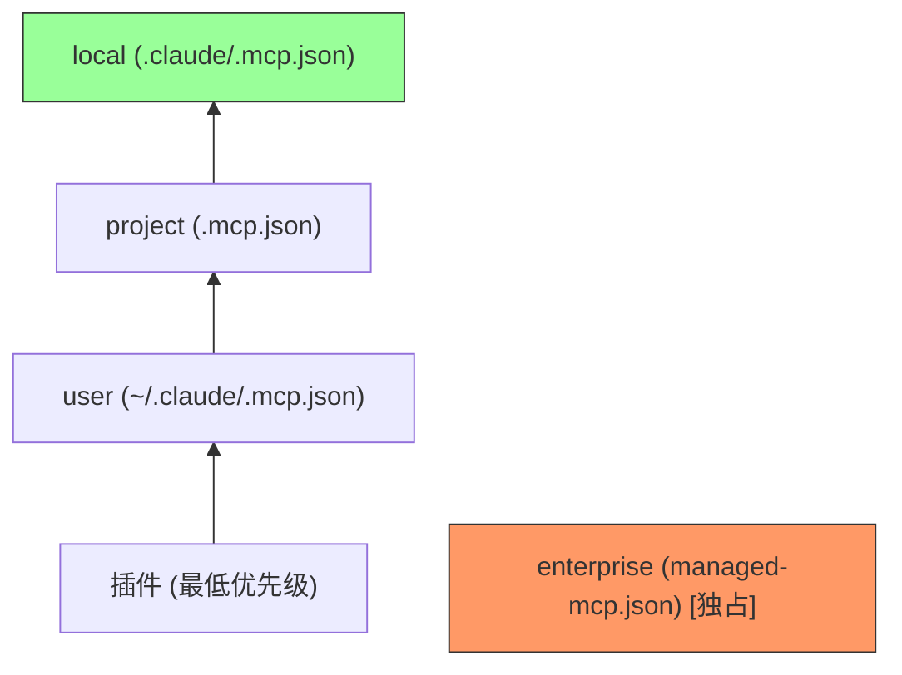

# MCP 配置聚合与过滤 子模块详细设计文档

## 文档信息
| 项目 | 内容 |
|------|------|
| 模块名称 | MCP 配置聚合与过滤 (MCP Config Aggregation & Filtering) |
| 文档版本 | v1.0-20260401 |
| 生成日期 | 2026-04-01 |
| 生成方式 | 代码反向工程 |

## 1. 模块概述

### 1.1 模块职责

本子模块实现在 `services/mcp/config.ts`（1578 行），负责 MCP 服务器配置的多层聚合与策略过滤：

1. **多作用域配置加载**：从 user、project、local、enterprise、managed 五个作用域加载 `.mcp.json` 配置文件
2. **插件 MCP 服务器集成**：从插件系统加载 MCP 服务器配置，并按内容去重
3. **Claude.ai 远程配置**：获取 Claude.ai 代理的 MCP 服务器配置（需网络请求）
4. **企业策略过滤**：根据 `managed-mcp.json` 的 allow/block 规则过滤服务器
5. **配置 CRUD**：向 `.mcp.json` 添加/删除 MCP 服务器配置
6. **服务器启用/禁用**：管理服务器的启用状态（内存级）
7. **环境变量扩展**：将配置中的 `${VAR}` 占位符替换为实际环境变量值
8. **项目服务器审批**：管理项目级 MCP 服务器的用户审批状态

### 1.2 模块边界



**输入边界**：JSON 配置文件（user/project/local/enterprise）、插件注册、Claude.ai API
**输出边界**：`{servers: Record<string, ScopedMcpServerConfig>, errors: string[]}`

## 2. 架构设计

### 2.1 模块架构图



### 2.2 源文件组织

```
services/mcp/config.ts (1578行)
├── 导入 (L1-57) — 40+ 导入
├── 辅助函数 (L59-212)
│   ├── getEnterpriseMcpFilePath() (L59)
│   ├── addScopeToServers() (L69)
│   ├── writeMcpjsonFile() (L88) — 原子写入: temp→datasync→rename
│   ├── getServerCommandArray() (L137)
│   ├── commandArraysMatch() (L149)
│   ├── getServerUrl() (L160)
│   ├── CCR 代理 URL 处理 (L168-193) — unwrapCcrProxyUrl()
│   └── getMcpServerSignature() (L202) — 去重键: "stdio:..." / "url:..."
├── 插件去重 (L223-334)
│   ├── dedupPluginMcpServers() (L223) — 签名匹配去重
│   ├── dedupClaudeAiMcpServers() (L281) — URL 匹配去重
│   └── URL 通配符匹配 (L320-334) — urlPatternToRegex/urlMatchesPattern
├── 策略过滤 (L341-551)
│   ├── getMcpAllowlistSettings() (L341)
│   ├── getMcpDenylistSettings() (L353)
│   ├── isMcpServerDenied() (L364) — 名称/命令/URL 三种匹配
│   ├── isMcpServerAllowedByPolicy() (L417) — 按传输类型智能匹配
│   └── filterMcpServersByPolicy() (L536) — SDK 类型豁免
├── 环境变量扩展 (L556-616)
│   └── expandEnvVars() — 按传输类型选择性扩展字段
├── 配置 CRUD (L625-834)
│   ├── addMcpConfig() (L625) — 名称验证+保留名阻止+去重+写入
│   └── removeMcpConfig() (L769)
├── 作用域加载 (L843-1026)
│   ├── getProjectMcpConfigsFromCwd() (L843) — 仅 CWD
│   └── getMcpConfigsByScope() (L888) — project 上溯到根目录
├── 配置聚合 (L1033-1290)
│   ├── getMcpConfigByName() (L1033) — 按优先级查询
│   ├── getClaudeCodeMcpConfigs() (L1071) — 主入口
│   └── getAllMcpConfigs() (L1258) — 含 Claude.ai
├── 配置解析 (L1297-1468)
│   ├── parseMcpConfig() (L1297) — 验证+扩展+Windows npx 检查
│   └── parseMcpConfigFromFilePath() (L1384)
├── 企业配置 (L1470-1504)
│   ├── doesEnterpriseMcpConfigExist() [memoized] (L1470)
│   ├── shouldAllowManagedMcpServersOnly() (L1485)
│   └── areMcpConfigsAllowedWithEnterpriseMcpConfig() (L1494)
└── 启用/禁用 (L1506-1578)
    ├── DEFAULT_DISABLED_BUILTIN (L1506) — computer-use 默认禁用
    ├── isDefaultDisabledBuiltin() (L1519)
    ├── isMcpServerDisabled() (L1528) — 双模型: opt-in/opt-out
    ├── toggleMembership() (L1538)
    └── setMcpServerEnabled() (L1553)
```

### 2.3 外部依赖

| 依赖 | 来源 | 用途 |
|------|------|------|
| `zod/v4` | npm | 配置 Schema 运行时验证 |
| `lodash-es` | npm | `mapValues`、`omit` 工具函数 |
| `envExpansion.ts` | 内部 | 环境变量 `${VAR}` 扩展 |
| `claudeai.ts` | 内部 | Claude.ai 远程 MCP 配置获取 |
| `utils.ts` | 内部 | `configHash()`、过滤工具函数 |
| `types.ts` | 内部 | `McpServerConfigSchema`、`ScopedMcpServerConfig` |
| `officialRegistry.ts` | 内部 | MCP 官方注册表缓存 |

## 3. 数据结构设计

### 3.1 核心数据结构

#### 3.1.1 配置作用域 ConfigScope

```typescript
// types.ts
const ConfigScopeSchema = z.enum([
  'user',       // ~/.claude/.mcp.json
  'project',    // .mcp.json (项目根目录)
  'local',      // .claude/.mcp.json (项目内)
  'enterprise', // managed-mcp.json (企业策略)
  'dynamic',    // 运行时动态添加
  'managed',    // 预留
])
type ConfigScope = z.infer<typeof ConfigScopeSchema>
```

#### 3.1.2 配置聚合结果

```typescript
type McpConfigsResult = {
  servers: Record<string, ScopedMcpServerConfig>  // 名称 → 配置
  errors: string[]                                  // 配置加载错误
}
```

#### 3.1.3 策略过滤结果

```typescript
type PolicyFilterResult = {
  allowed: Record<string, ScopedMcpServerConfig>   // 允许的服务器
  blocked: Array<{ name: string; reason: string }>  // 被阻止的服务器
}
```

#### 3.1.4 插件去重参数

```typescript
type DedupConfig = {
  pluginServers: Record<string, ScopedMcpServerConfig>
  manualServers: Record<string, ScopedMcpServerConfig>
  extraDedupTargets?: Record<string, ScopedMcpServerConfig>
}
```

### 3.2 数据关系图



## 4. 接口设计

### 4.1 对外接口

#### 4.1.1 `getClaudeCodeMcpConfigs(dynamicServers?, extraDedupTargets?) => Promise<McpConfigsResult>`
- **位置**：config.ts
- **功能**：聚合所有作用域的 MCP 配置（不含 Claude.ai），是获取本地配置的主入口
- **参数**：
  - `dynamicServers?: Record<string, ScopedMcpServerConfig>`：运行时动态添加的服务器
  - `extraDedupTargets?: Record<string, ScopedMcpServerConfig>`：额外去重目标
- **返回值**：`Promise<{servers, errors}>`
- **流程**：
  1. 检查企业配置是否存在
  2. 若存在企业配置 → 仅加载企业配置 → 策略过滤 → 返回
  3. 若 MCP 锁定为 plugin-only → 跳过 user/project/local
  4. 否则 → 加载 user + project + local 配置
  5. 加载插件 MCP 服务器
  6. 过滤已审批的项目服务器
  7. 识别启用的手动配置服务器
  8. 插件去重（`dedupPluginMcpServers`）
  9. 合并：plugin < user < project < local（后者优先）
  10. 企业策略过滤
  11. 返回

#### 4.1.2 `getAllMcpConfigs() => Promise<McpConfigsResult>`
- **位置**：config.ts
- **功能**：获取包含 Claude.ai 远程服务器的完整配置
- **行为**：调用 `getClaudeCodeMcpConfigs()` + `fetchClaudeAIMcpConfigsIfEligible()`
- **注意**：可能触发网络请求（获取 Claude.ai 配置）

#### 4.1.3 `addMcpConfig(name, config, scope) => Promise<void>`
- **位置**：config.ts
- **功能**：向指定作用域的 `.mcp.json` 添加 MCP 配置
- **参数**：
  - `name: string`：服务器名称
  - `config: McpServerConfig`：服务器配置
  - `scope: ConfigScope`：目标作用域
- **副作用**：读取现有配置文件 → 合并新配置 → 写回文件

#### 4.1.4 `removeMcpConfig(name, scope) => Promise<void>`
- **位置**：config.ts
- **功能**：从指定作用域的 `.mcp.json` 删除 MCP 配置
- **副作用**：读取现有配置文件 → 删除指定服务器 → 写回文件

#### 4.1.5 `filterMcpServersByPolicy(configs) => PolicyFilterResult`
- **位置**：config.ts
- **功能**：按企业策略过滤服务器
- **规则**：
  - `managed-mcp.json` 中的 `allowlist`：仅允许列表中的服务器
  - `managed-mcp.json` 中的 `blocklist`：阻止列表中的服务器
  - 两者互斥：allowlist 优先

#### 4.1.6 `isMcpServerDisabled(name) => boolean`
- **位置**：config.ts
- **功能**：检查服务器是否在内存级禁用集合中
- **状态**：使用模块级 `disabledServers: Set<string>`

#### 4.1.7 `setMcpServerEnabled(name, enabled) => void`
- **位置**：config.ts
- **功能**：设置服务器启用/禁用状态
- **副作用**：修改 `disabledServers` Set

#### 4.1.8 `getMcpConfigsByScope(scope) => Promise<Record<string, ScopedMcpServerConfig>>`
- **位置**：config.ts
- **功能**：加载指定作用域的配置
- **行为**：
  1. 根据 scope 确定配置文件路径
  2. 读取并解析 JSON
  3. Zod Schema 验证每个服务器配置
  4. 环境变量扩展（`expandEnvVars`）
  5. 添加 `scope` 字段
  6. 返回

### 4.2 内部关键函数

| 函数 | 说明 |
|------|------|
| `loadMcpConfigFile(path)` | 读取并解析 `.mcp.json` 文件 |
| `doesEnterpriseMcpConfigExist()` | 检查企业配置文件是否存在（memoized，进程级） |
| `getEnterpriseMcpConfig()` | 加载企业 MCP 配置 |
| `dedupPluginMcpServers(config)` | 按内容去重插件 MCP 服务器 |
| `isContentEquivalent(a, b)` | 判断两个配置是否内容等价（忽略 scope/pluginSource） |
| `isMcpLockedToPluginOnly()` | 检查是否锁定为仅插件模式 |
| `mergeConfigs(configs[])` | 多层配置合并，后者优先 |
| `isProjectServerApproved(name)` | 检查项目服务器是否已被用户审批 |
| `approveProjectServer(name)` | 记录用户对项目服务器的审批 |

## 5. 核心流程设计

### 5.1 配置聚合主流程



### 5.2 单作用域加载流程



### 5.3 插件去重算法

```
算法：dedupPluginMcpServers
输入：pluginServers, manualServers, extraDedupTargets
输出：去重后的插件服务器列表

1. 收集所有非插件服务器配置（manual + extraDedupTargets）
2. 对每个插件服务器:
   a. 忽略 scope 和 pluginSource 字段
   b. 计算配置内容 hash（configHash）
   c. 与非插件服务器逐一比较:
      - 如果 isContentEquivalent(plugin, manual) → 标记为重复
   d. 与其他插件服务器比较:
      - 如果 hash 相同 → 保留第一个
3. 返回去重后的插件服务器字典
```

### 5.4 策略过滤算法

```
算法：filterMcpServersByPolicy
输入：configs: Record<string, ScopedMcpServerConfig>
输出：{allowed, blocked}

1. 加载企业策略文件（managed-mcp.json）
2. if allowlist 存在:
   a. for each server in configs:
      - if server.name in allowlist → allowed
      - else → blocked (reason: "not in allowlist")
3. elif blocklist 存在:
   a. for each server in configs:
      - if server.name in blocklist → blocked (reason: "in blocklist")
      - else → allowed
4. else:
   a. 全部 allowed
5. return {allowed, blocked}
```

## 6. 状态管理

### 6.1 状态定义

config.ts 维护以下模块级状态：

| 状态 | 类型 | 生命周期 | 说明 |
|------|------|---------|------|
| `disabledServers` | `Set<string>` | 进程级（内存） | 被禁用的服务器名称集合 |
| `approvedProjectServers` | `Map<string, boolean>` | 进程级（内存） | 项目服务器的用户审批记录 |
| `doesEnterpriseMcpConfigExist` | `() => boolean` (memoized) | 进程级 | 企业配置文件存在性缓存 |
| `fetchClaudeAIMcpConfigsIfEligible` | memoized | 会话级 | Claude.ai 配置缓存 |

### 6.2 配置优先级



- **企业模式**：如果企业配置文件存在，完全忽略其他所有配置源
- **正常模式**：按优先级合并 `plugin < user < project < local`，同名服务器高优先级覆盖低优先级

## 7. 错误处理设计

### 7.1 错误类型

| 错误场景 | 处理方式 | 结果 |
|----------|----------|------|
| 配置文件不存在 | 静默忽略 | 返回空配置 |
| JSON 解析失败 | 记录到 errors[] | 跳过该文件 |
| Zod Schema 验证失败 | 记录到 errors[] | 跳过该服务器 |
| 环境变量未定义 | 保留原始 `${VAR}` 字符串 | 可能导致连接失败 |
| 配置文件写入失败 | 抛出异常 | 由调用方处理 |

### 7.2 错误处理策略

- **Fail-soft**：配置加载错误不阻断启动，仅跳过有问题的配置项
- **错误收集**：所有配置错误收集到 `errors[]` 数组，由调用方决定如何展示
- **Schema 验证**：每个服务器配置独立验证，单个失败不影响其他配置

## 8. 设计约束与决策

### 8.1 设计模式

| 模式 | 实例 | 动机 |
|------|------|------|
| **多层合并** | `plugin < user < project < local` 优先级 | 支持不同粒度的配置覆盖 |
| **策略模式** | `filterMcpServersByPolicy` | 支持 allowlist/blocklist 两种过滤策略 |
| **内容去重** | `dedupPluginMcpServers` | 避免插件和手动配置的重复 |
| **Memoization** | `doesEnterpriseMcpConfigExist` | 避免重复文件系统检查 |
| **Fail-soft** | 配置错误收集而非抛出 | 保证启动可用性 |

### 8.2 性能考量

1. **企业配置检测缓存**：`doesEnterpriseMcpConfigExist` 进程级 memoize，避免重复 stat 调用
2. **并行加载**：user/project/local 三个作用域的配置可并行加载
3. **内容去重优化**：使用 `configHash()` 进行快速 hash 比较，避免深度对象比较
4. **Claude.ai 配置缓存**：`fetchClaudeAIMcpConfigsIfEligible` 会话级缓存，避免重复网络请求

### 8.3 扩展点

1. **新作用域**：`ConfigScopeSchema` 枚举已预留 `dynamic` 和 `managed` 作用域
2. **新策略规则**：`filterMcpServersByPolicy` 可扩展支持更复杂的匹配规则（正则、通配符等）
3. **插件注册**：`getPluginMcpServers()` 允许新插件注册自定义 MCP 服务器

## 9. 设计评估

### 9.1 优点

1. **清晰的配置优先级**：`plugin < user < project < local` 层次分明，企业配置独占模式确保合规
2. **内容去重策略**：按配置内容而非名称去重，避免插件更名导致的重复
3. **Fail-soft 设计**：配置错误不阻断启动，提高了系统鲁棒性
4. **Schema 验证**：Zod 运行时验证确保配置格式正确，提供清晰的错误信息
5. **项目服务器审批机制**：防止恶意项目通过 `.mcp.json` 注入未经审批的 MCP 服务器

### 9.2 缺点与风险

1. **配置文件路径硬编码**：各作用域的文件路径分散在代码中，修改需多处同步
2. **环境变量扩展的安全风险**：`${VAR}` 扩展可能泄露环境中的敏感变量
3. **内存级禁用状态**：`disabledServers` 在进程重启后丢失，不持久化
4. **Claude.ai 配置的网络依赖**：`getAllMcpConfigs()` 的网络请求可能阻塞配置获取

### 9.3 改进建议

1. **集中管理配置路径**：将各作用域的文件路径定义为常量或配置
2. **环境变量白名单**：限制可扩展的环境变量范围，防止敏感信息泄露
3. **持久化禁用状态**：将 `disabledServers` 保存到用户配置文件，跨会话保持
4. **Claude.ai 配置超时**：为网络请求添加短超时（如 3s），避免阻塞启动
