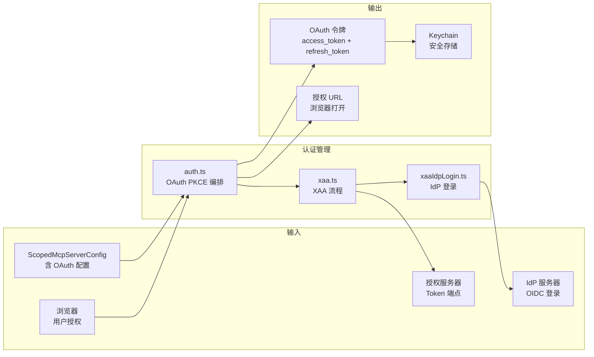
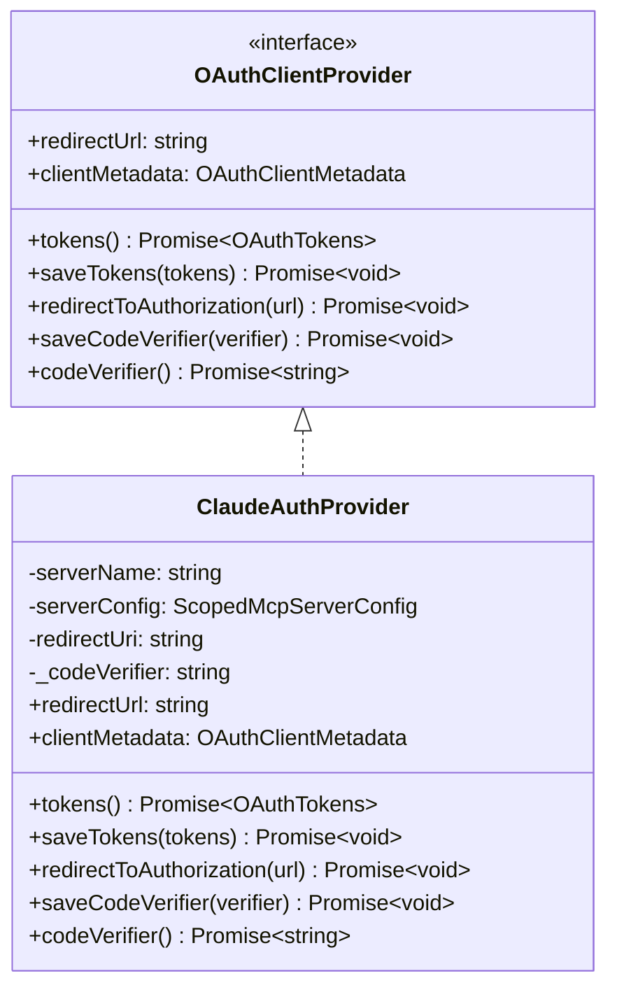
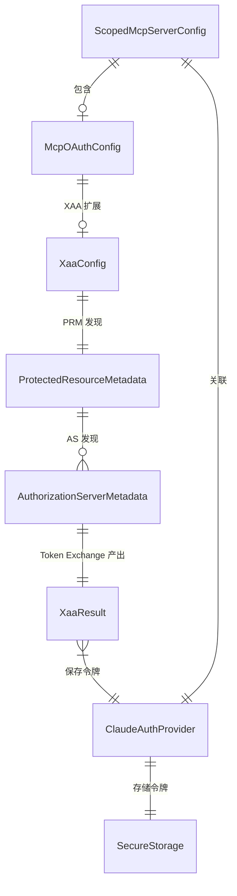
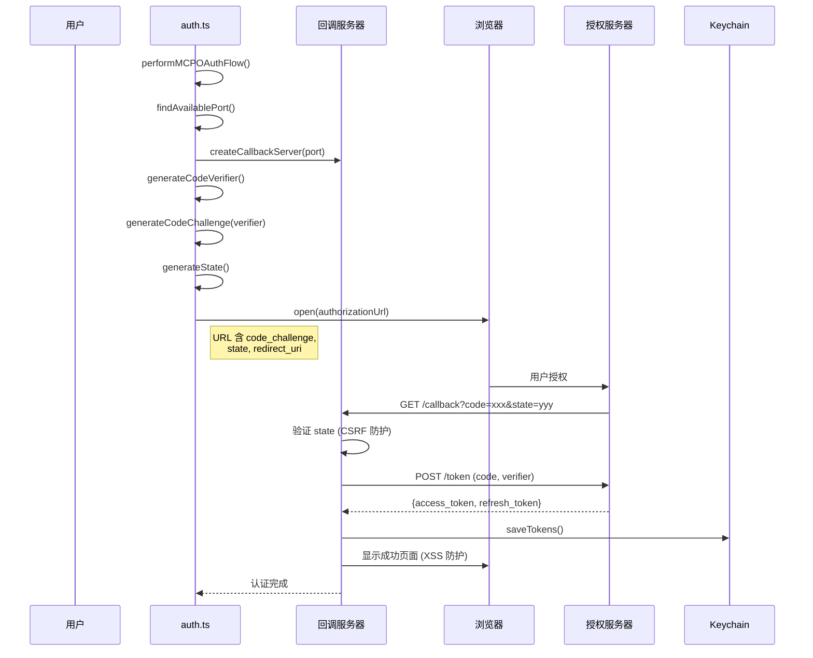
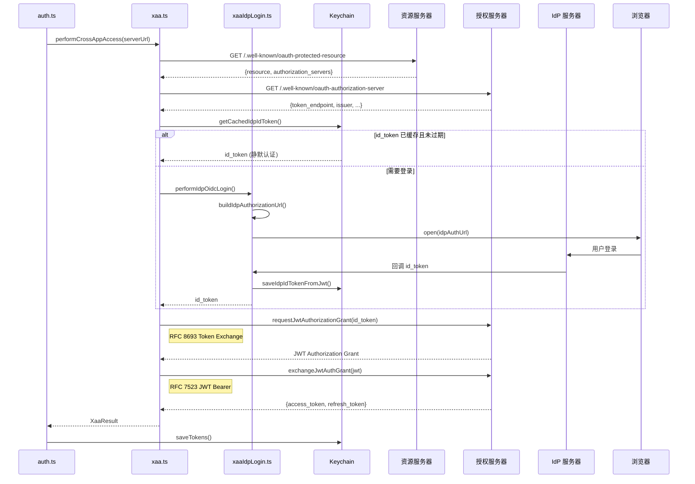
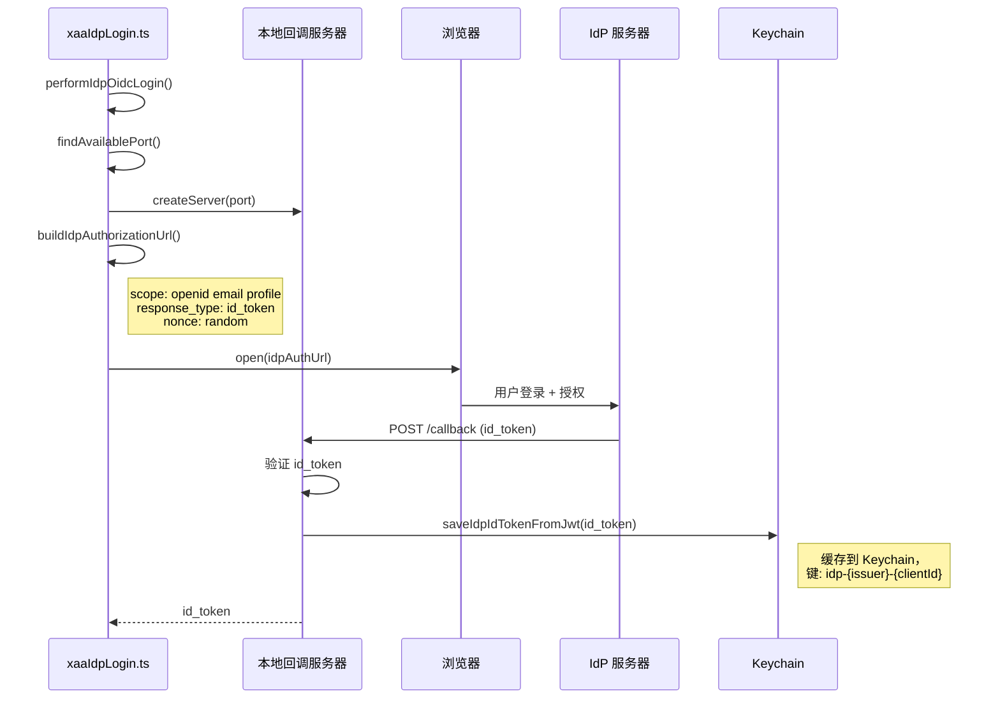
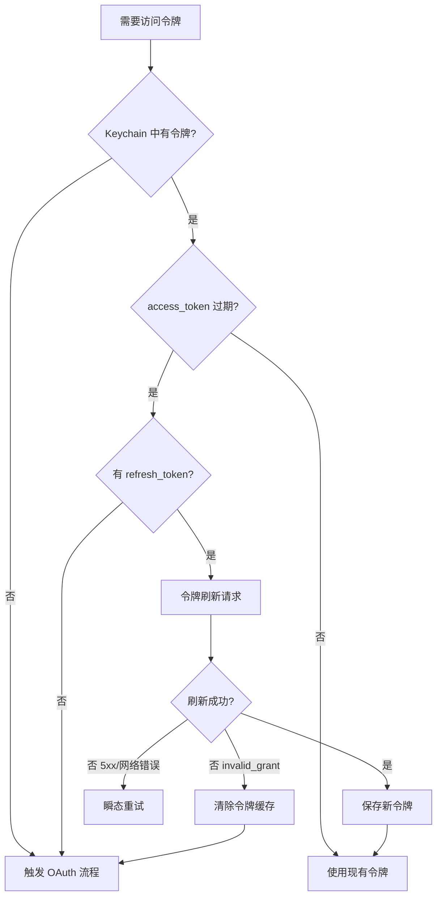
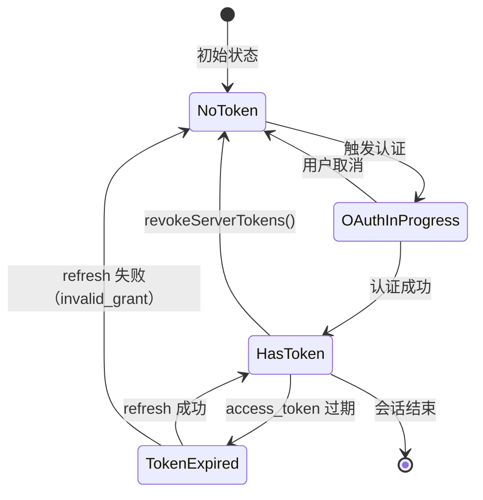

# MCP 认证管理 子模块详细设计文档

## 文档信息
| 项目 | 内容 |
|------|------|
| 模块名称 | MCP 认证管理 (MCP Authentication Manager) |
| 文档版本 | v1.0-20260401 |
| 生成日期 | 2026-04-01 |
| 生成方式 | 代码反向工程 |

## 1. 模块概述

### 1.1 模块职责

本子模块由三个核心文件组成，负责 MCP 服务器的 OAuth 2.0 认证：

| 文件 | 行数 | 职责 |
|------|------|------|
| `auth.ts` | 2465 | OAuth 2.0 PKCE 流程编排、ClaudeAuthProvider 实现、令牌管理 |
| `xaa.ts` | 511 | XAA (Cross-App Access) 企业 SSO，RFC 9728/8414/8693/7523 实现 |
| `xaaIdpLogin.ts` | 487 | IdP OIDC 登录、id_token 获取与缓存 |

核心职责包括：

1. **标准 OAuth 2.0 PKCE 流程**：为远程 MCP 服务器提供完整的授权码流程，包括本地回调服务器、PKCE code verifier/challenge、state CSRF 防护
2. **XAA 企业 SSO**：通过 Cross-App Access 实现企业级身份认证，支持 JWT Authorization Grant 和 Token Exchange
3. **IdP OIDC 登录**：引导用户通过 IdP (Identity Provider) 完成 OpenID Connect 登录，获取 id_token
4. **令牌生命周期管理**：存储、刷新、撤销 OAuth 令牌，通过 Keychain/纯文本安全存储
5. **认证状态检测**：检测服务器是否已发现但未认证（`hasMcpDiscoveryButNoToken`）
6. **OAuthClientProvider 实现**：实现 MCP SDK 要求的 `OAuthClientProvider` 接口（`ClaudeAuthProvider` 类）

### 1.2 模块边界



## 2. 架构设计

### 2.1 模块架构图

```mermaid
graph TD
    subgraph auth.ts["auth.ts (2465行)"]
        PerformOAuth["performMCPOAuthFlow()<br/>OAuth 主流程"]
        ClaudeAuthProv["ClaudeAuthProvider 类<br/>OAuthClientProvider 实现"]
        GetServerKey["getServerKey()<br/>Keychain 键生成"]
        HasDiscovery["hasMcpDiscoveryButNoToken()"]
        RevokeTokens["revokeServerTokens()"]
        FindPort["findAvailablePort()"]
        CreateServer["createCallbackServer()"]
        AuthCancelled["AuthenticationCancelledError"]
    end

    subgraph xaa.ts["xaa.ts (511行)"]
        PerformXaa["performCrossAppAccess()<br/>XAA 主流程"]
        DiscoverPRM["discoverProtectedResource()<br/>RFC 9728"]
        DiscoverAS["discoverAuthorizationServer()<br/>RFC 8414"]
        TokenExchange["requestJwtAuthorizationGrant()<br/>RFC 8693"]
        JwtBearer["exchangeJwtAuthGrant()<br/>RFC 7523"]
        RedactTokens["redactTokens()<br/>日志脱敏"]
    end

    subgraph xaaIdpLogin.ts["xaaIdpLogin.ts (487行)"]
        IdpLogin["performIdpOidcLogin()<br/>IdP 登录"]
        CacheIdToken["getCachedIdpIdToken()"]
        SaveIdToken["saveIdpIdTokenFromJwt()"]
        BuildIdpUrl["buildIdpAuthorizationUrl()"]
    end

    subgraph 外部依赖
        SecureStorage["secureStorage<br/>Keychain/纯文本"]
        OAuthService["services/oauth/<br/>OAuth 底层操作"]
        OauthPort["oauthPort.ts<br/>端口发现"]
    end

    PerformOAuth -->|XAA 模式| PerformXaa
    PerformOAuth -->|标准 PKCE| CreateServer
    PerformOAuth --> ClaudeAuthProv
    PerformXaa --> DiscoverPRM
    PerformXaa --> DiscoverAS
    PerformXaa --> TokenExchange
    PerformXaa --> JwtBearer
    PerformXaa --> IdpLogin
    IdpLogin --> CacheIdToken
    IdpLogin --> SaveIdToken
    ClaudeAuthProv --> SecureStorage
    PerformOAuth --> OAuthService
    FindPort --> OauthPort
```



### 2.2 源文件组织

```
services/mcp/auth.ts (2465行)
├── 错误类 (L313-318)
│   └── AuthenticationCancelledError
├── ClaudeAuthProvider 类 (L约400-800)
│   ├── constructor(serverName, config, redirectUri)
│   ├── get redirectUrl / clientMetadata
│   ├── tokens() → Promise<OAuthTokens>
│   ├── saveTokens(tokens) → Promise<void>
│   ├── redirectToAuthorization(url) → Promise<void>
│   ├── saveCodeVerifier(verifier) → Promise<void>
│   └── codeVerifier() → Promise<string>
├── performMCPOAuthFlow (L847-1350)
│   ├── XAA 分支
│   └── 标准 PKCE 分支
├── getServerKey (L约200)
├── hasMcpDiscoveryButNoToken (L约250)
├── revokeServerTokens (L约300)
└── 辅助函数 (L1350+)
    ├── findAvailablePort()
    ├── createCallbackServer()
    └── wrapFetchWithStepUpDetection()

services/mcp/xaa.ts (511行)
├── 类型定义 (L77-172)
│   ├── XaaTokenExchangeError
│   ├── ProtectedResourceMetadata (L126-129)
│   ├── AuthorizationServerMetadata (L167-172)
│   ├── XaaResult (L320-335)
│   └── XaaConfig (L402-415)
├── performCrossAppAccess (L约200-400)
├── discoverProtectedResource (L约130-165)
├── discoverAuthorizationServer (L约170-200)
├── requestJwtAuthorizationGrant (L约250-300)
├── exchangeJwtAuthGrant (L约300-350)
├── redactTokens (L94)
└── Zod Schemas

services/mcp/xaaIdpLogin.ts (487行)
├── performIdpOidcLogin (L约50-200)
├── getCachedIdpIdToken (L约200-250)
├── saveIdpIdTokenFromJwt (L约250-300)
├── buildIdpAuthorizationUrl (L约300-400)
└── IdP 回调服务器逻辑 (L400-487)
```

### 2.3 外部依赖

| npm 包 | 用途 | 引用位置 |
|--------|------|---------|
| `@modelcontextprotocol/sdk` | `OAuthClientProvider` 接口、`OAuthTokens` 类型 | auth.ts |
| `axios` | HTTP 请求（令牌交换、元数据获取） | auth.ts, xaa.ts |
| `xss` | XSS 防护（OAuth 回调页面 HTML） | auth.ts |
| `zod/v4` | 运行时 Schema 验证（PRM、AS 元数据） | xaa.ts |

| 内部模块 | 文件 | 用途 |
|----------|------|------|
| `services/oauth/` | index.ts, client.ts | OAuth 底层操作（URL 构建、令牌交换、刷新） |
| `utils/secureStorage/` | index.ts | Keychain/纯文本安全存储 |
| `oauthPort.ts` | services/mcp/ | OAuth 回调端口发现 |
| `services/oauth/crypto.ts` | | PKCE verifier/challenge/state 生成 |

## 3. 数据结构设计

### 3.1 核心数据结构

#### 3.1.1 ClaudeAuthProvider 类



**存储键生成**（`getServerKey`，L325）：
```typescript
// 格式: "{serverName}|{sha256(config).substring(0,16)}"
// 包含 type、url、headers 以防止凭证交叉污染
getServerKey(serverName, config) => `${serverName}|${sha256(JSON.stringify(config)).substring(0,16)}`
```

**存储槽位**：
- `mcpOAuth[serverKey]` — 每服务器 OAuth 令牌（accessToken, refreshToken, expiresAt, scope, clientId, clientSecret, discoveryState, stepUpScope）
- `mcpOAuthClientConfig[serverKey]` — 每服务器客户端配置（XAA clientSecret）
- `mcpXaaIdp[issuerKey]` — 每 IdP 缓存的 id_token
- `mcpXaaIdpConfig[issuerKey]` — 每 IdP 的 clientSecret

#### 3.1.2 XAA 类型

| 类型 | 行号 | 说明 | 关键字段 |
|------|------|------|---------|
| `XaaConfig` | xaa.ts:402-415 | XAA 流程配置 | `clientId, idpIdToken, serverUrl, signal` |
| `XaaResult` | xaa.ts:320-335 | XAA 完整结果 | `accessToken, refreshToken, authorizationServerUrl` |
| `ProtectedResourceMetadata` | xaa.ts:126-129 | RFC 9728 PRM | `resource, authorization_servers[]` |
| `AuthorizationServerMetadata` | xaa.ts:167-172 | RFC 8414 AS 元数据 | `token_endpoint, issuer` |
| `XaaTokenExchangeError` | xaa.ts:77-84 | Token Exchange 错误 | `shouldClearIdToken: boolean` |

#### 3.1.3 错误类

| 错误类 | 文件:行号 | 继承 | 说明 |
|--------|----------|------|------|
| `AuthenticationCancelledError` | auth.ts:313-318 | Error | 用户取消 OAuth 流程 |
| `XaaTokenExchangeError` | xaa.ts:77-84 | Error | XAA Token Exchange 失败，`shouldClearIdToken` 指示是否需要清除 IdP token |

### 3.2 数据关系图



## 4. 接口设计

### 4.1 对外接口

#### 4.1.1 `performMCPOAuthFlow(serverName, config, onAuthUrl, signal?, opts?) => Promise<void>`
- **位置**：auth.ts:847
- **功能**：执行完整 OAuth 流程，支持 XAA 和标准 PKCE 两种模式
- **参数**：
  - `serverName: string`：服务器名称
  - `config: ScopedMcpServerConfig`：服务器配置（含 OAuth 配置）
  - `onAuthUrl: (url: string) => void`：授权 URL 回调（打开浏览器）
  - `signal?: AbortSignal`：中止信号
  - `opts?: { skipXaa?: boolean }`：选项
- **行为**：
  1. 检查 `config.oauth.xaa === true`
  2. XAA 模式 → `performCrossAppAccess()`
  3. 标准模式 → `findAvailablePort()` → `createCallbackServer()` → `generateCodeVerifier()` → 打开浏览器 → 等待回调 → `exchangeCodeForTokens()`
  4. 存储令牌到 Keychain

#### 4.1.2 `getServerKey(serverName, config) => string`
- **位置**：auth.ts
- **功能**：生成服务器在 Keychain 中的存储键
- **格式**：`mcp-oauth-{serverName}-{SHA256(serverUrl)}`

#### 4.1.3 `hasMcpDiscoveryButNoToken(name, config) => boolean`
- **位置**：auth.ts
- **功能**：检查服务器是否已完成 OAuth 发现但缺少访问令牌
- **用途**：用于在跳过 auth 缓存时判断是否需要触发认证

#### 4.1.4 `revokeServerTokens(name) => Promise<void>`
- **位置**：auth.ts
- **功能**：撤销服务器的所有 OAuth 令牌
- **副作用**：从 Keychain 删除令牌

#### 4.1.5 `performCrossAppAccess(serverUrl, config, serverName?, signal?) => Promise<XaaResult>`
- **位置**：xaa.ts
- **功能**：完整 XAA 流程
- **流程**：
  1. `discoverProtectedResource(serverUrl)` — RFC 9728 PRM 发现
  2. `discoverAuthorizationServer(asUrl)` — RFC 8414 AS 元数据发现
  3. 获取 IdP id_token（缓存或登录）
  4. `requestJwtAuthorizationGrant(idToken)` — RFC 8693 Token Exchange
  5. `exchangeJwtAuthGrant(jwt)` — RFC 7523 JWT Bearer
  6. 返回 `XaaResult`

#### 4.1.6 `discoverProtectedResource(serverUrl, opts?) => Promise<ProtectedResourceMetadata>`
- **位置**：xaa.ts
- **功能**：RFC 9728 Protected Resource Metadata 发现
- **行为**：GET `{serverUrl}/.well-known/oauth-protected-resource`

#### 4.1.7 `discoverAuthorizationServer(asUrl, opts?) => Promise<AuthorizationServerMetadata>`
- **位置**：xaa.ts
- **功能**：RFC 8414 Authorization Server Metadata 发现
- **行为**：GET `{asUrl}/.well-known/oauth-authorization-server`

### 4.2 ClaudeAuthProvider 类接口

| 方法 | 说明 |
|------|------|
| `get redirectUrl` | 返回本地回调 URL（`http://localhost:{port}/callback`） |
| `get clientMetadata` | 返回 OAuth 客户端元数据（client_name, redirect_uris 等） |
| `tokens()` | 从 Keychain 读取 OAuth 令牌 |
| `saveTokens(tokens)` | 将 OAuth 令牌保存到 Keychain |
| `redirectToAuthorization(url)` | 打开浏览器访问授权 URL |
| `saveCodeVerifier(verifier)` | 保存 PKCE code verifier（内存） |
| `codeVerifier()` | 读取 PKCE code verifier |
| `invalidateCredentials(scope)` | 按范围清除凭证：'all'/'client'/'tokens'/'verifier'/'discovery' |
| `refreshAuthorization(refreshToken)` | 跨进程安全刷新，使用 lockfile 防止并发刷新竞争 |
| `xaaRefresh()` | 静默 XAA 令牌刷新，使用缓存的 id_token，无需浏览器 |
| `markStepUpPending(scope)` | 标记 step-up 待处理，强制 PKCE 重认证而非刷新 |

## 5. 核心流程设计

### 5.1 OAuth PKCE 标准流程



### 5.2 XAA 企业 SSO 流程



### 5.3 IdP OIDC 登录流程



### 5.4 令牌刷新逻辑



## 6. 状态管理

### 6.1 状态定义

认证模块的状态主要通过 Keychain 持久化：

| 状态项 | 存储位置 | 键格式 | 说明 |
|--------|---------|--------|------|
| OAuth 令牌 | Keychain | `mcp-oauth-{name}-{hash}` | access_token + refresh_token |
| IdP id_token | Keychain | `idp-{issuer}-{clientId}` | OIDC id_token |
| Code Verifier | 内存 | ClaudeAuthProvider._codeVerifier | PKCE 临时值 |
| OAuth State | 内存 | 回调服务器闭包 | CSRF 防护临时值 |
| OAuth 发现缓存 | 内存 | auth.ts 模块级 | PRM / AS 元数据 |

### 6.2 令牌生命周期



## 7. 错误处理设计

### 7.1 错误类型与处理

| 错误 | 触发条件 | 处理策略 |
|------|---------|---------|
| `AuthenticationCancelledError` | 用户关闭浏览器或取消授权 | 标记 needs-auth，不重试 |
| `XaaTokenExchangeError` | Token Exchange 失败 | 根据 `shouldClearIdToken` 决定是否清除 IdP token |
| `invalid_grant` | refresh_token 过期/撤销 | 清除全部令牌 → 重新触发 OAuth |
| `expired_refresh_token` | 同上 | 同上 |
| 网络错误 / 5xx | 授权服务器不可用 | 瞬态重试 |
| CSRF state 不匹配 | 回调参数被篡改 | 拒绝回调，显示错误页面 |

### 7.2 安全设计

| 安全措施 | 实现位置 | 说明 |
|---------|---------|------|
| PKCE code_challenge | auth.ts | S256 方法，防止授权码拦截 |
| State CSRF 防护 | auth.ts | 随机 state 参数，回调时验证 |
| XSS 防护 | auth.ts | 回调页面 HTML 使用 `xss` 库净化 |
| 令牌日志脱敏 | xaa.ts:94 | `redactTokens()` 替换敏感值 |
| Keychain 存储 | ClaudeAuthProvider | 通过 macOS security CLI 的 stdin 传递敏感数据，避免 argv 泄露 |
| IdP token 缓存验证 | xaaIdpLogin.ts | 检查 JWT 过期时间 |

## 8. 设计约束与决策

### 8.1 设计模式

| 模式 | 实例 | 动机 |
|------|------|------|
| **策略模式** | XAA vs 标准 PKCE 双路径 | 支持企业 SSO 和标准 OAuth |
| **适配器模式** | `ClaudeAuthProvider` 适配 `OAuthClientProvider` | 满足 MCP SDK 接口要求 |
| **模板方法** | `performMCPOAuthFlow` 统一入口，内部分支 | 共享前置检查和后置存储逻辑 |
| **装饰器** | `wrapFetchWithStepUpDetection` | 透明检测 OAuth step-up 需求 |

### 8.2 性能考量

1. **IdP token 缓存**：`getCachedIdpIdToken()` 检查 Keychain 中的 id_token，如果未过期则跳过 IdP 登录（静默认证）
2. **Auth 缓存跳过**：已知 needs-auth 的服务器跳过连接尝试，避免无效网络开销
3. **端口发现优化**：`findAvailablePort()` 从预定义范围快速找到可用端口

### 8.3 扩展点

1. **新 OAuth 流程**：`performMCPOAuthFlow` 的 opts 参数可扩展新选项
2. **新 IdP 类型**：`xaaIdpLogin.ts` 可扩展支持不同 OIDC 提供商
3. **新存储后端**：`ClaudeAuthProvider` 通过 `secureStorage` 抽象支持新存储实现

## 9. 设计评估

### 9.1 优点

1. **RFC 标准合规**：XAA 流程严格遵循 RFC 9728 (PRM)、8414 (AS Discovery)、8693 (Token Exchange)、7523 (JWT Bearer)
2. **多层安全防护**：PKCE + State CSRF + XSS 防护 + Keychain + 日志脱敏，安全纵深完善
3. **静默认证优化**：IdP token 缓存机制减少用户交互次数
4. **清晰的接口适配**：`ClaudeAuthProvider` 完整实现 `OAuthClientProvider`，与 MCP SDK 无缝集成

### 9.2 缺点与风险

1. **auth.ts 过于庞大**：2465 行代码包含 OAuth 流程、Provider 类、令牌管理，职责过重。`performMCPOAuthFlow` 单函数约 500 行
2. **XAA 流程复杂度高**：涉及 4 个 RFC 标准和 3 个参与方，调试困难
3. **浏览器依赖**：标准 OAuth 和 IdP 登录都需要打开浏览器，在无头环境不可用
4. **回调服务器的端口竞争**：本地回调服务器可能与其他应用端口冲突

### 9.3 改进建议

1. **拆分 auth.ts**：将 `ClaudeAuthProvider` 类提取为独立文件，`performMCPOAuthFlow` 拆分为标准 OAuth 和 XAA 两个入口
2. **设备授权码流程**：为无头环境添加 RFC 8628 Device Authorization Grant 支持
3. **令牌刷新预加载**：在 access_token 即将过期前主动刷新，避免调用时阻塞
4. **统一端口管理**：使用端口池管理所有 OAuth 回调端口，避免竞争
