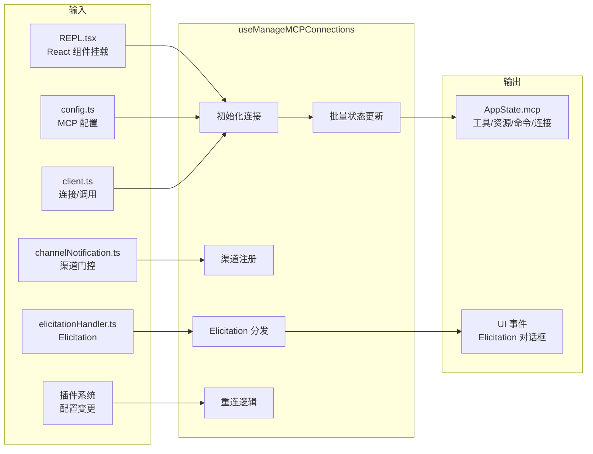
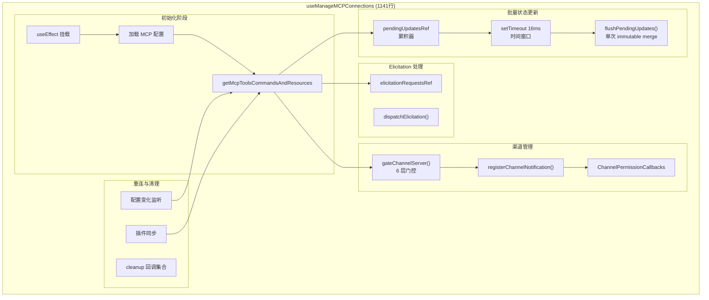
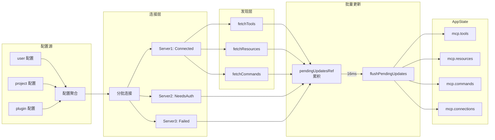
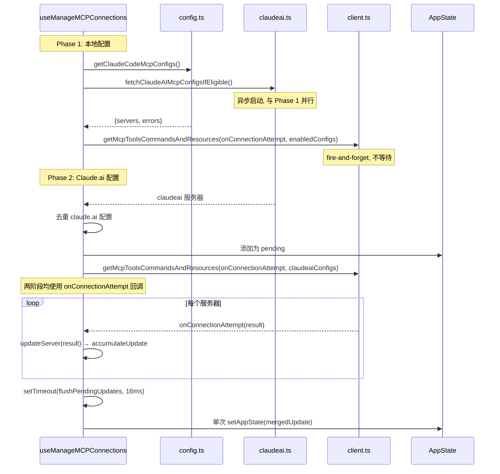
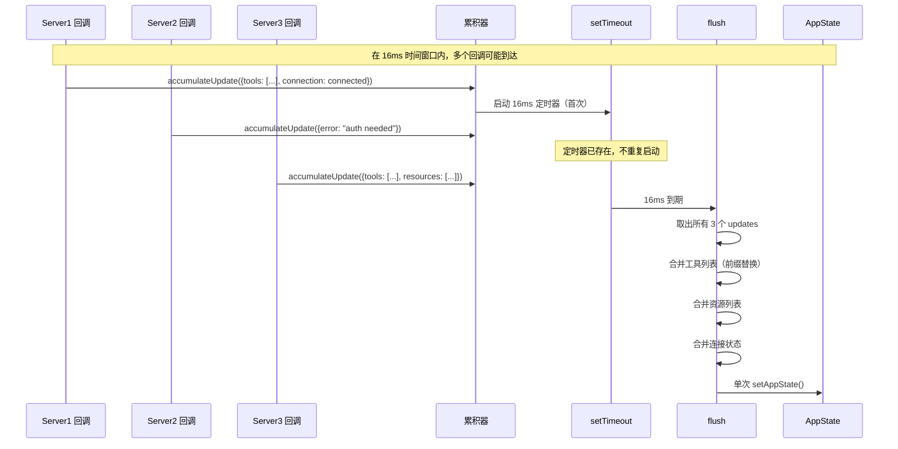
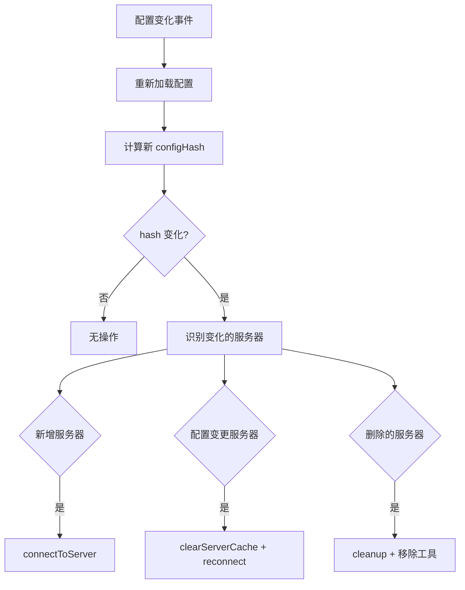

# MCP React 集成层 子模块详细设计文档

## 文档信息
| 项目 | 内容 |
|------|------|
| 模块名称 | MCP React 集成层 (useManageMCPConnections Hook) |
| 文档版本 | v1.0-20260401 |
| 生成日期 | 2026-04-01 |
| 生成方式 | 代码反向工程 |

## 1. 模块概述

### 1.1 模块职责

本子模块实现在 `services/mcp/useManageMCPConnections.ts`（1141 行），是一个 React Hook，作为 MCP 服务链与 React UI 层的桥接层：

1. **连接生命周期管理**：在 Hook 挂载时初始化所有 MCP 连接，卸载时清理
2. **批量状态更新**：使用 16ms 时间窗口将多个服务器的状态更新批量合并为单次 `setAppState` 调用
3. **渠道通知注册**：检测声明 `claude/channel` 能力的服务器，通过门控逻辑注册通知处理器
4. **Elicitation 事件分发**：处理 MCP 服务器发起的 Elicitation 请求，分发给 UI 层
5. **权限回调管理**：创建和管理渠道权限回调（`ChannelPermissionCallbacks`）
6. **重连触发**：响应配置变化、插件更新、OAuth 完成等事件触发服务器重连
7. **状态同步**：将 MCP 工具/资源/命令/连接状态同步到 `AppState.mcp`

### 1.2 模块边界



## 2. 架构设计

### 2.1 模块架构图



### 2.2 源文件组织

```
services/mcp/useManageMCPConnections.ts (1141行)
├── Hook 参数与返回值定义 (L1-50)
├── 内部 Refs (L50-120)
│   ├── pendingUpdatesRef (批量更新累积器)
│   ├── elicitationRequestsRef (Elicitation 事件队列)
│   ├── cleanupFnsRef (清理函数集合)
│   ├── configHashRef (配置 hash 缓存)
│   └── channelServersRef (渠道服务器集合)
├── 批量更新逻辑 (L207-291)
│   ├── MCP_BATCH_FLUSH_MS = 16
│   ├── accumulateUpdate()
│   └── flushPendingUpdates()
├── onConnectionAttempt 回调 (L300-500)
│   ├── 工具列表更新（基于前缀替换）
│   ├── 资源列表更新
│   ├── 命令列表更新
│   └── 连接状态更新
├── 渠道通知处理 (L500-700)
│   ├── checkAndRegisterChannels()
│   ├── createChannelPermissionCallbacks()
│   └── registerNotificationHandler()
├── Elicitation 处理 (L700-850)
│   ├── handleElicitationRequest()
│   └── cleanupElicitation()
├── 重连逻辑 (L850-1000)
│   ├── handleConfigChange()
│   ├── handlePluginSync()
│   └── handleReloadPlugins()
├── useEffect 挂载/卸载 (L1000-1100)
│   ├── 初始化连接
│   └── 清理所有资源
└── 返回值 (L1100-1141)
```

### 2.3 外部依赖

| 依赖 | 来源 | 用途 |
|------|------|------|
| `React` | npm | `useEffect`, `useRef`, `useCallback` |
| `lodash-es/reject` | npm | 基于前缀的工具替换 |
| `client.ts` | 内部 | `getMcpToolsCommandsAndResources`, `reconnectMcpServerImpl` |
| `config.ts` | 内部 | `getClaudeCodeMcpConfigs` |
| `channelNotification.ts` | 内部 | `gateChannelServer` |
| `channelPermissions.ts` | 内部 | `createChannelPermissionCallbacks` |
| `elicitationHandler.ts` | 内部 | Elicitation 事件类型 |

## 3. 数据结构设计

### 3.1 核心数据结构

#### 3.1.1 批量更新累积器

```typescript
// pendingUpdatesRef 结构
type PendingUpdate = {
  serverName: string
  tools?: SerializedTool[]         // 新增/替换的工具
  resources?: ServerResource[]     // 新增/替换的资源
  commands?: Command[]             // 新增/替换的命令
  connection?: MCPServerConnection // 连接状态
  error?: string                   // 错误信息
}

// 累积器
type PendingUpdatesRef = React.MutableRefObject<PendingUpdate[]>
```

#### 3.1.2 批量状态更新常量

```typescript
const MCP_BATCH_FLUSH_MS = 16  // 16ms 时间窗口（约一帧）
```

#### 3.1.3 Hook 返回值

```typescript
type UseManageMCPConnectionsReturn = {
  isInitialized: boolean           // 初始化完成标志
  reconnectServer: (name) => void  // 手动重连
  reloadPlugins: () => void        // 重新加载插件
}
```

### 3.2 数据流图



## 4. 接口设计

### 4.1 Hook 接口

```typescript
function useManageMCPConnections(
  dynamicMcpConfig: Record<string, ScopedMcpServerConfig> | undefined,
  isStrictMcpConfig: boolean = false  // true 时跳过 Claude Code 配置，仅用 dynamicMcpConfig
): {
  reconnectMcpServer: (serverName: string) => void  // 手动重连指定服务器
  toggleMcpServer: (serverName: string) => void      // 启用/禁用切换
}
```

**内部状态来源**：
- `useAppStateStore()` — 直接 store 访问，在回调中使用 `getState()`
- `_authVersion` — 监听认证变化触发重连
- `_pluginReconnectKey` — 由 `/reload-plugins` 递增触发重连

### 4.2 内部关键函数

#### 4.2.1 `accumulateUpdate(update: PendingUpdate)`
- **功能**：将单个服务器的更新添加到累积器
- **行为**：push 到 `pendingUpdatesRef.current`，如果没有 pending timer 则启动 `setTimeout(flushPendingUpdates, 16)`

#### 4.2.2 `flushPendingUpdates()`
- **位置**：L207-291
- **功能**：将所有累积的更新合并为单次 `setAppState` 调用
- **算法**：
  1. 取出 `pendingUpdatesRef.current`，清空累积器
  2. 对每个 update：
     - 工具：`reject(currentTools, t => t.name.startsWith(prefix))` + 新工具
     - 资源：按 serverName 替换
     - 命令：按 serverName 替换
     - 连接：更新连接状态
  3. 单次调用 `setAppState()`

#### 4.2.3 `onConnectionAttempt(result)`
- **位置**：L300-500
- **功能**：每个服务器连接完成后的回调
- **行为**：
  1. 根据连接结果构造 PendingUpdate
  2. 调用 `accumulateUpdate()`
  3. 如果是 connected，检查渠道能力

#### 4.2.4 `checkAndRegisterChannels(server)`
- **位置**：L500-700
- **功能**：检查服务器是否声明渠道能力，通过门控后注册通知处理器
- **流程**：`gateChannelServer()` → `register` → `setNotificationHandler()`

#### 4.2.5 `handleConfigChange()`
- **功能**：检测配置 hash 变化，触发增量重连
- **行为**：对比新旧 configHash，对变化的服务器调用 `reconnectMcpServerImpl()`

## 5. 核心流程设计

### 5.1 初始化流程（两阶段）

初始化分为两个 useEffect：

**Effect 1 — 初始化为 Pending 状态（L772-854）**：
1. 加载配置 `getClaudeCodeMcpConfigs(dynamicMcpConfig)`
2. 检测过期插件客户端（`excludeStalePluginClients`）
3. 清理过期服务器（取消重连定时器、清缓存）
4. 将新服务器设置为 `'pending'` 或 `'disabled'`

**Effect 2 — 加载并连接（L856-1024）**：



### 5.2 批量更新流程



### 5.3 工具列表前缀替换算法

```
算法：mergeToolsWithPrefixReplace
输入：currentTools, serverName, newTools
输出：更新后的工具列表

1. prefix = getMcpPrefix(serverName)  // "mcp__serverName__"
2. filtered = reject(currentTools, t => t.name.startsWith(prefix))
3. return [...filtered, ...newTools]
```

**设计要点**：使用前缀匹配而非精确匹配，因为一个 MCP 服务器可能提供多个工具，重连后工具列表可能变化。前缀替换确保整个服务器的旧工具被新工具完整替换。

### 5.4 配置变化检测



## 6. 状态管理

### 6.1 状态定义

Hook 内部使用 React Refs 管理可变状态（避免触发不必要的重渲染）：

| Ref | 类型 | 说明 |
|-----|------|------|
| `pendingUpdatesRef` | `PendingUpdate[]` | 批量更新累积器 |
| `elicitationRequestsRef` | `Map<string, ElicitationRequestEvent>` | 活跃的 Elicitation 事件 |
| `cleanupFnsRef` | `Map<string, () => void>` | 每个服务器的清理函数 |
| `configHashRef` | `string` | 当前配置的 hash 值 |
| `channelServersRef` | `Set<string>` | 已注册渠道的服务器集合 |
| `timerRef` | `NodeJS.Timeout \| null` | 批量更新定时器 |

### 6.2 AppState.mcp 结构

```typescript
type AppStateMcp = {
  tools: SerializedTool[]                      // 所有 MCP 工具
  resources: Record<string, ServerResource[]>  // 按服务器分组的资源
  commands: Command[]                          // 所有 MCP 命令
  connections: MCPServerConnection[]           // 连接状态列表
  normalizedNames: Record<string, string>      // 规范化名称映射
  configs: Record<string, ScopedMcpServerConfig> // 配置字典
}
```

## 7. 错误处理设计

### 7.1 错误处理策略

| 错误场景 | 处理方式 |
|----------|----------|
| 配置加载失败 | 记录 errors，继续处理成功的配置 |
| 单个服务器连接失败 | 记录 FailedMCPServer，不影响其他服务器 |
| 批量更新异常 | try-catch 包裹 flush，记录日志 |
| Elicitation 超时 | 回退 skipElicitation: true |
| 清理函数异常 | try-catch 包裹，确保其他清理继续 |

### 7.2 清理保证

```mermaid
flowchart TD
    A[组件卸载] --> B[遍历 cleanupFnsRef]
    B --> C{每个清理函数}
    C --> D[try: cleanup()]
    D -->|成功| E[继续下一个]
    D -->|异常| F[catch: 记录日志]
    F --> E
    E --> G{还有更多?}
    G -->|是| C
    G -->|否| H[清理定时器]
    H --> I[清空 Refs]
```

## 8. 设计约束与决策

### 8.1 设计模式

| 模式 | 实例 | 动机 |
|------|------|------|
| **观察者模式** | `onConnectionAttempt` 回调 | 异步事件驱动的状态更新 |
| **批量合并** | 16ms 时间窗口 + pendingUpdatesRef | 避免高频 React 渲染 |
| **前缀替换** | `reject(tools, startsWith(prefix))` | 按服务器原子替换工具集 |
| **Ref 状态管理** | useRef 而非 useState | 避免不必要的组件重渲染 |

### 8.2 性能考量

1. **16ms 批量窗口**（useManageMCPConnections.ts:207）：一帧内的所有更新合并为单次 state merge，减少 React 渲染次数
2. **Immutable state merge**：每次 flush 产生新的 state 对象，利用 React 的浅比较优化渲染
3. **Ref 状态隔离**：可变状态存储在 Ref 中，不触发组件 re-render
4. **前缀替换**：O(n) 复杂度的工具列表更新，n 为当前工具总数

### 8.3 扩展点

1. **批量窗口调整**：`MCP_BATCH_FLUSH_MS` 常量可根据场景调整
2. **新事件类型**：可在 `onConnectionAttempt` 中扩展新的事件处理分支
3. **渠道过滤**：渠道注册逻辑可扩展新的门控条件

## 9. 设计评估

### 9.1 优点

1. **批量更新优化**：16ms 时间窗口有效减少高频 React 渲染，在 20+ 个服务器并发连接时尤为重要
2. **前缀替换策略**：按服务器前缀替换工具集，确保重连后工具列表的原子更新
3. **清理保证**：通过 cleanupFnsRef 确保所有资源在组件卸载时被正确清理
4. **Ref 状态隔离**：正确使用 React Ref 管理高频变化的状态，避免不必要的渲染

### 9.2 缺点与风险

1. **职责过重**：1141 行的单个 Hook 同时管理连接初始化、重连、渠道通知、Elicitation、权限回调、批量更新和插件同步
2. **Ref 状态调试困难**：React DevTools 不展示 Ref 内容，调试批量更新累积器较困难
3. **16ms 固定窗口**：固定时间窗口在不同场景下可能不是最优（快速场景太慢，慢速场景浪费帧）
4. **配置变化检测粗粒度**：基于 configHash 比较，无法精确识别具体哪个服务器的配置变更

### 9.3 改进建议

1. **拆分 Hook**：将渠道逻辑提取为 `useChannelNotifications`，重连逻辑提取为 `useMcpReconnection`，批量更新提取为 `useBatchedMcpState`
2. **自适应批量窗口**：根据待处理更新数量动态调整窗口大小
3. **增量配置比较**：记录每个服务器的配置 hash，精确识别变更的服务器
4. **状态调试支持**：添加 debug 模式，在 console 输出批量更新的详细信息
