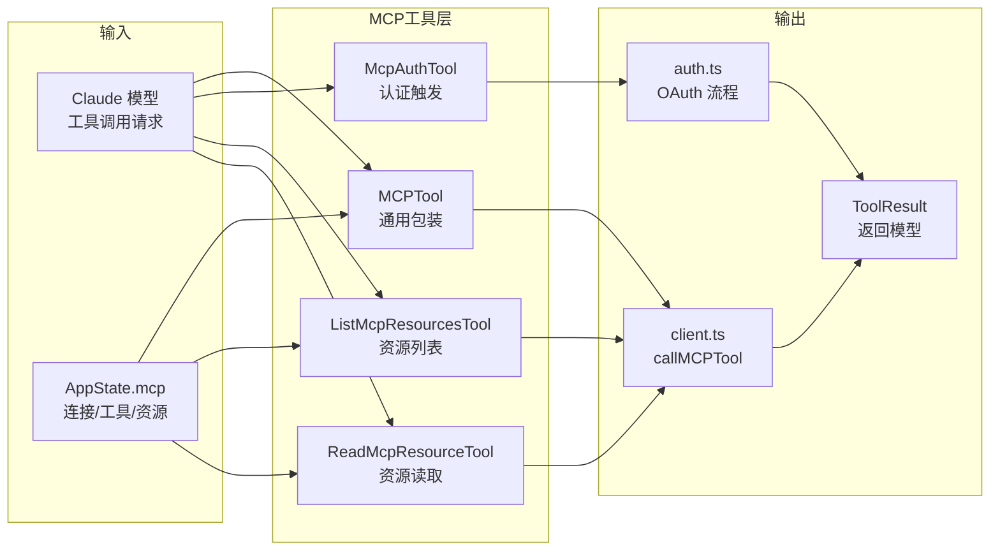
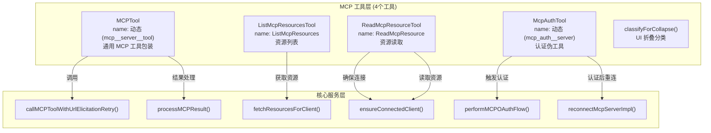
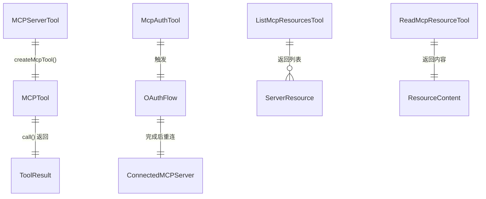
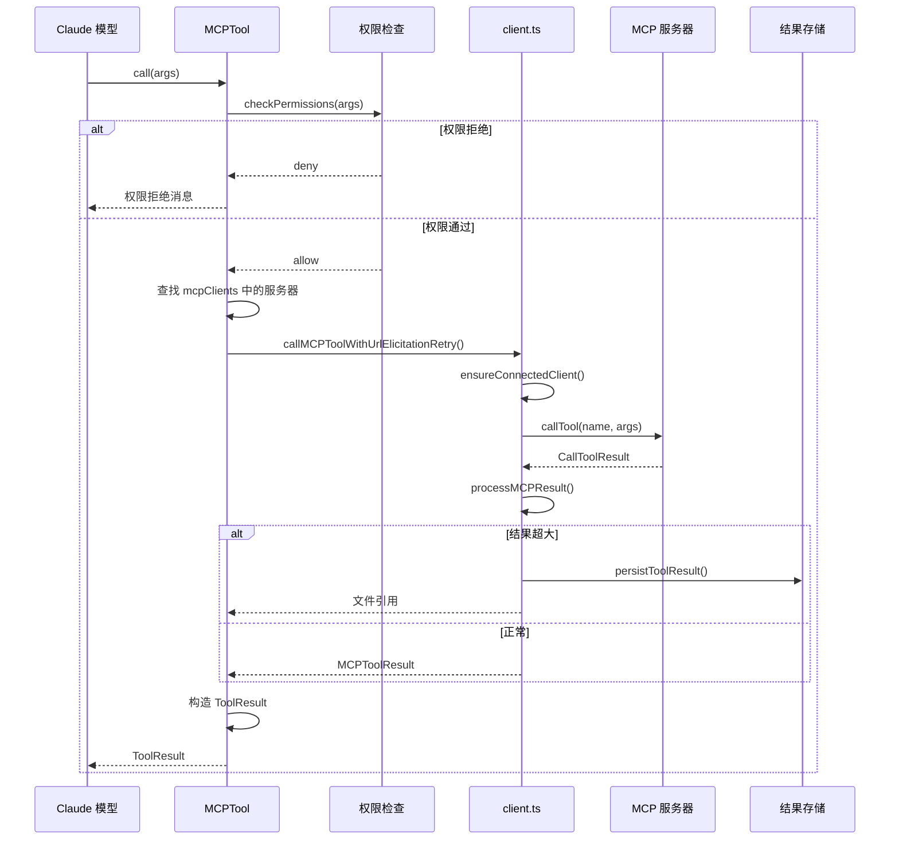
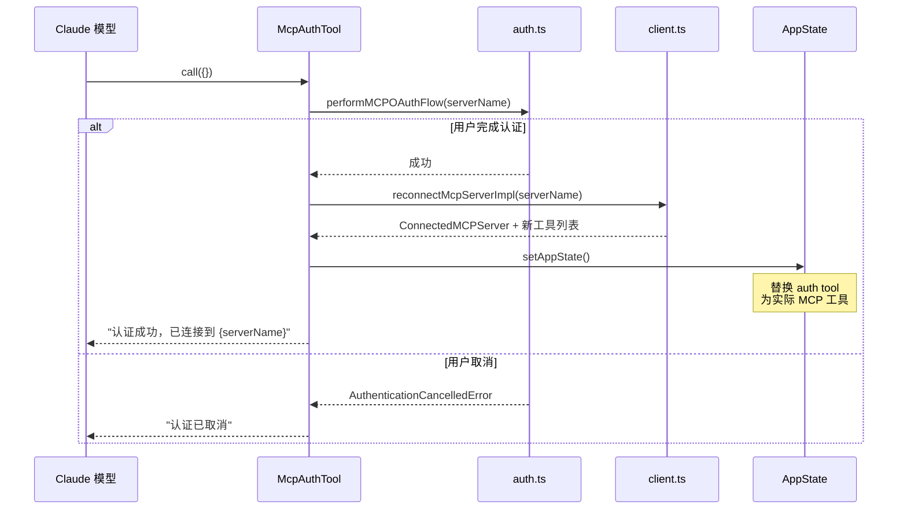

# MCP 工具层 子模块详细设计文档

## 文档信息
| 项目 | 内容 |
|------|------|
| 模块名称 | MCP 工具层 (MCP Tool Layer) |
| 文档版本 | v1.0-20260401 |
| 生成日期 | 2026-04-01 |
| 生成方式 | 代码反向工程 |

## 1. 模块概述

### 1.1 模块职责

本子模块包含 4 个工具实现，它们是 Claude 模型调用 MCP 服务器能力的入口：

| 工具 | 目录 | 行数 | 职责 |
|------|------|------|------|
| `MCPTool` | tools/MCPTool/ | 684 | 通用 MCP 工具包装器，将 MCP 服务器的工具暴露为 Claude 可调用的工具 |
| `McpAuthTool` | tools/McpAuthTool/ | 215 | 认证伪工具，引导用户完成 MCP 服务器的 OAuth 认证 |
| `ListMcpResourcesTool` | tools/ListMcpResourcesTool/ | 143 | 列出指定 MCP 服务器的可用资源 |
| `ReadMcpResourceTool` | tools/ReadMcpResourceTool/ | 174 | 读取指定 MCP 资源的内容 |

核心职责：

1. **MCP 工具代理**：将 MCP 协议的工具调用封装为 Claude Tool 接口，处理输入转换、权限检查、结果格式化
2. **认证流程触发**：为 needs-auth 状态的服务器创建伪工具，模型调用时触发 OAuth 流程
3. **资源发现与读取**：提供 MCP 资源的列表查询和内容读取能力
4. **UI 折叠分类**：通过 `classifyForCollapse` 为 MCP 工具调用提供 UI 显示优化

### 1.2 模块边界



## 2. 架构设计

### 2.1 模块架构图



### 2.2 源文件组织

```
tools/MCPTool/ (684行)
├── index.ts         — 工具定义（buildTool + 动态工厂）
├── prompt.ts        — 工具描述与提示词生成
└── components.tsx   — React 渲染组件（工具调用/结果消息）

tools/McpAuthTool/ (215行)
├── index.ts         — 认证伪工具定义
└── components.tsx   — 认证 UI 渲染

tools/ListMcpResourcesTool/ (143行)
├── index.ts         — 资源列表工具定义
└── components.tsx   — 资源列表渲染

tools/ReadMcpResourceTool/ (174行)
├── index.ts         — 资源读取工具定义
└── components.tsx   — 资源内容渲染
```

### 2.3 外部依赖

| 依赖 | 用途 |
|------|------|
| `client.ts` | 工具调用、资源获取、连接管理 |
| `auth.ts` | OAuth 流程触发 |
| `mcpStringUtils.ts` | 工具名称构建/解析 |
| `buildTool()` | 工具工厂函数 |
| `React / Ink` | UI 渲染 |

## 3. 数据结构设计

### 3.1 核心数据结构

#### 3.1.1 MCPTool 输入 Schema

```typescript
// 动态生成的输入 Schema
// 每个 MCP 工具的 inputSchema 来自 MCP 服务器的工具定义
type MCPToolInput = Record<string, unknown>  // 动态 JSON Schema
```

MCPTool 是一个**工具工厂**：`createMcpTool(serverName, toolDef)` 为每个 MCP 服务器工具创建一个独立的 `Tool` 实例，其 `name` 为 `mcp__serverName__toolName`，`inputSchema` 直接使用 MCP 服务器返回的 JSON Schema。

#### 3.1.2 McpAuthTool 输入 Schema

```typescript
const McpAuthToolInput = z.object({})  // 无输入参数
```

McpAuthTool 不需要输入参数，模型调用时直接触发 OAuth 流程。

#### 3.1.3 ListMcpResourcesTool 输入 Schema

```typescript
const ListMcpResourcesInput = z.object({
  server_name: z.string().describe("MCP 服务器名称")
})
```

#### 3.1.4 ReadMcpResourceTool 输入 Schema

```typescript
const ReadMcpResourceInput = z.object({
  server_name: z.string().describe("MCP 服务器名称"),
  uri: z.string().describe("资源 URI")
})
```

#### 3.1.5 classifyForCollapse 结果

```typescript
type CollapseClassification =
  | 'search'    // 搜索类操作
  | 'read'      // 读取类操作
  | 'write'     // 写入类操作
  | 'other'     // 其他操作
```

### 3.2 数据关系图



## 4. 接口设计

### 4.1 MCPTool

#### 4.1.1 工具工厂 `createMcpTool(serverName, toolDef, config)`
- **功能**：为每个 MCP 服务器工具创建 Tool 实例
- **参数**：
  - `serverName: string`
  - `toolDef: MCPServerToolDefinition`（含 name, description, inputSchema）
  - `config: ScopedMcpServerConfig`
- **返回值**：`Tool`
- **生成的工具属性**：
  - `name`: `mcp__${normalizedServerName}__${toolName}`
  - `isMcp`: `true`
  - `mcpInfo`: `{ serverName, toolName }`
  - `inputSchema`: 从 MCP 服务器的 JSON Schema 转换为 Zod Schema
  - `inputJSONSchema`: 直接使用 MCP 服务器返回的 JSON Schema

#### 4.1.2 `call(args, context)`
- **流程**：
  1. 从 `context.options.mcpClients` 找到对应服务器连接
  2. 调用 `callMCPToolWithUrlElicitationRetry()`
  3. 调用 `processMCPResult()` 处理结果
  4. 返回 `ToolResult`

#### 4.1.3 `description(input, options)`
- **功能**：生成工具描述文本
- **来源**：使用 MCP 服务器返回的工具 description

#### 4.1.4 特殊属性
- `isReadOnly(input)`: 默认 `false`（MCP 工具可能有副作用）
- `isConcurrencySafe(input)`: 默认 `false`
- `shouldDefer`: `true`（需要 ToolSearch 触发加载）
- `checkPermissions`: 检查是否在 always-allow/deny 规则中

#### 4.1.5 `classifyForCollapse(input)`
- **功能**：将 MCP 工具调用分类为 search/read/write/other
- **用途**：UI 折叠优化，同类操作可折叠显示
- **算法**：基于工具名称和输入参数的启发式分类

### 4.2 McpAuthTool

#### 4.2.1 工具工厂 `createMcpAuthTool(serverName, config)`
- **功能**：为 needs-auth 服务器创建认证伪工具
- **生成的工具属性**：
  - `name`: `mcp_auth__${serverName}`
  - `isMcp`: `true`
  - `description`: 提示用户需要认证

#### 4.2.2 `call(args, context)`
- **流程**：
  1. 调用 `performMCPOAuthFlow()` 触发 OAuth
  2. OAuth 成功后调用 `reconnectMcpServerImpl()` 重连
  3. 重连成功后更新 AppState（替换 auth tool 为实际 MCP 工具）
  4. 返回成功消息

### 4.3 ListMcpResourcesTool

#### 4.3.1 `call({server_name}, context)`
- **流程**：
  1. 从 `context.options.mcpClients` 找到指定服务器
  2. 调用 `fetchResourcesForClient()` 获取资源列表
  3. 格式化为文本列表返回

#### 4.3.2 特殊属性
- `isReadOnly`: `true`
- `isConcurrencySafe`: `true`
- 不在常规工具列表中（需通过 `getTools` 特殊过滤添加）

### 4.4 ReadMcpResourceTool

#### 4.4.1 `call({server_name, uri}, context)`
- **流程**：
  1. 从 `context.options.mcpClients` 找到指定服务器
  2. 确保连接（`ensureConnectedClient()`）
  3. 调用 `client.readResource({uri})`
  4. 处理返回内容（文本/二进制/blob）
  5. 返回 `ToolResult`

#### 4.4.2 特殊属性
- `isReadOnly`: `true`
- `isConcurrencySafe`: `true`

## 5. 核心流程设计

### 5.1 MCP 工具调用完整流程



### 5.2 认证工具流程



### 5.3 UI 折叠分类算法

```
算法：classifyForCollapse
输入：toolName, args
输出：CollapseClassification

1. 如果工具名称包含 'search', 'find', 'query', 'list':
   return 'search'
2. 如果工具名称包含 'read', 'get', 'fetch', 'show':
   return 'read'
3. 如果工具名称包含 'write', 'create', 'update', 'delete', 'set':
   return 'write'
4. 否则:
   return 'other'
```

## 6. 状态管理

### 6.1 状态定义

MCP 工具层本身是**无状态**的。所有状态通过以下方式传递：

1. **ToolUseContext.options.mcpClients**：MCP 服务器连接列表
2. **ToolUseContext.options.mcpResources**：MCP 资源列表
3. **AppState.mcp**：通过 `getAppState()` / `setAppState()` 访问全局 MCP 状态

### 6.2 McpAuthTool 的状态副作用

McpAuthTool 的 `call()` 会修改 AppState：
- 移除自身（auth 伪工具）
- 添加服务器的实际 MCP 工具
- 更新连接状态为 `connected`

## 7. 错误处理设计

### 7.1 错误类型

| 工具 | 错误场景 | 处理方式 |
|------|---------|---------|
| MCPTool | 服务器未连接 | 返回错误消息给模型 |
| MCPTool | 工具调用失败（isError） | 包装为 McpToolCallError，返回错误结果 |
| MCPTool | Elicitation 超时 | 回退 skipElicitation 重试 |
| MCPTool | Session 过期 | 抛出 McpSessionExpiredError，由调用方重试 |
| McpAuthTool | OAuth 取消 | 返回取消消息 |
| McpAuthTool | OAuth 失败 | 返回错误消息，保留 auth 工具 |
| ListMcpResources | 服务器不存在 | 返回错误消息 |
| ReadMcpResource | 资源不存在 | 返回 404 错误消息 |

### 7.2 错误传播

MCP 工具层的错误不会抛出到上层，而是封装为 `ToolResult` 返回给 Claude 模型，让模型决定下一步行动。

## 8. 设计约束与决策

### 8.1 设计模式

| 模式 | 实例 | 动机 |
|------|------|------|
| **工厂方法** | `createMcpTool()`, `createMcpAuthTool()` | 动态创建工具实例 |
| **代理模式** | MCPTool 代理 MCP 服务器工具 | 统一接口封装 |
| **命令模式** | McpAuthTool 封装认证流程 | 将认证操作封装为模型可调用的"命令" |
| **适配器模式** | JSON Schema → Zod Schema 转换 | 适配 MCP 和 Claude Tool 的 Schema 格式 |

### 8.2 性能考量

1. **延迟加载**：MCPTool 设置 `shouldDefer: true`，通过 ToolSearch 延迟加载，减少初始工具列表大小
2. **结果缓存**：MCPTool 的结果通过 `processMCPResult` 自动处理大结果持久化
3. **Schema 缓存**：MCP 服务器的工具 Schema 在 `fetchToolsForClient` 中缓存

### 8.3 扩展点

1. **新 MCP 工具类型**：通过 `createMcpTool` 工厂自动支持新的 MCP 服务器工具
2. **自定义权限策略**：MCPTool 的 `checkPermissions` 支持用户配置的 always-allow/deny 规则
3. **折叠分类扩展**：`classifyForCollapse` 可扩展新的分类维度

## 9. 设计评估

### 9.1 优点

1. **透明代理**：MCPTool 透明代理 MCP 工具，模型无需感知底层 MCP 协议细节
2. **认证体验优化**：McpAuthTool 将认证流程封装为工具调用，模型可自然地引导用户完成认证
3. **延迟加载**：`shouldDefer` 避免大量 MCP 工具占满初始工具列表
4. **Schema 直传**：`inputJSONSchema` 直接使用 MCP 服务器的 JSON Schema，避免转换损失

### 9.2 缺点与风险

1. **动态 Schema 的类型安全性**：MCPTool 的输入 Schema 来自外部服务器，运行时才能验证
2. **认证后状态替换**：McpAuthTool 完成后需要修改全局 AppState 替换自身，逻辑耦合
3. **classifyForCollapse 启发式**：基于名称的分类不够精确，可能误分类
4. **资源工具的可发现性**：ListMcpResourcesTool 和 ReadMcpResourceTool 被特殊过滤，不在默认工具列表中

### 9.3 改进建议

1. **Schema 验证增强**：在 `createMcpTool` 中对外部 Schema 进行安全检查（防止恶意 Schema）
2. **认证状态解耦**：将认证完成后的状态更新逻辑移到 Hook 层，减少 McpAuthTool 的副作用
3. **资源工具自动发现**：当 MCP 服务器声明资源能力时，自动将资源工具添加到工具列表
4. **分类元数据**：让 MCP 服务器通过工具元数据声明分类，而非客户端启发式推断
