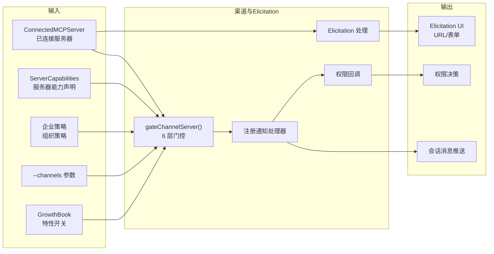
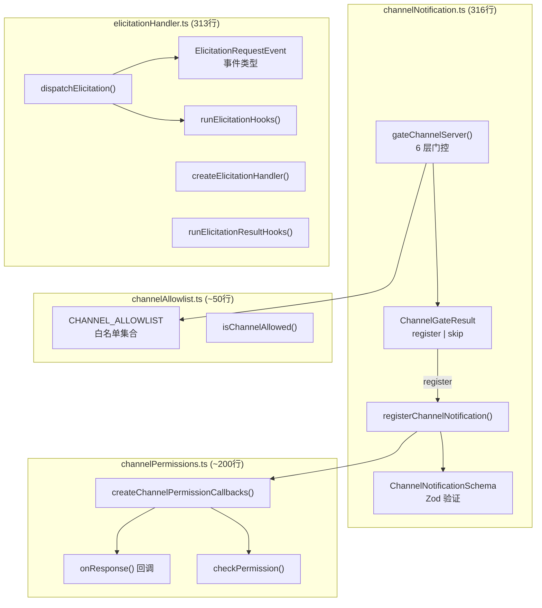
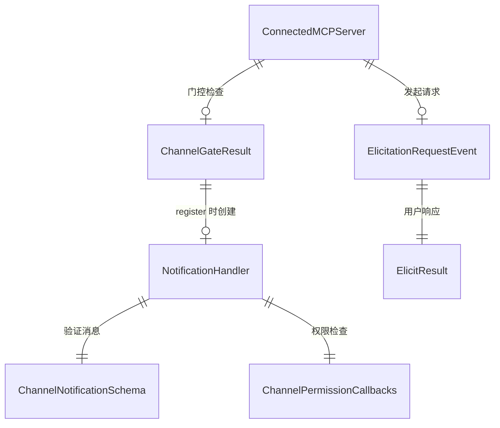
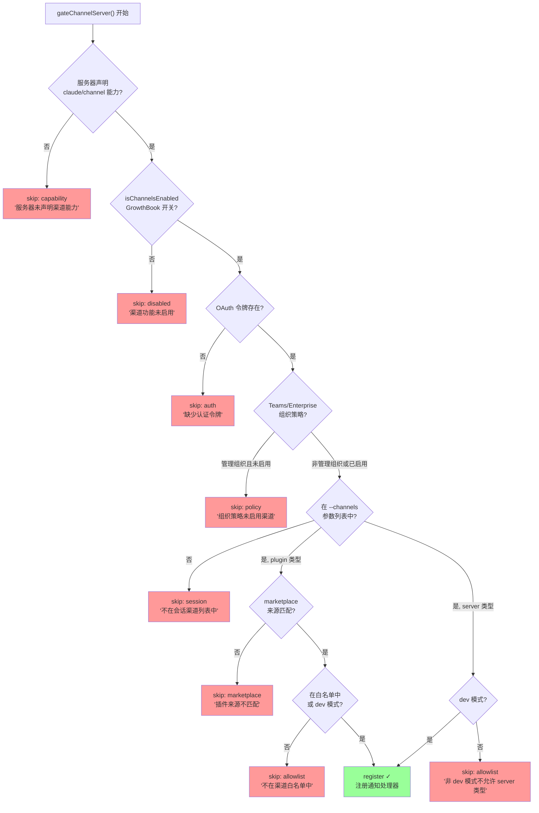
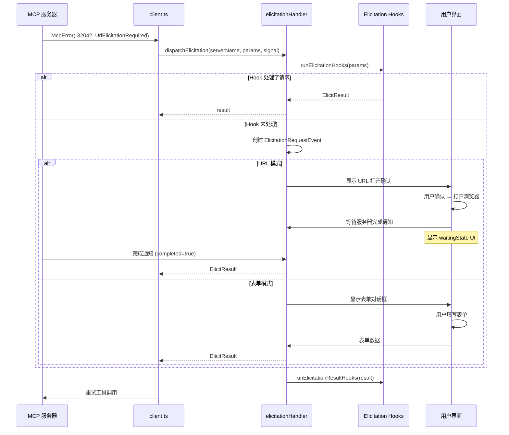
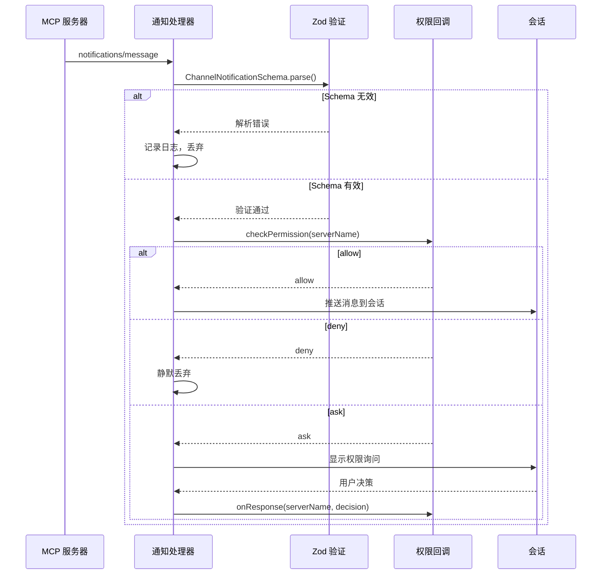
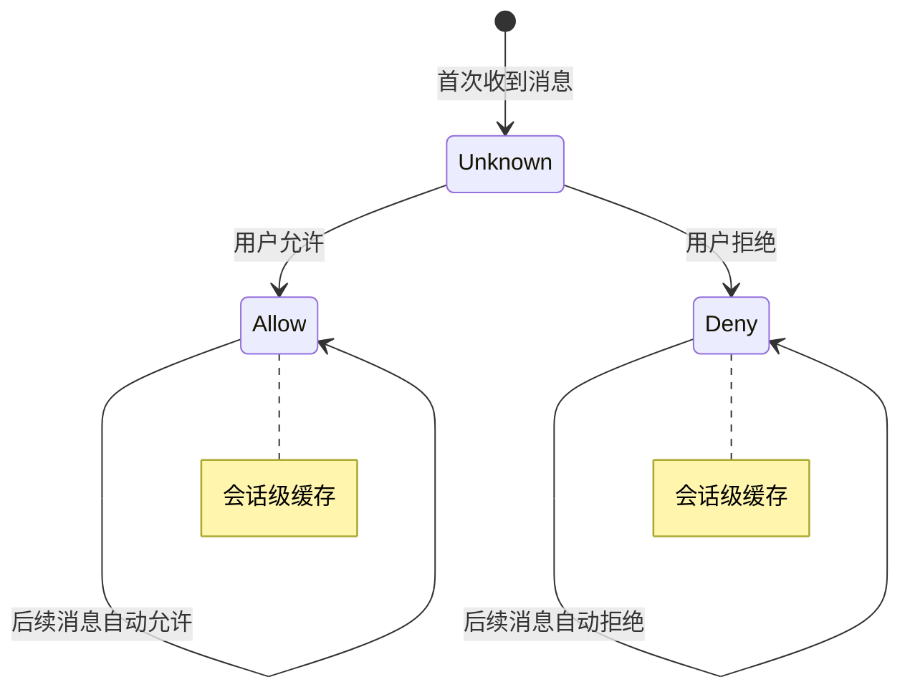
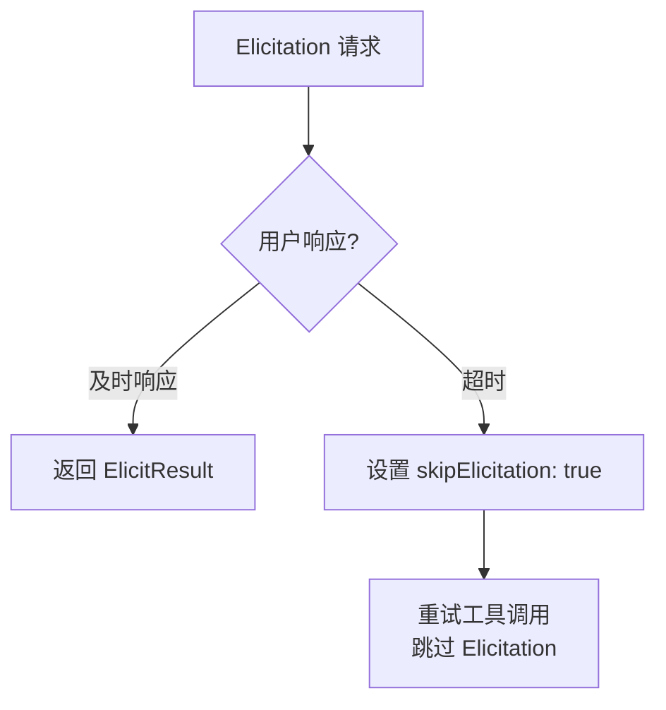

# 渠道通知与 Elicitation 子模块详细设计文档

## 文档信息
| 项目 | 内容 |
|------|------|
| 模块名称 | 渠道通知与 Elicitation (Channel Notification & Elicitation) |
| 文档版本 | v1.0-20260401 |
| 生成日期 | 2026-04-01 |
| 生成方式 | 代码反向工程 |

## 1. 模块概述

### 1.1 模块职责

本子模块由 4 个文件组成，负责 MCP 渠道消息推送和 Elicitation 交互：

| 文件 | 行数 | 职责 |
|------|------|------|
| `channelNotification.ts` | 316 | 渠道消息门控（6 层递进校验）和通知注册 |
| `channelPermissions.ts` | ~200 | 渠道权限回调创建与管理 |
| `elicitationHandler.ts` | 313 | Elicitation 请求事件分发与处理 |
| `channelAllowlist.ts` | ~50 | 渠道服务器白名单 |

核心职责包括：

1. **渠道门控**：通过 6 层递进校验决定 MCP 服务器是否可以注册为渠道消息推送源
2. **渠道通知注册**：为通过门控的服务器注册 MCP 通知处理器
3. **权限回调管理**：管理用户对渠道消息的接受/拒绝决策
4. **Elicitation 请求处理**：处理 MCP 服务器发起的用户交互请求（URL 打开、表单提交）
5. **白名单维护**：维护允许的渠道服务器列表

### 1.2 模块边界



## 2. 架构设计

### 2.1 模块架构图



### 2.2 源文件组织

```
services/mcp/channelNotification.ts (316行)
├── Zod Schemas (L1-50)
│   ├── ChannelNotificationSchema
│   └── ChannelMessageSchema
├── 类型定义 (L50-153)
│   └── ChannelGateResult (register | skip)
├── gateChannelServer() (L191-316)
│   └── 6 层门控链
└── registerChannelNotification() (L约150-190)

services/mcp/channelPermissions.ts (~200行)
├── ChannelPermissionCallbacks 类型
├── createChannelPermissionCallbacks()
├── checkPermission()
└── onResponse() 回调

services/mcp/elicitationHandler.ts (313行)
├── 类型定义 (L29-47)
│   └── ElicitationRequestEvent
├── createElicitationHandler() (L约50-150)
├── dispatchElicitation() (L约150-250)
├── runElicitationHooks() (L约250-280)
└── runElicitationResultHooks() (L约280-313)

services/mcp/channelAllowlist.ts (~50行)
├── CHANNEL_ALLOWLIST: Set<string>
└── isChannelAllowed(serverName): boolean
```

### 2.3 外部依赖

| 依赖 | 来源 | 用途 |
|------|------|------|
| `zod/v4` | npm | 通知消息 Schema 验证 |
| `GrowthBook` | 内部 | `isChannelsEnabled` 特性开关 |
| `hooks/` | 内部 | Elicitation Hook 执行 |
| `utils/mcp/elicitationValidation.ts` | 内部 | 表单输入验证 |

## 3. 数据结构设计

### 3.1 核心数据结构

#### 3.1.1 ChannelGateResult

```typescript
type ChannelGateResult =
  | { action: 'register' }
  | { action: 'skip'; kind: SkipKind; reason: string }

type SkipKind =
  | 'capability'   // 服务器未声明 channel 能力
  | 'disabled'     // GrowthBook 开关关闭
  | 'auth'         // 无 OAuth 令牌
  | 'policy'       // 组织策略未启用
  | 'session'      // 不在 --channels 列表中
  | 'marketplace'  // marketplace 来源不匹配
  | 'allowlist'    // 不在白名单中
```

#### 3.1.2 通知 Schemas（lazySchema 延迟初始化）

```typescript
// channelNotification.ts:37 - 渠道消息通知
const ChannelMessageNotificationSchema = lazySchema(() => z.object({
  method: z.literal('notifications/claude/channel'),
  params: z.object({
    content: z.string(),
    meta: z.record(z.string()).optional()
  })
}))

// channelNotification.ts:64 - 渠道权限通知
const ChannelPermissionNotificationSchema = lazySchema(() => z.object({
  method: z.literal('notifications/claude/channel/permission'),
  params: z.object({
    request_id: z.string(),
    behavior: z.enum(['allow', 'deny'])
  })
}))
```

**XML 包装**：`wrapChannelMessage(serverName, content, meta?)` (L106) 构建 `<channel source="name" key="val">content</channel>` 格式，meta 键名通过 `SAFE_META_KEY` 正则过滤防止 XML 注入。

#### 3.1.3 ElicitationRequestEvent

```typescript
type ElicitationRequestEvent = {
  serverName: string                    // MCP 服务器名称
  requestId: string | number           // JSON-RPC 请求 ID
  params: ElicitRequestParams          // 请求参数
  signal: AbortSignal                  // 中止信号
  respond: (response: ElicitResult) => void  // 响应回调
  waitingState: ElicitationWaitingState      // 等待 UI 配置
  completed: boolean                   // 服务器完成通知标志
}

type ElicitRequestParams = {
  mode: 'url' | 'form'
  // URL 模式
  url?: string
  message?: string
  // 表单模式
  schema?: Record<string, unknown>
  description?: string
}
```

#### 3.1.4 ChannelPermissionCallbacks（channelPermissions.ts:46）

```typescript
type ChannelPermissionCallbacks = {
  onResponse: (requestId: string, handler: (resp: ChannelPermissionResponse) => void) => () => void  // 返回 unsubscribe
  resolve: (requestId: string, behavior: 'allow' | 'deny', fromServer: string) => boolean  // 匹配返回 true
}

type ChannelPermissionResponse = {
  behavior: 'allow' | 'deny'
  fromServer: string
}
```

**权限 ID 生成**（`shortRequestId`，channelPermissions.ts:140）：将 `toolu_*` ID 通过 FNV-1a 哈希为 5 字母代码（25 字符字母表，排除 'l'），检查 24 个敏感子串的屏蔽列表，冲突时加盐重试最多 10 次。

**权限回复正则**（L75）：`/^\s*(y|yes|n|no)\s+([a-km-z]{5})\s*$/i` — 用户通过渠道回复 "yes tbxkq" 格式。

### 3.2 数据关系图



## 4. 接口设计

### 4.1 对外接口

#### 4.1.1 `gateChannelServer(server, capabilities, opts) => ChannelGateResult`
- **位置**：channelNotification.ts:191-316
- **功能**：6 层递进门控，决定服务器是否可注册为渠道
- **参数**：
  - `server: ConnectedMCPServer`：已连接的服务器
  - `capabilities: ServerCapabilities`：服务器能力声明
  - `opts: { channels?: string[], isDevMode?: boolean }`：CLI 选项
- **返回值**：`ChannelGateResult`
- **门控层次**：
  1. `capability` — 服务器是否声明 `claude/channel` 能力
  2. `disabled` — GrowthBook `isChannelsEnabled` 开关是否启用
  3. `auth` — 是否存在 OAuth 令牌
  4. `policy` — 组织策略（Teams/Enterprise）是否允许
  5. `session` — 是否在 `--channels` CLI 参数列表中
  6. `marketplace` / `allowlist` — 来源匹配和白名单校验

#### 4.1.2 `registerChannelNotification(server, handler, permCallbacks)`
- **功能**：为通过门控的服务器注册 MCP 通知处理器
- **行为**：调用 `client.setNotificationHandler('notifications/message', handler)`

#### 4.1.3 `createChannelPermissionCallbacks()`
- **位置**：channelPermissions.ts
- **功能**：创建渠道权限回调对象
- **返回值**：`ChannelPermissionCallbacks`

#### 4.1.4 `createElicitationHandler(opts)`
- **位置**：elicitationHandler.ts
- **功能**：创建 Elicitation 事件处理器
- **参数**：
  - `onElicitation: (event: ElicitationRequestEvent) => void`：事件回调

#### 4.1.5 `dispatchElicitation(serverName, params, signal)`
- **位置**：elicitationHandler.ts
- **功能**：分发 Elicitation 请求
- **流程**：
  1. 调用 `runElicitationHooks(params)` — 先让 Hook 处理
  2. 如果 Hook 未处理 → 创建 `ElicitationRequestEvent` → 触发回调
  3. 等待用户响应
  4. 调用 `runElicitationResultHooks(result)` — 后处理 Hook

#### 4.1.6 `isChannelAllowed(serverName) => boolean`
- **位置**：channelAllowlist.ts
- **功能**：检查服务器是否在渠道白名单中

## 5. 核心流程设计

### 5.1 渠道门控流程



### 5.2 Elicitation 处理流程



### 5.3 渠道消息处理流程



## 6. 状态管理

### 6.1 状态定义

| 状态 | 管理位置 | 说明 |
|------|---------|------|
| 渠道权限决策 | channelPermissions.ts | 用户对每个服务器的 allow/deny 决策缓存 |
| 活跃 Elicitation | useManageMCPConnections | elicitationRequestsRef |
| 渠道白名单 | channelAllowlist.ts | 静态常量 |

### 6.2 权限决策状态



## 7. 错误处理设计

### 7.1 错误类型

| 错误场景 | 处理方式 |
|----------|----------|
| 通知消息 Schema 无效 | 日志 + 丢弃消息 |
| Elicitation 超时 | 回退 skipElicitation: true |
| Hook 执行失败 | 日志 + 回退到 UI 处理 |
| 浏览器打开失败 | 返回错误给服务器 |
| 权限检查异常 | 默认 deny |

### 7.2 Elicitation 超时处理



## 8. 设计约束与决策

### 8.1 设计模式

| 模式 | 实例 | 动机 |
|------|------|------|
| **门控链/责任链** | `gateChannelServer()` 6 层校验 | 多维度安全检查的有序组合 |
| **观察者模式** | MCP 通知处理器 | 异步事件驱动的消息处理 |
| **Hook 模式** | `runElicitationHooks` / `runElicitationResultHooks` | 用户可自定义拦截逻辑 |
| **回调工厂** | `createChannelPermissionCallbacks()` | 封装权限管理状态 |

### 8.2 安全考量

1. **6 层门控**：确保只有经过完整校验的服务器才能推送消息
2. **Zod Schema 验证**：所有通知消息在处理前验证格式
3. **权限管理**：用户可对每个渠道独立控制 allow/deny
4. **白名单机制**：非 dev 模式下只允许白名单中的服务器
5. **组织策略**：企业 Teams/Enterprise 可通过策略控制渠道功能

### 8.3 扩展点

1. **新门控条件**：在 `gateChannelServer()` 中添加新的检查层
2. **新 Elicitation 模式**：扩展 `ElicitRequestParams.mode` 支持新的交互方式
3. **Hook 扩展**：通过 Hook 机制自定义 Elicitation 处理逻辑

## 9. 设计评估

### 9.1 优点

1. **清晰的门控链**：6 层递进校验有序且每层有明确的 skip reason，便于调试
2. **Hook 机制灵活**：Elicitation 前后处理 Hook 允许用户自定义拦截，无需修改核心代码
3. **Schema 验证**：Zod 运行时验证确保消息格式安全
4. **权限隔离**：每个渠道独立的权限决策，粒度合理

### 9.2 缺点与风险

1. **门控条件嵌套深**：`gateChannelServer()` 的 6 层条件嵌套达 4 层深度，新增门控需理解完整链路
2. **白名单硬编码**：`channelAllowlist.ts` 中的白名单需要代码更新才能修改
3. **Elicitation 的阻塞性**：Elicitation 请求阻塞工具调用直到用户响应，可能影响体验
4. **权限决策不持久化**：渠道权限决策仅在会话内有效，下次会话需重新决策

### 9.3 改进建议

1. **门控链重构**：将 6 层门控抽象为可配置的校验管道，每个校验器独立实现
2. **动态白名单**：将白名单改为配置文件，支持运行时更新
3. **Elicitation 超时配置**：允许用户配置 Elicitation 超时时间
4. **持久化权限决策**：将渠道权限决策保存到用户配置，跨会话保持
