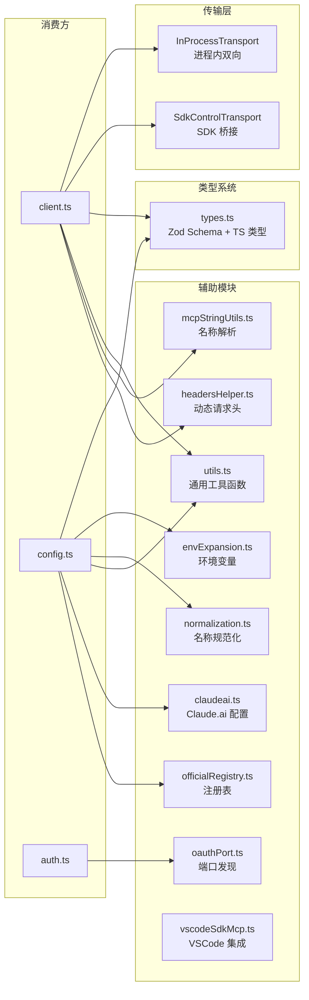
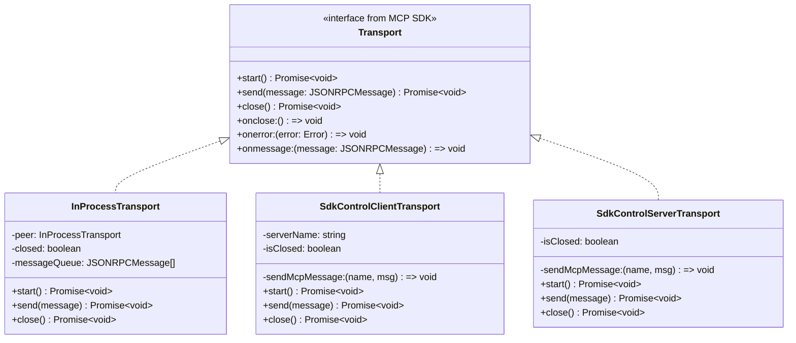
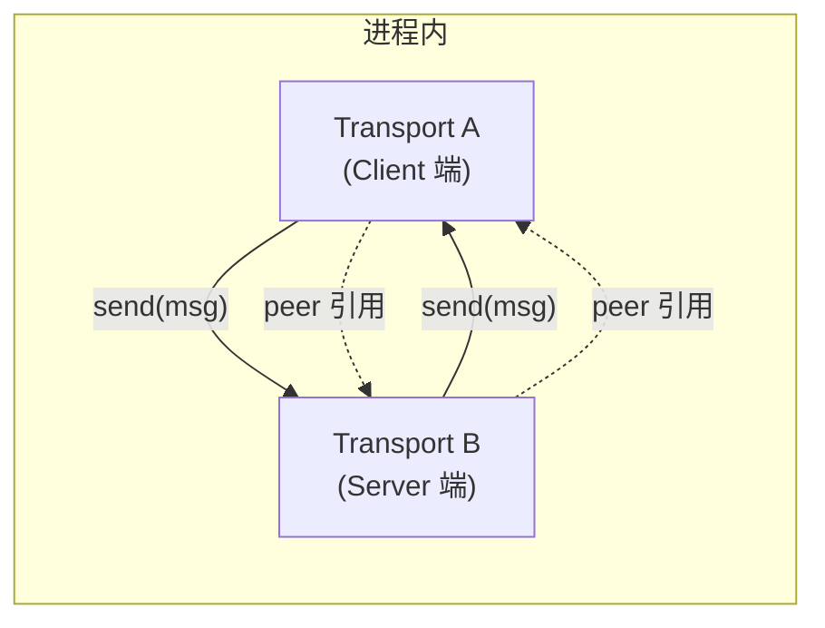
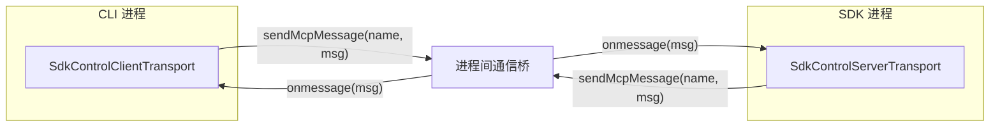
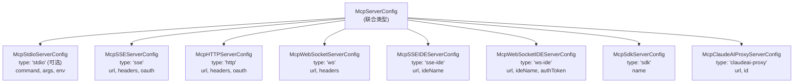
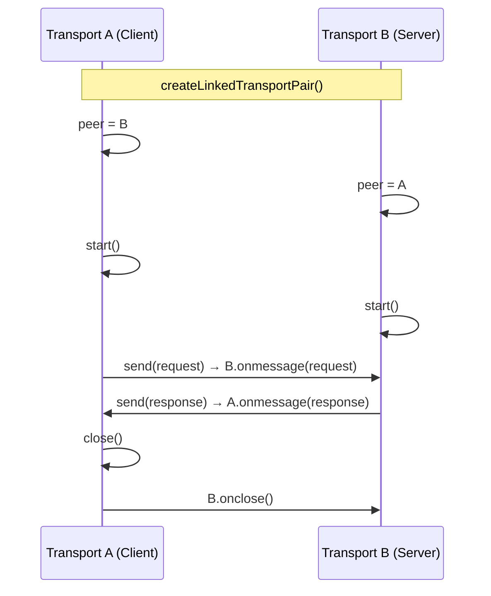
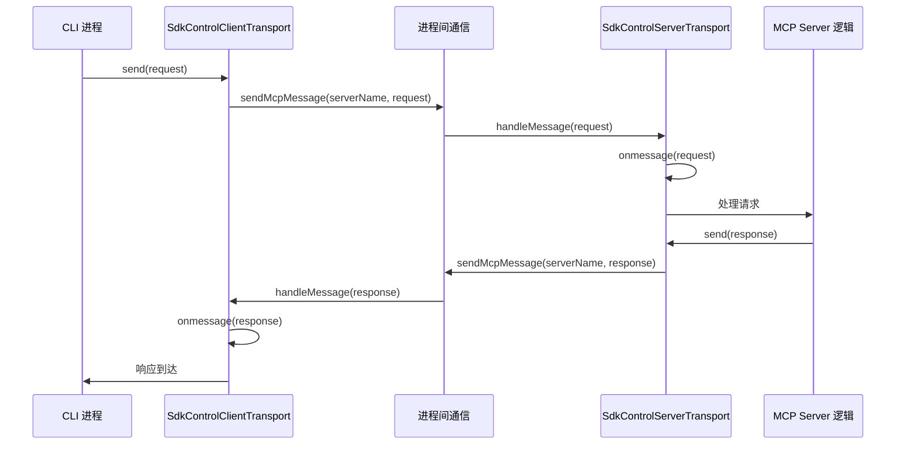
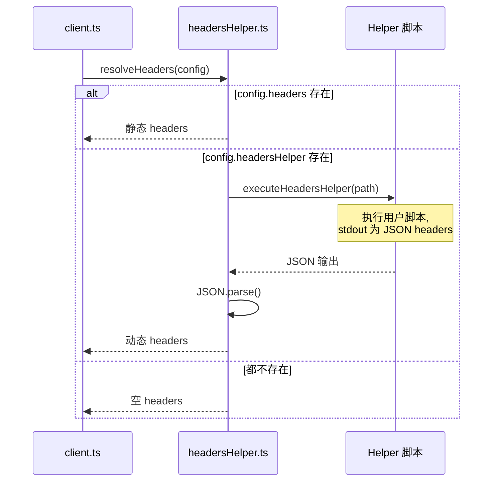

# 传输层与辅助模块 子模块详细设计文档

## 文档信息
| 项目 | 内容 |
|------|------|
| 模块名称 | 传输层与辅助模块 (Transport Layer & Utilities) |
| 文档版本 | v1.0-20260401 |
| 生成日期 | 2026-04-01 |
| 生成方式 | 代码反向工程 |

## 1. 模块概述

### 1.1 模块职责

本子模块包含 MCP 服务链的传输层实现和一系列辅助模块，共 12 个文件：

| 文件 | 行数 | 职责 |
|------|------|------|
| `InProcessTransport.ts` | 63 | 进程内双向传输（MCP Client ↔ Server 在同一进程） |
| `SdkControlTransport.ts` | 136 | SDK 桥接传输（CLI ↔ SDK 进程间 MCP 通信） |
| `types.ts` | 258 | MCP 类型定义和 Zod Schema（8 种传输配置、连接状态、序列化结构） |
| `utils.ts` | 575 | 工具函数集（过滤、Hash、清理、日志、连接辅助） |
| `mcpStringUtils.ts` | 106 | MCP 工具名称解析与构建（`mcp__server__tool` 格式） |
| `normalization.ts` | ~80 | 服务器名称规范化（去特殊字符、长度限制） |
| `envExpansion.ts` | ~120 | 环境变量扩展（`${VAR}` → 实际值） |
| `headersHelper.ts` | ~100 | 动态 HTTP 请求头生成（headersHelper 脚本执行） |
| `oauthPort.ts` | ~50 | OAuth 回调端口发现 |
| `officialRegistry.ts` | ~150 | MCP 官方注册表缓存与查询 |
| `claudeai.ts` | ~200 | Claude.ai MCP 配置获取 |
| `vscodeSdkMcp.ts` | ~100 | VSCode SDK MCP 集成 |

### 1.2 模块边界



## 2. 架构设计

### 2.1 传输层架构



### 2.2 InProcessTransport 双向传输



`createLinkedTransportPair()` 创建一对互相引用的 InProcessTransport，A 的 `send()` 直接调用 B 的 `onmessage()`，反之亦然。无需网络，纯内存通信。

### 2.3 SdkControlTransport 桥接传输



## 3. 数据结构设计

### 3.1 types.ts 类型定义

#### 3.1.1 服务器配置联合类型 (types.ts)



每种配置类型通过 Zod discriminated union（`type` 字段）进行运行时区分和验证。

#### 3.1.2 连接状态联合类型 (types.ts:180-226)

| 状态类型 | type 值 | 关键字段 |
|---------|---------|---------|
| `ConnectedMCPServer` | `connected` | `client, capabilities, cleanup()` |
| `FailedMCPServer` | `failed` | `error: string` |
| `NeedsAuthMCPServer` | `needs-auth` | - |
| `PendingMCPServer` | `pending` | `reconnectAttempt, maxReconnectAttempts` |
| `DisabledMCPServer` | `disabled` | - |

#### 3.1.3 序列化状态 MCPCliState (types.ts:252-258)

```typescript
type MCPCliState = {
  clients: SerializedClient[]
  configs: Record<string, ScopedMcpServerConfig>
  tools: SerializedTool[]
  resources: Record<string, ServerResource[]>
  normalizedNames: Record<string, string>
}
```

### 3.2 辅助模块数据结构

#### 3.2.1 mcpStringUtils 名称格式

```
完整 MCP 工具名称格式: mcp__{serverName}__{toolName}
前缀格式: mcp__{serverName}__

示例:
  服务器: github
  工具: create_issue
  完整名称: mcp__github__create_issue
```

#### 3.2.2 normalization 规则

```
规范化规则:
1. 将非字母数字字符替换为下划线
2. 合并连续下划线
3. 限制长度（避免超长名称）
4. 保证唯一性（冲突时添加后缀）
```

#### 3.2.3 envExpansion 语法

```
支持的环境变量语法:
- ${VAR}          → process.env.VAR
- ${VAR:-default} → process.env.VAR || 'default'
- ${VAR:+alt}     → process.env.VAR ? 'alt' : ''
```

## 4. 接口设计

### 4.1 传输层接口

#### 4.1.1 `createLinkedTransportPair() => [Transport, Transport]`
- **位置**：InProcessTransport.ts:57
- **功能**：创建一对进程内双向传输
- **返回值**：`[clientTransport, serverTransport]`
- **使用场景**：SDK 进程内 MCP 服务器

#### 4.1.2 `SdkControlClientTransport(serverName, sendMcpMessage)`
- **位置**：SdkControlTransport.ts:60
- **功能**：CLI 侧 SDK MCP 通信桥接
- **参数**：
  - `serverName: string`
  - `sendMcpMessage: (name: string, msg: JSONRPCMessage) => void`

#### 4.1.3 `SdkControlServerTransport(sendMcpMessage)`
- **位置**：SdkControlTransport.ts:109
- **功能**：SDK 侧 MCP Server 响应转发

### 4.2 类型系统接口

#### 4.2.1 Zod Schemas (types.ts)

| Schema | 行号 | 用途 |
|--------|------|------|
| `McpStdioServerConfigSchema` | L28-35 | stdio 配置验证 |
| `McpSSEServerConfigSchema` | L58-66 | SSE 配置验证 |
| `McpHTTPServerConfigSchema` | L89-97 | HTTP 配置验证 |
| `McpWebSocketServerConfigSchema` | L99-106 | WebSocket 配置验证 |
| `McpServerConfigSchema` | L130-140 | 联合 Schema |
| `ScopedMcpServerConfigSchema` | L163-169 | 带作用域的配置 Schema |
| `ConfigScopeSchema` | - | 配置作用域枚举 |

### 4.3 辅助函数接口

#### 4.3.1 mcpStringUtils.ts

| 函数 | 签名 | 说明 |
|------|------|------|
| `mcpInfoFromString` | `(toolString: string) => {serverName, toolName} \| null` | 解析 `mcp__server__tool` |
| `buildMcpToolName` | `(serverName: string, toolName: string) => string` | 构建完整名称 |
| `getMcpPrefix` | `(serverName: string) => string` | 获取 `mcp__server__` 前缀 |
| `getMcpDisplayName` | `(fullName: string, serverName: string) => string` | 提取显示名称 |

#### 4.3.2 utils.ts

| 函数 | 说明 |
|------|------|
| `configHash(config)` | 计算配置的 SHA256 哈希 |
| `isLocalTransport(config)` | 判断是否为本地传输（stdio/sdk） |
| `isRemoteTransport(config)` | 判断是否为远程传输 |
| `filterConnectedClients(connections)` | 过滤出已连接的服务器 |
| `getServerDisplayName(name, config)` | 获取服务器显示名称 |
| `logMCPError(error, context)` | 格式化 MCP 错误日志 |
| `cleanupMcpConnections(connections)` | 批量清理 MCP 连接 |

#### 4.3.3 envExpansion.ts

| 函数 | 签名 | 说明 |
|------|------|------|
| `expandEnvVars` | `(config: McpServerConfig) => McpServerConfig` | 扩展配置中的环境变量 |
| `expandString` | `(str: string) => string` | 扩展单个字符串中的 `${VAR}` |

#### 4.3.4 headersHelper.ts

| 函数 | 签名 | 说明 |
|------|------|------|
| `resolveHeaders` | `(config: ScopedMcpServerConfig) => Promise<Record<string, string>>` | 解析动态请求头 |
| `executeHeadersHelper` | `(helperPath: string) => Promise<Record<string, string>>` | 执行 headersHelper 脚本 |

#### 4.3.5 normalization.ts

| 函数 | 签名 | 说明 |
|------|------|------|
| `normalizeName` | `(name: string) => string` | 规范化服务器名称 |
| `ensureUniqueName` | `(name: string, existing: Set<string>) => string` | 确保名称唯一 |

#### 4.3.6 oauthPort.ts

| 函数 | 签名 | 说明 |
|------|------|------|
| `findAvailableOAuthPort` | `() => Promise<number>` | 找到可用的 OAuth 回调端口 |

#### 4.3.7 officialRegistry.ts

| 函数 | 签名 | 说明 |
|------|------|------|
| `fetchOfficialRegistry` | `() => Promise<RegistryEntry[]>` | 获取 MCP 官方注册表（带缓存） |
| `lookupRegistryEntry` | `(name: string) => RegistryEntry \| undefined` | 查询注册表条目 |

#### 4.3.8 claudeai.ts

| 函数 | 签名 | 说明 |
|------|------|------|
| `fetchClaudeAIMcpConfigsIfEligible` | `() => Promise<Record<string, ScopedMcpServerConfig>>` | 获取 Claude.ai MCP 配置（memoized） |
| `clearClaudeAIMcpConfigsCache` | `() => void` | 清除 Claude.ai 配置缓存 |

## 5. 核心流程设计

### 5.1 InProcessTransport 消息传递



### 5.2 SdkControlTransport 消息桥接



### 5.3 环境变量扩展流程

```mermaid
flowchart TD
    A[配置对象] --> B[遍历所有字符串字段]
    B --> C{包含 '$\{' ?}
    C -->|否| D[保持原值]
    C -->|是| E[正则匹配 '$\{VAR\}' 模式]
    E --> F{匹配到?}
    F -->|'$\{VAR\}'| G["process.env[VAR]"]
    G --> H{存在?}
    H -->|是| I[替换为环境变量值]
    H -->|否| J[保留原始字符串]
    F -->|'$\{VAR:-default\}'| K["process.env[VAR] || 'default'"]
    F -->|'$\{VAR:+alt\}'| L["process.env[VAR] ? 'alt' : ''"]
    I & J & K & L --> M[返回扩展后配置]
```

### 5.4 动态请求头解析



## 6. 状态管理

### 6.1 状态定义

传输层和辅助模块大多是**无状态**的函数工具，少数例外：

| 模块 | 状态 | 类型 | 生命周期 |
|------|------|------|---------|
| InProcessTransport | `closed` / `peer` | 实例级 | 连接生命周期 |
| SdkControlTransport | `isClosed` | 实例级 | 连接生命周期 |
| officialRegistry.ts | 注册表缓存 | 模块级 | 进程级 |
| claudeai.ts | Claude.ai 配置缓存 | memoized | 会话级 |

## 7. 错误处理设计

### 7.1 传输层错误

| 错误场景 | 处理方式 |
|----------|----------|
| InProcessTransport peer 已关闭 | `send()` 抛出错误 |
| SdkControlTransport 进程通信失败 | `onerror` 回调 |
| headersHelper 脚本执行失败 | 日志 + 使用空 headers |
| 环境变量未定义 | 保留原始 `${VAR}` 字符串 |
| 注册表获取超时 | 使用缓存或空结果 |

## 8. 设计约束与决策

### 8.1 设计模式

| 模式 | 实例 | 动机 |
|------|------|------|
| **适配器** | SdkControlTransport 适配进程间通信 | 统一 Transport 接口 |
| **对等通信** | InProcessTransport 的 peer 引用 | 零开销进程内通信 |
| **工厂方法** | `createLinkedTransportPair()` | 确保配对正确性 |
| **策略模式** | 环境变量扩展的多种语法 | 支持默认值和条件值 |
| **缓存代理** | `officialRegistry.ts` / `claudeai.ts` | 减少网络请求 |

### 8.2 性能考量

1. **InProcessTransport 零拷贝**：同进程内直接传递 JSON 对象引用，无序列化开销
2. **环境变量惰性扩展**：仅在配置加载时一次性扩展，不在每次使用时重复
3. **注册表缓存**：进程级缓存避免重复网络请求
4. **configHash 优化**：SHA256 哈希用于快速配置比较

### 8.3 扩展点

1. **新传输类型**：实现 `Transport` 接口即可添加新传输
2. **新环境变量语法**：在 `expandString` 中添加新的正则匹配规则
3. **新 headersHelper 协议**：扩展 Helper 脚本的输出格式
4. **新配置作用域**：在 `ConfigScopeSchema` 中添加新枚举值

## 9. 设计评估

### 9.1 优点

1. **传输层抽象清晰**：InProcessTransport 和 SdkControlTransport 完整实现 Transport 接口，可无缝替换
2. **Zod Schema 提供运行时安全**：所有配置类型通过 Zod 验证，提供清晰错误信息
3. **辅助模块职责单一**：每个文件专注一个功能（名称解析、规范化、环境变量等）
4. **mcpStringUtils 格式统一**：`mcp__server__tool` 格式在整个系统中一致使用

### 9.2 缺点与风险

1. **headersHelper 安全风险**：执行用户提供的脚本获取 headers，可能执行恶意代码
2. **envExpansion 的敏感信息**：可能意外扩展包含密码的环境变量
3. **types.ts 的 Schema 复杂度**：8 种传输配置的联合类型 Schema 较复杂
4. **InProcessTransport 的消息队列**：未设队列上限，理论上可能内存溢出

### 9.3 改进建议

1. **headersHelper 沙箱**：在受限环境中执行 helper 脚本，限制文件系统和网络访问
2. **环境变量白名单**：限制可扩展的环境变量范围
3. **InProcessTransport 背压**：添加消息队列上限和背压机制
4. **Schema 拆分**：将 types.ts 中的 Schema 按传输类型拆分为独立文件
