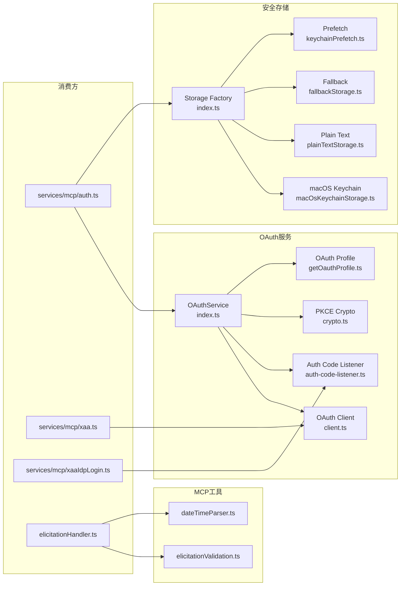
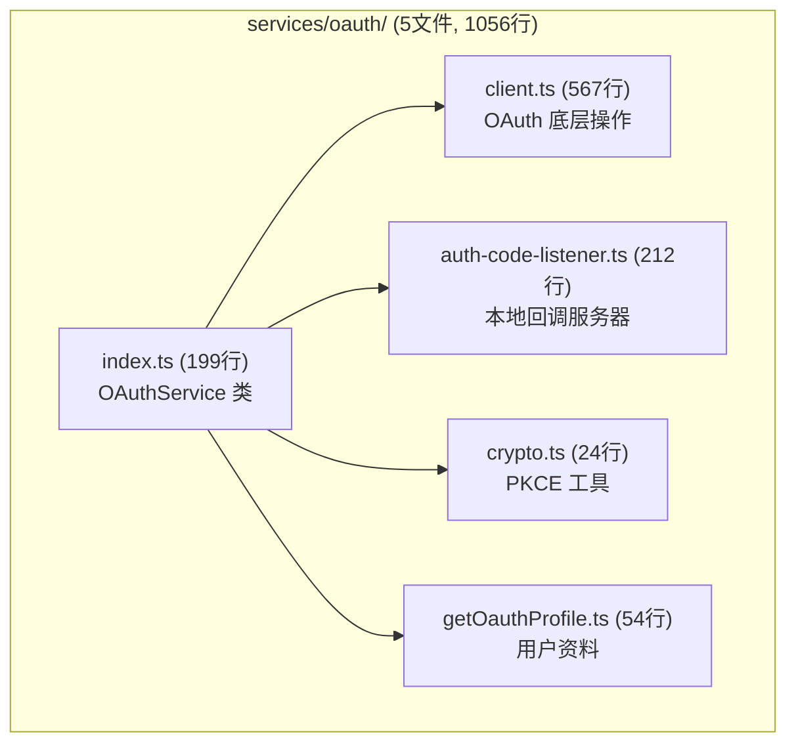
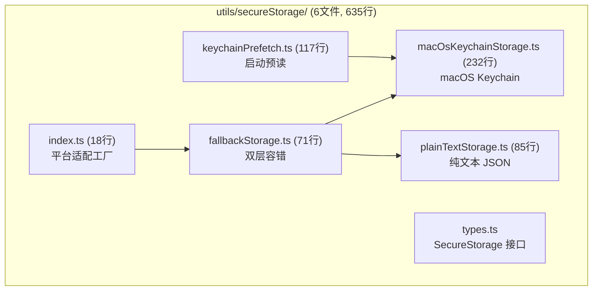
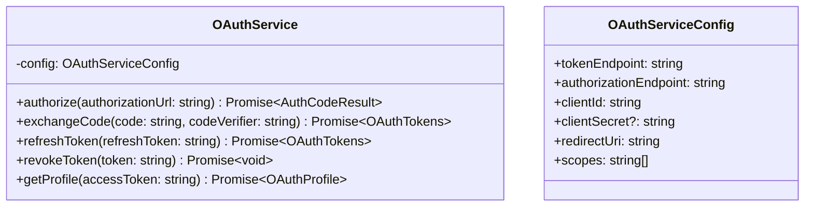
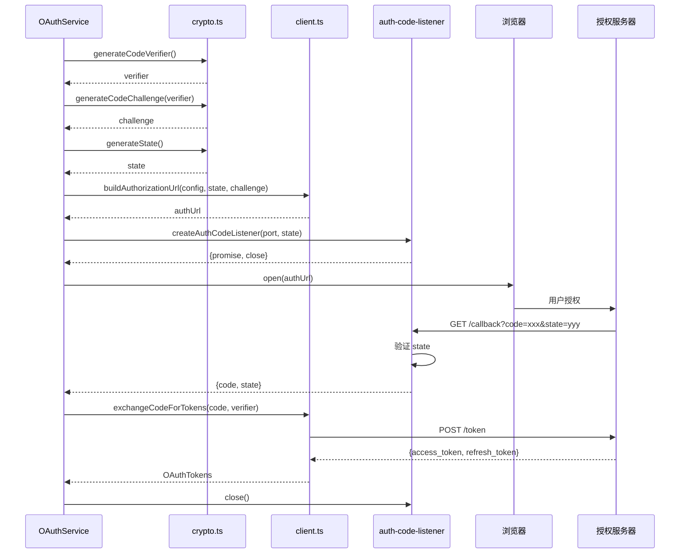
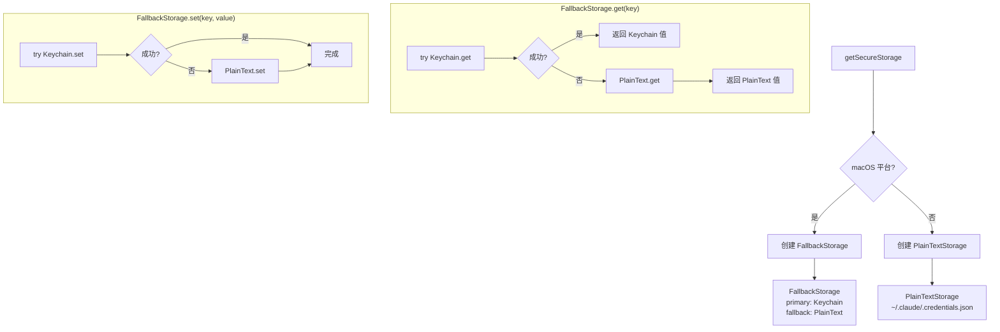
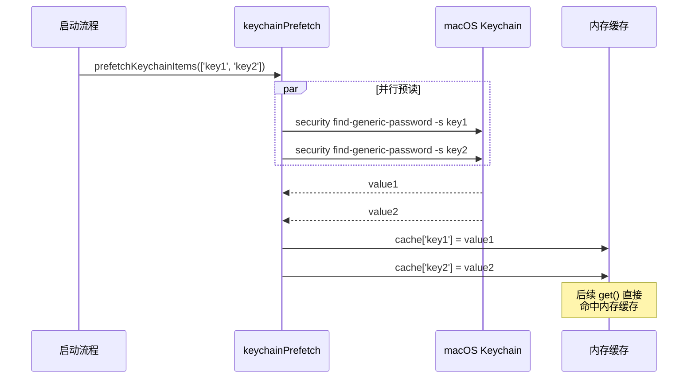
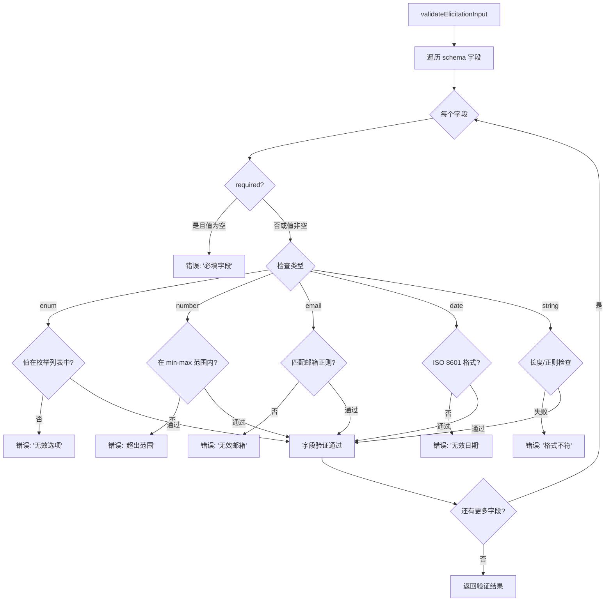
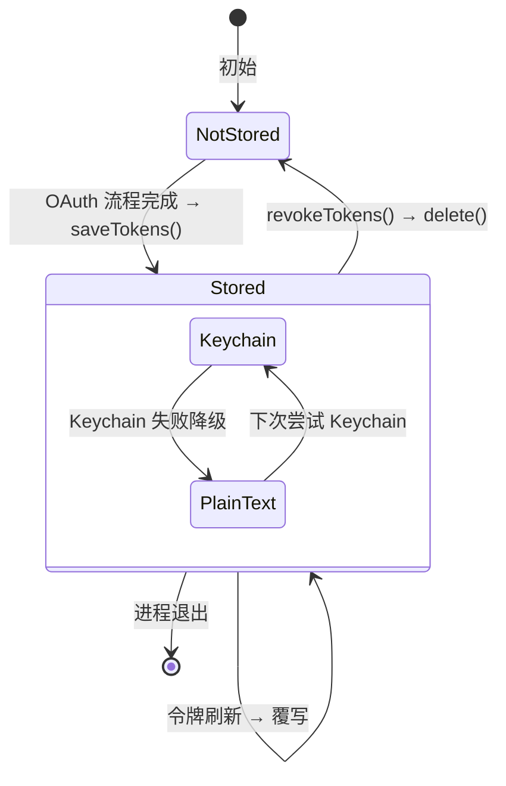
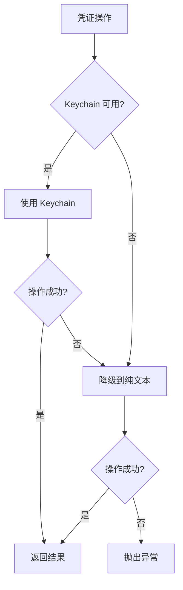

# OAuth 与安全存储支撑 子模块详细设计文档

## 文档信息
| 项目 | 内容 |
|------|------|
| 模块名称 | OAuth 与安全存储支撑 (OAuth & Secure Storage) |
| 文档版本 | v1.0-20260401 |
| 生成日期 | 2026-04-01 |
| 生成方式 | 代码反向工程 |

## 1. 模块概述

### 1.1 模块职责

本子模块包含 3 组支撑模块，为 MCP 认证管理提供底层 OAuth 操作和安全凭证存储：

| 模块组 | 文件数 | 总行数 | 职责 |
|--------|--------|--------|------|
| `services/oauth/` | 5 | 1056 | OAuth 2.0 底层操作（授权 URL 构建、令牌交换、刷新、用户资料） |
| `utils/secureStorage/` | 6 | 635 | 安全凭证存储（macOS Keychain、纯文本后备、预读优化） |
| `utils/mcp/` | 2 | 458 | MCP 专用工具（自然语言日期解析、Elicitation 表单验证） |

核心职责：

1. **OAuth 2.0 完整流程**：`OAuthService` 编排授权码流程，`client.ts` 提供底层 HTTP 操作
2. **本地回调服务器**：`auth-code-listener.ts` 创建 HTTP 服务器捕获 OAuth 重定向回调
3. **PKCE 工具函数**：`crypto.ts` 生成 code verifier、challenge 和 state
4. **安全凭证存储**：平台适配的凭证存储（macOS Keychain 优先，纯文本 JSON 后备）
5. **Keychain 预读**：启动时并行预读常用凭证项，减少首次访问延迟
6. **表单验证**：MCP Elicitation 表单的输入验证（枚举、日期、数字、邮箱等）
7. **日期解析**：通过 Haiku 模型将自然语言日期转为 ISO 8601

### 1.2 模块边界



## 2. 架构设计

### 2.1 OAuth 服务架构



### 2.2 安全存储架构



### 2.3 源文件组织

```
services/oauth/
├── index.ts (199行)        — OAuthService 类：完整授权码流程编排
├── client.ts (567行)       — OAuth 底层：授权 URL、令牌交换、刷新、撤销
├── auth-code-listener.ts (212行) — 本地 HTTP 回调服务器
├── crypto.ts (24行)        — PKCE 工具函数
└── getOauthProfile.ts (54行)    — OAuth 用户资料获取

utils/secureStorage/
├── index.ts (18行)         — 平台适配工厂
├── macOsKeychainStorage.ts (232行) — macOS Keychain 存储
├── fallbackStorage.ts (71行)      — 双层容错存储
├── keychainPrefetch.ts (117行)    — Keychain 预读
├── plainTextStorage.ts (85行)     — 纯文本 JSON 存储
└── types.ts                        — SecureStorage 接口

utils/mcp/
├── dateTimeParser.ts (122行) — 自然语言日期解析（Haiku）
└── elicitationValidation.ts (336行) — Elicitation 表单验证
```

## 3. 数据结构设计

### 3.1 核心数据结构

#### 3.1.1 SecureStorage 接口

```typescript
interface SecureStorage {
  get(key: string): Promise<string | null>
  set(key: string, value: string): Promise<void>
  delete(key: string): Promise<void>
  has(key: string): Promise<boolean>
}
```

#### 3.1.2 OAuthService 类



#### 3.1.3 OAuth 令牌

```typescript
type OAuthTokens = {
  access_token: string
  refresh_token?: string
  token_type: string
  expires_in?: number
  scope?: string
}
```

#### 3.1.4 Elicitation 验证规则

```typescript
type ElicitationFieldValidation = {
  type: 'string' | 'number' | 'boolean' | 'enum' | 'date' | 'email'
  required?: boolean
  enum?: string[]
  min?: number
  max?: number
  pattern?: string
  description?: string
}
```

### 3.2 数据关系图

```mermaid
erDiagram
    OAuthService ||--|| OAuthClient : "使用"
    OAuthService ||--|| AuthCodeListener : "创建"
    OAuthService ||--|| PKCECrypto : "生成"
    OAuthClient ||--|| OAuthTokens : "返回"
    OAuthTokens }|--|| SecureStorage : "存储到"
    SecureStorage <|-- MacOsKeychainStorage : "实现"
    SecureStorage <|-- PlainTextStorage : "实现"
    FallbackStorage ||--|| MacOsKeychainStorage : "优先"
    FallbackStorage ||--|| PlainTextStorage : "后备"
    KeychainPrefetch }|--|| MacOsKeychainStorage : "预读"
```

## 4. 接口设计

### 4.1 OAuth 服务接口

#### 4.1.1 `OAuthService` 类 (index.ts)

| 方法 | 签名 | 说明 |
|------|------|------|
| `authorize` | `(authUrl) => Promise<{code, state}>` | 打开浏览器 + 等待回调 |
| `exchangeCode` | `(code, verifier) => Promise<OAuthTokens>` | 授权码换令牌 |
| `refreshToken` | `(refreshToken) => Promise<OAuthTokens>` | 刷新令牌 |
| `revokeToken` | `(token) => Promise<void>` | 撤销令牌 |

#### 4.1.2 OAuth 底层操作 (client.ts)

| 函数 | 签名 | 说明 |
|------|------|------|
| `buildAuthorizationUrl` | `(config, state, codeChallenge) => string` | 构建授权 URL |
| `exchangeCodeForTokens` | `(tokenEndpoint, code, verifier, redirectUri, clientId) => Promise<OAuthTokens>` | POST /token 令牌交换 |
| `refreshAccessToken` | `(tokenEndpoint, refreshToken, clientId) => Promise<OAuthTokens>` | POST /token 令牌刷新 |
| `revokeToken` | `(revocationEndpoint, token) => Promise<void>` | POST /revoke 令牌撤销 |
| `fetchServerMetadata` | `(serverUrl) => Promise<OAuthServerMetadata>` | 发现 .well-known 端点 |

#### 4.1.3 回调服务器 (auth-code-listener.ts)

| 函数 | 签名 | 说明 |
|------|------|------|
| `createAuthCodeListener` | `(port, expectedState?) => Promise<{code, state, close}>` | 创建本地 HTTP 回调服务器 |

- **行为**：
  1. 在指定端口启动 HTTP 服务器
  2. 监听 GET /callback 请求
  3. 提取 `code` 和 `state` 查询参数
  4. 验证 state（CSRF 防护）
  5. 返回成功 HTML 页面（XSS 防护）
  6. 返回 `{code, state}` 和 `close()` 清理函数

#### 4.1.4 PKCE 工具 (crypto.ts)

| 函数 | 签名 | 说明 |
|------|------|------|
| `generateCodeVerifier` | `() => string` | 生成 43-128 字符随机 code verifier |
| `generateCodeChallenge` | `(verifier: string) => string` | S256 hash → base64url 编码 |
| `generateState` | `() => string` | 生成随机 state 参数 |

#### 4.1.5 用户资料 (getOauthProfile.ts)

| 函数 | 签名 | 说明 |
|------|------|------|
| `getOauthProfile` | `(accessToken: string) => Promise<OAuthProfile>` | 获取 OAuth 用户资料和订阅信息 |

### 4.2 安全存储接口

#### 4.2.1 存储工厂 (index.ts)

```typescript
function getSecureStorage(): SecureStorage
```
- **行为**：检测平台，macOS 返回 `FallbackStorage`（Keychain + PlainText），其他平台返回 `PlainTextStorage`

#### 4.2.2 macOS Keychain (macOsKeychainStorage.ts)

| 方法 | 实现方式 | 安全措施 |
|------|---------|---------|
| `get(key)` | `security find-generic-password -s {key} -w` | - |
| `set(key, value)` | `security add-generic-password -s {key} -w` | value 通过 **stdin** 传递，避免 argv 泄露 |
| `delete(key)` | `security delete-generic-password -s {key}` | - |
| `has(key)` | `security find-generic-password -s {key}` | 仅检查存在性 |

**关键安全设计**：密码/令牌值通过 `execa` 的 stdin 传递给 `security` 命令，而非命令行参数，防止进程列表泄露敏感数据。

#### 4.2.3 纯文本存储 (plainTextStorage.ts)

- **存储位置**：`~/.claude/.credentials.json`
- **格式**：`{ [key]: value }` 的 JSON 文件
- **权限**：文件模式 `0600`（仅所有者可读写）

#### 4.2.4 双层容错 (fallbackStorage.ts)

```typescript
class FallbackStorage implements SecureStorage {
  // 优先使用 Keychain，失败时自动降级到 PlainText
  get(key): try Keychain → catch → PlainText
  set(key, value): try Keychain → catch → PlainText
  delete(key): 两个存储都删除
}
```

#### 4.2.5 Keychain 预读 (keychainPrefetch.ts)

| 函数 | 签名 | 说明 |
|------|------|------|
| `prefetchKeychainItems` | `(keys: string[]) => Promise<void>` | 启动时并行预读指定的 Keychain 项 |

- **位置**：keychainPrefetch.ts:69
- **行为**：在模块加载时并行预读 2 个常用 Keychain 项，与其他模块加载并行执行
- **缓存**：预读的值缓存在内存中，后续 `get()` 直接命中

### 4.3 MCP 工具接口

#### 4.3.1 日期解析 (dateTimeParser.ts)

| 函数 | 签名 | 说明 |
|------|------|------|
| `parseDateTime` | `(naturalLanguage: string) => Promise<string>` | 通过 Haiku 模型将自然语言日期转为 ISO 8601 |

- **实现**：调用 Claude Haiku 模型，prompt 为"将以下自然语言日期转换为 ISO 8601 格式"
- **示例**：`"next Thursday"` → `"2026-04-09T00:00:00Z"`

#### 4.3.2 Elicitation 验证 (elicitationValidation.ts)

| 函数 | 签名 | 说明 |
|------|------|------|
| `validateElicitationInput` | `(input: unknown, schema: Record<string, FieldValidation>) => ValidationResult` | 验证表单输入 |
| `validateField` | `(value: unknown, validation: FieldValidation) => string \| null` | 验证单个字段 |

支持的验证类型：
- **enum**：值必须在预定义列表中
- **date**：ISO 8601 日期格式
- **number**：数值范围（min/max）
- **email**：邮箱格式正则
- **string**：长度限制、正则模式
- **boolean**：布尔值
- **required**：必填检查

## 5. 核心流程设计

### 5.1 OAuth 授权码流程



### 5.2 安全存储选择流程



### 5.3 Keychain 预读流程



### 5.4 Elicitation 表单验证



## 6. 状态管理

### 6.1 状态定义

| 模块 | 状态 | 生命周期 | 说明 |
|------|------|---------|------|
| macOsKeychainStorage | Keychain 条目 | 持久化（系统级） | macOS Keychain 数据库 |
| plainTextStorage | JSON 文件 | 持久化（文件级） | `~/.claude/.credentials.json` |
| keychainPrefetch | 内存缓存 | 进程级 | 预读的 Keychain 值 |
| OAuthService | 无 | - | 纯函数式 |

### 6.2 凭证生命周期



## 7. 错误处理设计

### 7.1 错误类型

| 模块 | 错误场景 | 处理方式 |
|------|---------|---------|
| OAuth client | 令牌交换失败 | 抛出带 HTTP 状态码的错误 |
| OAuth client | `invalid_grant` | 清除令牌，触发重新认证 |
| auth-code-listener | 端口占用 | 尝试下一个端口 |
| auth-code-listener | state 不匹配 | 返回 400 错误页面 |
| Keychain | `security` 命令失败 | 降级到纯文本存储 |
| Keychain | 权限被拒绝 | 降级到纯文本存储 |
| dateTimeParser | Haiku 调用失败 | 返回原始字符串 |
| elicitationValidation | 验证失败 | 返回字段级错误信息 |

### 7.2 容错策略



## 8. 设计约束与决策

### 8.1 设计模式

| 模式 | 实例 | 动机 |
|------|------|------|
| **工厂方法** | `getSecureStorage()` | 平台适配 |
| **容错/降级** | `FallbackStorage` | Keychain 不可用时自动降级 |
| **预加载** | `keychainPrefetch` | 减少首次访问延迟 |
| **模板方法** | `OAuthService` 编排流程 | 统一 OAuth 流程步骤 |
| **验证器模式** | `elicitationValidation` | 可扩展的字段验证 |

### 8.2 安全考量

1. **stdin 传递敏感数据**：Keychain 的 `set` 操作通过 stdin 传递密码，不经过 argv
2. **文件权限**：纯文本存储使用 `0600` 权限
3. **PKCE S256**：code challenge 使用 SHA256（非 plain 方法）
4. **CSRF 防护**：state 参数在回调时严格验证
5. **XSS 防护**：回调成功页面使用 `xss` 库净化

### 8.3 扩展点

1. **新存储后端**：实现 `SecureStorage` 接口（如 Windows Credential Manager、Linux Secret Service）
2. **新 OAuth 流程**：OAuthService 可扩展设备码流程
3. **新验证类型**：elicitationValidation 可添加新的字段验证规则
4. **新日期解析模型**：dateTimeParser 可更换底层模型

## 9. 设计评估

### 9.1 优点

1. **平台自适应存储**：FallbackStorage 自动在 Keychain 和纯文本间切换，macOS 用户获得系统级安全，其他平台仍可工作
2. **Keychain 预读优化**：启动时并行预读减少首次令牌访问延迟（keychainPrefetch.ts:69）
3. **PKCE 安全性**：完整的 S256 code challenge 实现，防止授权码拦截
4. **stdin 安全传递**：避免敏感数据出现在进程 argv 中
5. **表单验证完整性**：elicitationValidation 支持 6 种字段类型，覆盖常见验证场景

### 9.2 缺点与风险

1. **仅 macOS Keychain**：缺少 Windows Credential Manager 和 Linux Secret Service 支持
2. **纯文本后备安全风险**：`~/.claude/.credentials.json` 即使 0600 权限，仍不如系统 Keychain 安全
3. **dateTimeParser 的 API 调用**：自然语言日期解析需要调用 Haiku 模型，有延迟和成本
4. **回调服务器端口冲突**：本地 HTTP 服务器可能与其他应用端口冲突
5. **`security` 命令依赖**：macOS Keychain 操作依赖 `security` CLI 工具，版本兼容性未验证

### 9.3 改进建议

1. **跨平台安全存储**：添加 Windows Credential Manager（`wincred`）和 Linux Secret Service（`libsecret`/D-Bus）支持
2. **加密纯文本后备**：使用机器密钥加密 `~/.claude/.credentials.json`，提升非 macOS 平台安全性
3. **日期解析本地化**：使用本地日期解析库替代 Haiku API 调用，减少延迟
4. **端口范围配置**：允许用户配置 OAuth 回调端口范围
5. **Keychain 预读配置**：允许配置预读的键列表，避免不必要的 Keychain 访问
