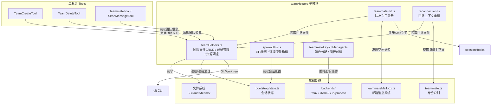
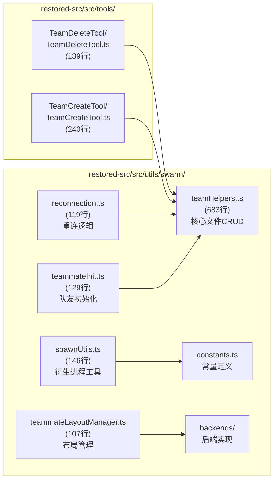
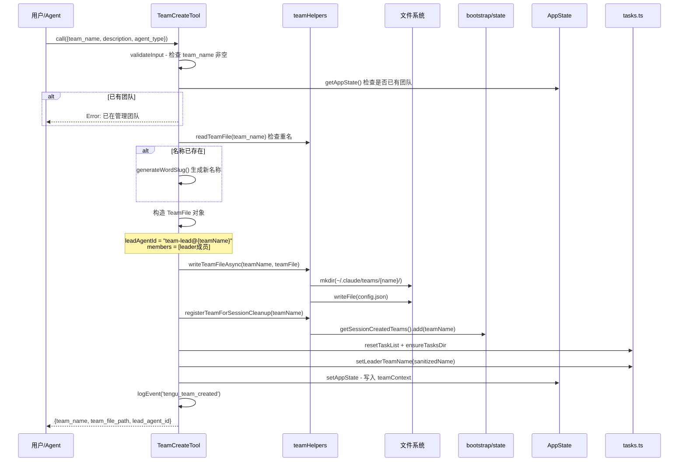
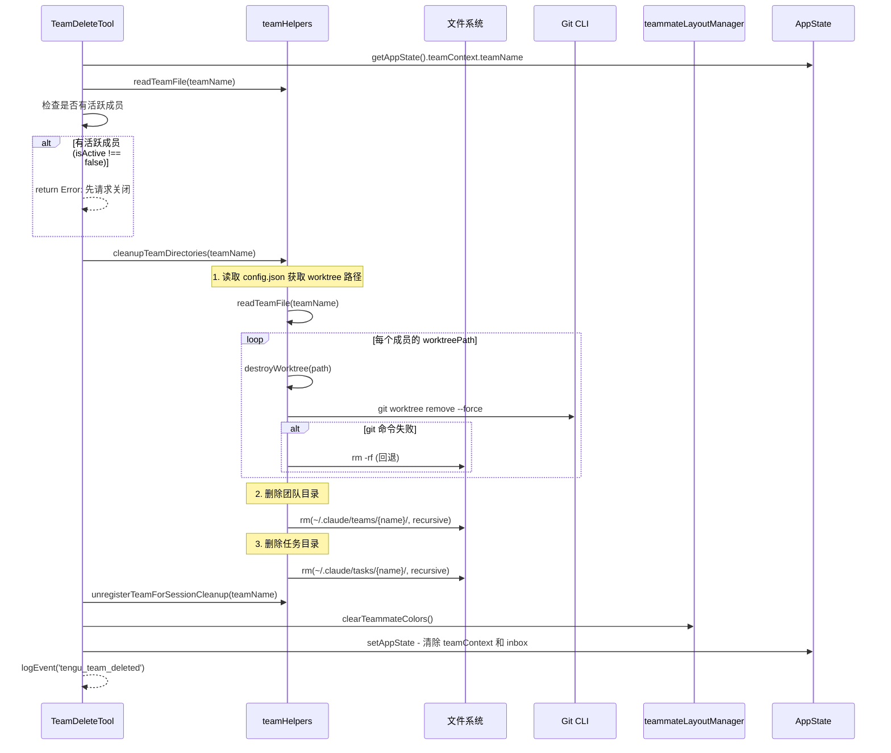
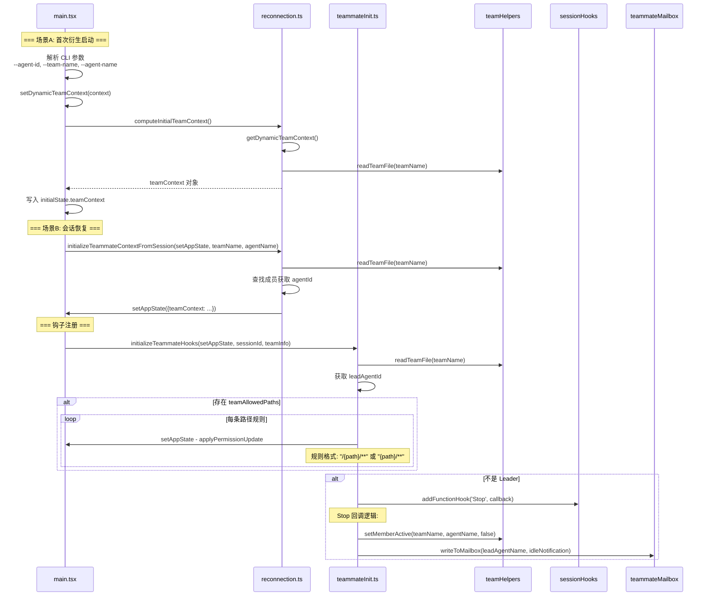
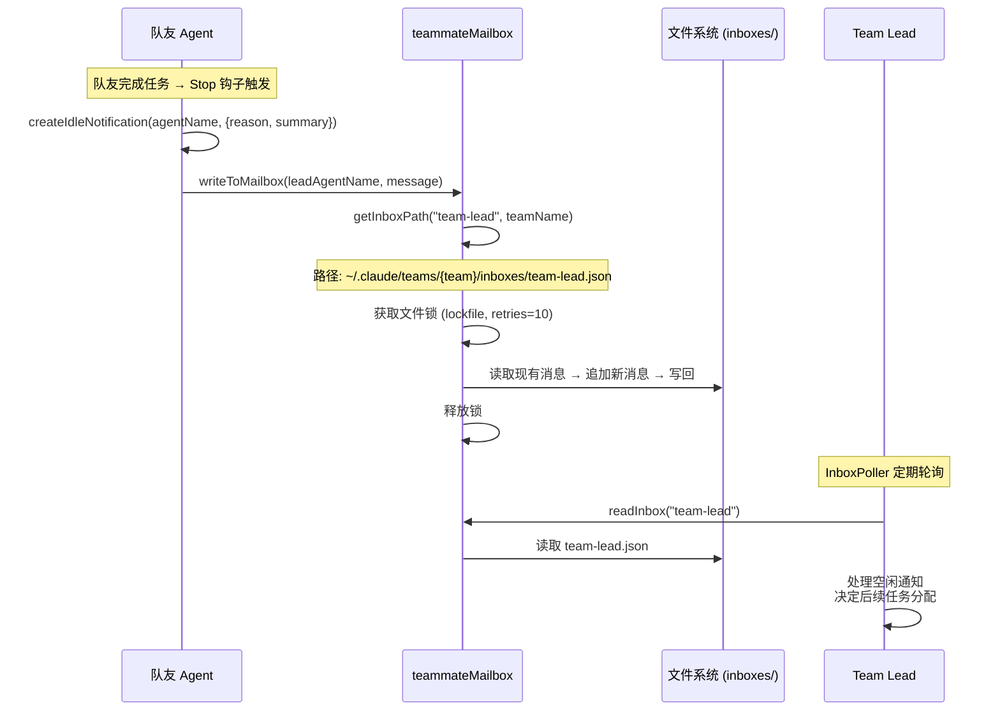
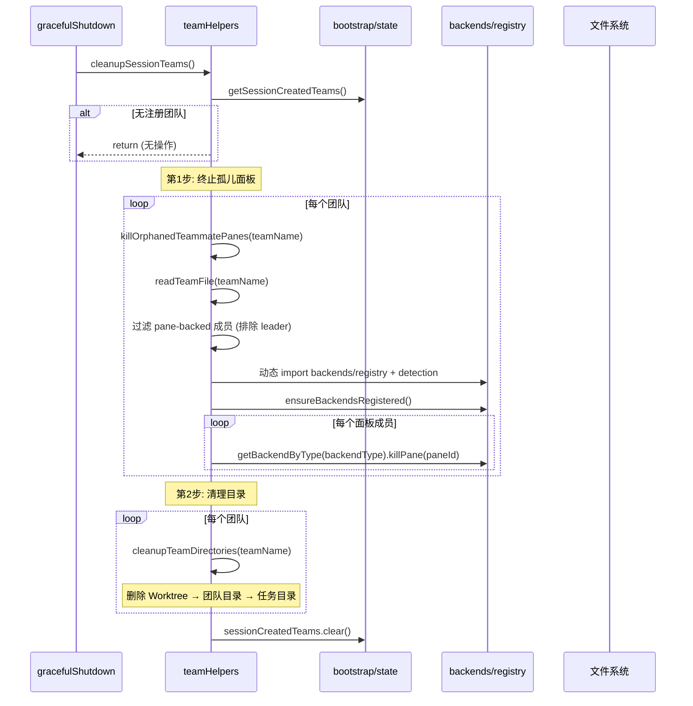

# teamHelpers 团队文件管理子模块设计文档

## 1. 文档信息

| 项目 | 内容 |
|------|------|
| **模块名称** | teamHelpers 团队文件管理子模块 |
| **文档版本** | v1.0-20260402 |
| **生成日期** | 2026-04-02 |
| **生成方式** | 代码反向工程 |
| **源文件行数** | 1184 行（5个主要文件合计） |
| **版本来源** | @anthropic-ai/claude-code v2.1.88 |

---

## 2. 模块概述

### 2.1 模块职责

teamHelpers 团队文件管理子模块是 Claude Code 多 Agent 协作系统（Swarm）的核心基础设施层，负责：

1. **团队配置文件的 CRUD 操作**：管理 `~/.claude/teams/{team-name}/config.json` 文件的读写，包括同步/异步双模式
2. **成员生命周期管理**：添加、移除、更新团队成员状态（活跃/空闲、权限模式等）
3. **进程间环境传递**：构建 CLI 参数和环境变量，确保衍生的队友进程继承正确配置
4. **队友初始化**：为 Swarm 中的队友 Agent 注册 Stop 钩子，在空闲时通知 Team Lead
5. **布局管理**：管理队友在终端面板中的颜色分配和面板创建（tmux/iTerm2 后端）
6. **会话重连**：支持从 CLI 参数或已恢复会话中重建团队上下文
7. **资源清理**：在团队删除或会话结束时清理团队目录、任务目录和 Git Worktree

### 2.2 模块边界

```
外部输入:
  - TeamCreateTool / TeamDeleteTool（工具层调用）
  - AppState.teamContext（应用状态）
  - CLI 参数（--agent-id, --team-name 等）
  - 文件系统（~/.claude/teams/ 目录）

模块提供:
  - 团队文件读写 API（sync/async）
  - 成员管理 API
  - 进程衍生工具函数
  - 队友初始化钩子
  - 面板布局管理
  - 重连上下文计算

不负责:
  - 消息内容的路由与投递（由 teammateMailbox 模块处理）
  - 具体的后端面板操作（委托给 backends/ 子模块）
  - Agent 主循环逻辑（由 coordinator 模块处理）
  - 任务列表具体管理（由 utils/tasks.ts 处理）
```

---

## 3. 架构设计

### 3.1 模块架构图



### 3.2 源文件组织



### 3.3 外部依赖表

| 依赖模块 | 路径 | 用途 |
|----------|------|------|
| `bootstrap/state` | `src/bootstrap/state.ts` | `getSessionCreatedTeams()`、`getSessionId()`、各种 flag getter |
| `teammate` | `src/utils/teammate.ts` | `isTeammate()`、`getAgentName()`、`getTeamName()` 等身份识别 |
| `teammateMailbox` | `src/utils/teammateMailbox.ts` | `writeToMailbox()`、`createIdleNotification()` 邮箱消息 |
| `backends/registry` | `src/utils/swarm/backends/registry.js` | 后端检测与注册 |
| `backends/types` | `src/utils/swarm/backends/types.js` | `BackendType`、`isPaneBackend` 类型定义 |
| `sessionHooks` | `src/utils/hooks/sessionHooks.ts` | `addFunctionHook()` 钩子注册 |
| `permissions/PermissionMode` | `src/utils/permissions/PermissionMode.ts` | 权限模式类型 |
| `tasks` | `src/utils/tasks.ts` | 任务目录管理 |
| `envUtils` | `src/utils/envUtils.ts` | `getTeamsDir()` 配置目录 |
| `agentColorManager` | `src/tools/AgentTool/agentColorManager.ts` | `AGENT_COLORS` 颜色调色板 |
| `zod/v4` | 外部包 | 输入参数校验 |

---

## 4. 数据结构设计

### 4.1 团队文件格式 (TeamFile)

团队配置文件存储在 `~/.claude/teams/{sanitized-team-name}/config.json`，完整类型定义位于 `teamHelpers.ts:65-90`：

```typescript
// teamHelpers.ts:65-90
export type TeamFile = {
  name: string                      // 团队名称
  description?: string              // 团队描述
  createdAt: number                 // 创建时间戳 (ms)
  leadAgentId: string               // Leader 的 Agent ID (格式: "team-lead@{teamName}")
  leadSessionId?: string            // Leader 实际的 session UUID（用于发现）
  hiddenPaneIds?: string[]          // 当前隐藏的面板 ID 列表
  teamAllowedPaths?: TeamAllowedPath[]  // 团队级别的路径权限规则
  members: Array<{
    agentId: string                 // Agent ID (格式: "{name}@{teamName}")
    name: string                    // Agent 名称（如 "researcher"）
    agentType?: string              // 角色类型
    model?: string                  // 使用的模型
    prompt?: string                 // 初始提示词
    color?: string                  // 分配的颜色
    planModeRequired?: boolean      // 是否要求计划模式
    joinedAt: number                // 加入时间戳
    tmuxPaneId: string              // 终端面板 ID
    cwd: string                     // 工作目录
    worktreePath?: string           // Git Worktree 路径
    sessionId?: string              // 会话 ID
    subscriptions: string[]         // 消息订阅列表
    backendType?: BackendType       // 后端类型 ('tmux'|'iterm2'|'in-process')
    isActive?: boolean              // 活跃状态（false=空闲, undefined/true=活跃）
    mode?: PermissionMode           // 当前权限模式
  }>
}
```

### 4.2 团队级路径权限 (TeamAllowedPath)

```typescript
// teamHelpers.ts:57-62
export type TeamAllowedPath = {
  path: string        // 绝对目录路径
  toolName: string    // 适用的工具名（如 "Edit", "Write"）
  addedBy: string     // 添加该规则的 Agent 名称
  addedAt: number     // 添加时间戳
}
```

### 4.3 邮箱结构 (TeammateMessage)

邮箱文件位于 `~/.claude/teams/{team-name}/inboxes/{agent-name}.json`，由 `teammateMailbox.ts:43-50` 定义：

```typescript
// teammateMailbox.ts:43-50
export type TeammateMessage = {
  from: string        // 发送者 Agent 名称
  text: string        // 消息正文（JSON 字符串或纯文本）
  timestamp: string   // ISO 时间戳
  read: boolean       // 是否已读
  color?: string      // 发送者颜色标识
  summary?: string    // 5-10 词的摘要（UI 预览用）
}
```

### 4.4 操作输入/输出类型

```typescript
// teamHelpers.ts:19-55
// 输入 Schema（Zod 验证）
type Input = {
  operation: 'spawnTeam' | 'cleanup'
  agent_type?: string    // Team Lead 角色类型
  team_name?: string     // 团队名称（spawnTeam 必填）
  description?: string   // 团队描述
}

// 衍生团队输出
type SpawnTeamOutput = {
  team_name: string
  team_file_path: string
  lead_agent_id: string
}

// 清理输出
type CleanupOutput = {
  success: boolean
  message: string
  team_name?: string
}
```

---

## 5. 接口设计

### 5.1 团队文件读写接口 (teamHelpers.ts)

| 函数 | 签名 | 说明 |
|------|------|------|
| `readTeamFile` | `(teamName: string) => TeamFile \| null` | **同步**读取团队配置文件，ENOENT 返回 null（`131-142行`） |
| `readTeamFileAsync` | `(teamName: string) => Promise<TeamFile \| null>` | **异步**读取团队配置文件（`147-160行`） |
| `writeTeamFileAsync` | `(teamName: string, teamFile: TeamFile) => Promise<void>` | **异步**写入团队配置文件，自动创建目录（`175-182行`） |
| `getTeamDir` | `(teamName: string) => string` | 返回团队目录路径 `~/.claude/teams/{sanitized-name}/`（`115-117行`） |
| `getTeamFilePath` | `(teamName: string) => string` | 返回团队配置文件路径 `~/.claude/teams/{sanitized-name}/config.json`（`122-124行`） |

### 5.2 成员管理接口 (teamHelpers.ts)

| 函数 | 签名 | 说明 |
|------|------|------|
| `removeTeammateFromTeamFile` | `(teamName, identifier: {agentId?, name?}) => boolean` | 按 agentId 或 name 移除成员（`188-227行`） |
| `removeMemberFromTeam` | `(teamName, tmuxPaneId) => boolean` | 按面板 ID 移除成员，同时清理 hiddenPaneIds（`285-317行`） |
| `removeMemberByAgentId` | `(teamName, agentId) => boolean` | 按 agentId 移除（适用于 in-process 共享面板的队友）（`326-348行`） |
| `setMemberMode` | `(teamName, memberName, mode: PermissionMode) => boolean` | 设置单个成员权限模式（`357-389行`） |
| `setMultipleMemberModes` | `(teamName, modeUpdates[]) => boolean` | 批量原子设置多成员权限（`415-445行`） |
| `syncTeammateMode` | `(mode, teamNameOverride?) => void` | 队友自行同步权限模式到 config.json（`397-407行`） |
| `setMemberActive` | `(teamName, memberName, isActive) => Promise<void>` | 异步设置成员活跃/空闲状态（`454-485行`） |

### 5.3 面板管理接口 (teamHelpers.ts)

| 函数 | 签名 | 说明 |
|------|------|------|
| `addHiddenPaneId` | `(teamName, paneId) => boolean` | 将面板 ID 加入隐藏列表（`235-251行`） |
| `removeHiddenPaneId` | `(teamName, paneId) => boolean` | 从隐藏列表移除面板 ID（`259-276行`） |

### 5.4 清理接口 (teamHelpers.ts)

| 函数 | 签名 | 说明 |
|------|------|------|
| `registerTeamForSessionCleanup` | `(teamName) => void` | 注册团队到会话清理追踪（`560-562行`） |
| `unregisterTeamForSessionCleanup` | `(teamName) => void` | 从清理追踪中移除（TeamDelete 后调用）（`568-570行`） |
| `cleanupSessionTeams` | `() => Promise<void>` | 清理本会话所有未显式删除的团队（`576-590行`） |
| `cleanupTeamDirectories` | `(teamName) => Promise<void>` | 清理指定团队的目录、Worktree、任务目录（`641-683行`） |

### 5.5 工具函数 (teamHelpers.ts)

| 函数 | 签名 | 说明 |
|------|------|------|
| `sanitizeName` | `(name: string) => string` | 将名称转为文件安全格式（小写+连字符替换非字母数字）（`100-102行`） |
| `sanitizeAgentName` | `(name: string) => string` | 替换 `@` 为 `-`，避免 `agentName@teamName` 格式歧义（`108-110行`） |

### 5.6 进程衍生工具 (spawnUtils.ts)

| 函数 | 签名 | 说明 |
|------|------|------|
| `getTeammateCommand` | `() => string` | 获取衍生队友进程的命令（支持 `CLAUDE_CODE_TEAMMATE_COMMAND` 环境变量覆盖）（`23-28行`） |
| `buildInheritedCliFlags` | `(options?) => string` | 构建传递给队友的 CLI 参数字符串（权限模式、模型、设置路径、插件等）（`38-89行`） |
| `buildInheritedEnvVars` | `() => string` | 构建传递给队友的环境变量字符串（API 提供商、代理、证书等）（`135-146行`） |

### 5.7 队友初始化 (teammateInit.ts)

| 函数 | 签名 | 说明 |
|------|------|------|
| `initializeTeammateHooks` | `(setAppState, sessionId, teamInfo) => void` | 为队友注册 Stop 钩子和团队权限规则（`28-129行`） |

### 5.8 布局管理 (teammateLayoutManager.ts)

| 函数 | 签名 | 说明 |
|------|------|------|
| `assignTeammateColor` | `(teammateId) => AgentColorName` | 轮询分配颜色，已分配则返回缓存（`22-33行`） |
| `getTeammateColor` | `(teammateId) => AgentColorName \| undefined` | 查询已分配颜色（`38-40行`） |
| `clearTeammateColors` | `() => void` | 清空所有颜色分配（团队清理时调用）（`48-51行`） |
| `createTeammatePaneInSwarmView` | `(name, color) => Promise<{paneId, isFirstTeammate}>` | 在 Swarm 视图中创建队友面板（`76-82行`） |
| `enablePaneBorderStatus` | `(windowTarget?, useSwarmSocket?) => Promise<void>` | 启用面板边框标题显示（`88-93行`） |
| `sendCommandToPane` | `(paneId, command, useSwarmSocket?) => Promise<void>` | 向面板发送命令（`100-104行`） |
| `isInsideTmux` | `() => Promise<boolean>` | 检测当前是否运行在 tmux 内（`57-60行`） |

### 5.9 重连 (reconnection.ts)

| 函数 | 签名 | 说明 |
|------|------|------|
| `computeInitialTeamContext` | `() => AppState['teamContext'] \| undefined` | 同步计算初始团队上下文（main.tsx 首次渲染前调用）（`23-66行`） |
| `initializeTeammateContextFromSession` | `(setAppState, teamName, agentName) => void` | 从恢复的会话中重建团队上下文（`75-119行`） |

---

## 6. 核心流程设计

### 6.1 团队创建流程



### 6.2 团队删除与清理流程



### 6.3 队友初始化流程



### 6.4 消息路由流程



### 6.5 会话结束清理流程



---

## 7. 文件系统布局设计

### 7.1 团队目录结构

```
~/.claude/                              # CLAUDE_CONFIG_DIR 可覆盖
  teams/                                # getTeamsDir() → join(configDir, 'teams')
    {sanitized-team-name}/              # getTeamDir() → sanitizeName(teamName)
      config.json                       # TeamFile 配置 (getTeamFilePath)
      inboxes/                          # 邮箱目录 (teammateMailbox.ts 管理)
        team-lead.json                  # Leader 的收件箱
        researcher.json                 # 队友 "researcher" 的收件箱
        test-runner.json                # 队友 "test-runner" 的收件箱
  tasks/                                # 任务目录 (tasks.ts 管理)
    {sanitized-team-name}/              # 以团队名为 taskListId
      ...task files...
```

### 7.2 名称清洗规则

- **`sanitizeName()`** (`teamHelpers.ts:100-102`): 所有非 `[a-zA-Z0-9]` 字符替换为 `-`，全部小写化。用于目录名、tmux 窗口名、Worktree 路径
- **`sanitizeAgentName()`** (`teamHelpers.ts:108-110`): 仅替换 `@` 为 `-`。用于构造 `agentName@teamName` 格式的确定性 Agent ID
- **`sanitizePathComponent()`** (来自 `tasks.ts`): 邮箱路径中 Agent 名称的安全化

### 7.3 Git Worktree 布局

队友可使用独立的 Git Worktree 隔离工作区：

```
{project-root}/                          # 主仓库
  .git/
    worktrees/
      {worktree-name}/                   # Git 内部跟踪
{worktree-path}/                         # 实际 worktree 目录
  .git                                   # 文件（非目录），内容: "gitdir: /path/to/.git/worktrees/..."
```

清理时 `destroyWorktree()` (`teamHelpers.ts:492-551`) 的策略：
1. 读取 `.git` 文件解析主仓库路径
2. 尝试 `git worktree remove --force`
3. 失败则回退到 `rm -rf`

---

## 8. 错误处理设计

### 8.1 文件系统错误

| 场景 | 处理方式 | 代码位置 |
|------|---------|----------|
| 读取不存在的团队文件 | 检查 `ENOENT` 错误码，返回 `null` | `teamHelpers.ts:136` |
| 其他读取错误 | `logForDebugging` 记录日志，返回 `null` | `teamHelpers.ts:137-141` |
| 删除团队目录失败 | `logForDebugging` 记录，不抛出异常 | `teamHelpers.ts:665-669` |
| 删除任务目录失败 | `logForDebugging` 记录，不抛出异常 | `teamHelpers.ts:677-681` |
| Worktree 删除失败（git 方式） | 回退到 `rm -rf` | `teamHelpers.ts:536-538` |
| Worktree 删除失败（rm 方式） | `logForDebugging` 记录 | `teamHelpers.ts:546-550` |

### 8.2 成员操作防御

| 场景 | 处理方式 | 代码位置 |
|------|---------|----------|
| 移除不存在的成员 | 返回 `false`，记录日志 | `teamHelpers.ts:215-220` |
| 设置不存在成员的模式 | 返回 `false`，记录日志 | `teamHelpers.ts:369-373` |
| 设置活跃状态时成员不存在 | `logForDebugging` 记录，提前返回 | `teamHelpers.ts:468-472` |
| 权限模式无变化 | 跳过写入（幂等优化） | `teamHelpers.ts:376-378` |
| 活跃状态无变化 | 跳过写入（幂等优化） | `teamHelpers.ts:476-478` |

### 8.3 清理流程容错

`cleanupSessionTeams()` (`teamHelpers.ts:576-590`) 使用 `Promise.allSettled` 而非 `Promise.all`，确保单个团队的清理失败不会影响其他团队的清理。`killOrphanedTeammatePanes()` 同样使用 `Promise.allSettled` 遍历面板。

### 8.4 重连错误

| 场景 | 处理方式 | 代码位置 |
|------|---------|----------|
| 团队文件不存在（首次启动） | `logError` 记录，返回 `undefined` | `reconnection.ts:41-45` |
| 成员在团队文件中未找到（可能已被移除） | `logForDebugging` 记录，继续执行（agentId 为 undefined） | `reconnection.ts:93-97` |

---

## 9. 设计评估

### 9.1 优点

1. **同步/异步双模式 API**：`readTeamFile` / `readTeamFileAsync` 和 `writeTeamFile` / `writeTeamFileAsync` 分别适配 React 渲染路径（同步）和工具处理器（异步），避免在不同上下文中的使用冲突

2. **幂等操作设计**：`setMemberMode` 和 `setMemberActive` 在值未改变时跳过写入（`teamHelpers.ts:376-378`, `476-478`），减少不必要的文件 I/O

3. **原子批量更新**：`setMultipleMemberModes()` (`teamHelpers.ts:415-445`) 在单次读写中更新多个成员，避免多次写入时的竞态条件

4. **渐进式清理策略**：Worktree 清理先尝试 `git worktree remove`，失败再回退到 `rm -rf`（`teamHelpers.ts:492-551`），兼顾了 Git 元数据一致性和最终清理能力

5. **会话级生命周期追踪**：通过 `registerTeamForSessionCleanup` / `unregisterTeamForSessionCleanup` 机制，确保即使 Agent 异常退出（SIGINT/SIGTERM），团队资源也能在 `gracefulShutdown` 中被清理

6. **动态导入优化**：`killOrphanedTeammatePanes()` (`teamHelpers.ts:598-634`) 使用动态 `import()` 加载后端模块，避免在正常运行路径中增加静态依赖图的体积——这段逻辑只在进程关闭时执行

7. **环境变量传递完备**：`spawnUtils.ts` 的 `buildInheritedEnvVars()` 覆盖了 API 提供商、代理配置、证书、远程模式等关键变量（`96-128行`），确保队友在 tmux 新 shell 中也能正确运行

### 9.2 缺点与风险

1. **无文件锁保护**：`teamHelpers.ts` 中的 `writeTeamFile` / `writeTeamFileAsync` 没有使用文件锁（对比 `teammateMailbox.ts` 使用了 `lockfile` 包），多个 Agent 同时修改 `config.json` 可能导致写覆盖丢失。特别是 `setMemberActive` 和 `setMemberMode` 这类高频并发操作

2. **同步 I/O 阻塞风险**：`readTeamFile` 和 `writeTeamFile` 使用 `readFileSync` / `writeFileSync`（`teamHelpers.ts:133, 169`），在 React 渲染路径中虽然是必要的，但如果团队文件变大（成员很多），可能阻塞事件循环

3. **JSON 解析无类型校验**：`readTeamFile` 使用 `jsonParse(content) as TeamFile` 做了不安全的类型断言（`teamHelpers.ts:135`），没有 Zod 运行时校验，恶意或损坏的 config.json 可能导致运行时错误

4. **颜色分配非持久化**：`teammateLayoutManager.ts` 中的颜色分配仅存在于内存 Map 中（`7行`），进程重启后颜色分配丢失，可能导致同一队友在不同会话中颜色不一致

5. **Plan Mode 与权限的耦合**：`spawnUtils.ts:47-48` 中 `planModeRequired` 时不继承 `bypassPermissions`，这个安全策略硬编码在工具函数中，缺乏可配置性

6. **单点依赖 `getTeamsDir()`**：所有文件路径计算依赖 `getTeamsDir()` 返回的 `~/.claude/teams/`，无法在单机上隔离多个 Claude Code 实例的团队目录（除非设置 `CLAUDE_CONFIG_DIR`）

### 9.3 改进建议

1. **引入文件锁**：对 `config.json` 的写操作引入 `lockfile` 保护（与 `teammateMailbox.ts` 保持一致），可以复用相同的 `LOCK_OPTIONS` 策略。建议至少在 `writeTeamFileAsync` 中加锁

2. **添加运行时校验**：为 `readTeamFile` 的返回值添加 Zod schema 校验（`TeamFile` 类型已有完整定义），防止损坏文件导致级联错误

3. **统一读写模式**：考虑移除同步 I/O 接口，改为在 React 渲染路径中使用缓存或 `useSyncExternalStore` 来避免同步文件读取。或至少添加文件大小检查，对超大文件降级

4. **颜色持久化**：将颜色分配写入 `config.json` 的成员 `color` 字段（该字段已存在但未被 `teammateLayoutManager.ts` 使用），实现跨会话颜色一致性

5. **集中错误处理**：当前的错误处理分散在各函数中，可以提取为统一的 `TeamFileError` 类型，携带操作类型和团队名称等上下文信息，便于上层诊断
