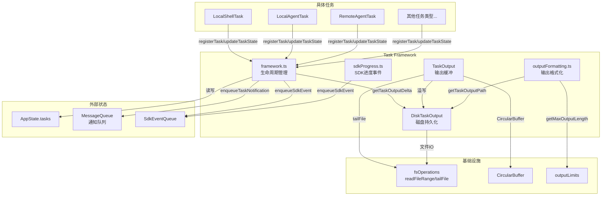
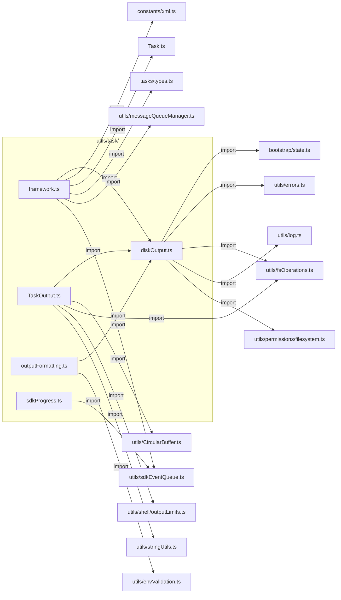
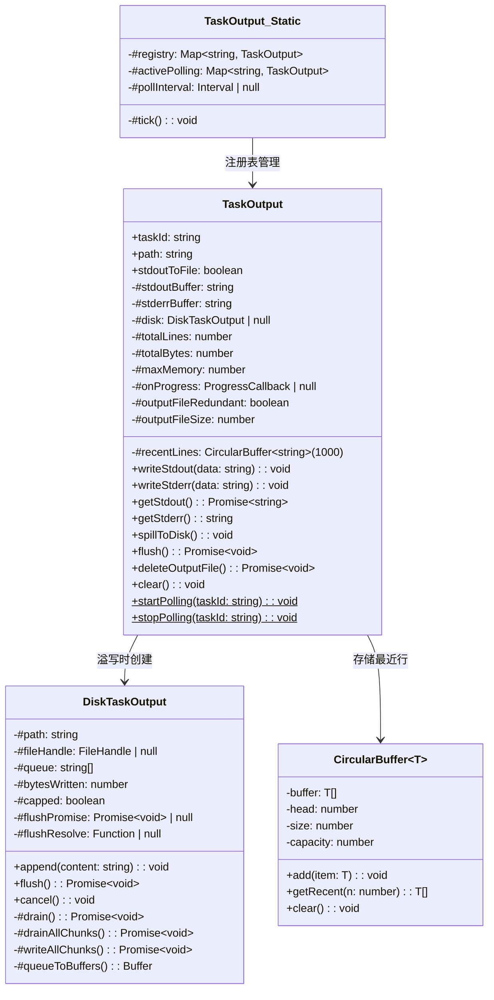
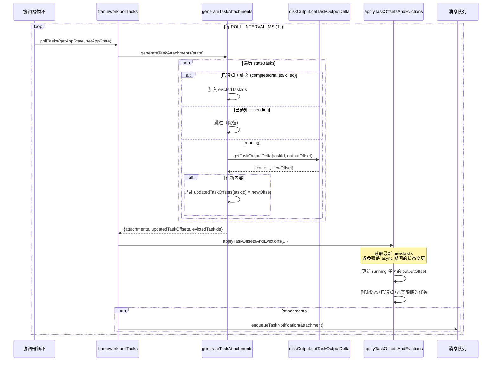
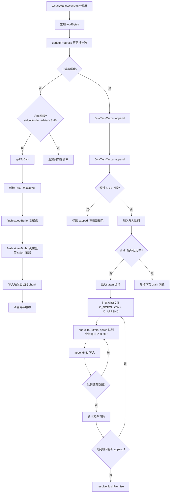
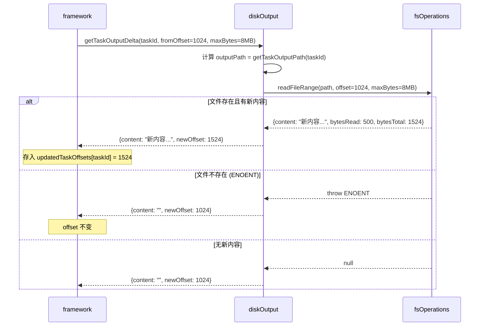
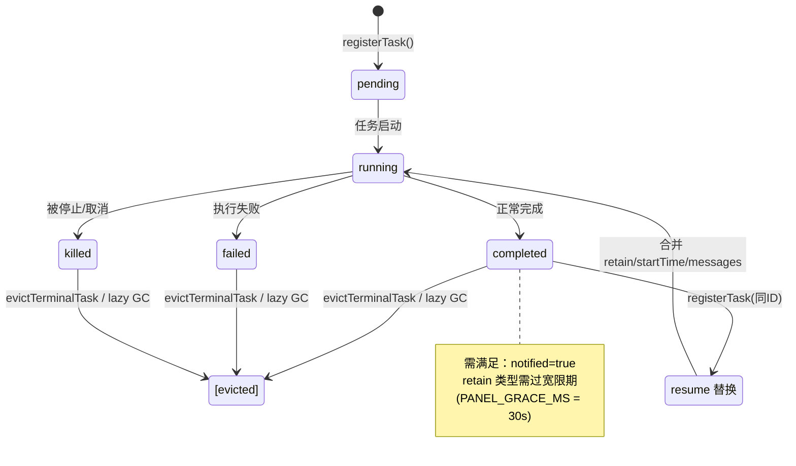
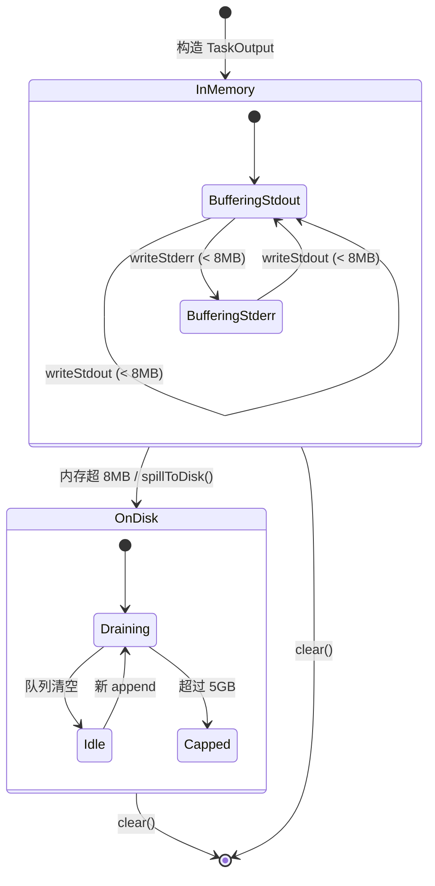

# Task Framework 子模块设计文档

## 1. 文档信息

| 属性 | 值 |
|------|------|
| 模块名称 | Task Framework（任务框架） |
| 文档版本 | v1.0-20260402 |
| 生成日期 | 2026-04-02 |
| 生成方式 | 代码反向工程 |
| 源文件行数 | 1228 行（合计） |
| 版本来源 | @anthropic-ai/claude-code v2.1.88 |

**源文件明细：**

| 文件 | 行数 | 职责 |
|------|------|------|
| `utils/task/framework.ts` | 309 | 任务生命周期管理与轮询调度 |
| `utils/task/TaskOutput.ts` | 391 | 内存输出缓冲与进度轮询 |
| `utils/task/diskOutput.ts` | 452 | 磁盘持久化读写 |
| `utils/task/outputFormatting.ts` | 39 | 输出格式化与截断 |
| `utils/task/sdkProgress.ts` | 37 | SDK 进度事件发射 |

---

## 2. 模块概述

### 2.1 模块职责

Task Framework 是 Claude Code 多任务并行执行的基础设施层，负责：

1. **任务生命周期管理** — 注册、状态更新、驱逐（eviction）终态任务
2. **输出缓冲与持久化** — 双层（内存 + 磁盘）输出管理，支持内存溢出自动溢写磁盘
3. **进度轮询** — 文件模式下的共享轮询器（shared poller），管道模式下的实时进度回调
4. **增量读取** — 基于字节偏移的 delta 读取，避免重复加载全量输出
5. **通知生成** — 将任务状态变化封装为 XML 格式的通知消息，推送至消息队列
6. **SDK 事件发射** — 向外部 SDK 消费者发射 `task_started` 和 `task_progress` 事件

### 2.2 模块边界

```
                    ┌─────────────────────────────┐
                    │   Task Framework 模块边界     │
                    │                             │
  AppState ◄────────┤  framework.ts               │
  (状态容器)         │  TaskOutput.ts              │
                    │  diskOutput.ts              │
  消息队列 ◄─────────┤  outputFormatting.ts        │
  (notification)    │  sdkProgress.ts             │
                    │                             │
  SDK事件队列 ◄──────┤                             │
                    └─────────────────────────────┘
         ▲                      ▲           ▲
         │                      │           │
   具体任务实现            React UI      文件系统
  (LocalShell等)       (进度组件)     (输出文件)
```

**上游依赖方（调用 Task Framework 的模块）：**
- 各任务类型实现（`LocalShellTask`、`LocalAgentTask`、`RemoteAgentTask` 等）
- React UI 组件（进度展示、后台任务指示器）
- 协调器（Coordinator）轮询循环

**下游被依赖（Task Framework 调用的模块）：**
- `AppState` 状态容器
- 文件系统操作（`fsOperations.ts`）
- 消息队列管理器（`messageQueueManager.ts`）
- SDK 事件队列（`sdkEventQueue.ts`）

---

## 3. 架构设计

### 3.1 模块架构图



### 3.2 源文件组织



### 3.3 外部依赖表

| 依赖模块 | 导入来源 | 用途 |
|---------|---------|------|
| `AppState` | `state/AppState.ts` | 全局状态容器，`tasks` 字段存储所有任务 |
| `Task.ts` | `Task.ts` | `TaskType`、`TaskStatus`、`isTerminalTaskStatus` 类型定义 |
| `tasks/types.ts` | `tasks/types.ts` | `TaskState` 联合类型（7 种具体任务状态） |
| `CircularBuffer` | `utils/CircularBuffer.ts` | 固定容量环形缓冲，存储最近输出行 |
| `fsOperations` | `utils/fsOperations.ts` | `readFileRange()`、`tailFile()` 文件读取 |
| `messageQueueManager` | `utils/messageQueueManager.ts` | `enqueuePendingNotification()` 通知入队 |
| `sdkEventQueue` | `utils/sdkEventQueue.ts` | `enqueueSdkEvent()` SDK 事件入队 |
| `outputLimits` | `utils/shell/outputLimits.ts` | `getMaxOutputLength()` shell 输出上限 |
| `bootstrap/state` | `bootstrap/state.ts` | `getSessionId()` 获取会话 ID |
| `permissions/filesystem` | `utils/permissions/filesystem.ts` | `getProjectTempDir()` 项目临时目录 |
| `constants/xml` | `constants/xml.ts` | XML 标签名常量 |
| `envValidation` | `utils/envValidation.ts` | 环境变量校验 |

---

## 4. 数据结构设计

### 4.1 TaskOutput 缓冲结构



**内存布局关键参数：**

| 参数 | 值 | 定义位置 |
|------|-----|---------|
| `DEFAULT_MAX_MEMORY` | 8MB | `TaskOutput.ts:9` |
| `PROGRESS_TAIL_BYTES` | 4096 字节 | `TaskOutput.ts:11` |
| `CircularBuffer` 容量 | 1000 行 | `TaskOutput.ts:40` |
| `MAX_TASK_OUTPUT_BYTES` | 5GB | `diskOutput.ts:30` |
| `DEFAULT_MAX_READ_BYTES` | 8MB | `diskOutput.ts:23` |
| `TASK_MAX_OUTPUT_DEFAULT` | 32000 字符 | `outputFormatting.ts:5` |
| `TASK_MAX_OUTPUT_UPPER_LIMIT` | 160000 字符 | `outputFormatting.ts:4` |

### 4.2 磁盘文件格式

**目录结构：**
```
{projectTempDir}/{sessionId}/tasks/
  ├── b_xxxxxxxx.output    # local_bash 任务输出
  ├── a_yyyyyyyy.output    # local_agent 任务输出（或符号链接）
  └── ...
```

- **文件命名**：`{taskIdPrefix}_{8位随机字符}.output`，前缀由 `Task.ts:79-87` 的 `TASK_ID_PREFIXES` 映射
- **隔离策略**：路径包含 `sessionId`，避免并发会话间互相覆盖（`diskOutput.ts:40-55`）
- **会话 ID 缓存**：首次调用 `getTaskOutputDir()` 时捕获 `sessionId`，不随 `/clear` 更新，保证后台任务文件可达（`diskOutput.ts:49-55`）
- **安全措施**：Unix 下使用 `O_NOFOLLOW` 防止符号链接攻击（`diskOutput.ts:19-21`），`O_EXCL` 确保创建新文件（`diskOutput.ts:413`）

**文件内容格式：**
- 纯文本追加写入
- stderr 内容带 `[stderr] ` 前缀标记（`TaskOutput.ts:183`）
- 超过 5GB 上限时追加截断提示 `[output truncated: exceeded 5GB disk cap]`（`diskOutput.ts:119-121`）

### 4.3 核心类型定义

**TaskAttachment**（`framework.ts:31-39`）— 任务状态推送附件：

```typescript
type TaskAttachment = {
  type: 'task_status'
  taskId: string
  toolUseId?: string
  taskType: TaskType
  status: TaskStatus
  description: string
  deltaSummary: string | null  // 自上次附件以来的新输出
}
```

**TaskStatus**（`Task.ts:15-20`）— 任务状态枚举：

```typescript
type TaskStatus = 'pending' | 'running' | 'completed' | 'failed' | 'killed'
```

**TaskType**（`Task.ts:6-13`）— 任务类型枚举：

```typescript
type TaskType =
  | 'local_bash'    | 'local_agent'
  | 'remote_agent'  | 'in_process_teammate'
  | 'local_workflow' | 'monitor_mcp' | 'dream'
```

**TaskStateBase**（`Task.ts:45-57`）— 所有任务共享的基础字段：

```typescript
type TaskStateBase = {
  id: string
  type: TaskType
  status: TaskStatus
  description: string
  toolUseId?: string
  startTime: number
  endTime?: number
  totalPausedMs?: number
  outputFile: string
  outputOffset: number    // 增量读取的字节偏移
  notified: boolean       // 是否已通知父任务
}
```

**ProgressCallback**（`TaskOutput.ts:13-19`）— 进度回调签名：

```typescript
type ProgressCallback = (
  lastLines: string,      // 最后 5 行
  allLines: string,       // 最后 100 行
  totalLines: number,     // 总行数（精确或估算）
  totalBytes: number,     // 总字节数
  isIncomplete: boolean,  // 是否截断（仅读取了尾部）
) => void
```

---

## 5. 接口设计

### 5.1 framework.ts 导出接口

| 接口 | 签名 | 说明 |
|------|------|------|
| `POLL_INTERVAL_MS` | `const: 1000` | 标准轮询间隔（毫秒） |
| `STOPPED_DISPLAY_MS` | `const: 3000` | 已停止任务在 UI 中的显示时长 |
| `PANEL_GRACE_MS` | `const: 30000` | 终态 `local_agent` 任务在面板中的宽限期 |
| `updateTaskState<T>` | `(taskId: string, setAppState: SetAppState, updater: (task: T) => T) => void` | 泛型更新单个任务状态；updater 返回同引用时跳过 spread 避免无意义重渲染（`framework.ts:48-72`） |
| `registerTask` | `(task: TaskState, setAppState: SetAppState) => void` | 注册新任务到 AppState；替换（resume）时合并 `retain/startTime/messages/diskLoaded/pendingMessages`；首次注册发射 `task_started` SDK 事件（`framework.ts:77-117`） |
| `evictTerminalTask` | `(taskId: string, setAppState: SetAppState) => void` | 主动驱逐终态+已通知的任务；检查 `retain` 型任务的 `evictAfter` 宽限期（`framework.ts:125-144`） |
| `getRunningTasks` | `(state: AppState) => TaskState[]` | 返回所有 `status === 'running'` 的任务（`framework.ts:149-152`） |
| `generateTaskAttachments` | `(state: AppState) => Promise<{attachments, updatedTaskOffsets, evictedTaskIds}>` | 生成推送附件：驱逐已通知终态任务、读取运行任务的 delta 输出（`framework.ts:158-206`） |
| `applyTaskOffsetsAndEvictions` | `(setAppState, updatedTaskOffsets, evictedTaskIds) => void` | 将 offset 补丁和驱逐操作应用到**最新**状态，避免 TOCTOU 竞争（`framework.ts:213-249`） |
| `pollTasks` | `(getAppState, setAppState) => Promise<void>` | 主轮询入口：调用 `generateTaskAttachments` + `applyTaskOffsetsAndEvictions` + 发送通知（`framework.ts:255-269`） |
| `TaskAttachment` | type | 任务状态附件类型 |

### 5.2 TaskOutput.ts 导出接口

| 接口 | 签名 | 说明 |
|------|------|------|
| `TaskOutput` (class) | `new(taskId, onProgress, stdoutToFile?, maxMemory?)` | 主类。`stdoutToFile=true` 为文件模式（bash），`false` 为管道模式（hooks） |
| `TaskOutput.startPolling` | `static (taskId: string) => void` | React 组件挂载时开启文件尾部轮询 |
| `TaskOutput.stopPolling` | `static (taskId: string) => void` | React 组件卸载时停止轮询 |
| `.writeStdout(data)` | `(data: string) => void` | 管道模式写入 stdout |
| `.writeStderr(data)` | `(data: string) => void` | 管道模式写入 stderr |
| `.getStdout()` | `() => Promise<string>` | 获取 stdout：文件模式读文件，管道模式返回缓冲或尾部摘要 |
| `.getStderr()` | `() => string` | 同步获取 stderr（溢写后返回空串） |
| `.spillToDisk()` | `() => void` | 强制将内存缓冲溢写磁盘（后台化时调用） |
| `.flush()` | `() => Promise<void>` | 等待磁盘写入完成 |
| `.deleteOutputFile()` | `() => Promise<void>` | 删除输出文件 |
| `.clear()` | `() => void` | 清空所有缓冲、停止轮询、从注册表移除 |
| `.isOverflowed` | `get: boolean` | 是否已溢写磁盘 |
| `.totalLines` / `.totalBytes` | `get: number` | 累计行数 / 字节数 |
| `.outputFileRedundant` | `get: boolean` | `getStdout()` 后文件内容是否已完整内联 |
| `.outputFileSize` | `get: number` | `getStdout()` 后的文件总大小 |

### 5.3 diskOutput.ts 导出接口

| 接口 | 签名 | 说明 |
|------|------|------|
| `MAX_TASK_OUTPUT_BYTES` | `const: 5GB` | 磁盘输出上限 |
| `MAX_TASK_OUTPUT_BYTES_DISPLAY` | `const: '5GB'` | 上限的显示文本 |
| `getTaskOutputDir()` | `() => string` | 获取会话级任务输出目录（首次调用时缓存） |
| `getTaskOutputPath(taskId)` | `(taskId: string) => string` | 获取任务输出文件路径 |
| `DiskTaskOutput` (class) | `new(taskId: string)` | 单任务磁盘写入器 |
| `appendTaskOutput(taskId, content)` | `(taskId, content) => void` | 追加输出到磁盘（同步 API，异步写入） |
| `flushTaskOutput(taskId)` | `(taskId) => Promise<void>` | 等待指定任务的所有磁盘写入完成 |
| `evictTaskOutput(taskId)` | `(taskId) => Promise<void>` | flush 后从内存 map 中移除（不删文件） |
| `getTaskOutputDelta(taskId, fromOffset, maxBytes?)` | `=> Promise<{content, newOffset}>` | 增量读取：从 `fromOffset` 读取最多 `maxBytes`（默认 8MB） |
| `getTaskOutput(taskId, maxBytes?)` | `=> Promise<string>` | 读取尾部输出（最多 `maxBytes`） |
| `getTaskOutputSize(taskId)` | `=> Promise<number>` | 获取输出文件大小 |
| `cleanupTaskOutput(taskId)` | `=> Promise<void>` | 取消写入 + 删除文件 |
| `initTaskOutput(taskId)` | `=> Promise<string>` | 创建空输出文件（`O_EXCL` 安全创建） |
| `initTaskOutputAsSymlink(taskId, targetPath)` | `=> Promise<string>` | 创建符号链接到目标文件（agent transcript） |

### 5.4 outputFormatting.ts 导出接口

| 接口 | 签名 | 说明 |
|------|------|------|
| `TASK_MAX_OUTPUT_UPPER_LIMIT` | `const: 160000` | 输出长度上限的上限 |
| `TASK_MAX_OUTPUT_DEFAULT` | `const: 32000` | 默认最大输出长度 |
| `getMaxTaskOutputLength()` | `() => number` | 获取有效的最大输出长度（支持环境变量 `TASK_MAX_OUTPUT_LENGTH`） |
| `formatTaskOutput(output, taskId)` | `=> {content, wasTruncated}` | 截断过长输出，添加 `[Truncated. Full output: ...]` 头部 |

### 5.5 sdkProgress.ts 导出接口

| 接口 | 签名 | 说明 |
|------|------|------|
| `emitTaskProgress(params)` | `(params: {...}) => void` | 发射 `task_progress` SDK 事件，包含 token 用量、工具使用次数、持续时间等 |

---

## 6. 核心流程设计

### 6.1 任务轮询流程



### 6.2 输出写入流程（管道模式）



### 6.3 增量读取流程



### 6.4 驱逐流程

```mermaid
flowchart TD
    subgraph "懒惰 GC（generateTaskAttachments）"
        A1[遍历 tasks] --> A2{status 为终态<br/>且 notified=true?}
        A2 -->|是| A3[加入 evictedTaskIds]
        A2 -->|否| A4[继续处理]
    end

    subgraph "应用驱逐（applyTaskOffsetsAndEvictions）"
        B1[遍历 evictedTaskIds] --> B2{最新状态仍为<br/>终态+已通知?}
        B2 -->|否| B3[跳过：可能已被 resume 替换]
        B2 -->|是| B4{有 retain 字段<br/>且未过宽限期?}
        B4 -->|是| B5[跳过：面板宽限期未到]
        B4 -->|否| B6[delete tasks[id]]
    end

    subgraph "主动驱逐（evictTerminalTask）"
        C1[外部调用] --> C2{终态 + 已通知?}
        C2 -->|否| C3[返回不变]
        C2 -->|是| C4{retain 且<br/>evictAfter > now?}
        C4 -->|是| C5[返回不变]
        C4 -->|否| C6[删除任务]
    end

    A3 --> B1
```

---

## 7. 状态管理

### 7.1 任务状态转换



**关键不变量：**
- `isTerminalTaskStatus()` 返回 `true` 的状态（`completed`/`failed`/`killed`）是终态，不会再转换为非终态
- 驱逐前必须 `notified === true`，确保父任务已收到完成通知
- `retain` 型任务（`LocalAgentTaskState`）有额外宽限期 `evictAfter`

### 7.2 输出状态转换



### 7.3 通知状态

每个 `TaskState` 的 `notified` 字段控制通知状态：

| notified 值 | 含义 |
|-------------|------|
| `false` | 任务状态尚未通知父代 |
| `true` | 已通知；终态任务可被驱逐 |

**重要设计决策**（`framework.ts:199-202`）：已完成任务的通知**不在** `generateTaskAttachments` 中生成，而是由各任务类型自行通过 `enqueuePendingNotification()` 处理，避免双重投递（inline attachment + 独立 API turn）。

---

## 8. 性能设计

### 8.1 内存缓冲策略

**双层缓冲架构：**

1. **内存层**（`TaskOutput`）：
   - 默认上限 8MB（`DEFAULT_MAX_MEMORY`，`TaskOutput.ts:9`）
   - stdout 和 stderr 分离缓冲，溢写时合并标记
   - `CircularBuffer<string>(1000)` 存储最近 1000 行，用于进度展示和溢写后的摘要

2. **磁盘层**（`DiskTaskOutput`）：
   - 无内存积压：使用 `string[]` 队列 + 单 drain 循环，每个 chunk 写完即可 GC
   - `#queueToBuffers()` 使用 `splice(0)` 原地清空数组，确保字符串引用尽快释放（`diskOutput.ts:191`）
   - 避免 `.then()` 链闭包导致的内存保持问题（`diskOutput.ts:179-180` 注释明确警告不可加 `await`）

**关键优化点：**
- `updateTaskState` 中 updater 返回同引用时跳过 spread（`framework.ts:59-63`），避免 React 无意义重渲染
- `applyTaskOffsetsAndEvictions` 使用 `changed` 标志，无变更时返回原 `prev` 引用（`framework.ts:247`）

### 8.2 磁盘溢出机制

```
内存缓冲 (≤8MB)
       │
       ▼ 超限触发
磁盘队列写入 ──────► 文件追加 (O_APPEND)
       │                    │
       │               ≤ 5GB 正常
       │                    │
       ▼               > 5GB 截断
  drain 循环           写入截断提示
  (单线程)             标记 capped
```

- **溢写触发**：`#writeBuffered()` 检测 `stdoutBuffer + stderrBuffer + data > maxMemory`（`TaskOutput.ts:189-190`）
- **磁盘上限**：5GB（`MAX_TASK_OUTPUT_BYTES`），使用 `content.length`（UTF-16 码元）近似计算，可能低估 UTF-8 实际字节数最多 3 倍，但作为粗粒度保护可接受（`diskOutput.ts:115-116`）
- **文件打开安全**：Unix 下 `O_NOFOLLOW` 防符号链接攻击，`O_EXCL` 防覆盖已有文件

### 8.3 增量读取优化

- **字节偏移追踪**：`TaskStateBase.outputOffset` 记录已读位置，`getTaskOutputDelta` 仅读取 `[offset, offset+maxBytes]` 范围（`diskOutput.ts:304-330`）
- **尾部读取**：`getTaskOutput` 使用 `tailFile()` 读取文件末尾，跳过大文件前部（`diskOutput.ts:336-357`）
- **文件冗余检测**：`TaskOutput.#outputFileRedundant` 在 `getStdout()` 后标记文件是否可删除，避免重复存储（`TaskOutput.ts:310-311`）

### 8.4 进度轮询优化

- **共享定时器**：所有文件模式 `TaskOutput` 共享一个 `setInterval`（`TaskOutput.ts:87-89`）
- **按需激活**：React 组件挂载/卸载驱动 `startPolling`/`stopPolling`，仅轮询可见任务
- **非阻塞 tick**：`#tick()` 使用 `.then()` 而非 `await`，防止慢 I/O 堆积（`TaskOutput.ts:108-109`）
- **行数估算**：尾部样本不足全文件时，按比例外推行数并取单调最大值（`TaskOutput.ts:142-149`）

---

## 9. 错误处理设计

### 9.1 文件系统错误

| 场景 | 位置 | 处理策略 |
|------|------|---------|
| 输出文件不存在（ENOENT） | `getTaskOutputDelta` (`diskOutput.ts:323-325`) | 返回空内容和原偏移 |
| 输出文件不存在（ENOENT） | `getTaskOutput` (`diskOutput.ts:349-351`) | 返回空字符串 |
| 输出文件不存在（ENOENT） | `getTaskOutputSize` (`diskOutput.ts:367-369`) | 返回 0 |
| 输出文件被删除（启动清理） | `TaskOutput.#readStdoutFromFile` (`TaskOutput.ts:318-325`) | 返回诊断字符串，包含错误码和路径 |
| 删除文件失败 | `cleanupTaskOutput` (`diskOutput.ts:388-393`) | ENOENT 静默，其他 `logError` |
| 文件尾读取失败 | `TaskOutput.#tick` (`TaskOutput.ts:159-162`) | 静默忽略（文件可能尚未创建） |

### 9.2 磁盘写入错误

| 场景 | 位置 | 处理策略 |
|------|------|---------|
| `#drain` 首次失败（EMFILE/EPERM） | `DiskTaskOutput.#drain` (`diskOutput.ts:210-220`) | `logError` + 队列非空时重试一次 |
| `#drain` 二次失败 | `DiskTaskOutput.#drain` (`diskOutput.ts:218-220`) | `logError` 后放弃，resolve flushPromise |
| 符号链接创建失败 | `initTaskOutputAsSymlink` (`diskOutput.ts:437-448`) | 降级为 `initTaskOutput`（创建普通空文件） |

### 9.3 并发安全

| 场景 | 位置 | 处理策略 |
|------|------|---------|
| async 期间任务状态变更 | `applyTaskOffsetsAndEvictions` (`diskOutput.ts:229`) | 重新读取 `fresh` 状态，仅对 `running` 任务更新 offset |
| resume 替换已驱逐任务 | `applyTaskOffsetsAndEvictions` (`framework.ts:239-241`) | 重新检查 `isTerminalTaskStatus + notified` |
| drain 期间 append | `DiskTaskOutput.#drainAllChunks` (`diskOutput.ts:170-172`) | 关闭文件后再检查队列，非空则重新打开 |

### 9.4 测试辅助

- `_resetTaskOutputDirForTest()`（`diskOutput.ts:58-60`）：清除缓存的目录路径
- `_clearOutputsForTest()`（`diskOutput.ts:245-253`）：取消所有写入、等待异步操作稳定、清空 map，解决 async-ENOENT-after-teardown 类闪烁测试问题
- `track()` 函数（`diskOutput.ts:83-87`）：追踪所有 fire-and-forget Promise，测试中可 drain

---

## 10. 设计评估

### 10.1 优点

1. **双层缓冲设计成熟** — 8MB 内存阈值 + 5GB 磁盘上限的组合在性能和资源控制间取得良好平衡。内存层提供低延迟访问，磁盘层保障大输出不会 OOM。

2. **精细的 GC 控制** — `DiskTaskOutput` 的队列设计（`splice(0)` + 独立 `#queueToBuffers()` 方法）和对 `.then()` 链闭包问题的明确认知（`diskOutput.ts:179` 注释），显示了对 V8 GC 行为的深入理解。

3. **TOCTOU 安全** — `applyTaskOffsetsAndEvictions` 在 async 等待后重新读取最新状态再操作，`generateTaskAttachments` 只返回"意图"（offset patches + eviction IDs），不直接修改状态，二者配合有效防止了竞态条件。

4. **安全防护** — `O_NOFOLLOW` 防符号链接攻击、`O_EXCL` 防覆盖、session ID 隔离防跨会话干扰，体现了对沙箱环境安全威胁的充分考量。

5. **按需轮询** — React 组件驱动的 `startPolling`/`stopPolling` 机制，共享定时器 + 非阻塞 tick，最小化不可见任务的 I/O 开销。

6. **优雅降级** — 符号链接失败降级为普通文件（`initTaskOutputAsSymlink`），磁盘写入失败重试一次后放弃但不崩溃，ENOENT 全部静默处理。

### 10.2 缺点与风险

1. **5GB 上限计算不精确** — `DiskTaskOutput.#bytesWritten` 使用 `content.length`（UTF-16 码元数）而非实际 UTF-8 字节数（`diskOutput.ts:115-116`），对于全 ASCII 内容精确，但多字节字符可能导致实际写入超过 5GB。注释中承认了这一点（"undercounts UTF-8 bytes by at most ~3x"）。

2. **`generateTaskAttachments` 中 attachments 始终为空** — 当前实现中（`framework.ts:158-206`），`attachments` 数组声明后从未被 push 任何元素，所有已完成任务的通知由各任务类型自行处理。这导致 `pollTasks` 中的 `enqueueTaskNotification` 循环（`framework.ts:266-268`）实际上永远不执行。这可能是重构后的残留代码，也可能是为未来扩展预留的接口。

3. **会话 ID 缓存的刚性** — `getTaskOutputDir()` 首次调用时缓存 `sessionId`（`diskOutput.ts:49-55`），`/clear` 后新会话的任务会写入旧目录。虽然注释解释了这是为了后台任务文件可达性，但可能导致目录清理逻辑复杂化。

4. **磁盘写入无重试间隔** — `#drain` 失败后立即重试（`diskOutput.ts:217-220`），对于 EMFILE（文件描述符耗尽）这类需要等待资源释放的场景，立即重试可能仍然失败。

5. **进度行数估算可能不准** — 文件模式的行数估算基于尾部 4096 字节的行密度外推全文件（`TaskOutput.ts:142-149`），当输出前后部分行长差异大时，估算偏差可能较大。

### 10.3 改进建议

1. **精确化磁盘上限计算** — 可使用 `Buffer.byteLength(content, 'utf8')` 替代 `content.length`，虽然有性能开销，但对于仅在超限边界附近的 chunk 进行精确计算是值得的（例如当 `#bytesWritten > MAX * 0.9` 时切换为精确计算）。

2. **清理死代码** — 如果 `generateTaskAttachments` 中的 `attachments` 确实永远为空，应当移除相关代码路径或添加明确的 TODO 注释说明预留意图，减少维护者困惑。

3. **重试退避** — 为 `#drain` 的重试添加短暂延迟（如 100ms），提高 EMFILE 场景下的重试成功率。

4. **输出目录生命周期管理** — 当前缺少会话结束时对 `{sessionId}/tasks/` 目录的显式清理逻辑（依赖项目临时目录的上层清理）。可考虑在进程退出时主动清理已完成任务的输出文件。

5. **Windows 兼容性** — `O_NOFOLLOW` 在 Windows 下为 0（`diskOutput.ts:21`），且字符串 flags（`'a'`/`'wx'`）用于 Windows 路径。建议添加集成测试覆盖 Windows 下的文件创建与清理路径。
