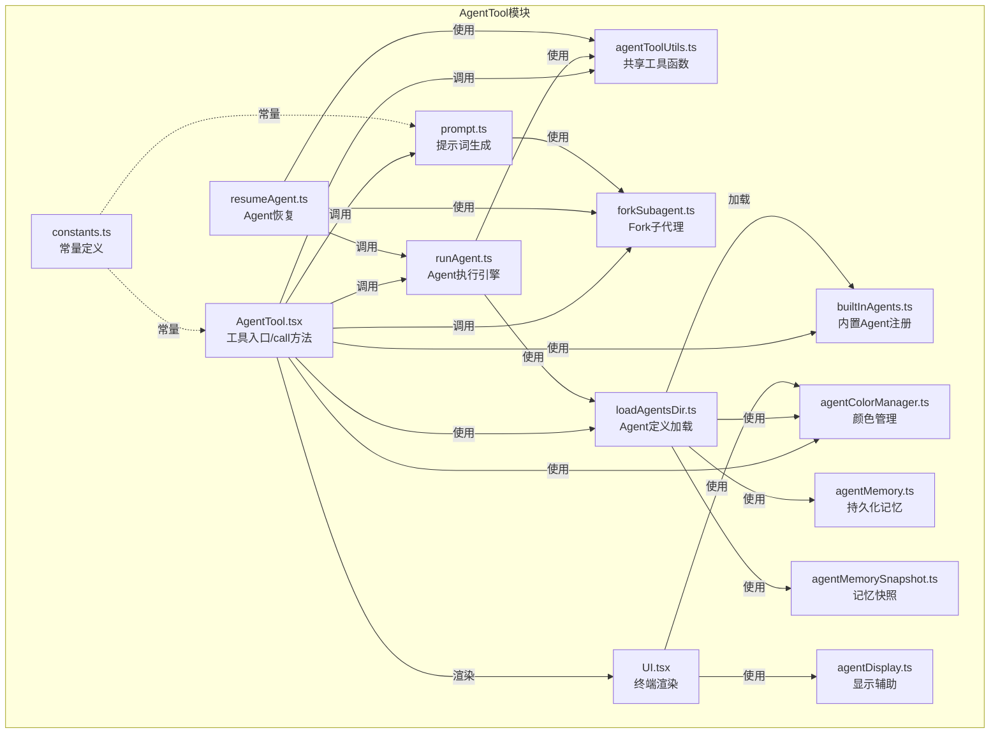
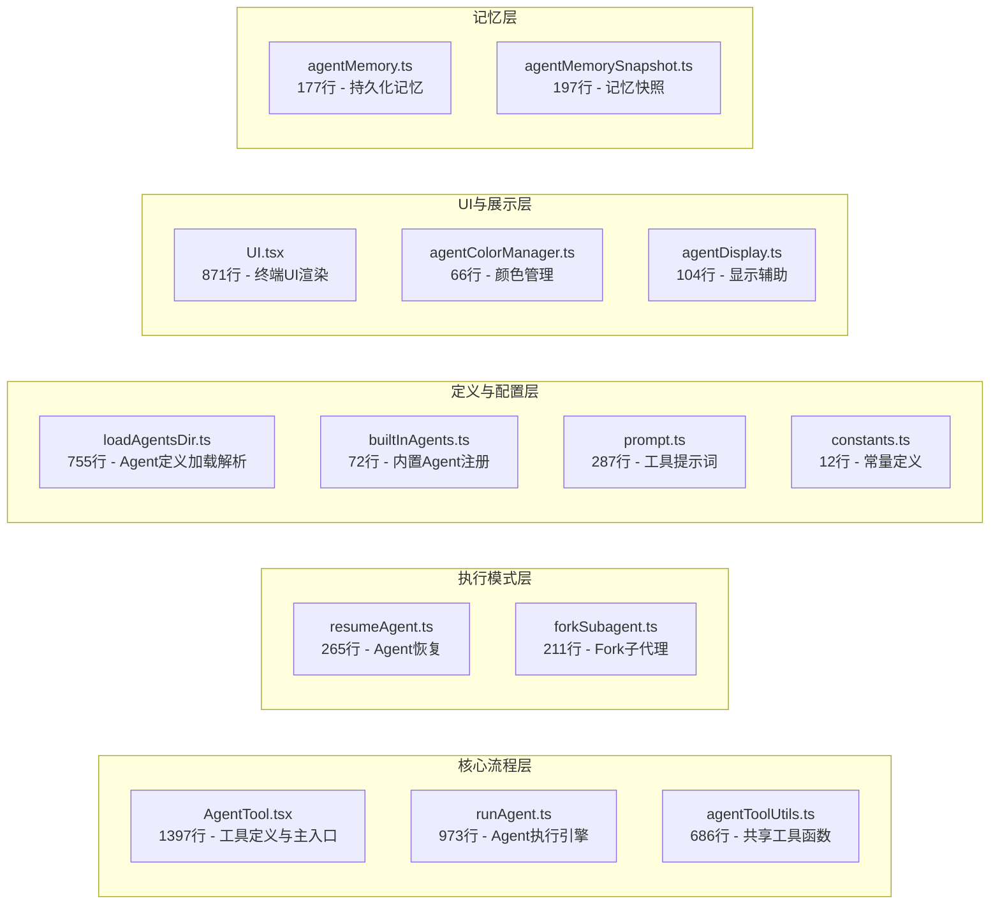
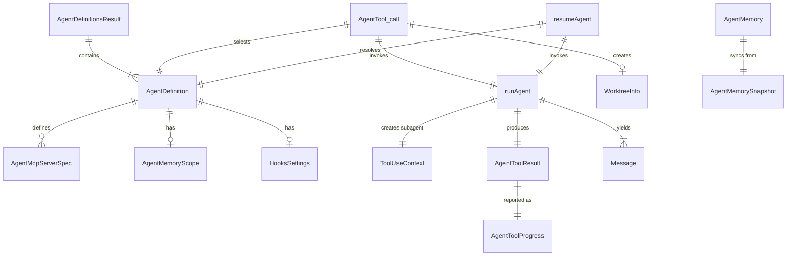
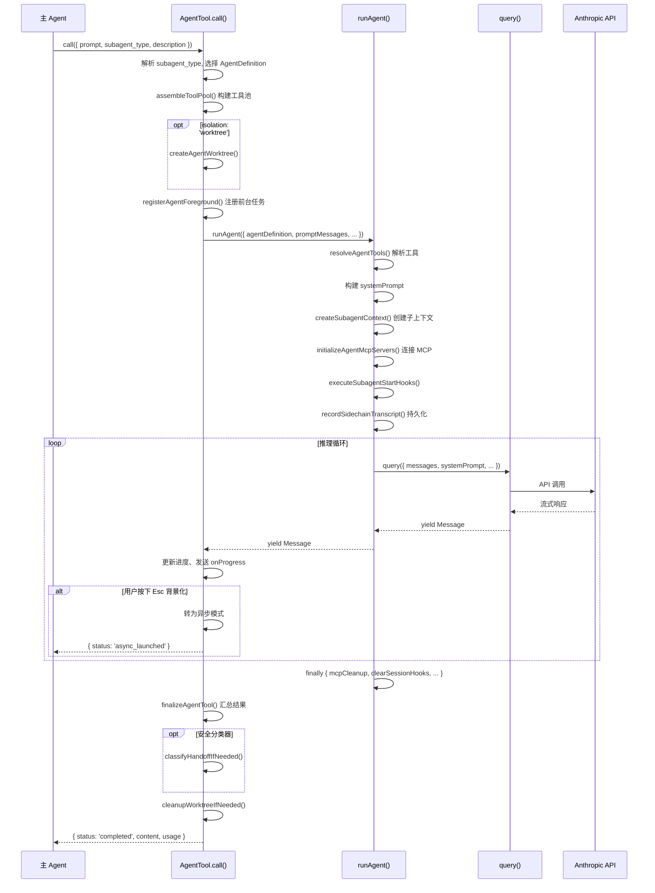
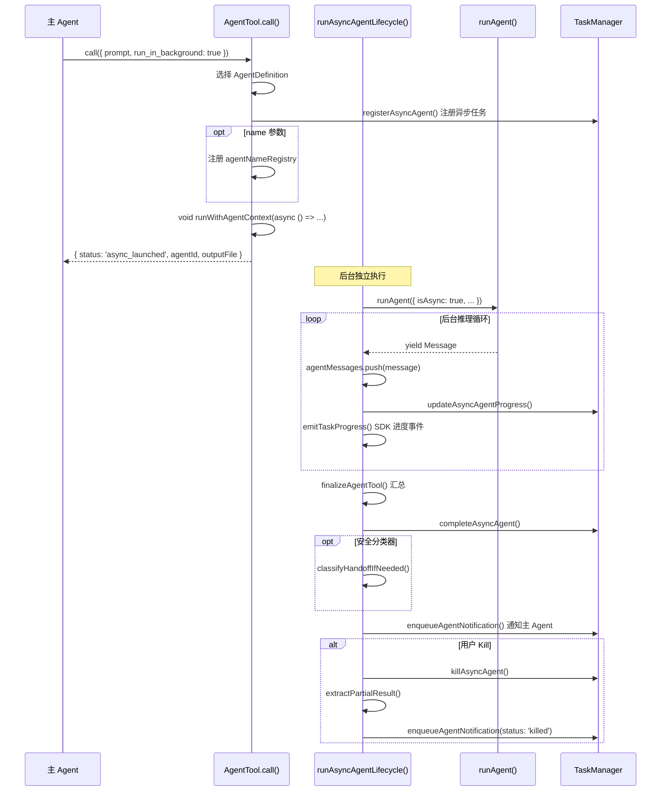
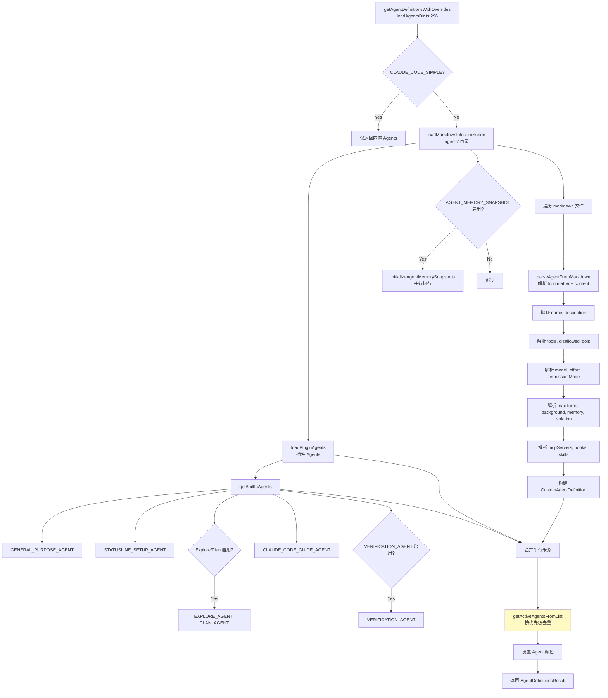
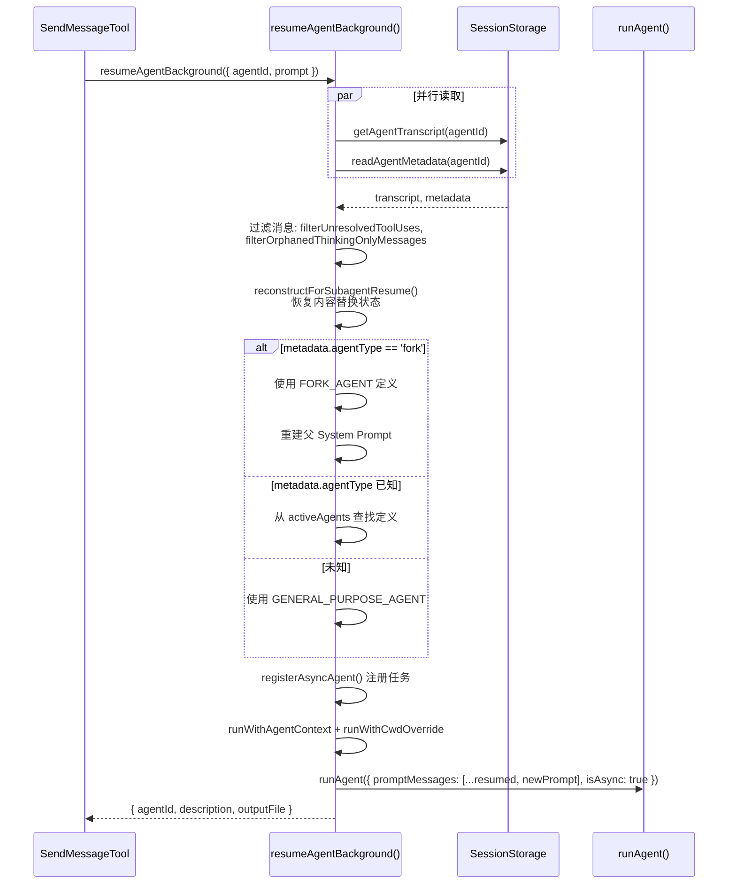
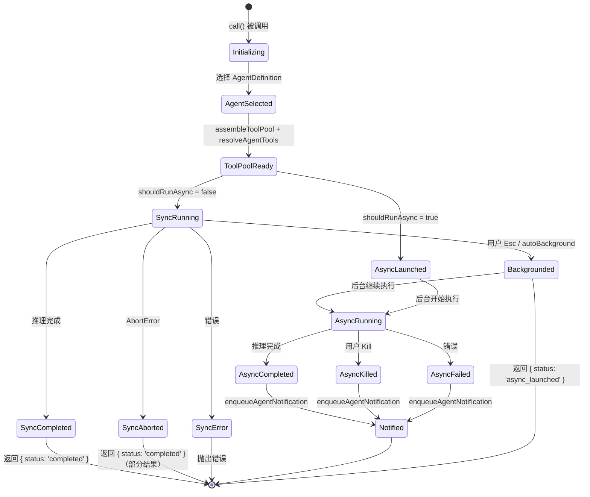
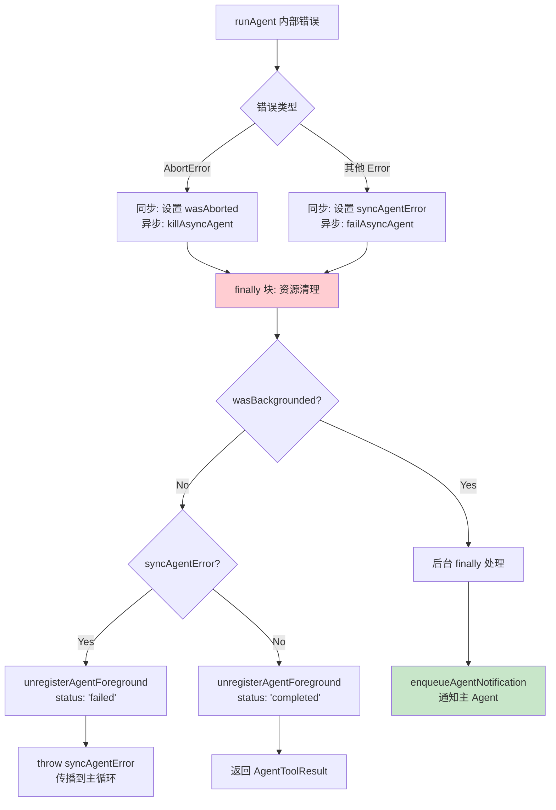
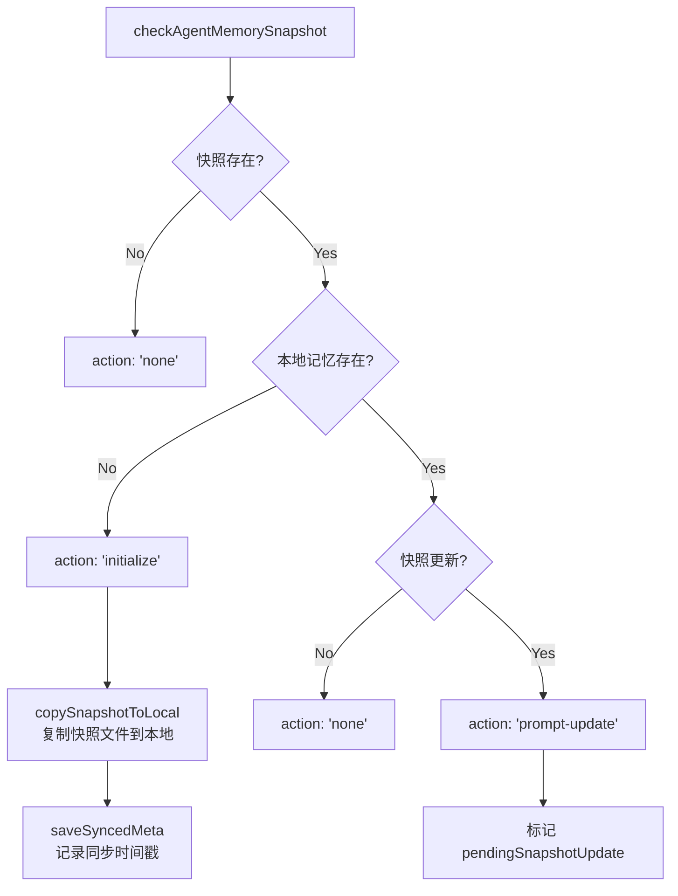

# AgentTool 子模块设计文档

| 项目 | 内容 |
|------|------|
| **模块名称** | AgentTool（子 Agent 管理工具） |
| **文档版本** | v1.0-20260402 |
| **生成日期** | 2026-04-02 |
| **生成方式** | 代码反向工程 |
| **源文件行数** | 约 5,095 行（14 个源文件） |
| **版本来源** | @anthropic-ai/claude-code 2.1.88 |

---

## 1. 模块概述

### 1.1 模块职责

AgentTool 是 Claude Code 的核心工具模块之一，负责子 Agent（子代理）的完整生命周期管理。它允许主 Agent 将复杂任务委派给专门的子 Agent 来执行，实现多 Agent 协作。核心职责包括：

1. **Agent 定义加载与管理**：从内置定义、Markdown 文件、JSON 配置、插件等多种来源加载 Agent 定义
2. **Agent 选择与路由**：根据 `subagent_type` 参数选择合适的 Agent 定义，支持 Fork 子代理路径
3. **同步/异步执行**：支持前台同步执行和后台异步执行两种模式
4. **环境隔离**：通过 Git Worktree 或远程环境（CCR）提供文件系统隔离
5. **Agent 恢复**：支持从持久化转录记录恢复中断的 Agent
6. **终端 UI 渲染**：在终端中展示 Agent 的执行进度、结果和统计信息
7. **持久化记忆**：为 Agent 提供跨会话的持久化记忆能力
8. **安全控制**：通过工具过滤、权限模式、安全分类器等机制保障安全

### 1.2 模块边界

#### 上游调用者

| 调用者 | 调用方式 | 说明 |
|--------|----------|------|
| 主循环（`query.ts`） | 工具调用 | LLM 决定使用 Agent 工具时触发 `call()` |
| Coordinator（`coordinator/`） | 工具调用 | 协调器模式下由 Coordinator 委派 Worker |
| SendMessageTool | `resumeAgentBackground()` | 向已有 Agent 发送后续消息 |
| `/fork` 斜杠命令 | `buildForkedMessages()` | 用户手动 fork 时复用 fork 构建逻辑 |

#### 下游被调用模块

| 模块 | 接口 | 说明 |
|------|------|------|
| `query.ts` | `query()` | 子 Agent 的核心推理循环 |
| `Tool.ts` / `tools.ts` | `assembleToolPool()` | 为子 Agent 组装工具池 |
| `services/mcp/` | `connectToServer()`, `fetchToolsForClient()` | Agent 专属 MCP 服务器管理 |
| `services/AgentSummary/` | `startAgentSummarization()` | 后台 Agent 进度摘要 |
| `tasks/LocalAgentTask/` | `registerAsyncAgent()`, 生命周期管理 | 异步任务注册与状态管理 |
| `tasks/RemoteAgentTask/` | `registerRemoteAgentTask()` | 远程 Agent 任务注册 |
| `utils/sessionStorage.ts` | `recordSidechainTranscript()` | Agent 转录持久化 |
| `utils/forkedAgent.ts` | `createSubagentContext()` | 子 Agent 上下文创建 |
| `utils/worktree.ts` | `createAgentWorktree()` | Git Worktree 隔离 |
| `utils/permissions/` | `filterDeniedAgents()`, `classifyYoloAction()` | 权限过滤与安全分类 |
| `memdir/` | `buildMemoryPrompt()`, `ensureMemoryDirExists()` | 持久化记忆基础设施 |

#### 不属于本模块的职责

- **推理循环（query loop）**：由 `query.ts` 负责，本模块仅调用
- **具体工具执行**：BashTool、FileEditTool 等由各自模块负责
- **Coordinator 编排逻辑**：由 `coordinator/` 模块负责
- **MCP 协议通信**：由 `services/mcp/` 负责，本模块仅做连接管理
- **OAuth 认证**：由 `services/oauth/` 负责

---

## 2. 架构设计

### 2.1 模块架构图



### 2.2 源文件组织



### 2.3 外部依赖表

| 依赖 | 用途 | 引用位置 |
|------|------|----------|
| `zod/v4` | 输入/输出 Schema 验证 | `AgentTool.tsx:6`, `loadAgentsDir.ts:4` |
| `react` / `ink` | 终端 UI 渲染 | `UI.tsx:3`, `AgentTool.tsx:2` |
| `bun:bundle` (`feature`) | Feature Flag 开关 | 多处 |
| `lodash-es/memoize` | Agent 定义加载缓存 | `loadAgentsDir.ts:2` |
| `@anthropic-ai/sdk` | API 类型定义 | `forkSubagent.ts:2`, `UI.tsx:2` |

---

## 3. 数据结构设计

### 3.1 核心数据结构

#### 3.1.1 AgentDefinition（Agent 定义）

```typescript
// loadAgentsDir.ts:106-165
type BaseAgentDefinition = {
  agentType: string           // Agent 类型标识
  whenToUse: string           // 使用场景描述
  tools?: string[]            // 允许使用的工具列表
  disallowedTools?: string[]  // 禁止使用的工具列表
  skills?: string[]           // 预加载的技能
  mcpServers?: AgentMcpServerSpec[]  // 专属 MCP 服务器
  hooks?: HooksSettings       // 会话级 Hook
  color?: AgentColorName      // 显示颜色
  model?: string              // 模型覆盖
  effort?: EffortValue        // 推理努力度
  permissionMode?: PermissionMode  // 权限模式
  maxTurns?: number           // 最大轮次
  background?: boolean        // 是否强制后台运行
  memory?: AgentMemoryScope   // 持久化记忆范围
  isolation?: 'worktree' | 'remote'  // 隔离模式
  omitClaudeMd?: boolean      // 是否省略 CLAUDE.md
}

type BuiltInAgentDefinition = BaseAgentDefinition & {
  source: 'built-in'
  getSystemPrompt: (params) => string
}

type CustomAgentDefinition = BaseAgentDefinition & {
  getSystemPrompt: () => string
  source: SettingSource
}

type PluginAgentDefinition = BaseAgentDefinition & {
  getSystemPrompt: () => string
  source: 'plugin'
  plugin: string
}

type AgentDefinition = BuiltInAgentDefinition | CustomAgentDefinition | PluginAgentDefinition
```

| 字段 | 类型 | 必填 | 说明 |
|------|------|------|------|
| `agentType` | `string` | 是 | Agent 类型名（如 "Explore", "Plan", "general-purpose"） |
| `whenToUse` | `string` | 是 | 描述何时使用此 Agent，展示在提示词中 |
| `source` | `'built-in' \| SettingSource \| 'plugin'` | 是 | 来源，决定优先级和权限 |
| `tools` | `string[]` | 否 | 允许工具白名单，`['*']` 或 `undefined` 表示全部允许 |
| `permissionMode` | `PermissionMode` | 否 | 覆盖权限模式（如 `'acceptEdits'`, `'bubble'`, `'plan'`） |
| `model` | `string` | 否 | 模型覆盖，`'inherit'` 表示继承父 Agent 模型 |
| `isolation` | `'worktree' \| 'remote'` | 否 | 隔离模式 |
| `memory` | `AgentMemoryScope` | 否 | 持久化记忆范围 |

#### 3.1.2 AgentToolResult（Agent 执行结果）

```typescript
// agentToolUtils.ts:227-258
const agentToolResultSchema = z.object({
  agentId: z.string(),
  agentType: z.string().optional(),
  content: z.array(z.object({ type: z.literal('text'), text: z.string() })),
  totalToolUseCount: z.number(),
  totalDurationMs: z.number(),
  totalTokens: z.number(),
  usage: z.object({
    input_tokens: z.number(),
    output_tokens: z.number(),
    cache_creation_input_tokens: z.number().nullable(),
    cache_read_input_tokens: z.number().nullable(),
    server_tool_use: z.object({...}).nullable(),
    service_tier: z.enum(['standard', 'priority', 'batch']).nullable(),
    cache_creation: z.object({...}).nullable(),
  }),
})
```

#### 3.1.3 ResolvedAgentTools（解析后的工具集）

```typescript
// agentToolUtils.ts:62-68
type ResolvedAgentTools = {
  hasWildcard: boolean       // 是否使用通配符（所有工具）
  validTools: string[]       // 验证通过的工具名
  invalidTools: string[]     // 无效的工具名
  resolvedTools: Tools       // 解析后的工具对象数组
  allowedAgentTypes?: string[]  // 允许的子 Agent 类型
}
```

#### 3.1.4 AgentDefinitionsResult（定义加载结果）

```typescript
// loadAgentsDir.ts:186-191
type AgentDefinitionsResult = {
  activeAgents: AgentDefinition[]     // 生效的 Agent（去重后）
  allAgents: AgentDefinition[]        // 所有加载的 Agent
  failedFiles?: Array<{ path: string; error: string }>  // 加载失败的文件
  allowedAgentTypes?: string[]        // 允许的 Agent 类型限制
}
```

#### 3.1.5 FORK_AGENT（Fork Agent 定义）

```typescript
// forkSubagent.ts:60-71
const FORK_AGENT = {
  agentType: 'fork',
  whenToUse: 'Implicit fork — inherits full conversation context...',
  tools: ['*'],
  maxTurns: 200,
  model: 'inherit',
  permissionMode: 'bubble',
  source: 'built-in',
  baseDir: 'built-in',
  getSystemPrompt: () => '',
} satisfies BuiltInAgentDefinition
```

### 3.2 数据关系图



---

## 4. 接口设计

### 4.1 对外接口（Export API）

#### 4.1.1 AgentTool（核心工具定义）

```typescript
// AgentTool.tsx:196 - 通过 buildTool() 构建
export const AgentTool = buildTool({
  name: 'Agent',                    // 工具名
  aliases: ['Task'],                // 向后兼容别名
  maxResultSizeChars: 100_000,      // 结果最大字符数
  inputSchema: inputSchema(),       // Zod 输入 Schema
  outputSchema: outputSchema(),     // Zod 输出 Schema

  // 生成工具描述提示词
  async prompt({ agents, tools, getToolPermissionContext, allowedAgentTypes }): Promise<string>

  // 核心调用方法
  async call(input: AgentToolInput, toolUseContext, canUseTool, assistantMessage, onProgress?):
    Promise<{ data: Output }>
})
```

**输入参数 `AgentToolInput`**（`AgentTool.tsx:82-138`）：

| 参数 | 类型 | 必填 | 说明 |
|------|------|------|------|
| `prompt` | `string` | 是 | Agent 执行的任务指令 |
| `description` | `string` | 是 | 3-5 词任务摘要 |
| `subagent_type` | `string` | 否 | 指定 Agent 类型，省略时走 Fork 或默认 general-purpose |
| `model` | `'sonnet' \| 'opus' \| 'haiku'` | 否 | 模型覆盖 |
| `run_in_background` | `boolean` | 否 | 是否后台运行 |
| `name` | `string` | 否 | Agent 名称，用于 SendMessage 路由 |
| `team_name` | `string` | 否 | 团队名，启用多 Agent 协作 |
| `mode` | `PermissionMode` | 否 | 权限模式 |
| `isolation` | `'worktree' \| 'remote'` | 否 | 隔离模式 |
| `cwd` | `string` | 否 | 工作目录覆盖 |

**返回值 `Output`**（`AgentTool.tsx:141-155`）：

```typescript
// 同步完成
{ status: 'completed', agentId, content, totalToolUseCount, totalDurationMs, totalTokens, usage, prompt }

// 异步启动
{ status: 'async_launched', agentId, description, prompt, outputFile, canReadOutputFile? }
```

#### 4.1.2 runAgent（Agent 执行引擎）

```typescript
// runAgent.ts:248-329
export async function* runAgent({
  agentDefinition,         // Agent 定义
  promptMessages,          // 初始消息
  toolUseContext,          // 父上下文
  canUseTool,              // 权限检查函数
  isAsync,                 // 是否异步
  querySource,             // 查询来源标识
  override?,               // 系统提示/abort/agentId 覆盖
  model?,                  // 模型别名覆盖
  availableTools,          // 预计算的工具池
  forkContextMessages?,    // Fork 时继承的上下文消息
  useExactTools?,          // 是否直接使用 availableTools（Fork 用）
  worktreePath?,           // Worktree 路径
  onCacheSafeParams?,      // 缓存安全参数回调
  contentReplacementState?, // 恢复时的内容替换状态
  ...
}): AsyncGenerator<Message, void>
```

#### 4.1.3 resumeAgentBackground（Agent 恢复）

```typescript
// resumeAgent.ts:42-265
export async function resumeAgentBackground({
  agentId,         // 要恢复的 Agent ID
  prompt,          // 新的用户消息
  toolUseContext,  // 当前上下文
  canUseTool,      // 权限检查
  invokingRequestId?,  // 触发请求 ID
}): Promise<ResumeAgentResult>
// 返回 { agentId, description, outputFile }
```

#### 4.1.4 Agent 定义加载

```typescript
// loadAgentsDir.ts:296-393
export const getAgentDefinitionsWithOverrides = memoize(
  async (cwd: string): Promise<AgentDefinitionsResult>
)

// loadAgentsDir.ts:395-398
export function clearAgentDefinitionsCache(): void

// loadAgentsDir.ts:445-516
export function parseAgentFromJson(name, definition, source?): CustomAgentDefinition | null

// loadAgentsDir.ts:541-755
export function parseAgentFromMarkdown(filePath, baseDir, frontmatter, content, source): CustomAgentDefinition | null
```

#### 4.1.5 工具过滤与解析

```typescript
// agentToolUtils.ts:70-116
export function filterToolsForAgent({ tools, isBuiltIn, isAsync?, permissionMode? }): Tools

// agentToolUtils.ts:122-225
export function resolveAgentTools(agentDefinition, availableTools, isAsync?, isMainThread?): ResolvedAgentTools
```

#### 4.1.6 Fork 子代理

```typescript
// forkSubagent.ts:32-39
export function isForkSubagentEnabled(): boolean

// forkSubagent.ts:78-89
export function isInForkChild(messages: MessageType[]): boolean

// forkSubagent.ts:107-169
export function buildForkedMessages(directive: string, assistantMessage: AssistantMessage): MessageType[]

// forkSubagent.ts:171-198
export function buildChildMessage(directive: string): string

// forkSubagent.ts:205-210
export function buildWorktreeNotice(parentCwd: string, worktreeCwd: string): string
```

### 4.2 Interface 定义与实现

AgentTool 实现了 `Tool` 接口（定义在 `Tool.ts`），通过 `buildTool()` 工厂函数构建。其关键方法映射：

| Tool 接口方法 | AgentTool 实现位置 | 功能 |
|---|---|---|
| `prompt()` | `AgentTool.tsx:197-225` | 生成工具描述（包含可用 Agent 列表） |
| `description()` | `AgentTool.tsx:229-231` | 返回 "Launch a new agent" |
| `call()` | `AgentTool.tsx:239-1386` | 主执行逻辑，约 1150 行 |
| UI 渲染方法组 | `UI.tsx` 全文件 | `renderToolUseMessage`, `renderToolResultMessage` 等 |

---

## 5. 核心流程设计

### 5.1 同步 Agent 执行流程



### 5.2 异步 Agent 执行流程



### 5.3 Fork 子代理执行流程

```mermaid
flowchart TD
    A[call() - subagent_type 省略] --> B{isForkSubagentEnabled?}
    B -->|No| C[默认使用 general-purpose]
    B -->|Yes| D{isInForkChild?}
    D -->|Yes| E[抛出错误: 禁止递归 fork]
    D -->|No| F[选择 FORK_AGENT 定义]
    
    F --> G[获取父 System Prompt]
    G --> G1{renderedSystemPrompt<br>可用?}
    G1 -->|Yes| G2[直接使用]
    G1 -->|No| G3[重新计算<br>buildEffectiveSystemPrompt]
    
    G2 --> H[buildForkedMessages<br>构建 fork 消息]
    G3 --> H
    
    H --> H1[克隆父 assistant 消息<br>保留所有 tool_use 块]
    H1 --> H2[为每个 tool_use 生成<br>相同占位 tool_result]
    H2 --> H3[追加 per-child 指令<br>包含 FORK_BOILERPLATE_TAG]
    
    H3 --> I{effectiveIsolation<br>== 'worktree'?}
    I -->|Yes| J[createAgentWorktree<br>+ buildWorktreeNotice]
    I -->|No| K[直接执行]
    J --> K
    
    K --> L[runAgent 使用:<br>- 父的 system prompt<br>- 父的 exact tools<br>- useExactTools: true<br>- model: inherit]
    
    L --> M[强制异步执行<br>forceAsync = true]
    
    style F fill:#e1f5fe
    style H fill:#fff3e0
    style L fill:#e8f5e9
```

### 5.4 Agent 定义加载流程



### 5.5 Agent 恢复流程



---

## 6. 状态管理

### 6.1 状态定义

AgentTool 涉及两层状态：

1. **全局应用状态（AppState）**：通过 `toolUseContext.getAppState()` / `setAppState()` 读写
   - `tasks: Record<string, AgentTask>` — 异步任务注册表
   - `agentNameRegistry: Map<string, AgentId>` — 名称到 ID 的映射
   - `agentColorMap: Map<string, AgentColorName>` — Agent 颜色映射
   - `toolPermissionContext` — 权限上下文

2. **Agent 本地状态**：在 `call()` 和 `runAgent()` 中通过局部变量管理
   - `agentMessages: MessageType[]` — 累积的消息
   - `syncTracker: ProgressTracker` — 进度追踪器
   - `foregroundTaskId` — 前台任务 ID
   - `wasBackgrounded: boolean` — 是否已转为后台
   - `worktreeInfo` — Worktree 隔离信息

### 6.2 状态转换图



### 6.3 状态转换条件表

| 当前状态 | 目标状态 | 触发条件 | 处理逻辑 |
|----------|----------|----------|----------|
| Initializing | AgentSelected | `subagent_type` 解析成功 | 查找 `activeAgents`，Fork 路径选择 `FORK_AGENT` |
| SyncRunning | Backgrounded | `backgroundSignal` 触发 | 用户按 Esc 或 `autoBackgroundMs` 到期 |
| SyncRunning | SyncCompleted | `agentIterator.next()` 返回 `done: true` | `finalizeAgentTool()` 汇总结果 |
| SyncRunning | SyncAborted | `abortController.signal.aborted` | 记录 `wasAborted = true` |
| AsyncRunning | AsyncCompleted | `makeStream` 迭代完成 | `completeAsyncAgent()` + `enqueueAgentNotification()` |
| AsyncRunning | AsyncKilled | `AbortError` 被捕获 | `killAsyncAgent()` + 提取部分结果 |
| AsyncRunning | AsyncFailed | 非 `AbortError` 异常 | `failAsyncAgent()` + 错误通知 |

---

## 7. 错误处理设计

### 7.1 错误类型表

| 错误类型 | 触发场景 | 处理方式 | 位置 |
|----------|----------|----------|------|
| Agent 未找到 | `subagent_type` 不存在于 activeAgents | 抛出 `Error`，列出可用 Agent | `AgentTool.tsx:347-354` |
| Agent 被权限拒绝 | 权限规则 deny 了指定 Agent | 抛出 `Error`，说明拒绝来源 | `AgentTool.tsx:349-351` |
| 递归 Fork 检测 | Fork 子 Agent 内再次尝试 Fork | 抛出 `Error`："Fork is not available inside a forked worker" | `AgentTool.tsx:332-334` |
| 团队嵌套限制 | Teammate 尝试 spawn Teammate | 抛出 `Error` | `AgentTool.tsx:273-274` |
| MCP 服务器不可用 | 必需的 MCP 服务器未连接/未认证 | 抛出 `Error`，列出缺失服务器 | `AgentTool.tsx:406-409` |
| 无 transcript | 恢复 Agent 时找不到转录记录 | 抛出 `Error` | `resumeAgent.ts:68-69` |
| AbortError | 用户取消或任务被 Kill | 异步：`killAsyncAgent()` + 通知；同步：记录中止 | `agentToolUtils.ts:645-669` |
| System Prompt 构建失败 | Agent 定义的 `getSystemPrompt` 抛异常 | 回退到 `DEFAULT_AGENT_PROMPT` | `runAgent.ts:912-931` |
| Agent 定义解析失败 | Markdown/JSON 格式错误 | 记录日志，跳过该定义，返回内置 Agents | `loadAgentsDir.ts:379-392` |

### 7.2 错误处理策略

1. **优雅降级**：Agent 定义加载失败时仍返回内置 Agent（`loadAgentsDir.ts:385-391`）
2. **资源清理保障**：`runAgent()` 使用 `finally` 块确保 MCP 连接、Session Hooks、Perfetto 跟踪、文件状态缓存等资源被释放（`runAgent.ts:816-858`）
3. **部分结果保留**：异步 Agent 被 Kill 时通过 `extractPartialResult()` 提取已完成的工作（`agentToolUtils.ts:488-500`）
4. **状态优先转换**：异步 Agent 完成/失败时先转换任务状态，再执行可能挂起的操作（如 Worktree 清理），防止阻塞 UI（`agentToolUtils.ts:599-603`，注释引用 `gh-20236`）

### 7.3 错误传播链



---

## 8. 工具过滤与权限机制

### 8.1 工具过滤层次

子 Agent 可用的工具经过多层过滤（`agentToolUtils.ts:70-225`）：

```mermaid
flowchart TD
    A[父 Agent 全部工具] --> B[filterToolsForAgent<br>agentToolUtils.ts:70-116]
    
    B --> B1{MCP 工具?<br>mcp__ 前缀}
    B1 -->|Yes| B2[始终允许]
    B1 -->|No| B3{在 ALL_AGENT_DISALLOWED_TOOLS?}
    B3 -->|Yes| B4[排除]
    B3 -->|No| B5{非内置 && 在<br>CUSTOM_AGENT_DISALLOWED_TOOLS?}
    B5 -->|Yes| B6[排除]
    B5 -->|No| B7{异步 && 不在<br>ASYNC_AGENT_ALLOWED_TOOLS?}
    B7 -->|Yes| B8[排除<br>除非 in-process teammate]
    B7 -->|No| B9[保留]
    
    B9 --> C[resolveAgentTools<br>agentToolUtils.ts:122-225]
    C --> C1{disallowedTools<br>定义了?}
    C1 -->|Yes| C2[排除 disallowedTools]
    C1 -->|No| C3[保持]
    
    C2 --> D{tools == undefined<br>或 ['*']?}
    C3 --> D
    D -->|Yes| E[返回全部允许工具]
    D -->|No| F[逐一匹配 tools 列表<br>记录 validTools/invalidTools]
    F --> G[返回 ResolvedAgentTools]
```

### 8.2 权限模式覆盖

```typescript
// runAgent.ts:415-498 — agentGetAppState 闭包
// 权限模式优先级：
// 1. bypassPermissions / acceptEdits / auto — 父级模式优先
// 2. agentDefinition.permissionMode — Agent 定义覆盖
// 3. 异步 Agent 默认 shouldAvoidPermissionPrompts = true
// 4. bubble 模式下 canShowPermissionPrompts = true
```

---

## 9. 记忆系统设计

### 9.1 记忆范围

```typescript
// agentMemory.ts:12
type AgentMemoryScope = 'user' | 'project' | 'local'
```

| 范围 | 存储路径 | 说明 |
|------|----------|------|
| `user` | `~/.claude/agent-memory/<agentType>/` | 用户级，跨项目共享 |
| `project` | `<cwd>/.claude/agent-memory/<agentType>/` | 项目级，通过 VCS 共享 |
| `local` | `<cwd>/.claude/agent-memory-local/<agentType>/` | 本地级，不入版本控制 |

### 9.2 记忆快照同步



---

## 10. 设计评估

### 10.1 优点

1. **高度可扩展的 Agent 定义体系**：支持内置、Markdown、JSON、插件四种来源，通过优先级覆盖机制（`getActiveAgentsFromList`）实现灵活的自定义能力
2. **同步/异步无缝切换**：前台 Agent 可在运行中通过用户交互或超时自动转为后台，且通过 `registerAgentForeground` / `backgroundSignal` 实现了平滑过渡
3. **Fork 子代理的缓存优化**：通过 `useExactTools`、继承父 System Prompt、byte-identical tool_result 占位符等设计，最大化 Prompt Cache 命中率
4. **资源生命周期管理完善**：`runAgent()` 的 `finally` 块覆盖了 MCP 连接、Session Hooks、Perfetto、文件状态缓存、Todos、Shell 任务等全面的清理
5. **安全分层防护**：工具过滤 → 权限模式覆盖 → Transcript Classifier 三层安全机制

### 10.2 缺点与风险

1. **`call()` 方法过于庞大**：`AgentTool.tsx` 的 `call()` 方法约 1150 行，包含同步/异步/Fork/Teammate/Remote 五条执行路径，认知负担重，维护风险高
2. **Feature Flag 耦合严重**：`FORK_SUBAGENT`、`COORDINATOR_MODE`、`KAIROS`、`TRANSCRIPT_CLASSIFIER`、`AGENT_MEMORY_SNAPSHOT` 等多个 Feature Flag 交叉影响控制流，组合测试困难
3. **循环依赖风险**：`AgentTool.tsx` 与 `tools.ts`、`coordinator/` 之间存在潜在循环依赖，通过 `require()` 延迟加载和接口分离缓解但未根除
4. **同步转异步的复杂性**：`wasBackgrounded` 路径需要关闭前台迭代器（`agentIterator.return()`）并重新启动 `runAgent()`，存在消息丢失的边缘情况
5. **内存泄漏防御性代码多**：`runAgent.ts:835-858` 的 `finally` 块清理了 9 种资源，说明资源管理分散，缺乏统一的 Agent 生命周期管理器

### 10.3 改进建议

1. **拆分 `call()` 方法**：将同步执行、异步执行、Fork、Teammate Spawn、Remote Launch 提取为独立函数，`call()` 仅作路由器
2. **统一 Agent 生命周期管理器**：引入 `AgentLifecycle` 类封装资源注册与清理，替代分散的 `finally` 逻辑
3. **减少 Feature Flag 嵌套**：将 Feature Flag 组合抽象为策略对象（如 `ExecutionStrategy`），降低分支复杂度
4. **增强 Fork 递归保护**：当前依赖 `querySource` + `isInForkChild` 消息扫描双重检测，建议在 `ToolUseContext` 中增加 `forkDepth` 字段作为主检测手段
5. **Agent 定义热更新**：当前 `getAgentDefinitionsWithOverrides` 使用 `memoize` 缓存，仅通过 `clearAgentDefinitionsCache()` 手动清除，建议增加文件监听或 TTL 机制
