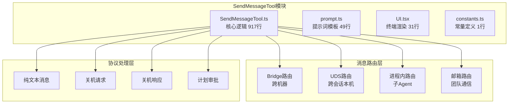
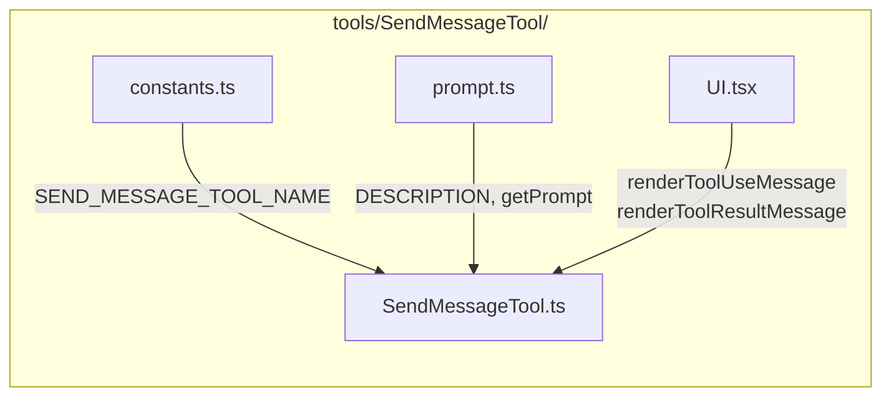
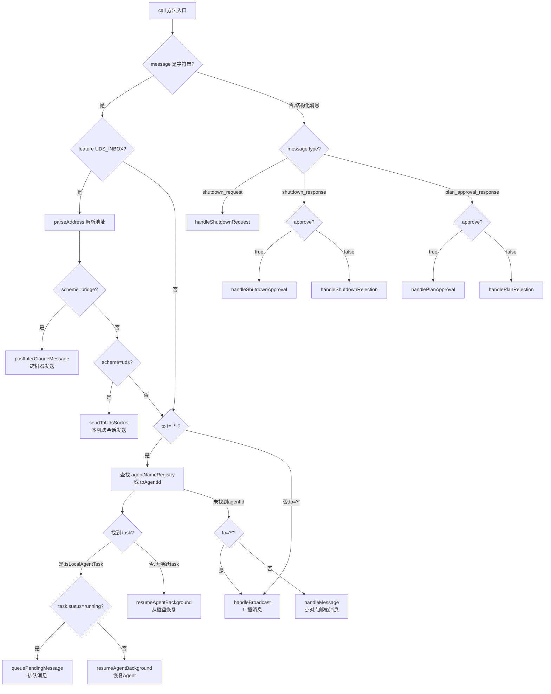
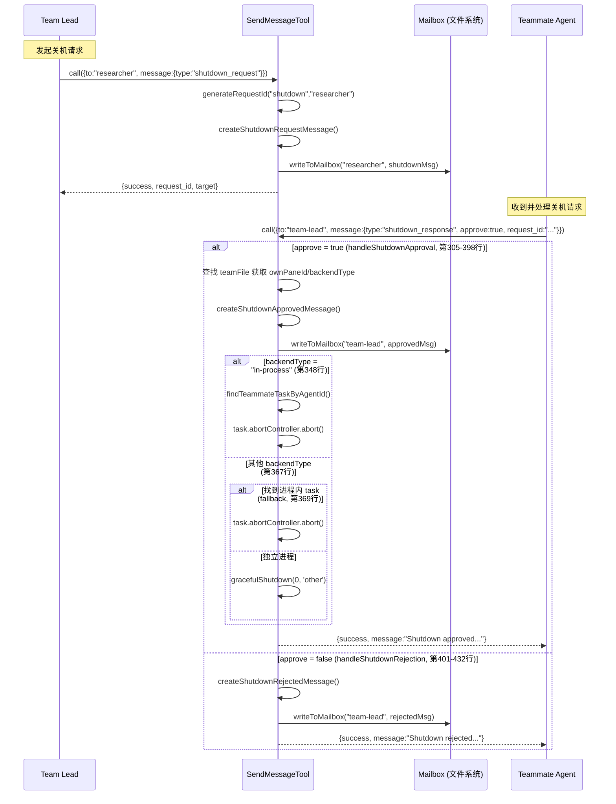
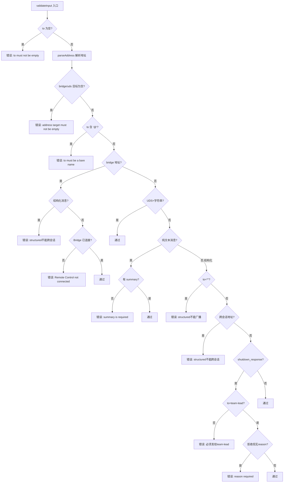
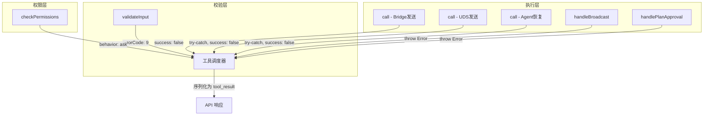

# SendMessageTool 子模块设计文档

## 1. 文档信息

| 属性 | 值 |
|---|---|
| 模块名称 | SendMessageTool |
| 文档版本 | v1.0-20260402 |
| 生成日期 | 2026-04-02 |
| 生成方式 | 代码反向工程 |
| 源文件行数 | 917 行（主文件）+ 49 行（prompt.ts）+ 31 行（UI.tsx）+ 1 行（constants.ts） |
| 版本来源 | @anthropic-ai/claude-code v2.1.88 |

## 2. 模块概述

### 2.1 模块职责

SendMessageTool 是 Claude Code 多 Agent 协作（Swarm）体系中的**消息通信工具**，负责在团队成员（Agent）之间传递消息。它支持以下核心能力：

1. **点对点消息**：向指定队友（teammate）发送纯文本消息
2. **广播消息**：向团队所有成员广播消息（`to: "*"`）
3. **结构化协议消息**：处理关机请求/响应（shutdown_request/response）和计划审批（plan_approval_response）
4. **跨会话消息**：通过 UDS（Unix Domain Socket）和 Bridge（Remote Control）向其他 Claude 实例发送消息
5. **进程内子Agent通信**：向同进程内的子 Agent 任务队列投递消息，支持自动恢复已停止的 Agent

### 2.2 模块边界

**上游调用者：**

| 调用者 | 说明 |
|---|---|
| 工具调度系统（Tool Runner） | Claude 模型决定调用 `SendMessage` 工具时，由工具调度系统实例化并执行 |
| AgentTool | 子 Agent 在执行过程中可调用 SendMessage 与其他 Agent 通信 |

**下游被调用模块：**

| 模块 | 文件路径 | 用途 |
|---|---|---|
| `teammateMailbox` | `utils/teammateMailbox.ts` | 写入邮箱（文件系统消息队列） |
| `teamHelpers` | `utils/swarm/teamHelpers.ts` | 读取团队配置文件 |
| `teammate` | `utils/teammate.ts` | 获取当前 Agent 身份信息 |
| `peerAddress` | `utils/peerAddress.ts` | 解析收件人地址格式 |
| `peerSessions` | `bridge/peerSessions.ts` | Bridge 跨机器消息投递 |
| `udsClient` | `utils/udsClient.ts` | UDS 本地跨会话消息投递 |
| `resumeAgent` | `tools/AgentTool/resumeAgent.ts` | 恢复已停止的 Agent |
| `InProcessTeammateTask` | `tasks/InProcessTeammateTask/` | 查找进程内队友任务 |
| `LocalAgentTask` | `tasks/LocalAgentTask/` | 判断任务类型、排队消息 |
| `gracefulShutdown` | `utils/gracefulShutdown.ts` | 关机流程 |
| `replBridgeHandle` | `bootstrap/state.ts` / `bridge/replBridgeHandle.ts` | Bridge 连接状态检测 |

### 2.3 不属于本模块的职责

- **消息接收与消费**：本模块只负责发送，邮箱轮询和消息消费由其他模块完成
- **Agent 创建与生命周期管理**：由 AgentTool / Teammate 系统管理
- **团队创建与成员注册**：由 Swarm 系统管理
- **权限策略决策**：本模块仅声明权限需求，实际决策由 permissions 系统执行

## 3. 架构设计

### 3.1 模块架构图



### 3.2 源文件组织



### 3.3 外部依赖表

| 依赖 | 来源 | 用途 |
|---|---|---|
| `zod/v4` | npm 包 | 输入参数 schema 校验 |
| `bun:bundle` | Bun 运行时 | 特性开关（`feature('UDS_INBOX')`） |
| `../../Tool.js` | 内部模块 | `Tool` 接口、`buildTool` 工具构造函数 |
| `../../utils/lazySchema.js` | 内部模块 | 惰性 schema 初始化 |
| `../../utils/swarm/constants.js` | 内部模块 | `TEAM_LEAD_NAME` 常量 |
| `../../utils/agentId.js` | 内部模块 | 请求 ID 生成 |
| `../../utils/errors.js` | 内部模块 | 错误信息提取 |
| `../../utils/format.js` | 内部模块 | 文本截断 |
| `../../utils/slowOperations.js` | 内部模块 | JSON 序列化/反序列化 |
| `../../utils/semanticBoolean.js` | 内部模块 | 语义布尔值解析（true/false/yes/no） |
| `../../types/ids.js` | 内部模块 | `toAgentId` ID 转换 |

## 4. 数据结构设计

### 4.1 核心数据结构

#### 4.1.1 输入 Schema（`inputSchema`，第 67-87 行）

```typescript
z.object({
  to: z.string(),        // 收件人：队友名称 | "*" 广播 | "uds:..." | "bridge:..."
  summary: z.string().optional(),  // 5-10 字摘要，纯文本消息必填
  message: z.union([
    z.string(),          // 纯文本消息
    StructuredMessage(), // 结构化协议消息
  ]),
})
```

#### 4.1.2 结构化消息（`StructuredMessage`，第 46-65 行）

```typescript
z.discriminatedUnion('type', [
  z.object({ type: z.literal('shutdown_request'), reason: z.string().optional() }),
  z.object({ type: z.literal('shutdown_response'), request_id: z.string(), approve: semanticBoolean(), reason: z.string().optional() }),
  z.object({ type: z.literal('plan_approval_response'), request_id: z.string(), approve: semanticBoolean(), feedback: z.string().optional() }),
])
```

| 消息类型 | 字段 | 说明 |
|---|---|---|
| `shutdown_request` | `reason?` | Team Lead 请求队友关机 |
| `shutdown_response` | `request_id`, `approve`, `reason?` | 队友响应关机请求 |
| `plan_approval_response` | `request_id`, `approve`, `feedback?` | Team Lead 审批队友计划 |

#### 4.1.3 输出类型（第 92-131 行）

```typescript
// 消息路由信息
type MessageRouting = {
  sender: string; senderColor?: string;
  target: string; targetColor?: string;
  summary?: string; content?: string;
}

// 四种输出变体
type MessageOutput = { success: boolean; message: string; routing?: MessageRouting }
type BroadcastOutput = { success: boolean; message: string; recipients: string[]; routing?: MessageRouting }
type RequestOutput = { success: boolean; message: string; request_id: string; target: string }
type ResponseOutput = { success: boolean; message: string; request_id?: string }

type SendMessageToolOutput = MessageOutput | BroadcastOutput | RequestOutput | ResponseOutput
```

| 输出类型 | 使用场景 | 关键字段 |
|---|---|---|
| `MessageOutput` | 点对点消息、跨会话消息 | `routing` 含发送者/接收者渲染信息 |
| `BroadcastOutput` | 广播消息 | `recipients` 列表 |
| `RequestOutput` | 关机请求 | `request_id`、`target` |
| `ResponseOutput` | 关机响应、计划审批响应 | `request_id` |

### 4.2 数据关系图

```mermaid
erDiagram
    Input ||--|| To : "收件人"
    Input ||--o| Summary : "摘要"
    Input ||--|| Message : "消息体"

    Message ||--o| StringMessage : "纯文本"
    Message ||--o| StructuredMessage : "结构化"

    StructuredMessage ||--o| ShutdownRequest : "type=shutdown_request"
    StructuredMessage ||--o| ShutdownResponse : "type=shutdown_response"
    StructuredMessage ||--o| PlanApprovalResponse : "type=plan_approval_response"

    SendMessageToolOutput ||--o| MessageOutput : "点对点"
    SendMessageToolOutput ||--o| BroadcastOutput : "广播"
    SendMessageToolOutput ||--o| RequestOutput : "请求"
    SendMessageToolOutput ||--o| ResponseOutput : "响应"

    MessageOutput ||--o| MessageRouting : "路由信息"
    BroadcastOutput ||--o| MessageRouting : "路由信息"
```

## 5. 接口设计

### 5.1 对外接口（Export API）

#### 5.1.1 `SendMessageTool`（第 520 行）

```typescript
export const SendMessageTool: Tool<InputSchema, SendMessageToolOutput>
```

通过 `buildTool()` 构造的工具对象，是本模块的唯一主导出。

#### 5.1.2 导出类型

| 导出名 | 类型 | 行号 | 说明 |
|---|---|---|---|
| `Input` | type alias | 90 | 输入参数类型 |
| `MessageRouting` | type | 92-99 | 消息路由渲染信息 |
| `MessageOutput` | type | 101-105 | 点对点消息输出 |
| `BroadcastOutput` | type | 107-112 | 广播消息输出 |
| `RequestOutput` | type | 114-119 | 请求类输出 |
| `ResponseOutput` | type | 121-125 | 响应类输出 |
| `SendMessageToolOutput` | type | 127-131 | 所有输出的联合类型 |

### 5.2 Tool 接口实现

`SendMessageTool` 通过 `buildTool()` 实现了 `ToolDef<InputSchema, SendMessageToolOutput>` 接口，以下为各接口方法：

| 方法 | 行号 | 说明 |
|---|---|---|
| `name` | 522 | 返回 `'SendMessage'` |
| `searchHint` | 523 | `'send messages to agent teammates (swarm protocol)'` |
| `maxResultSizeChars` | 524 | 100,000 字符 |
| `userFacingName()` | 526-528 | 返回 `'SendMessage'` |
| `inputSchema` | 530-532 | 惰性加载的 Zod schema |
| `shouldDefer` | 533 | `true` — 延迟加载 |
| `isEnabled()` | 535-537 | 仅在 Agent Swarms 特性启用时可用 |
| `isReadOnly(input)` | 539-541 | 纯文本消息视为只读操作 |
| `backfillObservableInput(input)` | 543-569 | 将输入转换为可观测的扁平结构 |
| `toAutoClassifierInput(input)` | 571-583 | 生成权限自动分类器的输入文本 |
| `checkPermissions(input)` | 585-601 | Bridge 消息需用户确认，其余允许 |
| `validateInput(input)` | 604-718 | 多层输入校验 |
| `description()` | 720-722 | 返回 `'Send a message to another agent'` |
| `prompt()` | 724-726 | 返回使用说明提示词 |
| `mapToolResultToToolResultBlockParam()` | 728-739 | 将结果序列化为 API 响应格式 |
| `call(input, context, ...)` | 741-912 | **核心执行方法** |
| `renderToolUseMessage` | 915 | UI 渲染（来自 UI.tsx） |
| `renderToolResultMessage` | 916 | UI 渲染（来自 UI.tsx） |

## 6. 核心流程设计

### 6.1 消息路由总流程（`call` 方法，第 741-912 行）



### 6.2 关机协议流程



### 6.3 进程内子Agent消息投递流程

```mermaid
sequenceDiagram
    participant Caller as 调用者 Agent
    participant SMT as SendMessageTool.call()
    participant Registry as agentNameRegistry
    participant Tasks as AppState.tasks
    participant Queue as queuePendingMessage
    participant Resume as resumeAgentBackground

    Caller->>SMT: call({to:"sub-agent-1", message:"请执行任务X"})
    SMT->>Registry: agentNameRegistry.get("sub-agent-1")
    Registry-->>SMT: agentId (或 null)

    alt 未注册名称
        SMT->>SMT: toAgentId("sub-agent-1") 尝试格式匹配
    end

    SMT->>Tasks: tasks[agentId]

    alt task 存在且 isLocalAgentTask
        alt task.status = "running" (第809行)
            SMT->>Queue: queuePendingMessage(agentId, message, setAppState)
            SMT-->>Caller: "Message queued for delivery..."
        else task.status != "running" (已停止, 第823行)
            SMT->>Resume: resumeAgentBackground({agentId, prompt: message})
            Resume-->>SMT: {outputFile}
            SMT-->>Caller: "Agent was stopped; resumed it..."
        end
    else task 不存在或已清理 (第847行)
        SMT->>Resume: resumeAgentBackground({agentId, prompt: message})
        alt 恢复成功
            SMT-->>Caller: "Resumed from transcript..."
        else 恢复失败
            SMT-->>Caller: "No transcript to resume..."
        end
    end
```

### 6.4 输入校验流程（`validateInput`，第 604-718 行）



## 7. 状态管理

SendMessageTool 本身不维护内部状态，但依赖以下外部状态：

| 状态来源 | 访问方式 | 用途 |
|---|---|---|
| `AppState.teamContext` | `context.getAppState()` | 团队名称、队友列表与颜色信息 |
| `AppState.tasks` | `context.getAppState().tasks` | 进程内 Agent 任务状态查询 |
| `AppState.agentNameRegistry` | `context.getAppState().agentNameRegistry` | Agent 名称到 ID 的映射 |
| `AppState.toolPermissionContext.mode` | `context.getAppState()` | 权限模式继承（plan_approval） |
| 环境变量 `CLAUDE_CODE_TEAM_NAME` | `getTeamName()` | 团队名称 |
| 环境变量 `CLAUDE_CODE_AGENT_NAME` | `getAgentName()` | 当前 Agent 名称 |
| 文件系统 Team File | `readTeamFileAsync()` | 团队成员列表（含 agentId、tmuxPaneId、backendType） |
| 文件系统 Mailbox | `writeToMailbox()` | 消息持久化队列 |
| Bridge 连接状态 | `getReplBridgeHandle()` / `isReplBridgeActive()` | Remote Control 连接可用性 |
| Feature Flag | `feature('UDS_INBOX')` | UDS/Bridge 跨会话消息特性开关 |

## 8. 错误处理设计

### 8.1 错误类型表

| 错误类型 | 触发条件 | 行号 | 处理方式 |
|---|---|---|---|
| 输入校验错误 | `to` 为空、含 `@`、地址目标为空 | 605-629 | 返回 `{result: false, errorCode: 9}` |
| Bridge 未连接 | `getReplBridgeHandle()` 为空或 `isReplBridgeActive()` 为 false | 647-654 | 校验阶段：返回验证失败；执行阶段：返回 `{success: false}` |
| 结构化消息约束 | 结构化消息发到广播或跨会话地址 | 635-692 | 返回校验失败 |
| 关机响应约束 | `shutdown_response` 未发给 team-lead 或拒绝缺 reason | 694-715 | 返回校验失败 |
| 非团队上下文 | `teamName` 为空（广播时） | 200-203 | 抛出 Error |
| 团队不存在 | `readTeamFileAsync` 返回 null | 207-208 | 抛出 Error |
| 权限不足 | 非 team-lead 试图审批计划 | 442-445, 489-492 | 抛出 Error |
| Agent 恢复失败 | `resumeAgentBackground` 抛出异常 | 837-844, 864-871 | 捕获，返回 `{success: false}` |
| UDS 发送失败 | `sendToUdsSocket` 抛出异常 | 789-796 | 捕获，返回 `{success: false}` |
| Bridge 发送失败 | `postInterClaudeMessage` 返回 `{ok: false}` | 768-772 | 返回 `{success: false}` |

### 8.2 错误处理策略

1. **校验层拦截**（`validateInput`）：在执行前拦截所有可预见的输入错误，使用统一的 `errorCode: 9` 返回
2. **防御性重检**（`call` 方法第 749 行）：Bridge 消息在 `checkPermissions` 等待用户确认期间连接可能断开，因此在 `call` 执行时再次检查连接状态
3. **异常捕获降级**：UDS/Agent 恢复等操作用 try-catch 包裹，失败时返回 `{success: false}` 而非抛出异常
4. **协议约束前置**：结构化消息的约束（如不能广播、不能跨会话）在校验阶段即拒绝，避免部分执行

### 8.3 错误传播链



## 9. 设计评估

### 9.1 优点

1. **多层路由架构**：`call` 方法通过地址解析（bridge/uds/进程内/邮箱）实现了统一入口、多后端路由的模式，扩展新传输后端只需增加路由分支
2. **严格的输入校验**：`validateInput` 覆盖了 13+ 种错误场景，包括地址格式、消息类型约束、协议约束等，在执行前彻底拦截无效输入
3. **防御性编程**：Bridge 连接状态在权限检查和执行阶段双重校验（第 647 行 + 第 749 行），处理了异步等待期间状态变化的竞态条件
4. **优雅的 Agent 生命周期处理**：对已停止的 Agent 自动恢复（第 823-872 行），对无活跃任务的 Agent 从磁盘转录恢复，提供了良好的容错体验
5. **延迟加载**：`shouldDefer: true` 和 `lazySchema` 确保仅在实际使用 Swarm 功能时才加载模块，减少启动开销；Bridge/UDS 相关模块通过 `require()` 动态加载（第 758-759 行、第 777-778 行）
6. **可观测性设计**：`backfillObservableInput` 将复杂的嵌套输入扁平化为易于展示的结构，配合 `toAutoClassifierInput` 为权限自动分类提供简洁文本

### 9.2 缺点与风险

1. **`call` 方法过长**：核心 `call` 方法跨越第 741-912 行，约 170 行，承担了路由判断、多种传输后端调用、Agent 生命周期管理等多重职责，可读性和可维护性较差
2. **进程内路由与邮箱路由的 fallthrough 逻辑复杂**：当 `agentNameRegistry` 查找到 agentId 但对应 task 不存在时（第 847 行），会尝试从磁盘恢复而非回退到邮箱路由，这意味着如果 Agent 既在 registry 中注册又是团队邮箱成员，邮箱路由将永远不会被触发
3. **`require()` 动态导入**：Bridge 和 UDS 模块通过 `require()` 动态导入（第 758、777 行），绕过了 TypeScript 的静态分析，增加了运行时错误风险
4. **关机审批流程的副作用**：`handleShutdownApproval` 在发送邮箱消息后直接调用 `abort()` 或 `gracefulShutdown()`（第 358、388 行），将进程终止逻辑嵌入消息发送工具中，职责边界模糊
5. **`setImmediate` 异步关机**：第 387 行使用 `setImmediate` 延迟关机，结果已经返回给调用者但进程实际还未退出，存在时序不确定性

### 9.3 改进建议

1. **拆分 `call` 方法**：将 Bridge 路由、UDS 路由、进程内路由、邮箱路由分别提取为独立函数（如 `handleBridgeMessage`、`handleUdsMessage`、`handleInProcessMessage`），`call` 方法仅负责路由分发
2. **抽象传输层**：引入 `MessageTransport` 接口，将 Bridge、UDS、邮箱、进程内队列统一抽象，`call` 方法通过 transport resolver 分发，提高可扩展性
3. **分离关机副作用**：将 `handleShutdownApproval` 中的 `abort()`/`gracefulShutdown()` 逻辑移至独立的关机管理模块，SendMessageTool 只负责发送确认消息并触发关机事件
4. **使用动态 `import()` 替代 `require()`**：将 Bridge/UDS 模块的动态加载改为 `await import(...)` 语法，获得更好的 TypeScript 类型支持和 tree-shaking 能力
5. **增加消息投递确认机制**：当前邮箱写入是 fire-and-forget 模式，可考虑增加消息 ID 和确认回执，支持可靠投递
