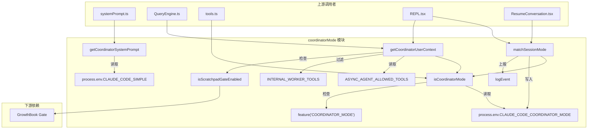
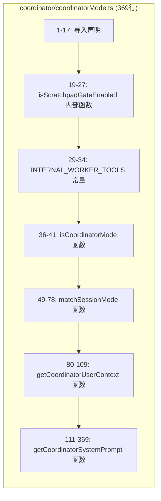
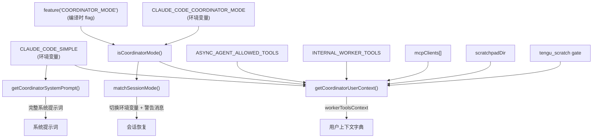
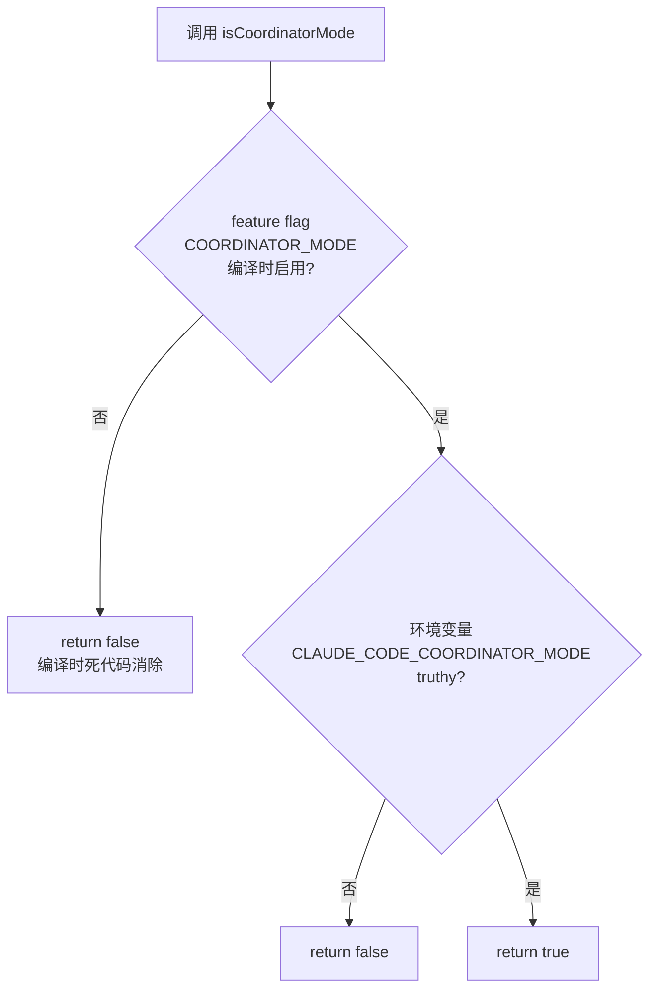
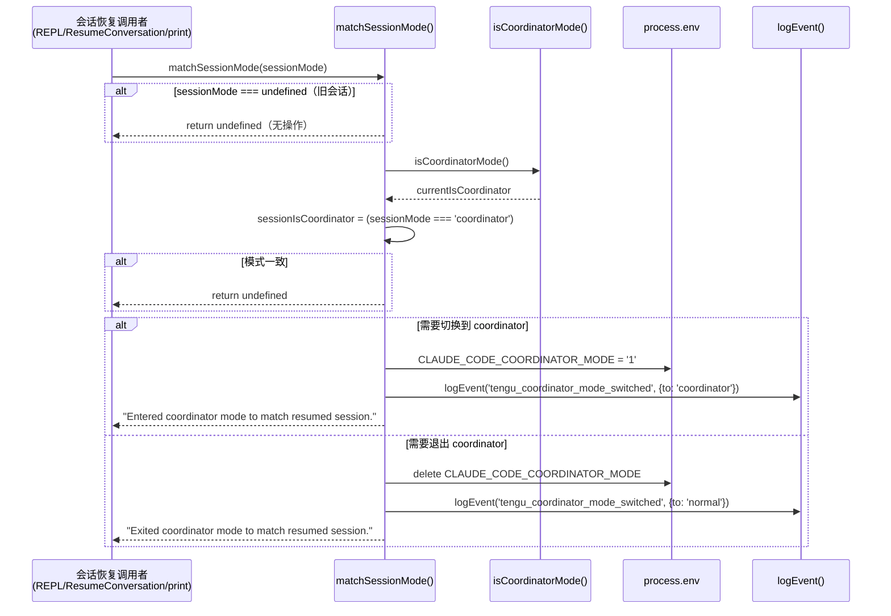
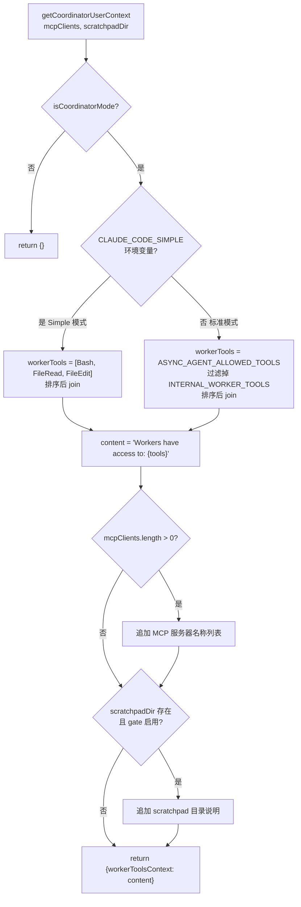
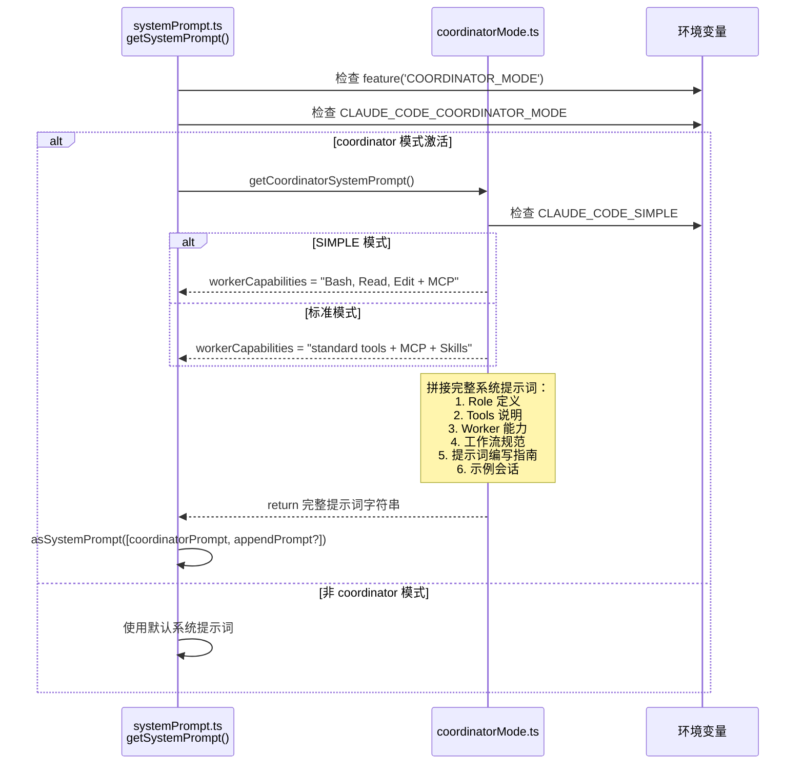
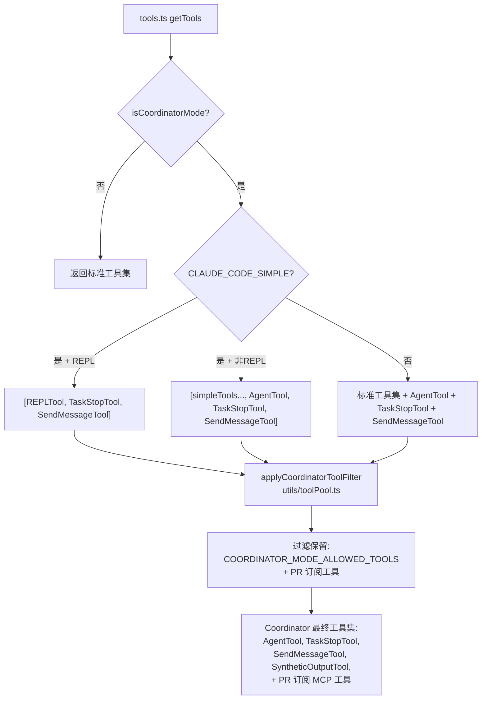
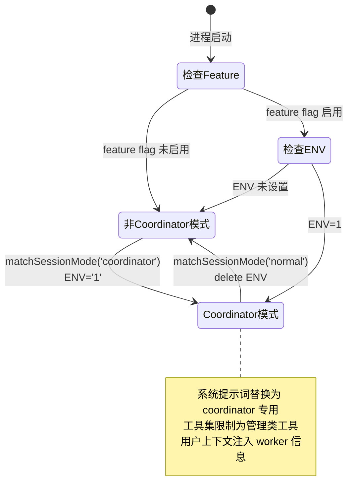

# coordinatorMode 子模块设计文档

## 1. 文档信息

| 字段 | 值 |
|------|------|
| 模块名称 | `coordinator/coordinatorMode` |
| 文档版本 | v1.0-20260402 |
| 生成日期 | 2026-04-02 |
| 生成方式 | 代码反向工程 |
| 源文件行数 | 369 行 |
| 版本来源 | @anthropic-ai/claude-code v2.1.88 |

---

## 2. 模块概述

### 2.1 模块职责

`coordinatorMode.ts` 是 Claude Code 多 Agent 协作模式（Coordinator Mode）的核心控制模块，承担以下职责：

1. **模式判断**：通过 feature flag 和环境变量判断当前是否处于 coordinator 模式
2. **会话模式匹配**：恢复历史会话时，自动切换 coordinator/normal 模式以匹配会话状态
3. **用户上下文生成**：为 coordinator 模式构建 worker 可用工具列表等上下文信息
4. **系统提示词生成**：生成完整的 coordinator 角色系统提示词（约250行），定义协调者的行为规范、工作流和 worker 管理策略

### 2.2 模块边界

#### 上游调用者

| 调用者 | 文件路径 | 调用的函数 | 用途 |
|--------|----------|-----------|------|
| 系统提示词构建 | `utils/systemPrompt.ts:68-72` | `getCoordinatorSystemPrompt()` | 在 coordinator 模式下替换默认系统提示词 |
| QueryEngine | `QueryEngine.ts:112-117, 304` | `getCoordinatorUserContext()` | 注入 worker 工具列表到用户上下文 |
| 工具注册 | `tools.ts:120-122, 281-296` | `isCoordinatorMode()` | 决定是否添加 AgentTool/TaskStopTool 到工具集 |
| 工具池过滤 | `utils/toolPool.ts:22-24` | `isCoordinatorMode()` | coordinator 模式下过滤工具集 |
| 主入口 | `main.tsx:76` | 整个模块 | 条件加载模块 |
| REPL 屏幕 | `screens/REPL.tsx:115-119, 1747, 2775` | `getCoordinatorUserContext()`, `matchSessionMode()` | UI 层模式管理和上下文注入 |
| 会话恢复 | `screens/ResumeConversation.tsx:197-199` | `matchSessionMode()` | 恢复会话时同步模式 |
| CLI 打印 | `cli/print.ts:359, 4919, 5124` | `matchSessionMode()` | 非交互模式下的会话恢复 |
| AgentTool | `tools/AgentTool/AgentTool.tsx:9` | `isCoordinatorMode()` | Agent 行为差异化 |
| 子 Agent 分叉 | `tools/AgentTool/forkSubagent.ts:9` | `isCoordinatorMode()` | 子 Agent 创建逻辑差异 |
| 子 Agent 恢复 | `tools/AgentTool/resumeAgent.ts:4` | `isCoordinatorMode()` | Agent 恢复逻辑差异 |
| 后台任务对话框 | `components/tasks/BackgroundTasksDialog.tsx:5` | `isCoordinatorMode()` | UI 显示差异 |
| 底部状态栏 | `components/PromptInput/PromptInputFooterLeftSide.tsx:6` | 整个模块 | 显示 coordinator 模式状态 |

#### 下游被调用模块

| 模块 | 文件路径 | 调用内容 | 用途 |
|------|----------|---------|------|
| Bun Feature Flag | `bun:bundle` | `feature('COORDINATOR_MODE')` | 编译时 feature gate |
| GrowthBook | `services/analytics/growthbook.ts` | `checkStatsigFeatureGate_CACHED_MAY_BE_STALE('tengu_scratch')` | Scratchpad 特性门控 |
| Analytics | `services/analytics/index.ts` | `logEvent()` | 模式切换事件上报 |
| 环境工具 | `utils/envUtils.ts` | `isEnvTruthy()` | 环境变量布尔值判断 |
| 常量定义 | `constants/tools.ts` | `ASYNC_AGENT_ALLOWED_TOOLS` | worker 可用工具列表 |
| 各工具常量 | `tools/*/constants.ts` 等 | 工具名称常量 | 构建工具名列表和系统提示词 |

### 2.3 不属于本模块的职责

- **工具过滤逻辑**：实际的 coordinator 工具过滤在 `utils/toolPool.ts` 的 `applyCoordinatorToolFilter()` 中执行
- **Agent 创建/执行**：由 `tools/AgentTool/` 负责
- **任务通知格式化**：由 Agent 执行器负责生成 `<task-notification>` XML
- **Scratchpad 目录路径计算**：由 `QueryEngine.ts` 通过依赖注入传入
- **MCP 客户端管理**：由 `services/mcp/` 负责

---

## 3. 架构设计

### 3.1 模块架构图



### 3.2 源文件组织



### 3.3 外部依赖表

| 依赖 | 类型 | 导入路径 | 用途 |
|------|------|---------|------|
| `feature` | Bun 编译时 API | `bun:bundle` | Feature flag 编译时死代码消除 |
| `ASYNC_AGENT_ALLOWED_TOOLS` | 常量集合 | `constants/tools.js` | Worker 可用工具白名单 |
| `checkStatsigFeatureGate_CACHED_MAY_BE_STALE` | 函数 | `services/analytics/growthbook.js` | Scratchpad 特性门控检查 |
| `logEvent` | 函数 | `services/analytics/index.js` | 遥测事件上报 |
| `isEnvTruthy` | 工具函数 | `utils/envUtils.js` | 环境变量布尔解析 |
| 8 个工具名称常量 | 常量 | 各 `tools/*/constants.js` | 构建工具列表和系统提示词 |

---

## 4. 数据结构设计

### 4.1 核心数据结构

#### 4.1.1 INTERNAL_WORKER_TOOLS

```typescript
// coordinatorMode.ts:29-34
const INTERNAL_WORKER_TOOLS = new Set([
  TEAM_CREATE_TOOL_NAME,
  TEAM_DELETE_TOOL_NAME,
  SEND_MESSAGE_TOOL_NAME,
  SYNTHETIC_OUTPUT_TOOL_NAME,
])
```

| 字段 | 类型 | 说明 |
|------|------|------|
| `TEAM_CREATE_TOOL_NAME` | string | 团队创建工具（内部管理用，不暴露给 worker） |
| `TEAM_DELETE_TOOL_NAME` | string | 团队删除工具（内部管理用） |
| `SEND_MESSAGE_TOOL_NAME` | string | 消息发送工具（coordinator 专用） |
| `SYNTHETIC_OUTPUT_TOOL_NAME` | string | 合成输出工具（内部信号用） |

**用途**：从 `ASYNC_AGENT_ALLOWED_TOOLS` 中过滤掉内部管理工具，仅向用户展示 worker 实际可用的工具。

#### 4.1.2 COORDINATOR_MODE_ALLOWED_TOOLS（外部定义，本模块消费）

```typescript
// constants/tools.ts:107-112
export const COORDINATOR_MODE_ALLOWED_TOOLS = new Set([
  AGENT_TOOL_NAME,        // 创建 worker
  TASK_STOP_TOOL_NAME,    // 停止 worker
  SEND_MESSAGE_TOOL_NAME, // 向 worker 发消息
  SYNTHETIC_OUTPUT_TOOL_NAME, // 合成输出
])
```

Coordinator 自身仅能使用这 4 个工具，不直接操作文件/终端。

#### 4.1.3 会话模式类型

```typescript
// coordinatorMode.ts:50-51
sessionMode: 'coordinator' | 'normal' | undefined
```

| 值 | 说明 |
|------|------|
| `'coordinator'` | 会话以 coordinator 模式创建 |
| `'normal'` | 会话以普通模式创建 |
| `undefined` | 旧版会话，无模式追踪 |

#### 4.1.4 getCoordinatorUserContext 返回结构

```typescript
// coordinatorMode.ts:83
{ [k: string]: string }
// 实际返回:
{ workerToolsContext: string }  // 或空对象 {}
```

### 4.2 数据关系图



---

## 5. 接口设计

### 5.1 对外接口（Export API）

#### 5.1.1 `isCoordinatorMode(): boolean`

```typescript
// coordinatorMode.ts:36-41
export function isCoordinatorMode(): boolean {
  if (feature('COORDINATOR_MODE')) {
    return isEnvTruthy(process.env.CLAUDE_CODE_COORDINATOR_MODE)
  }
  return false
}
```

| 项目 | 说明 |
|------|------|
| 参数 | 无 |
| 返回值 | `boolean` - 当前是否处于 coordinator 模式 |
| 前置条件 | 编译时 `COORDINATOR_MODE` feature flag 启用 |
| 副作用 | 无（纯读取） |
| 调用频率 | 极高，贯穿整个应用生命周期 |

**双重门控机制**：编译时 `feature('COORDINATOR_MODE')` + 运行时 `CLAUDE_CODE_COORDINATOR_MODE` 环境变量。编译时 flag 用于死代码消除（tree-shaking），运行时环境变量支持动态切换。

#### 5.1.2 `matchSessionMode(sessionMode): string | undefined`

```typescript
// coordinatorMode.ts:49-78
export function matchSessionMode(
  sessionMode: 'coordinator' | 'normal' | undefined,
): string | undefined
```

| 项目 | 说明 |
|------|------|
| 参数 | `sessionMode` - 存储在会话中的模式标记 |
| 返回值 | `string \| undefined` - 模式切换警告消息，无切换则返回 `undefined` |
| 副作用 | 修改 `process.env.CLAUDE_CODE_COORDINATOR_MODE`；上报 `tengu_coordinator_mode_switched` 事件 |
| 调用场景 | 会话恢复时（`ResumeConversation.tsx`, `REPL.tsx`, `cli/print.ts`） |

#### 5.1.3 `getCoordinatorUserContext(mcpClients, scratchpadDir?): { [k: string]: string }`

```typescript
// coordinatorMode.ts:80-109
export function getCoordinatorUserContext(
  mcpClients: ReadonlyArray<{ name: string }>,
  scratchpadDir?: string,
): { [k: string]: string }
```

| 项目 | 说明 |
|------|------|
| 参数 `mcpClients` | MCP 服务器连接列表（只读，仅需 `name` 字段） |
| 参数 `scratchpadDir` | Scratchpad 目录路径（可选，由 QueryEngine 依赖注入） |
| 返回值 | 包含 `workerToolsContext` 键的字典，非 coordinator 模式返回空对象 |
| 副作用 | 无 |
| 调用场景 | `QueryEngine.ts:304` 和 `REPL.tsx:2775` 在构建上下文时调用 |

**行为分支**：

- **`CLAUDE_CODE_SIMPLE` 模式**（第88-91行）：worker 仅获得 Bash、FileRead、FileEdit 三个工具
- **标准模式**（第92-95行）：worker 获得 `ASYNC_AGENT_ALLOWED_TOOLS` 中去除 `INTERNAL_WORKER_TOOLS` 后的所有工具
- **MCP 扩展**（第99-101行）：如有 MCP 客户端，追加服务器名称列表
- **Scratchpad 扩展**（第104-106行）：如 scratchpad 目录存在且 gate 启用，追加 scratchpad 使用说明

#### 5.1.4 `getCoordinatorSystemPrompt(): string`

```typescript
// coordinatorMode.ts:111-369
export function getCoordinatorSystemPrompt(): string
```

| 项目 | 说明 |
|------|------|
| 参数 | 无 |
| 返回值 | `string` - 完整的 coordinator 系统提示词（约250行 Markdown） |
| 副作用 | 无 |
| 调用场景 | `utils/systemPrompt.ts:72` 在 coordinator 模式下替换默认系统提示词 |

**提示词结构**（第116-368行）：

| 章节 | 行范围 | 内容 |
|------|--------|------|
| 1. Your Role | 116-126 | 定义 coordinator 角色：编排任务、指导 worker、与用户沟通 |
| 2. Your Tools | 128-165 | coordinator 可用工具说明：AgentTool、SendMessageTool、TaskStopTool、PR 订阅工具 |
| 3. Workers | 192-196 | Worker 类型和能力描述，根据 SIMPLE 模式动态切换 |
| 4. Task Workflow | 198-249 | 四阶段工作流：Research -> Synthesis -> Implementation -> Verification |
| 5. Writing Worker Prompts | 251-335 | 提示词编写最佳实践：自包含、合成而非委托、Continue vs Spawn 决策 |
| 6. Example Session | 337-368 | 完整交互示例 |

### 5.2 内部函数

#### `isScratchpadGateEnabled(): boolean`

```typescript
// coordinatorMode.ts:25-27
function isScratchpadGateEnabled(): boolean {
  return checkStatsigFeatureGate_CACHED_MAY_BE_STALE('tengu_scratch')
}
```

| 项目 | 说明 |
|------|------|
| 可见性 | 模块私有（未导出） |
| 用途 | 检查 scratchpad 特性门控，等价于 `utils/permissions/filesystem.ts` 中的 `isScratchpadEnabled()` |
| 存在原因 | 避免循环依赖：`filesystem -> permissions -> ... -> coordinatorMode`（第19-24行注释说明） |

---

## 6. 核心流程设计

### 6.1 Coordinator 模式判断流程



### 6.2 会话模式匹配流程



### 6.3 用户上下文生成流程



### 6.4 系统提示词生成与注入流程



### 6.5 工具集构建流程（coordinator 模式对工具集的影响）



---

## 7. 状态管理

本模块的状态管理非常轻量，核心依赖一个**环境变量作为全局可变状态**：

### 7.1 状态源

| 状态 | 存储位置 | 读写方式 |
|------|---------|---------|
| coordinator 模式开关 | `process.env.CLAUDE_CODE_COORDINATOR_MODE` | `isCoordinatorMode()` 读取；`matchSessionMode()` 写入 |
| SIMPLE 模式 | `process.env.CLAUDE_CODE_SIMPLE` | `getCoordinatorUserContext()` 和 `getCoordinatorSystemPrompt()` 读取 |
| Scratchpad gate | GrowthBook 远程配置 | `isScratchpadGateEnabled()` 通过缓存读取 |

### 7.2 状态转换



**关键设计决策**：`isCoordinatorMode()` 无缓存（第64行注释："reads it live, no caching"），每次调用实时读取环境变量。这使得 `matchSessionMode()` 通过修改环境变量即可立即全局生效，无需通知机制。

---

## 8. 错误处理设计

### 8.1 错误处理策略

本模块采用**防御性编程**策略，几乎不抛出异常：

| 场景 | 处理方式 | 代码位置 |
|------|---------|---------|
| `sessionMode` 为 `undefined`（旧版会话） | 静默返回 `undefined`，不做任何操作 | 第53-55行 |
| Feature flag 未启用 | `isCoordinatorMode()` 直接返回 `false`，所有依赖函数短路 | 第37-40行 |
| 非 coordinator 模式调用 `getCoordinatorUserContext` | 返回空对象 `{}` | 第84-86行 |
| `mcpClients` 为空数组 | 跳过 MCP 信息追加 | 第99行 |
| `scratchpadDir` 未传入 | 跳过 scratchpad 信息追加 | 第104行 |
| Scratchpad gate 未启用 | 跳过 scratchpad 信息追加 | 第104行 |

### 8.2 循环依赖规避

模块注释（第19-24行）明确指出：`isScratchpadGateEnabled()` 是 `utils/permissions/filesystem.ts` 中 `isScratchpadEnabled()` 的**刻意重复实现**，目的是避免循环依赖链：

```
filesystem.ts -> permissions -> ... -> coordinatorMode.ts
```

此外，所有上游调用者均使用 **`require()` 动态导入**（而非顶层静态 `import`）来加载本模块，进一步避免循环依赖和支持编译时死代码消除：

```typescript
// 典型模式（tools.ts:120-122）
const coordinatorModeModule = feature('COORDINATOR_MODE')
  ? (require('./coordinator/coordinatorMode.js') as typeof import('./coordinator/coordinatorMode.js'))
  : null
```

---

## 9. 设计评估

### 9.1 优点

1. **双重门控（编译时 + 运行时）**：`feature('COORDINATOR_MODE')` 实现编译时死代码消除，`isEnvTruthy(ENV)` 支持运行时动态切换。未启用时零运行成本。

2. **自包含的系统提示词**：`getCoordinatorSystemPrompt()` 生成约250行结构化提示词，涵盖角色定义、工具说明、工作流规范、最佳实践和完整示例，使 LLM 无需额外上下文即可理解 coordinator 行为规范。

3. **工具可见性精确控制**：通过 `INTERNAL_WORKER_TOOLS` 过滤，确保用户上下文中只展示 worker 实际可用的工具，避免信息误导。

4. **Simple 模式降级**：`CLAUDE_CODE_SIMPLE` 环境变量提供轻量 coordinator 模式，仅暴露 Bash/Read/Edit 三个基础工具给 worker。

5. **无缓存状态读取**：`isCoordinatorMode()` 实时读取环境变量，使 `matchSessionMode()` 的模式切换立即全局生效，设计简洁。

6. **依赖注入模式**：Scratchpad 目录路径通过参数传入而非模块内计算，避免了与 `filesystem.ts` 的循环依赖。

### 9.2 缺点与风险

1. **环境变量作为全局状态**：`matchSessionMode()` 直接修改 `process.env`，这是全局可变状态，在多线程或多实例场景下可能产生竞态条件。虽然当前 Node.js 单线程模型下安全，但缺乏封装。

2. **重复代码**：`isScratchpadGateEnabled()` 是 `isScratchpadEnabled()` 的刻意重复（第19-24行注释），违反 DRY 原则。若 gate 名称变更需同步修改两处。

3. **系统提示词硬编码**：250行提示词以字符串模板直接内嵌在函数中（第116-368行），难以进行 A/B 测试、国际化或外部配置。

4. **类型安全弱化**：`getCoordinatorUserContext` 返回 `{ [k: string]: string }` 而非强类型，调用者无法在编译时验证 `workerToolsContext` 键是否存在。

5. **`matchSessionMode` 中的类型断言**：第72行 `sessionMode as unknown as AnalyticsMetadata_...` 使用了双重类型断言，绕过类型系统，表明 analytics 类型定义与实际使用场景不匹配。

### 9.3 改进建议

1. **状态封装**：将 coordinator 模式状态抽象为独立的状态管理类，替代直接操作 `process.env`，提供 `getMode()`/`setMode()` 方法并支持变更通知。

2. **强类型返回值**：定义 `CoordinatorUserContext` 接口替代 `{ [k: string]: string }`：
   ```typescript
   interface CoordinatorUserContext {
     workerToolsContext?: string
   }
   ```

3. **提示词外部化**：将系统提示词模板提取到独立文件或配置中，支持版本管理和 A/B 测试。

4. **解决重复代码**：将 scratchpad gate 检查提取到共享的低层级模块（如 `utils/gates.ts`），同时被 `coordinatorMode.ts` 和 `filesystem.ts` 导入，消除重复。

5. **事件类型对齐**：改进 analytics 类型系统，使 `logEvent` 的 metadata 参数类型直接支持 mode 切换场景，消除 `as unknown as` 断言。
