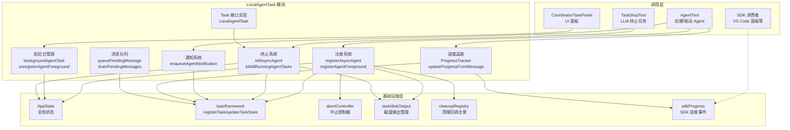
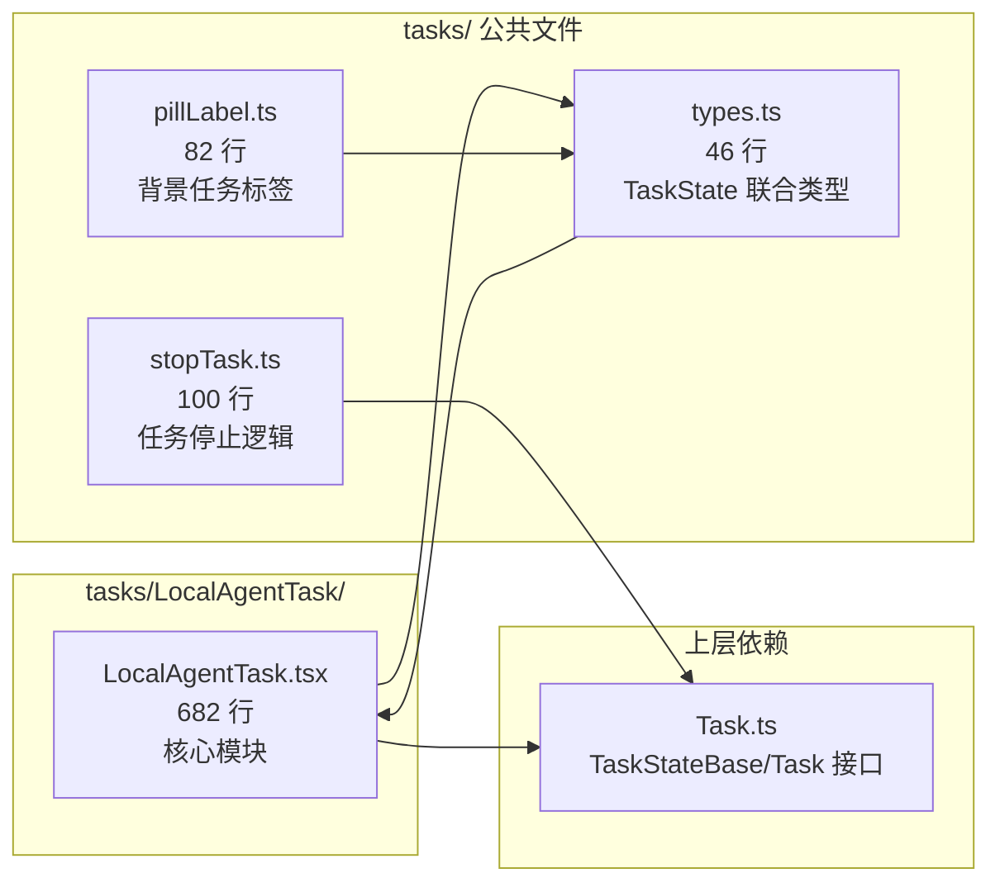
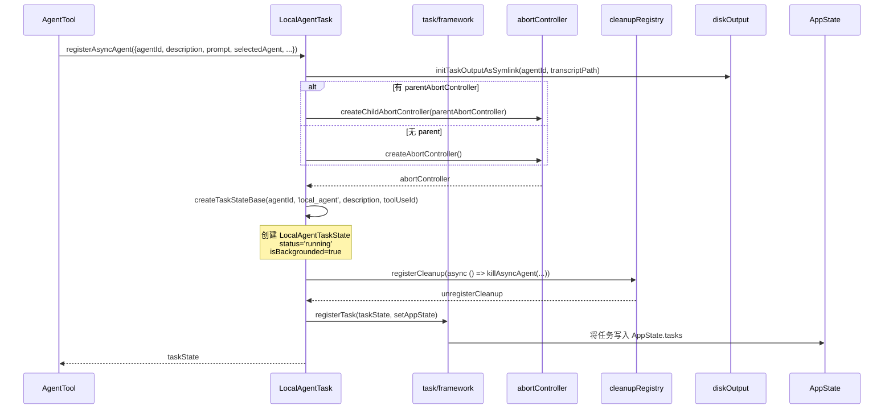
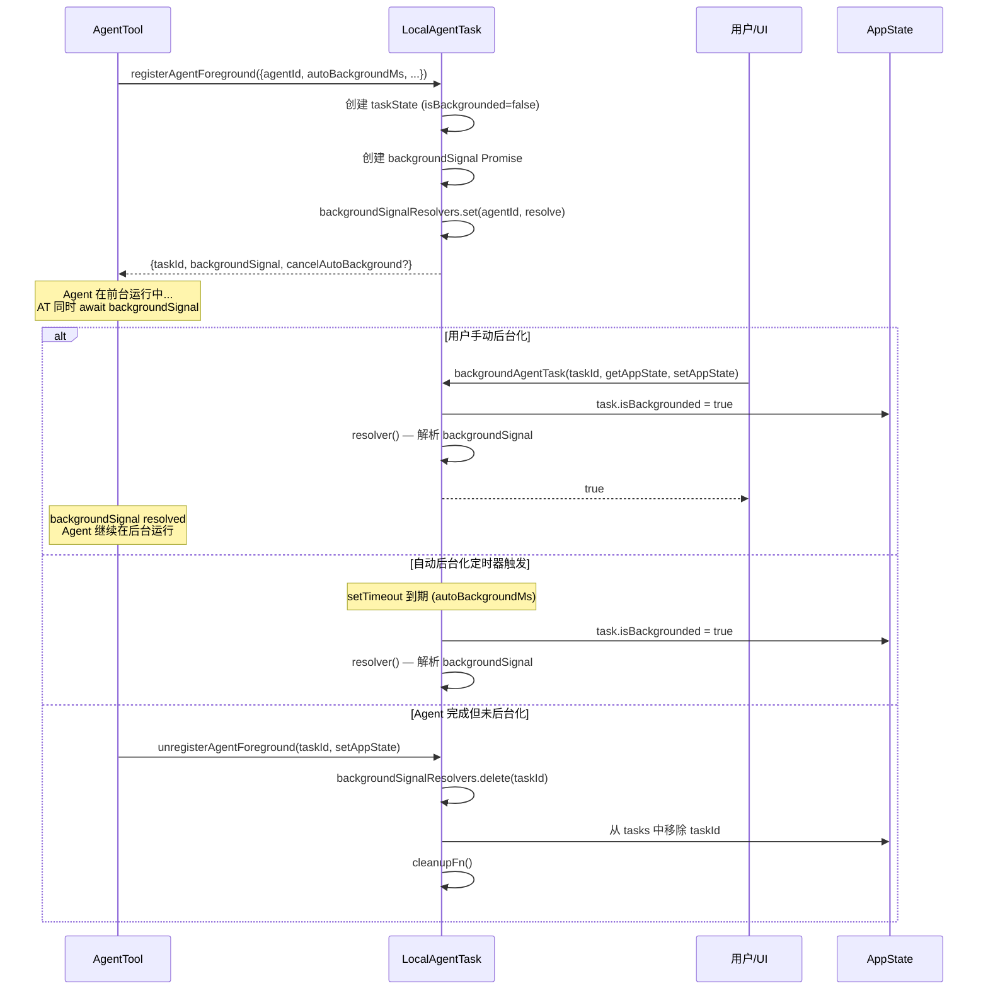
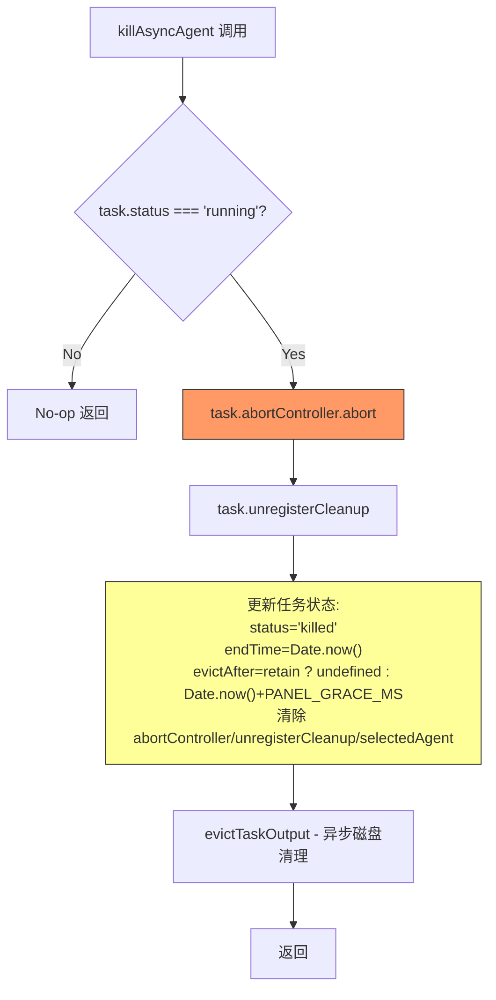
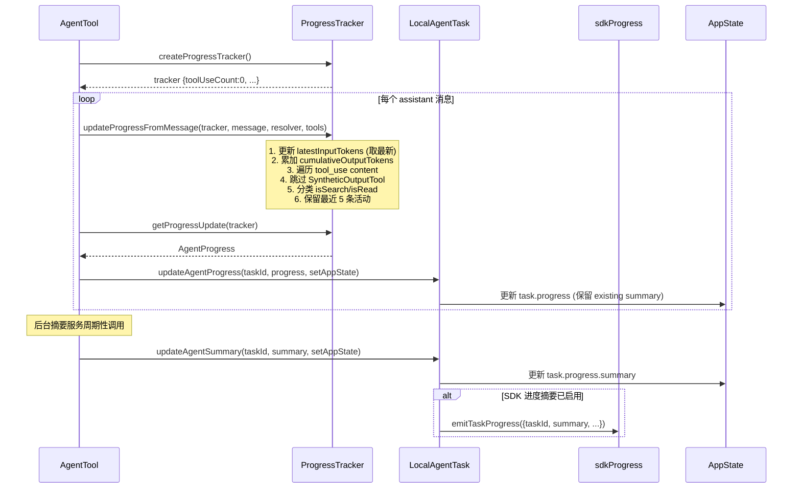
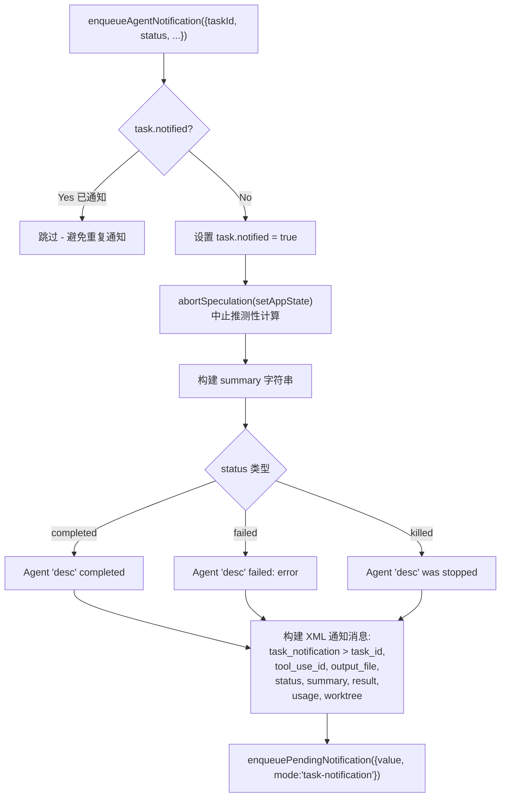
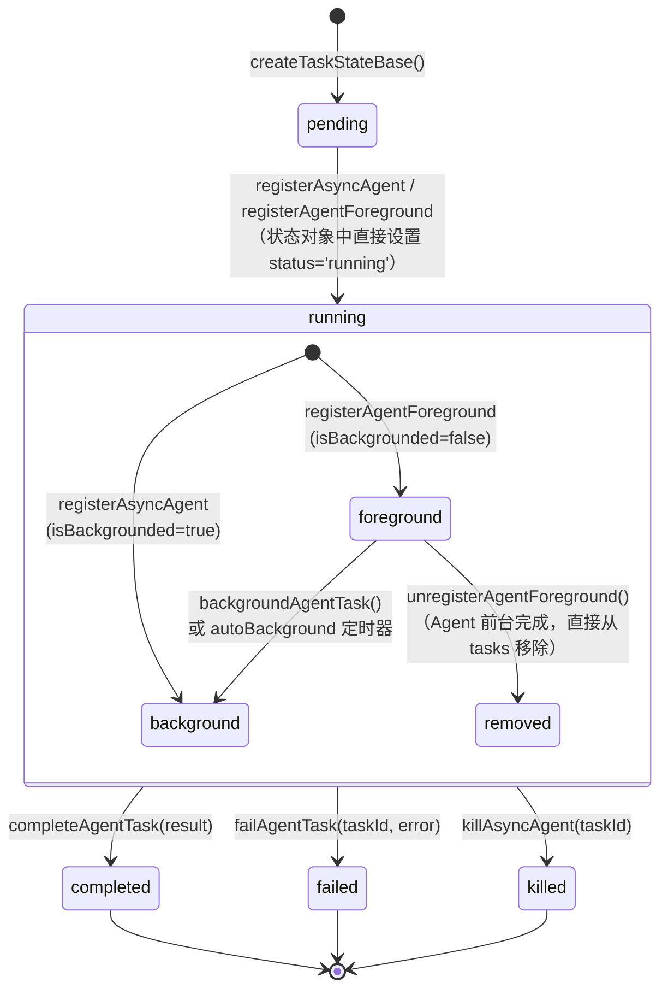

# LocalAgentTask 子模块设计文档

## 1. 文档信息

| 项目 | 内容 |
|------|------|
| 模块名称 | LocalAgentTask |
| 文档版本 | v1.0-20260402 |
| 生成日期 | 2026-04-02 |
| 生成方式 | 代码反向工程 |
| 源文件行数 | 682 行 (LocalAgentTask.tsx) + 46 行 (types.ts) + 82 行 (pillLabel.ts) + 100 行 (stopTask.ts) |
| 版本来源 | @anthropic-ai/claude-code v2.1.88 |

## 2. 模块概述

### 2.1 模块职责

LocalAgentTask 是 Claude Code 多 Agent 协作系统中负责**本地子 Agent 生命周期管理**的核心模块。其主要职责包括：

1. **子 Agent 注册与初始化**：创建本地 Agent 任务的状态对象，初始化 AbortController、清理回调、磁盘输出符号链接等资源
2. **前台/后台切换管理**：支持 Agent 在前台运行与后台运行之间的转换，提供自动后台化定时器机制
3. **进度追踪**：实时跟踪 Agent 的 token 消耗、工具使用次数和最近活动，并向 SDK 消费者发送进度事件
4. **任务终止与清理**：支持单个或批量终止 Agent 任务，释放 AbortController、清理回调等资源
5. **通知系统集成**：在 Agent 完成/失败/被终止时生成 XML 格式的结构化通知消息
6. **消息队列管理**：支持在 Agent 运行期间排队用户消息（pendingMessages），在工具调用轮次边界处排出

### 2.2 模块边界

- **上游调用者**：`AgentTool`（创建和驱动 Agent）、`CoordinatorTaskPanel`（UI 面板渲染）、`TaskStopTool`（LLM 请求终止任务）
- **下游依赖**：`AppState` 状态管理、`utils/task/framework` 任务框架、`utils/abortController` 中止控制器工具
- **不涉及**：Agent 的实际 API 调用逻辑（由 AgentTool 负责）、UI 渲染（由 CoordinatorTaskPanel 负责）

## 3. 架构设计

### 3.1 模块架构图



### 3.2 源文件组织



### 3.3 外部依赖表

| 依赖模块 | 导入内容 | 用途 |
|----------|----------|------|
| `bootstrap/state.js` | `getSdkAgentProgressSummariesEnabled` | 判断是否向 SDK 发送进度摘要事件 |
| `constants/xml.js` | 多个 XML 标签常量 | 构建通知消息的 XML 结构 |
| `services/PromptSuggestion/speculation.js` | `abortSpeculation` | 任务状态变化时中止推测性计算 |
| `state/AppState.js` | `AppState` 类型 | 全局应用状态类型引用 |
| `Task.js` | `TaskStateBase`, `SetAppState`, `Task`, `createTaskStateBase` | 基础任务接口和状态创建 |
| `Tool.js` | `Tools`, `findToolByName` | 工具查找以获取活动描述 |
| `tools/AgentTool/agentToolUtils.js` | `AgentToolResult` 类型 | Agent 执行结果类型 |
| `tools/AgentTool/loadAgentsDir.js` | `AgentDefinition` 类型 | Agent 定义配置类型 |
| `tools/SyntheticOutputTool/SyntheticOutputTool.js` | `SYNTHETIC_OUTPUT_TOOL_NAME` | 过滤内部工具使用记录 |
| `types/ids.js` | `asAgentId` | Agent ID 类型转换 |
| `types/message.js` | `Message` 类型 | 消息类型引用 |
| `utils/abortController.js` | `createAbortController`, `createChildAbortController` | 创建中止控制器（支持父子关系） |
| `utils/cleanupRegistry.js` | `registerCleanup` | 进程退出时的清理回调 |
| `utils/collapseReadSearch.js` | `getToolSearchOrReadInfo` | 分类工具活动为搜索/读取 |
| `utils/messageQueueManager.js` | `enqueuePendingNotification` | 将通知消息加入主会话队列 |
| `utils/sessionStorage.js` | `getAgentTranscriptPath` | 获取 Agent 对话记录文件路径 |
| `utils/task/diskOutput.js` | `evictTaskOutput`, `getTaskOutputPath`, `initTaskOutputAsSymlink` | 磁盘输出文件管理 |
| `utils/task/framework.js` | `PANEL_GRACE_MS`, `registerTask`, `updateTaskState` | 任务框架核心操作 |
| `utils/task/sdkProgress.js` | `emitTaskProgress` | 向 SDK 消费者发送进度事件 |

## 4. 数据结构设计

### 4.1 核心数据结构

#### 4.1.1 LocalAgentTaskState

本模块的核心状态类型，扩展自 `TaskStateBase`。

```typescript
// LocalAgentTask.tsx:116-148
export type LocalAgentTaskState = TaskStateBase & {
  type: 'local_agent';
  agentId: string;
  prompt: string;
  selectedAgent?: AgentDefinition;
  agentType: string;
  model?: string;
  abortController?: AbortController;
  unregisterCleanup?: () => void;
  error?: string;
  result?: AgentToolResult;
  progress?: AgentProgress;
  retrieved: boolean;
  messages?: Message[];
  lastReportedToolCount: number;
  lastReportedTokenCount: number;
  isBackgrounded: boolean;
  pendingMessages: string[];
  retain: boolean;
  diskLoaded: boolean;
  evictAfter?: number;
};
```

| 字段 | 类型 | 说明 |
|------|------|------|
| `type` | `'local_agent'` | 任务类型常量标识符 |
| `agentId` | `string` | Agent 唯一标识，同时作为任务 ID |
| `prompt` | `string` | 发送给 Agent 的原始提示词 |
| `selectedAgent` | `AgentDefinition?` | 选中的 Agent 定义配置，运行中持有，终止后清除 |
| `agentType` | `string` | Agent 类型标识，如 `'general-purpose'`、`'main-session'` |
| `model` | `string?` | Agent 使用的模型名称 |
| `abortController` | `AbortController?` | 用于中止 Agent 执行的控制器，终止后清除 |
| `unregisterCleanup` | `() => void?` | 清理回调注销函数，终止后清除 |
| `error` | `string?` | 失败时的错误信息 |
| `result` | `AgentToolResult?` | 完成时的执行结果 |
| `progress` | `AgentProgress?` | 当前进度信息（token/工具使用/活动） |
| `retrieved` | `boolean` | 结果是否已被调用者获取 |
| `messages` | `Message[]?` | Agent 对话消息列表（用于面板显示） |
| `lastReportedToolCount` | `number` | 上次报告的工具使用计数（用于增量计算） |
| `lastReportedTokenCount` | `number` | 上次报告的 token 计数（用于增量计算） |
| `isBackgrounded` | `boolean` | `false` = 前台运行，`true` = 已后台化 |
| `pendingMessages` | `string[]` | 用户通过 SendMessage 排队的待处理消息 |
| `retain` | `boolean` | UI 是否持有此任务（阻止驱逐，启用流追加） |
| `diskLoaded` | `boolean` | 是否已从磁盘加载侧链 JSONL 并合并到 messages |
| `evictAfter` | `number?` | 驱逐截止时间戳；`undefined` = 不可驱逐 |

#### 4.1.2 ProgressTracker

进度追踪器的内部状态，用于累积统计 Agent 执行过程中的指标。

```typescript
// LocalAgentTask.tsx:41-49
export type ProgressTracker = {
  toolUseCount: number;
  latestInputTokens: number;
  cumulativeOutputTokens: number;
  recentActivities: ToolActivity[];
};
```

| 字段 | 类型 | 说明 |
|------|------|------|
| `toolUseCount` | `number` | 工具调用总次数 |
| `latestInputTokens` | `number` | 最新一轮的输入 token 数（累积值，取最新而非求和） |
| `cumulativeOutputTokens` | `number` | 所有轮次的输出 token 累计总和 |
| `recentActivities` | `ToolActivity[]` | 最近 5 次工具活动记录 |

#### 4.1.3 ToolActivity

单次工具活动记录。

```typescript
// LocalAgentTask.tsx:23-32
export type ToolActivity = {
  toolName: string;
  input: Record<string, unknown>;
  activityDescription?: string;
  isSearch?: boolean;
  isRead?: boolean;
};
```

| 字段 | 类型 | 说明 |
|------|------|------|
| `toolName` | `string` | 工具名称（如 `Read`、`Grep`） |
| `input` | `Record<string, unknown>` | 工具调用的输入参数 |
| `activityDescription` | `string?` | 预计算的人可读活动描述，如 `"Reading src/foo.ts"` |
| `isSearch` | `boolean?` | 是否为搜索操作（Grep、Glob 等） |
| `isRead` | `boolean?` | 是否为读取操作（Read、cat 等） |

#### 4.1.4 AgentProgress

对外暴露的进度快照（从 ProgressTracker 生成）。

```typescript
// LocalAgentTask.tsx:33-39
export type AgentProgress = {
  toolUseCount: number;
  tokenCount: number;
  lastActivity?: ToolActivity;
  recentActivities?: ToolActivity[];
  summary?: string;
};
```

### 4.2 数据关系图

```mermaid
erDiagram
    TaskStateBase {
        string id
        TaskType type
        TaskStatus status
        string description
        string toolUseId
        number startTime
        number endTime
        string outputFile
        number outputOffset
        boolean notified
    }

    LocalAgentTaskState {
        string agentId
        string prompt
        string agentType
        string model
        string error
        boolean retrieved
        boolean isBackgrounded
        boolean retain
        boolean diskLoaded
        number evictAfter
        number lastReportedToolCount
        number lastReportedTokenCount
    }

    AgentProgress {
        number toolUseCount
        number tokenCount
        string summary
    }

    ToolActivity {
        string toolName
        string activityDescription
        boolean isSearch
        boolean isRead
    }

    ProgressTracker {
        number toolUseCount
        number latestInputTokens
        number cumulativeOutputTokens
    }

    AgentDefinition {
        string agentType
    }

    AgentToolResult {
        string agentId
    }

    LocalAgentTaskState ||--o| AgentProgress : "progress"
    LocalAgentTaskState ||--o| AgentDefinition : "selectedAgent"
    LocalAgentTaskState ||--o| AgentToolResult : "result"
    LocalAgentTaskState }|--|| TaskStateBase : "extends"
    AgentProgress ||--o{ ToolActivity : "recentActivities"
    ProgressTracker ||--o{ ToolActivity : "recentActivities"
    ProgressTracker ..> AgentProgress : "generates via getProgressUpdate()"
```

## 5. 接口设计

### 5.1 Task 接口实现

```typescript
// LocalAgentTask.tsx:270-276
export const LocalAgentTask: Task = {
  name: 'LocalAgentTask',
  type: 'local_agent',
  async kill(taskId, setAppState) {
    killAsyncAgent(taskId, setAppState);
  }
};
```

### 5.2 导出 API 一览

| 函数名 | 参数 | 返回值 | 说明 |
|--------|------|--------|------|
| `isLocalAgentTask(task)` | `task: unknown` | `task is LocalAgentTaskState` | 类型守卫：判断任务是否为本地 Agent 任务 |
| `isPanelAgentTask(t)` | `t: unknown` | `t is LocalAgentTaskState` | 类型守卫：判断是否为面板管理的 Agent（非 main-session） |
| `createProgressTracker()` | 无 | `ProgressTracker` | 创建零值进度追踪器 |
| `getTokenCountFromTracker(tracker)` | `tracker: ProgressTracker` | `number` | 计算总 token 数 = latestInputTokens + cumulativeOutputTokens |
| `updateProgressFromMessage(tracker, message, resolver?, tools?)` | tracker, Message, 可选回调, 可选工具列表 | `void` | 从 assistant 消息更新进度追踪器（token、工具计数、活动记录） |
| `getProgressUpdate(tracker)` | `tracker: ProgressTracker` | `AgentProgress` | 从追踪器生成对外进度快照 |
| `createActivityDescriptionResolver(tools)` | `tools: Tools` | `ActivityDescriptionResolver` | 创建工具活动描述解析器 |
| `registerAsyncAgent({...})` | agentId, description, prompt, selectedAgent, setAppState, parentAbortController?, toolUseId? | `LocalAgentTaskState` | 注册后台 Agent 任务（立即后台化） |
| `registerAgentForeground({...})` | agentId, description, prompt, selectedAgent, setAppState, autoBackgroundMs?, toolUseId? | `{taskId, backgroundSignal, cancelAutoBackground?}` | 注册前台 Agent 任务，返回后台化信号 Promise |
| `backgroundAgentTask(taskId, getAppState, setAppState)` | taskId, 状态读写函数 | `boolean` | 将前台任务切换到后台，返回是否成功 |
| `unregisterAgentForeground(taskId, setAppState)` | taskId, setAppState | `void` | 注销前台任务（Agent 完成但未后台化时调用） |
| `killAsyncAgent(taskId, setAppState)` | taskId, setAppState | `void` | 终止单个 Agent 任务 |
| `killAllRunningAgentTasks(tasks, setAppState)` | tasks 记录, setAppState | `void` | 终止所有运行中的 Agent 任务（ESC 取消用） |
| `markAgentsNotified(taskId, setAppState)` | taskId, setAppState | `void` | 标记已通知（批量终止时抑制单个通知） |
| `updateAgentProgress(taskId, progress, setAppState)` | taskId, AgentProgress, setAppState | `void` | 更新 Agent 进度（保留已有 summary） |
| `updateAgentSummary(taskId, summary, setAppState)` | taskId, summary 字符串, setAppState | `void` | 更新 Agent 背景摘要，可选发送 SDK 进度事件 |
| `completeAgentTask(result, setAppState)` | AgentToolResult, setAppState | `void` | 标记任务为已完成 |
| `failAgentTask(taskId, error, setAppState)` | taskId, 错误字符串, setAppState | `void` | 标记任务为已失败 |
| `queuePendingMessage(taskId, msg, setAppState)` | taskId, 消息字符串, setAppState | `void` | 向 Agent 排队用户消息 |
| `appendMessageToLocalAgent(taskId, message, setAppState)` | taskId, Message, setAppState | `void` | 直接追加消息到任务的 messages 列表 |
| `drainPendingMessages(taskId, getAppState, setAppState)` | taskId, 状态读写函数 | `string[]` | 排出并清空待处理消息队列 |
| `enqueueAgentNotification({...})` | taskId, description, status, error?, setAppState, finalMessage?, usage?, toolUseId?, worktreePath?, worktreeBranch? | `void` | 生成并入队 Agent 完成/失败/终止通知 |

## 6. 核心流程设计

### 6.1 Agent 注册与启动流程



### 6.2 前台 Agent 注册与后台化流程



### 6.3 Agent 终止流程



### 6.4 进度追踪流程



### 6.5 通知生成流程



## 7. 状态管理

### 7.1 状态定义

LocalAgentTaskState 中的 `status` 字段继承自 `TaskStatus`，可取以下值：

| 状态 | 含义 |
|------|------|
| `pending` | 初始状态（由 createTaskStateBase 设置，但注册后立即被覆盖为 running） |
| `running` | Agent 正在执行中 |
| `completed` | Agent 正常完成 |
| `failed` | Agent 执行失败 |
| `killed` | Agent 被用户或系统终止 |

### 7.2 状态转换图



### 7.3 状态转换条件表

| 起始状态 | 目标状态 | 触发函数 | 触发条件 | 副作用 |
|----------|----------|----------|----------|--------|
| (初始) | `running` + 后台 | `registerAsyncAgent()` | AgentTool 创建后台 Agent | 初始化 AbortController、注册清理回调、创建磁盘输出符号链接 |
| (初始) | `running` + 前台 | `registerAgentForeground()` | AgentTool 创建前台 Agent | 同上 + 创建 backgroundSignal Promise、可选启动 autoBackground 定时器 |
| `running` (前台) | `running` (后台) | `backgroundAgentTask()` | 用户手动后台化或定时器触发 | 解析 backgroundSignal Promise |
| `running` (前台) | (移除) | `unregisterAgentForeground()` | Agent 前台完成未后台化 | 从 AppState.tasks 中删除任务、调用 cleanupFn |
| `running` | `completed` | `completeAgentTask()` | Agent 正常执行完毕 | 设置 result、endTime、evictAfter；注销清理回调；异步驱逐磁盘输出 |
| `running` | `failed` | `failAgentTask()` | Agent 执行出错 | 设置 error、endTime、evictAfter；注销清理回调；异步驱逐磁盘输出 |
| `running` | `killed` | `killAsyncAgent()` | 用户 ESC/TaskStopTool/批量终止 | 调用 abortController.abort()；设置 endTime、evictAfter；注销清理回调；异步驱逐磁盘输出 |

### 7.4 evictAfter 与 retain 机制

任务进入终止态时，`evictAfter` 的计算逻辑（见 `killAsyncAgent` 第 294 行、`completeAgentTask` 第 424 行、`failAgentTask` 第 448 行）：

```
evictAfter = task.retain ? undefined : Date.now() + PANEL_GRACE_MS
```

- 当 `retain = true`（UI 正在持有该任务）时，`evictAfter = undefined`，任务不会被自动驱逐
- 当 `retain = false` 时，设置宽限期后的时间戳，超时后任务可被 GC 回收

## 8. 错误处理设计

### 8.1 错误类型表

| 错误场景 | 处理位置 | 处理方式 |
|----------|----------|----------|
| Agent 执行失败 | `failAgentTask()` (第 437 行) | 设置 `status='failed'`、`error` 字段，由 AgentTool 调用 `enqueueAgentNotification` 发送通知 |
| Agent 被中止 | `killAsyncAgent()` (第 281 行) | 调用 `abortController.abort()` 触发 AbortError，设置 `status='killed'` |
| 父 Agent 中止级联 | `registerAsyncAgent()` (第 486 行) | 通过 `createChildAbortController` 创建子控制器，父 Agent 中止时自动级联中止子 Agent |
| 重复通知防护 | `enqueueAgentNotification()` (第 228 行) | 原子地检查并设置 `notified` 标志，已通知则跳过 |
| 任务不存在/未运行 | `stopTask()` (stopTask.ts 第 46-55 行) | 抛出 `StopTaskError`，携带 `code` 字段区分错误类型 |
| 不支持的任务类型 | `stopTask()` (stopTask.ts 第 59 行) | 抛出 `StopTaskError(code='unsupported_type')` |
| 非运行态调用状态更新 | 各 `updateTaskState` 回调 | 静默返回原状态（No-op），如 `killAsyncAgent` 第 284 行、`updateAgentProgress` 第 341 行 |

### 8.2 错误处理策略

1. **幂等操作设计**：所有状态更新函数内部都先检查 `task.status !== 'running'`，对非运行态直接返回原状态，确保重复调用不产生副作用
2. **原子状态更新**：使用 `updateTaskState` 封装的 `setAppState(prev => ...)` 模式，确保读-改-写操作的原子性
3. **通知去重**：`enqueueAgentNotification` 通过 `notified` 标志的原子检查-设置防止重复通知
4. **资源清理保障**：通过 `registerCleanup` 注册进程退出清理回调，确保异常退出时也能终止 Agent
5. **推测计算失效处理**：任务状态变化时调用 `abortSpeculation` 使已缓存的推测结果失效，避免使用过时数据

## 9. 设计评估

### 9.1 优点

1. **前后台切换机制成熟**：通过 `backgroundSignal` Promise 和 `backgroundSignalResolvers` Map 实现了优雅的前台到后台转换，支持用户手动触发和自动定时器触发两种方式
2. **父子 Agent 级联中止**：利用 `createChildAbortController` 实现了父 Agent 中止时自动级联终止子 Agent 的机制，适用于多层 Agent 嵌套场景
3. **进度追踪的 token 统计设计**：正确区分了 Claude API 中 `input_tokens`（累积值取最新）和 `output_tokens`（增量值累加）的不同语义，避免了双重计数
4. **通知系统的 XML 结构化**：通知消息采用 XML 结构，携带 task_id、status、summary、usage、worktree 等完整信息，便于主 Agent 解析和决策
5. **retain/evictAfter 机制**：将 UI 持有状态与 GC 驱逐时间分离，确保用户查看任务时不会被意外清理
6. **幂等与原子性**：所有状态更新函数内置幂等检查，配合 `setAppState` 的函数式更新模式保证原子性

### 9.2 缺点与风险

1. **backgroundSignalResolvers 内存泄漏风险**：全局 `Map<string, () => void>` 存储 resolve 函数，若 Agent 异常退出且未调用 `unregisterAgentForeground` 或 `backgroundAgentTask`，对应条目不会被清理（虽然 resolve 函数本身很小）
2. **selectedAgent 引用清除时机**：在 `killAsyncAgent`、`completeAgentTask`、`failAgentTask` 中都将 `selectedAgent` 设为 `undefined`，这是为了避免内存泄漏，但如果有代码在状态转换后仍引用 `selectedAgent` 可能导致 bug
3. **磁盘输出驱逐的 fire-and-forget**：`evictTaskOutput` 使用 `void` 忽略 Promise 返回值，磁盘清理失败不会被捕获或重试
4. **单文件 682 行**：模块逻辑（注册、终止、进度、通知、消息队列）全部集中在一个文件中，职责较多，可考虑按功能拆分

### 9.3 改进建议

1. **backgroundSignalResolvers 清理**：在 `killAsyncAgent` 中增加 `backgroundSignalResolvers.delete(taskId)` 调用，防止异常路径下的残留
2. **文件拆分**：将进度追踪（ProgressTracker 相关）、通知生成（enqueueAgentNotification）、消息队列（pending messages）分别提取为独立子模块
3. **磁盘清理错误处理**：为 `evictTaskOutput` 添加 `.catch()` 记录日志，或使用重试机制
4. **autoBackgroundMs 定时器的 `setAppState` 闭包**：`registerAgentForeground` 第 583 行将 `setAppState` 作为 `setTimeout` 的额外参数传入，若 `setAppState` 引用在超时期间被替换则可能出现问题（虽然当前架构下不太可能）
