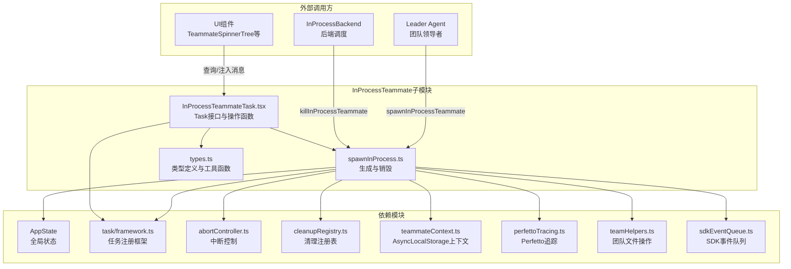
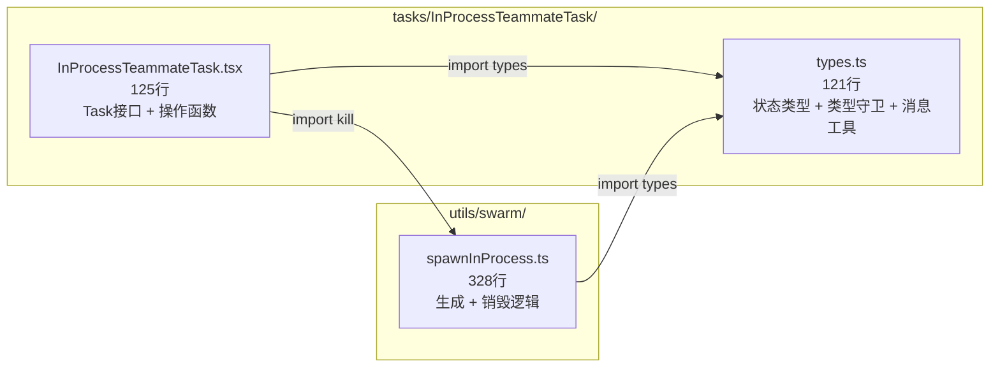
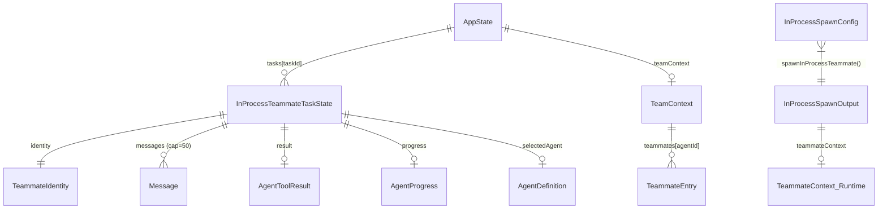
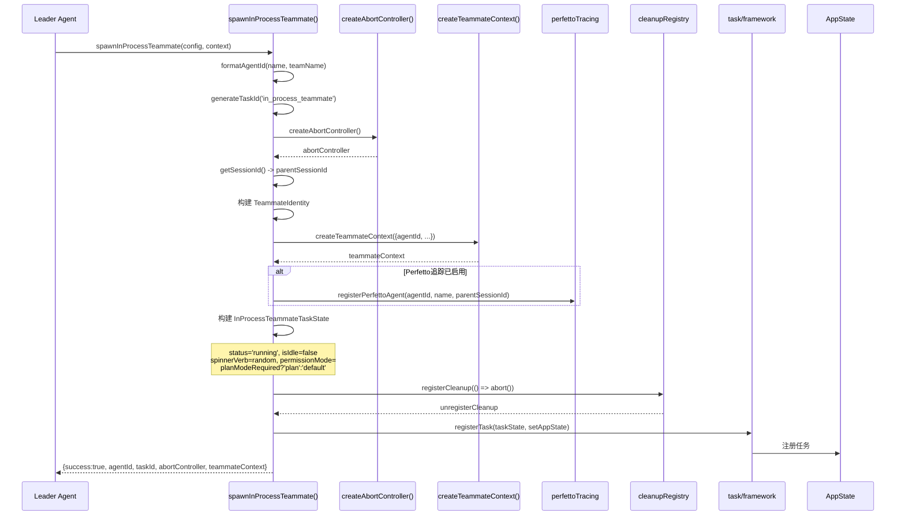
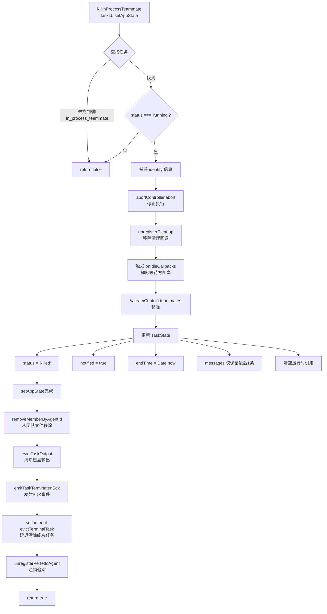
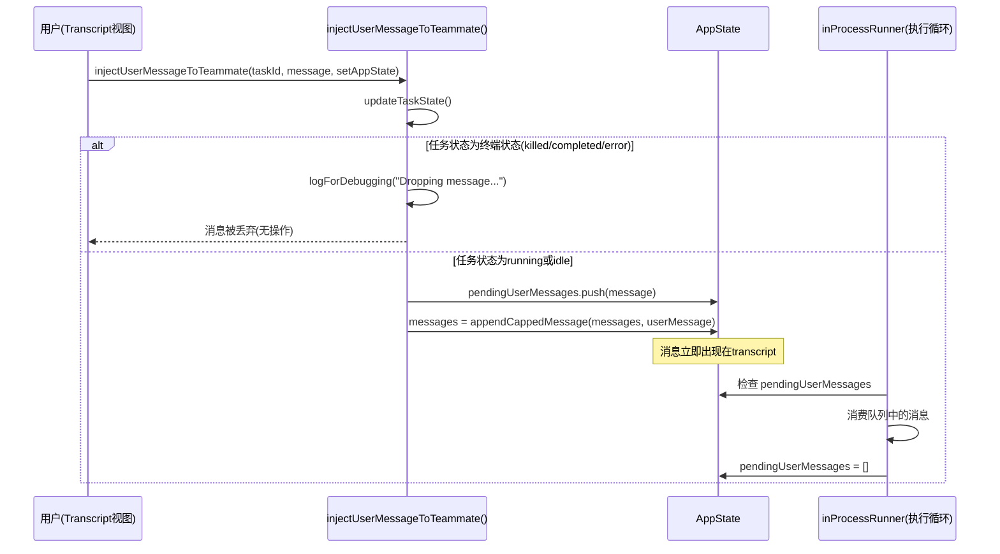
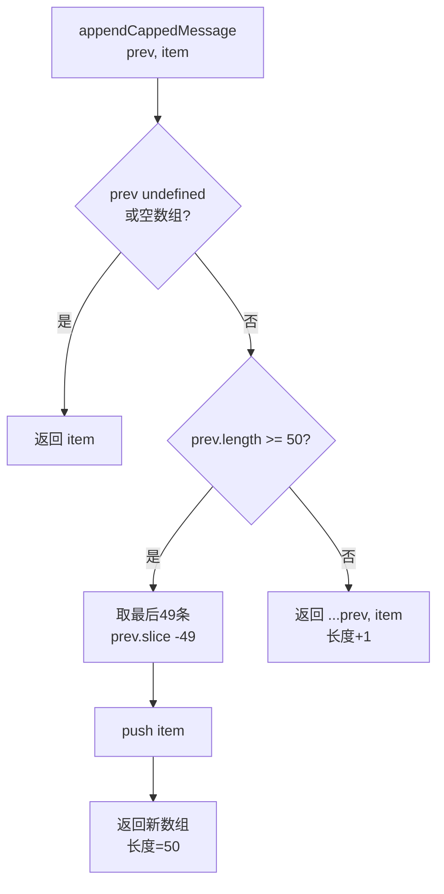
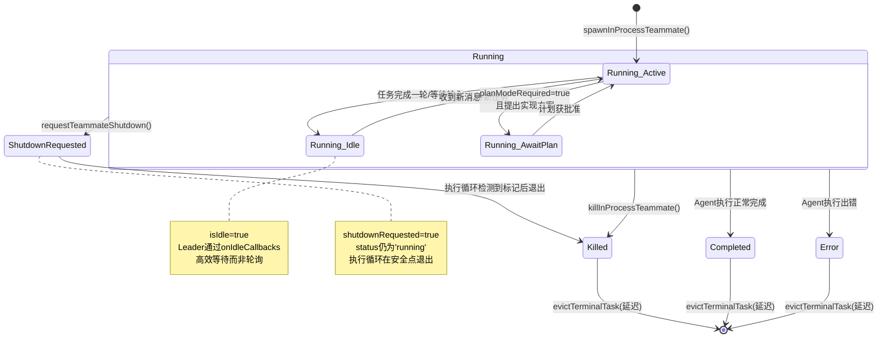

# InProcessTeammate 子模块设计文档

## 1. 文档信息

| 项目 | 内容 |
|------|------|
| 模块名称 | InProcessTeammateTask + spawnInProcess |
| 文档版本 | v1.0-20260402 |
| 生成日期 | 2026-04-02 |
| 生成方式 | 代码反向工程 |
| 源文件行数 | 574 行（types.ts 121行 + InProcessTeammateTask.tsx 125行 + spawnInProcess.ts 328行） |
| 版本来源 | @anthropic-ai/claude-code v2.1.88 |

## 2. 模块概述

### 2.1 模块职责

InProcessTeammate 子模块负责在**同一 Node.js 进程内**创建、管理和销毁 Teammate（队友）Agent 实例。与基于外部进程（tmux/iTerm2）的方案不同，进程内 Teammate 通过 `AsyncLocalStorage` 实现上下文隔离，在同一进程中并发运行多个 Agent，每个 Agent 拥有独立的身份标识、会话历史和生命周期控制。

核心职责包括：

1. **Teammate 生成（Spawn）**：创建 TeammateContext、分配独立 AbortController、注册任务到 AppState
2. **Task 接口实现**：实现 `Task` 接口，提供 `kill` 方法用于多态派发终止
3. **生命周期管理**：支持运行、空闲、关机请求、终止等状态转换
4. **消息管理**：对 Teammate 对话历史进行有上限的追加管理（UI 消息上限 50 条）
5. **用户交互注入**：支持向运行中的 Teammate 注入用户消息
6. **查询与排序**：按 agentId 或状态查找、排序 Teammate 任务

### 2.2 模块边界

本模块**不负责**：

- Agent 的实际推理执行循环（由 `inProcessRunner` / `runAgent()` 负责）
- 团队定义文件的读写（由 `teamHelpers` 处理）
- AsyncLocalStorage 上下文的运行时注入（由 `runWithTeammateContext()` 处理）
- UI 渲染（由 `TeammateSpinnerTree`、transcript 视图等组件处理）
- 邮箱消息存储（存储在 `teamContext.inProcessMailboxes` 中）

## 3. 架构设计

### 3.1 模块架构图



### 3.2 源文件组织



### 3.3 外部依赖表

| 依赖模块 | 路径 | 用途 |
|----------|------|------|
| Task / TaskStateBase | `Task.ts` (L72-76) | Task 多态接口定义与状态基类 |
| AppState | `state/AppState.ts` | 全局状态树，任务存储容器 |
| task/framework | `utils/task/framework.ts` | `registerTask`、`updateTaskState`、`evictTerminalTask`、`STOPPED_DISPLAY_MS` |
| abortController | `utils/abortController.ts` | 创建独立的 AbortController |
| cleanupRegistry | `utils/cleanupRegistry.ts` | 注册进程退出时的清理回调 |
| teammateContext | `utils/teammateContext.ts` | 创建 AsyncLocalStorage 上下文 |
| perfettoTracing | `utils/telemetry/perfettoTracing.ts` | Perfetto 追踪注册/注销 |
| teamHelpers | `utils/swarm/teamHelpers.ts` | 从团队文件中移除成员 |
| sdkEventQueue | `utils/sdkEventQueue.ts` | 发射任务终止 SDK 事件 |
| diskOutput | `utils/task/diskOutput.ts` | 清除任务磁盘输出 |
| AgentToolResult | `tools/AgentTool/agentToolUtils.ts` | Agent 执行结果类型 |
| AgentDefinition | `tools/AgentTool/loadAgentsDir.ts` | Agent 定义类型 |
| PermissionMode | `utils/permissions/PermissionMode.ts` | 权限模式枚举 |
| spinnerVerbs / turnCompletionVerbs | `constants/` | UI 随机动词 |

## 4. 数据结构设计

### 4.1 核心数据结构

#### 4.1.1 TeammateIdentity

Teammate 的身份标识，作为纯数据存储在 AppState 中（区别于运行时的 AsyncLocalStorage `TeammateContext`）。

```typescript
// types.ts L13-20
export type TeammateIdentity = {
  agentId: string           // e.g., "researcher@my-team"
  agentName: string         // e.g., "researcher"
  teamName: string
  color?: string
  planModeRequired: boolean
  parentSessionId: string   // Leader 的 session ID
}
```

| 字段 | 类型 | 说明 |
|------|------|------|
| `agentId` | `string` | 唯一标识，格式为 `name@team`，由 `formatAgentId()` 生成 |
| `agentName` | `string` | Teammate 显示名称 |
| `teamName` | `string` | 所属团队名称 |
| `color` | `string?` | UI 显示颜色 |
| `planModeRequired` | `boolean` | 是否强制进入计划模式 |
| `parentSessionId` | `string` | 父级（Leader）的会话 ID，用于日志关联 |

#### 4.1.2 InProcessTeammateTaskState

完整的任务状态类型，继承自 `TaskStateBase`。

```typescript
// types.ts L22-76
export type InProcessTeammateTaskState = TaskStateBase & {
  type: 'in_process_teammate'
  identity: TeammateIdentity
  prompt: string
  model?: string
  selectedAgent?: AgentDefinition
  abortController?: AbortController       // 运行时，不序列化
  currentWorkAbortController?: AbortController  // 运行时
  unregisterCleanup?: () => void           // 运行时
  awaitingPlanApproval: boolean
  permissionMode: PermissionMode
  error?: string
  result?: AgentToolResult
  progress?: AgentProgress
  messages?: Message[]
  inProgressToolUseIDs?: Set<string>
  pendingUserMessages: string[]
  spinnerVerb?: string
  pastTenseVerb?: string
  isIdle: boolean
  shutdownRequested: boolean
  onIdleCallbacks?: Array<() => void>      // 运行时
  lastReportedToolCount: number
  lastReportedTokenCount: number
}
```

关键字段分类：

| 分类 | 字段 | 说明 |
|------|------|------|
| **身份** | `identity` | TeammateIdentity 实例 |
| **执行** | `prompt`, `model`, `selectedAgent` | 执行配置 |
| **运行时控制** | `abortController`, `currentWorkAbortController`, `unregisterCleanup` | 不序列化到磁盘 |
| **计划模式** | `awaitingPlanApproval`, `permissionMode` | 计划审批流 |
| **状态结果** | `error`, `result`, `progress` | 执行结果 |
| **会话历史** | `messages`, `pendingUserMessages` | UI 消息（上限50条）+ 待注入消息队列 |
| **UI** | `spinnerVerb`, `pastTenseVerb`, `inProgressToolUseIDs` | 渲染辅助 |
| **生命周期** | `isIdle`, `shutdownRequested`, `onIdleCallbacks` | 空闲/关机控制 |
| **进度追踪** | `lastReportedToolCount`, `lastReportedTokenCount` | 增量通知计算 |

#### 4.1.3 InProcessSpawnConfig

```typescript
// spawnInProcess.ts L59-72
export type InProcessSpawnConfig = {
  name: string
  teamName: string
  prompt: string
  color?: string
  planModeRequired: boolean
  model?: string
}
```

#### 4.1.4 InProcessSpawnOutput

```typescript
// spawnInProcess.ts L77-90
export type InProcessSpawnOutput = {
  success: boolean
  agentId: string
  taskId?: string
  abortController?: AbortController
  teammateContext?: ReturnType<typeof createTeammateContext>
  error?: string
}
```

#### 4.1.5 TEAMMATE_MESSAGES_UI_CAP

```typescript
// types.ts L101
export const TEAMMATE_MESSAGES_UI_CAP = 50
```

设计依据（types.ts L91-100 注释）：BQ 分析显示每个 Agent 在 500+ 轮会话时占用约 20MB RSS，并发群 Agent 可达 125MB/个。一个极端案例（session 9a990de8）在 2 分钟内启动了 292 个 Agent，内存达到 36.8GB。主要成本是 `messages` 数组持有消息的第二份完整拷贝。因此将 UI 消息上限限制为 50 条。

### 4.2 数据关系图



## 5. 接口设计

### 5.1 对外接口（Export API）

#### 5.1.1 spawnInProcessTeammate

**文件**: `spawnInProcess.ts` L104-216

```typescript
export async function spawnInProcessTeammate(
  config: InProcessSpawnConfig,
  context: SpawnContext,
): Promise<InProcessSpawnOutput>
```

| 参数 | 类型 | 说明 |
|------|------|------|
| `config` | `InProcessSpawnConfig` | 包含 name、teamName、prompt、color、planModeRequired、model |
| `context` | `SpawnContext` | 包含 `setAppState` 和可选的 `toolUseId` |
| **返回值** | `Promise<InProcessSpawnOutput>` | 成功时包含 agentId、taskId、abortController、teammateContext；失败时包含 error |

职责：生成 agentId，创建 AbortController，构建 TeammateIdentity 和 TeammateContext，注册 Perfetto 追踪，构建初始 TaskState，注册清理回调，注册到 AppState。

#### 5.1.2 killInProcessTeammate

**文件**: `spawnInProcess.ts` L227-328

```typescript
export function killInProcessTeammate(
  taskId: string,
  setAppState: SetAppStateFn,
): boolean
```

| 参数 | 类型 | 说明 |
|------|------|------|
| `taskId` | `string` | 要终止的任务 ID |
| `setAppState` | `SetAppStateFn` | AppState 更新函数 |
| **返回值** | `boolean` | 是否成功终止 |

职责：中止 AbortController，调用清理回调，触发 onIdleCallbacks 解除等待方阻塞，从 teamContext.teammates 中移除，更新状态为 `killed`，清理运行时引用，从团队文件移除成员，发射 SDK 终止事件，清除磁盘输出，定时清除终端任务。

#### 5.1.3 InProcessTeammateTask

**文件**: `InProcessTeammateTask.tsx` L24-30

```typescript
export const InProcessTeammateTask: Task = {
  name: 'InProcessTeammateTask',
  type: 'in_process_teammate',
  async kill(taskId, setAppState) {
    killInProcessTeammate(taskId, setAppState);
  }
}
```

实现 `Task` 接口，`type` 为 `'in_process_teammate'`，`kill` 方法委托给 `killInProcessTeammate`。

#### 5.1.4 requestTeammateShutdown

**文件**: `InProcessTeammateTask.tsx` L35-45

```typescript
export function requestTeammateShutdown(taskId: string, setAppState: SetAppState): void
```

设置 `shutdownRequested = true`，优雅关机信号。仅在 `status === 'running'` 且未请求关机时生效。

#### 5.1.5 appendTeammateMessage

**文件**: `InProcessTeammateTask.tsx` L51-61

```typescript
export function appendTeammateMessage(taskId: string, message: Message, setAppState: SetAppState): void
```

向 Teammate 的 `messages` 数组追加消息（受 50 条上限约束），仅在 `status === 'running'` 时生效。

#### 5.1.6 injectUserMessageToTeammate

**文件**: `InProcessTeammateTask.tsx` L68-83

```typescript
export function injectUserMessageToTeammate(taskId: string, message: string, setAppState: SetAppState): void
```

向 `pendingUserMessages` 队列追加用户消息，同时写入 `messages` 使其立即在 transcript 中显示。在 `running` 和 `idle` 状态下均可注入，仅在终端状态（killed/completed/error）下丢弃。

#### 5.1.7 findTeammateTaskByAgentId

**文件**: `InProcessTeammateTask.tsx` L92-108

```typescript
export function findTeammateTaskByAgentId(
  agentId: string,
  tasks: Record<string, TaskStateBase>
): InProcessTeammateTaskState | undefined
```

按 `agentId` 查找 Teammate 任务，优先返回 `running` 状态的任务（因为 AppState 中可能存在同 agentId 的已终止旧任务）。

#### 5.1.8 getAllInProcessTeammateTasks / getRunningTeammatesSorted

**文件**: `InProcessTeammateTask.tsx` L113-124

```typescript
export function getAllInProcessTeammateTasks(tasks: Record<string, TaskStateBase>): InProcessTeammateTaskState[]
export function getRunningTeammatesSorted(tasks: Record<string, TaskStateBase>): InProcessTeammateTaskState[]
```

查询函数。`getRunningTeammatesSorted` 按 `agentName` 字母序排序，用于 UI 组件（TeammateSpinnerTree、PromptInput footer、useBackgroundTaskNavigation）之间保持一致的排序。

#### 5.1.9 类型与工具函数导出

| 导出 | 文件 | 说明 |
|------|------|------|
| `TeammateIdentity` | types.ts L13 | 身份类型 |
| `InProcessTeammateTaskState` | types.ts L22 | 任务状态类型 |
| `isInProcessTeammateTask()` | types.ts L78 | 类型守卫 |
| `TEAMMATE_MESSAGES_UI_CAP` | types.ts L101 | 消息上限常量 |
| `appendCappedMessage()` | types.ts L108 | 有上限的消息追加工具函数 |
| `SpawnContext` | spawnInProcess.ts L51 | 生成上下文类型 |
| `InProcessSpawnConfig` | spawnInProcess.ts L59 | 生成配置类型 |
| `InProcessSpawnOutput` | spawnInProcess.ts L77 | 生成结果类型 |

## 6. 核心流程设计

### 6.1 Teammate 生成流程



**关键设计点**（spawnInProcess.ts L121-122）：Teammate 拥有独立的 AbortController，不与 Leader 的查询中断联动。这确保 Leader 取消当前查询时不会误杀 Teammate。

### 6.2 Teammate 终止（Kill）流程



**关键设计点**：

1. **状态更新与 I/O 分离**（spawnInProcess.ts L301-302）：`removeMemberByAgentId` 在 `setAppState` 回调外执行，避免在状态更新函数中进行文件 I/O。
2. **消息精简**（spawnInProcess.ts L288-289）：kill 时将 `messages` 缩减到最后 1 条，立即释放内存。
3. **双重发射保护**（spawnInProcess.ts L309-311）：设置 `notified:true` 防止 XML 通知，直接通过 SDK 事件队列发射终止事件；inProcessRunner 的完成/失败逻辑会检查 `status==='running'` 以避免重复发射。

### 6.3 用户消息注入流程



### 6.4 消息上限管理流程



此函数（types.ts L108-121）始终返回新数组，遵循 AppState 不可变性约定。当消息超过 `TEAMMATE_MESSAGES_UI_CAP`（50）时，丢弃最旧的消息。完整对话历史保存在 inProcessRunner 的本地 `allMessages` 数组和磁盘 transcript 中。

## 7. 状态管理

### 7.1 状态定义

InProcessTeammateTaskState 继承 TaskStateBase 的 `status` 字段，结合模块特有的生命周期字段：

| 状态维度 | 字段 | 类型 | 说明 |
|----------|------|------|------|
| 任务状态 | `status` | TaskStatus | 继承自 TaskStateBase：`'running'` / `'killed'` / `'completed'` / `'error'` |
| 空闲标记 | `isIdle` | `boolean` | Teammate 是否在等待工作 |
| 关机请求 | `shutdownRequested` | `boolean` | 是否收到优雅关机信号 |
| 计划审批 | `awaitingPlanApproval` | `boolean` | 是否等待计划模式审批 |

### 7.2 状态转换图



**优雅关机 vs 强制终止**：

- `requestTeammateShutdown()`：设置 `shutdownRequested=true`，执行循环在下一个安全检查点自行退出，保证清理完成
- `killInProcessTeammate()`：直接 `abort()` + 状态设为 `killed`，立即终止

### 7.3 onIdleCallbacks 机制

`onIdleCallbacks`（types.ts L70-71）是一个回调数组，用于 Leader 高效等待 Teammate 变为空闲状态。当 Teammate 完成一轮工作进入 `isIdle=true` 时，执行循环调用所有回调通知等待方。在 `killInProcessTeammate` 中（spawnInProcess.ts L265），也会触发这些回调以解除等待方的阻塞。

## 8. 错误处理设计

### 8.1 生成阶段错误处理

`spawnInProcessTeammate` 使用 try-catch 包裹整个生成流程（spawnInProcess.ts L119-215）：

```typescript
// spawnInProcess.ts L204-215
catch (error) {
  const errorMessage =
    error instanceof Error ? error.message : 'Unknown error during spawn'
  logForDebugging(
    `[spawnInProcessTeammate] Failed to spawn ${agentId}: ${errorMessage}`,
  )
  return {
    success: false,
    agentId,
    error: errorMessage,
  }
}
```

**特点**：
- 不抛出异常，通过返回值 `success: false` + `error` 字段通知调用方
- 失败时 `taskId`、`abortController`、`teammateContext` 均为 `undefined`
- 记录调试日志

### 8.2 终止阶段错误处理

`killInProcessTeammate` 的防御性设计：

1. **任务不存在/类型不匹配**（spawnInProcess.ts L239-241）：直接返回原状态，killed 标记为 false
2. **非 running 状态**（spawnInProcess.ts L245-247）：跳过终止操作
3. **状态更新与副作用分离**：文件 I/O（removeMemberByAgentId）在 setAppState 外执行，避免状态回调中的异常影响状态一致性
4. **异步清除使用 void**（spawnInProcess.ts L307）：`void evictTaskOutput(taskId)` 不等待磁盘清除完成

### 8.3 消息注入错误处理

- `appendTeammateMessage`：非 running 状态下静默跳过（InProcessTeammateTask.tsx L53-55）
- `injectUserMessageToTeammate`：终端状态下记录调试日志并丢弃（InProcessTeammateTask.tsx L72-74）；running 和 idle 状态下均允许注入

### 8.4 查询容错

`findTeammateTaskByAgentId`（InProcessTeammateTask.tsx L92-108）通过优先返回 running 状态任务来处理 AppState 中可能存在的同 agentId 历史残留任务。

## 9. 设计评估

### 9.1 优点

1. **进程内隔离设计**：通过 AsyncLocalStorage 而非独立进程实现 Agent 隔离，避免了进程间通信开销和 tmux/iTerm2 等外部依赖，极大简化了部署和调试。

2. **独立 AbortController**（spawnInProcess.ts L121-122）：Teammate 的 AbortController 不与 Leader 联动，确保 Leader 取消查询时 Teammate 继续工作，同时支持单独终止任何 Teammate。

3. **内存上限控制**（types.ts L91-101）：基于生产数据分析（292 个 Agent / 36.8GB）引入 `TEAMMATE_MESSAGES_UI_CAP = 50` 限制，有效控制内存增长。`appendCappedMessage` 的不可变返回设计与 React/AppState 的渲染模型一致。

4. **优雅关机与强制终止双通道**：`requestTeammateShutdown` 提供协作式关机，`killInProcessTeammate` 提供紧急终止，覆盖不同场景需求。

5. **回调式空闲通知**（onIdleCallbacks）：避免 Leader 轮询 Teammate 状态，提高并发效率。

6. **职责分离清晰**：types.ts 纯数据定义、InProcessTeammateTask.tsx 提供 Task 接口和操作函数、spawnInProcess.ts 处理生成/销毁的重逻辑，三文件职责明确。

7. **防御性状态更新**：killInProcessTeammate 中清空所有运行时引用（abortController、unregisterCleanup、currentWorkAbortController、onIdleCallbacks），防止内存泄漏和陈旧引用。

### 9.2 缺点与风险

1. **agentId 唯一性隐患**：`formatAgentId(name, teamName)` 生成 `name@team` 格式的 ID，如果同一团队中创建同名 Teammate，agentId 会冲突。`findTeammateTaskByAgentId` 的 "优先 running" 策略是一种缓解但非根本解决方案。

2. **运行时字段与序列化混合**：`InProcessTeammateTaskState` 中混合了可序列化字段（identity、prompt）和运行时字段（abortController、unregisterCleanup、onIdleCallbacks、inProgressToolUseIDs 使用 Set）。尽管注释标明了"Runtime only"，但缺乏类型系统层面的强制分离，序列化时可能出现意外行为。

3. **setAppState 闭包中的副作用**：`killInProcessTeammate` 在 `setAppState` 回调中执行 `abortController.abort()` 和 `onIdleCallbacks` 调用（spawnInProcess.ts L256-265），虽然这些是同步操作，但在状态更新函数中产生副作用不符合纯函数原则，可能导致调试困难。

4. **消息上限丢失上下文**：`TEAMMATE_MESSAGES_UI_CAP = 50` 对 UI 显示有效，但 transcript 视图中丢失早期消息可能影响用户理解完整对话脉络。

5. **kill 后延迟清除**：`evictTerminalTask` 通过 `setTimeout` 延迟执行（spawnInProcess.ts L316-319），如果大量 Teammate 同时被 kill，可能导致短时间内大量定时器堆积。

### 9.3 改进建议

1. **类型层面分离运行时与持久化字段**：可定义 `InProcessTeammateTaskPersisted` 和 `InProcessTeammateTaskRuntime` 两个类型，通过交叉类型组合，在序列化边界提供编译时保证。

2. **agentId 添加唯一后缀**：在 `formatAgentId` 中添加短随机后缀或序列号（如 `researcher@team#3`），从根本上避免 ID 冲突。

3. **将 setAppState 回调中的副作用外移**：将 `abort()` 和 `onIdleCallbacks` 调用移到 `setAppState` 之后执行，保持状态更新函数的纯粹性。可以先读取需要的运行时引用，再在外部执行副作用。

4. **批量清除优化**：对于大量 Teammate 同时终止的场景，可引入批量 evict 机制，将多个 `evictTerminalTask` 合并为一次延迟操作。

5. **消息窗口可配置化**：将 `TEAMMATE_MESSAGES_UI_CAP` 暴露为配置项，允许用户根据内存预算和调试需求调整。
