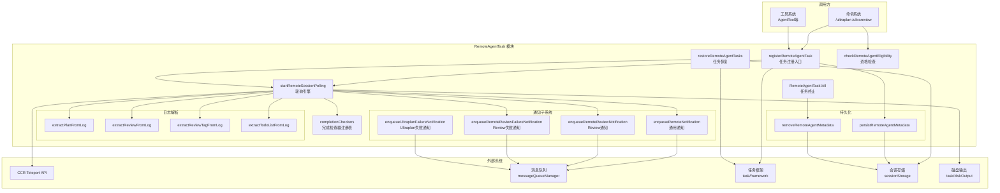
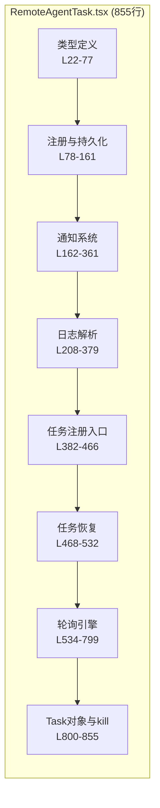
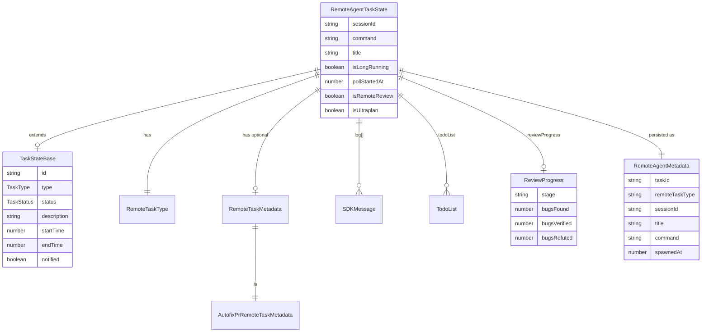
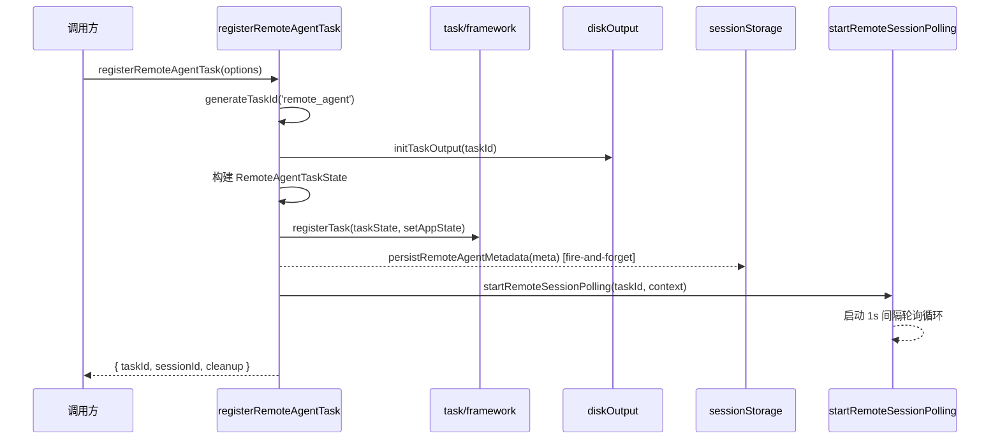
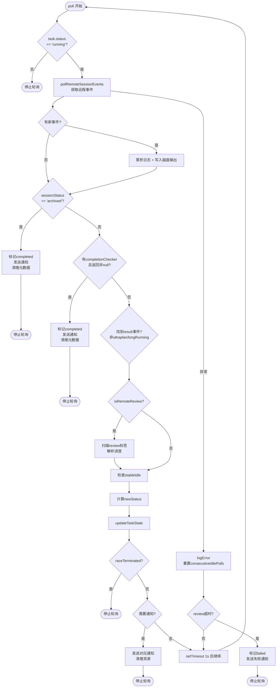
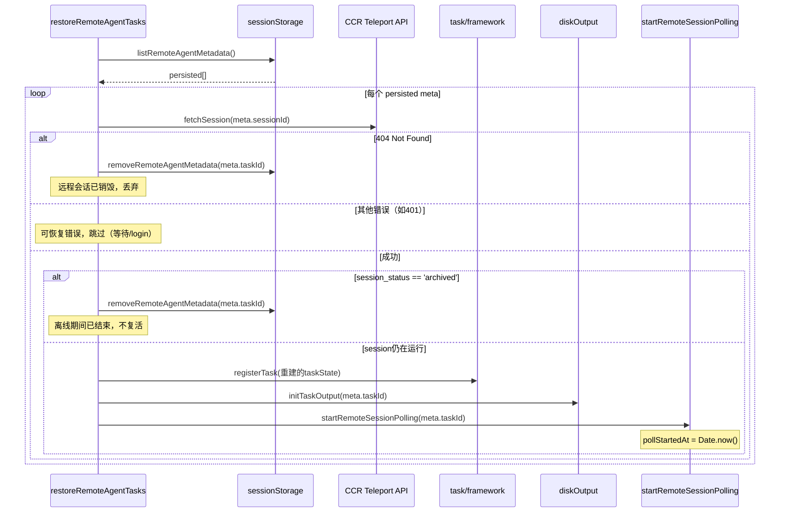
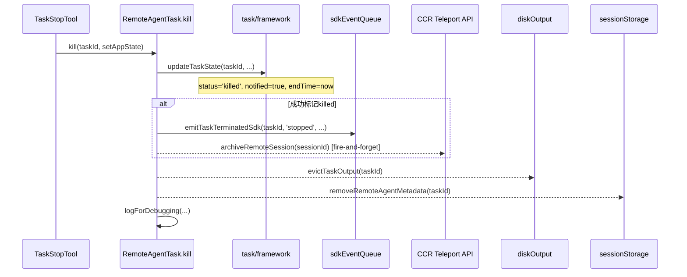
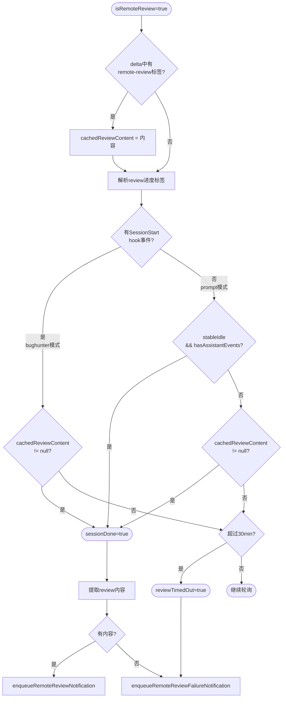
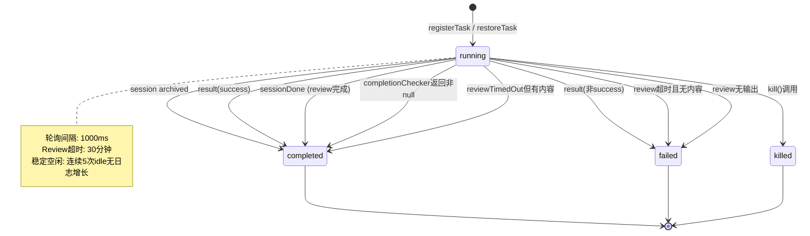

# RemoteAgentTask 子模块设计文档

## 1. 文档信息

| 项目 | 内容 |
|------|------|
| **模块名称** | RemoteAgentTask |
| **文档版本** | v1.0-20260402 |
| **生成日期** | 2026-04-02 |
| **生成方式** | 代码反向工程 |
| **源文件行数** | 855 行 |
| **版本来源** | @anthropic-ai/claude-code v2.1.88 |

---

## 2. 模块概述

### 2.1 模块职责

RemoteAgentTask 是 Claude Code 远程 Agent 任务的核心管理模块，负责：

1. **远程任务生命周期管理**：创建、注册、轮询、完成/失败/终止远程 Agent 会话
2. **远程会话状态同步**：通过轮询 CCR（Claude Cloud Runtime）API 获取远程会话事件，将远程执行状态同步到本地 AppState
3. **任务恢复**：在 `--resume` 模式下从 session sidecar 恢复尚在运行的远程任务
4. **完成通知分发**：将远程任务的完成/失败结果封装为 XML 格式通知，注入本地消息队列
5. **多种远程任务类型支持**：统一管理 `remote-agent`、`ultraplan`、`ultrareview`、`autofix-pr`、`background-pr` 五种远程任务类型

### 2.2 模块边界

- **上游**：由命令系统（如 `/ultrareview`、`/ultraplan`）或工具系统调用 `registerRemoteAgentTask` 创建任务
- **下游**：通过 `enqueuePendingNotification` 将结果注入消息队列，由本地模型在下一轮对话中处理
- **外部依赖**：依赖 CCR Teleport API 进行远程会话的事件轮询和归档

---

## 3. 架构设计

### 3.1 模块架构图



### 3.2 源文件组织



### 3.3 外部依赖表

| 依赖模块 | 导入路径 | 用途 |
|----------|----------|------|
| `@anthropic-ai/sdk` | `@anthropic-ai/sdk/resources` | `ToolUseBlock` 类型 |
| `constants/product` | `../../constants/product.js` | `getRemoteSessionUrl` 构建会话URL |
| `constants/xml` | `../../constants/xml.js` | XML标签常量（8个标签） |
| `Task` | `../../Task.js` | `Task`、`TaskStateBase`、`TaskContext`、`SetAppState` 类型与工厂函数 |
| `TodoWriteTool` | `../../tools/TodoWriteTool/TodoWriteTool.js` | 解析 TodoList 的 Schema |
| `background/remote` | `../../utils/background/remote/remoteSession.js` | 远程会话资格检查 |
| `debug` | `../../utils/debug.js` | 调试日志 |
| `log` | `../../utils/log.js` | 错误日志 |
| `messageQueueManager` | `../../utils/messageQueueManager.js` | 消息队列入队 |
| `messages` | `../../utils/messages.js` | XML标签提取、文本内容提取 |
| `sdkEventQueue` | `../../utils/sdkEventQueue.js` | SDK事件发射（任务终止） |
| `sessionStorage` | `../../utils/sessionStorage.js` | 远程Agent元数据CRUD |
| `slowOperations` | `../../utils/slowOperations.js` | JSON序列化 |
| `task/diskOutput` | `../../utils/task/diskOutput.js` | 磁盘输出管理（初始化/追加/淘汰/路径） |
| `task/framework` | `../../utils/task/framework.js` | 任务注册与状态更新 |
| `teleport/api` | `../../utils/teleport/api.js` | `fetchSession` 获取远程会话信息 |
| `teleport` | `../../utils/teleport.js` | `pollRemoteSessionEvents`、`archiveRemoteSession` |
| `todo/types` | `../../utils/todo/types.js` | `TodoList` 类型 |
| `ultraplan/ccrSession` | `../../utils/ultraplan/ccrSession.js` | `UltraplanPhase` 类型 |

---

## 4. 数据结构设计

### 4.1 核心数据结构

#### 4.1.1 RemoteAgentTaskState（L22-59）

```typescript
export type RemoteAgentTaskState = TaskStateBase & {
  type: 'remote_agent';
  remoteTaskType: RemoteTaskType;
  remoteTaskMetadata?: RemoteTaskMetadata;
  sessionId: string;
  command: string;
  title: string;
  todoList: TodoList;
  log: SDKMessage[];
  isLongRunning?: boolean;
  pollStartedAt: number;
  isRemoteReview?: boolean;
  reviewProgress?: {
    stage?: 'finding' | 'verifying' | 'synthesizing';
    bugsFound: number;
    bugsVerified: number;
    bugsRefuted: number;
  };
  isUltraplan?: boolean;
  ultraplanPhase?: Exclude<UltraplanPhase, 'running'>;
};
```

| 字段 | 类型 | 说明 |
|------|------|------|
| `type` | `'remote_agent'` | 固定任务类型标识 |
| `remoteTaskType` | `RemoteTaskType` | 远程任务子类型（5种） |
| `remoteTaskMetadata` | `RemoteTaskMetadata?` | 任务特定元数据（PR号、仓库等） |
| `sessionId` | `string` | CCR远程会话ID，用于API调用 |
| `command` | `string` | 发起远程任务的命令文本 |
| `title` | `string` | 任务标题，用于通知和UI展示 |
| `todoList` | `TodoList` | 从远程日志解析的TodoWriteTool待办事项 |
| `log` | `SDKMessage[]` | 累积的远程会话事件日志 |
| `isLongRunning` | `boolean?` | 长期运行标志，不在首次result时完成 |
| `pollStartedAt` | `number` | 轮询开始时间戳，用于超时计算 |
| `isRemoteReview` | `boolean?` | 是否为远程代码审查任务 |
| `reviewProgress` | `object?` | Review进度（阶段、发现/验证/反驳的bug数） |
| `isUltraplan` | `boolean?` | 是否为Ultraplan任务 |
| `ultraplanPhase` | `UltraplanPhase?` | Ultraplan阶段（`needs_input` 或 `plan_ready`） |

#### 4.1.2 RemoteTaskType（L60-61）

```typescript
const REMOTE_TASK_TYPES = ['remote-agent', 'ultraplan', 'ultrareview', 'autofix-pr', 'background-pr'] as const;
export type RemoteTaskType = (typeof REMOTE_TASK_TYPES)[number];
```

| 值 | 说明 |
|----|------|
| `remote-agent` | 通用远程Agent任务 |
| `ultraplan` | 远程计划生成任务 |
| `ultrareview` | 远程代码审查任务 |
| `autofix-pr` | 自动修复PR任务 |
| `background-pr` | 后台PR任务 |

#### 4.1.3 AutofixPrRemoteTaskMetadata（L65-70）

```typescript
export type AutofixPrRemoteTaskMetadata = {
  owner: string;
  repo: string;
  prNumber: number;
};
export type RemoteTaskMetadata = AutofixPrRemoteTaskMetadata;
```

#### 4.1.4 RemoteAgentPreconditionResult（L114-119）

```typescript
export type RemoteAgentPreconditionResult = 
  | { eligible: true }
  | { eligible: false; errors: BackgroundRemoteSessionPrecondition[] };
```

#### 4.1.5 RemoteTaskCompletionChecker（L77）

```typescript
export type RemoteTaskCompletionChecker = (
  remoteTaskMetadata: RemoteTaskMetadata | undefined
) => Promise<string | null>;
```

### 4.2 数据关系图



---

## 5. 接口设计

### 5.1 对外接口（Export API）

#### 5.1.1 `registerRemoteAgentTask(options)` — L386-466

**职责**：注册远程Agent任务的统一入口，封装任务ID生成、输出初始化、状态创建、注册和轮询启动。

```typescript
export function registerRemoteAgentTask(options: {
  remoteTaskType: RemoteTaskType;
  session: { id: string; title: string };
  command: string;
  context: TaskContext;
  toolUseId?: string;
  isRemoteReview?: boolean;
  isUltraplan?: boolean;
  isLongRunning?: boolean;
  remoteTaskMetadata?: RemoteTaskMetadata;
}): { taskId: string; sessionId: string; cleanup: () => void }
```

| 参数 | 类型 | 必填 | 说明 |
|------|------|------|------|
| `remoteTaskType` | `RemoteTaskType` | 是 | 远程任务子类型 |
| `session` | `{id, title}` | 是 | CCR会话ID和标题 |
| `command` | `string` | 是 | 发起命令 |
| `context` | `TaskContext` | 是 | 任务上下文（状态读写+abort） |
| `toolUseId` | `string` | 否 | 关联的工具调用ID |
| `isRemoteReview` | `boolean` | 否 | 标记为远程审查 |
| `isUltraplan` | `boolean` | 否 | 标记为Ultraplan |
| `isLongRunning` | `boolean` | 否 | 标记为长期运行 |
| `remoteTaskMetadata` | `RemoteTaskMetadata` | 否 | PR等元数据 |

**返回值**：`{ taskId, sessionId, cleanup }` — cleanup函数调用后停止轮询。

#### 5.1.2 `restoreRemoteAgentTasks(context)` — L477-483

**职责**：在 `--resume` 模式下从 sidecar 恢复远程任务。

```typescript
export async function restoreRemoteAgentTasks(context: TaskContext): Promise<void>
```

| 参数 | 类型 | 说明 |
|------|------|------|
| `context` | `TaskContext` | 任务上下文 |

#### 5.1.3 `checkRemoteAgentEligibility(options?)` — L124-141

**职责**：检查创建远程Agent会话的前置条件。

```typescript
export async function checkRemoteAgentEligibility(
  options?: { skipBundle?: boolean }
): Promise<RemoteAgentPreconditionResult>
```

**返回值**：`{ eligible: true }` 或 `{ eligible: false, errors: [...] }`。

#### 5.1.4 `formatPreconditionError(error)` — L146-161

**职责**：将前置条件错误格式化为用户可读文本。

```typescript
export function formatPreconditionError(error: BackgroundRemoteSessionPrecondition): string
```

支持的错误类型：`not_logged_in`、`no_remote_environment`、`not_in_git_repo`、`no_git_remote`、`github_app_not_installed`、`policy_blocked`。

#### 5.1.5 `registerCompletionChecker(remoteTaskType, checker)` — L84-86

**职责**：为特定远程任务类型注册完成检查器，在每次轮询时调用。

```typescript
export function registerCompletionChecker(
  remoteTaskType: RemoteTaskType,
  checker: RemoteTaskCompletionChecker
): void
```

#### 5.1.6 `extractPlanFromLog(log)` — L208-218

**职责**：从远程会话日志中提取 `<ultraplan>` 标签内容。

```typescript
export function extractPlanFromLog(log: SDKMessage[]): string | null
```

#### 5.1.7 `enqueueUltraplanFailureNotification(...)` — L225-239

**职责**：发送Ultraplan特定失败通知（不引导模型读取原始输出文件）。

```typescript
export function enqueueUltraplanFailureNotification(
  taskId: string, sessionId: string, reason: string, setAppState: SetAppState
): void
```

#### 5.1.8 `getRemoteTaskSessionUrl(sessionId)` — L853-855

**职责**：获取远程会话的claude.ai URL。

```typescript
export function getRemoteTaskSessionUrl(sessionId: string): string
```

#### 5.1.9 `RemoteAgentTask` — L808-848

**职责**：Task接口实现，提供 `kill` 方法。

```typescript
export const RemoteAgentTask: Task = {
  name: 'RemoteAgentTask',
  type: 'remote_agent',
  async kill(taskId, setAppState) { ... }
}
```

---

## 6. 核心流程设计

### 6.1 任务注册与启动流程



### 6.2 轮询与状态同步流程



### 6.3 任务恢复流程（--resume）



### 6.4 任务终止流程（kill）



### 6.5 远程Review完成判定流程



---

## 7. 状态管理

### 7.1 状态定义

任务状态由 `TaskStatus` 类型定义（继承自 `TaskStateBase`）：

| 状态 | 含义 | 触发条件 |
|------|------|----------|
| `running` | 远程会话执行中 | 初始注册时设置 |
| `completed` | 任务成功完成 | result(success)/sessionDone/archived/completionChecker |
| `failed` | 任务执行失败 | result(非success)/review超时/review无输出 |
| `killed` | 被用户手动终止 | 通过 `kill()` 方法 |

注意：代码中虽计算了 `'starting'` 状态（L687），但在写入 AppState 时被映射为 `'running'`（L710）。

### 7.2 状态转换图



### 7.3 轮询状态变量

轮询引擎内部维护以下闭包变量（L539-551）：

| 变量 | 类型 | 初始值 | 说明 |
|------|------|--------|------|
| `isRunning` | `boolean` | `true` | 控制轮询循环，cleanup时置false |
| `consecutiveIdlePolls` | `number` | `0` | 连续idle无日志增长的轮询次数 |
| `lastEventId` | `string \| null` | `null` | 上次事件ID，用于增量拉取 |
| `accumulatedLog` | `SDKMessage[]` | `[]` | 累积的全量日志 |
| `cachedReviewContent` | `string \| null` | `null` | 缓存的review内容，避免重复扫描 |

**稳定空闲检测**：当 `consecutiveIdlePolls >= STABLE_IDLE_POLLS(5)` 时认为远程会话真正空闲。这是因为远程会话在工具调用之间会短暂进入 idle 状态（L543-545）。

---

## 8. 错误处理设计

### 8.1 错误处理策略

| 场景 | 处理方式 | 代码位置 |
|------|----------|----------|
| **元数据持久化失败** | fire-and-forget，记录调试日志，不阻塞主流程 | L92-98, L105-111 |
| **轮询API异常** | 记录错误，重置idle计数器，继续轮询 | L760-783 |
| **轮询中review超时** | 即使API失败也检查超时，防止永久轮询 | L768-780 |
| **任务恢复fetchSession 404** | 从sidecar删除元数据，不复活该任务 | L498-500 |
| **任务恢复fetchSession其他错误** | 视为可恢复错误（如需/login），跳过但不删除 | L501-503 |
| **kill竞态** | `raceTerminated`标志防止轮询覆盖已被kill的状态 | L693-720 |
| **重复通知** | `markTaskNotified` 原子标记防止重复发送 | L189-202 |
| **进度JSON解析失败** | 静默忽略，不影响轮询 | L650 |

### 8.2 竞态保护设计

轮询引擎通过 `raceTerminated` 模式（L693-720）保护状态一致性：

```typescript
// L694-698
let raceTerminated = false;
updateTaskState<RemoteAgentTaskState>(taskId, context.setAppState, prevTask => {
  if (prevTask.status !== 'running') {
    raceTerminated = true;
    return prevTask;  // 不覆盖terminal状态
  }
  // ... 正常更新
});
if (raceTerminated) return;  // 停止轮询，不发通知
```

这防止了以下场景：`kill()` 将状态设为 `killed` 并标记 `notified=true`，同时轮询正在执行 `pollRemoteSessionEvents`。如果轮询先检查到 running 再更新，会覆盖 killed 状态。通过在 `updateTaskState` 回调中检查当前状态解决此问题。

### 8.3 通知去重机制

```typescript
// L189-202: markTaskNotified
function markTaskNotified(taskId: string, setAppState: SetAppState): boolean {
  let shouldEnqueue = false;
  updateTaskState(taskId, setAppState, task => {
    if (task.notified) return task;  // 已通知，跳过
    shouldEnqueue = true;
    return { ...task, notified: true };  // 原子翻转
  });
  return shouldEnqueue;
}
```

所有通知函数（`enqueueRemoteNotification`、`enqueueRemoteReviewNotification`、`enqueueRemoteReviewFailureNotification`、`enqueueUltraplanFailureNotification`）都通过 `markTaskNotified` 前置检查。

---

## 9. 设计评估

### 9.1 优点

1. **统一的任务生命周期管理**：`registerRemoteAgentTask` 封装了 ID生成、输出初始化、状态注册、元数据持久化、轮询启动的完整流程，调用方无需关心细节。

2. **健壮的竞态保护**：`raceTerminated` 模式和 `markTaskNotified` 原子标记有效防止了 kill/poll 竞态和重复通知。

3. **稳定空闲检测**：`STABLE_IDLE_POLLS=5` 的设计巧妙应对了远程会话在工具调用间短暂 idle 的问题，避免误判完成。

4. **优雅的会话恢复**：`--resume` 模式能从 sidecar 恢复仍在运行的远程任务，且正确处理 404（已销毁）、archived（已完成）、auth错误（可恢复）三种边界情况。

5. **增量日志处理**：通过 `lastEventId` 增量拉取、`cachedReviewContent` 缓存和 delta-only 扫描，避免了每次轮询的全量日志遍历。

6. **fire-and-forget 持久化**：元数据持久化失败不会阻塞主流程，符合"最坏情况丢失恢复能力而非阻塞执行"的设计哲学。

### 9.2 缺点与风险

1. **单文件过大**：855行单文件包含类型定义、通知系统、日志解析、轮询引擎、任务恢复等多个关注点，职责过于集中。

2. **轮询间隔硬编码**：`POLL_INTERVAL_MS=1000` 和 `REMOTE_REVIEW_TIMEOUT_MS=30*60*1000` 等常量硬编码在函数闭包内，无法通过配置调整。

3. **completionChecker全局状态**：`completionCheckers` 是模块级 `Map`（L78），没有作用域隔离，存在多会话场景下的潜在冲突。

4. **远程Review完成判定复杂**：bughunter 模式和 prompt 模式的完成信号不同（hook_progress vs stableIdle），判定逻辑（L660-687）嵌套条件较深，可读性差。

5. **日志累积的内存占用**：`accumulatedLog` 在轮询生命周期内持续增长（L568），对于长期运行的任务可能消耗大量内存。

6. **缺少重试策略**：轮询API失败后直接进入下一个 `setTimeout`，对于网络闪断等暂时性故障没有指数退避机制。

### 9.3 改进建议

1. **模块拆分**：将日志解析（`extractPlanFromLog`、`extractReviewFromLog` 等）、通知系统、轮询引擎拆分为独立文件，降低单文件复杂度。

2. **配置外部化**：将轮询间隔、超时时长、稳定空闲阈值等提取为可配置参数，支持不同环境的调优。

3. **引入指数退避**：在 API 失败后逐步增加轮询间隔（如 1s -> 2s -> 4s -> 最大30s），减少对 CCR 的压力。

4. **日志窗口化**：对 `accumulatedLog` 引入滑动窗口或分页机制，保留最近 N 条完整事件 + 早期摘要，控制内存增长。

5. **抽象完成判定策略**：将 Review 完成判定逻辑封装为策略对象（类似 `completionCheckers`），将 bughunter 和 prompt 模式的差异从轮询主循环中解耦。
