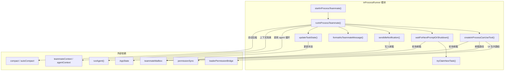
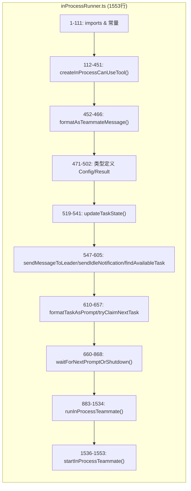
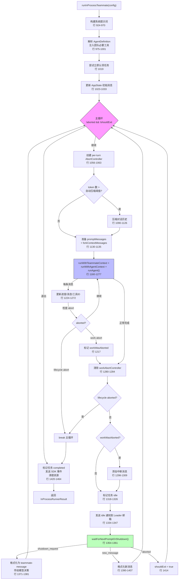
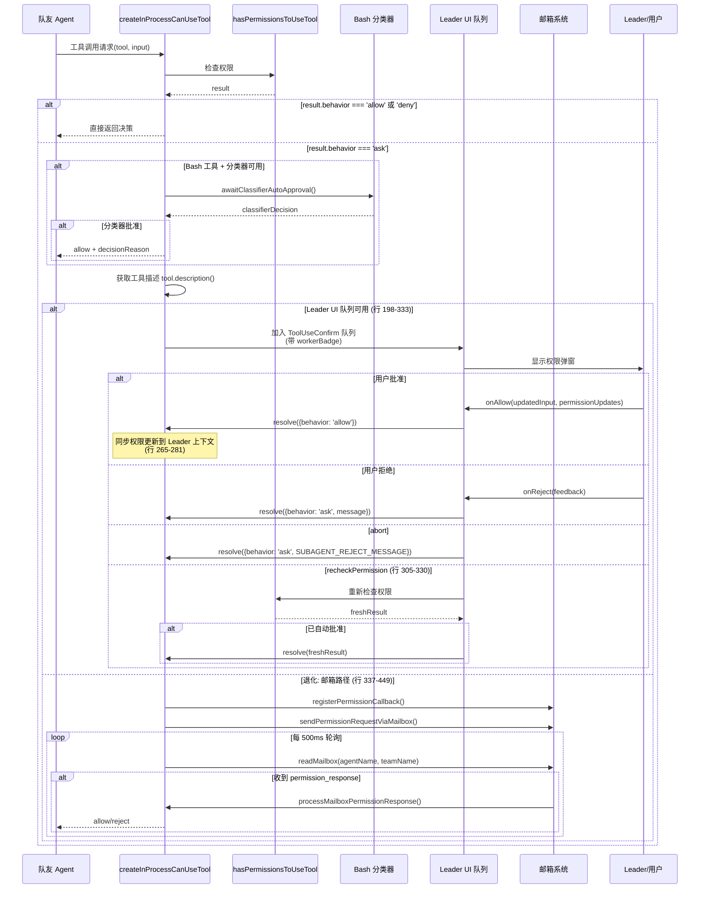
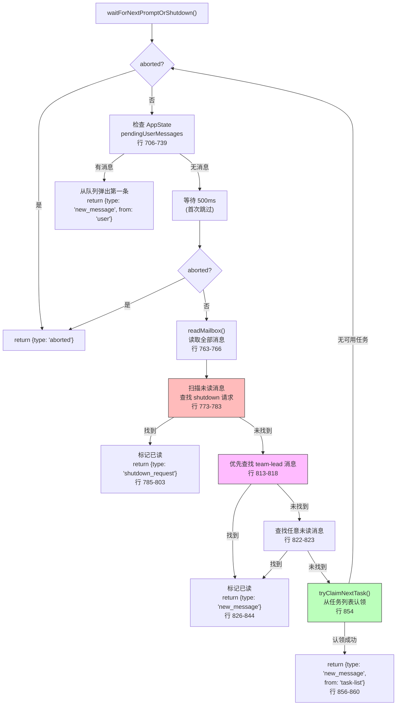
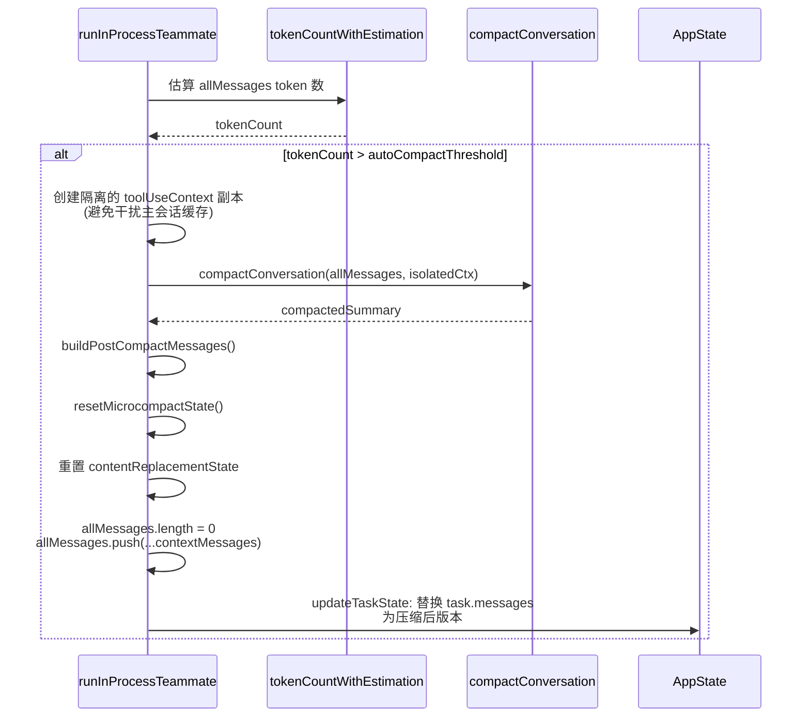
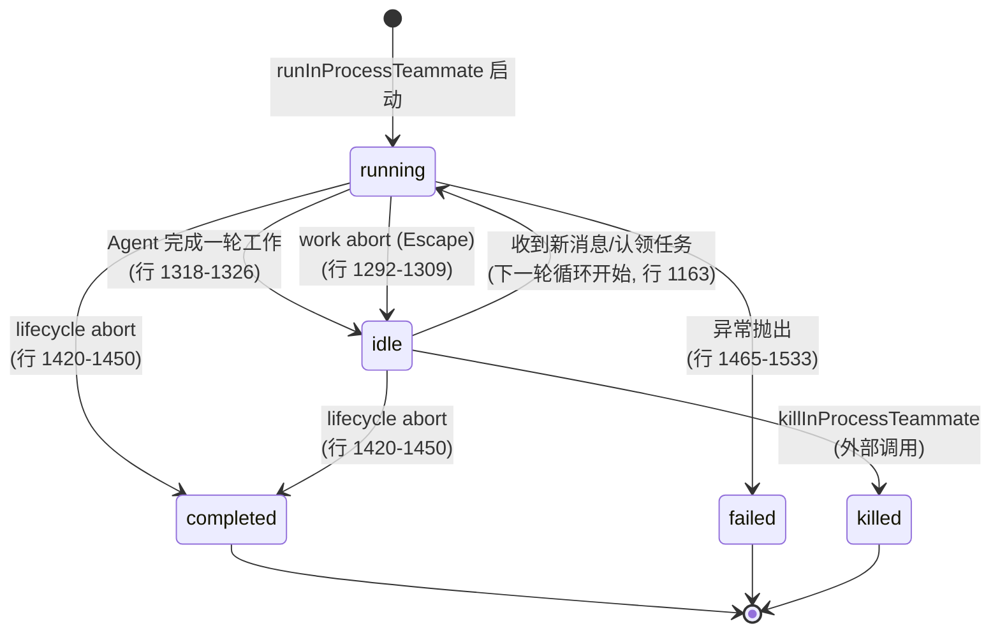

# inProcessRunner 子模块设计文档

## 1. 文档信息

| 项目 | 内容 |
|------|------|
| 模块名称 | `inProcessRunner` — 进程内队友执行引擎 |
| 文档版本 | v1.0-20260402 |
| 生成日期 | 2026-04-02 |
| 生成方式 | 代码反向工程 |
| 源文件行数 | 1553 行 |
| 版本来源 | @anthropic-ai/claude-code v2.1.88 |

---

## 2. 模块概述

### 2.1 模块职责

`inProcessRunner` 是 Claude Code 多 Agent 协作（Swarm）架构中**进程内队友**的核心执行引擎。与基于 tmux 进程的队友不同，进程内队友运行在与 Leader 相同的 Node.js 进程中，共享内存空间。本模块的核心职责包括：

1. **Agent 生命周期管理**：以持续循环方式运行队友，完成一轮工作后进入空闲等待，接收新指令后再次执行，直至被关闭或中止
2. **权限请求协调**：为队友创建 `canUseTool` 函数，通过两种路径（Leader UI 队列 / 邮箱系统）将权限请求代理到 Leader 审批
3. **上下文隔离**：通过 `AsyncLocalStorage`（`runWithTeammateContext` / `runWithAgentContext`）实现队友级别的上下文隔离
4. **进度追踪与状态同步**：实时更新 `AppState` 中的任务状态，供 UI 层显示
5. **消息通信**：通过文件邮箱系统与 Leader 及其他队友通信
6. **任务认领**：自动从共享任务列表中认领待办任务

### 2.2 模块边界

```
┌────────────────────────────────────────────────────────────────┐
│                    inProcessRunner 模块                        │
│                                                                │
│  输入侧:                                                      │
│  - InProcessRunnerConfig (由 TeamCreateTool spawn 调用)         │
│  - 邮箱消息 (Leader/队友发送的指令/关闭请求)                      │
│  - 任务列表中的待办任务                                         │
│                                                                │
│  输出侧:                                                       │
│  - AppState 任务状态更新 (进度/空闲/完成/失败)                    │
│  - 邮箱空闲通知 (通知 Leader 队友已完成)                          │
│  - SDK 事件 (task_started / task_terminated)                    │
│  - InProcessRunnerResult (成功/失败 + 消息历史)                  │
│                                                                │
│  不负责:                                                        │
│  - 队友的创建/注册（由 InProcessTeammateTask 负责）               │
│  - 邮箱的底层读写（由 teammateMailbox 模块负责）                  │
│  - API 调用（由 runAgent → query 链路负责）                      │
└────────────────────────────────────────────────────────────────┘
```

---

## 3. 架构设计

### 3.1 模块架构图



### 3.2 源文件组织



### 3.3 外部依赖表

| 依赖模块 | 导入路径 | 用途 |
|----------|---------|------|
| `runAgent` | `tools/AgentTool/runAgent.js` | Agent 主循环执行器 |
| `teammateMailbox` | `utils/teammateMailbox.js` | 文件邮箱读写、消息标记 |
| `leaderPermissionBridge` | `utils/swarm/leaderPermissionBridge.js` | 获取 Leader 的 UI 权限队列 |
| `permissionSync` | `utils/swarm/permissionSync.js` | 创建/发送权限请求 |
| `useSwarmPermissionPoller` | `hooks/useSwarmPermissionPoller.js` | 注册/注销权限回调 |
| `compact` | `services/compact/compact.js` | 对话历史压缩 |
| `autoCompact` | `services/compact/autoCompact.js` | 自动压缩阈值计算 |
| `teammateContext` | `utils/teammateContext.js` | AsyncLocalStorage 队友上下文 |
| `agentContext` | `utils/agentContext.js` | Agent 上下文（分析归因） |
| `InProcessTeammateTask` | `tasks/InProcessTeammateTask/` | 任务状态类型、消息追加 |
| `LocalAgentTask` | `tasks/LocalAgentTask/` | 进度追踪器 |
| `bashPermissions` | `tools/BashTool/bashPermissions.js` | Bash 分类器自动审批 |
| `tasks` | `utils/tasks.js` | 任务列表 CRUD |
| `tokens` | `utils/tokens.js` | Token 计数估算 |
| `prompts` | `constants/prompts.js` | 系统提示词构建 |
| `sdkEventQueue` | `utils/sdkEventQueue.js` | SDK 事件发送 |

---

## 4. 数据结构设计

### 4.1 核心数据结构

#### 4.1.1 `InProcessRunnerConfig` — 执行配置

```typescript
// 文件: inProcessRunner.ts, 行 471-502
export type InProcessRunnerConfig = {
  identity: TeammateIdentity        // 队友身份
  taskId: string                    // AppState 中的任务 ID
  prompt: string                    // 初始提示词
  agentDefinition?: CustomAgentDefinition  // 可选专用 Agent 定义
  teammateContext: TeammateContext   // AsyncLocalStorage 上下文
  toolUseContext: ToolUseContext     // 父级工具使用上下文
  abortController: AbortController  // 与父级关联的中止控制器
  model?: string                    // 可选模型覆盖
  systemPrompt?: string             // 可选系统提示词覆盖
  systemPromptMode?: 'default' | 'replace' | 'append'  // 提示词应用模式
  allowedTools?: string[]           // 自动允许的工具列表
  allowPermissionPrompts?: boolean  // 是否允许显示权限提示
  description?: string              // 任务简述
  invokingRequestId?: string        // 父 API 调用的 request_id
}
```

| 字段 | 类型 | 必填 | 说明 |
|------|------|------|------|
| `identity` | `TeammateIdentity` | 是 | 包含 agentId、agentName、teamName、color 等 |
| `taskId` | `string` | 是 | 在 AppState.tasks 中的唯一标识 |
| `prompt` | `string` | 是 | 初始用户提示词 |
| `agentDefinition` | `CustomAgentDefinition` | 否 | 自定义 Agent 配置（专用系统提示词、工具列表等） |
| `toolUseContext` | `ToolUseContext` | 是 | 继承自父级的工具执行上下文 |
| `abortController` | `AbortController` | 是 | 生命周期级中止控制器 |
| `systemPromptMode` | enum | 否 | `'replace'` 替换默认提示词，`'append'` 追加到默认提示词后 |
| `allowedTools` | `string[]` | 否 | 不在列表中的工具将被自动拒绝 |
| `allowPermissionPrompts` | `boolean` | 否 | 默认 `true`，为 `false` 时未列出工具自动拒绝 |

#### 4.1.2 `InProcessRunnerResult` — 执行结果

```typescript
// 文件: inProcessRunner.ts, 行 507-514
export type InProcessRunnerResult = {
  success: boolean       // 执行是否成功
  error?: string         // 失败时的错误信息
  messages: Message[]    // Agent 产生的全部消息
}
```

#### 4.1.3 `WaitResult` — 等待结果（内部类型）

```typescript
// 文件: inProcessRunner.ts, 行 662-677
type WaitResult =
  | { type: 'shutdown_request'; request: ...; originalMessage: string }
  | { type: 'new_message'; message: string; from: string; color?: string; summary?: string }
  | { type: 'aborted' }
```

| 变体 | 触发条件 | 后续处理 |
|------|---------|---------|
| `shutdown_request` | 邮箱中收到关闭请求 | 将请求传给模型决策 |
| `new_message` | 邮箱中收到新消息或认领到任务 | 作为新提示词进入下一轮循环 |
| `aborted` | AbortController 信号触发 | 退出主循环 |

### 4.2 数据关系图

```mermaid
erDiagram
    InProcessRunnerConfig ||--|| TeammateIdentity : contains
    InProcessRunnerConfig ||--o| CustomAgentDefinition : "optional"
    InProcessRunnerConfig ||--|| ToolUseContext : references
    InProcessRunnerConfig ||--|| TeammateContext : references
    InProcessRunnerConfig ||--|| AbortController : "lifecycle"

    InProcessTeammateTaskState ||--|| TeammateIdentity : stores
    InProcessTeammateTaskState ||--o| AbortController : "lifecycle abort"
    InProcessTeammateTaskState ||--o| AbortController : "work abort"
    InProcessTeammateTaskState ||--o{ Message : "messages[]"
    InProcessTeammateTaskState ||--o| AgentProgress : progress

    runInProcessTeammate ||--|{ Message : "produces allMessages"
    runInProcessTeammate ||--|| InProcessRunnerResult : returns
    runInProcessTeammate }|--|| AppState : "updates via setAppState"

    WaitResult ||--o| TeammateMessage : "from mailbox"
    WaitResult ||--o| Task : "from task list"
```



---

## 5. 接口设计

### 5.1 对外接口（Export API）

#### 5.1.1 `startInProcessTeammate(config)`

```typescript
// 文件: inProcessRunner.ts, 行 1544-1552
export function startInProcessTeammate(config: InProcessRunnerConfig): void
```

| 项目 | 说明 |
|------|------|
| **职责** | 后台启动进程内队友，fire-and-forget 方式 |
| **参数** | `config: InProcessRunnerConfig` — 完整执行配置 |
| **返回值** | `void`（内部 Promise 被忽略） |
| **调用方** | `InProcessTeammateTask` 中的 spawn 逻辑 |
| **特殊处理** | 提前提取 `agentId` 避免闭包持有整个 config 对象导致内存泄漏（行 1548） |

#### 5.1.2 `runInProcessTeammate(config)`

```typescript
// 文件: inProcessRunner.ts, 行 883-1534
export async function runInProcessTeammate(
  config: InProcessRunnerConfig,
): Promise<InProcessRunnerResult>
```

| 项目 | 说明 |
|------|------|
| **职责** | 进程内队友的完整执行循环，包含多轮提示处理 |
| **参数** | `config: InProcessRunnerConfig` — 完整执行配置 |
| **返回值** | `Promise<InProcessRunnerResult>` — 包含成功状态与消息历史 |
| **生命周期** | 一直运行直到 abort 信号或 shutdown 被批准 |

### 5.2 导出类型

| 类型名 | 行号 | 说明 |
|--------|------|------|
| `InProcessRunnerConfig` | 471-502 | 执行配置 |
| `InProcessRunnerResult` | 507-514 | 执行结果 |

---

## 6. 核心流程设计

### 6.1 主循环流程

这是 `runInProcessTeammate()` 的核心逻辑，实现了"执行 -> 空闲 -> 等待消息 -> 再执行"的持续循环。



### 6.2 权限处理流程

`createInProcessCanUseTool()` 实现了双路径权限解析机制：优先使用 Leader UI 队列（直接弹窗），退化为邮箱轮询。



### 6.3 空闲等待与消息优先级流程

`waitForNextPromptOrShutdown()` 实现了带优先级的消息轮询，优先级为：内存待处理消息 > 关闭请求 > Leader 消息 > 队友消息 > 任务列表。



### 6.4 对话压缩流程

当累积 token 数超过自动压缩阈值时触发（行 1074-1126）。



---

## 7. 状态管理

### 7.1 任务状态生命周期

队友任务在 `AppState.tasks[taskId]` 中存储为 `InProcessTeammateTaskState`，由 `updateTaskState()` 工具函数（行 519-541）统一更新。



### 7.2 双层 AbortController 设计

模块采用双层中止控制策略（行 1053-1063）：

| 层级 | 控制器 | 来源 | 作用域 | 触发方式 |
|------|--------|------|--------|---------|
| 生命周期级 | `config.abortController` | 外部传入 | 整个队友生命周期 | 删除队友 / 关闭应用 |
| 工作级 | `currentWorkAbortController` | 每轮循环创建 | 单次 Agent 执行 | 用户按 Escape |

- 生命周期 abort → 退出主循环，标记 completed
- 工作 abort → 中断当前轮，添加中断消息，返回 idle 状态等待新指令

### 7.3 进度追踪

每条 Agent 消息产出时更新（行 1224-1272）：

- **AgentProgress**：通过 `createProgressTracker()` / `updateProgressFromMessage()` 追踪工具调用计数、活动描述
- **inProgressToolUseIDs**：`Set<string>` 追踪正在执行的工具 ID，assistant 消息中的 `tool_use` 块加入，`tool_result` 块移除，用于 UI 动画
- **messages**：通过 `appendCappedMessage()` 追加到 `task.messages`，保持上限（避免内存膨胀，参见 types.ts 行 98-100 注释，whale session 曾达到 36.8GB）

### 7.4 权限等待时间扣除

当队友等待权限审批时，等待时长通过 `onPermissionWaitMs` 回调累加到 `task.totalPausedMs`（行 1182-1189），从 UI 显示的经过时间中扣除，避免用户看到虚高的执行时间。

---

## 8. 错误处理设计

### 8.1 错误分类与处理

| 错误场景 | 处理位置（行号） | 处理方式 |
|----------|----------------|---------|
| Agent 执行异常 | 1465-1533 | catch 块：标记 failed、发送 idle(failed) 通知、返回 error |
| 生命周期 abort | 1204-1209, 1287-1289 | break 主循环，标记 completed |
| 工作级 abort (Escape) | 1213-1218, 1292-1309 | 添加中断消息，进入 idle |
| 邮箱读取失败 | 846-851 | 捕获异常，继续轮询 |
| 任务认领失败 | 638-656 | 记录调试日志，返回 undefined |
| 已终止的任务重复更新 | 1428-1430, 1479-1481 | `alreadyTerminal` 守卫，跳过重复操作 |
| 权限请求中 abort | 179-181, 191-193, 209-217 | 返回 `SUBAGENT_REJECT_MESSAGE` |

### 8.2 资源清理

完成或失败时的清理步骤（行 1420-1464 / 1474-1513）：

1. 调用 `task.onIdleCallbacks` 通知等待者
2. 调用 `task.unregisterCleanup()` 取消清理回调注册
3. 清空 `pendingUserMessages`、`inProgressToolUseIDs`、各 AbortController
4. `evictTaskOutput(taskId)` — 清理磁盘输出
5. `evictTerminalTask(taskId, setAppState)` — 从 AppState 中驱逐
6. `emitTaskTerminatedSdk()` — 发送 SDK 终止事件
7. `unregisterPerfettoAgent()` — 取消 Perfetto 追踪注册
8. 邮箱权限轮询的 `cleanup()`：`clearInterval` + `unregisterPermissionCallback` + 移除 abort 监听器（行 444-448）

### 8.3 内存泄漏防护

- `startInProcessTeammate` 提前提取 `agentId`，避免闭包持有整个 `config`（行 1548 注释）
- `task.messages` 使用 `appendCappedMessage()` 限制上限，防止 AppState 镜像无限增长
- 压缩后重置 `contentReplacementState`，清除陈旧的 UUID 键（行 1111-1113）
- 完成时将 `task.messages` 缩减为仅保留最后一条（行 1440）

---

## 9. 设计评估

### 9.1 优点

1. **双路径权限解析**：Leader UI 队列（同进程直接通信）和邮箱系统（文件级通信）的退化策略，确保权限处理在各种环境下都可用
2. **双层 AbortController**：优雅区分"停止当前工作"和"杀死整个队友"，Escape 键不会丢失队友上下文
3. **消息优先级机制**：shutdown > team-lead > 任意消息 > 任务认领，防止 peer-to-peer 消息淹没 Leader 指令
4. **内存管理意识**：`appendCappedMessage`、完成时缩减 messages、提前提取闭包变量、压缩后重置状态 —— 多处针对长时间运行和大规模 swarm 场景的优化
5. **上下文隔离**：通过 `AsyncLocalStorage` 实现队友级隔离，压缩使用隔离的 `toolUseContext` 副本避免干扰主会话
6. **持续循环设计**：队友完成后不退出而是进入 idle 等待，减少反复 spawn 的开销，支持多轮交互
7. **权限更新回写**：`onAllow` 中将权限更新同步到 Leader 的 `toolPermissionContext`，使用 `preserveMode` 防止 worker 的权限模式泄漏回 Leader

### 9.2 缺点与风险

1. **500ms 轮询开销**：`waitForNextPromptOrShutdown` 和权限邮箱轮询均使用 500ms 固定间隔，大规模 swarm（如 292 个 agent 的 whale session）下 I/O 压力显著。文件锁竞争可能导致延迟
2. **单文件复杂度高**：1553 行代码包含权限处理（340 行）、主循环（650 行）、等待循环（200 行）等多个关注点，可读性和可维护性存在挑战
3. **权限回调注册竞争**：邮箱路径中 `registerPermissionCallback` 和 `setInterval` 轮询存在细微的竞态窗口 —— 如果回调在第一次轮询前就被响应触发，轮询仍会继续直到下次迭代
4. **压缩隔离不完整**：虽然克隆了 `readFileState`，但 `toolUseContext` 的其他共享引用（如 `options.tools`）仍被共享，压缩逻辑如果修改这些对象可能产生副作用
5. **错误恢复有限**：Agent 执行失败直接标记为 failed 并退出，没有重试机制；邮箱读取失败仅继续轮询，不做退避
6. **`alreadyTerminal` 守卫依赖非原子操作**：`updateTaskState` 在检查 `task.status !== 'running'` 和设置新状态之间依赖 JavaScript 单线程保证，但 `setAppState` 的回调式更新语义使得并发调用可能导致状态不一致

### 9.3 改进建议

1. **事件驱动替代轮询**：使用 `fs.watch` 或进程内 `EventEmitter` 替代 500ms 轮询，特别是进程内通信完全不需要走文件系统
2. **模块拆分**：将权限处理（`createInProcessCanUseTool`）、等待循环（`waitForNextPromptOrShutdown`）、主循环（`runInProcessTeammate`）拆分为独立模块
3. **指数退避**：邮箱读取失败时采用指数退避而非固定间隔重试
4. **失败重试**：为 Agent 执行失败添加可配置的重试策略，特别是 API 瞬时错误场景
5. **压缩隔离增强**：对 `toolUseContext` 进行深度克隆或使用不可变数据结构，彻底隔离压缩过程
6. **资源限制**：为单个队友的消息历史长度、运行时间、token 消耗设置硬性上限，防止资源耗尽
