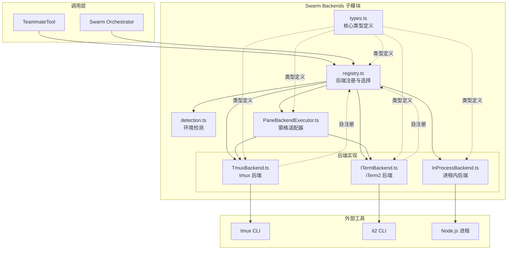
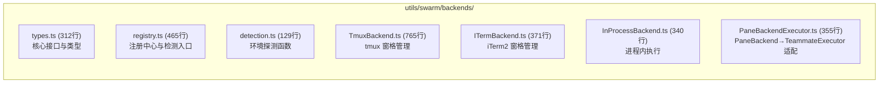
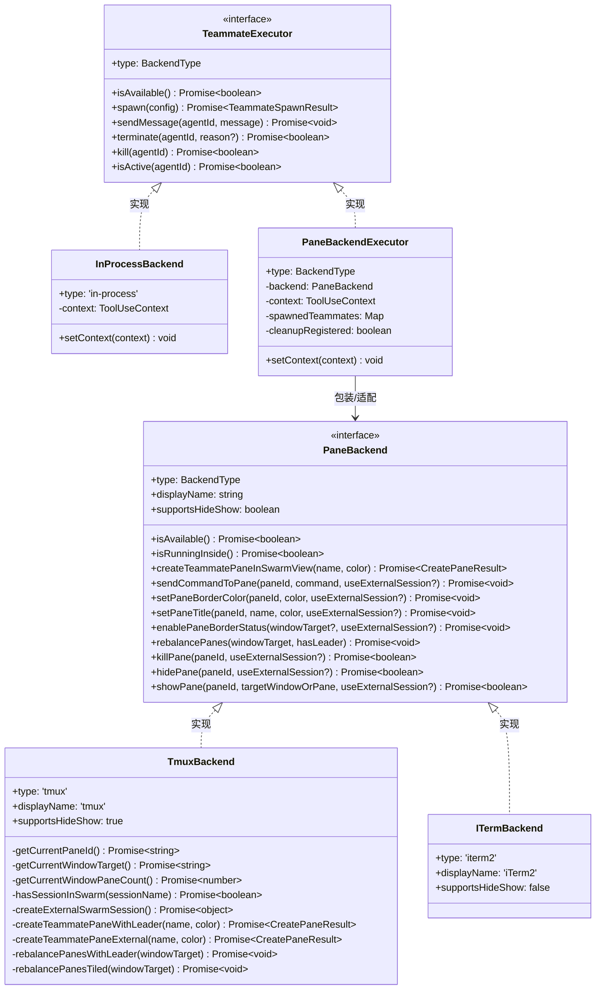
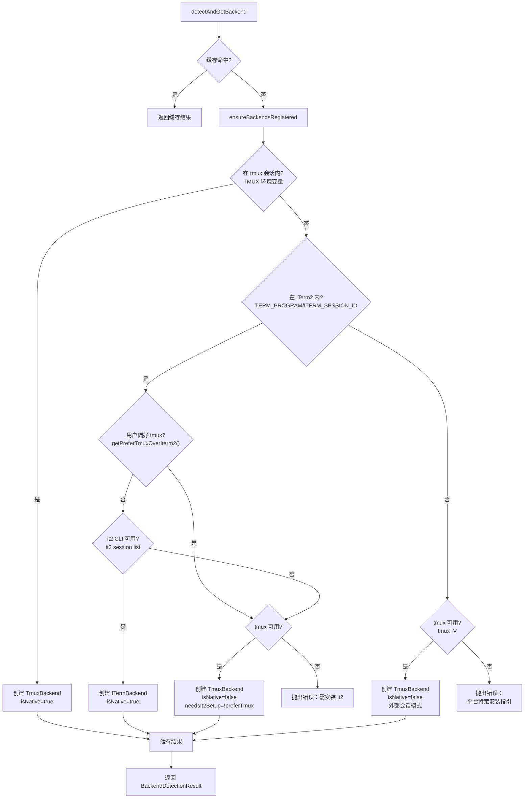
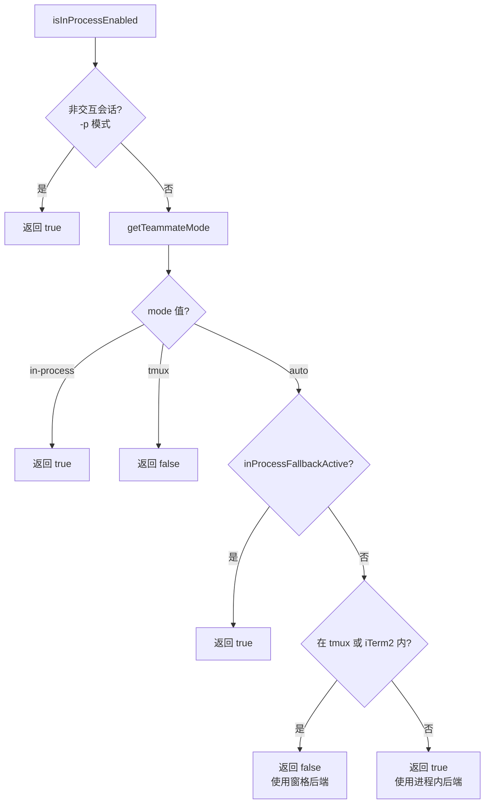
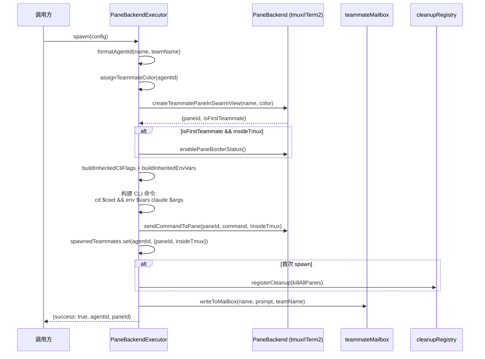
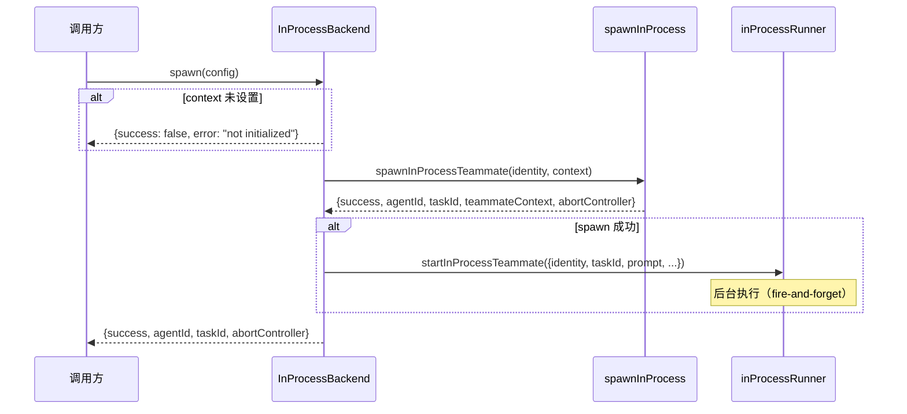
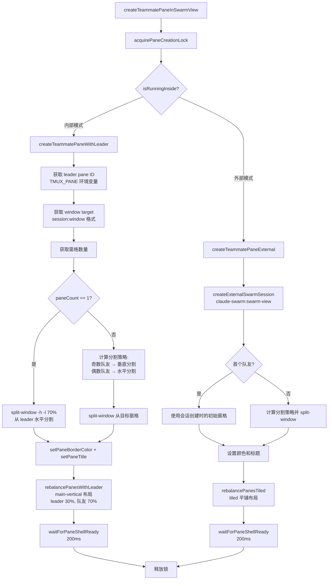
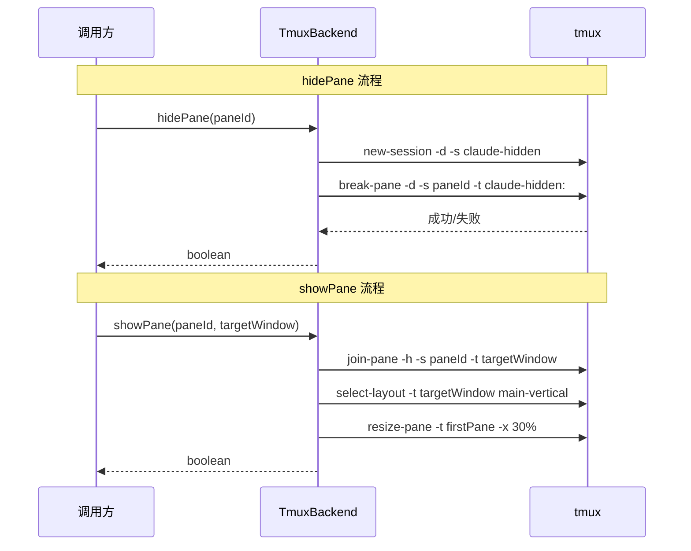

# Swarm Backends 子模块设计文档

## 1. 文档信息

| 字段 | 值 |
|------|-----|
| 模块名称 | Swarm Backends（后端注册与选择） |
| 文档版本 | v1.0-20260402 |
| 生成日期 | 2026-04-02 |
| 生成方式 | 代码反向工程 |
| 源文件行数 | 2737 行（合计） |
| 版本来源 | @anthropic-ai/claude-code v2.1.88 |

## 2. 模块概述

### 2.1 模块职责

Swarm Backends 子模块负责 Claude Code 多 Agent 协作（Swarm Mode）中队友进程的执行环境管理。其核心职责包括：

1. **后端抽象**：定义统一的 `PaneBackend` 和 `TeammateExecutor` 接口，屏蔽不同终端环境（tmux、iTerm2、进程内）的差异
2. **环境检测**：在启动时自动检测当前运行环境（是否在 tmux 会话内、是否在 iTerm2 中），确定可用的后端
3. **后端注册与选择**：通过工厂注册模式管理后端类的注册，按优先级选择最适合的后端
4. **窗格生命周期管理**：创建、布局、着色、隐藏/显示、销毁终端窗格
5. **队友生命周期管理**：生成（spawn）、消息发送、优雅终止（terminate）、强制杀死（kill）队友

### 2.2 模块边界

| 边界方向 | 交互对象 | 交互内容 |
|----------|---------|---------|
| 上游调用方 | `TeammateTool`、Swarm 编排层 | 通过 `getTeammateExecutor()` 获取执行器，调用 `spawn/sendMessage/terminate/kill` |
| 下游依赖 | tmux CLI、it2 CLI、Node.js 进程 | 通过 `execFileNoThrow` 执行外部命令 |
| 同层协作 | `spawnUtils.ts`、`teammateLayoutManager.ts`、`teammateMailbox.ts` | 构建 CLI 命令、分配颜色、文件邮箱通信 |
| 状态依赖 | `bootstrap/state.ts`、`teammateModeSnapshot.ts` | 获取会话 ID、队友模式快照 |
| 类型共享 | `AgentTool/agentColorManager.ts`、`Tool.ts` | 颜色类型、ToolUseContext |

## 3. 架构设计

### 3.1 模块架构图



### 3.2 源文件组织



### 3.3 外部依赖表

| 依赖模块 | 路径 | 用途 |
|----------|------|------|
| `execFileNoThrow` | `utils/execFileNoThrow.ts` | 安全执行外部命令（不抛异常） |
| `logForDebugging` | `utils/debug.ts` | 调试日志输出 |
| `logError` | `utils/log.ts` | 错误日志记录 |
| `sleep` | `utils/sleep.ts` | 窗格 shell 初始化等待 |
| `getPlatform` | `utils/platform.ts` | 平台检测（用于安装指引） |
| `env` | `utils/env.ts` | 环境变量检测（终端类型） |
| `agentColorManager` | `tools/AgentTool/agentColorManager.ts` | Agent 颜色类型定义 |
| `constants.ts` | `utils/swarm/constants.ts` | Swarm 常量（会话名、命令名） |
| `spawnUtils.ts` | `utils/swarm/spawnUtils.ts` | 构建 CLI 命令与环境变量 |
| `teammateMailbox.ts` | `utils/teammateMailbox.ts` | 文件邮箱读写 |
| `teammateModeSnapshot.ts` | `utils/swarm/backends/teammateModeSnapshot.ts` | 队友模式启动快照 |
| `InProcessTeammateTask` | `tasks/InProcessTeammateTask/` | 进程内队友任务管理 |
| `spawnInProcess.ts` | `utils/swarm/spawnInProcess.ts` | 进程内队友生成与销毁 |
| `inProcessRunner.ts` | `utils/swarm/inProcessRunner.ts` | 进程内队友执行循环 |
| `bootstrap/state.ts` | `bootstrap/state.ts` | 会话 ID、非交互模式检测 |
| `cleanupRegistry.ts` | `utils/cleanupRegistry.ts` | 进程退出清理注册 |
| `bash/shellQuote.ts` | `utils/bash/shellQuote.ts` | Shell 命令引号转义 |

## 4. 数据结构设计

### 4.1 核心接口和类型定义

#### 4.1.1 BackendType 与 PaneBackendType

```typescript
// types.ts:9
type BackendType = 'tmux' | 'iterm2' | 'in-process'

// types.ts:15
type PaneBackendType = 'tmux' | 'iterm2'
```

`BackendType` 枚举全部三种执行模式，`PaneBackendType` 是其子集，仅包含基于终端窗格的后端。通过类型守卫 `isPaneBackend()` (types.ts:309) 进行运行时区分。

#### 4.1.2 PaneId

```typescript
// types.ts:22
type PaneId = string
```

窗格的不透明标识符。对 tmux 为窗格 ID（如 `%1`），对 iTerm2 为会话 UUID。

#### 4.1.3 CreatePaneResult

```typescript
// types.ts:27-32
type CreatePaneResult = {
  paneId: PaneId
  isFirstTeammate: boolean  // 影响布局策略
}
```

#### 4.1.4 TeammateIdentity

```typescript
// types.ts:191-200
type TeammateIdentity = {
  name: string              // Agent 名称（如 "researcher"）
  teamName: string          // 团队名称
  color?: AgentColorName    // UI 颜色
  planModeRequired?: boolean // 是否需要计划模式审批
}
```

#### 4.1.5 TeammateSpawnConfig

```typescript
// types.ts:205-225
type TeammateSpawnConfig = TeammateIdentity & {
  prompt: string            // 初始提示词
  cwd: string               // 工作目录
  model?: string            // 模型选择
  systemPrompt?: string     // 系统提示词
  systemPromptMode?: 'default' | 'replace' | 'append'
  worktreePath?: string     // Git worktree 路径
  parentSessionId: string   // 父会话 ID
  permissions?: string[]    // 工具权限列表
  allowPermissionPrompts?: boolean // 是否允许未列出工具的权限提示
}
```

#### 4.1.6 TeammateSpawnResult

```typescript
// types.ts:230-254
type TeammateSpawnResult = {
  success: boolean
  agentId: string           // 格式: agentName@teamName
  error?: string
  abortController?: AbortController  // 仅进程内模式
  taskId?: string           // 仅进程内模式，AppState.tasks 索引
  paneId?: PaneId           // 仅窗格模式
}
```

#### 4.1.7 TeammateMessage

```typescript
// types.ts:259-270
type TeammateMessage = {
  text: string
  from: string
  color?: string
  timestamp?: string
  summary?: string          // 5-10 词 UI 预览摘要
}
```

#### 4.1.8 BackendDetectionResult

```typescript
// types.ts:173-180
type BackendDetectionResult = {
  backend: PaneBackend      // 选中的后端实例
  isNative: boolean         // 是否在原生环境内运行
  needsIt2Setup?: boolean   // iTerm2 检测到但 it2 未安装
}
```

### 4.2 类继承关系



## 5. 接口设计

### 5.1 PaneBackend 接口

`PaneBackend`（types.ts:39-168）是窗格管理的底层抽象，定义了终端窗格的全部操作原语。

| 方法 | 职责 | TmuxBackend 实现 | ITermBackend 实现 |
|------|------|-----------------|-----------------|
| `isAvailable()` | 检查后端是否可用 | 调用 `tmux -V` | 检查 iTerm2 环境 + it2 CLI |
| `isRunningInside()` | 是否在原生环境内 | 检查 `TMUX` 环境变量 | 检查 `TERM_PROGRAM` 等 |
| `createTeammatePaneInSwarmView()` | 创建队友窗格 | `split-window` / 外部会话 | `it2 session split` |
| `sendCommandToPane()` | 发送命令到窗格 | `tmux send-keys` | `it2 session run` |
| `setPaneBorderColor()` | 设置边框颜色 | `set-option pane-border-style` | No-op（性能原因） |
| `setPaneTitle()` | 设置窗格标题 | `select-pane -T` + `pane-border-format` | No-op（性能原因） |
| `enablePaneBorderStatus()` | 启用边框状态 | `set-option pane-border-status top` | No-op |
| `rebalancePanes()` | 重新均衡布局 | `select-layout main-vertical/tiled` | No-op（自动均衡） |
| `killPane()` | 关闭窗格 | `tmux kill-pane` | `it2 session close -f` |
| `hidePane()` | 隐藏窗格 | `break-pane` 到隐藏会话 | 不支持，返回 `false` |
| `showPane()` | 显示隐藏窗格 | `join-pane` 回主窗口 | 不支持，返回 `false` |

### 5.2 TeammateExecutor 接口

`TeammateExecutor`（types.ts:279-300）是队友生命周期管理的高层抽象，统一了窗格模式和进程内模式。

| 方法 | 职责 | 窗格模式（PaneBackendExecutor） | 进程内模式（InProcessBackend） |
|------|------|-------------------------------|------------------------------|
| `isAvailable()` | 检查可用性 | 委托给底层 PaneBackend | 始终返回 `true` |
| `spawn()` | 生成队友 | 创建窗格 + 发送 CLI 命令 | 调用 `spawnInProcessTeammate` + `startInProcessTeammate` |
| `sendMessage()` | 发送消息 | 写入文件邮箱 | 写入文件邮箱 |
| `terminate()` | 优雅终止 | 邮箱发送关闭请求 | 邮箱发送关闭请求 + 设置 `shutdownRequested` 标志 |
| `kill()` | 强制杀死 | `killPane()` 销毁窗格 | `AbortController.abort()` 取消异步操作 |
| `isActive()` | 检查存活 | 检查 `spawnedTeammates` Map | 检查 AppState 任务状态 + AbortController |

### 5.3 对外 API（registry.ts 导出）

| 函数 | 签名 | 用途 |
|------|------|------|
| `detectAndGetBackend()` | `() => Promise<BackendDetectionResult>` | 自动检测并返回最佳窗格后端 |
| `getBackendByType()` | `(type: PaneBackendType) => PaneBackend` | 按类型获取后端实例 |
| `getTeammateExecutor()` | `(preferInProcess?: boolean) => Promise<TeammateExecutor>` | 获取队友执行器（统一入口） |
| `getInProcessBackend()` | `() => TeammateExecutor` | 获取进程内后端（单例） |
| `isInProcessEnabled()` | `() => boolean` | 检查当前是否启用进程内模式 |
| `getResolvedTeammateMode()` | `() => 'in-process' \| 'tmux'` | 获取实际解析后的队友模式 |
| `getCachedBackend()` | `() => PaneBackend \| null` | 获取缓存的窗格后端 |
| `getCachedDetectionResult()` | `() => BackendDetectionResult \| null` | 获取缓存的检测结果 |
| `ensureBackendsRegistered()` | `() => Promise<void>` | 确保后端类已动态导入注册 |
| `markInProcessFallback()` | `() => void` | 标记已回退到进程内模式 |
| `resetBackendDetection()` | `() => void` | 重置检测缓存（测试用） |
| `registerTmuxBackend()` | `(cls) => void` | 注册 TmuxBackend 类 |
| `registerITermBackend()` | `(cls) => void` | 注册 ITermBackend 类 |

## 6. 核心流程设计

### 6.1 后端检测流程

`detectAndGetBackend()`（registry.ts:136-254）按严格优先级选择窗格后端：



**队友模式解析**（`isInProcessEnabled()`，registry.ts:351-389）：



### 6.2 队友生成流程

#### 6.2.1 PaneBackendExecutor.spawn()（PaneBackendExecutor.ts:79-209）



#### 6.2.2 InProcessBackend.spawn()（InProcessBackend.ts:72-143）



### 6.3 窗格管理流程

#### 6.3.1 TmuxBackend 窗格创建（内部 tmux 会话）



#### 6.3.2 TmuxBackend 布局策略

**内部模式布局**（有 leader）：
- 使用 `main-vertical` 布局
- Leader 窗格占左侧 30%
- 队友窗格共享右侧 70%
- 分割算法：第 N 个队友（N 从 0 开始），若 N 为奇数则垂直分割，偶数则水平分割，分割目标为 `floor((N-1)/2)` 号队友窗格

**外部模式布局**（无 leader）：
- 使用 `tiled` 平铺布局
- 所有队友窗格均等分布
- 运行在独立 tmux socket（`getSwarmSocketName()`）

#### 6.3.3 ITermBackend 窗格创建（ITermBackend.ts:114-239）

iTerm2 后端使用 `it2 session split` 创建窗格，具有死窗格自动恢复机制：

```mermaid
flowchart TD
    START[createTeammatePaneInSwarmView] --> LOCK[acquirePaneCreationLock]
    LOCK --> LOOP[while true 循环]
    LOOP --> IS_FIRST{firstPaneUsed?}
    
    IS_FIRST -->|首个队友| GET_LEADER["getLeaderSessionId()<br/>从 ITERM_SESSION_ID 提取 UUID"]
    GET_LEADER --> SPLIT_V["it2 session split -v -s leaderSessionId<br/>从 leader 垂直分割"]
    
    IS_FIRST -->|后续队友| GET_LAST["获取最后一个队友 sessionId"]
    GET_LAST --> SPLIT_H["it2 session split -s lastTeammateId<br/>从最后队友水平分割"]
    
    SPLIT_V --> CHK_RESULT{split 成功?}
    SPLIT_H --> CHK_RESULT
    
    CHK_RESULT -->|成功| PARSE["parseSplitOutput<br/>提取 session UUID"]
    CHK_RESULT -->|失败且有目标| VERIFY["it2 session list<br/>验证目标是否已死"]
    
    VERIFY --> IS_DEAD{目标确认已死?}
    IS_DEAD -->|是| PRUNE["修剪死 sessionId<br/>重置 firstPaneUsed 如需"]
    PRUNE --> LOOP
    IS_DEAD -->|否| THROW[抛出错误]
    
    PARSE --> TRACK["teammateSessionIds.push(paneId)"]
    TRACK --> RETURN[返回 {paneId, isFirstTeammate}]
    RETURN --> RELEASE[释放锁]
```

#### 6.3.4 隐藏/显示窗格（仅 TmuxBackend）



## 7. 设计模式分析

### 7.1 策略模式（Strategy Pattern）

**体现位置**：`PaneBackend` 接口 + `TmuxBackend` / `ITermBackend` 实现

策略模式在此模块中用于将窗格管理的具体算法封装到不同的后端类中。`PaneBackend` 接口定义了窗格操作的统一契约，而 `TmuxBackend` 和 `ITermBackend` 分别实现了基于 tmux CLI 和 it2 CLI 的具体策略。

registry.ts 中的 `detectAndGetBackend()` 充当策略选择器，根据运行环境动态选择最适合的策略。选择后通过缓存固定，不再改变。

**关键代码**：
```typescript
// registry.ts:136 - 策略选择
export async function detectAndGetBackend(): Promise<BackendDetectionResult> {
  // 优先级: tmux内部 > iTerm2原生 > tmux外部 > 报错
}
```

### 7.2 适配器模式（Adapter Pattern）

**体现位置**：`PaneBackendExecutor`（PaneBackendExecutor.ts:39）

`PaneBackendExecutor` 是经典的对象适配器，将底层的 `PaneBackend`（窗格操作原语）适配为高层的 `TeammateExecutor`（队友生命周期管理）。

适配映射关系：
| TeammateExecutor 方法 | 适配到 PaneBackend 操作 |
|----------------------|----------------------|
| `spawn()` | `createTeammatePaneInSwarmView()` + `sendCommandToPane()` |
| `sendMessage()` | `writeToMailbox()`（旁路，不经过 PaneBackend） |
| `terminate()` | `writeToMailbox()`（邮箱发送关闭请求） |
| `kill()` | `killPane()` |
| `isActive()` | 基于内部 Map 状态判断 |

这使得调用方可以通过统一的 `TeammateExecutor` 接口操作队友，无需关心底层是窗格模式还是进程内模式。

### 7.3 工厂注册模式（Factory Registry Pattern）

**体现位置**：registry.ts 中的后端注册机制

后端类通过模块导入时的副作用自注册到 registry：

```typescript
// TmuxBackend.ts:764 - 模块加载时自注册
registerTmuxBackend(TmuxBackend)

// ITermBackend.ts:370 - 模块加载时自注册
registerITermBackend(ITermBackend)
```

registry.ts 持有类引用（`TmuxBackendClass` / `ITermBackendClass`），通过工厂函数 `createTmuxBackend()` / `createITermBackend()` 延迟实例化。

**设计动机**：避免循环依赖。后端实现依赖 registry（调用 `register*`），registry 依赖后端类（实例化）。通过延迟动态 import（`ensureBackendsRegistered()`，registry.ts:74-79）和自注册机制打断循环。

### 7.4 其他模式

- **单例模式**：`cachedBackend`、`cachedInProcessBackend`、`cachedPaneBackendExecutor` 均为模块级缓存的单例实例
- **锁模式**：`acquirePaneCreationLock()`（TmuxBackend.ts:43-53，ITermBackend.ts:21-31）通过 Promise 链实现异步互斥锁，防止并行创建窗格时的竞态条件
- **模板方法模式**：`TmuxBackend.rebalancePanes()` 根据 `hasLeader` 参数委托到 `rebalancePanesWithLeader()` 或 `rebalancePanesTiled()` 两个不同的布局算法

## 8. 错误处理设计

### 8.1 错误分类

| 错误类型 | 来源 | 处理方式 |
|----------|------|---------|
| 后端不可用 | `detectAndGetBackend()` 无法找到可用后端 | 抛出平台特定安装指引（registry.ts:259-285） |
| 后端未注册 | `createTmuxBackend()` / `createITermBackend()` 在注册前被调用 | 抛出明确错误信息（registry.ts:107-126） |
| 窗格创建失败 | tmux `split-window` / it2 `session split` 返回非零 | 抛出 Error（TmuxBackend.ts:613，ITermBackend.ts:205） |
| 死窗格恢复 | iTerm2 分割目标已死 | 自动修剪并重试（ITermBackend.ts:185-203），有界 O(N+1) |
| 命令发送失败 | `send-keys` / `session run` 失败 | 抛出 Error（TmuxBackend.ts:160，ITermBackend.ts:260） |
| 上下文缺失 | `spawn()` 在 `setContext()` 之前调用 | 返回 `{success: false, error: "not initialized"}`（InProcessBackend.ts:74-82，PaneBackendExecutor.ts:83-91） |
| 队友未找到 | `terminate/kill/isActive` 传入未知 agentId | InProcessBackend 返回 false（InProcessBackend.ts:209），PaneBackendExecutor 返回 false（PaneBackendExecutor.ts:299） |
| agentId 格式错误 | `parseAgentId()` 解析失败 | 抛出 Error（PaneBackendExecutor.ts:223）或返回 false |

### 8.2 防御性设计

1. **环境变量捕获时机**：`ORIGINAL_USER_TMUX` 和 `ORIGINAL_TMUX_PANE` 在模块加载时捕获（detection.ts:10-19），防止后续 Shell.ts 覆盖 `process.env.TMUX` 导致误判

2. **缓存不可变性**：后端检测结果一旦缓存即固定（registry.ts:26-31），进程生命周期内不会重新检测，避免环境变化导致的不一致

3. **并发安全**：窗格创建通过异步锁（Promise 链）序列化，防止多个队友同时 spawn 导致的布局错乱

4. **清理注册**：`PaneBackendExecutor.spawn()` 首次调用时注册退出清理回调（PaneBackendExecutor.ts:164-175），确保 leader 退出时杀死所有队友窗格

5. **回退机制**：`markInProcessFallback()` 记录窗格后端不可用的回退状态，后续 spawn 直接使用进程内模式，避免重复失败

### 8.3 日志策略

全模块使用 `logForDebugging()` 进行详细的调试日志输出，覆盖：
- 环境检测结果（registry.ts:148-156）
- 后端选择决策路径（registry.ts:159-253）
- 窗格创建/销毁操作（TmuxBackend.ts:618-619，ITermBackend.ts:224-225）
- 执行器操作（PaneBackendExecutor.ts:188-189，InProcessBackend.ts:131-133）

日志前缀标识来源：`[BackendRegistry]`、`[TmuxBackend]`、`[ITermBackend]`、`[InProcessBackend]`、`[PaneBackendExecutor]`。

## 9. 设计评估

### 9.1 优点

1. **清晰的抽象层次**：`PaneBackend`（窗格原语）→ `TeammateExecutor`（生命周期管理）两层抽象，职责分离明确。调用方通过 `getTeammateExecutor()` 一个入口即可获取合适的执行器，完全屏蔽后端差异。

2. **健壮的优先级检测**：`detectAndGetBackend()` 实现了完善的五级优先级链（tmux 内 > iTerm2 原生 > tmux 回退 > tmux 外部 > 错误），包含用户偏好记忆（`getPreferTmuxOverIterm2`）和 `needsIt2Setup` 提示。

3. **并发安全设计**：异步锁机制确保窗格创建的原子性，防止并行 spawn 导致的布局问题。使用 Promise 链实现，无需引入外部锁库。

4. **自注册避免循环依赖**：后端实现在模块加载时自注册，registry 通过延迟 import 触发注册，优雅地解决了双向依赖问题。

5. **死窗格恢复**：ITermBackend 的 `createTeammatePaneInSwarmView()` 实现了完整的死窗格检测-修剪-重试循环，且有界（O(N+1)），兼顾了可靠性和安全性。

6. **统一的通信机制**：所有后端（窗格和进程内）均使用文件邮箱进行消息传递，简化了通信层设计。

### 9.2 缺点与风险

1. **模块级可变状态过多**：registry.ts 包含 6 个模块级缓存变量（cachedBackend、cachedDetectionResult、backendsRegistered、cachedInProcessBackend、cachedPaneBackendExecutor、inProcessFallbackActive），TmuxBackend.ts 有 3 个（firstPaneUsedForExternal、cachedLeaderWindowTarget、paneCreationLock），ITermBackend.ts 有 3 个。这增加了状态管理的复杂度，且难以在单元测试中充分隔离。

2. **iTerm2 后端功能不完整**：`setPaneBorderColor()`、`setPaneTitle()`、`rebalancePanes()` 均为 No-op（ITermBackend.ts:270-313），注释说明是因为"每次 it2 调用都会启动 Python 进程，太慢"。这导致 iTerm2 模式下队友窗格缺少视觉区分。

3. **isActive() 实现薄弱**：`PaneBackendExecutor.isActive()`（PaneBackendExecutor.ts:329-344）仅检查内部 Map 是否有记录，不查询窗格实际存活状态。注释承认"a more robust check would query the backend for pane existence"但未实现。

4. **硬编码延迟**：`PANE_SHELL_INIT_DELAY_MS = 200`（TmuxBackend.ts:33）是固定值，对快速 shell 配置浪费时间，对特别慢的配置可能不够。

5. **外部会话 socket 命名**：tmux 外部模式使用 `getSwarmSocketName()` 创建独立 socket，若多个 Claude 实例同时运行可能产生命名冲突（取决于 socket 名称生成逻辑）。

### 9.3 改进建议

1. **状态封装**：将 registry.ts 的模块级变量封装到一个 `BackendRegistry` 类中，支持实例化和独立测试。当前的 `resetBackendDetection()` 是为测试设计的临时方案。

2. **iTerm2 视觉增强**：考虑使用 ANSI 转义序列（而非 it2 CLI）设置窗格标题和颜色，避免 Python 进程开销。iTerm2 支持 `\033]1337;SetBadgeFormat=...` 等私有转义序列。

3. **isActive 增强**：为 `PaneBackend` 接口添加 `isPaneAlive(paneId)` 方法，TmuxBackend 可通过 `tmux list-panes` 检查，ITermBackend 可通过 `it2 session list` 验证。

4. **自适应延迟**：将 shell 初始化延迟改为探测式等待（轮询窗格是否就绪），或允许通过配置调整延迟时间。

5. **TypeScript 严格类型**：`PaneBackend` 当前定义为 `type`（types.ts:39），可考虑改为 `interface`，便于 `extends` 和类型合并。`TeammateExecutor` 同理。
