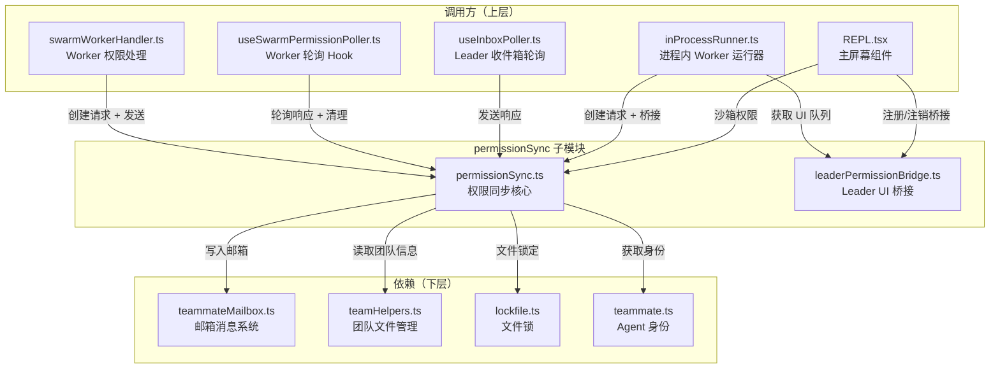
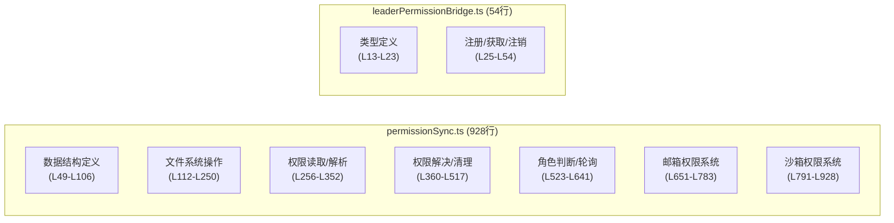
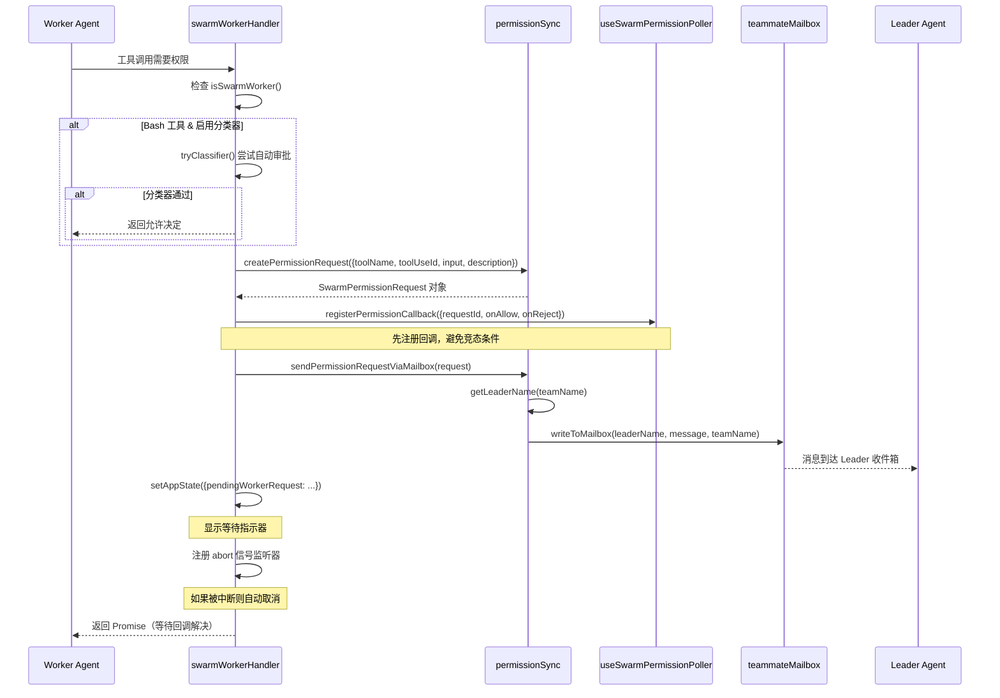
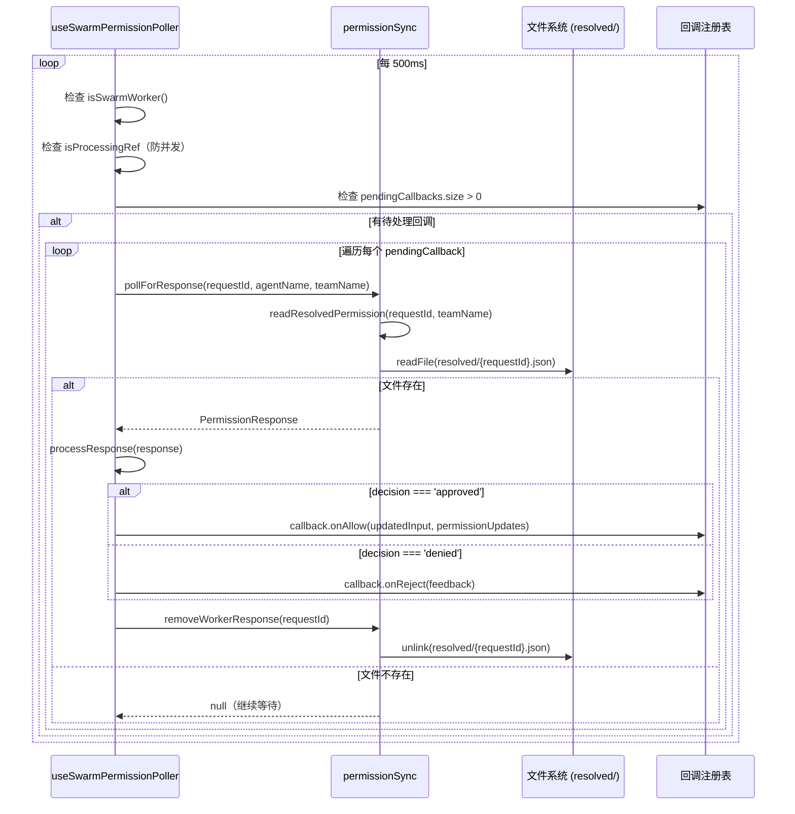
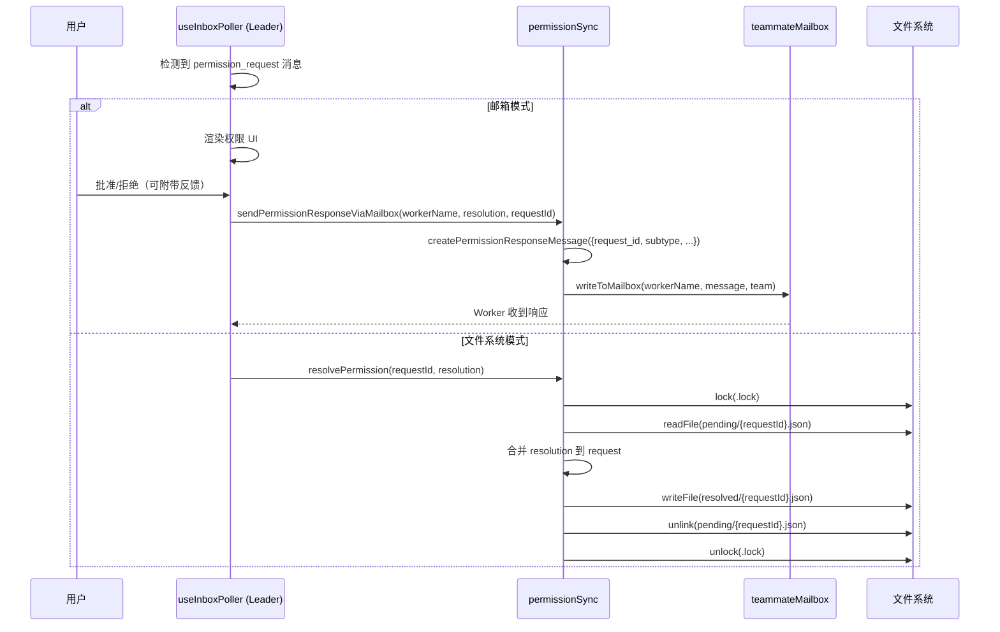
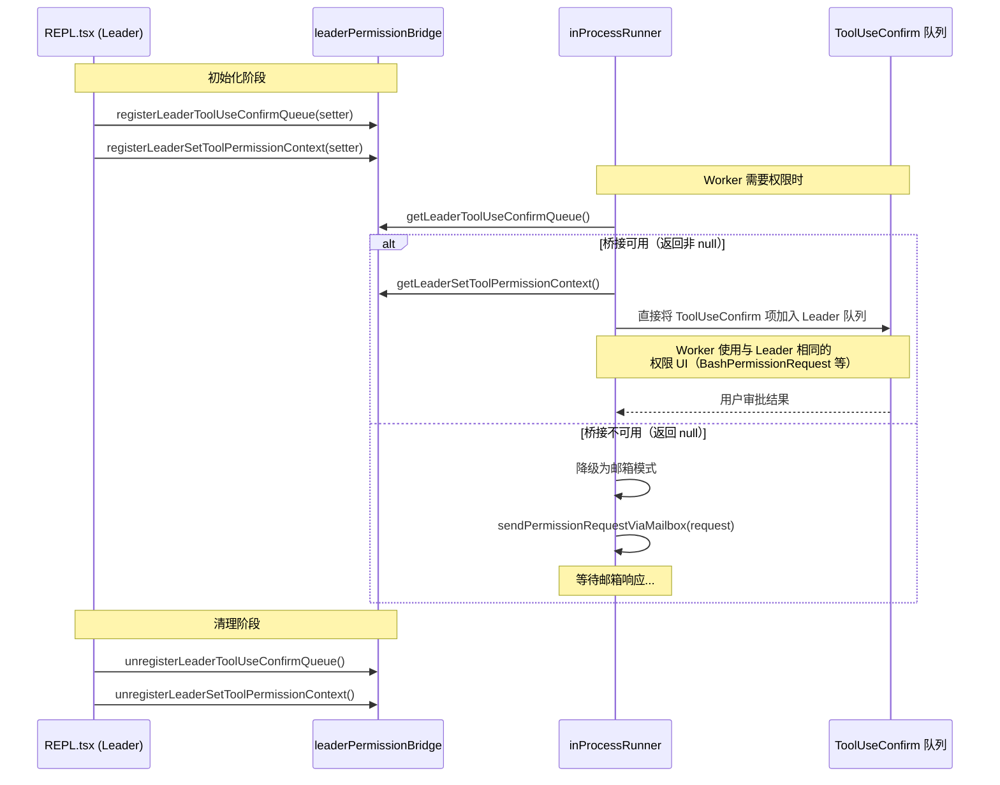
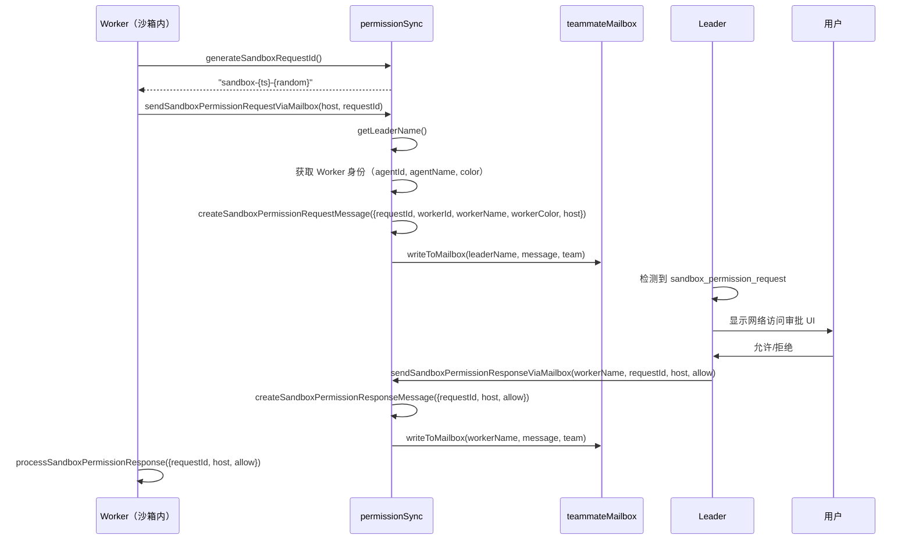

# permissionSync 子模块设计文档

## 1. 文档信息

| 项目 | 内容 |
|------|------|
| **模块名称** | permissionSync（权限同步） |
| **文档版本** | v1.0-20260402 |
| **生成日期** | 2026-04-02 |
| **生成方式** | 代码反向工程 |
| **源文件行数** | 982 行（permissionSync.ts 928行 + leaderPermissionBridge.ts 54行） |
| **版本来源** | @anthropic-ai/claude-code v2.1.88 |

---

## 2. 模块概述

### 2.1 模块职责

permissionSync 模块为 Claude Code 的多 Agent Swarm（集群）架构提供**跨进程权限同步**基础设施。当 Worker Agent 执行需要用户授权的工具调用（如 Bash、文件编辑等）时，该模块负责将权限请求转发给 Team Leader，由 Leader 端呈现 UI 供用户审批，并将审批结果回传给 Worker。

核心职责包括：

1. **权限请求创建与序列化**：构造标准化的 `SwarmPermissionRequest` 数据结构
2. **文件系统权限存储**：通过 pending/resolved 目录结构实现基于文件的权限请求/响应持久化
3. **邮箱消息权限传递**：通过 teammate mailbox 实现 Leader 与 Worker 间的权限消息路由
4. **沙箱权限管理**：处理沙箱运行时的网络访问权限请求/响应
5. **Leader 桥接**：允许进程内（in-process）Worker 直接复用 Leader 的 ToolUseConfirm UI 组件

### 2.2 模块边界

| 边界方向 | 交互对象 | 交互方式 |
|----------|----------|----------|
| 上层调用方 | `swarmWorkerHandler.ts`（权限处理器） | 调用 `createPermissionRequest` + `sendPermissionRequestViaMailbox` |
| 上层调用方 | `useSwarmPermissionPoller.ts`（轮询 Hook） | 调用 `pollForResponse` + `removeWorkerResponse` |
| 上层调用方 | `useInboxPoller.ts`（收件箱轮询） | 调用 `sendPermissionResponseViaMailbox` |
| 上层调用方 | `inProcessRunner.ts`（进程内运行器） | 调用 `createPermissionRequest` + Leader 桥接 API |
| 上层调用方 | `REPL.tsx`（主屏幕） | 注册/注销 Leader 桥接，调用沙箱权限 API |
| 下层依赖 | `teammateMailbox.ts` | 消息写入与路由 |
| 下层依赖 | `teamHelpers.ts` | 团队文件读取、目录管理 |
| 下层依赖 | `lockfile.ts` | 文件锁 |
| 下层依赖 | `teammate.ts` | Agent 身份信息获取 |

---

## 3. 架构设计

### 3.1 模块架构图



### 3.2 源文件组织



### 3.3 外部依赖表

| 依赖模块 | 导入内容 | 用途 |
|----------|----------|------|
| `fs/promises` | `mkdir`, `readdir`, `readFile`, `unlink`, `writeFile` | 文件系统操作 |
| `path` | `join` | 路径拼接 |
| `zod/v4` | `z` | 运行时数据验证 |
| `utils/debug.js` | `logForDebugging` | 调试日志 |
| `utils/errors.js` | `getErrnoCode` | 错误码提取 |
| `utils/lazySchema.js` | `lazySchema` | 延迟 Schema 初始化 |
| `utils/lockfile.js` | `lock` | 文件锁（基于 proper-lockfile） |
| `utils/log.js` | `logError` | 错误日志 |
| `utils/permissions/PermissionUpdateSchema.js` | `PermissionUpdate`（类型） | 权限更新规则类型 |
| `utils/slowOperations.js` | `jsonParse`, `jsonStringify` | JSON 序列化/反序列化 |
| `utils/teammate.js` | `getAgentId`, `getAgentName`, `getTeammateColor`, `getTeamName` | Agent 身份信息 |
| `utils/teammateMailbox.js` | `createPermissionRequestMessage`, `createPermissionResponseMessage`, `createSandboxPermissionRequestMessage`, `createSandboxPermissionResponseMessage`, `writeToMailbox` | 邮箱消息创建与发送 |
| `swarm/teamHelpers.js` | `getTeamDir`, `readTeamFileAsync` | 团队目录与文件操作 |
| `components/permissions/PermissionRequest.js` | `ToolUseConfirm`（类型） | Leader UI 权限确认组件类型（leaderPermissionBridge） |
| `Tool.js` | `ToolPermissionContext`（类型） | 工具权限上下文类型（leaderPermissionBridge） |

---

## 4. 数据结构设计

### 4.1 SwarmPermissionRequest（权限请求）

定义位置：`permissionSync.ts` L49-L86

使用 Zod Schema 进行运行时验证的核心数据结构：

```typescript
{
  id: string                           // 唯一请求ID，格式 "perm-{timestamp}-{random}"
  workerId: string                     // Worker 的 CLAUDE_CODE_AGENT_ID
  workerName: string                   // Worker 的 CLAUDE_CODE_AGENT_NAME
  workerColor?: string                 // Worker 的显示颜色
  teamName: string                     // 团队名称（用于路由）
  toolName: string                     // 需要授权的工具名（如 "Bash", "Edit"）
  toolUseId: string                    // 原始 toolUseID
  description: string                  // 工具调用的人类可读描述
  input: Record<string, unknown>       // 序列化的工具输入
  permissionSuggestions: unknown[]     // 权限规则建议
  status: 'pending' | 'approved' | 'rejected'  // 请求状态
  resolvedBy?: 'worker' | 'leader'    // 解决者
  resolvedAt?: number                  // 解决时间戳
  feedback?: string                    // 拒绝原因
  updatedInput?: Record<string, unknown>  // 修改后的输入
  permissionUpdates?: unknown[]        // "始终允许"规则
  createdAt: number                    // 创建时间戳
}
```

### 4.2 PermissionResolution（权限解决结果）

定义位置：`permissionSync.ts` L95-L106

```typescript
{
  decision: 'approved' | 'rejected'         // 审批决定
  resolvedBy: 'worker' | 'leader'          // 解决者
  feedback?: string                         // 拒绝反馈
  updatedInput?: Record<string, unknown>   // 修改后的输入
  permissionUpdates?: PermissionUpdate[]   // 权限更新规则
}
```

### 4.3 PermissionResponse（遗留轮询响应格式）

定义位置：`permissionSync.ts` L523-L536

为向后兼容 Worker 轮询代码保留的简化响应格式：

```typescript
{
  requestId: string                         // 对应请求ID
  decision: 'approved' | 'denied'          // 注意：此处用 'denied' 而非 'rejected'
  timestamp: string                         // ISO 格式时间戳
  feedback?: string                         // 拒绝反馈
  updatedInput?: Record<string, unknown>   // 修改后的输入
  permissionUpdates?: unknown[]            // 权限更新规则
}
```

### 4.4 文件系统目录结构

```
~/.claude/teams/{teamName}/permissions/
  ├── pending/                    # 待处理的权限请求
  │   ├── .lock                   # 目录级文件锁
  │   ├── perm-1234567-abc.json  # 各权限请求文件
  │   └── perm-1234568-def.json
  └── resolved/                   # 已解决的权限请求
      ├── perm-1234567-abc.json  # 已批准/拒绝的请求
      └── ...
```

### 4.5 Leader 桥接类型（leaderPermissionBridge.ts）

定义位置：`leaderPermissionBridge.ts` L16-L23

```typescript
// 设置 ToolUseConfirm 队列的函数类型
type SetToolUseConfirmQueueFn = (
  updater: (prev: ToolUseConfirm[]) => ToolUseConfirm[]
) => void

// 设置工具权限上下文的函数类型
type SetToolPermissionContextFn = (
  context: ToolPermissionContext,
  options?: { preserveMode?: boolean }
) => void
```

---

## 5. 接口设计

### 5.1 permissionSync.ts 导出 API

#### 5.1.1 数据结构与类型

| 导出名 | 类型 | 说明 |
|--------|------|------|
| `SwarmPermissionRequestSchema` | `() => ZodObject` | 延迟加载的 Zod Schema（L49-L86） |
| `SwarmPermissionRequest` | Type | Schema 推导的 TypeScript 类型（L88-L90） |
| `PermissionResolution` | Type | 权限解决结果类型（L95-L106） |
| `PermissionResponse` | Type | 遗留轮询响应类型（L523-L536） |

#### 5.1.2 核心操作函数

| 函数 | 签名 | 说明 |
|------|------|------|
| `getPermissionDir` | `(teamName: string) => string` | 获取团队权限目录路径（L112-L114） |
| `generateRequestId` | `() => string` | 生成唯一请求ID，格式 `perm-{timestamp}-{random7}`（L160-L162） |
| `createPermissionRequest` | `(params) => SwarmPermissionRequest` | 创建权限请求对象，自动填充 Agent 身份（L167-L207） |
| `writePermissionRequest` | `(request) => Promise<SwarmPermissionRequest>` | 将请求写入 pending 目录（带文件锁）（L215-L250） |
| `readPendingPermissions` | `(teamName?) => Promise<SwarmPermissionRequest[]>` | 读取所有待处理请求，按创建时间排序（L256-L312） |
| `readResolvedPermission` | `(requestId, teamName?) => Promise<SwarmPermissionRequest \| null>` | 读取指定已解决请求（L320-L352） |
| `resolvePermission` | `(requestId, resolution, teamName?) => Promise<boolean>` | 解决权限请求：写入 resolved 目录并删除 pending 文件（L360-L443） |
| `cleanupOldResolutions` | `(teamName?, maxAgeMs?) => Promise<number>` | 清理过期已解决文件，默认保留1小时（L452-L517） |
| `pollForResponse` | `(requestId, agentName?, teamName?) => Promise<PermissionResponse \| null>` | Worker 轮询：将已解决请求转为简化响应格式（L544-L564） |
| `removeWorkerResponse` | `(requestId, agentName?, teamName?) => Promise<void>` | 删除已处理的响应文件（L570-L576） |
| `deleteResolvedPermission` | `(requestId, teamName?) => Promise<boolean>` | 删除已解决的权限文件（L607-L635） |
| `submitPermissionRequest` | 等同于 `writePermissionRequest` | 向后兼容别名（L641） |

#### 5.1.3 角色判断函数

| 函数 | 签名 | 说明 |
|------|------|------|
| `isTeamLeader` | `(teamName?) => boolean` | 当前 Agent 是否为 Leader（无 agentId 或为 'team-lead'）（L581-L591） |
| `isSwarmWorker` | `() => boolean` | 当前 Agent 是否为 Swarm Worker（有 teamName + agentId + 非 Leader）（L596-L601） |

#### 5.1.4 邮箱权限 API

| 函数 | 签名 | 说明 |
|------|------|------|
| `getLeaderName` | `(teamName?) => Promise<string \| null>` | 从团队文件获取 Leader 名称（L651-L667） |
| `sendPermissionRequestViaMailbox` | `(request) => Promise<boolean>` | 通过邮箱发送权限请求给 Leader（L676-L722） |
| `sendPermissionResponseViaMailbox` | `(workerName, resolution, requestId, teamName?) => Promise<boolean>` | 通过邮箱发送权限响应给 Worker（L734-L783） |

#### 5.1.5 沙箱权限 API

| 函数 | 签名 | 说明 |
|------|------|------|
| `generateSandboxRequestId` | `() => string` | 生成沙箱请求ID，格式 `sandbox-{timestamp}-{random7}`（L792-L794） |
| `sendSandboxPermissionRequestViaMailbox` | `(host, requestId, teamName?) => Promise<boolean>` | 通过邮箱发送沙箱网络权限请求给 Leader（L805-L869） |
| `sendSandboxPermissionResponseViaMailbox` | `(workerName, requestId, host, allow, teamName?) => Promise<boolean>` | 通过邮箱发送沙箱权限响应给 Worker（L882-L928） |

### 5.2 leaderPermissionBridge.ts 导出 API

| 函数/类型 | 签名 | 说明 |
|-----------|------|------|
| `SetToolUseConfirmQueueFn` | Type | 设置确认队列的函数类型（L16-L18） |
| `SetToolPermissionContextFn` | Type | 设置权限上下文的函数类型（L20-L23） |
| `registerLeaderToolUseConfirmQueue` | `(setter) => void` | 注册 Leader 的 ToolUseConfirm 队列设置器（L28-L30） |
| `getLeaderToolUseConfirmQueue` | `() => SetToolUseConfirmQueueFn \| null` | 获取已注册的队列设置器（L34-L36） |
| `unregisterLeaderToolUseConfirmQueue` | `() => void` | 注销队列设置器（L38-L40） |
| `registerLeaderSetToolPermissionContext` | `(setter) => void` | 注册 Leader 的权限上下文设置器（L42-L45） |
| `getLeaderSetToolPermissionContext` | `() => SetToolPermissionContextFn \| null` | 获取已注册的权限上下文设置器（L48-L50） |
| `unregisterLeaderSetToolPermissionContext` | `() => void` | 注销权限上下文设置器（L52-L54） |

---

## 6. 核心流程设计

### 6.1 Worker 权限请求流程

此流程描述 Worker Agent 遇到需要授权的工具调用时，如何将请求转发给 Leader。

调用入口：`swarmWorkerHandler.ts` L40-L156



### 6.2 Worker 权限轮询流程

此流程描述文件系统轮询模式下 Worker 如何获取 Leader 的审批结果。

调用入口：`useSwarmPermissionPoller.ts` L268-L330



### 6.3 Leader 解决权限流程

此流程描述 Leader 如何处理收到的权限请求。



### 6.4 Leader 桥接流程（进程内 Worker）

此流程描述进程内 Worker 如何通过桥接直接复用 Leader 的 UI 组件。

调用入口：`inProcessRunner.ts` L128



### 6.5 沙箱权限流程



---

## 7. 并发与同步设计

### 7.1 文件锁机制

模块使用 `proper-lockfile` 库（通过 `utils/lockfile.ts` 封装）实现文件级互斥：

- **锁范围**：`pending/` 目录下的 `.lock` 文件作为目录级锁
- **锁定操作**：`writePermissionRequest`（L229）和 `resolvePermission`（L380）在写入前获取锁
- **锁释放**：通过 `finally` 块保证释放（L246-L249, L438-L441）

```typescript
// permissionSync.ts L227-L249
const lockFilePath = join(lockDir, '.lock')
await writeFile(lockFilePath, '', 'utf-8')   // 确保锁文件存在
let release: (() => Promise<void>) | undefined
try {
  release = await lockfile.lock(lockFilePath)
  // ... 执行写入操作 ...
} finally {
  if (release) {
    await release()
  }
}
```

### 7.2 轮询防并发

`useSwarmPermissionPoller`（位于消费方 `useSwarmPermissionPoller.ts` L269）使用 `isProcessingRef` 防止并发轮询：

```typescript
// useSwarmPermissionPoller.ts L269-L287
const isProcessingRef = useRef(false)
// ...
if (isProcessingRef.current) { return }
isProcessingRef.current = true
try { /* ... */ } finally { isProcessingRef.current = false }
```

### 7.3 回调注册时序

`swarmWorkerHandler.ts` L79-L82 中严格遵循"先注册回调，后发送请求"的顺序，避免 Leader 在回调注册前就响应导致的竞态条件：

```typescript
// swarmWorkerHandler.ts L79-L123
// Register callback BEFORE sending the request to avoid race condition
registerPermissionCallback({ requestId: request.id, ... })
// Now that callback is registered, send the request to the leader
void sendPermissionRequestViaMailbox(request)
```

### 7.4 Leader 桥接的模块级单例

`leaderPermissionBridge.ts` 使用模块级变量（L25-L26）存储注册的 setter 函数，确保进程内只有一个 Leader 注册：

```typescript
// leaderPermissionBridge.ts L25-L26
let registeredSetter: SetToolUseConfirmQueueFn | null = null
let registeredPermissionContextSetter: SetToolPermissionContextFn | null = null
```

---

## 8. 错误处理设计

### 8.1 错误处理策略总览

| 场景 | 处理方式 | 代码位置 |
|------|----------|----------|
| 目录不存在（ENOENT） | 返回空结果/null，不报错 | L270-L278, L343-L348, L467-L471 |
| 文件写入失败 | 记录日志 + 抛出异常 | L239-L244 |
| 文件读取/解析失败 | 记录日志 + 跳过该文件 | L297-L301, L337-L340 |
| Schema 验证失败 | 记录日志 + 返回 null | L293-L296, L399-L404 |
| 邮箱发送失败 | 记录日志 + 返回 false | L716-L721, L777-L782 |
| Leader 名称获取失败 | 记录日志 + 返回 false | L683-L686 |
| 清理时无法解析文件 | 直接删除该文件 | L496-L501 |
| Worker 身份信息缺失 | 抛出 Error | L183-L190 |
| Abort 信号触发 | 取消权限等待，返回 cancel 决定 | swarmWorkerHandler.ts L137-L146 |

### 8.2 容错设计

1. **优雅降级**：`readPendingPermissions` 在目录不存在时返回空数组，而非抛异常（L270-L278）
2. **部分失败容忍**：读取多个 pending 文件时，单个文件解析失败不影响其他文件（L283-L304）
3. **清理容错**：`cleanupOldResolutions` 对无法解析的文件直接删除（L496-L501），避免垃圾文件堆积
4. **锁释放保证**：所有 `lockfile.lock` 调用都在 `finally` 块中释放（L246-L249, L438-L441）

---

## 9. 设计评估

### 9.1 优点

1. **双通道架构**：同时支持文件系统（跨进程）和邮箱（消息路由）两种权限传递通道，适应不同的 Worker 部署模式（独立进程 vs 进程内）

2. **进程内桥接优化**：`leaderPermissionBridge` 允许进程内 Worker 直接复用 Leader 的 ToolUseConfirm UI 组件，避免了不必要的文件 I/O 和消息序列化，提供与 Leader 一致的交互体验

3. **竞态条件防护**：回调注册在请求发送之前执行（swarmWorkerHandler.ts L79-L82），abort 信号处理确保不会永久挂起

4. **Schema 验证**：使用 Zod Schema 对所有从文件/邮箱读取的数据进行运行时验证，防止损坏数据进入系统

5. **自动清理机制**：`cleanupOldResolutions` 提供过期文件清理，防止文件系统资源泄漏

6. **向后兼容**：保留 `PermissionResponse` 类型和 `submitPermissionRequest` 别名，确保新旧代码平滑过渡

### 9.2 缺点与风险

1. **轮询效率低下**：文件系统轮询（500ms 间隔）在 Worker 数量较多时会产生大量无效 I/O 操作。虽然邮箱系统部分缓解了这个问题，但 `useSwarmPermissionPoller` 仍依赖文件轮询

2. **无请求超时机制**：pending 请求没有 TTL（存活时间）设定。如果 Leader 异常退出，Worker 会无限等待（仅依赖 abort 信号间接处理）

3. **锁粒度过粗**：`pending/` 目录使用单一 `.lock` 文件（L221-L222），所有 Worker 的写入操作互斥。高并发场景下可能成为瓶颈

4. **数据冗余**：文件系统模式和邮箱模式两套通道并行存在，同一请求可能通过两个通道传递，增加了代码复杂度和维护成本

5. **Leader 桥接的单例限制**：`leaderPermissionBridge` 使用模块级变量（L25-L26），不支持多 Leader 场景（虽然当前架构只有一个 Leader，但扩展性受限）

6. **permissionSuggestions 和 permissionUpdates 使用 `unknown[]`**（L70, L82）：缺少精确类型约束，可能传入非预期数据

7. **ID 碰撞风险**：`generateRequestId`（L161）使用 `Date.now()` + 7位随机字符串。在高频并发场景下，`Date.now()` 可能重复，7位随机碰撞概率虽小但非零

### 9.3 改进建议

1. **引入文件系统监听替代轮询**：使用 `fs.watch` 或 `chokidar` 监听 `resolved/` 目录变化，替代 500ms 轮询，降低 I/O 开销

2. **增加请求超时**：为 `SwarmPermissionRequest` 增加 `expiresAt` 字段，Worker 和清理程序可据此自动处理过期请求

3. **统一通道**：逐步废弃文件系统通道，将所有权限同步统一到邮箱系统，减少双通道带来的复杂度

4. **细化锁粒度**：改为每个请求文件独立锁定（基于 requestId），而非目录级锁

5. **强化 ID 生成**：使用 `crypto.randomUUID()` 替代 `Date.now()` + `Math.random()` 组合，消除碰撞风险

6. **类型收窄**：将 `permissionSuggestions` 和 `permissionUpdates` 的 `unknown[]` 替换为 `PermissionUpdate[]`，利用编译器进行类型检查
