# Claude Code CLI 总体设计文档 (L0)

## 文档信息

| 项目 | 内容 |
|------|------|
| 项目名称 | Claude Code CLI (@anthropic-ai/claude-code v2.1.88) |
| 文档版本 | v1.0-20260401 |
| 生成日期 | 2026-04-01 |
| 生成方式 | 代码反向工程 |
| 源码规模 | 1884 个 .ts/.tsx 文件，约 51 万行代码 |

## 1. 项目概述

### 1.1 项目定位

Claude Code 是 Anthropic 官方推出的 AI 编程助手 CLI 工具，以终端命令行为主交互界面，通过调用 Claude API 与用户进行多轮对话，并能自主执行文件操作、Shell 命令、代码搜索、Web 访问等 40+ 种工具操作来完成软件工程任务。其核心设计理念是 **"AI Agent as CLI"**——将 LLM 的推理能力与开发者熟悉的终端工作流深度融合，支持单 Agent 自主工作和多 Agent 协作编排。

### 1.2 核心能力

| 能力域 | 说明 |
|--------|------|
| **交互式 REPL** | 基于 React/Ink 的终端 UI，支持多轮对话、流式输出、Vim 模式、语音输入 |
| **工具调用** | 40+ 内置工具（Bash、文件读写编辑、Grep、Glob、Web 等），支持并发执行和权限管控 |
| **MCP 协议** | 完整的 Model Context Protocol 客户端，支持 8 种传输类型、OAuth 认证、动态工具发现 |
| **多 Agent 协作** | 子 Agent 编排（AgentTool）、进程内队友（Teammate）、远程 Agent、Tmux/iTerm2 窗格管理 |
| **技能系统** | 可扩展的提示词模板系统，支持内置技能、磁盘技能（SKILL.md）和 MCP 远程技能 |
| **斜杠命令** | 70+ 个斜杠命令（/commit、/review、/compact、/help 等），覆盖 Git 操作、配置管理、会话控制等 |
| **Hook 系统** | 用户自定义的工具调用前后钩子，支持 shell 命令、HTTP 回调、Agent 钩子 |
| **多平台部署** | CLI 终端、桌面应用（Mac/Windows）、Web 应用（claude.ai/code）、IDE 扩展（VS Code、JetBrains） |

### 1.3 系统边界

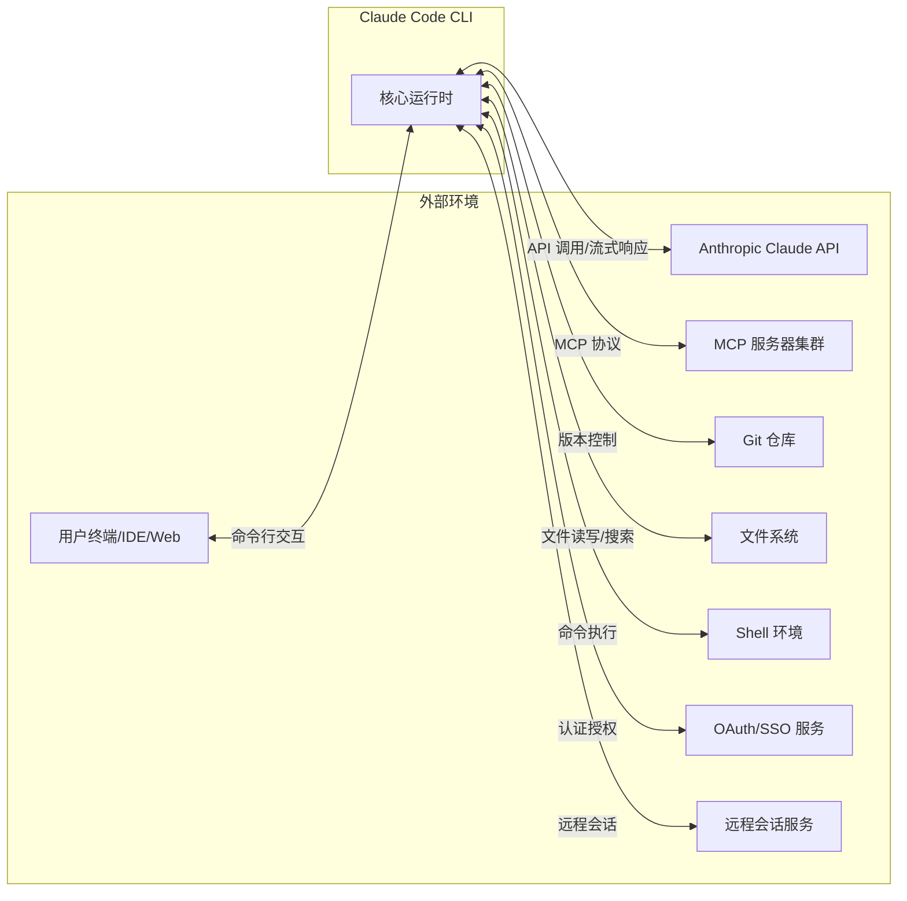

**输入边界**：
- 用户命令行参数（`process.argv`）和交互式输入
- 系统环境变量（`process.env`）
- 配置文件（`settings.json`、`.mcp.json`、`CLAUDE.md`）
- OAuth 凭证（Keychain / 环境变量）
- MCP 服务器响应（工具/资源/命令列表）
- Claude API 流式响应（文本/工具调用/思考块）

**输出边界**：
- 终端 UI 渲染（React/Ink 组件树）
- 文件系统变更（代码编辑、文件创建/删除）
- Shell 命令执行及其副作用
- Git 操作（提交、推送、PR 创建）
- API 请求（Claude API、MCP 工具调用、OAuth 令牌交换）
- 遥测与分析事件

## 2. 架构设计

### 2.1 系统分层架构

Claude Code 采用 **五层分层架构**，从上到下依次为：入口层、交互层、编排层、服务层、基础设施层。

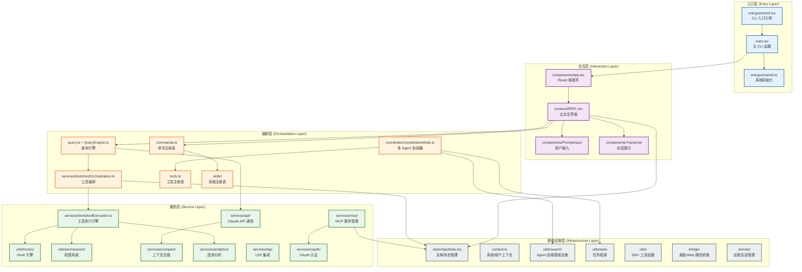

### 2.2 子模块总览

系统由 5 个核心子模块组成，各子模块的详细设计见 L1 层设计文档：

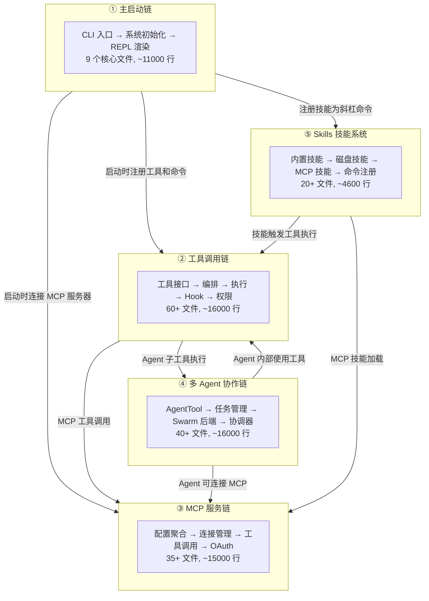

| 子模块 | L1 设计文档 | 核心职责 | 关键入口文件 |
|--------|------------|----------|-------------|
| 主启动链 | `1_主启动链_子模块设计.md` | CLI 引导、系统初始化、REPL 渲染 | `cli.tsx` → `main.tsx` → `REPL.tsx` |
| 工具调用链 | `2_工具_调用链_子模块设计.md` | 工具定义、编排、执行、权限、Hook | `Tool.ts` → `toolOrchestration.ts` → `toolExecution.ts` |
| MCP 服务链 | `3_MCP服务链_子模块设计.md` | MCP 连接、配置聚合、OAuth、工具调用 | `config.ts` → `client.ts` → `auth.ts` |
| 多 Agent 协作链 | `4_多Agent协作链_子模块设计.md` | Agent 编排、任务管理、Swarm 后端 | `AgentTool.tsx` → `runAgent.ts` → `inProcessRunner.ts` |
| Skills 技能系统 | `5_skills_子模块设计.md` | 技能注册、加载、条件激活 | `bundledSkills.ts` → `loadSkillsDir.ts` |

### 2.3 源文件组织

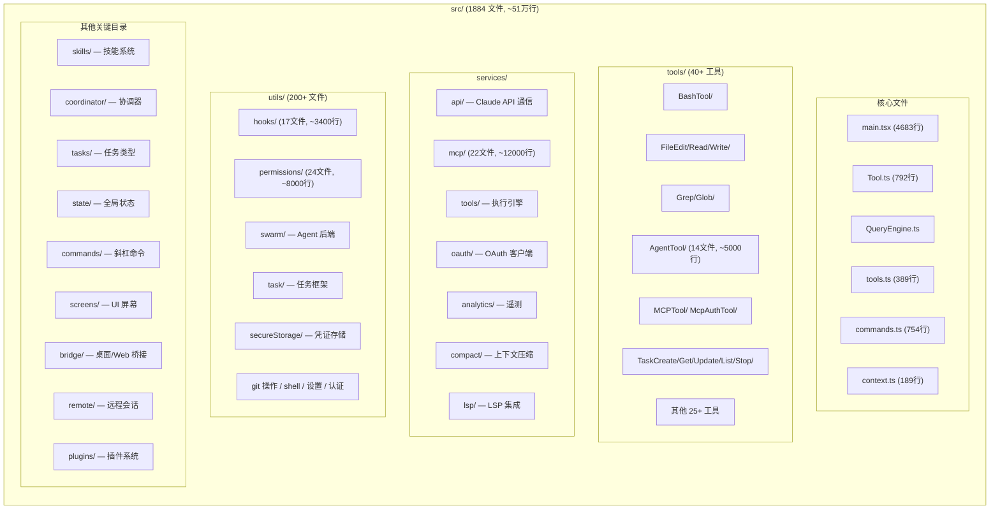

### 2.4 外部依赖

| npm 包 | 用途 | 使用范围 |
|--------|------|---------|
| `@anthropic-ai/sdk` | Claude API SDK 类型定义和客户端 | 全局（API 通信、类型定义） |
| `@modelcontextprotocol/sdk` | MCP 协议客户端和传输层 | MCP 服务链 |
| `@commander-js/extra-typings` | CLI 命令行解析 | 主启动链 |
| `react` + `ink` | 终端 UI 渲染框架 | 交互层 |
| `zod/v4` | 运行时 Schema 验证 | 工具输入验证、配置验证、数据校验 |
| `lodash-es` | 工具函数（memoize、uniqBy、mapValues 等） | 全局 |
| `bun:bundle` | 编译期特性门控（`feature()` 宏） | 全局（死代码消除） |
| `axios` | HTTP 请求（OAuth、HTTP Hook） | MCP 服务链、Hook 引擎 |
| `chalk` | 终端文本着色 | 交互层 |
| `chokidar` | 文件变化监听 | Hook 引擎 |
| `ignore` | .gitignore 模式匹配 | 权限系统、技能系统 |
| `p-map` | 并发控制的 Promise 映射 | MCP 服务链 |
| `@opentelemetry/api` | 遥测度量接口 | 遥测分析 |
| `execa` | 子进程执行 | 安全凭证存储 |

## 3. 数据结构设计

### 3.1 核心数据结构

#### AppState — 全局应用状态

贯穿整个系统的全局状态树，通过 React Context 向下传递。

| 字段 | 类型 | 说明 |
|------|------|------|
| `toolPermissionContext` | `ToolPermissionContext` | 权限模式和规则 |
| `mcp` | `MCPState` | MCP 服务器状态（工具/资源/命令） |
| `tasks` | `Map<string, TaskState>` | 后台任务注册表 |
| `sessionHooks` | `Map<string, SessionStore>` | 会话级 Hook 存储 |
| `messages` | `Message[]` | 当前对话消息列表 |

#### Tool\<Input, Output\> — 工具接口

所有工具的统一契约，定义于 `Tool.ts`。详见 L1 工具调用链设计文档。

| 核心方法 | 说明 |
|----------|------|
| `call()` | 执行工具 |
| `checkPermissions()` | 权限检查 |
| `isConcurrencySafe()` | 并发安全性声明 |
| `isReadOnly()` | 只读性声明 |
| `description()` / `prompt()` | 生成工具描述和系统提示词 |

#### Command — 命令接口

斜杠命令和技能的统一类型，支持 `prompt` 和 `action` 两种变体。

| 字段 | 说明 |
|------|------|
| `name` / `aliases` | 命令名称和别名 |
| `type` | `'prompt'` (技能) / `'action'` (动作命令) |
| `loadedFrom` | 来源（bundled/skills/plugin/managed/mcp） |
| `getPromptForCommand()` | 技能类命令的提示词生成回调 |

#### Message — 消息类型

基于 Anthropic API 的消息格式扩展，是对话系统的数据基础。

| 变体 | 说明 |
|------|------|
| `UserMessage` | 用户输入消息 |
| `AssistantMessage` | 模型响应消息（含文本、工具调用、思考块） |
| `ToolResultMessage` | 工具执行结果消息 |

#### TaskState — 任务状态联合类型

所有后台任务的顶层类型，贯穿任务管理系统。

| 变体 | 说明 |
|------|------|
| `LocalAgentTaskState` | 本地后台 Agent 任务 |
| `InProcessTeammateTaskState` | 同进程队友任务 |
| `RemoteAgentTaskState` | 云端远程 Agent 任务 |
| `LocalShellTaskState` | Shell 命令任务 |
| `DreamTaskState` | 自动记忆整合任务 |

#### MCPServerConnection — MCP 连接状态联合类型

| 变体 | 说明 |
|------|------|
| `ConnectedMCPServer` | 已连接 |
| `FailedMCPServer` | 连接失败 |
| `NeedsAuthMCPServer` | 需要认证 |
| `PendingMCPServer` | 连接中/重连中 |
| `DisabledMCPServer` | 已禁用 |

### 3.2 数据关系总图

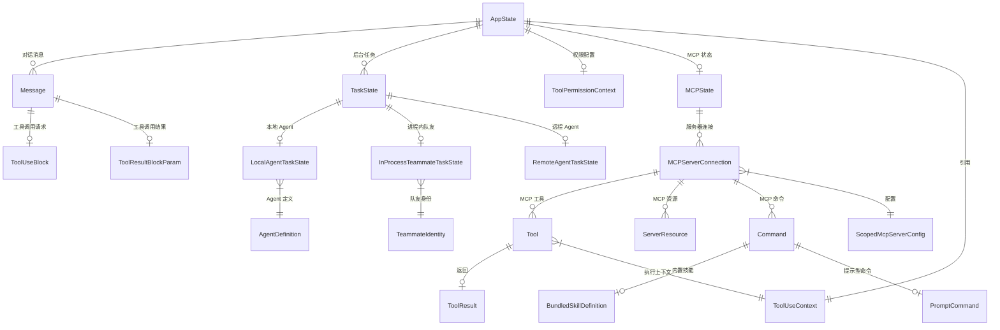

## 4. 接口设计

### 4.1 子模块间接口关系

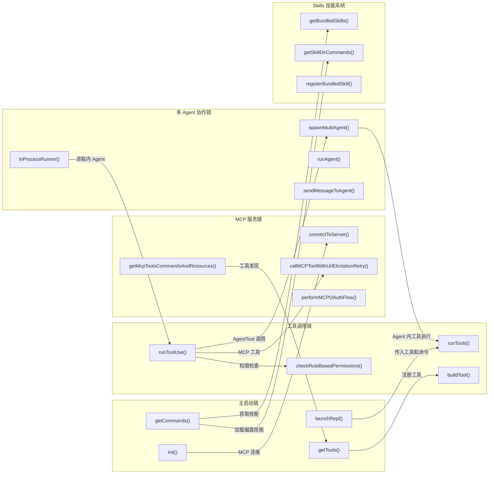

### 4.2 关键接口定义

#### 启动接口

| 函数 | 签名 | 所属模块 | 说明 |
|------|------|---------|------|
| `init()` | `() => Promise<void>` | 主启动链 | 系统初始化（配置/网络/遥测） |
| `getTools()` | `(ctx: ToolPermissionContext) => Tool[]` | 主启动链 | 获取权限过滤后的工具列表 |
| `getCommands()` | `(cwd: string) => Promise<Command[]>` | 主启动链 | 获取所有可用命令 |
| `assembleToolPool()` | `(ctx, mcpTools) => Tool[]` | 主启动链 | 组装内置+MCP 工具池 |
| `launchRepl()` | `(root, appProps, replProps, renderAndRun) => Promise<void>` | 主启动链 | 启动 REPL 界面 |

#### 工具执行接口

| 函数 | 签名 | 所属模块 | 说明 |
|------|------|---------|------|
| `runTools()` | `(blocks, msgs, canUseTool, ctx) => AsyncGenerator<MessageUpdate>` | 工具调用链 | 工具编排入口 |
| `runToolUse()` | `(block, msg, canUseTool, ctx) => AsyncGenerator<MessageUpdateLazy>` | 工具调用链 | 单工具执行 |
| `buildTool()` | `(def: ToolDef) => Tool` | 工具调用链 | 工具工厂函数 |
| `checkRuleBasedPermissions()` | `(tool, input, ctx) => Promise<PermissionDecision>` | 工具调用链 | 规则权限检查 |

#### MCP 接口

| 函数 | 签名 | 所属模块 | 说明 |
|------|------|---------|------|
| `connectToServer()` | `(name, config) => Promise<MCPServerConnection>` | MCP 服务链 | 建立 MCP 连接 |
| `getClaudeCodeMcpConfigs()` | `(dynamic?, dedupTargets?) => Promise<{servers, errors}>` | MCP 服务链 | 聚合多源配置 |
| `callMCPToolWithUrlElicitationRetry()` | `(opts) => Promise<MCPToolCallResult>` | MCP 服务链 | 调用 MCP 工具 |
| `performMCPOAuthFlow()` | `(name, config, onUrl, signal?) => Promise<void>` | MCP 服务链 | OAuth 认证流程 |

#### 多 Agent 接口

| 函数 | 签名 | 所属模块 | 说明 |
|------|------|---------|------|
| `spawnMultiAgent()` | `(params) => Promise<AgentToolResult>` | 多 Agent 协作链 | 生成子 Agent |
| `runAgent()` | `(params, ctx) => Promise<AgentToolResult>` | 多 Agent 协作链 | 运行 Agent 完整生命周期 |
| `inProcessRunner()` | `(config) => Promise<void>` | 多 Agent 协作链 | 进程内 Agent 执行引擎 |

#### 技能接口

| 函数 | 签名 | 所属模块 | 说明 |
|------|------|---------|------|
| `registerBundledSkill()` | `(def: BundledSkillDefinition) => void` | 技能系统 | 注册内置技能 |
| `getBundledSkills()` | `() => Command[]` | 技能系统 | 获取内置技能列表 |
| `getSkillDirCommands()` | `(cwd: string) => Promise<Command[]>` | 技能系统 | 加载磁盘技能 |
| `createSkillCommand()` | `(params) => Command` | 技能系统 | 技能 Command 工厂 |

## 5. 核心流程设计

### 5.1 系统启动流程

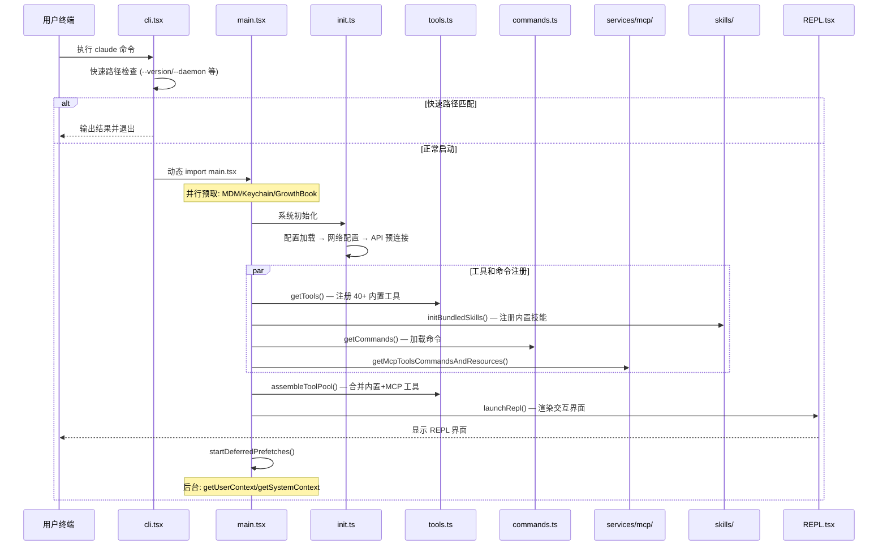

### 5.2 对话循环主流程

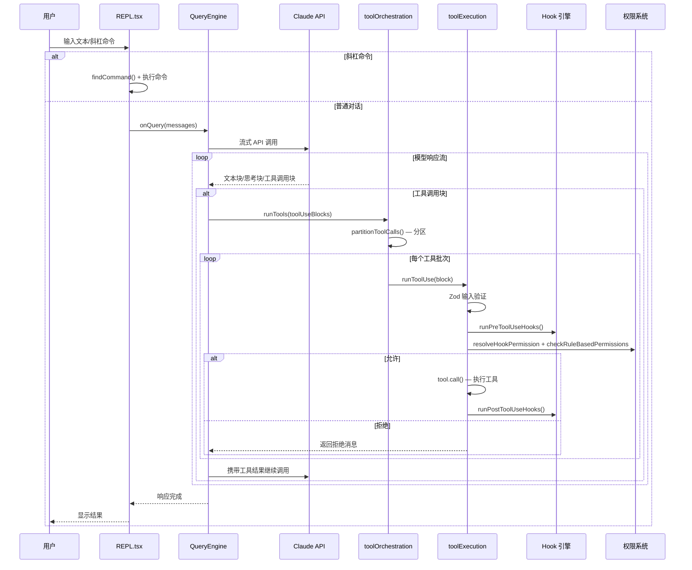

### 5.3 多 Agent 协作流程

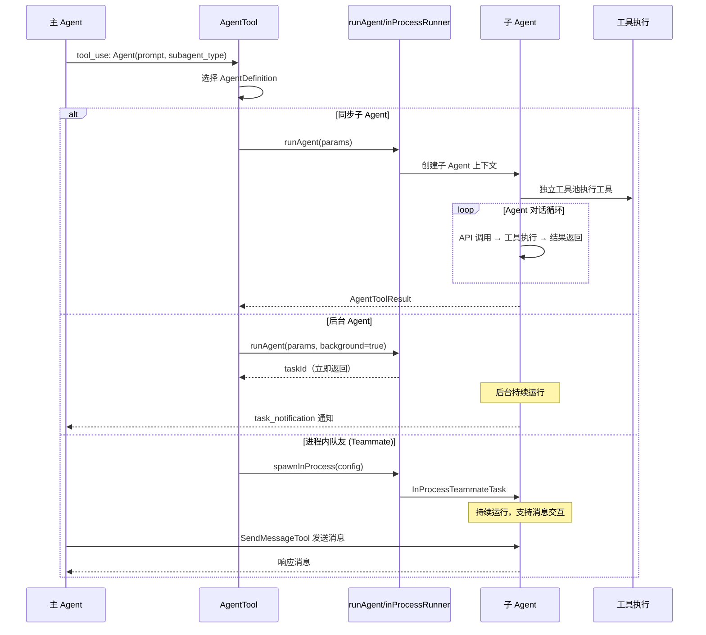

### 5.4 MCP 工具调用流程

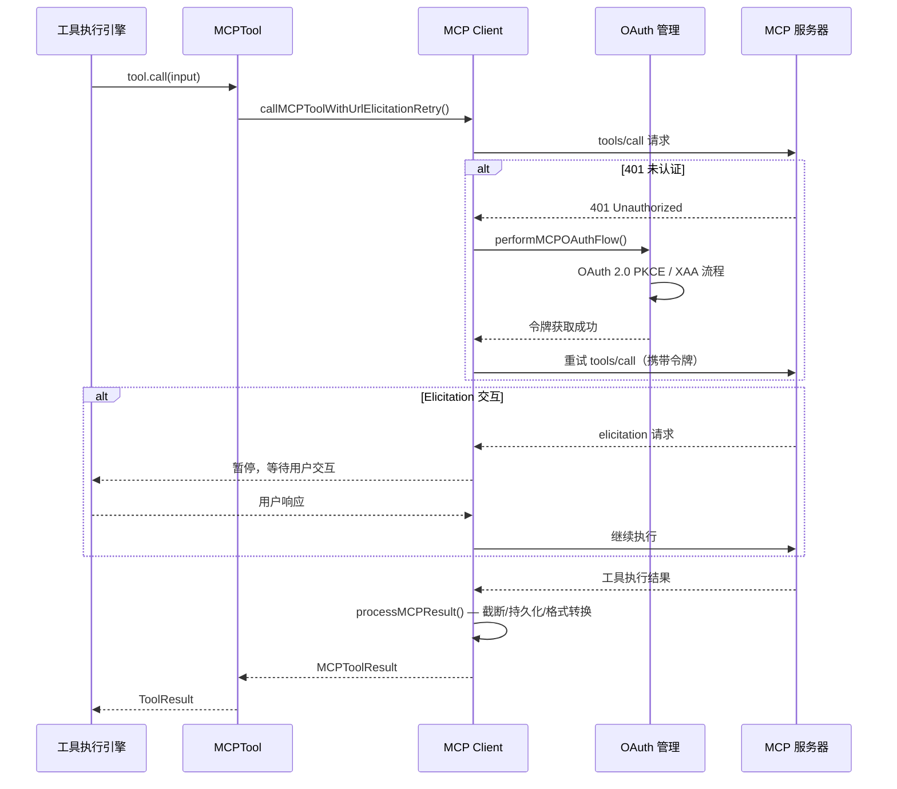

## 6. 状态管理

### 6.1 状态层次

Claude Code 的状态管理分为四个层次：

| 层次 | 机制 | 生命周期 | 典型状态 |
|------|------|---------|---------|
| **全局应用状态** | `AppState` (React Context) | 会话级 | 工具列表、权限配置、任务注册表、MCP 状态 |
| **模块级缓存** | `lodash-es/memoize` | 进程级 | `init()`、`getGitStatus`、`getSystemContext`、`COMMANDS()` |
| **组件级状态** | React `useState`/`useRef` | 组件生命周期 | `messages`、`isLoading`、`screen`、`toolUseConfirmQueue` |
| **进程级标志** | 模块变量 | 进程级 | `telemetryInitialized`、`autoModeState` |

### 6.2 系统状态转换图

```mermaid
stateDiagram-v2
    [*] --> ProcessStart: 用户执行 claude

    state 启动阶段 {
        ProcessStart --> FastPathCheck: cli.tsx main()
        FastPathCheck --> FastPathExit: 匹配快速路径
        FastPathCheck --> SystemInit: 正常启动
        SystemInit --> ToolsReady: 工具+命令注册完成
        ToolsReady --> MCPConnected: MCP 连接完成
        MCPConnected --> REPLReady: REPL 渲染完成
    }

    state 运行阶段 {
        REPLReady --> Idle: startDeferredPrefetches()

        state 对话循环 {
            Idle --> Processing: 用户提交输入
            Processing --> ToolExecution: 模型请求工具调用
            ToolExecution --> PermissionCheck: 权限校验
            PermissionCheck --> WaitingApproval: 需要用户确认
            WaitingApproval --> ToolExecution: 用户批准
            WaitingApproval --> Processing: 用户拒绝
            PermissionCheck --> ToolRunning: 权限通过
            ToolRunning --> ToolExecution: 更多工具调用
            ToolRunning --> Processing: 工具完成
            Processing --> Idle: 响应完成
        end

        state 后台任务 {
            Idle --> AgentRunning: 启动后台 Agent
            AgentRunning --> AgentComplete: Agent 任务完成
            AgentComplete --> Idle: 通知用户
        end

        Idle --> CommandExec: 斜杠命令
        CommandExec --> Idle: 命令完成
    end

    FastPathExit --> [*]
    Idle --> [*]: /exit 或 Ctrl+C

    state MCP状态机 {
        [*] --> Pending: 首次连接
        Pending --> Connected: 连接成功
        Pending --> Failed: 连接失败
        Pending --> NeedsAuth: 需要认证
        NeedsAuth --> Pending: OAuth 完成后重连
        Connected --> Pending: 断开重连
        Failed --> Pending: 手动重连
        Connected --> Disabled: 用户禁用
    }
```

### 6.3 关键状态转换条件

| 当前状态 | 触发条件 | 目标状态 | 执行动作 |
|----------|----------|----------|----------|
| ProcessStart | `cli.tsx main()` 调用 | FastPathCheck | 解析 `process.argv` |
| FastPathCheck | `--version` 等匹配 | FastPathExit | 执行快速路径处理器并退出 |
| SystemInit | `init()` + 工具注册完成 | ToolsReady | 工具池和命令注册表就绪 |
| Idle | 用户提交输入 | Processing | `queryGuard.tryStart()` |
| Processing | API 返回 `tool_use` 块 | ToolExecution | `runTools()` 编排 |
| ToolExecution | 权限检查返回 `ask` | WaitingApproval | 显示确认 UI |
| ToolRunning | `tool.call()` 完成 | Processing | 携带结果继续 API 调用 |
| Processing | API 返回 `stop` | Idle | `queryGuard.end()` + `resetLoadingState()` |

## 7. 错误处理设计

### 7.1 错误分类

| 错误类别 | 错误类型 | 所属模块 | 严重程度 |
|----------|----------|---------|---------|
| **启动错误** | `ConfigParseError` | 主启动链 | 致命（交互模式显示对话框，非交互模式退出） |
| **工具输入错误** | `InputValidationError` | 工具调用链 | 可恢复（返回错误消息，模型可修正重试） |
| **权限拒绝** | `PermissionDenyDecision` | 工具调用链 | 可恢复（返回拒绝消息） |
| **工具执行错误** | Shell/IO/Network 异常 | 工具调用链 | 可恢复（返回错误结果） |
| **MCP 连接错误** | 连接超时/认证失败 | MCP 服务链 | 降级（标记为 Failed，不影响其他功能） |
| **Hook 执行错误** | 钩子脚本失败 | 工具调用链 | 可恢复（记录日志，不阻塞主流程） |
| **API 错误** | 速率限制/网络异常 | 查询引擎 | 可重试（指数退避重试） |
| **遥测错误** | 初始化/发送失败 | 遥测分析 | 忽略（fire-and-forget） |

### 7.2 错误处理策略

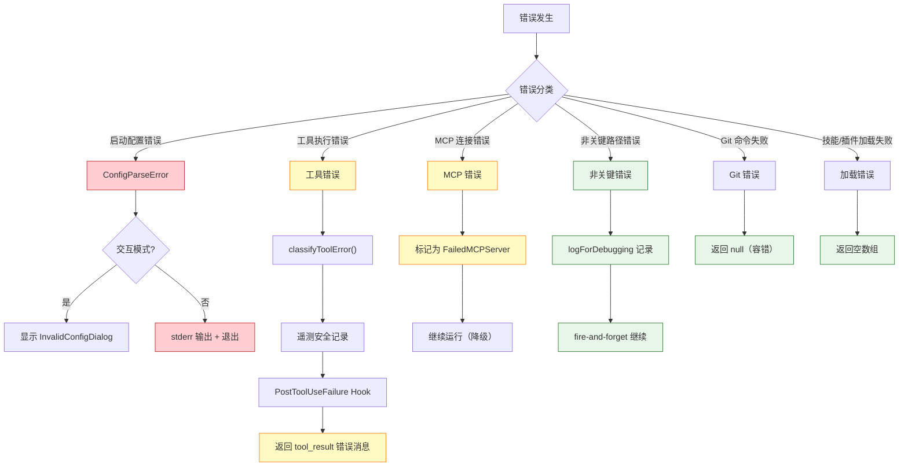

### 7.3 错误传播原则

1. **致命错误上浮**：配置解析失败等致命错误直接终止进程或显示错误对话框
2. **工具错误封装**：工具执行异常封装为 `tool_result` 错误消息返回给模型，模型可自行修正
3. **非关键路径静默**：遥测、OAuth 填充、IDE 检测等非关键初始化失败仅记录日志，不阻塞主流程
4. **MCP 降级运行**：MCP 服务器连接失败标记为 `FailedMCPServer`，不影响其他工具和服务器
5. **并发查询排队**：`queryGuard` 防止并发查询，冲突的查询入队等待而非丢弃

## 8. 并发设计

### 8.1 并发模型

Claude Code 基于 **Node.js 单线程事件循环 + 协作式并发** 模型，通过 `async/await`、`AsyncGenerator` 和 `Promise.all` 实现并发。

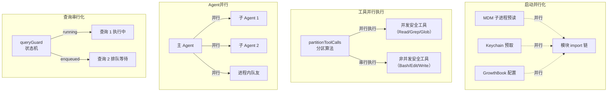

### 8.2 关键并发机制

| 机制 | 应用场景 | 实现方式 |
|------|---------|---------|
| **三阶段启动预取** | 模块加载/init/渲染后 | 模块顶部 side-effect + `void asyncFn()` + `startDeferredPrefetches()` |
| **工具并发分区** | 多工具同时调用 | `partitionToolCalls()` 按 `isConcurrencySafe` 分区 |
| **最大并发控制** | 工具并行执行上限 | `CLAUDE_CODE_MAX_TOOL_USE_CONCURRENCY`（默认 10） |
| **查询互斥** | 防止并发 API 调用 | `queryGuard.tryStart()/end()` 原子状态机 |
| **兄弟级联中止** | Bash 错误影响并行工具 | `siblingAbortController` 子级中止控制器 |
| **AsyncGenerator 流式管道** | 工具结果逐步产出 | `async function*` + `yield*` 链式管道 |
| **Git 命令并行** | 系统上下文获取 | `Promise.all([getBranch, getStatus, getLog, ...])` |
| **命令源并行加载** | 多来源命令聚合 | `Promise.all([getSkills, getPlugins, getWorkflows])` |

### 8.3 全局数据流图

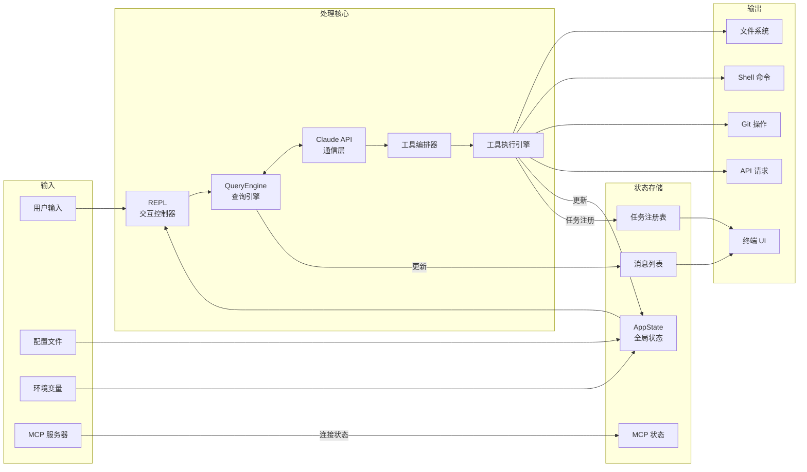

## 9. 设计约束与决策

### 9.1 全局设计模式

| 模式 | 应用位置 | 动机 |
|------|---------|------|
| **Memoize 缓存** | `init()`、`getGitStatus`、`COMMANDS()`、`getSkillDirCommands()` 等 | 避免重复的异步操作（文件 I/O、子进程、网络），保证会话内一致性 |
| **工厂模式** | `buildTool()`（工具工厂）、`createSkillCommand()`（技能工厂） | 统一创建逻辑，提供 fail-closed 安全默认值 |
| **策略模式** | `Tool.call()`、`Tool.checkPermissions()`、`PaneBackend` | 每个工具/后端实现自己的策略，通过接口统一调用 |
| **责任链** | `checkRuleBasedPermissions → resolveHookPermission → canUseTool` | 多层权限检查，按优先级依次评估 |
| **注册表模式** | `tools.ts`（工具注册）、`bundledSkills.ts`（技能注册）、`sessionHooks`（Hook 注册） | 动态注册和查找，支持运行时扩展 |
| **Provider 模式** | `App.tsx` 三层嵌套 Context Provider | React Context 向下传递 FPS、Stats、AppState |
| **Feature Flag (DCE)** | `feature()` 宏遍布全局 | 编译期死代码消除，外部构建不包含内部功能 |
| **Fire-and-Forget** | `init.ts` 中 `void someAsyncFn()` | 非关键初始化不阻塞主流程 |
| **AsyncGenerator 流式** | 工具调用链全链路 `async function*` | 流式产出结果，内存可控 |
| **Lazy Import** | `cli.tsx` 的 `await import()`、`tools.ts` 的 `require()` | 延迟加载减少启动时间，打破循环依赖 |

### 9.2 全局性能考量

1. **零导入快速路径**：`cli.tsx` 中 `--version` 等检查在任何 `import()` 之前执行，零模块加载开销
2. **三阶段并行预取**：模块加载期（MDM/Keychain）→ init 期（API 预连接/OAuth）→ 渲染后（getUserContext/getSystemContext）
3. **API 预连接**：`preconnectAnthropicApi()` 在配置完成后立即触发 TCP+TLS 握手（~100-200ms），与后续逻辑并行
4. **工具并发分区**：只读工具（FileRead/Grep/Glob）并行执行，充分利用 I/O 并发
5. **延迟工具加载**：`shouldDefer` 标记的工具不在初始 prompt 中发送 Schema，通过 `ToolSearch` 按需加载
6. **工具排序稳定性**：内置+MCP 工具分别排序后合并，保持 prompt cache 命中率
7. **React 编译器记忆化**：使用 `react/compiler-runtime` 的 `_c()` 自动优化组件渲染
8. **`--bare` 模式**：跳过 hooks、LSP、插件、CLAUDE.md 自动发现等，最小化启动开销
9. **MCP 工具缓存**：`fetchToolsForClient` 使用 LRU 缓存，避免重复的 `tools/list` 请求
10. **推测性分类器**：BashTool 在权限检查前并行启动 auto-mode 分类器，减少用户等待

### 9.3 全局扩展点

| 扩展点 | 机制 | 说明 |
|--------|------|------|
| **新增工具** | `getAllBaseTools()` 返回数组 + `buildTool()` | 添加新工具到返回数组，支持 `feature()` 条件注册 |
| **新增斜杠命令** | `COMMANDS()` 数组 | 添加新命令到注册表 |
| **新增内置技能** | `registerBundledSkill()` | 在 `initBundledSkills()` 中注册 |
| **用户自定义技能** | `.claude/skills/SKILL.md` 文件 | 用户在磁盘上创建 SKILL.md |
| **MCP 工具集成** | MCP 服务器配置 + `assembleToolPool()` | 通过 `.mcp.json` 配置 MCP 服务器 |
| **Hook 扩展** | `settings.json` hooks 配置 | 25+ 种事件类型，4 种执行方式 |
| **权限规则** | `settings.json` permissions 配置 | `allow`/`deny`/`ask` 规则，支持通配符 |
| **Agent 类型** | `.claude/agents/` 目录 | 用户自定义 Agent 定义（Markdown/JSON） |
| **插件系统** | `plugins/` | 第三方插件注册工具、命令和 MCP 服务器 |
| **快速路径** | `cli.tsx` 的 `if` 分支 | 新增 `feature()` 门控的快速路径 |

### 9.4 安全设计

| 安全机制 | 实现 | 说明 |
|----------|------|------|
| **多层权限系统** | `utils/permissions/` (24 文件, 8000+ 行) | deny 规则 → ask 规则 → 工具自有检查 → 安全检查 |
| **Hook 不可绕过 deny** | `resolveHookPermissionDecision()` | Hook 返回 allow 不会覆盖 deny 规则（深度防御） |
| **工厂 fail-closed** | `buildTool()` 默认值 | `isConcurrencySafe=false`, `isReadOnly=false`（保守默认） |
| **路径安全验证** | `pathValidation.ts` | 防止路径穿越和未授权文件访问 |
| **SSRF 防护** | `ssrfGuard.ts` | HTTP Hook 的 SSRF 攻击防护 |
| **XSS 防护** | `xss` 包 | OAuth 回调页面的 XSS 防护 |
| **安全凭证存储** | `utils/secureStorage/` | macOS Keychain 优先，纯文本回退 |
| **遥测数据安全** | `TelemetrySafeError` + `classifyToolError()` | 确保遥测不包含代码或文件路径 |
| **Auto 模式分类器** | `yoloClassifier.ts` + `bashClassifier.ts` | 对自动执行的命令进行安全分类 |

## 10. 设计评估

### 10.1 优点

1. **架构分层清晰，职责明确**：五层架构（入口→交互→编排→服务→基础设施）层次分明，依赖方向一致（上层依赖下层，不反向依赖）。每个子模块边界清晰——工具调用链不关心 UI 渲染，MCP 服务链不关心 Agent 编排

2. **启动性能工程精细**：三阶段并行预取（模块加载期/init 期/渲染后）、零导入快速路径、API 预连接、延迟工具加载等优化手段系统性地减少了 time-to-first-render，体现了对 CLI 工具启动体验的深度关注

3. **安全设计深度防御**：权限系统采用多层责任链（deny→ask→工具自有→安全检查），Hook 系统保证 allow 不能绕过 deny 规则，工具工厂的 fail-closed 默认值确保新工具安全。24 个权限相关文件、8000+ 行代码的规模反映了安全是一等公民

4. **工具系统高度可扩展**：统一的 `Tool` 接口 + `buildTool()` 工厂 + 注册表模式使得新增工具只需实现 `call()` 等核心方法。MCP 协议支持 8 种传输类型，实现了真正的开放式工具生态

5. **AsyncGenerator 流式架构**：整个工具调用链使用异步生成器构建流式管道，支持逐步产出结果，内存占用可控，用户体验流畅（无需等待所有工具完成）

6. **多 Agent 协作灵活**：支持同步/异步子 Agent、进程内队友、远程 Agent、Tmux/iTerm2 窗格等多种协作模式，通过统一的 `TeammateExecutor` 接口抽象执行差异

7. **Feature Flag 体系成熟**：`feature()` 编译期宏 + 运行时条件检查实现了精细的功能门控，确保外部构建体积最小且不暴露内部功能

8. **错误处理容错性好**：遵循"关键路径严格处理、非关键路径 fire-and-forget"原则。技能/插件加载失败不影响其他功能，MCP 连接失败降级运行，Git 命令失败返回 null 而非崩溃

### 10.2 缺点与风险

1. **超大文件问题突出**：`main.tsx`（4683 行）、`REPL.tsx`（5005 行）、`toolExecution.ts`（1745 行）、`client.ts`（3348 行）等核心文件远超可维护性阈值。`REPL.tsx` 包含 50+ 个 React Hooks，`main.tsx` 的 `run()` 函数横跨数千行

2. **遥测代码侵入性强**：`toolExecution.ts` 中 `logEvent()` 调用和 `AnalyticsMetadata_I_VERIFIED_THIS_IS_NOT_CODE_OR_FILEPATHS` 类型断言大量重复（50+ 次），严重降低核心逻辑的可读性

3. **全局状态散落**：`utils/hooks/` 的 7 个模块级全局变量分散在不同文件中；`autoModeState`、`telemetryInitialized` 等进程级标志散布各处，测试时需逐个重置

4. **MCP/非 MCP 工具处理分岔**：`toolExecution.ts` 中 MCP 工具与非 MCP 工具的结果处理走不同路径（代码注释标记为已知技术债），增加了维护复杂度

5. **权限系统过于庞大**：`utils/permissions/` 24 个文件 8000+ 行，`permissionSetup.ts`（~1600 行）、`filesystem.ts`（~1700 行）、`yoloClassifier.ts`（~1500 行）单文件过大

6. **循环依赖依赖 require() 打破**：`tools.ts`、`main.tsx`、`loadSkillsDir.ts` 等多处使用 `require()` lazy load 打破循环依赖，虽然有注释说明但本质上是架构气味

7. **memoize 缓存清除不统一**：各模块的 memoize 缓存各自管理，`clearCommandMemoizationCaches()` 和 `clearCommandsCache()` 职责重叠，缺乏统一的缓存管理机制

8. **process.exit 直接调用**：部分路径直接调用 `process.exit()` 绕过优雅关闭流程，可能导致资源泄漏

### 10.3 改进建议

1. **拆分超大文件**：
   - `main.tsx` → 提取 Commander 构建逻辑到 `cli/commandBuilder.ts`，action handler 到 `cli/setup.ts`
   - `REPL.tsx` → 提取 `useQueryEngine`、`useMessageState`、`useToolConfirmation` 自定义 Hooks
   - `toolExecution.ts` → 按阶段拆分为 `validateToolInput`、`executeToolWithTelemetry`、`processToolResult`
   - `client.ts` → 按职责拆分为连接管理、工具调用、缓存管理

2. **提取遥测装饰器**：创建 `toolTelemetry.ts` 封装遥测 metadata 构建和 `logEvent` 调用，核心执行逻辑与分析代码解耦

3. **统一缓存管理**：创建全局 `CacheRegistry`，提供 `clearAllCaches()` 和按类别清除方法，消除散落的缓存清除函数

4. **统一 MCP/非 MCP 工具处理**：消除 `addToolResult` 的双路径分支，将 MCP 工具的特殊逻辑标准化到统一的 Hook 输出管道中

5. **将 Hook 全局状态统一为单例**：创建 `HookRegistry` 类封装所有 Hook 相关状态，提供统一的 `reset()` 方法

6. **解决循环依赖**：通过依赖注入或事件总线替代 `require()` lazy load，消除架构气味

7. **替代 process.exit**：在所有退出路径使用 `gracefulShutdownSync()` 替代 `process.exit()`，确保清理钩子被执行

8. **权限系统按关注点拆分**：`permissions/rules/`（规则管理）、`permissions/classifiers/`（分类器）、`permissions/filesystem/`（路径安全），并将超长文件按类拆分
